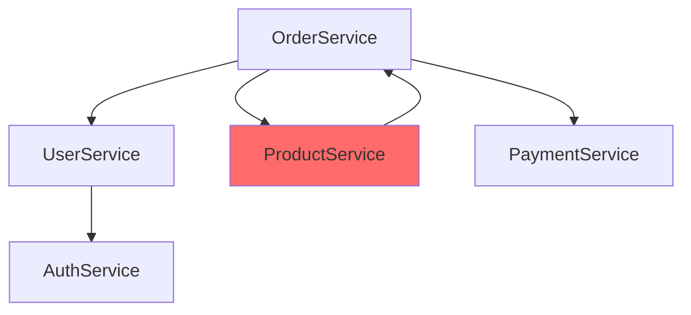

# 代码健康守护者 (Code Health Guardian)

帮助开发团队持续监控代码质量，识别技术债务，提供重构建议，支持架构渐进式演进。

## 命令入口

| 命令 | 说明 |
|------|------|
| `/health` | 显示帮助和可用命令 |
| `/health check` | 对当前代码库进行全面体检 |
| `/health check <path>` | 对指定目录/文件进行体检 |
| `/health duplicates` | 检测重复代码 |
| `/health complexity` | 分析代码复杂度 |
| `/health smells` | 检测代码异味 |
| `/health deps` | 分析依赖关系 |
| `/health refactor <path>` | 为指定代码生成重构建议 |
| `/health debt add <描述>` | 添加技术债务记录 |
| `/health debt list` | 查看技术债务列表 |
| `/health debt sync` | 同步技术债务到飞书 |
| `/health report` | 生成完整健康报告 |
| `/health evolve` | 生成架构演进计划 |
| `/health api-check` | 检测前后端 API 契约一致性 |
| `/health api-check --path <api-path>` | 检测指定 API 路径的一致性 |

## 意图识别关键词

| 功能 | 触发词 |
|------|--------|
| 代码体检 | 代码体检、代码健康、健康检查、代码检查 |
| 重复检测 | 重复代码、代码重复、DRY、copy-paste |
| 复杂度分析 | 代码复杂度、圈复杂度、认知复杂度、太复杂 |
| 代码异味 | 代码异味、code smell、坏味道、脏代码 |
| 技术债务 | 技术债务、tech debt、债务、TODO、FIXME |
| 重构建议 | 重构、refactor、优化代码、清理代码 |
| 架构分析 | 架构检查、依赖分析、架构腐化、耦合 |
| API 契约检测 | API一致性、前后端不一致、接口对不上、字段不匹配、路径不对、API契约 |

## 配置信息

### 飞书集成配置

技术债务可同步到飞书多维表格：

**多维表格 App Token**: `Y05Mb7greapFiSseRpoc5XkXnrb`
**技术债务表 ID**: `tblu4HHVNsj6LoOR`
**表格链接**: https://j13juzq4tyn.feishu.cn/base/Y05Mb7greapFiSseRpoc5XkXnrb?table=tblu4HHVNsj6LoOR

### 项目类型配置

在项目根目录创建 `.code-health.json` 配置文件：

```json
{
  "projectType": "fullstack",
  "frontend": {
    "type": "react",
    "srcDir": "src",
    "testDir": "src/__tests__"
  },
  "backend": {
    "type": "java",
    "srcDir": "src/main/java",
    "testDir": "src/test/java"
  },
  "apiContract": {
    "enabled": true,
    "frontend": {
      "srcDir": "frontend/src",
      "apiPatterns": [
        "services/**/*.ts",
        "api/**/*.ts",
        "hooks/use*.ts"
      ],
      "fetchPatterns": ["fetch\\(", "axios\\.", "useQuery", "useMutation", "api\\."]
    },
    "backend": {
      "srcDir": "backend/src/main/java",
      "controllerPatterns": ["**/controller/**/*.java", "**/*Controller.java"],
      "dtoPatterns": ["**/dto/**/*.java", "**/*DTO.java", "**/*Request.java", "**/*Response.java"]
    },
    "apiBasePath": "/api",
    "ignorePatterns": ["/health", "/actuator/**"]
  },
  "thresholds": {
    "duplicateLines": 6,
    "maxFileLines": 300,
    "maxFunctionLines": 50,
    "maxComplexity": 10,
    "maxDependencies": 10
  },
  "ignore": [
    "node_modules",
    "target",
    "build",
    "dist",
    "*.min.js"
  ],
  "lark": {
    "enabled": true,
    "appToken": "Y05Mb7greapFiSseRpoc5XkXnrb",
    "debtTableId": ""
  }
}
```

## 核心能力

### 1. 代码体检 (Health Check)

对代码库进行全面检查，生成健康报告。

**检测项目**：

| 检测项 | 说明 | 阈值 |
|--------|------|------|
| 文件大小 | 单文件行数过多 | > 300 行警告 |
| 函数长度 | 单函数行数过多 | > 50 行警告 |
| 圈复杂度 | 分支复杂度 | > 10 警告 |
| 重复代码 | 连续相似代码块 | > 6 行警告 |
| 依赖数量 | 单文件导入过多 | > 10 个警告 |
| TODO/FIXME | 遗留标记 | 统计数量 |

**使用示例**：
```bash
/health check                    # 全量检查
/health check src/modules/order  # 检查指定目录
/health check --severity high    # 只显示高严重度问题
```

**输出示例**：
```
📊 代码健康报告 - 2025-01-04

总览:
  ├── 文件总数: 156
  ├── 代码行数: 23,456
  ├── 健康评分: 72/100 ⚠️
  └── 问题数量: 23 (🔴 5 | 🟡 12 | 🟢 6)

🔴 严重问题 (5):
  1. src/modules/order/OrderService.java
     - 文件过大: 856 行 (阈值: 300)
     - 圈复杂度过高: processOrder() = 25

  2. src/components/Dashboard/index.tsx
     - 函数过长: renderChart() = 120 行
     - 重复代码: 与 Analytics/index.tsx 有 45 行重复

🟡 警告 (12):
  3. src/utils/helpers.ts
     - TODO 标记: 8 处未处理
  ...

建议优先处理:
  1. 拆分 OrderService.java 为多个专职服务
  2. 提取 renderChart 中的重复逻辑为公共组件
```

### 2. 重复代码检测 (Duplicates)

识别代码库中的重复代码块，建议提取公共逻辑。

**检测策略**：
- **精确匹配**: 完全相同的代码块
- **相似匹配**: 结构相似但变量名不同的代码
- **跨文件检测**: 检测不同文件间的重复

**React 前端特定检测**：
- 重复的 JSX 结构 → 建议提取为组件
- 重复的 hooks 逻辑 → 建议提取为自定义 hook
- 重复的样式定义 → 建议使用 CSS 变量或主题

**Java 后端特定检测**：
- 重复的业务逻辑 → 建议提取为服务方法
- 重复的 DTO 转换 → 建议使用 MapStruct
- 重复的异常处理 → 建议使用 AOP

**使用示例**：
```bash
/health duplicates                      # 检测所有重复
/health duplicates src/components       # 检测指定目录
/health duplicates --min-lines 10       # 设置最小行数
/health duplicates --suggest-refactor   # 附带重构建议
```

**输出示例**：
```
🔍 重复代码检测报告

发现 8 组重复代码:

重复组 #1 (高优先级):
  相似度: 95%
  行数: 45 行
  位置:
    - src/components/Dashboard/Chart.tsx:23-68
    - src/components/Analytics/Chart.tsx:15-60

  重复内容预览:
  ```tsx
  const handleChartData = (data) => {
    const formatted = data.map(item => ({
      x: item.date,
      y: item.value,
      ...
  ```

  💡 重构建议:
  提取为公共组件 `src/components/common/ChartContainer.tsx`
  或自定义 hook `src/hooks/useChartData.ts`

重复组 #2 (中优先级):
  ...
```

### 3. 复杂度分析 (Complexity)

分析代码复杂度，识别过于复杂的函数和模块。

**复杂度指标**：

| 指标 | 说明 | 健康范围 |
|------|------|---------|
| 圈复杂度 (Cyclomatic) | 分支路径数量 | 1-10 |
| 认知复杂度 (Cognitive) | 理解难度 | 1-15 |
| 嵌套深度 | 最大嵌套层级 | 1-4 |
| 参数数量 | 函数参数个数 | 1-5 |
| 依赖扇入/扇出 | 被依赖/依赖数量 | - |

**使用示例**：
```bash
/health complexity                         # 分析全部
/health complexity src/services            # 分析指定目录
/health complexity --top 10                # 显示最复杂的10个
/health complexity --threshold 15          # 只显示复杂度>15的
```

**输出示例**：
```
📈 复杂度分析报告

最复杂的函数 (Top 10):

| 排名 | 函数 | 圈复杂度 | 认知复杂度 | 行数 | 建议 |
|------|------|---------|-----------|------|------|
| 1 | OrderService.processOrder() | 25 | 32 | 180 | 🔴 立即重构 |
| 2 | PaymentHandler.validate() | 18 | 24 | 95 | 🔴 拆分职责 |
| 3 | Dashboard.render() | 15 | 20 | 120 | 🟡 考虑拆分 |
| 4 | UserForm.handleSubmit() | 12 | 15 | 60 | 🟡 简化逻辑 |
| 5 | utils/validator.ts:validate | 10 | 12 | 45 | 🟢 可接受 |

🔴 高复杂度函数详解:

1. OrderService.processOrder() [复杂度: 25]

   问题分析:
   - 包含 12 个 if/else 分支
   - 嵌套深度达到 6 层
   - 混合了验证、计算、持久化逻辑

   重构建议:
   - 提取验证逻辑到 OrderValidator
   - 提取价格计算到 PriceCalculator
   - 使用策略模式处理不同订单类型

   示例重构方案:
   ```java
   // Before
   public void processOrder(Order order) {
     if (order.getType() == OrderType.NORMAL) {
       if (order.getAmount() > 100) {
         // 50+ lines of logic
       } else {
         // 30+ lines of logic
       }
     } else if (order.getType() == OrderType.VIP) {
       // another 50+ lines
     }
   }

   // After
   public void processOrder(Order order) {
     orderValidator.validate(order);
     OrderProcessor processor = processorFactory.getProcessor(order.getType());
     processor.process(order);
   }
   ```
```

### 4. 代码异味检测 (Code Smells)

识别常见的代码异味，提供修复建议。

**React 前端异味**：

| 异味 | 说明 | 建议 |
|------|------|------|
| 巨型组件 | 组件超过 200 行 | 拆分为子组件 |
| Props 透传 | props 透传超过 2 层 | 使用 Context 或状态管理 |
| 内联样式滥用 | 大量 inline style | 使用 CSS Modules 或 styled |
| useEffect 过载 | 单个 useEffect 做太多事 | 拆分为多个 effect |
| 回调地狱 | 嵌套回调过深 | 使用 async/await |
| 魔法数字 | 硬编码的数值 | 提取为常量 |
| any 滥用 | TypeScript any 过多 | 定义正确类型 |

**Java 后端异味**：

| 异味 | 说明 | 建议 |
|------|------|------|
| God Class | 类职责过多 | 拆分为多个类 |
| 长方法 | 方法超过 50 行 | 提取子方法 |
| 参数过多 | 参数超过 5 个 | 使用对象封装 |
| 特性依恋 | 过度使用其他类方法 | 移动方法到合适的类 |
| 数据泥团 | 相同字段组频繁出现 | 提取为独立类 |
| 注释过多 | 用注释解释复杂代码 | 重构代码使其自解释 |
| 硬编码配置 | 配置值写死在代码中 | 使用配置文件 |

**使用示例**：
```bash
/health smells                    # 检测所有异味
/health smells --type react       # 只检测 React 相关
/health smells --type java        # 只检测 Java 相关
/health smells --severity high    # 只显示严重异味
```

### 5. 依赖关系分析 (Dependencies)

分析模块间的依赖关系，识别循环依赖和过度耦合。

**检测内容**：
- 循环依赖检测
- 依赖扇入/扇出分析
- 分层架构违规检测
- 核心模块识别

**使用示例**：
```bash
/health deps                      # 生成依赖图
/health deps --circular           # 检测循环依赖
/health deps --coupling           # 分析耦合度
/health deps src/modules/order    # 分析指定模块
```

**输出示例**：
```
🔗 依赖关系分析

模块依赖图:


⚠️ 检测到循环依赖:
  OrderService → ProductService → OrderService

耦合度分析:
| 模块 | 扇入 | 扇出 | 耦合评级 |
|------|------|------|---------|
| OrderService | 5 | 8 | 🔴 过高 |
| UserService | 3 | 4 | 🟢 正常 |
| ProductService | 4 | 6 | 🟡 偏高 |

建议:
1. 打破 OrderService ↔ ProductService 循环依赖
   - 提取公共接口 OrderProductPort
   - 使用事件驱动解耦
```

### 6. 重构助手 (Refactor Assistant)

为指定代码生成详细的重构方案。

**支持的重构模式**：

| 模式 | 说明 | 适用场景 |
|------|------|---------|
| 提取方法 | 将代码块提取为方法 | 长方法、重复代码 |
| 提取组件 | 将 JSX 提取为组件 | 重复 UI、大组件 |
| 提取 Hook | 将逻辑提取为自定义 Hook | 重复状态逻辑 |
| 提取类 | 将职责提取为新类 | God Class |
| 策略模式 | 用策略替换条件分支 | 复杂条件逻辑 |
| 工厂模式 | 用工厂替换直接实例化 | 复杂对象创建 |
| 接口隔离 | 拆分大接口 | 接口过于臃肿 |

**使用示例**：
```bash
/health refactor src/services/OrderService.java
/health refactor src/components/Dashboard --pattern extract-component
/health refactor --auto-apply   # 自动应用简单重构
```

**输出示例**：
```
🛠️ 重构建议 - OrderService.java

当前问题:
  - 文件行数: 856 (建议: <300)
  - 最高复杂度: 25 (建议: <10)
  - 职责混杂: 订单处理 + 价格计算 + 库存检查 + 通知发送

推荐重构方案:

方案一: 职责拆分 (推荐)
┌─────────────────────────────────────────┐
│             OrderService                │
│  (原: 856行, 复杂度25)                  │
└─────────────────────────────────────────┘
                    ↓ 拆分为
┌─────────────┐ ┌─────────────┐ ┌─────────────┐ ┌─────────────┐
│OrderService │ │PriceService │ │StockService │ │NotifyService│
│  (核心流程)  │ │ (价格计算)  │ │ (库存检查)  │ │ (消息通知)  │
│   ~150行    │ │   ~120行    │ │   ~100行    │ │   ~80行     │
└─────────────┘ └─────────────┘ └─────────────┘ └─────────────┘

重构步骤:
1. 创建 PriceCalculationService
   - 提取 calculateOrderPrice()
   - 提取 applyDiscounts()
   - 提取 calculateTax()

2. 创建 StockValidationService
   - 提取 checkStock()
   - 提取 reserveStock()
   - 提取 releaseStock()

3. 创建 OrderNotificationService
   - 提取 sendConfirmation()
   - 提取 notifyWarehouse()

4. 重构 OrderService
   - 注入新服务
   - 简化为编排逻辑

生成代码骨架? [Y/n]
```

### 7. 技术债务管理 (Tech Debt)

记录、追踪和管理技术债务，支持同步到飞书。

**债务分类**：

| 类型 | 说明 | 优先级计算 |
|------|------|-----------|
| 设计债务 | 架构、设计模式问题 | 影响范围 × 修复成本 |
| 代码债务 | 代码质量问题 | 复杂度 × 变更频率 |
| 测试债务 | 测试覆盖不足 | 风险等级 × 核心程度 |
| 文档债务 | 文档缺失或过时 | 模块重要性 |
| 依赖债务 | 过时或有风险的依赖 | 安全风险 × 升级难度 |

**使用示例**：
```bash
# 添加债务
/health debt add "OrderService 过于臃肿，需要拆分为多个服务" --type design --priority high --module order

# 查看债务
/health debt list                    # 所有债务
/health debt list --priority high    # 高优先级
/health debt list --type code        # 代码类债务
/health debt list --module order     # 指定模块

# 更新债务状态
/health debt update DEBT-001 --status in_progress
/health debt resolve DEBT-001 --note "已拆分为4个服务"

# 同步到飞书
/health debt sync                    # 同步所有待办债务
/health debt sync --full             # 全量同步

# 生成债务报告
/health debt report                  # 生成 Markdown 报告
/health debt report --upload         # 生成并上传到飞书
```

**本地存储**：

技术债务存储在 `.code-health/debts.json`：

```json
{
  "debts": [
    {
      "id": "DEBT-001",
      "title": "OrderService 过于臃肿",
      "description": "需要拆分为多个服务",
      "type": "design",
      "priority": "high",
      "module": "order",
      "file": "src/services/OrderService.java",
      "createdAt": "2025-01-04",
      "status": "open",
      "estimatedEffort": "3d",
      "larkRecordId": "rec_xxx"
    }
  ]
}
```

**飞书同步**：

债务将同步到飞书多维表格，表结构：

| 字段 | 类型 | 说明 |
|------|------|------|
| 标识 | Text | DEBT-001 |
| 标题 | Text | 债务描述 |
| 类型 | SingleSelect | design/code/test/doc/dependency |
| 优先级 | SingleSelect | 🔴 高 / 🟡 中 / 🟢 低 |
| 模块 | Text | 所属模块 |
| 状态 | SingleSelect | 待处理/处理中/已解决 |
| 预估工作量 | Text | 1d/3d/1w |
| 负责人 | User | 处理人 |
| 创建日期 | Date | - |
| 解决日期 | Date | - |

### 8. 架构演进 (Architecture Evolution)

帮助规划和执行渐进式架构演进。

**使用示例**：
```bash
/health evolve                        # 分析当前架构并建议演进方向
/health evolve --target modular       # 规划向模块化演进
/health evolve --target clean-arch    # 规划向整洁架构演进
/health evolve --generate-plan        # 生成详细演进计划
```

**输出示例**：
```
🏗️ 架构演进分析

当前架构状态:
  类型: 分层单体 (Layered Monolith)
  健康度: 65/100
  主要问题:
    - Service 层过于臃肿
    - 缺乏领域边界
    - 横切关注点分散

推荐演进方向: 模块化单体 (Modular Monolith)

演进路线图:

Phase 1: 基础整理 (2周)
├── 1.1 统一异常处理
├── 1.2 统一日志规范
├── 1.3 提取公共工具类
└── 1.4 清理循环依赖

Phase 2: 领域划分 (3周)
├── 2.1 识别核心领域边界
├── 2.2 按领域重组包结构
├── 2.3 定义模块间接口
└── 2.4 实现模块隔离

Phase 3: 服务优化 (2周)
├── 3.1 拆分 God Class
├── 3.2 应用设计模式
├── 3.3 引入领域事件
└── 3.4 优化数据访问

Phase 4: 质量保障 (1周)
├── 4.1 补充单元测试
├── 4.2 添加架构测试
├── 4.3 更新文档
└── 4.4 团队培训

是否生成详细任务清单并同步到飞书? [Y/n]
```

### 9. API 契约一致性检测 (API Contract Consistency)

检测前后端 API 调用与定义的一致性，发现路径、方法、字段名不匹配的问题。

**检测内容**：

| 检测项 | 说明 | 严重级别 |
|--------|------|---------|
| 路径不匹配 | 前端调用的 API 路径在后端不存在 | 🔴 严重 |
| 方法不匹配 | HTTP 方法不一致（如前端用 POST，后端定义 PUT） | 🔴 严重 |
| 请求字段缺失 | 前端发送的字段在后端 DTO 中不存在 | 🟡 警告 |
| 响应字段缺失 | 前端使用的响应字段在后端返回中不存在 | 🟡 警告 |
| 字段名大小写 | 驼峰/下划线命名不一致 | 🟡 警告 |
| 字段类型不匹配 | 前端期望的类型与后端不同 | 🟡 警告 |
| 未使用的 API | 后端定义但前端未调用的 API | 🟢 提示 |
| 硬编码路径 | 前端硬编码 API 路径而非使用常量 | 🟢 提示 |

**前端扫描规则**：

```typescript
// 检测以下模式的 API 调用
fetch('/api/stores')                    // fetch 调用
axios.get('/api/stores')                // axios 调用
useQuery(['stores'], () => api.get())   // TanStack Query
useMutation(createStore)                // TanStack Mutation
api.stores.list()                       // 封装的 API 客户端
```

**后端扫描规则**：

```java
// 检测 Controller 中的 API 定义
@RestController
@RequestMapping("/api/stores")
public class StoreController {

    @GetMapping                         // GET /api/stores
    public List<StoreDTO> list() {}

    @GetMapping("/{id}")                // GET /api/stores/{id}
    public StoreDTO getById(@PathVariable UUID id) {}

    @PostMapping                        // POST /api/stores
    public StoreDTO create(@RequestBody CreateStoreRequest request) {}

    @PutMapping("/{id}")                // PUT /api/stores/{id}
    public StoreDTO update(@PathVariable UUID id, @RequestBody UpdateStoreRequest request) {}
}
```

**使用示例**：
```bash
/health api-check                           # 全量检测
/health api-check --path /api/stores        # 检测指定 API
/health api-check --severity high           # 只显示严重问题
/health api-check --fix-suggestions         # 附带修复建议
/health api-check --export json             # 导出为 JSON 报告
```

**输出示例**：
```
🔗 API 契约一致性检测报告

扫描结果:
  ├── 后端 API 总数: 48
  ├── 前端调用总数: 52
  ├── 匹配成功: 45
  └── 问题数量: 7 (🔴 2 | 🟡 4 | 🟢 1)

🔴 严重问题 (2):

1. 路径不存在
   前端调用: GET /api/stores/search
   位置: frontend/src/services/storeService.ts:23
   问题: 后端未定义此 API
   建议:
     - 检查路径是否拼写错误
     - 或在后端 StoreController 中添加 @GetMapping("/search")

2. HTTP 方法不匹配
   前端调用: POST /api/halls/{id}
   位置: frontend/src/features/hall/api.ts:45
   后端定义: PUT /api/halls/{id}
   位置: backend/.../HallController.java:67
   建议: 将前端调用改为 PUT 方法

🟡 警告 (4):

3. 请求字段不存在
   API: POST /api/stores
   前端发送字段: { name, code, region, manager }
   后端 DTO 字段: { name, code, region }
   多余字段: manager
   位置:
     - frontend/src/services/storeService.ts:34
     - backend/.../CreateStoreRequest.java
   建议:
     - 从前端移除 manager 字段
     - 或在 CreateStoreRequest 中添加 manager 字段

4. 响应字段不存在
   API: GET /api/stores/{id}
   前端使用字段: store.managerName
   后端返回字段: { id, name, code, region, status }
   缺失字段: managerName
   位置:
     - frontend/src/pages/StoreDetail.tsx:56
     - backend/.../StoreDTO.java
   建议: 在 StoreDTO 中添加 managerName 字段

5. 字段命名风格不一致
   API: GET /api/halls
   前端期望: createdAt (驼峰)
   后端返回: created_at (下划线)
   建议: 统一使用驼峰命名，在后端配置 Jackson 序列化

6. 字段类型不匹配
   API: POST /api/reservations
   字段: capacity
   前端类型: string (从表单获取)
   后端类型: Integer
   建议: 前端提交前转换为数字类型

🟢 提示 (1):

7. 未使用的 API
   后端定义: DELETE /api/stores/{id}/archive
   位置: backend/.../StoreController.java:89
   建议: 确认此 API 是否需要，或在前端实现调用

---

📊 API 覆盖率统计:

| 模块 | 后端 API | 前端调用 | 覆盖率 | 一致性 |
|------|---------|---------|--------|--------|
| stores | 8 | 7 | 87.5% | 🟡 85% |
| halls | 6 | 6 | 100% | 🟢 100% |
| reservations | 12 | 10 | 83.3% | 🟡 80% |
| products | 15 | 18 | 100% | 🔴 70% |
| orders | 7 | 5 | 71.4% | 🟡 90% |

💡 修复建议优先级:
1. [高] 修复 2 个路径/方法不匹配问题
2. [中] 统一字段命名风格
3. [低] 清理未使用的 API 或补充前端调用
```

**字段映射分析**：

对于复杂的请求/响应对象，提供详细的字段对比：

```
📋 字段映射分析: POST /api/stores

前端 Request (CreateStoreForm):          后端 DTO (CreateStoreRequest):
├── name: string          ✅ ────────>  ├── name: String
├── code: string          ✅ ────────>  ├── code: String
├── region: string        ✅ ────────>  ├── region: String
├── manager: string       ❌ 未映射     │
├── address: string       ✅ ────────>  ├── address: String
└── phone: string         ⚠️ 类型不匹配 └── phone: Long

后端 Response (StoreDTO):                前端 Type (Store):
├── id: UUID              ✅ ────────>  ├── id: string
├── name: String          ✅ ────────>  ├── name: string
├── code: String          ✅ ────────>  ├── code: string
├── status: String        ✅ ────────>  ├── status: string
├── createdAt: Instant    ⚠️ 命名不一致 ├── created_at: string
└── updatedAt: Instant    ⚠️ 命名不一致 └── updated_at: string
```

### 10. 健康报告 (Report)

生成完整的代码健康报告。

**使用示例**：
```bash
/health report                    # 生成完整报告
/health report --format markdown  # Markdown 格式
/health report --format html      # HTML 格式
/health report --upload           # 上传到飞书文档
/health report --compare last     # 与上次报告对比
```

**报告内容**：
- 健康评分趋势
- 问题分类统计
- 模块健康排名
- 技术债务概览
- 重构优先级建议
- 与上次对比变化

## 工作流程

### 日常使用流程

```
开发者日常:
1. 开发新功能
2. 提交前运行 /health check
3. 修复高优先级问题
4. 记录无法立即修复的问题为技术债务
5. 提交代码

团队周报:
1. 运行 /health report
2. 同步技术债务到飞书
3. 评审债务优先级
4. 规划偿还计划
```

### 集成 SDD 开发流程

```
1. Spec 阶段
   - 评估现有代码健康度
   - 识别需要先重构的模块

2. 开发阶段
   - 持续运行代码检查
   - 遵循重构建议

3. 完成阶段
   - 生成健康报告
   - 确认无新增债务
   - 更新架构文档
```

## 执行指南

### 检测重复代码

```
1. 遍历指定目录下所有源文件
2. 使用滑动窗口提取代码块 (默认 6 行)
3. 对代码块进行标准化处理:
   - 移除空白行和注释
   - 变量名替换为占位符
   - 计算代码块哈希
4. 比对哈希值找出重复
5. 按重复行数排序
6. 生成重构建议
```

### 计算复杂度

```
圈复杂度计算:
1. 解析代码 AST
2. 统计决策点数量:
   - if/else: +1
   - switch case: +1 per case
   - for/while/do: +1
   - catch: +1
   - &&/||: +1
   - ?: +1
3. 复杂度 = 决策点数 + 1

认知复杂度计算:
1. 基础复杂度 = 控制结构数量
2. 嵌套惩罚 = 嵌套深度 × 嵌套结构数
3. 认知复杂度 = 基础 + 嵌套惩罚
```

### 同步技术债务到飞书

```
mcp__lark-mcp__bitable_v1_appTableRecord_create
- path.app_token: "Y05Mb7greapFiSseRpoc5XkXnrb"
- path.table_id: "{debtTableId}"
- data.fields: {
    "标识": "DEBT-001",
    "标题": "OrderService 过于臃肿",
    "类型": "设计债务",
    "优先级": "🔴 高",
    "状态": "📝 待处理",
    "模块": "order",
    "预估工作量": "3d"
  }
```

## 阈值配置

### 默认阈值

| 指标 | 警告阈值 | 严重阈值 |
|------|---------|---------|
| 文件行数 | 300 | 500 |
| 函数行数 | 50 | 100 |
| 圈复杂度 | 10 | 20 |
| 认知复杂度 | 15 | 30 |
| 嵌套深度 | 4 | 6 |
| 函数参数 | 5 | 8 |
| 重复代码行数 | 6 | 20 |
| 依赖数量 | 10 | 20 |

### 自定义阈值

在 `.code-health.json` 中配置：

```json
{
  "thresholds": {
    "maxFileLines": 300,
    "maxFunctionLines": 50,
    "maxComplexity": 10,
    "maxCognitiveComplexity": 15,
    "maxNestingDepth": 4,
    "maxParameters": 5,
    "duplicateLines": 6,
    "maxDependencies": 10
  }
}
```

## 注意事项

1. **渐进式改进**: 不要试图一次修复所有问题，优先处理高价值、低成本的改进
2. **避免过度优化**: 如果代码工作正常且很少修改，低优先级问题可以接受
3. **团队共识**: 重大重构前确保团队理解并同意方案
4. **测试保障**: 重构前确保有足够的测试覆盖
5. **小步快跑**: 每次重构改动尽量小，频繁提交，便于回滚

---

## 变更日志

### v1.1.0 (2025-01-05)

**新增功能**:
- API 契约一致性检测 (`/health api-check`)
  - 检测前端调用路径与后端定义是否匹配
  - 检测 HTTP 方法一致性
  - 检测请求/响应字段映射
  - 检测字段命名风格（驼峰 vs 下划线）
  - 检测字段类型匹配
  - 识别未使用的后端 API
  - 生成 API 覆盖率统计

**新增配置**:
- `.code-health.json` 新增 `apiContract` 配置项
- 支持自定义前端 API 调用模式
- 支持自定义后端 Controller 和 DTO 路径

**新增触发词**:
- API一致性、前后端不一致、接口对不上、字段不匹配、路径不对、API契约

### v1.0.0 (2025-01-04)

**初始版本**:
- 代码体检功能：文件大小、函数长度、复杂度检测
- 重复代码检测：精确匹配和相似匹配
- 代码异味识别：React 和 Java 专项检测
- 依赖关系分析：循环依赖检测、耦合度分析
- 重构助手：多种重构模式建议
- 技术债务管理：本地存储 + 飞书同步
- 架构演进规划：渐进式演进路线图
- 健康报告生成：多格式支持
