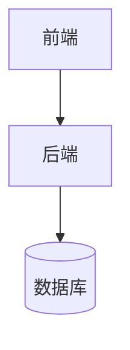
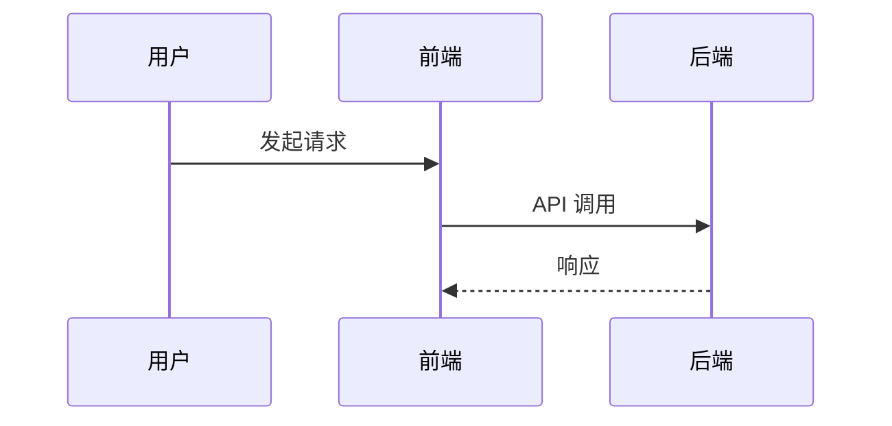
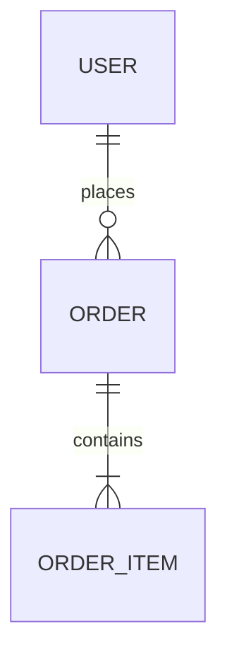
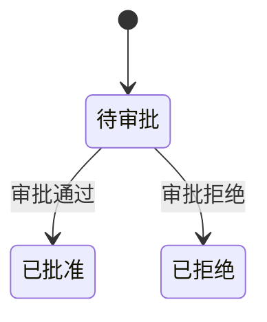

# Doc-Writer Skill 使用指南

**版本**: 2.2.0
**更新日期**: 2025-01-04

## 概述

`doc-writer` 是一个专业的设计文档编写 skill，支持生成多种类型的技术设计文档。

## 新功能 (v2.2.0)

- `/doc scan <type>` 命令 - 全量扫描所有 spec 生成统一文档
- 支持 api, db, tdd, arch 四种文档类型的统一生成
- 支持三种分组方式：system（按系统）、module（按模块）、none（不分组）
- 自动去重重复的 API 端点和表定义
- 新增触发词：全量扫描、扫描所有、统一文档、汇总文档

## 功能 (v2.1.0)

- `/doc merge` 命令 - 合并多个相关或重叠规格的设计文档
- 三种合并策略 - auto-dedup（自动去重）、preserve-all（保留全部）、interactive（交互式）
- 智能重叠检测 - 自动检测并处理数据表、API 端点、用户故事等重叠内容
- 合并报告生成 - 详细记录合并决策和需要人工审查的内容

## 主要功能 (v2.0.0+)

- `/doc` 命令入口 - 快速生成和管理设计文档
- 智能意图识别 - 自然语言描述自动映射文档类型
- 增量更新 - 保留用户手动修改的内容
- 功能矩阵 - 自动汇总所有 spec 生成产品功能矩阵
- 全量初始化 - 一键扫描所有 spec 生成完整文档集
- 新增文档类型 - 用户手册、README、发布说明

## 触发方式

### 1. `/doc` 命令（推荐）

```bash
/doc              # 显示帮助和可用文档类型
/doc tdd          # 生成技术设计文档
/doc arch         # 生成架构设计文档
/doc detail       # 生成详细设计文档
/doc api          # 生成接口设计文档
/doc db           # 生成数据库设计文档
/doc manual       # 生成用户手册
/doc readme       # 生成 README 文档
/doc release-notes # 生成发布说明
/doc matrix       # 生成产品功能矩阵
/doc init         # 全量初始化所有文档
/doc update       # 增量更新变更的文档
/doc merge        # 合并多个相关 spec 的设计文档
/doc scan api     # 全量扫描生成统一 API 文档
/doc scan db      # 全量扫描生成统一数据库文档
/doc help         # 显示帮助信息
```

**智能意图识别**:
```bash
/doc 技术方案      # → 识别为 tdd
/doc 架构设计      # → 识别为 arch
/doc API文档       # → 识别为 api
/doc 统一API       # → 识别为 scan api
```

### 2. 关键词触发

在对话中使用以下关键词自动触发 skill：

- **中文触发词**:
  - 设计文档、TDD、DDD、架构设计、详细设计
  - 技术方案、系统设计、接口设计、数据库设计
  - 写设计文档、生成设计文档
  - 合并文档、文档合并
  - 全量扫描、扫描所有、统一文档、汇总文档、汇总API、统一API

- **示例**:
  ```
  帮我生成一份技术设计文档
  我需要写一份系统架构设计文档
  为 P004 功能生成接口设计文档
  合并 P003 和 P004 的技术设计文档
  扫描所有 spec 生成统一 API 文档
  帮我汇总所有的 API 接口
  ```

### 3. 斜杠命令触发

直接使用斜杠命令：

```bash
/doc-writer
```

## 支持的文档类型

### 1. 技术设计文档 (TDD)

**包含内容**:
- ✅ 需求背景与目标
- ✅ 技术选型与决策
- ✅ 系统架构设计
- ✅ 核心模块设计
- ✅ 数据模型设计
- ✅ 接口设计
- ✅ 非功能性需求
- ✅ 风险评估与缓解

**模板位置**: `templates/technical-design.md`

**示例文档**: `examples/tdd-example.md`

### 2. 系统架构设计文档

**包含内容**:
- ✅ 架构概述与设计原则
- ✅ 架构视图（逻辑/开发/进程/物理）
- ✅ 系统分层架构
- ✅ 组件划分与职责
- ✅ 技术组件选型
- ✅ 部署架构
- ✅ 安全架构
- ✅ 可扩展性设计

**模板位置**: `templates/architecture-design.md`

### 3. 详细设计文档 (DDD)

**包含内容**:
- ✅ 模块详细设计
- ✅ 类图与时序图
- ✅ 状态机设计
- ✅ 算法设计
- ✅ 异常处理设计
- ✅ 性能优化设计

**模板位置**: `templates/detail-design.md`

### 4. 接口设计文档

**包含内容**:
- ✅ 接口概述与规范
- ✅ RESTful API 设计
- ✅ 请求/响应格式
- ✅ 错误码定义
- ✅ 认证授权设计
- ✅ 版本管理策略

**模板位置**: `templates/interface-design.md`

### 5. 数据库设计文档

**包含内容**:
- ✅ 数据模型设计
- ✅ ER 图
- ✅ 表结构定义
- ✅ 索引设计
- ✅ 数据字典
- ✅ 数据迁移方案

**模板位置**: `templates/database-design.md`

## 使用模式

### 自动模式（从现有文档生成）

当项目已有规格文档时，skill 会自动读取以下文件：

1. `.specify/active_spec.txt` - 获取当前功能规格路径
2. `specs/{specId}/spec.md` - 功能需求
3. `specs/{specId}/plan.md` - 技术方案
4. `specs/{specId}/data-model.md` - 数据模型
5. `specs/{specId}/contracts/api.yaml` - API 定义
6. `specs/{specId}/research.md` - 技术决策
7. `.claude/rules/` - 项目规范

**示例**:
```
用户：为当前功能生成技术设计文档
Claude：[读取 active_spec.txt 发现当前是 P004-inventory-adjustment]
       [读取 spec.md、plan.md 等文件]
       [生成 TDD 并保存到 specs/P004-inventory-adjustment/design/tdd-P004.md]
```

### 手动模式（交互式生成）

当没有现成规格文档或需要自定义时，skill 会询问：

1. 文档类型（TDD/架构设计/详细设计/接口设计/数据库设计）
2. 项目/功能背景
3. 技术栈约束
4. 目标读者
5. 特殊要求

**示例**:
```
用户：帮我写一份 API 接口设计文档
Claude：请问这份文档是针对哪个功能或模块的？
用户：库存调整功能
Claude：好的，请描述一下这个功能的背景和主要功能点...
       [继续交互式提问]
       [生成接口设计文档]
```

## 输出位置

**新版输出位置** (v2.0.0): 文档输出到独立的 `docs/` 目录：

```
docs/
├── tdd/                    # 技术设计文档
│   └── {specId}-tdd.md
├── architecture/           # 架构设计文档
│   └── {specId}-arch.md
├── api/                    # 接口设计文档
│   └── {specId}-api.md
├── database/               # 数据库设计文档
│   └── {specId}-db.md
├── detail-design/{module}/ # 详细设计（按模块）
├── manual/{module}/        # 用户手册（按模块）
├── readme/                 # README 文档
├── matrix/                 # 功能矩阵
│   └── feature-matrix.md
└── release-notes/          # 发布说明
    └── v{version}.md
```

**示例**:
- 技术设计文档: `docs/tdd/P004-inventory-adjustment-tdd.md`
- 架构设计文档: `docs/architecture/P004-inventory-adjustment-arch.md`
- 用户手册: `docs/manual/库存管理/P004-inventory-adjustment-manual.md`
- 功能矩阵: `docs/matrix/feature-matrix.md`

## 文档质量标准

生成的文档遵循以下标准（见 `references/design-standards.md`）：

### 内容完整性
- ✅ 所有章节按模板要求填写
- ✅ 关键设计决策有明确理由
- ✅ 架构图/时序图/ER 图清晰完整
- ✅ 接口定义包含请求/响应示例

### 一致性
- ✅ 术语使用一致
- ✅ 命名风格统一
- ✅ 技术栈符合项目规范（`.claude/rules/`）
- ✅ API 响应格式符合项目标准

### 可读性
- ✅ 章节层次清晰（不超过 4 级标题）
- ✅ 图表有说明文字
- ✅ 代码示例有注释
- ✅ 复杂逻辑有流程图

## Mermaid 图表支持

所有模板都支持 Mermaid 图表，包括：

### 架构图


### 时序图


### ER 图


### 状态机图


## 常见问题

### Q1: 如何修改生成的文档？

**A**: 生成的文档是标准的 Markdown 文件，可以直接编辑。建议：
1. 先让 skill 生成初稿
2. 手动补充细节（如具体的代码实现、性能测试数据）
3. 添加项目特定的内容

### Q2: 生成的文档缺少某些信息怎么办？

**A**: Skill 遵循"不编造内容"原则，缺失信息会标记为 `[待补充: 描述]`。你可以：
1. 在原始规格文档中补充信息，然后重新生成
2. 手动填写标记为待补充的部分

### Q3: 如何为多个功能生成设计文档?

**A**:
1. **方法一**: 依次切换功能分支，使用 skill 生成文档
2. **方法二**: 手动模式下逐个生成
3. **方法三**: 编写脚本批量调用 skill

### Q4: 生成的文档符合项目规范吗？

**A**: 是的！Skill 会自动加载 `.claude/rules/` 中的项目规范，确保：
- 技术栈符合项目要求（B端用 React+AntD，C端用 Taro）
- API 响应格式符合 `08-api-standards.md`
- 架构设计符合 `07-backend-architecture.md`

### Q5: 可以自定义模板吗？

**A**: 可以！直接修改 `templates/` 目录下的模板文件，skill 会使用更新后的模板。

## 最佳实践

### 1. 先完善规格文档
在生成设计文档前，确保 `spec.md`、`plan.md` 已经完善，这样生成的文档质量更高。

### 2. 分阶段生成
不要一次生成所有文档类型，建议顺序：
1. 先生成 TDD（技术设计文档）- 整体把控
2. 再生成架构设计文档 - 细化架构
3. 最后生成详细设计文档 - 实现细节

### 3. 结合代码实现
生成设计文档后，可以将其作为编码参考，确保代码与设计一致。

### 4. 定期更新
当功能发生重大变更时，重新生成或更新设计文档，保持文档与代码同步。

## 与 skill-doc-generator 的区别

| 特性 | doc-writer | skill-doc-generator |
|------|-----------|-------------------|
| **定位** | 设计文档编写 | 规格文档整合 |
| **输入** | spec.md, plan.md, research.md | spec.md 中的实体/API 定义 |
| **输出** | TDD/架构设计/详细设计/接口设计/数据库设计 | data_model.md / api_spec.md |
| **用途** | 设计阶段，面向开发者 | 规格阶段，面向产品/开发 |
| **图表** | 丰富的 Mermaid 图表（架构图/时序图/ER图） | 简单的 ER 图和状态机 |
| **更新模式** | 全量生成 | 支持增量更新 |

**典型工作流**:
1. 使用 `skill-doc-generator` 生成 `data_model.md` 和 `api_spec.md`
2. 使用 `doc-writer` 生成完整的技术设计文档（包含架构、算法、测试等）

## 快速开始

### 示例 1: 为当前功能生成技术设计文档

```
用户：帮我生成当前功能的技术设计文档
Claude：[自动读取 active_spec.txt 和相关文档]
       [生成 TDD 并保存到 specs/{specId}/design/tdd-{specId}.md]
       ✅ 文档生成完成！路径：specs/P004-inventory-adjustment/design/tdd-P004.md
```

### 示例 2: 生成接口设计文档

```
用户：为库存调整功能生成接口设计文档
Claude：正在读取规格文档...
       [读取 spec.md 中的 API 端点定义]
       [生成接口设计文档]
       ✅ 接口设计文档生成完成！
```

### 示例 3: 手动创建架构设计文档

```
用户：我想写一份系统架构设计文档
Claude：好的，请问这份文档是针对哪个系统或模块的？
用户：影院商品管理中台整体架构
Claude：明白了，请描述一下系统的主要功能模块...
       [交互式提问]
       [生成架构设计文档]
```

### 示例 4: 合并相关 spec 的技术设计文档

```bash
# 场景：P003（库存查询）和 P004（库存调整）功能相关，需要合并为统一的库存管理 TDD
/doc merge tdd P003 P004 --output P003-P004-inventory-system
```

**执行过程**:
```
Claude：正在加载源 spec 文档...
       ✓ 已加载 P003-inventory-query
       ✓ 已加载 P004-inventory-adjustment

       正在检测重叠内容...
       ✓ 发现 3 个重叠的数据表定义
       ✓ 发现 2 个重叠的 API 端点
       ✓ 发现 5 个重复的功能需求

       正在应用 auto-dedup 策略合并...
       ✓ 已合并 store_inventory 表（P004 扩展了 safe_stock 字段）
       ✓ 已合并 GET /api/inventory（保留了 P004 的完整定义）
       ✓ 已去重功能需求

       ✅ 文档合并完成

       输出路径: docs/merged/P003-P004-inventory-system.md
       报告路径: docs/merged/P003-P004-inventory-system-merge-report.md

       重叠内容统计:
       - 数据表定义: 3 个表重叠（已合并字段）
       - API 端点: 2 个端点重叠（保留了最完整定义）
       - 功能需求: 5 个重复需求（已去重）

       需要人工审查:
       - store_inventory 表的 safe_stock 字段定义不一致

       下一步建议:
       - 查看合并报告了解详细的合并决策
       - 手动审查标记为"需要人工审查"的部分
```

### 示例 5: 使用不同的合并策略

```bash
# 保留所有内容，不去重（适合需要对比两个 spec 的场景）
/doc merge tdd P003 P004 --output P003-P004-comparison --strategy preserve-all

# 交互式合并，遇到冲突时询问用户
/doc merge tdd P003 P004 --output P003-P004-inventory-system --strategy interactive
```

**interactive 策略示例**:
```
Claude：检测到重叠内容：store_inventory 表

       P003 定义:
       - id (bigint, primary key)
       - sku_id (bigint, not null)
       - store_id (bigint, not null)
       - quantity (integer, not null)

       P004 定义:
       - id (bigint, primary key)
       - sku_id (bigint, not null)
       - store_id (bigint, not null)
       - quantity (integer, not null)
       - safe_stock (integer, default 0)  ← 新增字段

       请选择合并策略：
       A) 使用 P004 的定义（包含新增字段）
       B) 使用 P003 的定义
       C) 手动合并（我将两者都保留，由您后续编辑）

用户：A

Claude：好的，将使用 P004 的定义。继续检测下一个重叠项...
```

### 示例 6: 全量扫描生成统一 API 文档

```bash
# 扫描所有 spec，生成统一 API 文档
/doc scan api
```

**执行过程**:
```
Claude：正在扫描 specs/ 目录...
       ✓ 发现 15 个 spec 文件夹

       正在提取 API 定义...
       ✓ P001-user-management: 5 个端点
       ✓ P002-product-catalog: 8 个端点
       ✓ P003-inventory-query: 4 个端点
       ...

       正在检测重复端点...
       ✓ 发现 2 个重复的 API 端点（已合并）

       正在生成统一文档...
       ✓ 按模块分组完成
       ✓ 生成目录导航
       ✓ 添加统计摘要

       ✅ 统一 API 文档生成完成

       输出路径: docs/unified/unified-api.md

       统计摘要:
       - 扫描 Spec 数量: 15
       - API 端点总数: 48
       - 按模块分组: 4 个模块
       - 去重端点: 2 个

       下一步建议:
       - 查看生成的文档确认内容完整
       - 在 USER-SECTION 区域添加补充说明
```

**其他分组方式**:
```bash
# 按系统分组
/doc scan api --group-by system

# 不分组（扁平列表）
/doc scan api --group-by none

# 自定义输出文件名
/doc scan api --output project-api-v1.md
```

## 技术支持

如有问题或建议，请：
1. 查看示例文档：`examples/tdd-example.md`
2. 参考设计标准：`references/design-standards.md`
3. 查看模板文件：`templates/*.md`
4. 提交 Issue 到项目仓库
