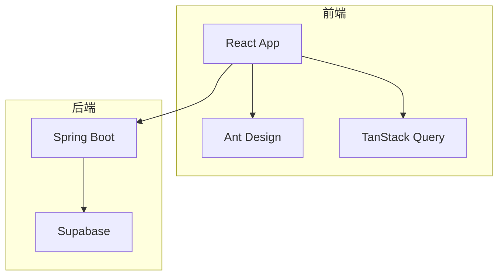
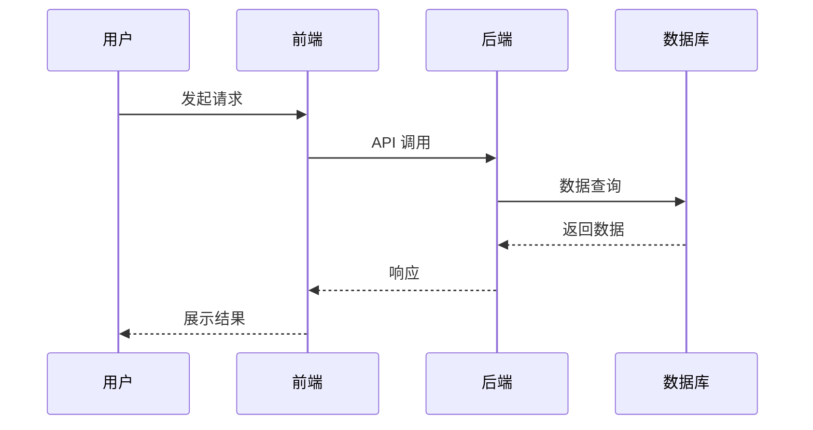
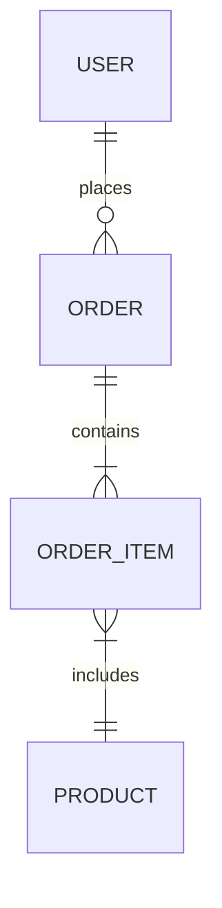

# 设计文档编写专家

为软件开发项目提供专业的设计文档编写能力，支持多种设计文档类型和输出格式。

## 命令入口

本技能支持 `/doc` 命令快捷调用，详见 `.claude/commands/doc.md`：

| 命令 | 说明 |
|-----|------|
| `/doc` | 显示帮助和可用文档类型 |
| `/doc <type>` | 生成指定类型文档（tdd, arch, detail, api, db, manual, readme, release-notes） |
| `/doc init` | 全量初始化（扫描所有 spec 生成文档集） |
| `/doc update` | 增量更新（只更新变更的文档） |
| `/doc merge` | 合并多个相关规格的设计文档（支持 auto-dedup, preserve-all, interactive 策略） |
| `/doc matrix` | 生成产品功能矩阵 |
| `/doc help` | 显示帮助信息 |

**示例**:
```bash
/doc tdd              # 生成技术设计文档
/doc 技术方案          # 智能识别并生成 TDD
/doc init             # 全量初始化所有文档
/doc update           # 增量更新变更的文档
/doc merge tdd P003 P004 --output P003-P004-merged   # 合并 P003 和 P004 的 TDD 文档
```

## 意图识别关键词

系统支持通过自然语言描述智能识别文档类型，以下是完整的关键词映射：

| 文档类型 | 类型代码 | 识别关键词 |
|---------|---------|-----------|
| 技术设计文档 | `tdd` | 技术方案、TDD、技术设计、技术文档 |
| 架构设计文档 | `arch` | 架构、系统设计、架构设计、系统架构 |
| 详细设计文档 | `detail` | 详细设计、DDD、模块设计、详设 |
| 接口设计文档 | `api` | 接口、API、接口设计、API文档 |
| 数据库设计文档 | `db` | 数据库、表设计、数据模型、DB设计 |
| 用户手册 | `manual` | 手册、使用说明、操作指南、用户手册 |
| README 文档 | `readme` | README、项目说明、项目介绍 |
| 发布说明 | `release-notes` | 发布、CHANGELOG、更新日志、版本说明 |
| 功能矩阵 | `matrix` | 功能矩阵、功能列表、功能清单、产品矩阵 |

**使用示例**：
```bash
/doc 技术方案      # → 识别为 tdd，生成技术设计文档
/doc 架构          # → 识别为 arch，生成架构设计文档
/doc API设计       # → 识别为 api，生成接口设计文档
/doc 设计          # → 无法确定，显示类型选择菜单
```

**匹配规则**：
1. 精确匹配类型代码（tdd, arch, detail 等）
2. 包含任一识别关键词即匹配对应类型
3. 多个关键词匹配时，优先选择第一个匹配的类型
4. 无法确定意图时，显示交互式类型选择菜单

## 增量更新机制

### 文档状态跟踪

系统通过 `.doc-writer-state.json` 文件跟踪文档生成状态，支持增量更新：

```json
{
  "version": "1.0.0",
  "documents": {
    "docs/tdd/P004-inventory-adjustment.md": {
      "specPath": "specs/P004-inventory-adjustment",
      "generatedAt": "2025-12-26T10:00:00Z",
      "specModifiedAt": "2025-12-26T09:00:00Z",
      "checksum": "abc123..."
    }
  }
}
```

### 内容标记

生成的文档使用以下标记区分自动生成和用户修改的内容：

| 标记 | 用途 |
|-----|------|
| `<!-- DOC-WRITER: AUTO-GENERATED START/END -->` | 自动生成的内容区域 |
| `<!-- DOC-WRITER: USER-SECTION START/END -->` | 用户手动添加的内容区域 |
| `<!-- DOC-WRITER: CONFLICT START/END -->` | 冲突内容标记 |

**使用示例**：
```markdown
<!-- DOC-WRITER: AUTO-GENERATED START -->
## 1. 需求背景
[自动生成的内容...]
<!-- DOC-WRITER: AUTO-GENERATED END -->

<!-- DOC-WRITER: USER-SECTION START -->
## 补充说明
[用户手动添加的内容，增量更新时保留]
<!-- DOC-WRITER: USER-SECTION END -->
```

### 更新策略

1. **变更检测**：比较 spec 文件修改时间与文档生成时间
2. **用户内容保留**：USER-SECTION 标记的内容在更新时保留
3. **冲突处理**：当用户修改与新生成内容重叠时，标记冲突并请求确认

## 输出目录结构

文档输出到 `docs/` 目录（与 `specs/` 独立）：

```
docs/
├── tdd/                    # 技术设计文档
│   └── {specId}-tdd.md
├── architecture/           # 架构设计文档
│   └── {specId}-arch.md
├── api/                    # 接口设计文档
│   └── {specId}-api.md
├── database/               # 数据库设计文档
│   └── {specId}-db.md
├── detail-design/          # 详细设计（按模块）
│   └── {module}/
│       └── {specId}-detail.md
├── product/                # 产品文档（按模块）
│   └── {module}/
│       └── {specId}-product.md
├── manual/                 # 用户手册（按模块）
│   └── {module}/
│       └── {specId}-manual.md
├── guide/                  # 操作指南（按模块）
│   └── {module}/
│       └── {specId}-guide.md
├── readme/                 # README 文档
│   └── {specId}-readme.md
├── matrix/                 # 功能矩阵
│   └── feature-matrix.md
└── release-notes/          # 发布说明
    └── v{version}.md
```

**模块路径规则**：
- 技术类文档（tdd, arch, api, db）直接放在类型目录下
- 业务类文档（detail, manual, guide, product）按模块组织子目录
- 全局文档（readme, matrix, release-notes）放在对应目录根级

## Spec 元数据扩展

在 spec.md 头部添加以下字段以支持模块组织和文档生成：

```markdown
**Feature Branch**: P004-inventory-adjustment
**System**: 商品管理中台
**Module**: 库存管理
**SubModule**: 库存调整
**Created**: 2025-12-26
**Status**: In Progress
```

| 字段 | 必填 | 说明 | 用途 |
|-----|-----|------|------|
| Feature Branch | 是 | specId + 功能简述 | 文件命名、文档关联 |
| System | 否 | 系统名称 | 功能矩阵分组 |
| Module | 否 | 一级模块 | 文档目录组织 |
| SubModule | 否 | 二级模块 | 功能矩阵细分 |
| Created | 否 | 创建日期 | 版本追踪 |
| Status | 否 | 状态 | 进度统计 |

## 核心能力

### 1. 技术设计文档 (TDD)
生成完整的技术设计文档，包含：
- 需求背景与目标
- 技术选型与决策
- 系统架构设计
- 核心模块设计
- 数据模型设计
- 接口设计
- 非功能性需求
- 风险评估与缓解

### 2. 系统架构设计文档
生成系统架构设计文档，包含：
- 架构概述与设计原则
- 系统分层架构
- 组件划分与职责
- 技术组件选型
- 部署架构
- 安全架构
- 可扩展性设计

### 3. 详细设计文档 (DDD)
生成详细设计文档，包含：
- 模块详细设计
- 类图与时序图
- 状态机设计
- 算法设计
- 异常处理设计
- 性能优化设计

### 4. 接口设计文档
生成 API 接口设计文档，包含：
- 接口概述与规范
- RESTful API 设计
- 请求/响应格式
- 错误码定义
- 认证授权设计
- 版本管理策略

### 5. 数据库设计文档
生成数据库设计文档，包含：
- 数据模型设计
- ER 图
- 表结构定义
- 索引设计
- 数据字典
- 数据迁移方案

### 6. 用户手册
生成用户操作手册，包含：
- 功能概述与特性
- 适用对象与权限
- 操作步骤（查看、新增、编辑、删除）
- 高级功能（批量操作、导出、筛选）
- 常见问题 FAQ
- 注意事项

### 7. README 文档
生成项目/功能 README，包含：
- 项目信息概览
- 快速开始指南
- 功能特性列表
- 目录结构说明
- 配置说明
- 开发与部署指南
- 相关文档链接

### 8. 发布说明
生成版本发布说明，包含：
- 版本信息
- 变更概述
- 新增功能
- 功能优化
- 问题修复
- 已知问题
- 升级说明
- 依赖与配置变更

### 9. 产品功能矩阵
自动汇总所有 spec 生成功能矩阵，包含：
- 统计概览（系统/模块/功能数量）
- 按系统分组的功能列表
- 功能详情（按模块字母分类）
- 版本路线图
- 文档索引

### 10. 文档合并
合并多个相关或重叠规格的设计文档，支持三种合并策略：

**合并策略**：
- **auto-dedup（默认）**: 自动检测并去重重叠内容，智能合并表定义、API 端点、用户故事等
- **preserve-all**: 保留所有内容，按来源 spec 分组展示
- **interactive**: 遇到重叠内容时提示用户选择保留策略

**支持的文档类型**：
- TDD（技术设计文档）- MVP 阶段支持
- 其他类型（arch, api, db, detail）- 后续版本支持

**使用场景**：
- 合并功能相关的多个 spec（如 P003-库存查询 + P004-库存调整）
- 整合系统级设计文档
- 消除重复内容，生成统一文档

**命令格式**：
```bash
/doc merge <doc-type> <spec1> <spec2> [spec3...] --output <output-name> [--strategy <strategy>]
```

**示例**：
```bash
# 合并 P003 和 P004 的 TDD 文档，自动去重
/doc merge tdd P003 P004 --output P003-P004-inventory-system

# 使用 preserve-all 策略保留所有内容
/doc merge tdd P003 P004 --output P003-P004-inventory-system --strategy preserve-all

# 交互式合并，遇到冲突时提示用户选择
/doc merge tdd P003 P004 --output P003-P004-inventory-system --strategy interactive
```

**合并输出**：
- 合并后的文档输出到 `docs/merged/` 目录
- 生成详细的合并报告（`docs/merged/{output-name}-merge-report.md`）
- 报告包含：重叠内容统计、合并策略应用情况、需要人工审查的部分

详细合并工作流程见：`.claude/skills/doc-writer/MERGE-WORKFLOW.md`

## 工作流程

### Step 1: 收集设计信息

**自动模式**（从现有文档生成）：
- 检查 `.specify/active_spec.txt` 获取当前功能规格路径
- 读取 `specs/{specId}/spec.md` 获取功能需求
- 读取 `specs/{specId}/plan.md` 获取技术方案
- 读取 `specs/{specId}/data-model.md` 获取数据模型
- 读取 `specs/{specId}/contracts/api.yaml` 获取 API 定义
- 读取 `specs/{specId}/research.md` 获取技术决策

**手动模式**（用户提供信息）：
向用户确认以下信息：
- 文档类型（TDD/架构设计/详细设计/接口设计/数据库设计）
- 项目/功能背景
- 技术栈约束
- 目标读者
- 特殊要求

### Step 2: 加载项目规范

加载项目技术规范作为设计约束：
- **技术栈规范**：见 `.claude/rules/03-frontend-b-tech-stack.md`、`.claude/rules/04-frontend-c-tech-stack.md`
- **后端架构规范**：见 `.claude/rules/07-backend-architecture.md`
- **API 标准**：见 `.claude/rules/08-api-standards.md`
- **质量标准**：见 `.claude/rules/09-quality-standards.md`
- **设计标准**：见 `references/design-standards.md`

### Step 3: 生成设计文档

根据文档类型选择对应模板：
- **技术设计文档**：使用 `templates/technical-design.md`
- **架构设计文档**：使用 `templates/architecture-design.md`
- **详细设计文档**：使用 `templates/detail-design.md`
- **接口设计文档**：使用 `templates/interface-design.md`
- **数据库设计文档**：使用 `templates/database-design.md`

### Step 4: 输出与审查

**输出位置**：
- 默认输出到 `specs/{specId}/design/` 目录
- 文件命名：`{document-type}-{specId}.md`

**输出摘要报告**：
```
✅ 设计文档生成完成

文档类型：技术设计文档 (TDD)
功能标识：P004-inventory-adjustment
输出路径：specs/P004-inventory-adjustment/design/tdd-P004.md

文档结构：
1. 需求背景与目标 ✓
2. 技术选型与决策 ✓
3. 系统架构设计 ✓
4. 核心模块设计 ✓
5. 数据模型设计 ✓
6. 接口设计 ✓
7. 非功能性需求 ✓
8. 风险评估 ✓

信息来源：
- spec.md: 功能需求
- plan.md: 技术方案
- data-model.md: 数据模型
- contracts/api.yaml: API 定义

待补充项：
- 部署架构图（建议使用 draw.io 或 mermaid 补充）
- 性能测试用例（建议结合实际场景补充）
```

## 文档输出规范

### 技术设计文档规范

1. **文档头部**
   - 文档标题、版本、日期
   - 作者、审核人
   - 变更历史

2. **需求背景**
   - 业务背景
   - 项目目标
   - 范围边界

3. **技术选型**
   - 技术栈选择
   - 选型依据
   - 对比分析

4. **架构设计**
   - 系统架构图（使用 mermaid）
   - 分层设计
   - 组件职责

5. **详细设计**
   - 核心流程设计
   - 数据模型设计
   - 接口设计

6. **非功能性需求**
   - 性能要求
   - 安全要求
   - 可用性要求

7. **风险与缓解**
   - 技术风险
   - 业务风险
   - 缓解措施

### Mermaid 图表规范

**系统架构图**：


**时序图**：


**ER 图**：


## 质量要求

### 内容要求
- 设计决策有理有据
- 架构图清晰易懂
- 接口定义完整准确
- 数据模型规范

### 格式要求
- 使用 Markdown 格式
- 图表使用 Mermaid 语法
- 代码使用语法高亮
- 层次结构清晰

### 一致性要求
- 术语使用一致
- 命名风格统一
- 遵循项目规范

## 注意事项

- **不编造内容**：遇到缺失信息时，使用 `[待补充: 描述]` 标记
- **遵循项目规范**：设计必须符合项目技术栈和架构约束
- **可追溯性**：设计与需求应有明确对应关系
- **可评审性**：文档结构支持设计评审流程
- **可维护性**：设计文档应便于后续更新

---

## 变更日志

### v2.1.0 (2025-12-27)

**新增功能**:
- `/doc merge` 命令 - 合并多个相关或重叠规格的设计文档
- 三种合并策略：auto-dedup（自动去重）、preserve-all（保留全部）、interactive（交互式）
- 智能内容重叠检测算法（表定义、API 端点、用户故事、功能需求）
- 合并报告生成 - 详细记录重叠内容统计和合并决策
- MVP 阶段支持 TDD 文档合并，限制 2 个 spec

**新增文档**:
- `MERGE-WORKFLOW.md` - 完整的文档合并工作流程规范

**改进**:
- 新增触发词：合并文档、文档合并
- 合并文档输出到独立的 `docs/merged/` 目录
- 支持 `--output` 和 `--strategy` 参数

### v2.0.0 (2025-12-26)

**新增功能**:
- `/doc` 命令入口 - 快速生成和管理设计文档
- 智能意图识别 - 自然语言描述自动映射文档类型
- 增量更新机制 - 保留用户手动修改的内容（USER-SECTION 标记）
- 功能矩阵生成 - 自动汇总所有 spec 生成产品功能矩阵
- 全量初始化 - `/doc init` 一键扫描所有 spec 生成完整文档集
- 新增文档类型: 用户手册(manual)、README(readme)、发布说明(release-notes)、功能矩阵(matrix)

**改进**:
- 文档输出位置从 `specs/{specId}/design/` 改为独立的 `docs/` 目录
- 支持按模块组织详细设计、用户手册等业务类文档
- 新增 spec 元数据字段: System, Module, SubModule
- 添加文档状态跟踪（`.doc-writer-state.json`）

**新增模板**:
- `templates/manual.md` - 用户手册模板
- `templates/readme.md` - README 文档模板
- `templates/release-notes.md` - 发布说明模板
- `templates/feature-matrix.md` - 功能矩阵模板

### v1.0.0

**初始版本**:
- 支持 5 种设计文档类型: TDD、架构设计、详细设计、接口设计、数据库设计
- 自动模式和手动模式
- Mermaid 图表支持
- 项目规范集成
