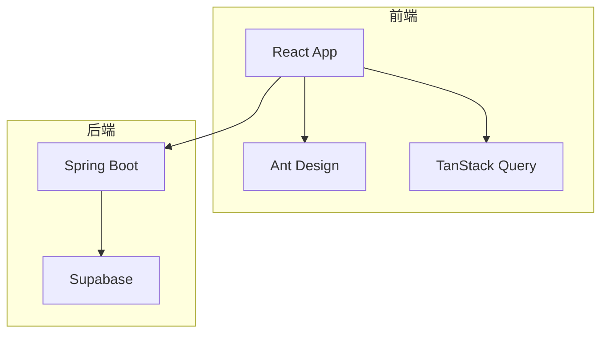
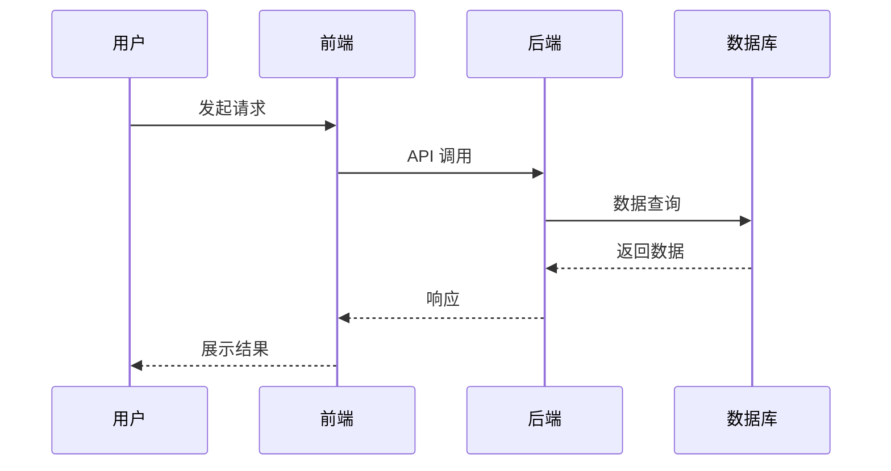
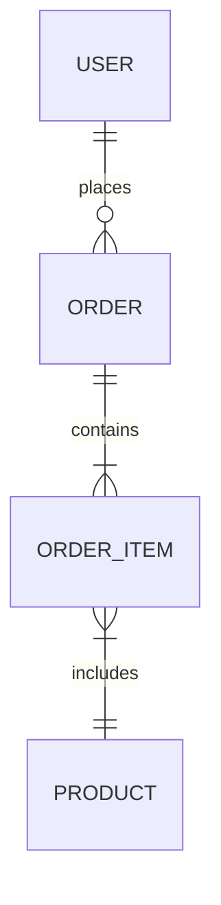

# 设计文档编写专家

为软件开发项目提供专业的设计文档编写能力，支持多种设计文档类型和输出格式。

## 核心能力

### 1. 技术设计文档 (TDD)
生成完整的技术设计文档，包含：
- 需求背景与目标
- 技术选型与决策
- 系统架构设计
- 核心模块设计
- 数据模型设计
- 接口设计
- 非功能性需求
- 风险评估与缓解

### 2. 系统架构设计文档
生成系统架构设计文档，包含：
- 架构概述与设计原则
- 系统分层架构
- 组件划分与职责
- 技术组件选型
- 部署架构
- 安全架构
- 可扩展性设计

### 3. 详细设计文档 (DDD)
生成详细设计文档，包含：
- 模块详细设计
- 类图与时序图
- 状态机设计
- 算法设计
- 异常处理设计
- 性能优化设计

### 4. 接口设计文档
生成 API 接口设计文档，包含：
- 接口概述与规范
- RESTful API 设计
- 请求/响应格式
- 错误码定义
- 认证授权设计
- 版本管理策略

### 5. 数据库设计文档
生成数据库设计文档，包含：
- 数据模型设计
- ER 图
- 表结构定义
- 索引设计
- 数据字典
- 数据迁移方案

## 工作流程

### Step 1: 收集设计信息

**自动模式**（从现有文档生成）：
- 检查 `.specify/active_spec.txt` 获取当前功能规格路径
- 读取 `specs/{specId}/spec.md` 获取功能需求
- 读取 `specs/{specId}/plan.md` 获取技术方案
- 读取 `specs/{specId}/data-model.md` 获取数据模型
- 读取 `specs/{specId}/contracts/api.yaml` 获取 API 定义
- 读取 `specs/{specId}/research.md` 获取技术决策

**手动模式**（用户提供信息）：
向用户确认以下信息：
- 文档类型（TDD/架构设计/详细设计/接口设计/数据库设计）
- 项目/功能背景
- 技术栈约束
- 目标读者
- 特殊要求

### Step 2: 加载项目规范

加载项目技术规范作为设计约束：
- **技术栈规范**：见 `.claude/rules/03-frontend-b-tech-stack.md`、`.claude/rules/04-frontend-c-tech-stack.md`
- **后端架构规范**：见 `.claude/rules/07-backend-architecture.md`
- **API 标准**：见 `.claude/rules/08-api-standards.md`
- **质量标准**：见 `.claude/rules/09-quality-standards.md`
- **设计标准**：见 `references/design-standards.md`

### Step 3: 生成设计文档

根据文档类型选择对应模板：
- **技术设计文档**：使用 `templates/technical-design.md`
- **架构设计文档**：使用 `templates/architecture-design.md`
- **详细设计文档**：使用 `templates/detail-design.md`
- **接口设计文档**：使用 `templates/interface-design.md`
- **数据库设计文档**：使用 `templates/database-design.md`

### Step 4: 输出与审查

**输出位置**：
- 默认输出到 `specs/{specId}/design/` 目录
- 文件命名：`{document-type}-{specId}.md`

**输出摘要报告**：
```
✅ 设计文档生成完成

文档类型：技术设计文档 (TDD)
功能标识：P004-inventory-adjustment
输出路径：specs/P004-inventory-adjustment/design/tdd-P004.md

文档结构：
1. 需求背景与目标 ✓
2. 技术选型与决策 ✓
3. 系统架构设计 ✓
4. 核心模块设计 ✓
5. 数据模型设计 ✓
6. 接口设计 ✓
7. 非功能性需求 ✓
8. 风险评估 ✓

信息来源：
- spec.md: 功能需求
- plan.md: 技术方案
- data-model.md: 数据模型
- contracts/api.yaml: API 定义

待补充项：
- 部署架构图（建议使用 draw.io 或 mermaid 补充）
- 性能测试用例（建议结合实际场景补充）
```

## 文档输出规范

### 技术设计文档规范

1. **文档头部**
   - 文档标题、版本、日期
   - 作者、审核人
   - 变更历史

2. **需求背景**
   - 业务背景
   - 项目目标
   - 范围边界

3. **技术选型**
   - 技术栈选择
   - 选型依据
   - 对比分析

4. **架构设计**
   - 系统架构图（使用 mermaid）
   - 分层设计
   - 组件职责

5. **详细设计**
   - 核心流程设计
   - 数据模型设计
   - 接口设计

6. **非功能性需求**
   - 性能要求
   - 安全要求
   - 可用性要求

7. **风险与缓解**
   - 技术风险
   - 业务风险
   - 缓解措施

### Mermaid 图表规范

**系统架构图**：


**时序图**：


**ER 图**：


## 质量要求

### 内容要求
- 设计决策有理有据
- 架构图清晰易懂
- 接口定义完整准确
- 数据模型规范

### 格式要求
- 使用 Markdown 格式
- 图表使用 Mermaid 语法
- 代码使用语法高亮
- 层次结构清晰

### 一致性要求
- 术语使用一致
- 命名风格统一
- 遵循项目规范

## 注意事项

- **不编造内容**：遇到缺失信息时，使用 `[待补充: 描述]` 标记
- **遵循项目规范**：设计必须符合项目技术栈和架构约束
- **可追溯性**：设计与需求应有明确对应关系
- **可评审性**：文档结构支持设计评审流程
- **可维护性**：设计文档应便于后续更新
