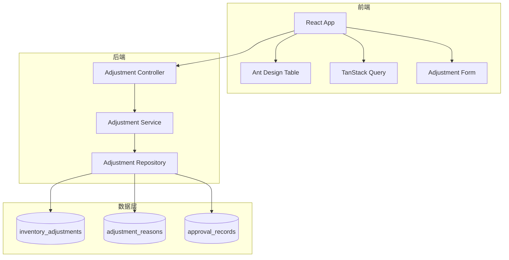
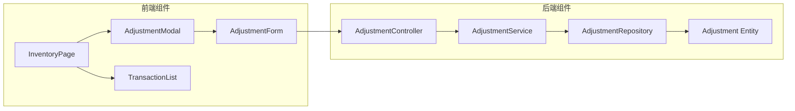
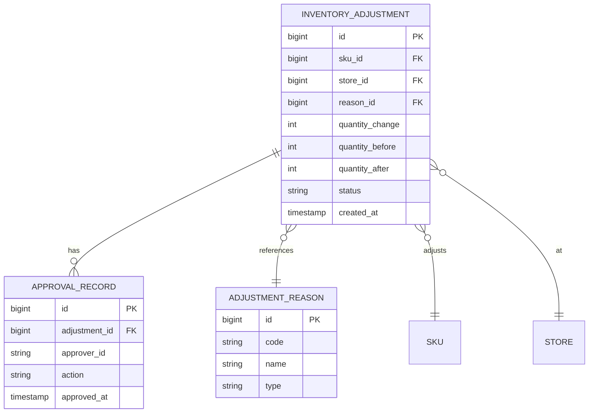
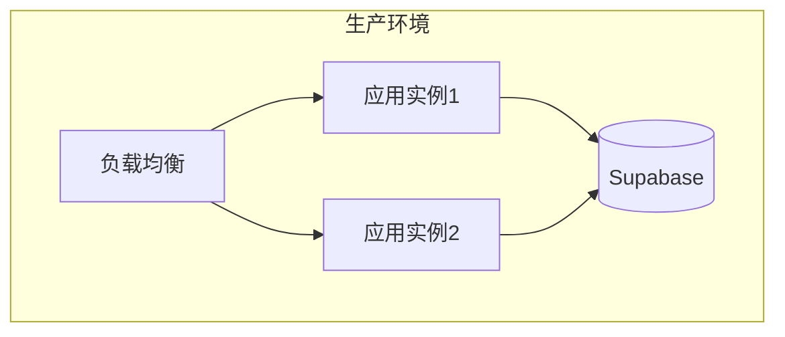

# 技术设计文档 (TDD) - P004-inventory-adjustment

**文档版本**: 1.0
**创建日期**: 2025-12-26
**作者**: Claude (doc-writer skill)
**审核人**: [待指定]

---

## 变更历史

| 版本 | 日期 | 作者 | 变更说明 |
|------|------|------|----------|
| 1.0 | 2025-12-26 | Claude | 初始版本 |

---

## 1. 概述

### 1.1 背景

影院商品管理中台需要支持库存调整功能，允许运营人员手动调整商品库存数量，并记录调整原因和审批流程。

### 1.2 项目目标

- 实现库存数量的灵活调整（增加/减少）
- 记录完整的调整历史和审批流程
- 确保数据一致性和可追溯性

### 1.3 范围边界

**包含范围**:
- 库存调整单创建和提交
- 调整原因配置管理
- 调整审批流程
- 调整历史记录查询

**不包含范围**:
- 自动库存同步（单独功能）
- 库存盘点功能（后续规划）
- 多仓库调拨（暂不支持）

### 1.4 术语定义

| 术语 | 定义 |
|------|------|
| 库存调整 | 手动修改商品库存数量的操作 |
| 调整单 | 记录单次库存调整的业务凭证 |
| 调整原因 | 预定义的库存调整原因分类 |
| 审批记录 | 调整单的审批历史记录 |

---

## 2. 需求摘要

### 2.1 功能需求

#### P0 - 创建库存调整单
- **作为**: 运营人员
- **我希望**: 能够创建库存调整单，指定调整数量和原因
- **以便**: 修正库存误差或处理特殊情况

**验收标准**:
- 支持正负数量调整
- 必须选择调整原因
- 可添加备注说明
- 自动计算调整后的库存数量

#### P1 - 查看调整历史
- **作为**: 运营人员
- **我希望**: 能够查看商品的所有调整历史
- **以便**: 追溯库存变化原因

**验收标准**:
- 显示调整时间、数量、原因
- 支持按时间范围筛选
- 显示调整前后的库存数量

### 2.2 非功能需求

| 类别 | 要求 | 指标 |
|------|------|------|
| 性能 | 调整单创建响应时间 | < 500ms |
| 可用性 | 系统可用性 | ≥ 99.9% |
| 安全性 | 调整操作需要权限验证 | 100% 覆盖 |
| 可扩展性 | 支持大规模调整历史查询 | 100万+ 记录 |

---

## 3. 技术选型

### 3.1 技术栈

| 层次 | 技术 | 版本 | 选型理由 |
|------|------|------|----------|
| 前端框架 | React | 19.2.0 | 项目标准技术栈 |
| UI 组件库 | Ant Design | 6.1.0 | 企业级 B端 UI 组件 |
| 状态管理 | TanStack Query | 5.90.12 | 服务器状态管理最佳实践 |
| 后端框架 | Spring Boot | 3.x | 项目标准后端框架 |
| 数据库 | Supabase PostgreSQL | - | 项目统一数据源 |

### 3.2 技术决策记录

#### 决策 1: 使用 TanStack Query 管理调整单状态
- **背景**: 调整单涉及频繁的增删改查操作
- **决策**: 使用 TanStack Query 的 useMutation 和 useQuery
- **替代方案**: Zustand 本地状态管理
- **理由**: TanStack Query 提供自动缓存失效和后台刷新
- **后果**: 需要定义查询键（query key）策略

#### 决策 2: 调整单状态机设计
- **背景**: 调整单有多种状态（待审批、已批准、已拒绝）
- **决策**: 使用数据库枚举类型 + 状态机模式
- **替代方案**: 简单的字符串状态
- **理由**: 状态机确保状态转换的合法性
- **后果**: 需要在代码中实现状态转换校验

---

## 4. 系统架构设计

### 4.1 架构概览



### 4.2 分层架构

| 层次 | 职责 | 技术 |
|------|------|------|
| 表现层 | UI 渲染、用户交互 | React + Ant Design |
| 应用层 | 状态管理、API 调用 | TanStack Query |
| 服务层 | 业务逻辑实现 | Spring Boot Services |
| 数据层 | 数据持久化 | Supabase PostgreSQL |

### 4.3 组件架构



---

## 5. 核心模块设计

### 5.1. 库存调整服务 (AdjustmentService)

**职责**: 处理库存调整的核心业务逻辑

**接口定义**:
```typescript
interface AdjustmentService {
  createAdjustment(request: AdjustmentRequest): Promise<AdjustmentResponse>
  getAdjustmentHistory(skuId: string, storeId: string): Promise<Adjustment[]>
  approveAdjustment(adjustmentId: string, approverId: string): Promise<void>
  rejectAdjustment(adjustmentId: string, reason: string): Promise<void>
}
```

**依赖关系**:
- AdjustmentRepository（数据访问）
- InventoryService（库存更新）
- NotificationService（通知发送）

**关键逻辑**:
1. 创建调整单时检查库存是否足够（避免负库存）
2. 调整单审批后自动更新库存
3. 记录完整的调整历史和审批流程

---

## 6. 数据模型设计

### 6.1 ER 图



### 6.2 表结构定义

#### inventory_adjustments

| 字段名 | 类型 | 约束 | 说明 |
|--------|------|------|------|
| id | BIGSERIAL | PRIMARY KEY | 调整单 ID |
| sku_id | BIGINT | NOT NULL, FK | 商品 SKU ID |
| store_id | BIGINT | NOT NULL, FK | 门店 ID |
| reason_id | BIGINT | NOT NULL, FK | 调整原因 ID |
| quantity_change | INTEGER | NOT NULL | 调整数量（正负数） |
| quantity_before | INTEGER | NOT NULL | 调整前库存 |
| quantity_after | INTEGER | NOT NULL | 调整后库存 |
| status | VARCHAR(20) | NOT NULL | 状态（PENDING/APPROVED/REJECTED） |
| notes | TEXT | - | 备注说明 |
| created_by | VARCHAR(100) | NOT NULL | 创建人 |
| created_at | TIMESTAMP | DEFAULT NOW() | 创建时间 |

**索引**:
- `idx_adjustments_sku_store` (sku_id, store_id)
- `idx_adjustments_status` (status)
- `idx_adjustments_created_at` (created_at)

---

## 7. 接口设计

### 7.1 API 概览

| 方法 | 路径 | 说明 |
|------|------|------|
| POST | /api/inventory/adjustments | 创建调整单 |
| GET | /api/inventory/adjustments | 查询调整历史 |
| POST | /api/inventory/adjustments/{id}/approve | 审批调整单 |
| GET | /api/inventory/adjustment-reasons | 获取调整原因列表 |

### 7.2 接口详情

#### POST /api/inventory/adjustments

**说明**: 创建库存调整单

**请求参数**:
```json
{
  "skuId": 101,
  "storeId": 5,
  "reasonId": 3,
  "quantityChange": -10,
  "notes": "商品破损报废"
}
```

**成功响应**（201 Created）:
```json
{
  "success": true,
  "data": {
    "id": 12345,
    "skuId": 101,
    "storeId": 5,
    "quantityChange": -10,
    "quantityBefore": 100,
    "quantityAfter": 90,
    "status": "PENDING",
    "createdAt": "2025-12-26T10:00:00Z"
  }
}
```

**错误码**:
| 错误码 | 说明 |
|--------|------|
| INSUFFICIENT_INVENTORY | 库存不足，无法减少 |
| INVALID_REASON | 调整原因不存在 |

---

## 8. 安全设计

### 8.1 认证授权

- **认证方式**: JWT Token
- **权限模型**: RBAC（角色基于访问控制）

### 8.2 数据安全

- **敏感数据**: 调整单创建人信息
- **加密策略**: HTTPS 传输，数据库字段不加密

### 8.3 安全检查项

- [x] 输入验证（防止负库存）
- [x] 认证授权检查（仅管理员可审批）
- [x] 日志记录（所有调整操作）
- [x] HTTPS 传输

---

## 9. 性能设计

### 9.1 性能目标

| 场景 | 目标 | 测量方法 |
|------|------|----------|
| 创建调整单 | < 500ms | API 响应时间 |
| 查询调整历史 | < 300ms | 前端渲染时间 |

### 9.2 优化策略

- **数据库索引**: 在 sku_id, store_id, created_at 上创建索引
- **分页查询**: 默认每页 20 条记录

---

## 10. 测试策略

### 10.1 测试覆盖

| 测试类型 | 覆盖范围 | 工具 |
|----------|----------|------|
| 单元测试 | Service 层业务逻辑 | JUnit |
| 集成测试 | API 接口 | Spring Test |
| E2E 测试 | 用户流程 | Playwright |

### 10.2 关键测试用例

- **正向用例**: 创建调整单并成功审批
- **边界用例**: 库存为 0 时减少库存
- **异常用例**: 调整原因不存在时创建调整单

---

## 11. 风险评估

### 11.1 技术风险

| 风险 | 影响 | 可能性 | 缓解措施 |
|------|------|--------|----------|
| 并发调整导致库存不一致 | 高 | 中 | 使用数据库行级锁 |
| 调整历史查询性能差 | 中 | 低 | 使用索引和分页 |

### 11.2 业务风险

| 风险 | 影响 | 可能性 | 缓解措施 |
|------|------|--------|----------|
| 误操作导致库存错误 | 高 | 中 | 增加审批流程 |

---

## 12. 部署方案

### 12.1 部署架构



### 12.2 部署步骤

1. 执行数据库迁移脚本（Flyway）
2. 部署后端应用（Spring Boot）
3. 部署前端应用（React）
4. 验证健康检查端点

### 12.3 回滚方案

如果部署失败，执行以下回滚步骤：
1. 回滚前端版本
2. 回滚后端版本
3. 回滚数据库迁移（Flyway undo）

---

## 13. 附录

### 13.1 参考文档

- [库存管理系统产品功能说明](../../../docs/产品功能/库存管理系统_产品功能说明.md)
- [Supabase 官方文档](https://supabase.com/docs)
- [TanStack Query 文档](https://tanstack.com/query/latest)

### 13.2 待确认事项

- [ ] 调整单审批流程是否需要多级审批
- [ ] 调整历史保留时长（建议 2 年）
- [ ] 是否需要导出调整历史功能
