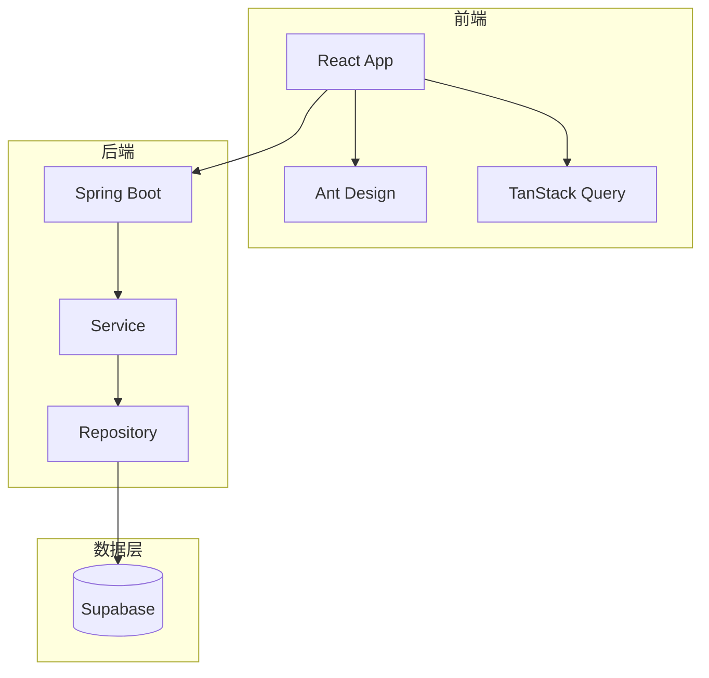
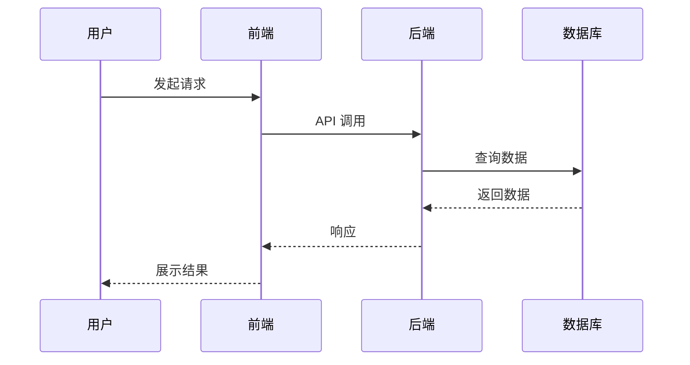
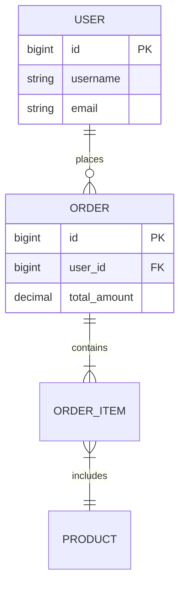
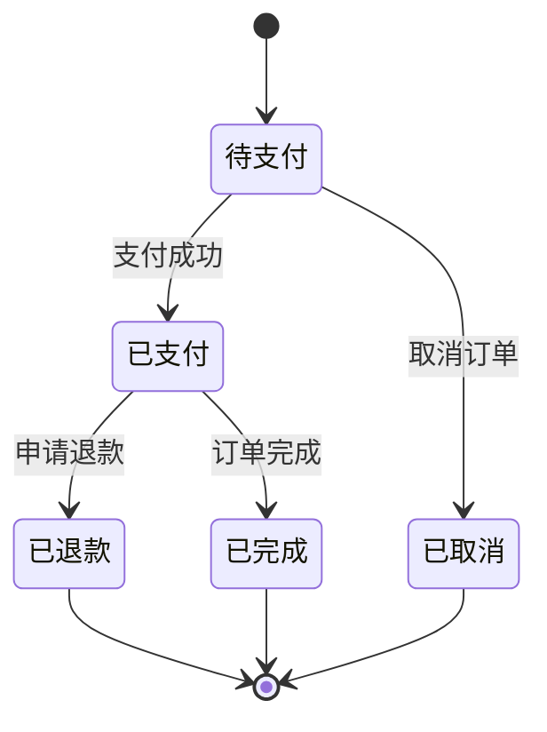

# 设计文档标准

本文档定义了设计文档编写的质量标准和最佳实践。

## 文档结构标准

### 1. 技术设计文档 (TDD) 结构

```
1. 概述
   1.1 背景
   1.2 项目目标
   1.3 范围边界
   1.4 术语定义
2. 需求摘要
   2.1 功能需求
   2.2 非功能需求
3. 技术选型
   3.1 技术栈
   3.2 技术决策记录
4. 系统架构设计
   4.1 架构概览
   4.2 分层架构
   4.3 组件架构
5. 核心模块设计
6. 数据模型设计
   6.1 ER 图
   6.2 表结构定义
7. 接口设计
   7.1 API 概览
   7.2 接口详情
8. 安全设计
9. 性能设计
10. 测试策略
11. 风险评估
12. 部署方案
13. 附录
```

### 2. 系统架构设计文档结构

```
1. 架构概述
   1.1 架构目标
   1.2 设计原则
   1.3 关键约束
2. 架构视图
   2.1 逻辑视图
   2.2 开发视图
   2.3 进程视图
   2.4 物理视图
3. 系统分层
4. 组件设计
5. 技术组件选型
6. 部署架构
7. 安全架构
8. 可扩展性设计
9. 性能架构
10. 运维架构
```

### 3. 详细设计文档 (DDD) 结构

```
1. 模块概述
2. 类图设计
3. 时序图设计
4. 状态机设计
5. 算法设计
6. 异常处理设计
7. 性能优化设计
8. 接口定义
9. 数据结构
10. 配置管理
```

### 4. 接口设计文档结构

```
1. 接口概述
2. 通用规范
   2.1 基础路径
   2.2 认证方式
   2.3 通用响应格式
   2.4 HTTP 状态码
3. API 端点
4. 错误码表
5. 数据类型定义
6. 版本管理
7. 限流策略
8. 附录
```

### 5. 数据库设计文档结构

```
1. 数据模型概述
2. ER 图
3. 表结构设计
4. 索引设计
5. 数据字典
6. 数据迁移方案
7. 备份策略
8. 性能优化
```

---

## 质量检查标准

### 内容完整性

- [ ] 所有章节按模板要求填写
- [ ] 关键设计决策有明确理由
- [ ] 架构图/时序图/ER 图清晰完整
- [ ] 接口定义包含请求/响应示例
- [ ] 数据模型包含字段类型和约束
- [ ] 风险评估有缓解措施
- [ ] 测试策略明确覆盖范围

### 一致性检查

- [ ] 术语使用一致（参考术语表）
- [ ] 命名风格统一（驼峰/下划线/连字符）
- [ ] 技术栈符合项目规范
- [ ] API 响应格式符合 `.claude/rules/08-api-standards.md`
- [ ] 设计符合 `.claude/rules/` 中的技术栈规则

### 可读性检查

- [ ] 章节层次清晰（不超过 4 级标题）
- [ ] 图表有说明文字
- [ ] 代码示例有注释
- [ ] 复杂逻辑有流程图或伪代码
- [ ] 专业术语有定义

### 可追溯性检查

- [ ] 设计与需求有明确对应关系
- [ ] 引用的规格文档路径正确
- [ ] 技术决策有依据
- [ ] 变更历史记录完整

---

## Mermaid 图表规范

### 架构图 (graph)



**规范**：
- 使用 `TB`（Top to Bottom）或 `LR`（Left to Right）
- 使用 `subgraph` 分组相关组件
- 箭头表示依赖方向
- 数据库使用圆柱形符号 `[(Database)]`

### 时序图 (sequenceDiagram)



**规范**：
- 使用 `participant` 定义参与者（支持中文别名）
- 实线箭头 `->>` 表示请求
- 虚线箭头 `-->>` 表示响应
- 按时间顺序从上到下

### ER 图 (erDiagram)



**规范**：
- `||--||` 一对一
- `||--o{` 一对多
- `}o--o{` 多对多
- 使用大写表示实体名
- 在实体定义块中列出关键字段

### 状态机图 (stateDiagram-v2)



**规范**：
- `[*]` 表示起始/终止状态
- `-->` 表示状态转换
- 箭头上标注触发事件

---

## 命名规范

### 实体命名

- **Java 实体类**: PascalCase（如 `UserEntity`, `OrderItem`）
- **数据库表名**: snake_case（如 `user_entities`, `order_items`）
- **TypeScript 接口**: PascalCase（如 `UserProfile`, `OrderDetail`）

### API 端点命名

- **RESTful 风格**: 使用名词复数（如 `/api/users`, `/api/orders`）
- **路径参数**: 使用小写+连字符（如 `/api/scenario-packages/{id}`）
- **查询参数**: 使用驼峰命名（如 `?pageSize=20&sortBy=createdAt`）

### 变量命名

- **前端**: camelCase（如 `userName`, `totalAmount`）
- **后端 Java**: camelCase（如 `userId`, `createdAt`）
- **数据库字段**: snake_case（如 `user_id`, `created_at`）

---

## 文档生成流程

### 自动生成模式

1. 检查 `.specify/active_spec.txt` 获取当前功能规格
2. 读取 `specs/{specId}/spec.md` - 功能需求
3. 读取 `specs/{specId}/plan.md` - 技术方案
4. 读取 `specs/{specId}/data-model.md` - 数据模型
5. 读取 `specs/{specId}/contracts/api.yaml` - API 定义
6. 读取 `specs/{specId}/research.md` - 技术决策
7. 加载项目规范（`.claude/rules/`）
8. 选择模板生成文档
9. 输出到 `specs/{specId}/design/`

### 手动生成模式

1. 询问用户文档类型
2. 询问项目背景和目标
3. 询问技术栈约束
4. 询问特殊要求
5. 生成文档

---

## 禁止行为

- ❌ 禁止编造不存在的技术组件
- ❌ 禁止使用未经项目规范认可的技术栈
- ❌ 禁止省略关键章节（如风险评估、测试策略）
- ❌ 禁止使用不符合规范的 API 响应格式
- ❌ 禁止在没有依据的情况下做技术决策

---

## 附录：常用术语表

| 术语 | 定义 |
|------|------|
| TDD | Technical Design Document（技术设计文档） |
| DDD | Detailed Design Document（详细设计文档） |
| ER 图 | Entity-Relationship Diagram（实体关系图） |
| API | Application Programming Interface（应用程序接口） |
| REST | Representational State Transfer（表述性状态传递） |
| JWT | JSON Web Token（JSON 网络令牌） |
| CRUD | Create, Read, Update, Delete（增删改查） |
| Supabase | 开源 Firebase 替代品，提供数据库、认证、存储服务 |
| TanStack Query | 前端数据获取和缓存库（原 React Query） |
| Zustand | 轻量级 React 状态管理库 |
| Ant Design | 企业级 React UI 组件库 |
| Taro | 多端统一开发框架 |

---

**文档版本**: 1.0.0
**更新日期**: 2025-12-26
