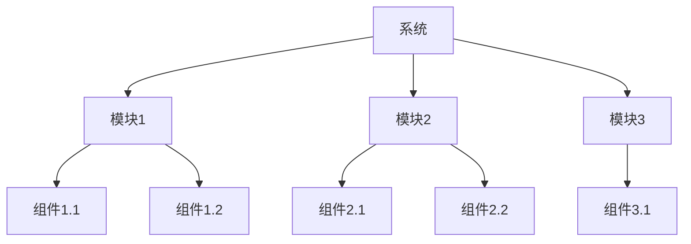
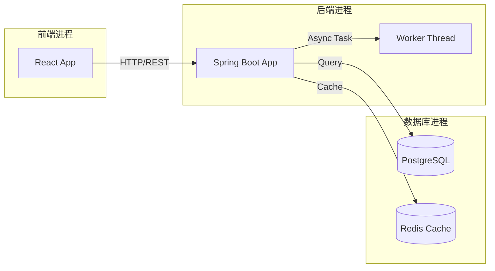
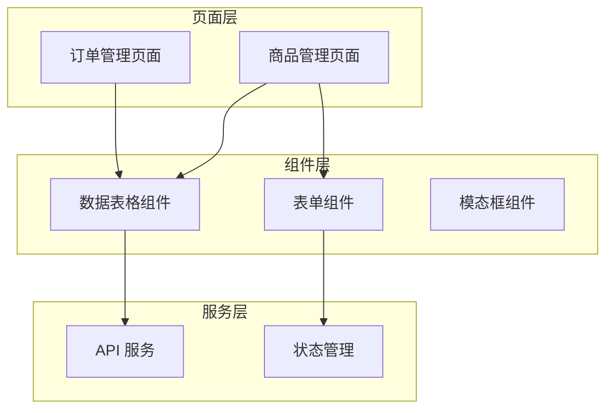
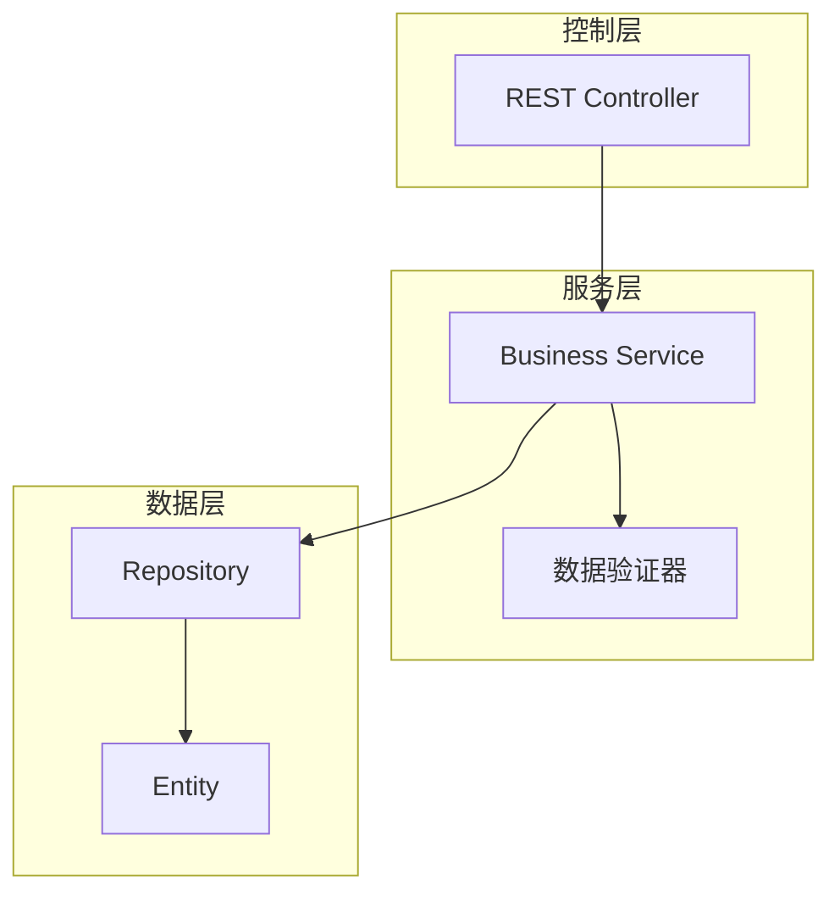
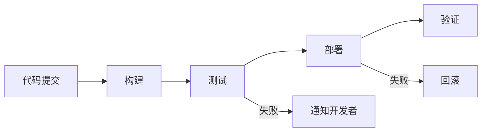
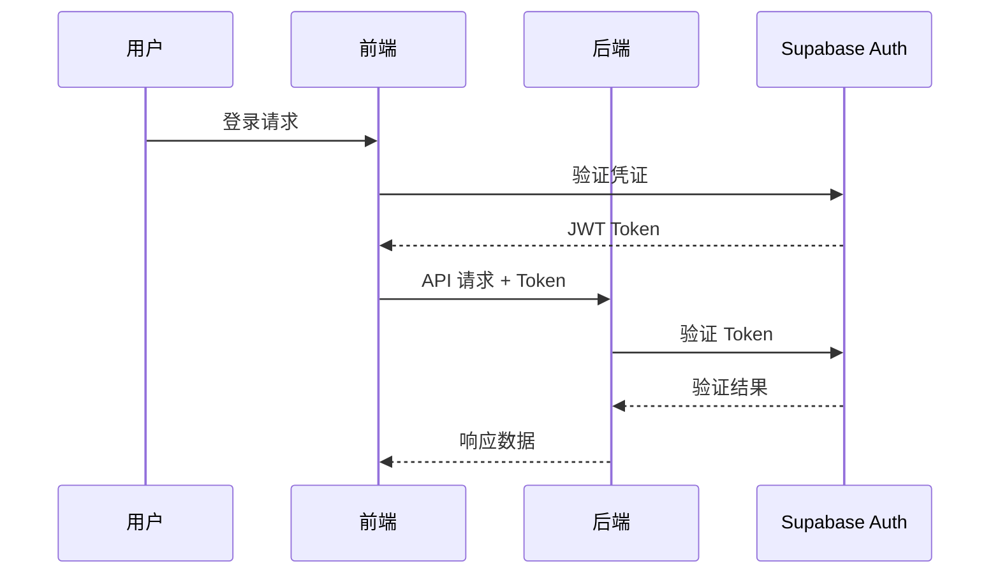
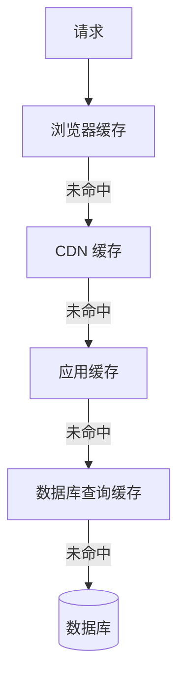
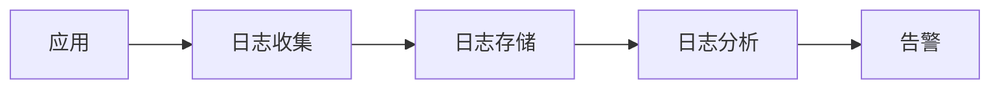

# 系统架构设计文档 - {{specId}}

**文档版本**: 1.0
**创建日期**: {{date}}
**作者**: {{author}}
**审核人**: [待指定]

---

## 变更历史

| 版本 | 日期 | 作者 | 变更说明 |
|------|------|------|----------|
| 1.0 | {{date}} | {{author}} | 初始版本 |

---

## 1. 架构概述

### 1.1 架构目标

{{architectureGoals}}

### 1.2 设计原则

{{#each designPrinciples}}
- **{{name}}**: {{description}}
{{/each}}

### 1.3 关键约束

| 约束类型 | 描述 | 影响 |
|---------|------|------|
{{#each constraints}}
| {{type}} | {{description}} | {{impact}} |
{{/each}}

---

## 2. 架构视图

### 2.1 逻辑视图

**功能分解**:



{{logicalViewDescription}}

### 2.2 开发视图

**代码组织结构**:

```
{{projectStructure}}
```

{{developmentViewDescription}}

### 2.3 进程视图

**运行时组件交互**:



{{processViewDescription}}

### 2.4 物理视图

**部署拓扑**:

```mermaid
graph TB
    subgraph 用户层
        User[用户浏览器]
    end

    subgraph CDN
        CDN[静态资源 CDN]
    end

    subgraph 应用层
        LB[负载均衡器]
        App1[应用实例1]
        App2[应用实例2]
    end

    subgraph 数据层
        DB[(主数据库)]
        DBReplica[(从数据库)]
        Cache[(Redis)]
    end

    User --> CDN
    User --> LB
    LB --> App1
    LB --> App2
    App1 --> DB
    App2 --> DB
    App1 --> Cache
    App2 --> Cache
    DB --> DBReplica
```

{{physicalViewDescription}}

---

## 3. 系统分层

### 3.1 分层架构

| 层次 | 职责 | 技术选型 | 关键组件 |
|------|------|----------|----------|
{{#each layers}}
| {{name}} | {{responsibility}} | {{technology}} | {{components}} |
{{/each}}

### 3.2 层间交互规则

{{#each layerInteractionRules}}
- **{{from}} → {{to}}**: {{rule}}
{{/each}}

### 3.3 跨层关注点

#### 日志记录
{{loggingStrategy}}

#### 异常处理
{{exceptionHandlingStrategy}}

#### 事务管理
{{transactionStrategy}}

---

## 4. 组件设计

### 4.1 前端组件架构



{{#each frontendComponents}}
#### {{name}}

**职责**: {{responsibility}}

**依赖**: {{dependencies}}

**状态管理**: {{stateManagement}}
{{/each}}

### 4.2 后端组件架构



{{#each backendComponents}}
#### {{name}}

**职责**: {{responsibility}}

**接口**: {{interface}}

**依赖注入**: {{dependencies}}
{{/each}}

---

## 5. 技术组件选型

### 5.1 前端技术栈

| 组件类型 | 选型 | 版本 | 理由 |
|---------|------|------|------|
{{#each frontendTechStack}}
| {{category}} | {{choice}} | {{version}} | {{rationale}} |
{{/each}}

### 5.2 后端技术栈

| 组件类型 | 选型 | 版本 | 理由 |
|---------|------|------|------|
{{#each backendTechStack}}
| {{category}} | {{choice}} | {{version}} | {{rationale}} |
{{/each}}

### 5.3 基础设施组件

| 组件类型 | 选型 | 理由 |
|---------|------|------|
{{#each infrastructureTechStack}}
| {{category}} | {{choice}} | {{rationale}} |
{{/each}}

---

## 6. 部署架构

### 6.1 环境划分

| 环境 | 用途 | 配置 | 访问地址 |
|------|------|------|----------|
{{#each environments}}
| {{name}} | {{purpose}} | {{config}} | {{url}} |
{{/each}}

### 6.2 容器化方案

**Docker 镜像结构**:

```dockerfile
# 前端镜像
FROM node:18-alpine AS builder
WORKDIR /app
COPY package*.json ./
RUN npm ci
COPY . .
RUN npm run build

FROM nginx:alpine
COPY --from=builder /app/dist /usr/share/nginx/html
EXPOSE 80
```

### 6.3 CI/CD 流程



{{cicdDescription}}

---

## 7. 安全架构

### 7.1 认证授权

**认证流程**:



**权限模型**: {{permissionModel}}

### 7.2 数据安全

| 安全措施 | 实现方式 | 适用范围 |
|---------|---------|---------|
{{#each dataSecurityMeasures}}
| {{measure}} | {{implementation}} | {{scope}} |
{{/each}}

### 7.3 网络安全

{{#each networkSecurityMeasures}}
- **{{name}}**: {{description}}
{{/each}}

---

## 8. 可扩展性设计

### 8.1 水平扩展

**前端扩展**:
{{frontendScalability}}

**后端扩展**:
{{backendScalability}}

### 8.2 垂直扩展

{{verticalScalability}}

### 8.3 缓存策略



| 缓存层 | 技术 | 策略 | TTL |
|-------|------|------|-----|
{{#each cacheStrategy}}
| {{layer}} | {{technology}} | {{strategy}} | {{ttl}} |
{{/each}}

---

## 9. 性能架构

### 9.1 性能目标

| 指标 | 目标值 | 测量方法 |
|------|--------|----------|
{{#each performanceTargets}}
| {{metric}} | {{target}} | {{measurement}} |
{{/each}}

### 9.2 性能优化策略

**前端优化**:
{{#each frontendOptimizations}}
- **{{name}}**: {{description}}
{{/each}}

**后端优化**:
{{#each backendOptimizations}}
- **{{name}}**: {{description}}
{{/each}}

### 9.3 监控指标

{{#each monitoringMetrics}}
- **{{metric}}**: {{description}} (阈值: {{threshold}})
{{/each}}

---

## 10. 运维架构

### 10.1 日志管理

**日志架构**:



{{loggingArchitecture}}

### 10.2 监控告警

| 监控类型 | 工具 | 告警条件 |
|---------|------|---------|
{{#each monitoringRules}}
| {{type}} | {{tool}} | {{condition}} |
{{/each}}

### 10.3 备份恢复

**备份策略**:
{{backupStrategy}}

**恢复流程**:
{{recoveryProcedure}}

---

## 11. 架构演进

### 11.1 当前架构局限

{{#each currentLimitations}}
- {{this}}
{{/each}}

### 11.2 未来演进方向

{{#each evolutionDirections}}
#### {{title}}
{{description}}

**时间规划**: {{timeline}}
**技术准备**: {{preparation}}
{{/each}}

---

## 12. 附录

### 12.1 技术决策记录 (ADR)

{{#each adrs}}
#### ADR-{{@index}}: {{title}}

- **状态**: {{status}}
- **背景**: {{context}}
- **决策**: {{decision}}
- **后果**: {{consequences}}
{{/each}}

### 12.2 参考资料

{{#each references}}
- [{{title}}]({{url}})
{{/each}}
