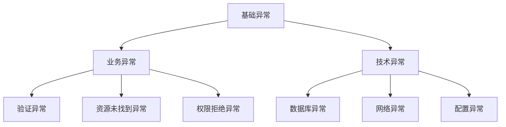

# 详细设计文档 (DDD) - {{specId}}

**文档版本**: 1.0
**创建日期**: {{date}}
**作者**: {{author}}

---

## 1. 模块概述

### 1.1 模块说明

{{moduleDescription}}

### 1.2 设计目标

{{#each designGoals}}
- {{this}}
{{/each}}

### 1.3 模块依赖

```mermaid
graph TB
    {{moduleName}} --> Dependency1[依赖模块1]
    {{moduleName}} --> Dependency2[依赖模块2]
    Dependency1 --> SharedLib[共享库]
    Dependency2 --> SharedLib
```

{{moduleDependencyDescription}}

---

## 2. 类图设计

### 2.1 核心类图

```mermaid
classDiagram
{{classDiagram}}
```

### 2.2 类说明

{{#each classes}}
#### {{className}}

**职责**: {{responsibility}}

**属性**:
{{#each attributes}}
- `{{name}}`: {{type}} - {{description}}
{{/each}}

**方法**:
{{#each methods}}
- `{{signature}}`: {{description}}
  - **参数**: {{parameters}}
  - **返回值**: {{returnType}}
  - **异常**: {{exceptions}}
{{/each}}

**设计模式**: {{#if designPattern}}{{designPattern}}{{else}}无{{/if}}

---

{{/each}}

---

## 3. 时序图设计

{{#each sequenceDiagrams}}
### 3.{{@index}}. {{title}}

**场景描述**: {{description}}

```mermaid
sequenceDiagram
{{diagram}}
```

**流程说明**:
{{#each steps}}
{{@index}}. {{this}}
{{/each}}

**异常处理**:
{{#each exceptionHandling}}
- **异常**: {{exception}}
- **处理**: {{handling}}
{{/each}}

---

{{/each}}

## 4. 状态机设计

{{#if hasStateMachine}}
### 4.1 状态机图

```mermaid
stateDiagram-v2
{{stateMachine}}
```

### 4.2 状态定义

{{#each states}}
#### {{name}}

- **说明**: {{description}}
- **可能的转换**: {{transitions}}
- **进入动作**: {{onEntry}}
- **退出动作**: {{onExit}}
{{/each}}

### 4.3 事件定义

{{#each events}}
#### {{eventName}}

- **触发条件**: {{triggerCondition}}
- **前置状态**: {{fromStates}}
- **后置状态**: {{toState}}
- **副作用**: {{sideEffects}}
{{/each}}

{{else}}
本模块无状态机设计。
{{/if}}

---

## 5. 算法设计

{{#each algorithms}}
### 5.{{@index}}. {{name}}

**功能**: {{purpose}}

**输入**: {{input}}

**输出**: {{output}}

**时间复杂度**: {{timeComplexity}}

**空间复杂度**: {{spaceComplexity}}

#### 算法流程

```mermaid
flowchart TD
    Start([开始]) --> Step1[{{step1}}]
    Step1 --> Decision1{{{decision1}}}
    Decision1 -->|是| Step2[{{step2}}]
    Decision1 -->|否| Step3[{{step3}}]
    Step2 --> End([结束])
    Step3 --> End
```

#### 伪代码

```
{{pseudocode}}
```

#### 代码实现

```{{language}}
{{codeImplementation}}
```

#### 测试用例

{{#each testCases}}
- **输入**: {{input}}
- **预期输出**: {{expectedOutput}}
- **实际输出**: {{actualOutput}}
{{/each}}

---

{{/each}}

## 6. 数据结构设计

{{#each dataStructures}}
### 6.{{@index}}. {{name}}

**用途**: {{purpose}}

**定义**:
```{{language}}
{{definition}}
```

**操作复杂度**:

| 操作 | 时间复杂度 | 空间复杂度 |
|------|-----------|-----------|
{{#each operations}}
| {{operation}} | {{timeComplexity}} | {{spaceComplexity}} |
{{/each}}

**使用场景**: {{useCase}}

---

{{/each}}

## 7. 异常处理设计

### 7.1 异常层次结构



### 7.2 异常定义

{{#each exceptions}}
#### {{exceptionName}}

**类型**: {{type}}

**触发条件**: {{triggerCondition}}

**错误码**: {{errorCode}}

**错误消息**: {{errorMessage}}

**处理策略**: {{handlingStrategy}}

**示例**:
```{{language}}
{{example}}
```

---

{{/each}}

### 7.3 异常处理原则

{{#each exceptionHandlingPrinciples}}
- {{this}}
{{/each}}

---

## 8. 并发设计

{{#if hasConcurrency}}
### 8.1 并发场景

{{#each concurrencyScenarios}}
#### {{scenario}}

**并发类型**: {{type}}

**同步机制**: {{synchronizationMechanism}}

**死锁预防**: {{deadlockPrevention}}

**性能考虑**: {{performanceConsideration}}

**实现示例**:
```{{language}}
{{implementation}}
```

---

{{/each}}

### 8.2 线程安全策略

{{#each threadSafetyStrategies}}
- **策略**: {{strategy}}
- **适用场景**: {{applicableScenario}}
- **实现方式**: {{implementation}}
{{/each}}

{{else}}
本模块无并发场景。
{{/if}}

---

## 9. 性能优化设计

### 9.1 优化目标

| 指标 | 当前值 | 目标值 | 优化措施 |
|------|--------|--------|----------|
{{#each performanceTargets}}
| {{metric}} | {{currentValue}} | {{targetValue}} | {{optimization}} |
{{/each}}

### 9.2 优化策略

{{#each optimizationStrategies}}
#### {{name}}

**原理**: {{principle}}

**适用场景**: {{applicableScenario}}

**实现方式**:
```{{language}}
{{implementation}}
```

**性能提升**: {{performanceGain}}

**权衡**: {{tradeoffs}}

---

{{/each}}

### 9.3 缓存设计

{{#if hasCaching}}
#### 缓存策略

| 缓存对象 | 缓存键 | TTL | 更新策略 |
|---------|--------|-----|---------|
{{#each cacheStrategies}}
| {{object}} | {{key}} | {{ttl}} | {{updateStrategy}} |
{{/each}}

#### 缓存实现

```{{language}}
{{cacheImplementation}}
```

{{else}}
本模块无缓存需求。
{{/if}}

---

## 10. 接口定义

{{#each interfaces}}
### 10.{{@index}}. {{interfaceName}}

**说明**: {{description}}

**类型**: {{interfaceType}}

#### 方法定义

{{#each methods}}
##### {{methodName}}

**签名**:
```{{language}}
{{signature}}
```

**参数**:
{{#each parameters}}
- `{{name}}`: {{type}} - {{description}}
{{/each}}

**返回值**: {{returnType}} - {{returnDescription}}

**异常**:
{{#each exceptions}}
- `{{name}}`: {{condition}}
{{/each}}

**前置条件**:
{{#each preconditions}}
- {{this}}
{{/each}}

**后置条件**:
{{#each postconditions}}
- {{this}}
{{/each}}

**示例**:
```{{language}}
{{example}}
```

---

{{/each}}

{{/each}}

## 11. 配置管理

### 11.1 配置项定义

{{#each configItems}}
#### {{name}}

| 属性 | 值 |
|------|-----|
| 配置键 | `{{key}}` |
| 数据类型 | {{dataType}} |
| 默认值 | {{defaultValue}} |
| 说明 | {{description}} |
| 可选值 | {{#if allowedValues}}{{allowedValues}}{{else}}任意{{/if}} |
| 环境差异 | {{#if envDifferences}}{{envDifferences}}{{else}}无{{/if}} |

---

{{/each}}

### 11.2 配置示例

**开发环境** (`application-dev.yml`):
```yaml
{{devConfig}}
```

**生产环境** (`application-prod.yml`):
```yaml
{{prodConfig}}
```

---

## 12. 测试设计

### 12.1 单元测试

{{#each unitTests}}
#### {{testName}}

**测试目标**: {{target}}

**测试用例**:
{{#each testCases}}
- **输入**: {{input}}
- **预期输出**: {{expectedOutput}}
- **边界条件**: {{boundaryCondition}}
{{/each}}

**测试代码**:
```{{language}}
{{testCode}}
```

---

{{/each}}

### 12.2 集成测试

{{#each integrationTests}}
#### {{testName}}

**测试场景**: {{scenario}}

**依赖模块**: {{dependencies}}

**测试步骤**:
{{#each steps}}
{{@index}}. {{this}}
{{/each}}

**验证点**:
{{#each verifications}}
- {{this}}
{{/each}}

---

{{/each}}

---

## 13. 部署说明

### 13.1 部署依赖

{{#each deploymentDependencies}}
- **组件**: {{component}}
- **版本要求**: {{versionRequirement}}
- **配置要求**: {{configRequirement}}
{{/each}}

### 13.2 部署步骤

{{#each deploymentSteps}}
{{@index}}. {{this}}
{{/each}}

### 13.3 健康检查

**健康检查端点**: {{healthCheckEndpoint}}

**检查项**:
{{#each healthChecks}}
- {{this}}
{{/each}}

---

## 14. 附录

### 14.1 设计决策记录

{{#each designDecisions}}
#### 决策 {{@index}}: {{title}}

- **日期**: {{date}}
- **背景**: {{context}}
- **决策**: {{decision}}
- **理由**: {{rationale}}
- **后果**: {{consequences}}
{{/each}}

### 14.2 术语表

| 术语 | 定义 |
|------|------|
{{#each glossary}}
| {{term}} | {{definition}} |
{{/each}}

### 14.3 参考资料

{{#each references}}
- [{{title}}]({{url}})
{{/each}}
