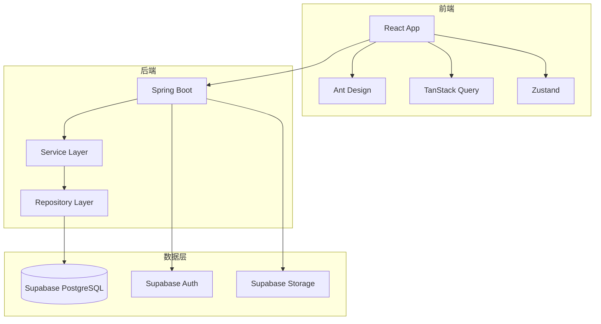
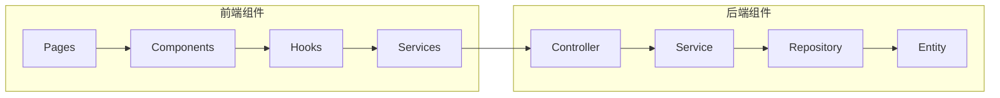
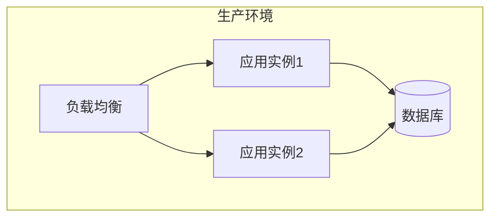

# 技术设计文档 (TDD) - {{specId}}

**文档版本**: 1.0
**创建日期**: {{date}}
**作者**: {{author}}
**审核人**: [待指定]

---

## 变更历史

| 版本 | 日期 | 作者 | 变更说明 |
|------|------|------|----------|
| 1.0 | {{date}} | {{author}} | 初始版本 |

---

## 1. 概述

### 1.1 背景
{{background}}

### 1.2 项目目标
{{objectives}}

### 1.3 范围边界

**包含范围**:
{{inScope}}

**不包含范围**:
{{outOfScope}}

### 1.4 术语定义

| 术语 | 定义 |
|------|------|
{{#each glossary}}
| {{term}} | {{definition}} |
{{/each}}

---

## 2. 需求摘要

### 2.1 功能需求

{{#each userStories}}
#### {{priority}} - {{title}}
- **作为**: {{actor}}
- **我希望**: {{action}}
- **以便**: {{benefit}}

**验收标准**:
{{#each acceptanceCriteria}}
- {{this}}
{{/each}}
{{/each}}

### 2.2 非功能需求

| 类别 | 要求 | 指标 |
|------|------|------|
| 性能 | {{performanceRequirement}} | {{performanceMetric}} |
| 可用性 | {{availabilityRequirement}} | {{availabilityMetric}} |
| 安全性 | {{securityRequirement}} | {{securityMetric}} |
| 可扩展性 | {{scalabilityRequirement}} | {{scalabilityMetric}} |

---

## 3. 技术选型

### 3.1 技术栈

| 层次 | 技术 | 版本 | 选型理由 |
|------|------|------|----------|
{{#each techStack}}
| {{layer}} | {{technology}} | {{version}} | {{rationale}} |
{{/each}}

### 3.2 技术决策记录

{{#each decisions}}
#### 决策 {{@index}}: {{title}}
- **背景**: {{context}}
- **决策**: {{decision}}
- **替代方案**: {{alternatives}}
- **理由**: {{rationale}}
- **后果**: {{consequences}}
{{/each}}

---

## 4. 系统架构设计

### 4.1 架构概览



### 4.2 分层架构

| 层次 | 职责 | 技术 |
|------|------|------|
| 表现层 | UI 渲染、用户交互 | React + Ant Design |
| 应用层 | 业务流程编排、状态管理 | TanStack Query + Zustand |
| 服务层 | 业务逻辑实现 | Spring Boot Services |
| 数据层 | 数据持久化、访问 | Supabase + JPA |

### 4.3 组件架构



---

## 5. 核心模块设计

{{#each modules}}
### 5.{{@index}}. {{name}}

**职责**: {{responsibility}}

**接口定义**:
```typescript
{{interface}}
```

**依赖关系**:
{{#each dependencies}}
- {{this}}
{{/each}}

**关键逻辑**:
{{keyLogic}}
{{/each}}

---

## 6. 数据模型设计

### 6.1 ER 图

```mermaid
erDiagram
{{erDiagram}}
```

### 6.2 表结构定义

{{#each tables}}
#### {{name}}

| 字段名 | 类型 | 约束 | 说明 |
|--------|------|------|------|
{{#each columns}}
| {{name}} | {{type}} | {{constraints}} | {{description}} |
{{/each}}

**索引**:
{{#each indexes}}
- {{this}}
{{/each}}
{{/each}}

---

## 7. 接口设计

### 7.1 API 概览

| 方法 | 路径 | 说明 |
|------|------|------|
{{#each endpoints}}
| {{method}} | {{path}} | {{description}} |
{{/each}}

### 7.2 接口详情

{{#each endpoints}}
#### {{method}} {{path}}

**说明**: {{description}}

**请求参数**:
```json
{{requestExample}}
```

**响应示例**:
```json
{{responseExample}}
```

**错误码**:
| 错误码 | 说明 |
|--------|------|
{{#each errorCodes}}
| {{code}} | {{message}} |
{{/each}}
{{/each}}

---

## 8. 安全设计

### 8.1 认证授权

- **认证方式**: {{authMethod}}
- **权限模型**: {{permissionModel}}

### 8.2 数据安全

- **敏感数据**: {{sensitiveData}}
- **加密策略**: {{encryptionStrategy}}

### 8.3 安全检查项

- [ ] 输入验证（防 XSS/SQL 注入）
- [ ] 认证授权检查
- [ ] 敏感数据加密
- [ ] 日志脱敏
- [ ] HTTPS 传输

---

## 9. 性能设计

### 9.1 性能目标

| 场景 | 目标 | 测量方法 |
|------|------|----------|
{{#each performanceTargets}}
| {{scenario}} | {{target}} | {{measurement}} |
{{/each}}

### 9.2 优化策略

{{#each optimizationStrategies}}
- **{{name}}**: {{description}}
{{/each}}

---

## 10. 测试策略

### 10.1 测试覆盖

| 测试类型 | 覆盖范围 | 工具 |
|----------|----------|------|
| 单元测试 | 业务逻辑、工具函数 | Vitest / JUnit |
| 集成测试 | API 接口、数据库 | MSW / Spring Test |
| E2E 测试 | 用户流程 | Playwright |

### 10.2 关键测试用例

{{#each testCases}}
- **{{name}}**: {{description}}
{{/each}}

---

## 11. 风险评估

### 11.1 技术风险

| 风险 | 影响 | 可能性 | 缓解措施 |
|------|------|--------|----------|
{{#each technicalRisks}}
| {{risk}} | {{impact}} | {{probability}} | {{mitigation}} |
{{/each}}

### 11.2 业务风险

| 风险 | 影响 | 可能性 | 缓解措施 |
|------|------|--------|----------|
{{#each businessRisks}}
| {{risk}} | {{impact}} | {{probability}} | {{mitigation}} |
{{/each}}

---

## 12. 部署方案

### 12.1 部署架构



### 12.2 部署步骤

1. {{deployStep1}}
2. {{deployStep2}}
3. {{deployStep3}}

### 12.3 回滚方案

{{rollbackPlan}}

---

## 13. 附录

### 13.1 参考文档

{{#each references}}
- [{{title}}]({{url}})
{{/each}}

### 13.2 待确认事项

{{#each pendingItems}}
- [ ] {{this}}
{{/each}}
