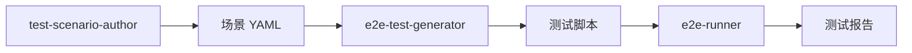

# e2e-runner

**@spec T003-e2e-runner**

E2E 测试运行器 - 统一测试执行入口，支持多环境配置和报告生成

## Description

e2e-runner 是一个 Claude Code Skill，提供统一的 E2E 测试执行入口。它支持通过 E2ERunConfig 配置文件在不同环境（staging、UAT、production）执行相同的测试脚本，实现测试资产的多环境复用。

**核心功能**:
- 🚀 **统一执行入口**: 通过 `/e2e-runner run` 命令执行 Playwright 测试
- 🌍 **多环境支持**: 使用 E2ERunConfig 配置不同环境的 baseURL 和凭据
- 🔒 **凭据管理**: 通过 `credentials_ref` 安全引用凭据文件，避免敏感信息泄露
- 📊 **报告生成**: 自动生成 HTML 和 JSON 格式的测试报告
- 🔧 **灵活配置**: 支持并行执行、重试策略、超时控制
- 🌐 **多浏览器测试**: 支持 Playwright projects 配置（Chrome、Firefox、Mobile）
- 🔗 **无缝集成**: 与 test-scenario-author 和 e2e-test-generator 工作流集成

**依赖关系**:
- **test-scenario-author (T001)**: 提供场景 YAML 文件
- **e2e-test-generator (T002)**: 生成 Playwright 测试脚本
- **Playwright**: 测试执行引擎

## Usage

### 基本用法

```bash
/e2e-runner run --config <config-file>
```

**示例**:
```bash
# 在 staging 环境执行测试
/e2e-runner run --config configs/saas-staging.json

# 在 UAT 环境执行测试
/e2e-runner run --config configs/onprem-uat.json
```

### 命令参数

| 命令 | 参数 | 说明 |
|-----|------|------|
| `run` | `--config <file>` | 指定运行配置文件（必需） |
| `run` | `--force` | 强制覆盖已存在的报告目录（可选） |
| `validate` | `--config <file>` | 验证配置文件格式（可选功能） |

### 配置文件格式 (E2ERunConfig)

**最小配置**:
```json
{
  "env_profile": "saas-staging",
  "baseURL": "https://staging.cinema.com",
  "report_output_dir": "./reports/run-2025-12-30-14-30"
}
```

**完整配置**:
```json
{
  "env_profile": "saas-staging",
  "baseURL": "https://staging.cinema.com",
  "projects": [
    {
      "name": "chromium",
      "use": { "browserName": "chromium" }
    },
    {
      "name": "Mobile Chrome",
      "use": {
        "browserName": "chromium",
        "viewport": { "width": 375, "height": 667 },
        "isMobile": true
      }
    }
  ],
  "credentials_ref": "credentials/saas-staging.json",
  "retries": 2,
  "workers": 4,
  "timeout": 60000,
  "report_output_dir": "./reports/run-2025-12-30-14-30",
  "testMatch": "scenarios/**/*.spec.ts"
}
```

**字段说明**:

| 字段 | 类型 | 必需 | 说明 |
|-----|------|------|------|
| `env_profile` | string | ✅ | 环境标识符（如 "saas-staging"） |
| `baseURL` | string | ✅ | 目标环境的基础 URL |
| `report_output_dir` | string | ✅ | 报告输出目录（必须唯一） |
| `projects[]` | array | ❌ | Playwright projects 配置 |
| `credentials_ref` | string | ❌ | 凭据文件路径 |
| `retries` | number | ❌ | 失败重试次数（默认 0） |
| `workers` | number | ❌ | 并发 worker 数（默认 CPU 核心数） |
| `timeout` | number | ❌ | 测试超时时间（默认 30000ms） |
| `testMatch` | string | ❌ | 测试文件 glob 模式（默认 "scenarios/**/*.spec.ts"） |

### 凭据文件格式 (CredentialsFile)

**路径**: `credentials/<env_profile>.json`

**格式**:
```json
{
  "env_profile": "saas-staging",
  "users": [
    {
      "role": "admin",
      "username": "admin@cinema.com",
      "password": "SecurePassword123!"
    },
    {
      "role": "user",
      "username": "user@cinema.com",
      "password": "UserPassword456!"
    }
  ],
  "api_keys": [
    {
      "service": "supabase",
      "api_key": "eyJhbGciOiJIUzI1NiIsInR5cCI6IkpXVCJ9...",
      "api_secret": "sk_test_abcdef123456"
    }
  ]
}
```

**安全要求**:
```bash
# 设置文件权限（仅所有者可读写）
chmod 600 credentials/*.json

# 添加到 .gitignore
echo "credentials/" >> .gitignore
```

## Examples

### 示例 1: 基本测试执行

**场景**: 在 staging 环境执行所有测试

**Step 1**: 创建配置文件

`configs/saas-staging.json`:
```json
{
  "env_profile": "saas-staging",
  "baseURL": "https://staging.cinema.com",
  "report_output_dir": "./reports/staging-2025-12-30"
}
```

**Step 2**: 执行测试

```bash
/e2e-runner run --config configs/saas-staging.json
```

**预期输出**:
```
🚀 E2E Test Runner - Starting execution

📋 Configuration:
   Environment: saas-staging
   Base URL: https://staging.cinema.com
   Workers: 8 (CPU cores)
   Retries: 0

🔍 Discovered 15 test files

⏳ Running tests...

✅ Test Results:
   Total: 15
   Passed: 13
   Failed: 2
   Duration: 45.3s

📊 Report generated:
   HTML: ./reports/staging-2025-12-30/index.html
   JSON: ./reports/staging-2025-12-30/results.json
```

**Step 3**: 查看报告

```bash
open ./reports/staging-2025-12-30/index.html
```

---

### 示例 2: 多环境测试

**场景**: 在 staging 和 UAT 环境执行相同的测试

**Step 1**: 创建环境配置文件

`configs/saas-staging.json`:
```json
{
  "env_profile": "saas-staging",
  "baseURL": "https://staging.cinema.com",
  "credentials_ref": "credentials/saas-staging.json",
  "report_output_dir": "./reports/staging-2025-12-30"
}
```

`configs/onprem-uat.json`:
```json
{
  "env_profile": "onprem-uat",
  "baseURL": "https://uat.cinema-onprem.com",
  "credentials_ref": "credentials/onprem-uat.json",
  "report_output_dir": "./reports/uat-2025-12-30"
}
```

**Step 2**: 创建凭据文件

`credentials/saas-staging.json`:
```json
{
  "env_profile": "saas-staging",
  "users": [
    {
      "role": "admin",
      "username": "admin@staging.cinema.com",
      "password": "StagingPass123!"
    }
  ]
}
```

`credentials/onprem-uat.json`:
```json
{
  "env_profile": "onprem-uat",
  "users": [
    {
      "role": "admin",
      "username": "admin@uat.cinema-onprem.com",
      "password": "UatPass456!"
    }
  ]
}
```

**Step 3**: 依次执行测试

```bash
# Staging 环境
/e2e-runner run --config configs/saas-staging.json

# UAT 环境
/e2e-runner run --config configs/onprem-uat.json
```

**Step 4**: 对比结果

```bash
# 查看 staging 报告
open ./reports/staging-2025-12-30/index.html

# 查看 UAT 报告
open ./reports/uat-2025-12-30/index.html
```

---

### 示例 3: 多浏览器测试

**场景**: 在 Chrome、Firefox 和 Mobile Safari 中执行测试

**Step 1**: 创建多浏览器配置

`configs/multi-browser.json`:
```json
{
  "env_profile": "saas-staging",
  "baseURL": "https://staging.cinema.com",
  "projects": [
    {
      "name": "Desktop Chrome",
      "use": {
        "browserName": "chromium",
        "viewport": { "width": 1920, "height": 1080 }
      }
    },
    {
      "name": "Desktop Firefox",
      "use": {
        "browserName": "firefox",
        "viewport": { "width": 1920, "height": 1080 }
      }
    },
    {
      "name": "Mobile Safari",
      "use": {
        "browserName": "webkit",
        "viewport": { "width": 375, "height": 667 },
        "isMobile": true
      }
    }
  ],
  "report_output_dir": "./reports/multi-browser-2025-12-30"
}
```

**Step 2**: 执行测试

```bash
/e2e-runner run --config configs/multi-browser.json
```

**预期输出**:
```
✅ Test Results:
   Desktop Chrome: 15/15 passed
   Desktop Firefox: 14/15 passed (1 flaky)
   Mobile Safari: 13/15 passed (2 failures)
```

---

### 示例 4: 并行执行与重试

**场景**: 使用 8 个 worker 并行执行，失败测试重试 2 次

**Step 1**: 创建并行配置

`configs/parallel.json`:
```json
{
  "env_profile": "saas-staging",
  "baseURL": "https://staging.cinema.com",
  "workers": 8,
  "retries": 2,
  "timeout": 60000,
  "report_output_dir": "./reports/parallel-2025-12-30"
}
```

**Step 2**: 执行测试

```bash
/e2e-runner run --config configs/parallel.json
```

**性能对比**:
```
串行执行 (workers=1): 180s
并行执行 (workers=8): 45s (75% 提速)
```

---

### 示例 5: 选择性测试执行

**场景**: 仅执行 inventory 模块的测试

**Step 1**: 创建选择性配置

`configs/inventory-only.json`:
```json
{
  "env_profile": "saas-staging",
  "baseURL": "https://staging.cinema.com",
  "testMatch": "scenarios/inventory/**/*.spec.ts",
  "report_output_dir": "./reports/inventory-2025-12-30"
}
```

**Step 2**: 执行测试

```bash
/e2e-runner run --config configs/inventory-only.json
```

**预期输出**:
```
🔍 Discovered 5 test files:
   - scenarios/inventory/E2E-INVENTORY-001.spec.ts
   - scenarios/inventory/E2E-INVENTORY-002.spec.ts
   - scenarios/inventory/E2E-INVENTORY-003.spec.ts
   - scenarios/inventory/E2E-INVENTORY-004.spec.ts
   - scenarios/inventory/E2E-INVENTORY-005.spec.ts

✅ Test Results: 5/5 passed
```

---

### 示例 6: CI/CD 集成

**场景**: 在 GitHub Actions 中执行 E2E 测试

`.github/workflows/e2e-tests.yml`:
```yaml
name: E2E Tests

on:
  push:
    branches: [main]
  pull_request:

jobs:
  e2e-tests:
    runs-on: ubuntu-latest

    steps:
      - name: Checkout code
        uses: actions/checkout@v3

      - name: Setup Node.js
        uses: actions/setup-node@v3
        with:
          node-version: '18'

      - name: Install dependencies
        run: npm ci

      - name: Install Playwright browsers
        run: npx playwright install --with-deps

      - name: Create credentials file
        run: |
          mkdir -p credentials
          echo '${{ secrets.STAGING_CREDENTIALS }}' > credentials/saas-staging.json
          chmod 600 credentials/saas-staging.json

      - name: Run E2E tests
        run: |
          /e2e-runner run --config configs/saas-staging.json

      - name: Upload test report
        if: always()
        uses: actions/upload-artifact@v3
        with:
          name: playwright-report
          path: ./reports/
          retention-days: 30
```

**GitHub Secrets 配置**:

在 GitHub repository settings 中添加 secret `STAGING_CREDENTIALS`:
```json
{
  "env_profile": "saas-staging",
  "users": [
    {
      "role": "admin",
      "username": "ci-admin@cinema.com",
      "password": "${{ secrets.CI_ADMIN_PASSWORD }}"
    }
  ]
}
```

---

## Workflow Integration

### 端到端工作流



**完整流程**:

1. **创建场景** (test-scenario-author):
   ```bash
   /test-scenario-author create --module inventory
   ```
   输出: `scenarios/inventory/E2E-INVENTORY-001.yaml`

2. **生成测试脚本** (e2e-test-generator):
   ```bash
   /e2e-test-generator generate E2E-INVENTORY-001
   ```
   输出: `scenarios/inventory/E2E-INVENTORY-001.spec.ts`

3. **执行测试** (e2e-runner):
   ```bash
   /e2e-runner run --config configs/saas-staging.json
   ```
   输出: `./reports/staging-2025-12-30/index.html`

---

## Configuration

### 环境配置文件模板

**推荐目录结构**:
```
configs/
├── dev.json              # 本地开发环境
├── saas-staging.json     # SaaS staging 环境
├── saas-production.json  # SaaS 生产环境
├── onprem-uat.json       # 私有化 UAT 环境
└── onprem-production.json # 私有化生产环境

credentials/
├── saas-staging.json
├── onprem-uat.json
└── .gitignore            # 确保凭据不进入 Git
```

**`.gitignore` 配置**:
```gitignore
# Credentials
credentials/
secrets/
*.credentials.json

# Test reports
reports/
test-results/
playwright-report/
```

### 报告目录命名约定

**推荐格式**: `./reports/<env>-<date>-<time>`

**示例**:
```
./reports/staging-2025-12-30-14-30
./reports/uat-2025-12-30-15-45
./reports/production-2025-12-31-09-00
```

**自动化脚本** (生成唯一目录名):
```bash
#!/bin/bash
ENV_PROFILE="saas-staging"
TIMESTAMP=$(date +%Y-%m-%d-%H-%M-%S)
REPORT_DIR="./reports/${ENV_PROFILE}-${TIMESTAMP}"

# 更新配置文件中的 report_output_dir
jq --arg dir "$REPORT_DIR" '.report_output_dir = $dir' configs/saas-staging.json > tmp.json
mv tmp.json configs/saas-staging.json

# 执行测试
/e2e-runner run --config configs/saas-staging.json
```

---

## Troubleshooting

### 常见问题排查

#### 1. 配置文件未找到

**错误**:
```
❌ Error: Configuration file not found: configs/missing.json
```

**解决方案**:
```bash
# 检查文件路径
ls configs/missing.json

# 使用绝对路径
/e2e-runner run --config /absolute/path/to/configs/saas-staging.json
```

#### 2. 凭据文件未找到

**错误**:
```
❌ Error: Credentials file not found: credentials/saas-staging.json
```

**解决方案**:
```bash
# 检查凭据文件是否存在
ls credentials/saas-staging.json

# 创建凭据文件
mkdir -p credentials
cat > credentials/saas-staging.json <<EOF
{
  "env_profile": "saas-staging",
  "users": [
    {
      "role": "admin",
      "username": "admin@cinema.com",
      "password": "your-password"
    }
  ]
}
EOF

# 设置权限
chmod 600 credentials/saas-staging.json
```

#### 3. baseURL 无法访问

**错误**:
```
❌ Error: baseURL unreachable: https://staging.cinema.com
```

**解决方案**:
```bash
# 检查网络连接
ping staging.cinema.com

# 测试 URL 可达性
curl -I https://staging.cinema.com

# 检查 VPN 连接
# 更新配置文件中的 baseURL
```

#### 4. 报告目录已存在

**错误**:
```
❌ Error: Report directory already exists: ./reports/run-2025-12-30-14-30
```

**解决方案**:
```bash
# 方案 1: 使用唯一目录名（推荐）
# 更新配置文件:
{
  "report_output_dir": "./reports/run-2025-12-30-14-30-15"  # 添加秒数
}

# 方案 2: 删除旧报告
rm -rf ./reports/run-2025-12-30-14-30

# 方案 3: 使用 --force 标志（如果实现）
/e2e-runner run --config configs/saas-staging.json --force
```

#### 5. Playwright 未安装

**错误**:
```
❌ Error: Playwright not installed or version incompatible
```

**解决方案**:
```bash
# 安装 Playwright
npm install -D @playwright/test

# 安装浏览器
npx playwright install

# 验证版本
npx playwright --version  # 应该 >= 1.40.0
```

#### 6. 测试超时

**错误**:
```
❌ Test timeout exceeded: 30000ms
```

**解决方案**:
```json
// 增加超时时间
{
  "timeout": 60000  // 60 秒
}
```

---

## Dependencies

- **test-scenario-author (T001)**: 场景 YAML 文件生成器
- **e2e-test-generator (T002)**: Playwright 测试脚本生成器
- **Playwright (@playwright/test)**: >= 1.40.0
- **Node.js**: >= 18.0.0

---

## Technical Details

**实现语言**: TypeScript / Python

**核心依赖**:
- Playwright Test Runner
- Node.js fs/path modules
- JSON Schema validator

**目录结构**:
```
.claude/skills/e2e-runner/
├── skill.md                # 本文档
├── scripts/                # 脚本实现
│   ├── cli.ts              # CLI 入口
│   ├── config-loader.ts    # 配置加载器
│   ├── credentials-loader.ts # 凭据加载器
│   ├── runner.ts           # 测试执行器
│   ├── reporter.ts         # 报告生成器
│   └── validator.ts        # 配置验证器
└── templates/              # 模板文件
    └── playwright.config.template.ts
```

---

## Version

**Current Version**: 1.0.0 (MVP)

**Roadmap**:
- ✅ P1: 基本测试执行与报告生成
- ✅ P1: 凭据管理
- ✅ P1: 多环境支持
- 🔜 P2: 多浏览器/设备测试
- 🔜 P2: 集成工作流自动化
- 🔜 P3: 配置验证命令

---

## References

- **Specification**: `specs/T003-e2e-runner/spec.md`
- **Data Model**: `specs/T003-e2e-runner/data-model.md`
- **Quick Start**: `specs/T003-e2e-runner/quickstart.md`
- **test-scenario-author**: `specs/T001-e2e-scenario-author/`
- **e2e-test-generator**: `specs/T002-e2e-test-generator/`
- **Playwright Docs**: https://playwright.dev/docs/intro
- **Playwright Test Config**: https://playwright.dev/docs/test-configuration
