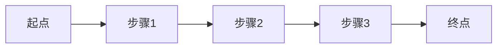

# 端到端测试用例文档

**功能模块**: [模块名称，如"小程序下单流程"]
**测试版本**: [版本号]
**编写人**: [测试人员]
**编写日期**: [YYYY-MM-DD]
**Spec 引用**: [specs/XXX-xxx/spec.md]

---

## 📋 测试概述

### 测试目标
[简要描述本次测试的目标和范围]

### 业务流程图


### 涉及系统/模块
- [ ] B端管理后台
- [ ] C端小程序
- [ ] C端H5
- [ ] 后端API
- [ ] 数据库

---

## 🔑 关键业务节点

| 节点序号 | 节点名称 | 操作端 | 关键检查点 |
|---------|---------|-------|----------|
| 1 | [节点1名称] | [B端/C端] | [关键检查内容] |
| 2 | [节点2名称] | [B端/C端] | [关键检查内容] |
| 3 | [节点3名称] | [系统] | [关键检查内容] |

---

## 📝 测试用例清单

### TC-001: [用例标题] - 正向流程

**用例ID**: TC-001
**优先级**: 🔴 高 / 🟡 中 / 🟢 低
**测试类型**: 功能测试 / 集成测试 / 端到端测试

**前置条件**:
- [ ] 条件1
- [ ] 条件2
- [ ] 条件3

**测试数据**:
```
数据项1: 值1
数据项2: 值2
数据项3: 值3
```

**测试步骤**:

| 步骤 | 操作端 | 操作描述 | 预期结果 | 实际结果 | 通过状态 |
|-----|-------|---------|---------|---------|---------|
| 1 | [B端/C端/API] | [详细操作步骤] | [预期结果] | [执行后填写] | ☐ 通过 ☐ 失败 |
| 2 | [B端/C端/API] | [详细操作步骤] | [预期结果] | [执行后填写] | ☐ 通过 ☐ 失败 |
| 3 | [B端/C端/API] | [详细操作步骤] | [预期结果] | [执行后填写] | ☐ 通过 ☐ 失败 |

**后置检查**:
- [ ] 数据库状态检查: [检查内容]
- [ ] 库存数据检查: [检查内容]
- [ ] 日志记录检查: [检查内容]

---

### TC-002: [用例标题] - 异常流程

**用例ID**: TC-002
**优先级**: 🟡 中
**测试类型**: 异常测试

**前置条件**:
- [ ] 条件1

**异常场景**: [描述异常情况，如"库存不足时下单"]

**测试步骤**:

| 步骤 | 操作端 | 操作描述 | 预期结果 | 实际结果 | 通过状态 |
|-----|-------|---------|---------|---------|---------|
| 1 | [B端/C端/API] | [详细操作步骤] | [预期结果] | [执行后填写] | ☐ 通过 ☐ 失败 |
| 2 | [B端/C端/API] | [详细操作步骤] | [预期错误提示] | [执行后填写] | ☐ 通过 ☐ 失败 |

**异常处理验证**:
- [ ] 错误提示正确
- [ ] 数据未被破坏
- [ ] 库存未被错误扣减

---

### TC-003: [用例标题] - 边界条件

**用例ID**: TC-003
**优先级**: 🟡 中
**测试类型**: 边界测试

**边界场景**: [描述边界情况，如"库存剩余1件时下单"]

**测试步骤**:

| 步骤 | 操作端 | 操作描述 | 预期结果 | 实际结果 | 通过状态 |
|-----|-------|---------|---------|---------|---------|
| 1 | [B端/C端/API] | [详细操作步骤] | [预期结果] | [执行后填写] | ☐ 通过 ☐ 失败 |

---

## 🔄 状态流转测试

### 订单状态流转

| 当前状态 | 操作 | 目标状态 | 是否允许 | 测试结果 |
|---------|------|---------|---------|---------|
| 待支付 | 支付成功 | 待发货 | ✅ | ☐ 通过 ☐ 失败 |
| 待支付 | 取消订单 | 已取消 | ✅ | ☐ 通过 ☐ 失败 |
| 待支付 | 超时未支付 | 已取消 | ✅ | ☐ 通过 ☐ 失败 |
| 待发货 | 确认发货 | 已发货 | ✅ | ☐ 通过 ☐ 失败 |
| 已发货 | 确认收货 | 已完成 | ✅ | ☐ 通过 ☐ 失败 |
| 已完成 | 申请退款 | 退款中 | ✅ | ☐ 通过 ☐ 失败 |

---

## 📊 数据验证检查清单

### 库存数据验证

| 检查项 | 检查位置 | 检查内容 | 预期值 | 实际值 | 状态 |
|-------|---------|---------|-------|-------|------|
| 可用库存 | inventory.available | 扣减后库存 | [预期值] | [实际值] | ☐ ✅ ☐ ❌ |
| 锁定库存 | inventory.locked | 锁定数量 | [预期值] | [实际值] | ☐ ✅ ☐ ❌ |
| 库存日志 | inventory_transactions | 日志记录 | [预期记录] | [实际记录] | ☐ ✅ ☐ ❌ |

### 订单数据验证

| 检查项 | 检查位置 | 检查内容 | 预期值 | 实际值 | 状态 |
|-------|---------|---------|-------|-------|------|
| 订单状态 | orders.status | 订单状态 | [预期状态] | [实际状态] | ☐ ✅ ☐ ❌ |
| 订单金额 | orders.total_amount | 总金额 | [预期金额] | [实际金额] | ☐ ✅ ☐ ❌ |
| 订单日志 | order_logs | 日志记录 | [预期记录] | [实际记录] | ☐ ✅ ☐ ❌ |

---

## 🐛 缺陷记录

### BUG-001

**发现时间**: [YYYY-MM-DD HH:mm]
**发现用例**: TC-XXX
**严重程度**: 🔴 严重 / 🟡 一般 / 🟢 轻微

**问题描述**:
[详细描述发现的问题]

**复现步骤**:
1. 步骤1
2. 步骤2
3. 步骤3

**预期结果**:
[应该是什么样]

**实际结果**:
[实际是什么样]

**影响范围**:
[影响哪些功能/用户]

**截图/日志**:
[附上截图或日志]

---

## 📈 测试总结

### 测试执行统计

| 统计项 | 数量 |
|-------|------|
| 总用例数 | XX |
| 通过用例数 | XX |
| 失败用例数 | XX |
| 阻塞用例数 | XX |
| 用例通过率 | XX% |

### 问题汇总

| 问题ID | 严重程度 | 问题描述 | 状态 |
|-------|---------|---------|------|
| BUG-001 | 🔴 严重 | [问题描述] | ☐ 待修复 ☐ 已修复 |
| BUG-002 | 🟡 一般 | [问题描述] | ☐ 待修复 ☐ 已修复 |

### 测试结论

- [ ] ✅ 测试通过，可以发布
- [ ] ⚠️ 测试通过，但有待优化项
- [ ] ❌ 测试不通过，存在阻塞问题

**遗留问题**:
[列出未解决的问题]

**建议**:
[给出测试建议]

---

## 📎 附录

### 测试环境信息
- 测试环境: [开发/测试/预发布]
- 数据库版本: [版本号]
- 后端API版本: [版本号]
- 前端版本: [版本号]
- 小程序版本: [版本号]

### 参考文档
- Spec文档: [链接]
- API文档: [链接]
- 数据库设计: [链接]
