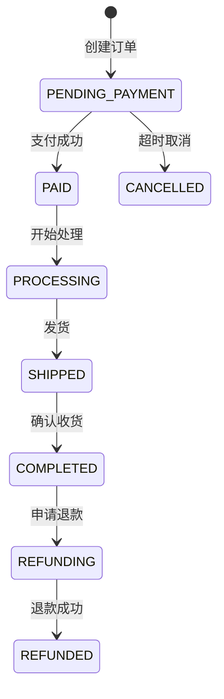

# 零售/电商行业最佳实践

## 1. 商品管理 (Product/SKU Management)

### 核心原则
- **SPU/SKU 分离**: 标准商品单元(SPU) vs 库存单元(SKU)
- **多规格支持**: 颜色、尺寸、口味等规格组合
- **商品生命周期**: 新品、在售、下架、清仓
- **富文本描述**: 支持图文混排、视频、3D展示

### 关键字段
```typescript
interface Product {
  id: string
  spuCode: string          // SPU编码
  name: string
  category: Category       // 多级分类
  brand: Brand
  status: 'DRAFT' | 'ACTIVE' | 'INACTIVE' | 'DISCONTINUED'
  attrs: Attribute[]       // 商品属性
  skus: SKU[]              // SKU列表
  images: Image[]
  description: RichText
  seo: SEOInfo             // SEO优化
  createdAt: Date
  updatedAt: Date
}

interface SKU {
  id: string
  skuCode: string
  spuId: string
  specs: Spec[]            // 规格值 [{name: '颜色', value: '红色'}]
  price: Price             // 价格体系
  stock: number            // 库存
  barcode: string          // 条形码
  weight: number
  dimensions: Dimensions
}
```

### 最佳实践
✅ 使用唯一 SKU 编码（支持条形码扫描）
✅ 支持批量导入/导出
✅ 商品变更历史记录
✅ 多语言/多币种支持
✅ 图片压缩和 CDN 加速

❌ 反模式：
- 将 SKU 与 SPU 混淆
- 缺少规格组合验证
- 硬编码规格类型（应该可配置）
- 缺少商品审核流程

---

## 2. 库存管理 (Inventory Management)

### 核心原则
- **多仓库支持**: 总仓、门店仓、虚拟仓
- **实时库存**: 库存扣减、预占、释放
- **安全库存**: 库存预警、自动补货
- **库存快照**: 定期盘点、差异调整

### 关键实体
```typescript
interface Inventory {
  id: string
  skuId: string
  warehouseId: string
  available: number        // 可用库存
  locked: number           // 锁定库存（已下单未支付）
  damaged: number          // 损坏库存
  total: number            // 总库存 = available + locked + damaged
  safetyStock: number      // 安全库存
  lastUpdated: Date
}

interface InventoryTransaction {
  id: string
  type: 'IN' | 'OUT' | 'ADJUST' | 'TRANSFER'
  skuId: string
  warehouseId: string
  quantity: number
  beforeQty: number
  afterQty: number
  reason: string
  operator: string
  createdAt: Date
}
```

### 最佳实践
✅ 库存扣减幂等性（防止超卖）
✅ 库存预占机制（下单锁定，超时释放）
✅ 库存调整审批流程
✅ 库存移动记录（调拨、盘点）
✅ 库存预警通知

❌ 反模式：
- 直接修改库存数量（应该通过事务记录）
- 缺少库存锁定机制
- 库存扣减无原子性保证
- 缺少库存操作审计

---

## 3. 订单管理 (Order Management)

### 核心原则
- **订单状态机**: 明确的状态流转
- **订单拆分**: 按仓库、供应商拆分
- **售后支持**: 退款、换货、退货
- **订单溯源**: 完整的操作日志

### 订单状态机


### 关键实体
```typescript
interface Order {
  id: string
  orderNo: string          // 订单号
  userId: string
  status: OrderStatus
  items: OrderItem[]
  totalAmount: Money
  discountAmount: Money
  shippingFee: Money
  finalAmount: Money
  paymentMethod: string
  shippingAddress: Address
  invoice: Invoice
  logs: OrderLog[]         // 操作日志
  createdAt: Date
}

interface OrderItem {
  skuId: string
  quantity: number
  price: Money
  discount: Money
  subtotal: Money
}
```

### 最佳实践
✅ 唯一订单号（支持幂等提交）
✅ 订单超时自动取消
✅ 支付成功后异步处理（消息队列）
✅ 订单快照（记录下单时的商品信息）
✅ 订单搜索和筛选

❌ 反模式：
- 直接修改订单状态（应该通过状态机）
- 缺少订单锁（并发修改）
- 缺少订单日志
- 硬编码状态流转规则

---

## 4. 会员系统 (Membership/CRM)

### 核心原则
- **会员等级**: 普通、银卡、金卡、钻石等
- **积分体系**: 积分获取、消费、过期
- **权益管理**: 折扣、优惠券、专属活动
- **标签分组**: 用户画像、精准营销

### 关键实体
```typescript
interface Member {
  id: string
  mobile: string
  email: string
  tier: 'BASIC' | 'SILVER' | 'GOLD' | 'DIAMOND'
  points: number
  growth: number           // 成长值
  tags: string[]           // 用户标签
  registeredAt: Date
  lastActiveAt: Date
}

interface PointsTransaction {
  id: string
  memberId: string
  type: 'EARN' | 'REDEEM' | 'EXPIRE' | 'ADJUST'
  points: number
  reason: string
  orderId?: string
  expiresAt?: Date
  createdAt: Date
}
```

### 最佳实践
✅ 积分过期策略（先进先出）
✅ 会员等级自动升降级
✅ 生日/节日自动营销
✅ 会员行为分析
✅ 隐私保护（手机号脱敏）

❌ 反模式：
- 积分无过期机制
- 缺少积分变动记录
- 硬编码会员等级规则
- 缺少用户画像

---

## 5. 促销系统 (Promotion/Marketing)

### 核心原则
- **多种促销类型**: 满减、折扣、买赠、优惠券
- **促销叠加规则**: 互斥、可叠加、优先级
- **时间/库存限制**: 限时、限量
- **用户限制**: 新客专享、会员专享

### 关键实体
```typescript
interface Promotion {
  id: string
  name: string
  type: 'DISCOUNT' | 'FULL_REDUCTION' | 'GIFT' | 'COUPON'
  rules: PromotionRule[]
  conditions: Condition[]  // 条件：满额、指定商品、会员等级
  priority: number
  stackable: boolean       // 是否可叠加
  startTime: Date
  endTime: Date
  quota: number            // 限量
  usedCount: number
}

interface Coupon {
  id: string
  code: string
  type: 'FIXED' | 'PERCENTAGE' | 'FREE_SHIPPING'
  value: number
  minAmount: Money         // 最低消费
  validFrom: Date
  validTo: Date
  maxUseCount: number
  userMaxUse: number       // 单用户最多使用次数
}
```

### 最佳实践
✅ 促销规则可视化配置
✅ 促销效果数据分析
✅ 优惠券批量生成和发放
✅ 防刷机制（限制领取）
✅ 促销库存预扣

❌ 反模式：
- 硬编码促销规则
- 缺少促销互斥检查
- 优惠券无防刷机制
- 缺少促销效果追踪

---

## 6. 数据模型设计原则

### 通用最佳实践
✅ 使用 UUID 或雪花 ID（分布式友好）
✅ 软删除（deleted_at）保留历史数据
✅ 乐观锁（version）防止并发冲突
✅ 创建时间/更新时间审计字段
✅ 操作人记录（created_by, updated_by）
✅ 状态枚举使用常量/枚举类型
✅ 金额使用 BigDecimal（避免精度丢失）
✅ 时间统一使用 UTC 存储

### 数据库设计
✅ 主表 + 扩展表（避免宽表）
✅ 索引优化（查询字段、外键）
✅ 分区表（大数据量场景）
✅ 读写分离（主从复制）
✅ 缓存策略（Redis）

---

## 7. API 设计规范

### RESTful 设计
```
GET    /api/products          # 商品列表
GET    /api/products/:id      # 商品详情
POST   /api/products          # 创建商品
PUT    /api/products/:id      # 更新商品
DELETE /api/products/:id      # 删除商品

# 嵌套资源
GET    /api/products/:id/skus       # 商品下的SKU列表
POST   /api/orders/:id/refund       # 订单退款
```

### 分页/排序/筛选
```
GET /api/products?page=1&pageSize=20&sort=price:desc&category=electronics
```

### 响应格式
```json
{
  "success": true,
  "data": { ... },
  "timestamp": "2025-12-28T10:00:00Z"
}
```

---

## 8. 性能优化

### 常见优化手段
✅ 数据库索引优化
✅ 查询分页（避免全表扫描）
✅ N+1 查询优化（JOIN 或批量查询）
✅ 缓存热点数据（商品详情、分类树）
✅ 异步处理（订单处理、库存同步）
✅ CDN 加速（图片、静态资源）
✅ 接口防抖/节流

---

## 9. 安全规范

### 数据安全
✅ 用户密码加密（bcrypt）
✅ 敏感数据脱敏（手机号、身份证）
✅ SQL 注入防护（参数化查询）
✅ XSS 防护（输入验证、输出转义）
✅ CSRF 防护（Token 验证）
✅ API 限流（防止恶意攻击）

### 权限控制
✅ RBAC 角色权限模型
✅ 接口权限验证
✅ 数据权限隔离（租户、门店）
