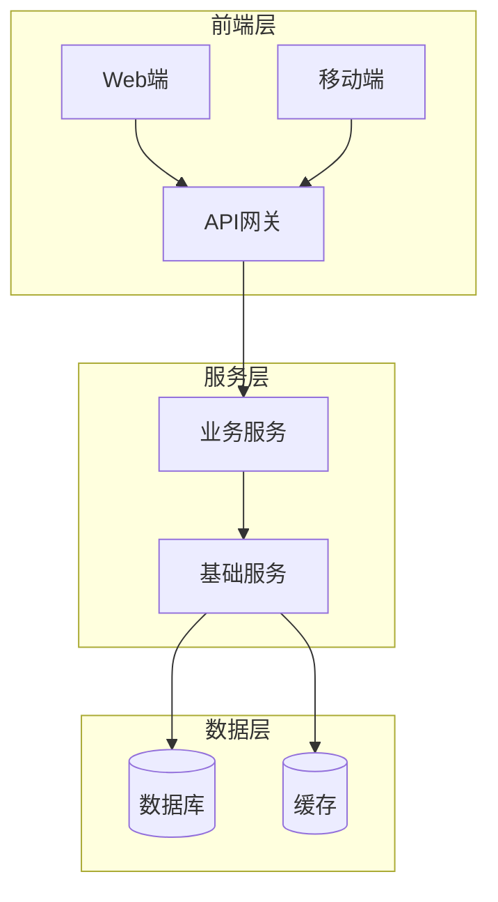
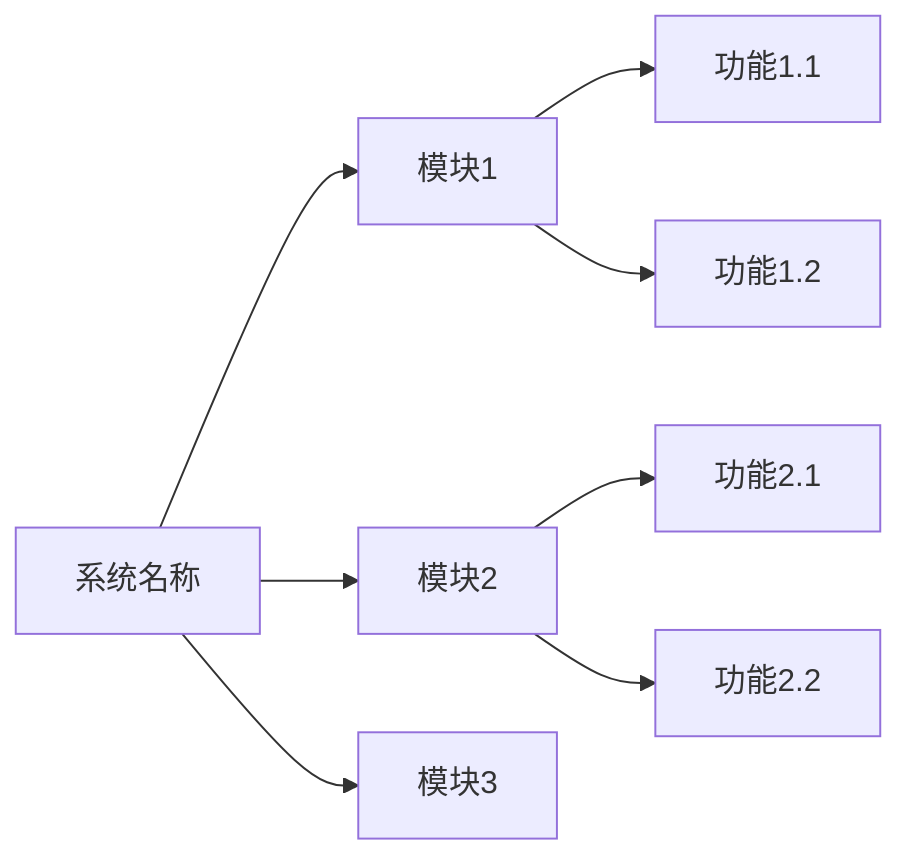
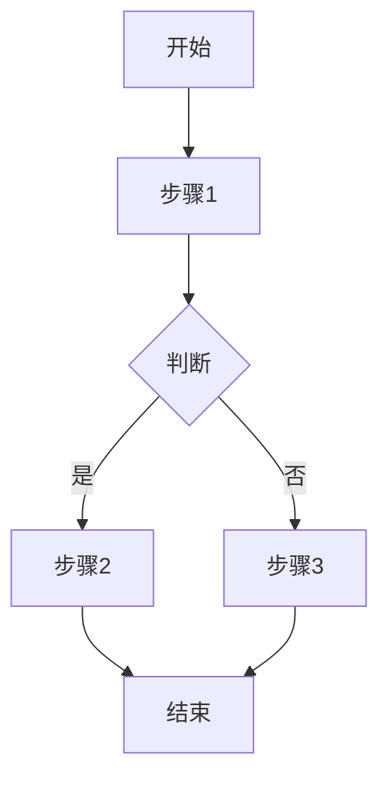

# [系统名称] 设计方案

## 文档信息
| 项目 | 内容 |
|-----|------|
| 文档版本 | V1.0 |
| 创建日期 | [日期] |
| 作者 | [作者] |
| 审核人 | [审核人] |
| 状态 | 草稿/评审中/已发布 |

## 修订记录
| 版本 | 日期 | 修订人 | 修订内容 |
|-----|------|-------|---------|
| V1.0 | [日期] | [作者] | 初稿 |

---

## 1. 概述

### 1.1 背景
[描述项目背景、业务痛点、建设必要性]

### 1.2 目标
[明确本次建设的核心目标，可量化的指标]

### 1.3 范围
**包含范围：**
- [功能模块1]
- [功能模块2]

**不包含范围：**
- [排除项1]
- [排除项2]

### 1.4 术语定义
| 术语 | 定义 |
|-----|------|
| [术语1] | [解释] |
| [术语2] | [解释] |

---

## 2. 系统架构

### 2.1 整体架构
[插入架构图，可使用mermaid语法]



### 2.2 技术选型
| 层级 | 技术/组件 | 说明 |
|-----|----------|------|
| 前端 | [技术栈] | [选型理由] |
| 后端 | [技术栈] | [选型理由] |
| 数据库 | [数据库] | [选型理由] |
| 缓存 | [缓存方案] | [选型理由] |
| 消息队列 | [MQ方案] | [选型理由] |

### 2.3 部署架构
[描述部署方案、服务器配置、网络拓扑]

---

## 3. 功能设计

### 3.1 功能模块总览


### 3.2 [模块1名称]

#### 3.2.1 功能描述
[详细描述该模块的功能]

#### 3.2.2 业务流程


#### 3.2.3 功能清单
| 功能编号 | 功能名称 | 功能描述 | 优先级 |
|---------|---------|---------|-------|
| F001 | [功能名] | [描述] | P0/P1/P2 |

### 3.3 [模块2名称]
[重复3.2的结构]

---

## 4. 数据设计

### 4.1 概念模型
[ER图或实体关系描述]

### 4.2 核心数据表设计

#### 4.2.1 [表名] 表
| 字段名 | 类型 | 必填 | 说明 |
|-------|------|------|------|
| id | bigint | 是 | 主键 |
| [字段] | [类型] | [是/否] | [说明] |
| create_time | datetime | 是 | 创建时间 |
| update_time | datetime | 是 | 更新时间 |

**索引设计：**
- 主键索引：id
- 唯一索引：[字段]
- 普通索引：[字段]

---

## 5. 接口设计

### 5.1 接口规范
- 协议：HTTPS
- 格式：JSON
- 鉴权：Bearer Token

### 5.2 接口清单

#### 5.2.1 [接口名称]
- **路径：** `POST /api/v1/[resource]`
- **描述：** [功能描述]

**请求参数：**
```json
{
  "field1": "string",
  "field2": 123
}
```

**响应示例：**
```json
{
  "code": 0,
  "message": "success",
  "data": {
    "id": 1
  }
}
```

---

## 6. 非功能性需求

### 6.1 性能需求
| 指标 | 要求 |
|-----|------|
| 响应时间 | 核心接口 < 200ms |
| 并发能力 | 支持 [X] 并发用户 |
| TPS | [X] 笔/秒 |

### 6.2 安全需求
- [安全要求1]
- [安全要求2]

### 6.3 可用性需求
- 系统可用性：99.9%
- 数据备份：每日全量备份

### 6.4 扩展性需求
- [扩展性要求]

---

## 7. 实施计划

### 7.1 里程碑
| 阶段 | 内容 | 交付物 |
|-----|------|-------|
| 需求确认 | 需求评审通过 | 需求文档 |
| 设计评审 | 技术方案评审 | 设计文档 |
| 开发 | 功能开发 | 代码 |
| 测试 | 功能/性能测试 | 测试报告 |
| 上线 | 部署上线 | 上线报告 |

### 7.2 风险评估
| 风险项 | 影响 | 概率 | 应对措施 |
|-------|------|------|---------|
| [风险1] | 高/中/低 | 高/中/低 | [措施] |

---

## 8. 附录

### 8.1 参考文档
- [文档1]
- [文档2]

### 8.2 相关系统
| 系统名称 | 接口方式 | 说明 |
|---------|---------|------|
| [系统1] | API | [交互说明] |
