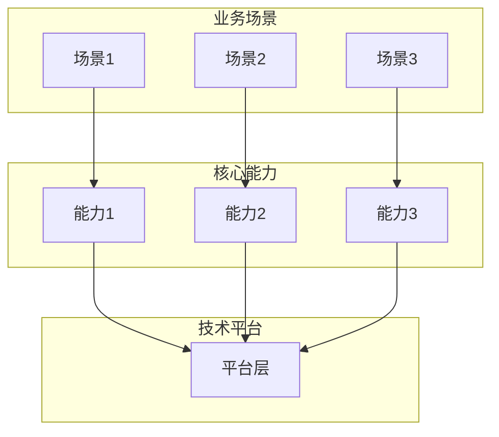
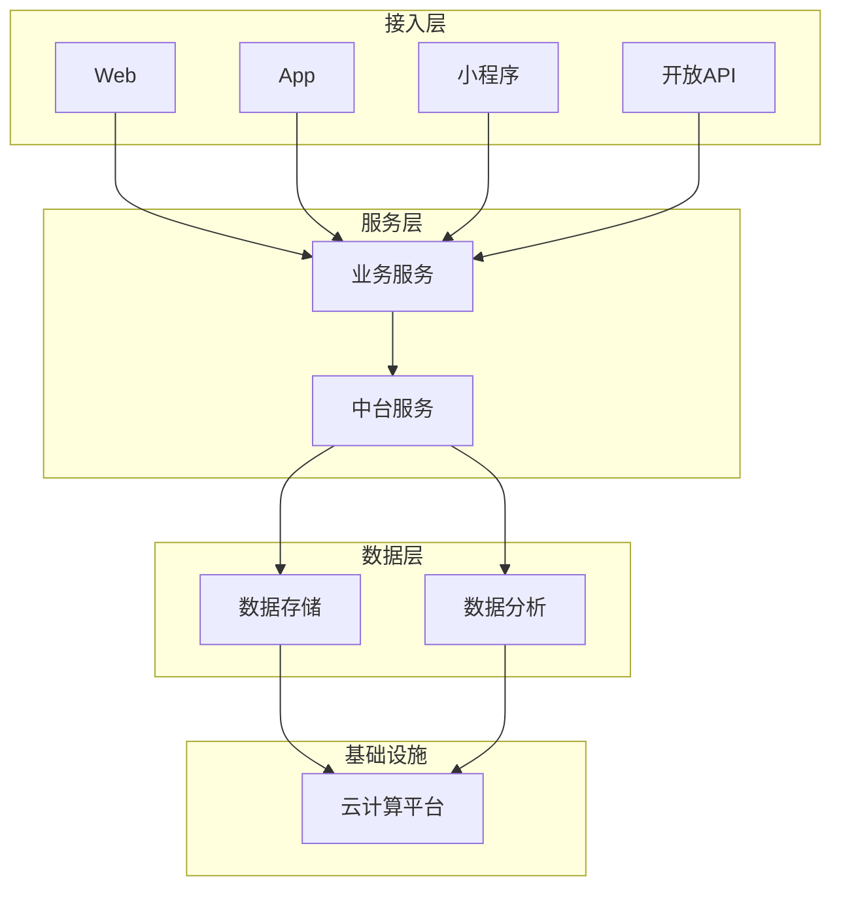
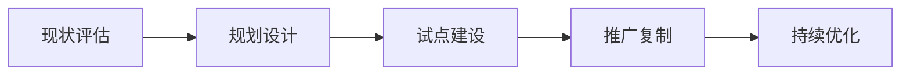

# [解决方案名称]
## 行业解决方案

---

## 文档信息
| 项目 | 内容 |
|-----|------|
| 版本 | V1.0 |
| 日期 | [日期] |
| 保密级别 | 内部/公开 |

---

## 摘要
[2-3句话概括解决方案的核心价值主张]

---

## 1. 行业背景与挑战

### 1.1 行业现状
[描述当前行业发展阶段、市场规模、主要特征]

### 1.2 核心痛点
| 痛点 | 描述 | 影响 |
|-----|------|------|
| **[痛点1]** | [具体描述] | [对业务的影响] |
| **[痛点2]** | [具体描述] | [对业务的影响] |
| **[痛点3]** | [具体描述] | [对业务的影响] |

### 1.3 转型趋势
- **趋势一：** [趋势描述]
- **趋势二：** [趋势描述]
- **趋势三：** [趋势描述]

---

## 2. 解决方案概述

### 2.1 方案定位
[一句话定义方案是什么，解决什么问题]

### 2.2 核心理念
```
┌─────────────────────────────────────────────┐
│                                             │
│              [核心理念/口号]                 │
│                                             │
└─────────────────────────────────────────────┘
```

### 2.3 整体架构


---

## 3. 核心功能与价值

### 3.1 [核心功能1]

#### 功能描述
[详细描述功能内容]

#### 业务价值
- **价值点1：** [描述]
- **价值点2：** [描述]

#### 典型场景
[描述应用场景和使用方式]

---

### 3.2 [核心功能2]
[重复3.1的结构]

---

### 3.3 [核心功能3]
[重复3.1的结构]

---

## 4. 技术架构

### 4.1 架构设计原则
- **可扩展性：** [说明]
- **高可用性：** [说明]
- **安全性：** [说明]
- **开放性：** [说明]

### 4.2 技术架构图


### 4.3 核心技术能力
| 能力 | 技术方案 | 说明 |
|-----|---------|------|
| [能力1] | [技术栈] | [说明] |
| [能力2] | [技术栈] | [说明] |

---

## 5. 实施路径

### 5.1 实施方法论


### 5.2 分阶段规划

#### 第一阶段：基础建设
- **目标：** [阶段目标]
- **内容：**
  - [建设内容1]
  - [建设内容2]
- **交付：** [交付成果]

#### 第二阶段：能力提升
- **目标：** [阶段目标]
- **内容：**
  - [建设内容1]
  - [建设内容2]
- **交付：** [交付成果]

#### 第三阶段：创新突破
- **目标：** [阶段目标]
- **内容：**
  - [建设内容1]
  - [建设内容2]
- **交付：** [交付成果]

### 5.3 关键成功因素
1. **组织保障：** [说明]
2. **资源投入：** [说明]
3. **变革管理：** [说明]

---

## 6. 客户案例

### 6.1 [案例1：客户名称]

#### 客户背景
[简要介绍客户情况]

#### 面临挑战
- [挑战1]
- [挑战2]

#### 解决方案
[实施的方案内容]

#### 实施成效
| 指标 | 实施前 | 实施后 | 提升 |
|-----|-------|-------|------|
| [指标1] | [数据] | [数据] | [百分比] |
| [指标2] | [数据] | [数据] | [百分比] |

#### 客户评价
> "[客户评价内容]"
> —— [客户名称]，[职位]

---

### 6.2 [案例2：客户名称]
[重复6.1的结构]

---

## 7. 投资回报分析

### 7.1 投资估算
| 投资项目 | 说明 | 估算范围 |
|---------|------|---------|
| 软件/平台 | [说明] | [金额范围] |
| 实施服务 | [说明] | [金额范围] |
| 运维支持 | [说明] | [金额范围] |

### 7.2 收益分析
| 收益类型 | 描述 | 预期效果 |
|---------|------|---------|
| 效率提升 | [描述] | [量化指标] |
| 成本降低 | [描述] | [量化指标] |
| 收入增长 | [描述] | [量化指标] |

### 7.3 ROI预测
- **投资回收期：** [X]个月
- **3年ROI：** [X]%

---

## 8. 为什么选择我们

### 8.1 核心优势
| 优势 | 说明 |
|-----|------|
| **行业经验** | [描述] |
| **技术实力** | [描述] |
| **服务能力** | [描述] |
| **生态资源** | [描述] |

### 8.2 服务承诺
- [承诺1]
- [承诺2]
- [承诺3]

---

## 附录

### 联系我们
- 咨询热线：[电话]
- 邮箱：[邮箱]
- 官网：[网址]

### 相关资料
- [资料1名称]
- [资料2名称]
