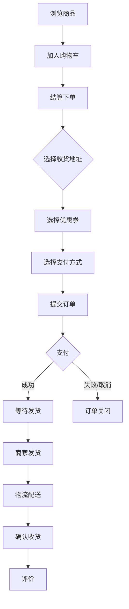
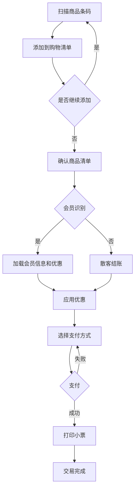
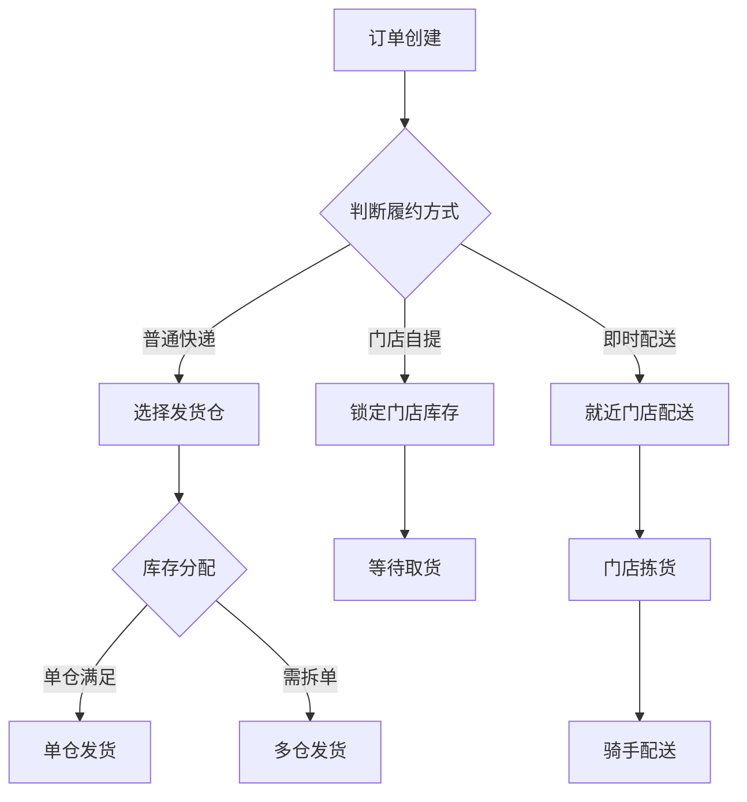
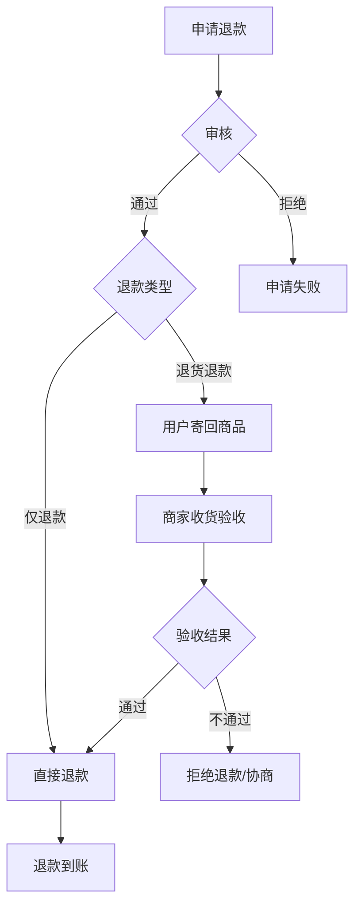
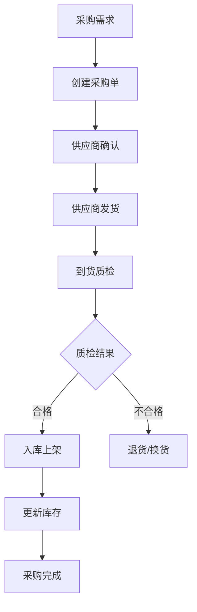
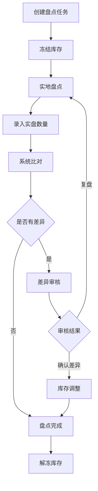

# 零售/电商业务流程参考

## 目录
- [电商购物流程](#电商购物流程)
- [门店收银流程](#门店收银流程)
- [全渠道履约流程](#全渠道履约流程)
- [退货退款流程](#退货退款流程)
- [采购入库流程](#采购入库流程)
- [盘点流程](#盘点流程)

---

## 电商购物流程

### 完整流程图


### 关键节点说明
1. **购物车**：支持多店铺、凑单优惠提示、库存校验
2. **下单结算**：地址校验、优惠计算、库存锁定
3. **支付**：支付超时自动关闭（通常15-30分钟）
4. **发货**：订单拆分（多仓、多物流）
5. **收货**：自动确认收货（通常7-15天）

---

## 门店收银流程

### POS收银流程


### 关键功能
1. **快速收银**：支持扫码枪、手工输入、称重商品
2. **会员识别**：手机号、会员卡、人脸识别
3. **多种支付**：现金、银行卡、微信、支付宝、组合支付
4. **小票管理**：电子小票、重打小票

---

## 全渠道履约流程

### 履约方式
1. **仓库发货**：电商标准模式，从中心仓或区域仓发货
2. **门店发货**：门店作为前置仓，就近发货
3. **门店自提**：线上下单，门店取货
4. **即时配送**：O2O模式，1小时达

### 订单路由逻辑


### 库存分配原则
1. 距离最近原则
2. 成本最优原则
3. 时效优先原则
4. 库存均衡原则

---

## 退货退款流程

### 退款类型
- **仅退款**：未发货订单或虚拟商品
- **退货退款**：收到货后的退货
- **换货**：质量问题换同款
- **部分退款**：订单中部分商品退款

### 退货退款流程


### 退款资金流
```
原路退回：微信支付→微信零钱，支付宝→支付宝余额
退款时效：1-7个工作日（视支付渠道）
```

---

## 采购入库流程

### 采购流程


### 入库类型
1. **采购入库**：正常采购到货
2. **退货入库**：客户退货入库
3. **调拨入库**：仓间调拨
4. **盘盈入库**：盘点发现多余

---

## 盘点流程

### 盘点方式
1. **全盘**：盘点所有商品
2. **抽盘**：按品类/区域抽样盘点
3. **动态盘点**：持续性循环盘点

### 盘点流程


### 差异处理
- **盘盈**：实盘>系统账，做盘盈入库
- **盘亏**：实盘<系统账，做盘亏出库，追查原因
