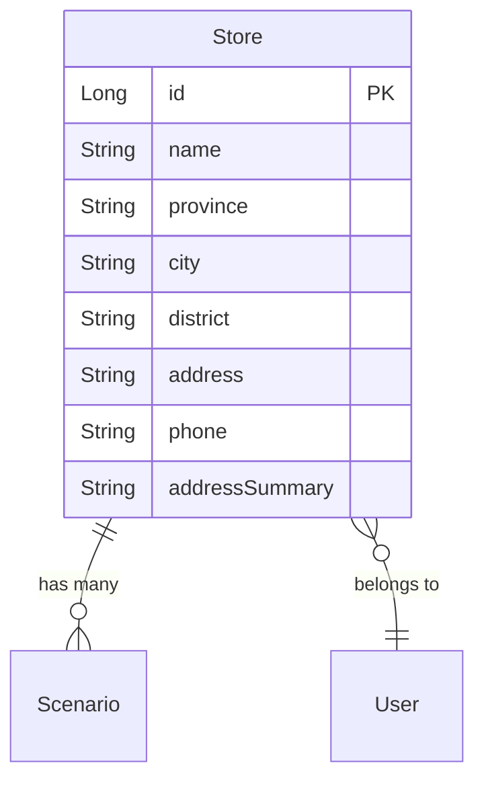

# 数据/领域模型说明

## 文档信息
- 功能标识：020-store-address
- 生成时间：2025-12-22T12:00:00Z
- 基于规格：specs/020-store-address/spec.md

## 领域概述

本功能扩展门店实体（Store），添加地址信息相关字段，包括省市区三级行政区划、详细地址、联系电话以及派生的地址摘要字段，用于支持 B端 门店管理和 C端 门店展示功能。

## 核心实体

### Store（门店）

**说明**：门店实体扩展，新增地址信息字段

**字段定义**：

| 字段名 | 类型 | 必填 | 说明 | 约束 |
|-------|------|------|------|------|
| province | String | 是 | 省份 | 中国大陆省份名称 |
| city | String | 是 | 城市 | 与原 014 规格中 region/city 字段对齐 |
| district | String | 是 | 区县 | 三级行政区划 |
| address | String | 否 | 详细地址 | 街道门牌号等详细信息 |
| phone | String | 否 | 联系电话 | 11位手机号（1开头）或区号+座机号（如 010-12345678） |
| addressSummary | String | 派生 | 地址摘要 | 由 city + district 组合生成，用于列表展示 |

**业务规则**：
- province、city、district 三级行政区划为必填项，确保地址信息完整性
- phone 字段支持两种格式：11位手机号或区号+座机号，保存时需进行格式校验
- addressSummary 为派生字段，由 city + district 自动生成，无需手动输入
- 地址信息变更后，关联的场景包/活动实时获取最新地址，无需手动同步

**关系**：
- 与 User 的关系：多对一 - 一个门店属于一个用户（运营人员）
- 与 Scenario 的关系：一对多 - 一个门店可以有多个场景包

---

## 数据验证规则

### 字段级验证
- **province**: 必须为中国大陆有效省份名称
- **city**: 必须为对应省份下的有效城市名称
- **district**: 必须为对应城市下的有效区县名称
- **phone**: 如果填写，必须符合以下格式之一：
  - 11位手机号（1开头）
  - 区号+座机号（如 010-12345678）

### 实体级验证
- 保存门店地址信息时，province、city、district 三个字段必须同时填写
- addressSummary 字段由系统自动生成，不允许手动设置

### 业务级验证
- 地址信息校验准确率 100%，不符合格式的电话号码在保存时被拦截并提示用户
- C端展示时，如果 address 字段为空，仅展示 addressSummary（city + district）

## 数据存储

**主存储**：Supabase (PostgreSQL)

**表结构**：
- stores：门店基础信息表，新增 province, city, district, address, phone 字段

**索引策略**：
- 索引 (city, district)：用于按地区筛选门店
- 索引 (province)：用于按省份统计门店分布

## 附录

### 术语表

| 术语 | 定义 |
|------|------|
| addressSummary | 地址摘要，由 city + district 组合生成，如"北京市朝阳区" |
| 三级行政区划 | province（省）、city（市）、district（区/县）三级地址结构 |
| 派生字段 | 由其他字段计算生成的字段，不存储在数据库中或由触发器自动更新 |

### 状态机图

暂无状态机定义（本功能为数据扩展，无状态转换）

### ER 图

---

**生成说明**：
- 本文档由 Claude Skill 文档生成器自动生成
- 如发现信息缺失或不准确，请参考原始规格文档并手动补充
- 标记为 `TODO: 待规格明确` 的项需要在规格文档中补充后重新生成
