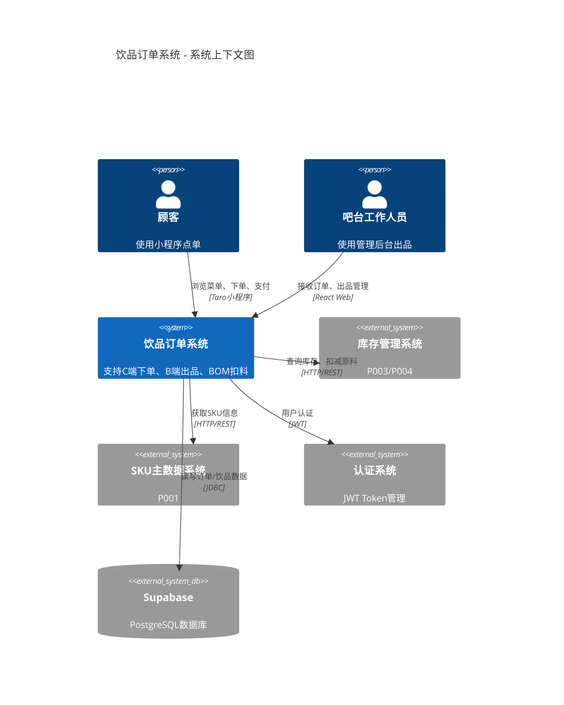
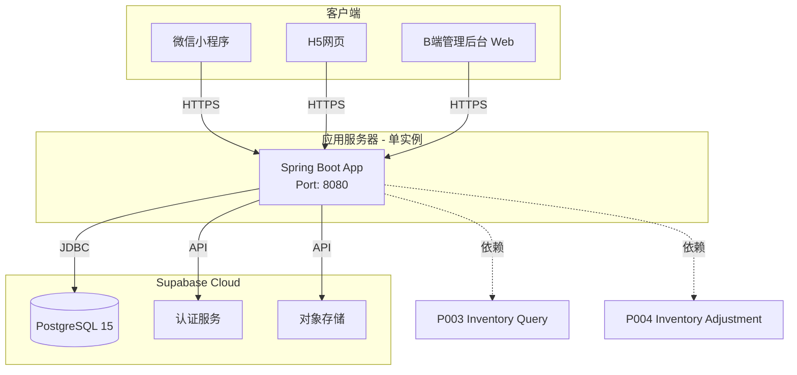
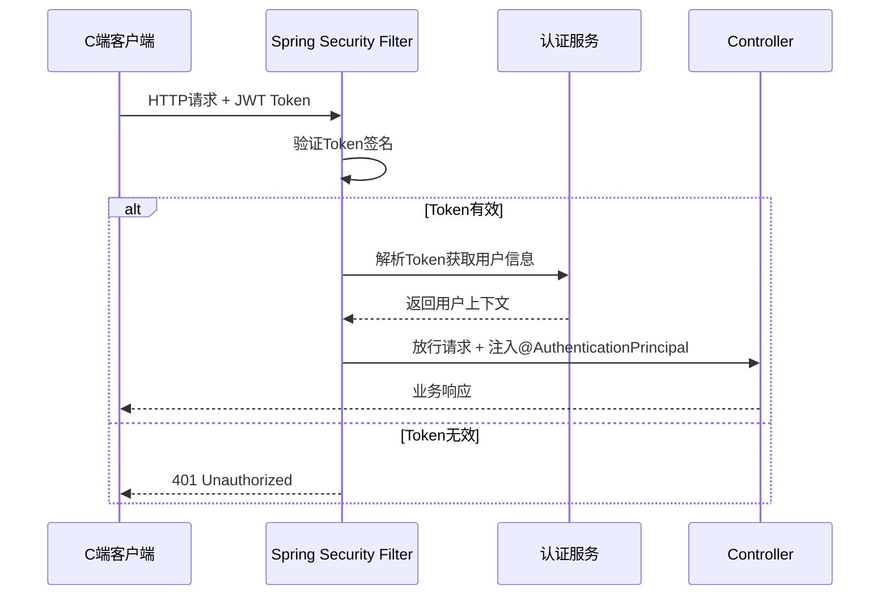
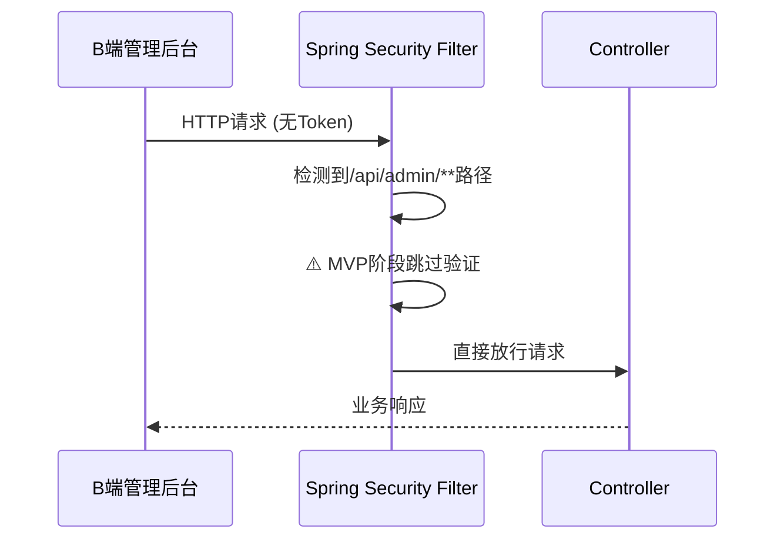

# 系统架构设计文档 - 饮品订单创建与出品管理

**Feature ID**: O003-beverage-order
**System**: 商品管理中台
**Module**: 订单管理 > 饮品订单
**Version**: 1.0.0
**Date**: 2025-12-28
**Status**: Approved

---

## 目录

1. [架构概述](#架构概述)
2. [系统分层架构](#系统分层架构)
3. [组件划分与职责](#组件划分与职责)
4. [技术组件选型](#技术组件选型)
5. [部署架构](#部署架构)
6. [安全架构](#安全架构)
7. [可扩展性设计](#可扩展性设计)

---

## 1. 架构概述

### 1.1 架构原则

1. **前后端分离**: C端(Taro多端)、B端(React)、后端(Spring Boot)完全解耦
2. **模块化设计**: 按用户故事(US1/US2/US3)组织代码,支持独立开发和测试
3. **数据驱动**: Supabase作为单一数据源,避免数据不一致
4. **渐进增强**: MVP阶段简化实现(Mock支付/轮询),Phase 2升级为完整方案

### 1.2 架构风格

- **客户端-服务器架构 (Client-Server)**
- **RESTful API**: 后端提供标准REST接口
- **事件驱动**: 订单状态变更触发BOM扣料、叫号等业务逻辑

### 1.3 整体架构图



---

## 2. 系统分层架构

### 2.1 四层架构模型

```
┌─────────────────────────────────────────────────┐
│          Presentation Layer (表现层)             │
│   ┌──────────────┐        ┌──────────────┐     │
│   │ C端 Taro App │        │ B端 React App │     │
│   │  (小程序/H5)  │        │  (管理后台)   │     │
│   └──────────────┘        └──────────────┘     │
└─────────────────────────────────────────────────┘
                      ↕ HTTP/REST
┌─────────────────────────────────────────────────┐
│         Application Layer (应用层)               │
│    Spring Boot Controllers + Services           │
│  ┌─────────────────────────────────────────┐   │
│  │ BeverageController                      │   │
│  │ BeverageOrderController (C端API)        │   │
│  │ BeverageOrderAdminController (B端API)   │   │
│  └─────────────────────────────────────────┘   │
└─────────────────────────────────────────────────┘
                      ↕
┌─────────────────────────────────────────────────┐
│         Business Logic Layer (业务逻辑层)        │
│  ┌─────────────────────────────────────────┐   │
│  │ BeverageService (饮品管理)              │   │
│  │ BeverageOrderService (订单管理)         │   │
│  │ BOMDeductionService (BOM扣料)           │   │
│  │ OrderNumberGenerator (订单号生成)       │   │
│  │ QueueNumberGenerator (取餐号生成)       │   │
│  └─────────────────────────────────────────┘   │
└─────────────────────────────────────────────────┘
                      ↕
┌─────────────────────────────────────────────────┐
│         Data Access Layer (数据访问层)           │
│  ┌─────────────────────────────────────────┐   │
│  │ Spring Data JPA Repositories            │   │
│  │ BeverageRepository                      │   │
│  │ BeverageOrderRepository                 │   │
│  │ RecipeIngredientRepository              │   │
│  └─────────────────────────────────────────┘   │
└─────────────────────────────────────────────────┘
                      ↕ JDBC
┌─────────────────────────────────────────────────┐
│           Database Layer (数据库层)              │
│            Supabase PostgreSQL 15+              │
│   beverages | beverage_orders | queue_numbers   │
└─────────────────────────────────────────────────┘
```

### 2.2 层次职责

| 层次 | 职责 | 技术 |
|-----|------|------|
| **表现层** | UI渲染、用户交互、路由管理 | Taro + React, Zustand, TanStack Query |
| **应用层** | 接收HTTP请求、参数验证、响应封装 | Spring MVC Controllers, Bean Validation |
| **业务逻辑层** | 核心业务逻辑、事务管理、状态机 | Spring Services, @Transactional |
| **数据访问层** | 数据库CRUD、查询优化、缓存 | Spring Data JPA, Repository接口 |
| **数据库层** | 数据持久化、约束、索引 | PostgreSQL, Supabase |

---

## 3. 组件划分与职责

### 3.1 C端组件架构 (Taro)

```
C端小程序
├── pages/ (页面组件 - 路由级别)
│   ├── beverage-menu/ (菜单浏览)
│   ├── beverage-detail/ (饮品详情)
│   ├── beverage-order-cart/ (订单确认)
│   ├── beverage-payment/ (Mock支付)
│   ├── beverage-order-detail/ (订单详情)
│   └── beverage-my-orders/ (我的订单)
│
├── components/ (UI组件 - 原子设计)
│   ├── atoms/ (原子组件)
│   │   ├── LoadingSpinner (加载动画)
│   │   ├── ErrorState (错误状态)
│   │   └── EmptyState (空状态)
│   ├── molecules/ (分子组件)
│   │   ├── BeverageCard (饮品卡片)
│   │   └── SpecSelector (规格选择器)
│   └── organisms/ (有机体组件)
│       └── BeverageList (饮品列表)
│
├── hooks/ (自定义Hooks - 数据层)
│   ├── useBeverages (饮品查询 - TanStack Query)
│   ├── useBeverageDetail (饮品详情)
│   ├── useCreateOrder (创建订单 - Mutation)
│   ├── useMockPayment (Mock支付 - Mutation)
│   └── useOrderHistory (订单历史)
│
├── stores/ (状态管理 - Zustand)
│   ├── beverageStore (饮品状态)
│   └── orderCartStore (订单购物车 - 持久化)
│
└── services/ (API服务)
    └── beverageService (API封装 + Token管理)
```

#### 组件职责说明

**Pages (页面组件)**:
- 路由级组件,负责数据获取和页面布局
- 使用Hooks获取数据,不包含复杂业务逻辑
- 示例: `beverage-menu/index.tsx` 调用 `useBeverages` 获取菜单

**Components (UI组件)**:
- 纯展示组件,接收Props渲染UI
- 遵循原子设计理念(Atoms → Molecules → Organisms)
- 示例: `BeverageCard` 接收beverage对象,渲染卡片

**Hooks (自定义Hooks)**:
- 封装TanStack Query查询/变更逻辑
- 处理加载/错误/缓存状态
- 示例: `useBeverages` 封装 `GET /api/client/beverages` 请求

**Stores (状态管理)**:
- 管理客户端全局状态(购物车、用户偏好)
- orderCartStore持久化到`Taro.setStorageSync`
- 示例: `orderCartStore.addItem(beverage, specs)`

### 3.2 B端组件架构 (React)

```
B端管理后台
features/beverage-order-management/
├── pages/ (页面组件)
│   ├── PendingOrdersPage (待处理订单 - 8s轮询)
│   └── SalesStatisticsPage (营业统计)
│
├── components/ (功能组件)
│   ├── OrderCard (订单卡片)
│   ├── OrderDetailModal (订单详情弹窗)
│   ├── BOMList (BOM清单)
│   ├── OrderStatusBadge (状态徽章)
│   ├── OrderActionButtons (状态操作按钮)
│   └── SalesChart (营业统计图表)
│
├── hooks/ (自定义Hooks)
│   ├── usePendingOrders (轮询订单 - refetchInterval: 8000)
│   ├── useOrderDetail (订单详情)
│   ├── useUpdateOrderStatus (状态更新 - 触发BOM扣料)
│   ├── useCallOrder (叫号)
│   └── useOrderStatistics (统计数据)
│
├── stores/ (状态管理)
│   └── orderStore (订单列表缓存)
│
└── services/ (API服务)
    └── beverageOrderApi (API封装 + 错误处理)
```

#### B端特殊设计

**轮询机制**:
```typescript
// hooks/usePendingOrders.ts
export const usePendingOrders = (storeId: string) => {
  return useQuery({
    queryKey: ['pending-orders', storeId],
    queryFn: () => fetchPendingOrders(storeId),
    refetchInterval: 8000, // 8秒轮询
    refetchOnWindowFocus: true,
  });
};
```

**状态更新触发BOM扣料**:
```typescript
// hooks/useUpdateOrderStatus.ts
export const useUpdateOrderStatus = () => {
  const queryClient = useQueryClient();

  return useMutation({
    mutationFn: async ({ orderId, status }) => {
      // PUT /api/admin/beverage-orders/{id}/status
      // 后端自动触发BOM扣料(status = PRODUCING)
      return await updateOrderStatus(orderId, status);
    },
    onSuccess: () => {
      // 刷新订单列表
      queryClient.invalidateQueries(['pending-orders']);
    },
    onError: (error) => {
      // 显示BOM扣料失败提示(库存不足)
      message.error(error.message);
    },
  });
};
```

### 3.3 后端组件架构 (Spring Boot)

```
backend/src/main/java/com/cinema/beverage/
├── controller/ (控制器层 - RESTful Endpoints)
│   ├── BeverageController (C端饮品API)
│   ├── BeverageOrderController (C端订单API)
│   ├── BeverageOrderAdminController (B端订单API)
│   └── QueueNumberController (取餐号API)
│
├── service/ (业务逻辑层)
│   ├── BeverageService (饮品管理)
│   ├── BeverageOrderService (订单创建、状态管理)
│   ├── BOMDeductionService (BOM扣料 - 核心)
│   ├── OrderNumberGenerator (订单号生成)
│   ├── QueueNumberGenerator (取餐号生成 - Advisory Lock)
│   ├── InventoryIntegrationService (P003/P004集成)
│   ├── CallingService (Mock叫号)
│   └── OrderStatisticsService (统计分析)
│
├── repository/ (数据访问层 - JPA)
│   ├── BeverageRepository
│   ├── BeverageOrderRepository
│   ├── BeverageRecipeRepository
│   ├── RecipeIngredientRepository
│   └── QueueNumberRepository
│
├── entity/ (实体模型 - JPA Entities)
│   ├── Beverage (饮品)
│   ├── BeverageSpec (饮品规格)
│   ├── BeverageRecipe (配方)
│   ├── RecipeIngredient (配方原料)
│   ├── BeverageOrder (订单)
│   ├── BeverageOrderItem (订单项)
│   └── QueueNumber (取餐号)
│
├── dto/ (数据传输对象)
│   ├── BeverageDTO
│   ├── CreateBeverageOrderRequest
│   ├── BeverageOrderDTO
│   └── OrderStatisticsDTO
│
└── exception/ (异常处理)
    ├── BeverageErrorCode (错误码枚举)
    ├── BeverageException (业务异常基类)
    ├── InsufficientInventoryException (库存不足)
    └── GlobalExceptionHandler (全局异常处理)
```

#### 核心Service职责

**BeverageOrderService**:
- 订单创建(`createOrder`)
- Mock支付(`mockPay` - 500ms延迟)
- 状态更新(`updateStatus` - 状态机验证)
- 订单查询(`findOrderHistory`)

**BOMDeductionService** (核心):
- 计算原料清单(`calculateMaterialRequirements`)
- 验证库存充足性(`validateInventory` - 调用P003)
- 执行扣减(`executeDeduction` - 调用P004)
- 使用悲观锁(`SELECT FOR UPDATE`)防止并发冲突

**QueueNumberGenerator**:
- 生成取餐号(`generate` - D001-D999格式)
- PostgreSQL Advisory Lock保证并发安全
- 每日00:00重置序号

---

## 4. 技术组件选型

### 4.1 前端技术栈对比

| 组件类型 | C端选型 | B端选型 | 选型理由 |
|---------|---------|---------|---------|
| **框架** | Taro 3.x + React | React 19.2.0 | C端需多端兼容,B端标准Web |
| **UI组件** | Taro UI / NutUI | Ant Design 6.1.0 | Taro UI跨平台,Ant Design企业级 |
| **状态管理** | Zustand 5.0.9 | Zustand 5.0.9 | 轻量简洁,易学习 |
| **服务器状态** | TanStack Query 5.90.12 | TanStack Query 5.90.12 | 缓存/轮询/错误处理一体化 |
| **路由** | Taro Router | React Router 7.10.1 | 官方推荐 |
| **表单** | 原生Taro Form | React Hook Form 7.68.0 + Zod 4.1.13 | B端复杂表单需要验证 |

### 4.2 后端技术栈

| 组件 | 选型 | 版本 | 理由 |
|-----|------|------|------|
| **运行时** | Java | 21 | LTS版本,性能优化 |
| **框架** | Spring Boot | 3.x | 企业级框架,生态成熟 |
| **ORM** | Spring Data JPA | 3.x | 标准JPA实现,减少SQL |
| **数据库** | PostgreSQL | 15+ | 开源关系数据库,支持Advisory Lock |
| **数据库托管** | Supabase | Latest | PostgreSQL托管服务,集成认证/存储 |
| **JSON处理** | Jackson | 2.15+ | Spring Boot默认 |
| **验证** | Bean Validation | 3.0 | 标准JSR-380 |
| **代码简化** | Lombok | 1.18+ | 减少样板代码 |

### 4.3 数据库技术选型

#### 为什么选择PostgreSQL?

1. **关系型数据**: 订单/饮品/配方存在复杂关联,需要ACID事务保证
2. **Advisory Lock**: 支持取餐号并发生成场景
3. **JSON字段**: `selected_specs`存储规格快照,灵活性高
4. **索引优化**: 支持部分索引(`WHERE status = 'ACTIVE'`)
5. **Supabase托管**: 自动备份、扩展性、低运维成本

#### 为什么选择Supabase?

1. **PostgreSQL兼容**: 100%兼容标准PostgreSQL
2. **集成认证**: 内置JWT认证,减少开发量
3. **对象存储**: Supabase Storage存储饮品图片
4. **实时订阅**: 可选升级为Realtime订阅(Phase 2)
5. **自动备份**: 企业级可靠性

---

## 5. 部署架构

### 5.1 MVP部署架构(单体应用)



### 5.2 生产环境部署架构(Phase 2)

```mermaid
graph TB
    subgraph "CDN"
        CDN[Cloudflare CDN<br/>静态资源]
    end

    subgraph "负载均衡"
        LB[Nginx Load Balancer]
    end

    subgraph "应用服务器集群"
        S1[Spring Boot Instance 1]
        S2[Spring Boot Instance 2]
        S3[Spring Boot Instance 3]
    end

    subgraph "Supabase Cloud"
        DB[(PostgreSQL<br/>主从复制)]
        AUTH[认证服务]
        STORAGE[对象存储]
    end

    subgraph "监控告警"
        MONITOR[Sentry/Prometheus]
    end

    CLIENT[客户端] -->|HTTPS| CDN
    CDN --> LB
    LB --> S1
    LB --> S2
    LB --> S3

    S1 --> DB
    S2 --> DB
    S3 --> DB

    S1 --> MONITOR
    S2 --> MONITOR
    S3 --> MONITOR
```

### 5.3 部署清单

| 环境 | 组件 | 规格 | 数量 | 说明 |
|-----|------|------|------|------|
| **MVP** | Spring Boot | 2C4G | 1 | 单实例部署 |
| | Supabase PostgreSQL | Shared | 1 | 免费套餐 |
| **生产** | Spring Boot | 4C8G | 3 | 负载均衡 |
| | Nginx LB | 2C4G | 2 | 主备模式 |
| | Supabase PostgreSQL | Pro | 1 | 主从复制 |
| | Redis (Phase 2) | 2C4G | 1 | 菜单缓存 |

---

## 6. 安全架构

### 6.1 认证与授权

⚠️ **MVP阶段认证策略**:
- **C端 (Customer)**: 完整JWT认证
- **B端 (Admin/Staff)**: Mock认证,无需登录,直接访问

#### C端认证流程



#### B端认证流程 (MVP阶段)



⚠️ **B端认证说明**:
- **MVP阶段**: 工作人员无需登录,前端直接访问管理后台,后端暂不校验Authorization header
- **实现方式**: Spring Security配置中允许`/api/admin/**`路径匿名访问
- **安全前提**: 假设B端在内网环境或受信任网络访问
- **Phase 2升级**: 实现完整的工作人员账号体系(用户名/密码登录,STAFF/ADMIN角色权限)

#### JWT Token结构 (C端)

```json
// Header
{
  "alg": "HS256",
  "typ": "JWT"
}

// Payload
{
  "sub": "user-uuid",
  "role": "CUSTOMER",
  "storeId": "store-uuid",
  "exp": 1735401600, // 过期时间
  "iat": 1735398000  // 签发时间
}

// Signature
HMACSHA256(
  base64UrlEncode(header) + "." + base64UrlEncode(payload),
  secret
)
```

#### 权限控制

| API路径 | MVP阶段角色要求 | Phase 2角色要求 | 说明 |
|--------|---------------|----------------|------|
| `/api/client/**` | `ROLE_CUSTOMER` (JWT) | `ROLE_CUSTOMER` (JWT) | C端用户API |
| `/api/admin/**` | ⚠️ 匿名访问 (Mock) | `ROLE_ADMIN`, `ROLE_STAFF` (JWT) | B端管理API |
| `/api/public/**` | 匿名访问 | 匿名访问 | 公开API(如饮品列表) |

### 6.2 数据安全

#### 输入验证

```java
// CreateBeverageOrderRequest.java
public class CreateBeverageOrderRequest {
    @NotNull(message = "用户ID不能为空")
    private UUID userId;

    @NotNull(message = "门店ID不能为空")
    private UUID storeId;

    @NotEmpty(message = "订单项不能为空")
    @Valid
    private List<OrderItemRequest> items;

    @Min(value = 0, message = "订单总价不能为负")
    private BigDecimal totalPrice;

    @Size(max = 500, message = "备注最多500字")
    private String customerNote;
}
```

#### SQL注入防护

- 使用JPA Criteria API或JPQL预编译查询
- 禁止拼接SQL字符串
- 示例:
```java
// ✅ 正确 - 参数化查询
@Query("SELECT o FROM BeverageOrder o WHERE o.orderNumber = :orderNumber")
Optional<BeverageOrder> findByOrderNumber(@Param("orderNumber") String orderNumber);

// ❌ 错误 - 拼接SQL
// String sql = "SELECT * FROM beverage_orders WHERE order_number = '" + orderNumber + "'";
```

#### XSS防护

- 前端: 避免使用`dangerouslySetInnerHTML`
- 后端: Ant Design/Taro UI自动转义用户输入
- 响应Header: `X-Content-Type-Options: nosniff`

### 6.3 API安全

#### HTTPS强制

- 生产环境强制HTTPS
- Nginx配置HTTP重定向到HTTPS:
```nginx
server {
    listen 80;
    return 301 https://$host$request_uri;
}
```

#### CORS配置

```java
// SecurityConfig.java
@Bean
public CorsConfigurationSource corsConfigurationSource() {
    CorsConfiguration config = new CorsConfiguration();
    config.setAllowedOrigins(Arrays.asList(
        "https://app.cinema.com",  // 生产域名
        "http://localhost:3000"    // 本地开发
    ));
    config.setAllowedMethods(Arrays.asList("GET", "POST", "PUT", "DELETE"));
    config.setAllowedHeaders(Arrays.asList("Authorization", "Content-Type"));
    config.setAllowCredentials(true);

    UrlBasedCorsConfigurationSource source = new UrlBasedCorsConfigurationSource();
    source.registerCorsConfiguration("/**", config);
    return source;
}
```

---

## 7. 可扩展性设计

### 7.1 水平扩展能力

#### 无状态应用设计

- Spring Boot应用无状态,支持多实例部署
- 会话状态存储在JWT Token中
- 购物车状态存储在客户端(orderCartStore持久化)

#### 数据库扩展

- Supabase支持Read Replica(读写分离)
- Phase 2: 引入Redis缓存热点数据(饮品菜单)
- Phase 2: 订单表分表(按月归档历史订单)

### 7.2 功能扩展点

#### 支付扩展

当前: Mock支付(500ms延迟,100%成功)

扩展路径:
1. 定义`PaymentService`接口
2. 实现`MockPaymentService`(MVP)
3. 实现`WeChatPaymentService`(Phase 2)
4. 通过配置切换实现: `payment.provider=wechat`

```java
// PaymentService.java (接口)
public interface PaymentService {
    PaymentResult pay(BeverageOrder order);
    PaymentResult queryPaymentStatus(String transactionId);
}

// MockPaymentService.java (MVP实现)
@Service
@ConditionalOnProperty(name = "payment.provider", havingValue = "mock")
public class MockPaymentService implements PaymentService {
    public PaymentResult pay(BeverageOrder order) {
        Thread.sleep(500); // Mock延迟
        return PaymentResult.success("MOCK_" + System.currentTimeMillis());
    }
}

// WeChatPaymentService.java (Phase 2实现)
@Service
@ConditionalOnProperty(name = "payment.provider", havingValue = "wechat")
public class WeChatPaymentService implements PaymentService {
    public PaymentResult pay(BeverageOrder order) {
        // 调用微信支付JSAPI
        return wechatPayClient.createOrder(...);
    }
}
```

#### 通知扩展

当前: 8秒轮询 + Mock叫号

扩展路径:
1. Phase 2: 实现`WebSocketNotificationService`
2. Phase 2: 集成TTS语音叫号服务(阿里云/腾讯云)
3. Phase 2: 小程序订阅消息推送

#### 统计扩展

当前: 基础统计(订单数量/销售额/热销饮品)

扩展路径:
1. Phase 2: 引入数据仓库(ClickHouse)
2. Phase 2: 实时大屏(订单趋势/高峰预警)
3. Phase 2: BI报表(Power BI / Metabase)

---

## 8. 附录

### 8.1 架构决策记录(ADR)

#### ADR-001: 选择Supabase作为数据库托管服务

**Status**: Accepted

**Context**: 需要PostgreSQL数据库,考虑自建vs托管

**Decision**: 使用Supabase托管PostgreSQL

**Consequences**:
- ✅ 优势: 自动备份,扩展性,集成认证/存储
- ✅ 优势: 降低运维成本
- ❌ 劣势: 厂商锁定,迁移成本

---

#### ADR-002: MVP阶段使用轮询而非WebSocket

**Status**: Accepted (Phase 1), Deprecated (Phase 2)

**Context**: B端订单通知和C端状态更新需要实时性

**Decision**: Phase 1使用8秒轮询,Phase 2升级为WebSocket

**Consequences**:
- ✅ 优势: 实现简单,无需维护连接
- ✅ 优势: TanStack Query内置轮询支持
- ❌ 劣势: 高峰期请求量大,延迟最大8秒
- ❌ 劣势: 需要Phase 2重构

---

#### ADR-003: 使用PostgreSQL Advisory Lock生成取餐号

**Status**: Accepted

**Context**: 取餐号需要并发安全,考虑Redis INCR vs Advisory Lock

**Decision**: 使用PostgreSQL Advisory Lock

**Consequences**:
- ✅ 优势: 无需引入Redis,降低架构复杂度
- ✅ 优势: 事务级锁,自动释放
- ❌ 劣势: 仅适用于单数据库实例(Supabase满足)

---

### 8.2 参考架构

- [Clean Architecture](https://blog.cleancoder.com/uncle-bob/2012/08/13/the-clean-architecture.html)
- [Spring Boot Best Practices](https://docs.spring.io/spring-boot/docs/current/reference/html/)
- [Taro Multi-Platform Architecture](https://docs.taro.zone/docs/platform-plugin)

---

**文档结束**
