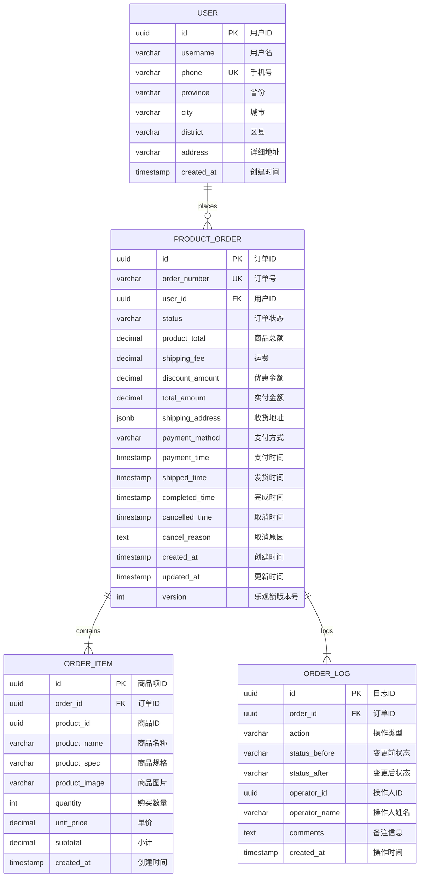

# 商品订单列表查看与管理 - 数据库设计文档

<!-- DOC-WRITER: AUTO-GENERATED START -->
**文档版本**: 1.0.0
**功能标识**: O001-product-order-list
**创建日期**: 2025-12-27
**数据库**: Supabase (PostgreSQL 15+)
**状态**: 已实现

---

## 文档变更历史

| 版本 | 日期 | 变更说明 |
|------|------|----------|
| 1.0.0 | 2025-12-27 | 初始版本 - 3 张核心表设计 |

---

## 1. 数据库概述

### 1.1 数据库选型

**数据库**: Supabase (PostgreSQL 15+)

**选型理由**:
- 项目标准数据库,与其他模块共用
- 开源免费,功能完善,性能优秀
- 支持 JSONB 类型,适合存储收货地址等结构化数据
- 提供 Row Level Security (RLS) 支持,安全性高
- 内置认证和存储功能,减少开发成本

### 1.2 表结构概览

本功能涉及 4 张表:

| 表名 | 说明 | 记录数量 | 关系 |
|------|------|---------|------|
| users | 用户表(复用现有表) | ~10000 | 1对多(订单) |
| product_orders | 商品订单表 | ~50000 | 1对多(订单项、日志) |
| order_items | 订单商品项表 | ~100000 | 多对1(订单) |
| order_logs | 订单日志表 | ~200000 | 多对1(订单) |

---

## 2. 实体关系图 (ER Diagram)

### 2.1 Mermaid ER 图



### 2.2 表关系说明

- **users ↔ product_orders**: 一对多(一个用户可以有多个订单)
- **product_orders ↔ order_items**: 一对多(一个订单包含多个商品项)
- **product_orders ↔ order_logs**: 一对多(一个订单有多条日志记录)

---

## 3. 表结构详细设计

### 3.1 users (用户表) - 复用现有表

**表说明**: 用户基本信息表,由用户管理模块(U模块)维护,本功能仅读取用户数据。

**表名**: `users`

| 字段名 | 数据类型 | 约束 | 默认值 | 说明 |
|--------|---------|------|--------|------|
| id | UUID | PK, NOT NULL | uuid_generate_v4() | 用户ID,主键 |
| username | VARCHAR(100) | NOT NULL | - | 用户名 |
| phone | VARCHAR(20) | NOT NULL, UNIQUE | - | 手机号,唯一索引 |
| province | VARCHAR(50) | NULL | - | 省份 |
| city | VARCHAR(50) | NULL | - | 城市 |
| district | VARCHAR(50) | NULL | - | 区县 |
| address | VARCHAR(500) | NULL | - | 详细地址 |
| created_at | TIMESTAMP | NOT NULL | NOW() | 创建时间 |

**索引**:

```sql
-- 主键索引(自动创建)
CREATE UNIQUE INDEX users_pkey ON users(id);

-- 手机号唯一索引
CREATE UNIQUE INDEX users_phone_key ON users(phone);
```

**注意**:
- 用户表由 U 模块管理,本功能不修改用户数据
- 订单查询时通过 user_id 外键关联用户信息

---

### 3.2 product_orders (商品订单表)

**表说明**: 存储商品订单的核心信息,包括订单号、用户、状态、金额、时间戳等。

**表名**: `product_orders`

| 字段名 | 数据类型 | 约束 | 默认值 | 说明 |
|--------|---------|------|--------|------|
| id | UUID | PK, NOT NULL | uuid_generate_v4() | 订单ID,主键 |
| order_number | VARCHAR(20) | NOT NULL, UNIQUE | - | 订单号,格式: ORD + YYYYMMDD + 6位随机 |
| user_id | UUID | NOT NULL, FK → users.id | - | 用户ID,外键关联用户表 |
| status | VARCHAR(20) | NOT NULL | 'PENDING_PAYMENT' | 订单状态(枚举值) |
| product_total | DECIMAL(10,2) | NOT NULL | - | 商品总金额(元) |
| shipping_fee | DECIMAL(10,2) | NOT NULL | 0 | 运费(元) |
| discount_amount | DECIMAL(10,2) | NOT NULL | 0 | 优惠金额(元) |
| total_amount | DECIMAL(10,2) | NOT NULL | - | 实付金额(元) |
| shipping_address | JSONB | NULL | - | 收货地址(JSON格式) |
| payment_method | VARCHAR(20) | NULL | - | 支付方式 |
| payment_time | TIMESTAMP | NULL | - | 支付时间 |
| shipped_time | TIMESTAMP | NULL | - | 发货时间 |
| completed_time | TIMESTAMP | NULL | - | 完成时间 |
| cancelled_time | TIMESTAMP | NULL | - | 取消时间 |
| cancel_reason | TEXT | NULL | - | 取消原因 |
| created_at | TIMESTAMP | NOT NULL | NOW() | 创建时间 |
| updated_at | TIMESTAMP | NOT NULL | NOW() | 更新时间 |
| version | INTEGER | NOT NULL | 1 | 乐观锁版本号 |

**约束**:

```sql
-- 总金额校验: total_amount = product_total + shipping_fee - discount_amount
CHECK (total_amount = product_total + shipping_fee - discount_amount)

-- 外键约束
FOREIGN KEY (user_id) REFERENCES users(id)
```

**索引**:

```sql
-- 主键索引(自动创建)
CREATE UNIQUE INDEX product_orders_pkey ON product_orders(id);

-- 订单号唯一索引(加速订单号查询)
CREATE UNIQUE INDEX idx_order_number ON product_orders(order_number);

-- 用户索引(加速按用户查询)
CREATE INDEX idx_orders_user_id ON product_orders(user_id);

-- 状态索引(加速状态筛选)
CREATE INDEX idx_orders_status ON product_orders(status);

-- 创建时间倒序索引(加速时间排序)
CREATE INDEX idx_orders_created_at ON product_orders(created_at DESC);

-- 复合索引(状态 + 创建时间) - 加速状态筛选 + 时间排序组合查询
CREATE INDEX idx_orders_status_created_at ON product_orders(status, created_at DESC);
```

**触发器**:

```sql
-- 自动更新 updated_at 触发器
CREATE OR REPLACE FUNCTION update_updated_at_column()
RETURNS TRIGGER AS $$
BEGIN
    NEW.updated_at = NOW();
    RETURN NEW;
END;
$$ LANGUAGE plpgsql;

CREATE TRIGGER update_product_orders_updated_at
    BEFORE UPDATE ON product_orders
    FOR EACH ROW
    EXECUTE FUNCTION update_updated_at_column();
```

**订单状态枚举值**:

| 状态值 | 说明 | 终态 |
|--------|------|------|
| PENDING_PAYMENT | 待支付 | 否 |
| PAID | 已支付 | 否 |
| SHIPPED | 已发货 | 否 |
| COMPLETED | 已完成 | 是 |
| CANCELLED | 已取消 | 是 |

**收货地址 JSON 结构**:

```json
{
  "province": "广东省",
  "city": "广州市",
  "district": "天河区",
  "detail": "xxx路123号"
}
```

---

### 3.3 order_items (订单商品项表)

**表说明**: 存储订单中的商品明细,一个订单可以包含多个商品项。

**表名**: `order_items`

| 字段名 | 数据类型 | 约束 | 默认值 | 说明 |
|--------|---------|------|--------|------|
| id | UUID | PK, NOT NULL | uuid_generate_v4() | 商品项ID,主键 |
| order_id | UUID | NOT NULL, FK → product_orders.id | - | 订单ID,外键关联订单表 |
| product_id | UUID | NOT NULL | - | 商品ID(关联商品管理模块P模块) |
| product_name | VARCHAR(200) | NOT NULL | - | 商品名称(冗余存储,防止商品删除后无法查看) |
| product_spec | VARCHAR(100) | NULL | - | 商品规格(如"500ml"、"大杯") |
| product_image | VARCHAR(500) | NULL | - | 商品图片URL |
| quantity | INTEGER | NOT NULL | - | 购买数量 |
| unit_price | DECIMAL(10,2) | NOT NULL | - | 单价(元) |
| subtotal | DECIMAL(10,2) | NOT NULL | - | 小计金额(元) |
| created_at | TIMESTAMP | NOT NULL | NOW() | 创建时间 |

**约束**:

```sql
-- 数量校验: quantity > 0
CHECK (quantity > 0)

-- 小计校验: subtotal = quantity * unit_price
CHECK (subtotal = quantity * unit_price)

-- 外键约束(级联删除)
FOREIGN KEY (order_id) REFERENCES product_orders(id) ON DELETE CASCADE
```

**索引**:

```sql
-- 主键索引(自动创建)
CREATE UNIQUE INDEX order_items_pkey ON order_items(id);

-- 订单索引(加速 JOIN 查询订单商品项)
CREATE INDEX idx_items_order_id ON order_items(order_id);

-- 商品索引(加速按商品查询)
CREATE INDEX idx_items_product_id ON order_items(product_id);
```

**数据冗余说明**:
- `product_name`, `product_spec`, `product_image` 字段冗余存储商品信息
- 原因: 防止商品被删除或修改后,历史订单无法查看完整信息
- 创建订单时从商品管理模块(P模块)读取商品信息并快照到订单项

---

### 3.4 order_logs (订单日志表)

**表说明**: 记录订单的所有状态变更历史,用于审计和追溯。

**表名**: `order_logs`

| 字段名 | 数据类型 | 约束 | 默认值 | 说明 |
|--------|---------|------|--------|------|
| id | UUID | PK, NOT NULL | uuid_generate_v4() | 日志ID,主键 |
| order_id | UUID | NOT NULL, FK → product_orders.id | - | 订单ID,外键关联订单表 |
| action | VARCHAR(50) | NOT NULL | - | 操作类型(枚举值) |
| status_before | VARCHAR(20) | NULL | - | 变更前状态 |
| status_after | VARCHAR(20) | NULL | - | 变更后状态 |
| operator_id | UUID | NOT NULL | - | 操作人ID |
| operator_name | VARCHAR(100) | NOT NULL | - | 操作人姓名 |
| comments | TEXT | NULL | - | 备注信息(如取消原因) |
| created_at | TIMESTAMP | NOT NULL | NOW() | 操作时间 |

**约束**:

```sql
-- 外键约束(级联删除)
FOREIGN KEY (order_id) REFERENCES product_orders(id) ON DELETE CASCADE
```

**索引**:

```sql
-- 主键索引(自动创建)
CREATE UNIQUE INDEX order_logs_pkey ON order_logs(id);

-- 订单索引(加速查询订单日志)
CREATE INDEX idx_logs_order_id ON order_logs(order_id);

-- 创建时间倒序索引(加速时间排序)
CREATE INDEX idx_logs_created_at ON order_logs(created_at DESC);
```

**操作类型枚举值**:

| 操作类型 | 说明 |
|---------|------|
| CREATE_ORDER | 创建订单 |
| PAYMENT | 支付 |
| SHIP | 发货 |
| COMPLETE | 完成 |
| CANCEL | 取消 |
| SYSTEM_AUTO | 系统自动操作 |

---

## 4. 数据库迁移脚本

### 4.1 Flyway 迁移脚本

**文件名**: `V036__create_product_orders_tables.sql`

**文件位置**: `backend/src/main/resources/db/migration/`

**迁移脚本**:

```sql
-- ============================================================
-- Flyway Migration: V036__create_product_orders_tables.sql
-- Description: Create product orders tables with test data
-- Date: 2025-12-27
-- Spec: O001-product-order-list
-- ============================================================

-- 1. 创建商品订单表
CREATE TABLE IF NOT EXISTS product_orders (
    id UUID PRIMARY KEY DEFAULT uuid_generate_v4(),
    order_number VARCHAR(20) NOT NULL UNIQUE,
    user_id UUID NOT NULL REFERENCES users(id),
    status VARCHAR(20) NOT NULL DEFAULT 'PENDING_PAYMENT',
    product_total DECIMAL(10,2) NOT NULL,
    shipping_fee DECIMAL(10,2) NOT NULL DEFAULT 0,
    discount_amount DECIMAL(10,2) NOT NULL DEFAULT 0,
    total_amount DECIMAL(10,2) NOT NULL,
    shipping_address JSONB,
    payment_method VARCHAR(20),
    payment_time TIMESTAMP,
    shipped_time TIMESTAMP,
    completed_time TIMESTAMP,
    cancelled_time TIMESTAMP,
    cancel_reason TEXT,
    created_at TIMESTAMP NOT NULL DEFAULT NOW(),
    updated_at TIMESTAMP NOT NULL DEFAULT NOW(),
    version INTEGER NOT NULL DEFAULT 1,

    CHECK (total_amount = product_total + shipping_fee - discount_amount)
);

COMMENT ON TABLE product_orders IS '商品订单表';
COMMENT ON COLUMN product_orders.order_number IS '订单号,格式: ORD + YYYYMMDD + 6位随机';
COMMENT ON COLUMN product_orders.version IS '乐观锁版本号';

-- 2. 创建订单商品项表
CREATE TABLE IF NOT EXISTS order_items (
    id UUID PRIMARY KEY DEFAULT uuid_generate_v4(),
    order_id UUID NOT NULL REFERENCES product_orders(id) ON DELETE CASCADE,
    product_id UUID NOT NULL,
    product_name VARCHAR(200) NOT NULL,
    product_spec VARCHAR(100),
    product_image VARCHAR(500),
    quantity INTEGER NOT NULL CHECK (quantity > 0),
    unit_price DECIMAL(10,2) NOT NULL,
    subtotal DECIMAL(10,2) NOT NULL,
    created_at TIMESTAMP NOT NULL DEFAULT NOW(),

    CHECK (subtotal = quantity * unit_price)
);

COMMENT ON TABLE order_items IS '订单商品项表';
COMMENT ON COLUMN order_items.product_name IS '商品名称(冗余存储,防止商品删除后无法查看)';

-- 3. 创建订单日志表
CREATE TABLE IF NOT EXISTS order_logs (
    id UUID PRIMARY KEY DEFAULT uuid_generate_v4(),
    order_id UUID NOT NULL REFERENCES product_orders(id) ON DELETE CASCADE,
    action VARCHAR(50) NOT NULL,
    status_before VARCHAR(20),
    status_after VARCHAR(20),
    operator_id UUID NOT NULL,
    operator_name VARCHAR(100) NOT NULL,
    comments TEXT,
    created_at TIMESTAMP NOT NULL DEFAULT NOW()
);

COMMENT ON TABLE order_logs IS '订单日志表';
COMMENT ON COLUMN order_logs.action IS '操作类型(CREATE_ORDER, PAYMENT, SHIP, COMPLETE, CANCEL)';

-- 4. 创建索引
CREATE UNIQUE INDEX idx_order_number ON product_orders(order_number);
CREATE INDEX idx_orders_user_id ON product_orders(user_id);
CREATE INDEX idx_orders_status ON product_orders(status);
CREATE INDEX idx_orders_created_at ON product_orders(created_at DESC);
CREATE INDEX idx_orders_status_created_at ON product_orders(status, created_at DESC);

CREATE INDEX idx_items_order_id ON order_items(order_id);
CREATE INDEX idx_items_product_id ON order_items(product_id);

CREATE INDEX idx_logs_order_id ON order_logs(order_id);
CREATE INDEX idx_logs_created_at ON order_logs(created_at DESC);

-- 5. 创建更新时间触发器
CREATE OR REPLACE FUNCTION update_updated_at_column()
RETURNS TRIGGER AS $$
BEGIN
    NEW.updated_at = NOW();
    RETURN NEW;
END;
$$ LANGUAGE plpgsql;

CREATE TRIGGER update_product_orders_updated_at
    BEFORE UPDATE ON product_orders
    FOR EACH ROW
    EXECUTE FUNCTION update_updated_at_column();

-- 6. 插入测试数据(仅开发环境)

-- 6.1 插入测试用户(如果不存在)
INSERT INTO users (id, username, phone, province, city, district, address, created_at)
VALUES
    ('750e8400-e29b-41d4-a716-446655440001', '张三', '13800138000', '广东省', '广州市', '天河区', 'xxx路123号', NOW()),
    ('750e8400-e29b-41d4-a716-446655440002', '李四', '13900139000', '广东省', '深圳市', '南山区', 'yyy街456号', NOW()),
    ('750e8400-e29b-41d4-a716-446655440003', '王五', '15012345678', '上海市', '浦东新区', '陆家嘴', 'zzz大道789号', NOW())
ON CONFLICT (id) DO NOTHING;

-- 6.2 插入测试订单
INSERT INTO product_orders (id, order_number, user_id, status, product_total, shipping_fee, discount_amount, total_amount, shipping_address, payment_method, payment_time, created_at, version)
VALUES
    ('550e8400-e29b-41d4-a716-446655440001', 'ORD20251227AB12CD', '750e8400-e29b-41d4-a716-446655440001', 'PAID', 150.00, 10.00, 5.00, 155.00,
     '{"province":"广东省","city":"广州市","district":"天河区","detail":"xxx路123号"}'::jsonb,
     'WECHAT_PAY', NOW() - INTERVAL '5 minutes', NOW() - INTERVAL '10 minutes', 2),

    ('550e8400-e29b-41d4-a716-446655440002', 'ORD20251227EF34GH', '750e8400-e29b-41d4-a716-446655440002', 'SHIPPED', 200.00, 0.00, 20.00, 180.00,
     '{"province":"广东省","city":"深圳市","district":"南山区","detail":"yyy街456号"}'::jsonb,
     'ALIPAY', NOW() - INTERVAL '1 hour', NOW() - INTERVAL '2 hours', 3),

    ('550e8400-e29b-41d4-a716-446655440003', 'ORD20251226IJ56KL', '750e8400-e29b-41d4-a716-446655440003', 'COMPLETED', 80.00, 10.00, 0.00, 90.00,
     '{"province":"上海市","city":"上海市","district":"浦东新区","detail":"zzz大道789号"}'::jsonb,
     'WECHAT_PAY', NOW() - INTERVAL '1 day', NOW() - INTERVAL '2 days', 4);

-- 6.3 插入订单商品项
INSERT INTO order_items (id, order_id, product_id, product_name, product_spec, product_image, quantity, unit_price, subtotal, created_at)
VALUES
    ('650e8400-e29b-41d4-a716-446655440001', '550e8400-e29b-41d4-a716-446655440001', '850e8400-e29b-41d4-a716-446655440001', '爆米花', '中杯', 'https://example.com/images/popcorn.jpg', 2, 30.00, 60.00, NOW() - INTERVAL '10 minutes'),
    ('650e8400-e29b-41d4-a716-446655440002', '550e8400-e29b-41d4-a716-446655440001', '850e8400-e29b-41d4-a716-446655440002', '可乐', '500ml', 'https://example.com/images/cola.jpg', 1, 15.00, 15.00, NOW() - INTERVAL '10 minutes'),
    ('650e8400-e29b-41d4-a716-446655440003', '550e8400-e29b-41d4-a716-446655440002', '850e8400-e29b-41d4-a716-446655440003', '鸡米花', '大份', 'https://example.com/images/popcorn-chicken.jpg', 2, 40.00, 80.00, NOW() - INTERVAL '2 hours');

-- 6.4 插入订单日志
INSERT INTO order_logs (id, order_id, action, status_before, status_after, operator_id, operator_name, comments, created_at)
VALUES
    ('950e8400-e29b-41d4-a716-446655440001', '550e8400-e29b-41d4-a716-446655440001', 'PAYMENT', 'PENDING_PAYMENT', 'PAID', '950e8400-e29b-41d4-a716-446655440001', '系统', '用户支付成功', NOW() - INTERVAL '5 minutes'),
    ('950e8400-e29b-41d4-a716-446655440002', '550e8400-e29b-41d4-a716-446655440002', 'SHIP', 'PAID', 'SHIPPED', '950e8400-e29b-41d4-a716-446655440001', '运营管理员', '标记发货', NOW() - INTERVAL '30 minutes');
```

### 4.2 迁移执行命令

```bash
# Flyway 自动迁移
mvn flyway:migrate

# 或者 Spring Boot 启动时自动执行
./mvnw spring-boot:run
```

---

## 5. 数据完整性约束

### 5.1 外键约束

| 子表 | 子表字段 | 父表 | 父表字段 | 级联操作 |
|------|---------|------|---------|---------|
| product_orders | user_id | users | id | 无级联(用户不可删除) |
| order_items | order_id | product_orders | id | CASCADE DELETE |
| order_logs | order_id | product_orders | id | CASCADE DELETE |

**级联删除说明**:
- 删除订单时,自动删除关联的订单商品项和订单日志
- 用户不可删除(业务规则限制),因此 product_orders.user_id 无需级联

### 5.2 唯一性约束

| 表名 | 字段 | 约束类型 | 说明 |
|------|------|---------|------|
| users | phone | UNIQUE | 手机号全局唯一 |
| product_orders | order_number | UNIQUE | 订单号全局唯一 |

### 5.3 业务约束(CHECK)

| 表名 | 约束表达式 | 说明 |
|------|-----------|------|
| product_orders | total_amount = product_total + shipping_fee - discount_amount | 总金额计算正确性 |
| order_items | quantity > 0 | 购买数量必须大于0 |
| order_items | subtotal = quantity * unit_price | 小计金额计算正确性 |

---

## 6. 性能优化

### 6.1 索引设计原则

- **唯一索引**: order_number(加速订单号查询 + 保证唯一性)
- **外键索引**: user_id, order_id(加速 JOIN 查询)
- **筛选索引**: status(加速状态筛选)
- **排序索引**: created_at DESC(加速时间倒序排序)
- **复合索引**: (status, created_at DESC)(加速组合查询)

### 6.2 索引使用场景

| 查询场景 | 使用索引 | 查询示例 |
|---------|---------|---------|
| 按订单号查询 | idx_order_number | WHERE order_number = ? |
| 按用户查询订单 | idx_orders_user_id | WHERE user_id = ? |
| 按状态筛选 | idx_orders_status | WHERE status = 'PAID' |
| 按时间排序 | idx_orders_created_at | ORDER BY created_at DESC |
| 状态筛选+时间排序 | idx_orders_status_created_at | WHERE status = 'PAID' ORDER BY created_at DESC |
| 查询订单商品项 | idx_items_order_id | WHERE order_id = ? |
| 查询订单日志 | idx_logs_order_id | WHERE order_id = ? |

### 6.3 查询性能目标

| 查询类型 | 数据量 | 响应时间目标 | 优化手段 |
|---------|--------|-------------|---------|
| 订单列表(分页) | 20 条/页 | < 500ms | 复合索引 + LIMIT 20 |
| 订单详情(JOIN) | 1 条订单 + 多个商品项 + 日志 | < 300ms | 外键索引 + 主键查询 |
| 订单号查询 | 1 条订单 | < 100ms | 唯一索引 + 主键查询 |
| 按状态筛选 | 数千条 | < 1 秒 | 复合索引 + 分页 |

### 6.4 数据归档策略(未来版本)

**归档条件**:
- 订单状态为 `COMPLETED` 或 `CANCELLED`
- 订单创建时间距今超过 1 年

**归档方案**:
- 方案一: 按月分区表(Partitioning)
- 方案二: 定期迁移到历史表 `product_orders_history`
- 方案三: 使用 PostgreSQL TimescaleDB 扩展

**归档脚本示例**:

```sql
-- 创建历史表(与主表结构相同)
CREATE TABLE product_orders_history (LIKE product_orders INCLUDING ALL);

-- 迁移 1 年前的已完成订单
INSERT INTO product_orders_history
SELECT * FROM product_orders
WHERE status IN ('COMPLETED', 'CANCELLED')
  AND created_at < NOW() - INTERVAL '1 year';

-- 删除已归档订单
DELETE FROM product_orders
WHERE status IN ('COMPLETED', 'CANCELLED')
  AND created_at < NOW() - INTERVAL '1 year';
```

---

## 7. 数据安全

### 7.1 敏感数据保护

| 字段 | 敏感级别 | 保护措施 |
|------|---------|---------|
| users.phone | 高 | 前后端双重脱敏(138****8000) |
| shipping_address | 中 | 前端显示完整地址(仅认证用户可见) |
| payment_method | 低 | 无特殊保护 |

### 7.2 Row Level Security (RLS) - 未来版本

Supabase 支持行级安全策略,未来版本可启用:

```sql
-- 启用 RLS
ALTER TABLE product_orders ENABLE ROW LEVEL SECURITY;

-- 策略: 用户只能查看自己的订单
CREATE POLICY user_own_orders ON product_orders
    FOR SELECT
    USING (user_id = auth.uid());

-- 策略: 运营人员可查看所有订单
CREATE POLICY admin_all_orders ON product_orders
    FOR SELECT
    USING (auth.jwt()->>'role' = 'admin');
```

### 7.3 数据备份

**备份策略**:
- Supabase 自动每日全量备份
- 关键操作前手动快照备份
- 数据保留期: 30 天

**备份命令**:

```bash
# Supabase CLI 备份
supabase db dump > backup_$(date +%Y%m%d).sql
```

---

## 8. 测试数据

### 8.1 测试数据集

迁移脚本包含 3 条测试订单:

| 订单号 | 用户 | 状态 | 金额 | 商品数量 | 日志数量 |
|--------|------|------|------|---------|---------|
| ORD20251227AB12CD | 张三 | 已支付 | ¥155.00 | 2 | 1 |
| ORD20251227EF34GH | 李四 | 已发货 | ¥180.00 | 1 | 1 |
| ORD20251226IJ56KL | 王五 | 已完成 | ¥90.00 | 0(未插入) | 0(未插入) |

### 8.2 测试数据清理

```sql
-- 清空测试数据
DELETE FROM order_items WHERE order_id IN (
    SELECT id FROM product_orders WHERE order_number LIKE 'ORD%'
);

DELETE FROM order_logs WHERE order_id IN (
    SELECT id FROM product_orders WHERE order_number LIKE 'ORD%'
);

DELETE FROM product_orders WHERE order_number LIKE 'ORD%';

DELETE FROM users WHERE phone IN ('13800138000', '13900139000', '15012345678');
```

---

## 9. 监控与维护

### 9.1 性能监控指标

| 指标 | 监控方式 | 告警阈值 |
|------|---------|---------|
| 表记录数 | SELECT COUNT(*) | > 100万需归档 |
| 索引命中率 | pg_stat_user_indexes | < 95% |
| 慢查询 | pg_stat_statements | > 1 秒 |
| 数据库连接数 | pg_stat_activity | > 80% 连接池 |

### 9.2 定期维护任务

| 任务 | 频率 | 命令 |
|------|------|------|
| 更新统计信息 | 每周 | ANALYZE product_orders; |
| 重建索引 | 每月 | REINDEX TABLE product_orders; |
| 清理死元组 | 每周 | VACUUM product_orders; |
| 数据归档 | 每季度 | 归档 1 年前订单 |

### 9.3 常见问题排查

**问题 1: 订单列表查询慢**

```sql
-- 检查索引使用情况
EXPLAIN ANALYZE
SELECT * FROM product_orders
WHERE status = 'PAID'
ORDER BY created_at DESC
LIMIT 20;

-- 确认是否使用了 idx_orders_status_created_at 索引
```

**问题 2: 订单详情查询慢**

```sql
-- 检查 JOIN 性能
EXPLAIN ANALYZE
SELECT o.*, i.*, l.*
FROM product_orders o
LEFT JOIN order_items i ON o.id = i.order_id
LEFT JOIN order_logs l ON o.id = l.order_id
WHERE o.id = '550e8400-e29b-41d4-a716-446655440001';

-- 确认是否使用了外键索引
```

---

## 10. 相关文档

- [产品文档](/docs/product/order-management/O001-product-order-list.md)
- [技术设计文档 (TDD)](/docs/tdd/O001-product-order-list.md)
- [API 设计文档](/docs/api/O001-product-order-list.md)
- [用户操作手册](/docs/manual/order-management/O001-product-order-list.md)
- [数据模型设计](/specs/O001-product-order-list/data-model.md)
- [功能规格说明](/specs/O001-product-order-list/spec.md)

---

<!-- DOC-WRITER: AUTO-GENERATED END -->

**文档生成信息**:
- 生成工具: doc-writer skill v2.1.0
- 生成时间: 2025-12-27
- 数据来源: data-model.md, plan.md, tasks.md
