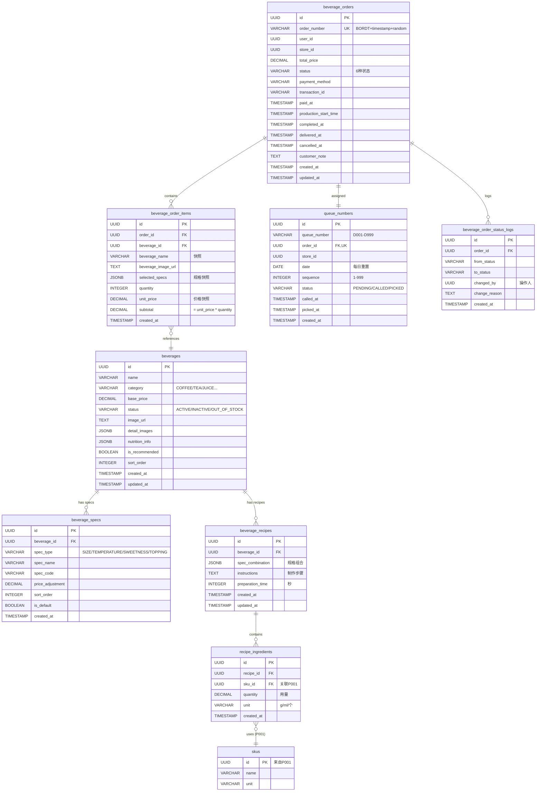

# 数据库设计文档 - 饮品订单创建与出品管理

**Feature ID**: O003-beverage-order
**System**: 商品管理中台
**Module**: 订单管理 > 饮品订单
**Version**: 1.0.0
**Date**: 2025-12-28
**Status**: Approved

---

## 目录

1. [数据库概述](#数据库概述)
2. [ER图与关系](#er图与关系)
3. [表结构定义](#表结构定义)
4. [索引策略](#索引策略)
5. [约束与完整性](#约束与完整性)
6. [数据迁移方案](#数据迁移方案)

---

## 1. 数据库概述

### 1.1 数据库技术栈

- **数据库**: PostgreSQL 15+
- **托管服务**: Supabase
- **迁移工具**: Flyway (Spring Boot集成)
- **连接方式**: JDBC (Spring Data JPA)

### 1.2 数据库实例信息

| 环境 | 实例名称 | 连接地址 | 说明 |
|-----|---------|---------|------|
| 本地开发 | local-db | `localhost:54322` | Docker容器 |
| 测试环境 | test-db | `fxhgyxceqrmnpezluaht.supabase.co` | Supabase测试实例 |
| 生产环境 | prod-db | `prod.supabase.co` | Supabase生产实例 |

### 1.3 数据库规模估算

| 表名 | 预估记录数/年 | 增长速率 | 说明 |
|-----|-------------|---------|------|
| beverages | 100-200 | 低 | 饮品菜单相对稳定 |
| beverage_orders | 365,000 | 1000单/天 | 订单主表 |
| beverage_order_items | 730,000 | 2项/订单 | 订单项 |
| queue_numbers | 365,000 | 1000单/天 | 取餐号(每日重置) |
| recipe_ingredients | 500-1000 | 低 | 配方原料关联 |

**存储估算**:
- Year 1: ~5GB
- Year 3: ~15GB

---

## 2. ER图与关系

### 2.1 完整ER图



### 2.2 关系说明

| 关系 | 类型 | 说明 |
|-----|------|------|
| beverages ↔ beverage_specs | 1:N | 一个饮品有多个规格类型 |
| beverages ↔ beverage_recipes | 1:N | 一个饮品有多个配方(不同规格组合) |
| beverage_recipes ↔ recipe_ingredients | 1:N | 一个配方包含多个原料 |
| recipe_ingredients ↔ skus | N:1 | 原料关联到P001 SKU主数据 |
| beverage_orders ↔ beverage_order_items | 1:N | 一个订单包含多个订单项 |
| beverage_order_items ↔ beverages | N:1 | 订单项引用饮品(快照) |
| beverage_orders ↔ queue_numbers | 1:1 | 一个订单对应一个取餐号 |

---

## 3. 表结构定义

详细表结构定义见 [data-model.md](../../specs/O003-beverage-order/data-model.md)。以下为核心表DDL。

### 3.1 beverages (饮品)

```sql
CREATE TABLE beverages (
  -- 主键
  id UUID PRIMARY KEY DEFAULT gen_random_uuid(),

  -- 基本信息
  name VARCHAR(100) NOT NULL,
  description TEXT,
  category VARCHAR(50) NOT NULL,

  -- 图片资源
  image_url TEXT,
  detail_images JSONB DEFAULT '[]'::jsonb,

  -- 价格
  base_price DECIMAL(10,2) NOT NULL,

  -- 营养信息
  nutrition_info JSONB,

  -- 状态管理
  status VARCHAR(20) NOT NULL DEFAULT 'ACTIVE',
  is_recommended BOOLEAN DEFAULT false,
  sort_order INTEGER DEFAULT 0,

  -- 审计字段
  created_at TIMESTAMP NOT NULL DEFAULT NOW(),
  updated_at TIMESTAMP NOT NULL DEFAULT NOW(),
  created_by UUID,
  updated_by UUID,

  -- 约束
  CONSTRAINT check_category CHECK (category IN ('COFFEE', 'TEA', 'JUICE', 'SMOOTHIE', 'MILK_TEA', 'OTHER')),
  CONSTRAINT check_status CHECK (status IN ('ACTIVE', 'INACTIVE', 'OUT_OF_STOCK')),
  CONSTRAINT check_base_price CHECK (base_price >= 0)
);

COMMENT ON TABLE beverages IS '饮品表 - 存储菜单中的饮品商品';
COMMENT ON COLUMN beverages.base_price IS '基础价格(小杯/标准规格),单位:元';
COMMENT ON COLUMN beverages.nutrition_info IS 'JSON格式营养信息: {"calories": 150, "sugar": "10g"}';
```

---

### 3.2 beverage_orders (订单)

```sql
CREATE TABLE beverage_orders (
  -- 主键
  id UUID PRIMARY KEY DEFAULT gen_random_uuid(),

  -- 订单编号(业务主键)
  order_number VARCHAR(50) NOT NULL UNIQUE,

  -- 用户与门店
  user_id UUID NOT NULL,
  store_id UUID NOT NULL,

  -- 订单金额
  total_price DECIMAL(10,2) NOT NULL,

  -- 订单状态
  status VARCHAR(20) NOT NULL DEFAULT 'PENDING_PAYMENT',

  -- 支付信息
  payment_method VARCHAR(50),
  transaction_id VARCHAR(100),
  paid_at TIMESTAMP,

  -- 时间追踪
  production_start_time TIMESTAMP,
  completed_at TIMESTAMP,
  delivered_at TIMESTAMP,
  cancelled_at TIMESTAMP,

  -- 顾客备注
  customer_note TEXT,

  -- 审计字段
  created_at TIMESTAMP NOT NULL DEFAULT NOW(),
  updated_at TIMESTAMP NOT NULL DEFAULT NOW(),

  -- 约束
  CONSTRAINT check_status CHECK (status IN (
    'PENDING_PAYMENT',
    'PENDING_PRODUCTION',
    'PRODUCING',
    'COMPLETED',
    'DELIVERED',
    'CANCELLED'
  )),
  CONSTRAINT check_total_price CHECK (total_price >= 0)
);

COMMENT ON TABLE beverage_orders IS '饮品订单表 - 订单主记录';
COMMENT ON COLUMN beverage_orders.order_number IS '订单号格式: BORDT + yyyyMMddHHmmss + 4位随机数';
COMMENT ON COLUMN beverage_orders.status IS '订单状态机: 待支付 → 待制作 → 制作中 → 已完成 → 已交付';
```

---

### 3.3 queue_numbers (取餐号)

```sql
CREATE TABLE queue_numbers (
  -- 主键
  id UUID PRIMARY KEY DEFAULT gen_random_uuid(),

  -- 取餐号
  queue_number VARCHAR(10) NOT NULL,

  -- 外键
  order_id UUID NOT NULL REFERENCES beverage_orders(id) ON DELETE CASCADE,
  store_id UUID NOT NULL,

  -- 日期与序号
  date DATE NOT NULL,
  sequence INTEGER NOT NULL,

  -- 状态
  status VARCHAR(20) NOT NULL DEFAULT 'PENDING',
  called_at TIMESTAMP,
  picked_at TIMESTAMP,

  -- 审计字段
  created_at TIMESTAMP NOT NULL DEFAULT NOW(),

  -- 约束
  CONSTRAINT check_status CHECK (status IN ('PENDING', 'CALLED', 'PICKED')),
  CONSTRAINT check_sequence CHECK (sequence >= 1 AND sequence <= 999),
  CONSTRAINT unique_store_date_sequence UNIQUE (store_id, date, sequence),
  CONSTRAINT unique_order UNIQUE (order_id)
);

COMMENT ON TABLE queue_numbers IS '取餐号表 - 叫号系统';
COMMENT ON COLUMN queue_numbers.queue_number IS '取餐号格式: D001-D999, 每日00:00重置';
COMMENT ON COLUMN queue_numbers.sequence IS '当日序号(1-999), 超过999时循环使用';
```

---

### 3.4 recipe_ingredients (配方原料关联)

```sql
CREATE TABLE recipe_ingredients (
  -- 主键
  id UUID PRIMARY KEY DEFAULT gen_random_uuid(),

  -- 外键
  recipe_id UUID NOT NULL REFERENCES beverage_recipes(id) ON DELETE CASCADE,
  sku_id UUID NOT NULL REFERENCES skus(id) ON DELETE RESTRICT,

  -- 用量信息
  quantity DECIMAL(10,3) NOT NULL,
  unit VARCHAR(20) NOT NULL,

  -- 审计字段
  created_at TIMESTAMP NOT NULL DEFAULT NOW(),

  -- 约束
  CONSTRAINT check_quantity CHECK (quantity > 0),
  CONSTRAINT unique_recipe_sku UNIQUE (recipe_id, sku_id)
);

COMMENT ON TABLE recipe_ingredients IS '配方原料关联表 - BOM清单';
COMMENT ON COLUMN recipe_ingredients.quantity IS '原料用量,支持小数(如20.5g)';
COMMENT ON COLUMN recipe_ingredients.sku_id IS '关联P001 SKU主数据表';
```

---

## 4. 索引策略

### 4.1 主键索引 (自动创建)

| 表名 | 主键 | 索引名称 |
|-----|------|---------|
| beverages | id | beverages_pkey |
| beverage_orders | id | beverage_orders_pkey |
| queue_numbers | id | queue_numbers_pkey |

### 4.2 唯一索引

```sql
-- beverages表无额外唯一索引

-- beverage_orders: 订单号唯一
CREATE UNIQUE INDEX idx_beverage_order_number ON beverage_orders(order_number);

-- beverage_specs: 同饮品同规格类型下名称唯一
CREATE UNIQUE INDEX idx_beverage_spec_unique
ON beverage_specs(beverage_id, spec_type, spec_name);

-- queue_numbers: 同店同日序号唯一
CREATE UNIQUE INDEX idx_queue_number_unique
ON queue_numbers(store_id, date, sequence);

-- queue_numbers: 订单ID唯一(一对一关系)
CREATE UNIQUE INDEX idx_queue_number_order ON queue_numbers(order_id);
```

### 4.3 性能关键索引

```sql
-- 1. C端菜单查询(按分类+状态)
CREATE INDEX idx_beverage_category_status
ON beverages(category, status) WHERE status = 'ACTIVE';

-- 2. 饮品排序
CREATE INDEX idx_beverage_sort
ON beverages(sort_order DESC, created_at DESC);

-- 3. B端待处理订单列表(门店+状态+时间)
CREATE INDEX idx_order_store_status
ON beverage_orders(store_id, status, created_at DESC);

-- 4. C端订单历史查询(用户+时间)
CREATE INDEX idx_order_user
ON beverage_orders(user_id, created_at DESC);

-- 5. 订单号查询
CREATE INDEX idx_order_number
ON beverage_orders(order_number);

-- 6. 订单项查询
CREATE INDEX idx_order_item_order
ON beverage_order_items(order_id);

-- 7. 取餐号查询(门店+日期+状态)
CREATE INDEX idx_queue_number
ON queue_numbers(store_id, date, status);

-- 8. 配方查询
CREATE INDEX idx_recipe_beverage
ON beverage_recipes(beverage_id);

-- 9. 配方原料查询
CREATE INDEX idx_recipe_ingredient
ON recipe_ingredients(recipe_id);

-- 10. 状态变更日志查询
CREATE INDEX idx_status_log_order
ON beverage_order_status_logs(order_id, created_at DESC);
```

### 4.4 查询性能验证

```sql
-- 验证查询计划

-- 查询1: C端菜单(应使用 idx_beverage_category_status)
EXPLAIN ANALYZE
SELECT * FROM beverages
WHERE status = 'ACTIVE' AND category = 'COFFEE'
ORDER BY sort_order DESC, created_at DESC;

-- 查询2: B端待处理订单(应使用 idx_order_store_status)
EXPLAIN ANALYZE
SELECT * FROM beverage_orders
WHERE store_id = :storeId
  AND status IN ('PENDING_PRODUCTION', 'PRODUCING')
ORDER BY created_at ASC;

-- 查询3: C端订单历史(应使用 idx_order_user)
EXPLAIN ANALYZE
SELECT * FROM beverage_orders
WHERE user_id = :userId
ORDER BY created_at DESC
LIMIT 20;
```

---

## 5. 约束与完整性

### 5.1 外键约束

```sql
-- beverage_specs → beverages (CASCADE)
ALTER TABLE beverage_specs
ADD CONSTRAINT fk_spec_beverage
FOREIGN KEY (beverage_id) REFERENCES beverages(id) ON DELETE CASCADE;

-- beverage_recipes → beverages (CASCADE)
ALTER TABLE beverage_recipes
ADD CONSTRAINT fk_recipe_beverage
FOREIGN KEY (beverage_id) REFERENCES beverages(id) ON DELETE CASCADE;

-- recipe_ingredients → beverage_recipes (CASCADE)
ALTER TABLE recipe_ingredients
ADD CONSTRAINT fk_ingredient_recipe
FOREIGN KEY (recipe_id) REFERENCES beverage_recipes(id) ON DELETE CASCADE;

-- recipe_ingredients → skus (RESTRICT - 依赖P001)
ALTER TABLE recipe_ingredients
ADD CONSTRAINT fk_ingredient_sku
FOREIGN KEY (sku_id) REFERENCES skus(id) ON DELETE RESTRICT;

-- beverage_order_items → beverage_orders (CASCADE)
ALTER TABLE beverage_order_items
ADD CONSTRAINT fk_order_item_order
FOREIGN KEY (order_id) REFERENCES beverage_orders(id) ON DELETE CASCADE;

-- beverage_order_items → beverages (RESTRICT - 保留历史引用)
ALTER TABLE beverage_order_items
ADD CONSTRAINT fk_order_item_beverage
FOREIGN KEY (beverage_id) REFERENCES beverages(id) ON DELETE RESTRICT;

-- queue_numbers → beverage_orders (CASCADE)
ALTER TABLE queue_numbers
ADD CONSTRAINT fk_queue_order
FOREIGN KEY (order_id) REFERENCES beverage_orders(id) ON DELETE CASCADE;
```

### 5.2 Check约束

详见各表DDL定义中的 `CONSTRAINT check_*`。

### 5.3 数据完整性规则

#### 业务规则验证

```sql
-- 规则1: 订单总价必须等于订单项小计之和
-- (应用层验证 + 触发器)
CREATE OR REPLACE FUNCTION check_order_total_price()
RETURNS TRIGGER AS $$
DECLARE
  calculated_total DECIMAL(10,2);
BEGIN
  SELECT SUM(subtotal) INTO calculated_total
  FROM beverage_order_items
  WHERE order_id = NEW.id;

  IF NEW.total_price != COALESCE(calculated_total, 0) THEN
    RAISE EXCEPTION 'Order total price mismatch: expected %, got %', calculated_total, NEW.total_price;
  END IF;

  RETURN NEW;
END;
$$ LANGUAGE plpgsql;

CREATE TRIGGER trigger_check_order_total
BEFORE INSERT OR UPDATE ON beverage_orders
FOR EACH ROW EXECUTE FUNCTION check_order_total_price();

-- 规则2: 订单项小计 = 单价 * 数量
-- (Check约束)
ALTER TABLE beverage_order_items
ADD CONSTRAINT check_subtotal_calculation
CHECK (subtotal = unit_price * quantity);
```

---

## 6. 数据迁移方案

### 6.1 Flyway迁移脚本

迁移脚本位置: `backend/src/main/resources/db/migration/`

| 脚本文件 | 版本 | 说明 |
|---------|------|------|
| V001__create_beverages.sql | 1 | 创建beverages表 |
| V002__create_beverage_specs.sql | 2 | 创建beverage_specs表 |
| V003__create_beverage_recipes.sql | 3 | 创建beverage_recipes表 |
| V004__create_recipe_ingredients.sql | 4 | 创建recipe_ingredients表(依赖P001 skus) |
| V005__create_beverage_orders.sql | 5 | 创建beverage_orders表 |
| V006__create_beverage_order_items.sql | 6 | 创建beverage_order_items表 |
| V007__create_queue_numbers.sql | 7 | 创建queue_numbers表 |
| V008__create_order_status_logs.sql | 8 | 创建beverage_order_status_logs表 |
| V009__create_indexes.sql | 9 | 创建所有索引 |
| V010__seed_beverages.sql | 10 | 插入初始饮品数据 |

### 6.2 初始数据种子

```sql
-- V010__seed_beverages.sql

-- 插入美式咖啡
INSERT INTO beverages (id, name, description, category, base_price, status, image_url, is_recommended, sort_order)
VALUES (
  '550e8400-e29b-41d4-a716-446655440001',
  '美式咖啡',
  '经典美式咖啡,浓郁香醇',
  'COFFEE',
  15.00,
  'ACTIVE',
  'https://storage.supabase.co/.../americano.jpg',
  true,
  1
);

-- 插入美式咖啡规格
INSERT INTO beverage_specs (beverage_id, spec_type, spec_name, spec_code, price_adjustment, sort_order, is_default)
VALUES
  ('550e8400-e29b-41d4-a716-446655440001', 'SIZE', '小杯', 'small', 0, 1, true),
  ('550e8400-e29b-41d4-a716-446655440001', 'SIZE', '中杯', 'medium', 3.00, 2, false),
  ('550e8400-e29b-41d4-a716-446655440001', 'SIZE', '大杯', 'large', 5.00, 3, false),
  ('550e8400-e29b-41d4-a716-446655440001', 'TEMPERATURE', '热', 'hot', 0, 1, true),
  ('550e8400-e29b-41d4-a716-446655440001', 'TEMPERATURE', '冰', 'cold', 0, 2, false);

-- 插入基础配方
INSERT INTO beverage_recipes (id, beverage_id, spec_combination, preparation_time)
VALUES (
  'recipe-001',
  '550e8400-e29b-41d4-a716-446655440001',
  NULL, -- 基础配方,适用所有规格
  120
);

-- 插入配方原料(假设SKU已存在)
INSERT INTO recipe_ingredients (recipe_id, sku_id, quantity, unit)
VALUES
  ('recipe-001', 'sku-coffee-beans', 20, 'g'),
  ('recipe-001', 'sku-water', 300, 'ml');

-- (重复以上步骤插入更多饮品...)
```

### 6.3 数据校验脚本

```sql
-- 校验1: 检查所有ACTIVE饮品都有规格
SELECT b.id, b.name, COUNT(bs.id) AS spec_count
FROM beverages b
LEFT JOIN beverage_specs bs ON b.id = bs.beverage_id
WHERE b.status = 'ACTIVE'
GROUP BY b.id, b.name
HAVING COUNT(bs.id) = 0;
-- 预期结果: 空(所有饮品都有规格)

-- 校验2: 检查所有配方都有原料
SELECT r.id, r.beverage_id, COUNT(ri.id) AS ingredient_count
FROM beverage_recipes r
LEFT JOIN recipe_ingredients ri ON r.id = ri.recipe_id
GROUP BY r.id, r.beverage_id
HAVING COUNT(ri.id) = 0;
-- 预期结果: 空(所有配方都有原料)

-- 校验3: 检查订单总价与订单项小计一致性
SELECT o.id, o.order_number, o.total_price, SUM(oi.subtotal) AS calculated_total
FROM beverage_orders o
JOIN beverage_order_items oi ON o.id = oi.order_id
GROUP BY o.id, o.order_number, o.total_price
HAVING o.total_price != SUM(oi.subtotal);
-- 预期结果: 空(所有订单总价正确)

-- 校验4: 检查取餐号序号范围
SELECT * FROM queue_numbers
WHERE sequence < 1 OR sequence > 999;
-- 预期结果: 空(所有序号在1-999范围内)
```

### 6.4 数据清理策略

```sql
-- 定时任务1: 每日凌晨1点清理30天前的取餐号记录
-- (Cron: 0 1 * * *)
DELETE FROM queue_numbers
WHERE date < CURRENT_DATE - INTERVAL '30 days';

-- 定时任务2: 每周日凌晨归档90天前的已完成订单(可选)
-- (Cron: 0 2 * * 0)
INSERT INTO beverage_orders_archive
SELECT * FROM beverage_orders
WHERE status IN ('DELIVERED', 'CANCELLED')
  AND created_at < CURRENT_DATE - INTERVAL '90 days';

DELETE FROM beverage_orders
WHERE status IN ('DELIVERED', 'CANCELLED')
  AND created_at < CURRENT_DATE - INTERVAL '90 days';

-- 定时任务3: 每月1号清理90天前的状态变更日志
-- (Cron: 0 3 1 * *)
DELETE FROM beverage_order_status_logs
WHERE created_at < CURRENT_DATE - INTERVAL '90 days';
```

---

## 7. 附录

### 7.1 数据字典生成

```sql
-- 生成数据字典
SELECT
  c.table_name AS "表名",
  c.column_name AS "字段名",
  c.data_type AS "数据类型",
  c.character_maximum_length AS "长度",
  c.is_nullable AS "可空",
  c.column_default AS "默认值",
  pgd.description AS "说明"
FROM information_schema.columns c
LEFT JOIN pg_catalog.pg_statio_all_tables st
  ON c.table_schema = st.schemaname
  AND c.table_name = st.relname
LEFT JOIN pg_catalog.pg_description pgd
  ON pgd.objoid = st.relid
  AND pgd.objsubid = c.ordinal_position
WHERE c.table_schema = 'public'
  AND c.table_name LIKE 'beverage%'
ORDER BY c.table_name, c.ordinal_position;
```

### 7.2 备份与恢复

```bash
# 备份数据库(Supabase CLI)
supabase db dump > backup_$(date +%Y%m%d).sql

# 恢复数据库
psql -h fxhgyxceqrmnpezluaht.supabase.co -U postgres -d postgres -f backup_20251228.sql
```

---

**文档结束**
