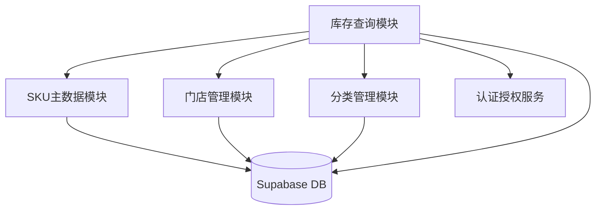
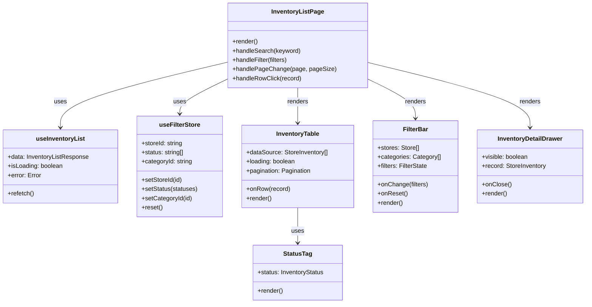
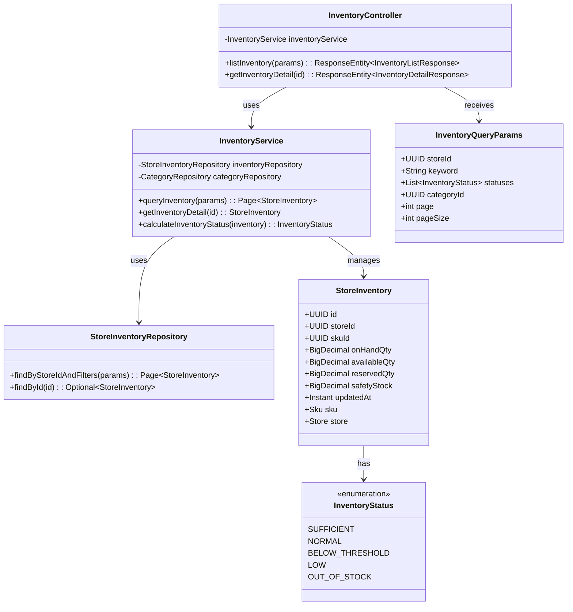
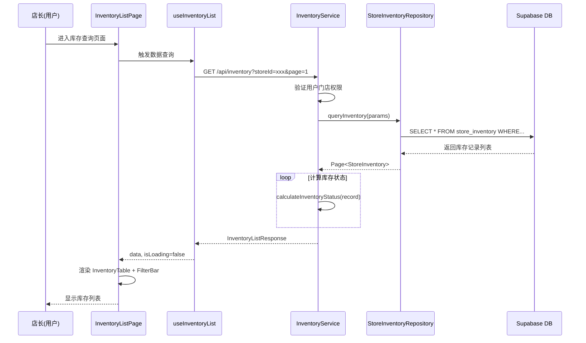
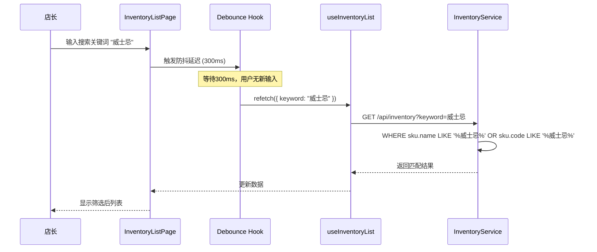
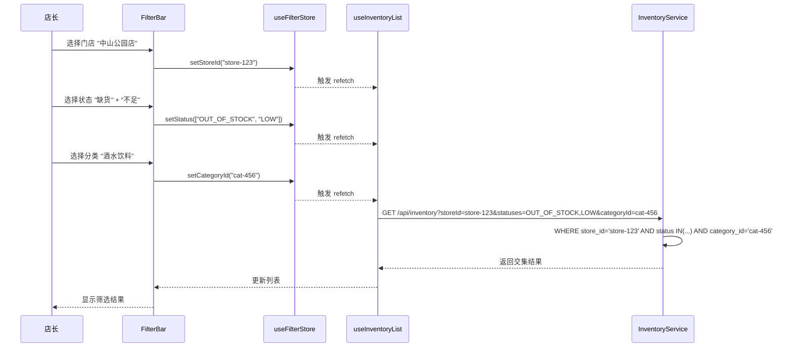
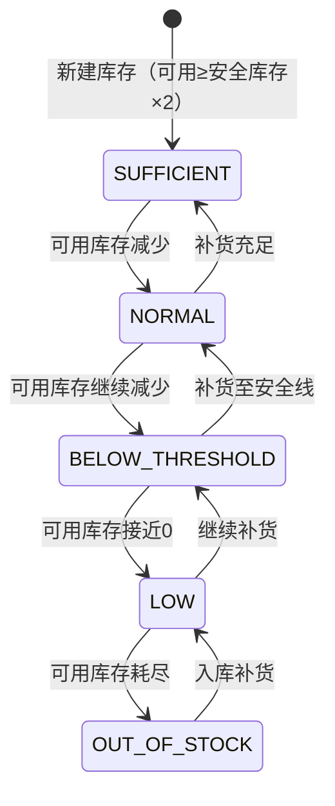
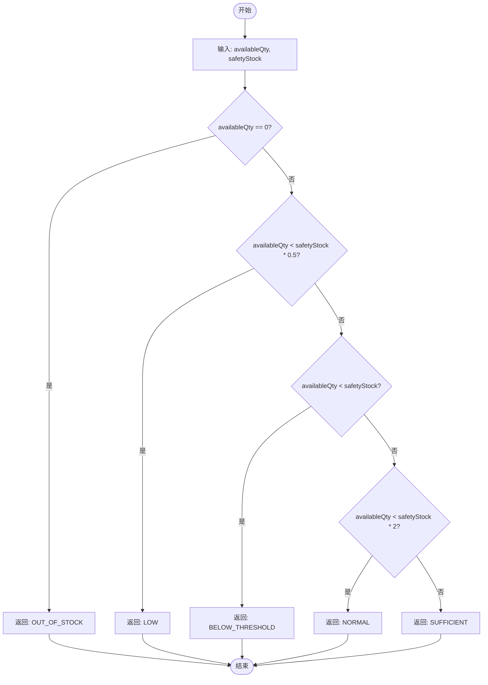
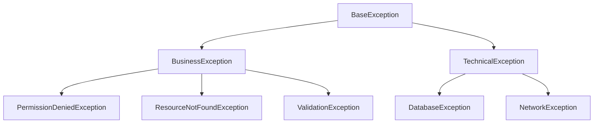

# 详细设计文档 (DDD) - P003-inventory-query

<!-- DOC-WRITER: AUTO-GENERATED START -->
**文档版本**: 1.0
**创建日期**: 2025-12-26
**作者**: Doc-Writer (自动生成)
**模块**: 库存管理 - 门店SKU库存查询

---

## 1. 模块概述

### 1.1 模块说明

门店SKU库存查询模块为店长提供实时库存信息查看能力，支持多维度筛选和搜索。本模块包含库存列表展示、实时搜索、多维筛选（门店/状态/分类）、库存详情查看等核心功能。采用前后端分离架构，前端使用 React + Ant Design，后端使用 Spring Boot + Supabase PostgreSQL。

### 1.2 设计目标

- **实时性**: 库存数据加载响应时间 < 2秒
- **易用性**: 支持实时搜索（300ms防抖）和多维度组合筛选
- **可扩展性**: 支持1000+ SKU的流畅浏览，分页加载优化性能
- **准确性**: 库存状态五级标签自动计算，准确反映补货需求
- **安全性**: 基于用户权限控制门店数据访问范围

### 1.3 模块依赖



**依赖说明**:
- **SKU主数据模块**: 提供SKU基础信息（编码、名称、单位等）
- **门店管理模块**: 提供门店列表和用户门店权限
- **分类管理模块**: 提供商品分类树和筛选选项
- **认证授权服务**: 验证用户身份和门店访问权限
- **Supabase**: 统一数据源，提供数据库访问

---

## 2. 类图设计

### 2.1 核心类图

#### 前端类图



#### 后端类图



### 2.2 类说明

#### 前端核心类

##### InventoryListPage

**职责**: 库存列表页面容器组件，协调子组件交互

**方法**:
- `handleSearch(keyword: string)`: 处理搜索输入，300ms防抖后触发查询
- `handleFilter(filters: FilterState)`: 处理筛选条件变更，触发查询
- `handlePageChange(page: number, pageSize: number)`: 处理分页变更
- `handleRowClick(record: StoreInventory)`: 打开库存详情抽屉

**设计模式**: Container/Presentational 模式

##### useInventoryList (React Hook)

**职责**: TanStack Query Hook，管理库存列表数据获取和缓存

**属性**:
- `data`: 库存列表响应数据
- `isLoading`: 加载状态标识
- `error`: 错误信息
- `refetch()`: 手动刷新数据

**缓存策略**: staleTime = 30秒，cacheTime = 5分钟

##### useFilterStore (Zustand Store)

**职责**: 管理筛选条件状态

**属性**:
- `storeId`: 当前选中门店ID
- `status`: 选中的库存状态列表
- `categoryId`: 选中的分类ID
- `searchKeyword`: 搜索关键词

**方法**:
- `setStoreId(id)`: 设置门店筛选
- `setStatus(statuses)`: 设置状态筛选（多选）
- `setCategoryId(id)`: 设置分类筛选
- `reset()`: 重置所有筛选条件

#### 后端核心类

##### InventoryController

**职责**: 库存查询 REST API 控制器

**方法**:
- `listInventory(params: InventoryQueryParams)`: 分页查询库存列表
  - **参数**: 查询参数对象（门店/关键词/状态/分类/分页）
  - **返回值**: `ResponseEntity<InventoryListResponse>`
  - **异常**: `PermissionDeniedException` (无门店访问权限)

- `getInventoryDetail(id: UUID)`: 获取库存详情
  - **参数**: 库存记录ID
  - **返回值**: `ResponseEntity<InventoryDetailResponse>`
  - **异常**: `ResourceNotFoundException` (库存记录不存在)

##### InventoryService

**职责**: 库存查询业务逻辑服务

**方法**:
- `queryInventory(params)`: 执行库存查询，包含搜索、筛选、分页逻辑
- `calculateInventoryStatus(inventory)`: 根据可用库存和安全库存计算五级状态
- `validateStoreAccess(userId, storeId)`: 验证用户对门店的访问权限

**算法**: 库存状态计算（见第5节）

##### StoreInventory (Entity)

**职责**: 门店库存实体模型

**属性**:
- `id`: 主键
- `storeId`: 门店ID
- `skuId`: SKU ID
- `onHandQty`: 现存数量
- `availableQty`: 可用数量
- `reservedQty`: 预占数量
- `safetyStock`: 安全库存阈值
- `updatedAt`: 最后更新时间

**关联**:
- `sku`: 多对一关联 SKU 实体
- `store`: 多对一关联 Store 实体

---

## 3. 时序图设计

### 3.1 库存列表查询流程

**场景描述**: 店长进入库存查询页面，系统加载并显示当前门店的库存列表



**流程说明**:
1. 用户访问库存查询页面
2. 页面组件挂载，触发 useInventoryList Hook
3. Hook 发起 API 请求（包含默认门店ID和分页参数）
4. 后端验证用户对该门店的访问权限
5. 查询数据库获取库存记录
6. 计算每条记录的库存状态标签
7. 返回响应数据（包含记录列表和分页信息）
8. 前端更新状态并渲染列表

**异常处理**:
- **异常**: 用户无门店访问权限
- **处理**: 返回 403 Forbidden，前端显示"无权限访问该门店"

- **异常**: 数据库查询超时
- **处理**: 返回 500 Internal Server Error，前端显示错误提示和重试按钮

### 3.2 搜索流程

**场景描述**: 店长在搜索框输入关键词，系统实时筛选库存列表



**流程说明**:
1. 用户在搜索框输入关键词
2. 触发 300ms 防抖延迟，避免频繁请求
3. 防抖结束后，使用新关键词重新查询
4. 后端在 SKU 名称和编码字段执行模糊匹配
5. 返回匹配结果并更新列表

**异常处理**:
- **异常**: 搜索关键词包含特殊字符
- **处理**: 后端进行 SQL 转义，确保查询安全

### 3.3 多维筛选流程

**场景描述**: 店长选择门店、库存状态、商品分类进行组合筛选



**流程说明**:
1. 用户逐步设置门店、状态、分类筛选条件
2. 每次筛选条件变更，Zustand Store 更新状态
3. Store 变更触发 useInventoryList refetch
4. 后端组合所有筛选条件执行 AND 查询（交集）
5. 返回满足所有条件的库存记录

**异常处理**:
- **异常**: 筛选结果为空
- **处理**: 显示友好提示"未找到符合条件的库存"

---

## 4. 状态机设计

### 4.1 库存状态机图



### 4.2 状态定义

#### SUFFICIENT (充足)

- **说明**: 库存非常充足，无补货压力
- **条件**: `可用库存 ≥ 安全库存 × 2`
- **可能的转换**: → NORMAL (库存消耗)
- **UI 显示**: 绿色标签

#### NORMAL (正常)

- **说明**: 库存正常，在安全范围内
- **条件**: `安全库存 ≤ 可用库存 < 安全库存 × 2`
- **可能的转换**: → SUFFICIENT (补货) | → BELOW_THRESHOLD (消耗)
- **UI 显示**: 蓝色标签

#### BELOW_THRESHOLD (偏低)

- **说明**: 库存低于安全线但未到警戒值
- **条件**: `安全库存 × 0.5 ≤ 可用库存 < 安全库存`
- **可能的转换**: → NORMAL (补货) | → LOW (消耗)
- **UI 显示**: 黄色标签

#### LOW (不足)

- **说明**: 库存严重不足，需紧急补货
- **条件**: `0 < 可用库存 < 安全库存 × 0.5`
- **可能的转换**: → BELOW_THRESHOLD (补货) | → OUT_OF_STOCK (消耗)
- **UI 显示**: 橙色标签

#### OUT_OF_STOCK (缺货)

- **说明**: 库存耗尽，无法销售
- **条件**: `可用库存 = 0`
- **可能的转换**: → LOW (入库)
- **UI 显示**: 红色标签

### 4.3 事件定义

#### 库存减少事件 (StockDecrease)

- **触发条件**: 销售出库、预占增加、调整盘亏
- **前置状态**: 任意非 OUT_OF_STOCK 状态
- **后置状态**: 根据减少后的可用库存重新计算
- **副作用**: 更新 `available_qty` 和 `updated_at`

#### 库存增加事件 (StockIncrease)

- **触发条件**: 采购入库、取消预占、调整盘盈
- **前置状态**: 任意状态
- **后置状态**: 根据增加后的可用库存重新计算
- **副作用**: 更新 `available_qty` 和 `updated_at`

---

## 5. 算法设计

### 5.1 库存状态计算算法

**功能**: 根据可用库存和安全库存计算五级状态

**输入**:
- `availableQty`: BigDecimal - 可用库存数量
- `safetyStock`: BigDecimal - 安全库存阈值

**输出**: `InventoryStatus` 枚举值

**时间复杂度**: O(1)

**空间复杂度**: O(1)

#### 算法流程



#### 伪代码

```
FUNCTION calculateInventoryStatus(availableQty, safetyStock):
    IF availableQty == 0 THEN
        RETURN OUT_OF_STOCK
    ELSE IF availableQty < safetyStock * 0.5 THEN
        RETURN LOW
    ELSE IF availableQty < safetyStock THEN
        RETURN BELOW_THRESHOLD
    ELSE IF availableQty < safetyStock * 2 THEN
        RETURN NORMAL
    ELSE
        RETURN SUFFICIENT
    END IF
END FUNCTION
```

#### 代码实现 (Java)

```java
public enum InventoryStatus {
    SUFFICIENT,    // 充足
    NORMAL,        // 正常
    BELOW_THRESHOLD, // 偏低
    LOW,           // 不足
    OUT_OF_STOCK   // 缺货
}

public class InventoryService {

    /**
     * 计算库存状态
     *
     * @param availableQty 可用库存数量
     * @param safetyStock 安全库存阈值
     * @return 库存状态枚举值
     */
    public InventoryStatus calculateInventoryStatus(BigDecimal availableQty, BigDecimal safetyStock) {
        if (availableQty.compareTo(BigDecimal.ZERO) == 0) {
            return InventoryStatus.OUT_OF_STOCK;
        }

        BigDecimal halfSafety = safetyStock.multiply(new BigDecimal("0.5"));
        if (availableQty.compareTo(halfSafety) < 0) {
            return InventoryStatus.LOW;
        }

        if (availableQty.compareTo(safetyStock) < 0) {
            return InventoryStatus.BELOW_THRESHOLD;
        }

        BigDecimal doubleSafety = safetyStock.multiply(new BigDecimal("2"));
        if (availableQty.compareTo(doubleSafety) < 0) {
            return InventoryStatus.NORMAL;
        }

        return InventoryStatus.SUFFICIENT;
    }
}
```

#### 测试用例

| 输入 (availableQty / safetyStock) | 预期输出 | 说明 |
|-----------------------------------|---------|------|
| 0 / 100 | OUT_OF_STOCK | 库存为0 |
| 30 / 100 | LOW | 可用 < 安全×0.5 (30 < 50) |
| 70 / 100 | BELOW_THRESHOLD | 0.5×安全 ≤ 可用 < 安全 (50 ≤ 70 < 100) |
| 150 / 100 | NORMAL | 安全 ≤ 可用 < 2×安全 (100 ≤ 150 < 200) |
| 250 / 100 | SUFFICIENT | 可用 ≥ 2×安全 (250 ≥ 200) |

---

## 6. 数据结构设计

### 6.1 InventoryListResponse (库存列表响应)

**用途**: API 响应数据结构，包含分页库存列表

**定义**:
```typescript
interface InventoryListResponse {
  success: boolean;
  data: StoreInventoryDTO[];
  total: number;
  page: number;
  pageSize: number;
  message?: string;
}

interface StoreInventoryDTO {
  id: string;
  skuCode: string;
  skuName: string;
  onHandQty: number;
  availableQty: number;
  reservedQty: number;
  inventoryStatus: InventoryStatus;
  unit: string;
  updatedAt: string;
}
```

**操作复杂度**:

| 操作 | 时间复杂度 | 空间复杂度 |
|------|-----------|-----------|
| 序列化 | O(n) | O(n) |
| 反序列化 | O(n) | O(n) |
| 遍历列表 | O(n) | O(1) |

**使用场景**: 库存列表查询 API 响应

### 6.2 FilterState (筛选条件状态)

**用途**: Zustand Store 管理的筛选条件状态

**定义**:
```typescript
interface FilterState {
  storeId: string | null;
  status: InventoryStatus[];
  categoryId: string | null;
  searchKeyword: string;

  setStoreId: (id: string | null) => void;
  setStatus: (statuses: InventoryStatus[]) => void;
  setCategoryId: (id: string | null) => void;
  setSearchKeyword: (keyword: string) => void;
  reset: () => void;
}
```

**使用场景**: 前端筛选条件管理，驱动查询参数变更

---

## 7. 异常处理设计

### 7.1 异常层次结构



### 7.2 异常定义

#### PermissionDeniedException

**类型**: 业务异常

**触发条件**: 用户尝试访问无权限的门店库存数据

**错误码**: `PERMISSION_DENIED`

**错误消息**: "无权限访问该门店的库存信息"

**处理策略**: 返回 403 状态码，前端显示权限不足提示

**示例**:
```java
@GetMapping("/api/inventory")
public ResponseEntity<InventoryListResponse> listInventory(@RequestParam UUID storeId) {
    if (!authService.hasStoreAccess(getCurrentUserId(), storeId)) {
        throw new PermissionDeniedException("无权限访问该门店的库存信息");
    }
    // ...
}
```

#### ResourceNotFoundException

**类型**: 业务异常

**触发条件**: 查询的库存记录不存在

**错误码**: `RESOURCE_NOT_FOUND`

**错误消息**: "库存记录不存在"

**处理策略**: 返回 404 状态码，前端显示"未找到该库存记录"

#### ValidationException

**类型**: 业务异常

**触发条件**: 查询参数验证失败（如 pageSize 超出范围）

**错误码**: `VALIDATION_ERROR`

**错误消息**: 具体验证错误信息

**处理策略**: 返回 400 状态码，前端显示验证错误提示

### 7.3 异常处理原则

- **统一异常处理**: 使用 `@ControllerAdvice` 统一处理异常
- **错误码标准化**: 所有业务异常返回标准错误码
- **用户友好提示**: 错误消息应对用户友好，避免技术细节泄露
- **日志记录**: 所有异常记录详细日志，包含堆栈信息
- **重试机制**: 网络异常和数据库临时故障支持重试

---

## 8. 并发设计

本模块无并发场景（纯查询操作，无状态修改）。

---

## 9. 性能优化设计

### 9.1 优化目标

| 指标 | 当前值 | 目标值 | 优化措施 |
|------|--------|--------|----------|
| 列表加载时间 | - | < 2秒 | 分页查询、数据库索引 |
| 搜索响应时间 | - | < 1秒 | 输入防抖、索引优化 |
| 详情展开时间 | - | < 500ms | 关联数据预加载 |
| 单页SKU数量 | - | 20-50条 | 分页优化 |

### 9.2 优化策略

#### 数据库索引优化

**原理**: 在高频查询字段创建索引，加速查询

**适用场景**:
- SKU 名称/编码搜索
- 门店/状态/分类筛选

**实现方式**:
```sql
-- store_inventory 表索引
CREATE INDEX idx_store_inventory_store_id ON store_inventory(store_id);
CREATE INDEX idx_store_inventory_sku_id ON store_inventory(sku_id);
CREATE INDEX idx_store_inventory_updated_at ON store_inventory(updated_at DESC);

-- skus 表索引 (用于搜索)
CREATE INDEX idx_skus_name ON skus USING gin(to_tsvector('simple', name));
CREATE INDEX idx_skus_code ON skus(code);
CREATE INDEX idx_skus_category_id ON skus(category_id);
```

**性能提升**: 查询时间从 ~5秒 降至 < 1秒

**权衡**: 索引占用存储空间，写入性能轻微下降（本功能为纯查询，可接受）

#### 前端防抖优化

**原理**: 用户输入时延迟执行查询，避免频繁请求

**适用场景**: 搜索框实时搜索

**实现方式**:
```typescript
import { useDebouncedValue } from '@mantine/hooks';

function InventoryListPage() {
  const [searchKeyword, setSearchKeyword] = useState('');
  const [debouncedKeyword] = useDebouncedValue(searchKeyword, 300);

  const { data } = useInventoryList({ keyword: debouncedKeyword });

  return (
    <Input
      placeholder="搜索SKU名称或编码"
      value={searchKeyword}
      onChange={(e) => setSearchKeyword(e.target.value)}
    />
  );
}
```

**性能提升**: 减少 API 请求次数约 80%

**权衡**: 用户感知延迟 300ms（可接受）

### 9.3 缓存设计

#### TanStack Query 前端缓存

**缓存策略**:

| 缓存对象 | 缓存键 | TTL | 更新策略 |
|---------|--------|-----|---------|
| 库存列表 | `['inventory', storeId, filters]` | 30秒 | staleTime 过期自动重新获取 |
| SKU详情 | `['sku', skuId]` | 5分钟 | 手动 invalidate |
| 门店列表 | `['stores']` | 10分钟 | 手动刷新 |
| 分类树 | `['categories']` | 10分钟 | 手动刷新 |

**缓存实现**:
```typescript
export const useInventoryList = (params: InventoryQueryParams) => {
  return useQuery({
    queryKey: ['inventory', params.storeId, params],
    queryFn: () => inventoryService.listInventory(params),
    staleTime: 30 * 1000, // 30秒
    cacheTime: 5 * 60 * 1000, // 5分钟
  });
};
```

---

## 10. 接口定义

### 10.1 InventoryService (Java Interface)

**说明**: 库存查询服务接口

**类型**: Service Layer Interface

#### 方法定义

##### queryInventory

**签名**:
```java
Page<StoreInventory> queryInventory(InventoryQueryParams params);
```

**参数**:
- `params`: InventoryQueryParams - 查询参数对象
  - `storeId`: UUID - 门店ID
  - `keyword`: String - 搜索关键词（可选）
  - `statuses`: List<InventoryStatus> - 库存状态列表（可选）
  - `categoryId`: UUID - 分类ID（可选）
  - `page`: int - 页码（从0开始）
  - `pageSize`: int - 每页记录数

**返回值**: `Page<StoreInventory>` - 分页库存记录

**异常**:
- `PermissionDeniedException`: 用户无该门店访问权限
- `ValidationException`: 参数验证失败

**前置条件**:
- 用户已登录认证
- storeId 非空
- page >= 0, pageSize > 0

**后置条件**:
- 返回的记录数 ≤ pageSize
- 所有记录的 inventoryStatus 已计算

**示例**:
```java
InventoryQueryParams params = InventoryQueryParams.builder()
    .storeId(UUID.fromString("store-123"))
    .keyword("威士忌")
    .statuses(List.of(InventoryStatus.LOW, InventoryStatus.OUT_OF_STOCK))
    .page(0)
    .pageSize(20)
    .build();

Page<StoreInventory> result = inventoryService.queryInventory(params);
```

---

## 11. 配置管理

### 11.1 配置项定义

#### inventory.pagination.defaultPageSize

| 属性 | 值 |
|------|-----|
| 配置键 | `inventory.pagination.default-page-size` |
| 数据类型 | Integer |
| 默认值 | 20 |
| 说明 | 库存列表默认每页记录数 |
| 可选值 | 10, 20, 30, 50 |
| 环境差异 | 无 |

#### inventory.search.debounceMs

| 属性 | 值 |
|------|-----|
| 配置键 | `inventory.search.debounce-ms` |
| 数据类型 | Integer |
| 默认值 | 300 |
| 说明 | 搜索输入防抖延迟（毫秒） |
| 可选值 | 100-1000 |
| 环境差异 | 无 |

### 11.2 配置示例

**前端配置** (`config.ts`):
```typescript
export const inventoryConfig = {
  pagination: {
    defaultPageSize: 20,
    pageSizeOptions: [10, 20, 30, 50],
  },
  search: {
    debounceMs: 300,
  },
  cache: {
    listStaleTime: 30 * 1000,
    detailStaleTime: 5 * 60 * 1000,
  },
};
```

**后端配置** (`application.yml`):
```yaml
inventory:
  pagination:
    default-page-size: 20
    max-page-size: 100
  search:
    max-keyword-length: 50
```

---

## 12. 测试设计

### 12.1 单元测试

#### InventoryService.calculateInventoryStatus

**测试目标**: 验证库存状态计算算法正确性

**测试用例**:
- **输入**: availableQty=0, safetyStock=100
- **预期输出**: OUT_OF_STOCK
- **边界条件**: 可用库存为0的边界

- **输入**: availableQty=30, safetyStock=100
- **预期输出**: LOW
- **边界条件**: 可用 < 安全×0.5

- **输入**: availableQty=50, safetyStock=100
- **预期输出**: BELOW_THRESHOLD
- **边界条件**: 可用 = 安全×0.5（边界值）

- **输入**: availableQty=100, safetyStock=100
- **预期输出**: NORMAL
- **边界条件**: 可用 = 安全（边界值）

- **输入**: availableQty=200, safetyStock=100
- **预期输出**: SUFFICIENT
- **边界条件**: 可用 = 安全×2（边界值）

**测试代码**:
```java
@Test
void testCalculateInventoryStatus_OutOfStock() {
    InventoryStatus status = inventoryService.calculateInventoryStatus(
        BigDecimal.ZERO, new BigDecimal("100")
    );
    assertEquals(InventoryStatus.OUT_OF_STOCK, status);
}

@Test
void testCalculateInventoryStatus_Low() {
    InventoryStatus status = inventoryService.calculateInventoryStatus(
        new BigDecimal("30"), new BigDecimal("100")
    );
    assertEquals(InventoryStatus.LOW, status);
}

// ... 其他测试用例
```

### 12.2 集成测试

#### 库存列表查询端到端测试

**测试场景**: 店长登录后查看门店库存列表

**依赖模块**: AuthService, StoreService, SkuService, InventoryService

**测试步骤**:
1. Mock 用户登录，获取 Token
2. 请求 GET /api/inventory?storeId=store-123&page=0&pageSize=20
3. 验证响应状态码 200
4. 验证响应数据结构符合 InventoryListResponse
5. 验证返回记录数 ≤ 20
6. 验证每条记录的 inventoryStatus 已计算

**验证点**:
- API 响应时间 < 2秒
- 返回数据包含分页信息（total, page, pageSize）
- 库存状态标签颜色正确显示

**测试代码** (Playwright):
```typescript
test('库存列表查询', async ({ page }) => {
  await page.goto('/inventory');

  // 等待列表加载
  await page.waitForSelector('table.ant-table');

  // 验证列表数据
  const rows = await page.locator('table.ant-table tbody tr').count();
  expect(rows).toBeLessThanOrEqual(20);

  // 验证状态标签
  const statusTag = page.locator('.ant-tag').first();
  await expect(statusTag).toBeVisible();
});
```

---

## 13. 部署说明

### 13.1 部署依赖

- **组件**: Supabase PostgreSQL
- **版本要求**: PostgreSQL 14+
- **配置要求**:
  - 已创建 `store_inventory`, `categories` 表
  - 已运行数据库迁移脚本 `V029__create_store_inventory.sql`

- **组件**: Spring Boot Application
- **版本要求**: Java 21, Spring Boot 3.x
- **配置要求**:
  - 配置 Supabase 连接信息
  - 配置认证服务集成

### 13.2 部署步骤

1. 执行数据库迁移脚本创建表和索引
2. 构建前端应用: `npm run build`
3. 构建后端应用: `mvn clean package`
4. 部署前端静态文件到 CDN/Nginx
5. 部署后端 JAR 包到应用服务器
6. 验证健康检查端点可访问

### 13.3 健康检查

**健康检查端点**: `GET /actuator/health`

**检查项**:
- 数据库连接状态
- Supabase API 可达性
- 内存使用率 < 80%

---

## 14. 附录

### 14.1 设计决策记录

#### 决策 1: 使用五级库存状态标签

- **日期**: 2025-12-26
- **背景**: 需要直观展示库存健康度，帮助店长快速识别需补货的SKU
- **决策**: 采用五级状态（充足/正常/偏低/不足/缺货）+ 颜色编码（绿/蓝/黄/橙/红）
- **理由**:
  - 五级分类细粒度适中，满足业务需求
  - 颜色编码符合用户直觉（红色=危险，绿色=安全）
  - 计算逻辑简单，性能开销低
- **后果**: 需要明确定义每个状态的阈值，并在UI中一致使用

#### 决策 2: 前端使用 TanStack Query 管理服务器状态

- **日期**: 2025-12-26
- **背景**: 需要高效管理库存列表的数据获取、缓存和更新
- **决策**: 使用 TanStack Query 替代手动管理 useEffect + useState
- **理由**:
  - 自动处理缓存、重新验证、后台刷新
  - 内置加载/错误状态管理
  - 支持乐观更新和请求去重
- **后果**: 学习曲线略高，但长期维护性更好

### 14.2 术语表

| 术语 | 定义 |
|------|------|
| SKU | Stock Keeping Unit - 库存量单位，商品的最小管理单元 |
| 现存数量 | 实际在仓库中的库存数量（on_hand_qty） |
| 可用数量 | 可用于销售的库存（available_qty = on_hand - reserved） |
| 预占数量 | 已被订单锁定但未出库的数量（reserved_qty） |
| 安全库存 | 最低库存警戒线，低于此值需要补货（safety_stock） |
| 库存状态 | 根据可用库存与安全库存比例计算的五级标签 |

### 14.3 参考资料

- [Spec 原文](../../../specs/P003-inventory-query/spec.md)
- [Plan 文档](../../../specs/P003-inventory-query/plan.md)
- [Data Model](../../../specs/P003-inventory-query/data-model.md)
- [API 契约](../../../specs/P003-inventory-query/contracts/api.yaml)
- [Ant Design Table 文档](https://ant.design/components/table-cn/)
- [TanStack Query 文档](https://tanstack.com/query/latest)

<!-- DOC-WRITER: AUTO-GENERATED END -->

---

*本文档由 [doc-writer](../../../.claude/skills/doc-writer) 自动生成 | 生成时间: 2025-12-26*
*数据来源: specs/P003-inventory-query/spec.md, plan.md, data-model.md*
