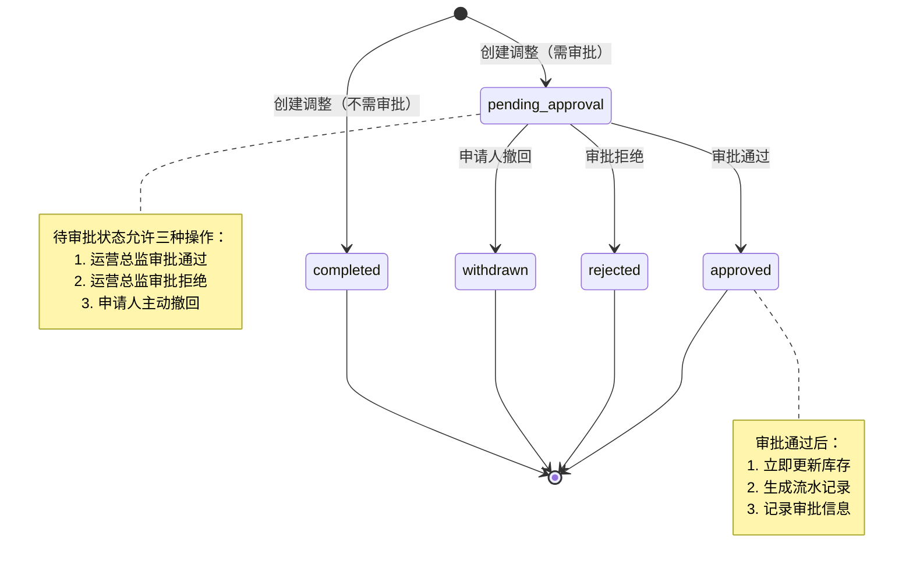
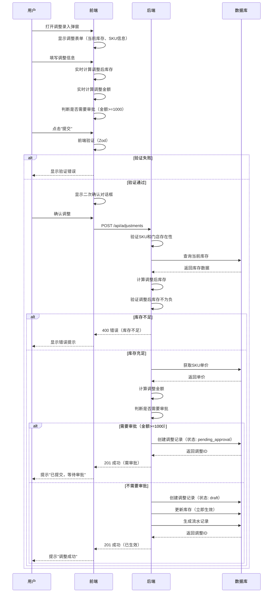
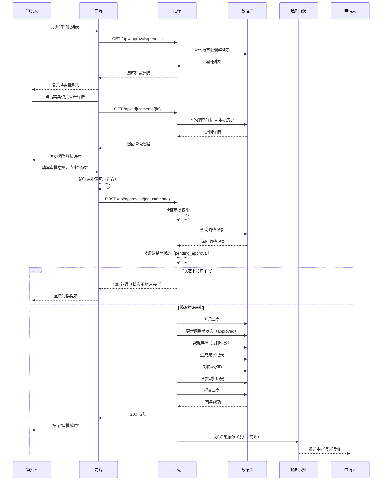
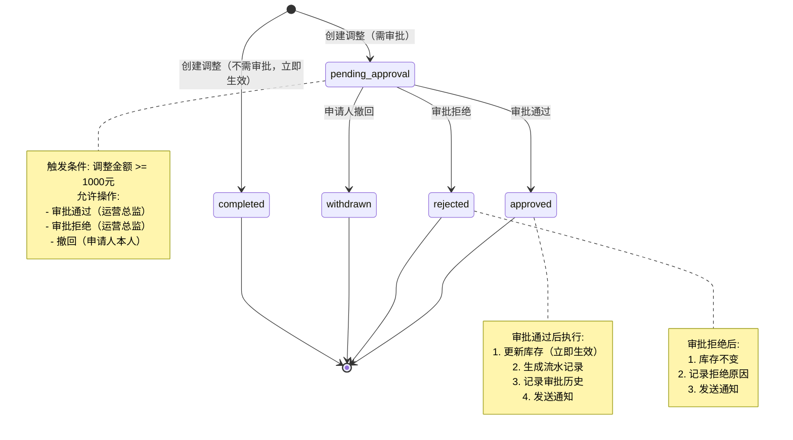

# 详细设计文档：库存调整管理 (Inventory Adjustment Management)

<!-- DOC-WRITER: AUTO-GENERATED START -->
**功能标识**: P004-inventory-adjustment
**文档版本**: 1.0.0
**生成时间**: 2025-12-27
**所属系统**: 商品管理中台
**所属模块**: 库存管理 > 库存调整

---

## 文档说明

本文档是 P004-inventory-adjustment（库存调整管理）功能的详细设计文档，包含完整的业务规则定义、核心模块设计、数据流设计和技术实现细节。

**相关文档**:
- [功能规格说明](../../../specs/P004-inventory-adjustment/spec.md)
- [实施计划](../../../specs/P004-inventory-adjustment/plan.md)
- [数据模型](../../../specs/P004-inventory-adjustment/data-model.md)
- [API 规范](../../../specs/P004-inventory-adjustment/contracts/api.yaml)

---

## 目录

1. [需求概述](#1-需求概述)
2. [业务规则定义](#2-业务规则定义)
   - 2.1 [库存调整录入规则](#21-库存调整录入规则)
   - 2.2 [审批业务规则（重点）](#22-审批业务规则重点)
   - 2.3 [库存流水规则](#23-库存流水规则)
   - 2.4 [安全库存规则](#24-安全库存规则)
   - 2.5 [数据验证规则](#25-数据验证规则)
3. [核心模块设计](#3-核心模块设计)
4. [数据流设计](#4-数据流设计)
5. [状态机设计](#5-状态机设计)
6. [异常处理设计](#6-异常处理设计)
7. [性能优化设计](#7-性能优化设计)
8. [安全设计](#8-安全设计)

---

## 1. 需求概述

### 1.1 功能背景

库存调整管理功能是影院商品管理中台的核心模块之一，用于处理库存盘点差异、货物损耗、报废等日常运营场景。本功能支持库存管理员进行库存调整操作，并通过大额审批机制控制资产风险。

### 1.2 核心功能

1. **库存调整录入**：支持盘盈、盘亏、报损三种调整类型，强制填写调整原因，提交前二次确认
2. **大额调整审批**：调整金额超过阈值（1000元）时触发审批流程，需运营总监审批通过后执行
3. **库存流水查看**：查看库存变动历史，支持按时间、类型筛选，入库/出库数量颜色标识
4. **安全库存编辑**：支持修改安全库存阈值，立即生效影响库存状态计算
5. **调整原因管理**：预置原因字典，支持标准化原因录入

### 1.3 用户角色与权限

| 角色 | 权限范围 |
|------|---------|
| 库存管理员 | 可录入调整、查看流水、编辑安全库存、撤回待审批的调整 |
| 运营总监 | 可审批调整（通过/拒绝）、查看所有调整记录 |
| 普通用户 | 无权限访问 |

---

## 2. 业务规则定义

### 2.1 库存调整录入规则

#### BR-001: 调整类型定义

| 调整类型 | 代码 | 库存影响 | 说明 | 流水类型映射 |
|---------|------|---------|------|-------------|
| 盘盈 | `surplus` | 增加现存库存 | 盘点发现实际数量多于系统记录 | `adjustment_in` |
| 盘亏 | `shortage` | 减少现存库存 | 盘点发现实际数量少于系统记录 | `adjustment_out` |
| 报损 | `damage` | 减少现存库存 | 货物损坏、过期报废 | `damage_out` |

**规则详情**：
- 调整数量始终为正整数，盘亏/报损通过类型区分，不使用负数
- 盘盈直接增加 `on_hand_qty` 和 `available_qty`
- 盘亏/报损减少 `on_hand_qty` 和 `available_qty`
- 所有调整必须确保调整后库存 ≥ 0（负库存拦截）

#### BR-002: 调整数量验证规则

```typescript
// 调整数量约束
interface QuantityConstraints {
  minimum: 1              // 最小值：1（不允许0）
  maximum: 9999           // 最大值：9999
  dataType: 'integer'     // 数据类型：整数
  allowNegative: false    // 不允许负数
}

// 调整后库存验证
function validateAdjustmentQuantity(
  adjustmentType: AdjustmentType,
  quantity: number,
  currentStock: number
): ValidationResult {
  // 1. 数量格式验证
  if (!Number.isInteger(quantity) || quantity <= 0) {
    return { valid: false, error: 'INV_VAL_001', message: '调整数量必须为正整数' }
  }

  // 2. 调整后库存验证
  const stockAfter = adjustmentType === 'surplus'
    ? currentStock + quantity
    : currentStock - quantity

  if (stockAfter < 0) {
    return {
      valid: false,
      error: 'INV_VAL_002',
      message: `调整后库存不能为负数（当前库存: ${currentStock}, 调整数量: ${quantity}）`
    }
  }

  return { valid: true }
}
```

#### BR-003: 调整原因强制填写规则

**规则定义**：
- 调整原因 (`reasonCode`) 为**必填字段**，未填写时阻止提交
- 原因必须从预置字典中选择，不允许自定义代码
- 可选填写原因补充说明 (`reasonText`)，最大长度 500 字符
- 可选填写备注 (`remarks`)，最大长度 500 字符

**预置原因字典**：

| 原因代码 | 原因名称 | 分类 | 适用调整类型 |
|---------|---------|------|-------------|
| `STOCK_DIFF` | 盘点差异 | surplus | 盘盈/盘亏 |
| `GOODS_DAMAGE` | 货物损坏 | damage | 报损 |
| `EXPIRED_WRITE_OFF` | 过期报废 | damage | 报损 |
| `INBOUND_ERROR` | 入库错误 | shortage | 盘亏 |
| `OTHER` | 其他 | shortage | 全部 |

**前端验证逻辑**：
```typescript
const adjustmentFormSchema = z.object({
  skuId: z.string().uuid('无效的SKU ID'),
  storeId: z.string().uuid('无效的门店ID'),
  adjustmentType: z.enum(['surplus', 'shortage', 'damage'], {
    errorMap: () => ({ message: '请选择有效的调整类型' })
  }),
  quantity: z.number()
    .int('调整数量必须为整数')
    .positive('调整数量必须大于0')
    .max(9999, '调整数量不能超过9999'),
  reasonCode: z.string()
    .min(1, '请选择调整原因'),  // ← 强制必填
  reasonText: z.string()
    .max(500, '原因说明不能超过500字符')
    .optional(),
  remarks: z.string()
    .max(500, '备注不能超过500字符')
    .optional()
})
```

#### BR-004: 二次确认规则

**规则定义**：
- 用户提交调整前，必须显示二次确认对话框
- 对话框展示调整前后库存对比，确保用户明确影响
- 用户点击"确认"后才执行调整

**确认对话框内容**：
```
┌────────────────────────────────────────┐
│      确认库存调整                        │
├────────────────────────────────────────┤
│ SKU: 可口可乐 330ml                     │
│ 门店: 北京朝阳影院                       │
│ 调整类型: 盘盈                          │
│ 调整数量: +10                           │
│                                        │
│ 库存变化:                               │
│   调整前: 50                            │
│   调整后: 60 (+10)                      │
│                                        │
│ 调整原因: 盘点差异                       │
│                                        │
│ [取消]              [确认调整]          │
└────────────────────────────────────────┘
```

---

### 2.2 审批业务规则（重点）

#### BR-101: 审批触发规则

**阈值定义**：
```typescript
const APPROVAL_THRESHOLD = 1000; // 单位：元（人民币）
```

**触发条件计算**：
```typescript
function requiresApproval(
  quantity: number,
  unitPrice: number,
  adjustmentType: AdjustmentType
): boolean {
  // 1. 计算调整金额（始终取绝对值）
  const adjustmentAmount = Math.abs(quantity * unitPrice);

  // 2. 判断是否达到阈值（>=1000元触发审批）
  return adjustmentAmount >= APPROVAL_THRESHOLD;
}

// 示例
requiresApproval(50, 19.9, 'surplus')    // → 50 × 19.9 = 995 → false（不需要审批）
requiresApproval(51, 19.9, 'shortage')   // → 51 × 19.9 = 1014.9 → true（需要审批）
requiresApproval(100, 10, 'damage')      // → 100 × 10 = 1000 → true（刚好达到阈值，需要审批）
```

**规则细节**：
- 调整金额 = 调整数量 × SKU 单价（从 SKU 主数据获取）
- 盘盈、盘亏、报损均参与金额计算，统一比较阈值
- 金额 **≥ 1000元** 时触发审批流程（包含等于边界）
- SKU 单价来源：`skus` 表的 `unit_price` 字段

#### BR-102: 审批状态流转规则

**状态定义**：

| 状态代码 | 状态名称 | 说明 | 允许操作 |
|---------|---------|------|---------|
| `draft` | 草稿 | 初始创建，未提交（当前版本不使用） | 提交 |
| `pending_approval` | 待审批 | 已提交，等待审批 | 审批通过、审批拒绝、申请人撤回 |
| `approved` | 已审批通过 | 审批通过，库存已更新 | 无（终态） |
| `rejected` | 已拒绝 | 审批拒绝，库存未更新 | 无（终态） |
| `withdrawn` | 已撤回 | 申请人主动撤回 | 无（终态） |

**状态流转图**：


#### BR-103: 审批权限规则

**角色权限矩阵**：

| 操作 | 库存管理员 | 运营总监 | 系统管理员 |
|-----|-----------|---------|-----------|
| 创建调整 | ✓ | ✓ | ✓ |
| 撤回待审批调整 | ✓（仅本人） | ✗ | ✓ |
| 审批通过/拒绝 | ✗ | ✓ | ✓ |
| 查看审批列表 | ✗ | ✓ | ✓ |

**权限验证逻辑**：
```typescript
// 撤回权限验证
function canWithdraw(
  currentUser: User,
  adjustment: InventoryAdjustment
): boolean {
  // 1. 状态检查：仅待审批状态可撤回
  if (adjustment.status !== 'pending_approval') {
    return false;
  }

  // 2. 权限检查：仅申请人本人或系统管理员可撤回
  return currentUser.id === adjustment.operatorId
    || currentUser.role === 'admin';
}

// 审批权限验证
function canApprove(currentUser: User): boolean {
  // 仅运营总监或系统管理员可审批
  return ['operations_director', 'admin'].includes(currentUser.role);
}
```

#### BR-104: 审批操作规则

**审批通过流程**：
```typescript
async function approveAdjustment(
  adjustmentId: string,
  approverId: string,
  comments?: string
): Promise<void> {
  // 1. 验证调整单状态
  const adjustment = await getAdjustment(adjustmentId);
  if (adjustment.status !== 'pending_approval') {
    throw new Error('INV_APR_001', '调整单状态不允许审批');
  }

  // 2. 开启事务
  const transaction = await db.transaction();

  try {
    // 3. 更新调整单状态
    await transaction.update('inventory_adjustments', {
      id: adjustmentId,
      status: 'approved',
      approved_at: now(),
      approved_by: approverId
    });

    // 4. 更新库存（核心业务逻辑）
    await transaction.update('store_inventory', {
      sku_id: adjustment.skuId,
      store_id: adjustment.storeId,
      on_hand_qty: adjustment.stockAfter,
      available_qty: adjustment.availableAfter,
      updated_at: now(),
      version: increment() // 乐观锁版本号自增
    });

    // 5. 生成库存流水
    const transactionId = await transaction.insert('inventory_transactions', {
      sku_id: adjustment.skuId,
      store_id: adjustment.storeId,
      transaction_type: mapToTransactionType(adjustment.adjustmentType),
      quantity: adjustment.adjustmentType === 'surplus'
        ? adjustment.quantity
        : -adjustment.quantity,
      stock_before: adjustment.stockBefore,
      stock_after: adjustment.stockAfter,
      available_before: adjustment.availableBefore,
      available_after: adjustment.availableAfter,
      source_type: 'adjustment_order',
      source_id: adjustmentId,
      operator_id: adjustment.operatorId,
      remarks: adjustment.remarks,
      created_at: now()
    });

    // 6. 关联流水ID
    await transaction.update('inventory_adjustments', {
      id: adjustmentId,
      transaction_id: transactionId
    });

    // 7. 记录审批历史
    await transaction.insert('approval_records', {
      adjustment_id: adjustmentId,
      approver_id: approverId,
      approver_name: getCurrentUserName(),
      action: 'approve',
      status_before: 'pending_approval',
      status_after: 'approved',
      comments: comments,
      action_time: now()
    });

    // 8. 提交事务
    await transaction.commit();

    // 9. 发送通知（异步，失败不影响审批结果）
    notifyAdjustmentApproved(adjustment.operatorId, adjustmentId);

  } catch (error) {
    await transaction.rollback();
    throw error;
  }
}
```

**审批拒绝流程**：
```typescript
async function rejectAdjustment(
  adjustmentId: string,
  approverId: string,
  comments: string  // 拒绝时必须填写拒绝原因
): Promise<void> {
  // 1. 验证调整单状态
  const adjustment = await getAdjustment(adjustmentId);
  if (adjustment.status !== 'pending_approval') {
    throw new Error('INV_APR_001', '调整单状态不允许审批');
  }

  // 2. 拒绝原因必填验证
  if (!comments || comments.trim() === '') {
    throw new Error('INV_APR_002', '拒绝时必须填写拒绝原因');
  }

  // 3. 开启事务
  const transaction = await db.transaction();

  try {
    // 4. 更新调整单状态（不更新库存）
    await transaction.update('inventory_adjustments', {
      id: adjustmentId,
      status: 'rejected',
      updated_at: now()
    });

    // 5. 记录审批历史
    await transaction.insert('approval_records', {
      adjustment_id: adjustmentId,
      approver_id: approverId,
      approver_name: getCurrentUserName(),
      action: 'reject',
      status_before: 'pending_approval',
      status_after: 'rejected',
      comments: comments,  // 拒绝原因
      action_time: now()
    });

    // 6. 提交事务
    await transaction.commit();

    // 7. 发送通知
    notifyAdjustmentRejected(adjustment.operatorId, adjustmentId, comments);

  } catch (error) {
    await transaction.rollback();
    throw error;
  }
}
```

#### BR-105: 审批时效规则

**当前版本**：
- 无时效限制，待审批调整可无限期等待审批
- 申请人可随时撤回待审批的调整

**后续扩展**（不在 P004 范围）：
- 审批超时自动提醒（如 24 小时未审批）
- 审批超期自动作废（如 7 天未审批）
- 多级审批（如总经理二次审批）

#### BR-106: 审批记录追溯规则

**审批历史记录要求**：
- 所有审批操作（通过/拒绝/撤回）必须记录到 `approval_records` 表
- 记录内容包含：审批人、操作类型、状态变化、审批意见、操作时间
- 审批记录不可修改、不可删除，确保审计追溯

**查询审批历史示例**：
```sql
-- 查询某调整单的完整审批历史
SELECT
  ar.id,
  ar.approver_name,
  ar.action,
  ar.status_before,
  ar.status_after,
  ar.comments,
  ar.action_time
FROM approval_records ar
WHERE ar.adjustment_id = '调整单ID'
ORDER BY ar.action_time ASC;
```

**审批历史展示**：
```
调整单号: ADJ20251227001
当前状态: 已审批通过

审批历史:
┌──────────────────────────────────────────────────────────┐
│ 时间: 2025-12-27 10:30:00                                │
│ 操作人: 张三（运营总监）                                   │
│ 操作: 审批通过                                            │
│ 状态变化: 待审批 → 已审批通过                              │
│ 审批意见: 已核实盘点数据，准予调整                         │
└──────────────────────────────────────────────────────────┘
```

#### BR-107: 审批阈值配置规则

**当前版本**（硬编码）：
```typescript
// frontend/src/features/inventory/constants.ts
export const APPROVAL_THRESHOLD = 1000; // 单位：元

// backend/src/main/java/com/cinema/inventory/constants/InventoryConstants.java
public static final BigDecimal APPROVAL_THRESHOLD = new BigDecimal("1000.00");
```

**后续扩展**（不在 P004 范围）：
- 阈值配置化，支持系统管理员修改
- 分级阈值（如 1000-5000元部门主管审批，>5000元总经理审批）
- 门店级/区域级阈值配置

---

### 2.3 库存流水规则

#### BR-201: 流水生成规则

**触发条件**：
- 调整录入（不需要审批） → 立即生成流水
- 调整审批通过 → 生成流水
- 调整审批拒绝 → 不生成流水
- 调整撤回 → 不生成流水

**流水类型映射**：

| 调整类型 | 流水类型 | 数量符号 |
|---------|---------|---------|
| surplus（盘盈） | `adjustment_in` | 正数 |
| shortage（盘亏） | `adjustment_out` | 负数 |
| damage（报损） | `damage_out` | 负数 |

#### BR-202: 流水显示规则

**颜色标识规则**：
```typescript
function getQuantityStyle(transactionType: TransactionType): CSSProperties {
  // 入库类变动：绿色 + "+" 号
  const inboundTypes = ['purchase_in', 'transfer_in', 'adjustment_in', 'return_in', 'production_in'];

  // 出库类变动：红色 + "-" 号
  const outboundTypes = ['sale_out', 'transfer_out', 'adjustment_out', 'return_out', 'damage_out', 'expired_out'];

  if (inboundTypes.includes(transactionType)) {
    return { color: '#52c41a', prefix: '+' }; // Ant Design success color
  } else if (outboundTypes.includes(transactionType)) {
    return { color: '#ff4d4f', prefix: '-' }; // Ant Design error color
  } else {
    return { color: '#000000', prefix: '' };
  }
}
```

**流水列表展示示例**：
```
变动时间          变动类型      数量        变动前    变动后    操作人
2025-12-27 10:30  盘盈         +10        50       60       张三
2025-12-27 09:15  报损         -5         55       50       李四
2025-12-26 18:00  盘亏         -3         58       55       王五
```

#### BR-203: 流水查询规则

**筛选条件支持**：
- SKU ID
- 门店 ID
- 流水类型（支持多选）
- 时间范围（开始日期 ~ 结束日期）

**分页规则**：
- 默认每页 20 条
- 最大每页 100 条
- 按创建时间倒序排列（最新的在前）

---

### 2.4 安全库存规则

#### BR-301: 安全库存编辑规则

**编辑权限**：
- 库存管理员、系统管理员可编辑

**并发控制**：
```typescript
async function updateSafetyStock(
  inventoryId: string,
  newSafetyStock: number,
  expectedVersion: number
): Promise<void> {
  // 使用乐观锁防止并发冲突
  const result = await db.query(`
    UPDATE store_inventory
    SET safety_stock = $1,
        version = version + 1,
        updated_at = now()
    WHERE id = $2 AND version = $3
  `, [newSafetyStock, inventoryId, expectedVersion]);

  if (result.rowCount === 0) {
    throw new Error('INV_CNF_001', '该记录已被他人修改，请刷新后重试');
  }
}
```

#### BR-302: 安全库存影响规则

**库存状态计算**：
```typescript
function calculateInventoryStatus(
  availableQty: number,
  safetyStock: number
): InventoryStatus {
  if (availableQty < safetyStock * 0.5) {
    return 'critical';  // 红色预警（严重不足）
  } else if (availableQty < safetyStock) {
    return 'low';       // 黄色预警（偏低）
  } else {
    return 'normal';    // 正常
  }
}
```

**修改生效时间**：
- 安全库存修改保存后，**1 秒内**生效
- 库存列表中该 SKU 的状态标识根据新阈值重新计算

---

### 2.5 数据验证规则

#### BR-401: 前端验证规则（Zod Schema）

```typescript
import { z } from 'zod';

// 创建调整请求验证
export const CreateAdjustmentSchema = z.object({
  skuId: z.string().uuid('无效的SKU ID'),
  storeId: z.string().uuid('无效的门店ID'),
  adjustmentType: z.enum(['surplus', 'shortage', 'damage'], {
    errorMap: () => ({ message: '请选择有效的调整类型' })
  }),
  quantity: z.number()
    .int('调整数量必须为整数')
    .positive('调整数量必须大于0')
    .max(9999, '调整数量不能超过9999'),
  reasonCode: z.string()
    .min(1, '请选择调整原因'),
  reasonText: z.string()
    .max(500, '原因说明不能超过500字符')
    .optional(),
  remarks: z.string()
    .max(500, '备注不能超过500字符')
    .optional()
});

// 审批请求验证
export const ApprovalRequestSchema = z.object({
  adjustmentId: z.string().uuid('无效的调整单ID'),
  action: z.enum(['approve', 'reject'], {
    errorMap: () => ({ message: '请选择有效的审批操作' })
  }),
  comments: z.string()
    .max(1000, '审批意见不能超过1000字符')
    .optional()
    .refine((val, ctx) => {
      // 拒绝时必须填写原因
      if (ctx.parent.action === 'reject' && !val) {
        return false;
      }
      return true;
    }, { message: '拒绝时必须填写拒绝原因' })
});

// 安全库存更新验证
export const UpdateSafetyStockSchema = z.object({
  inventoryId: z.string().uuid('无效的库存ID'),
  safetyStock: z.number()
    .int('安全库存必须为整数')
    .nonnegative('安全库存不能为负数')
    .max(99999, '安全库存不能超过99999'),
  version: z.number().int().positive()
});
```

#### BR-402: 后端验证规则（Spring Validation）

```java
// CreateAdjustmentRequest.java
public class CreateAdjustmentRequest {
    @NotNull(message = "SKU ID不能为空")
    @Pattern(regexp = "^[0-9a-f]{8}-[0-9a-f]{4}-[0-9a-f]{4}-[0-9a-f]{4}-[0-9a-f]{12}$",
             message = "无效的SKU ID")
    private String skuId;

    @NotNull(message = "门店ID不能为空")
    @Pattern(regexp = "^[0-9a-f]{8}-[0-9a-f]{4}-[0-9a-f]{4}-[0-9a-f]{4}-[0-9a-f]{12}$",
             message = "无效的门店ID")
    private String storeId;

    @NotNull(message = "调整类型不能为空")
    @Pattern(regexp = "^(surplus|shortage|damage)$", message = "无效的调整类型")
    private String adjustmentType;

    @NotNull(message = "调整数量不能为空")
    @Min(value = 1, message = "调整数量必须大于0")
    @Max(value = 9999, message = "调整数量不能超过9999")
    private Integer quantity;

    @NotBlank(message = "调整原因不能为空")
    @Size(max = 50, message = "原因代码不能超过50字符")
    private String reasonCode;

    @Size(max = 500, message = "原因说明不能超过500字符")
    private String reasonText;

    @Size(max = 500, message = "备注不能超过500字符")
    private String remarks;
}
```

#### BR-403: 数据库约束规则

```sql
-- inventory_adjustments 表约束
ALTER TABLE inventory_adjustments
ADD CONSTRAINT chk_quantity_positive CHECK (quantity > 0),
ADD CONSTRAINT chk_stock_after_non_negative CHECK (stock_after >= 0),
ADD CONSTRAINT chk_available_after_non_negative CHECK (available_after >= 0),
ADD CONSTRAINT chk_adjustment_amount_non_negative CHECK (adjustment_amount >= 0);

-- 唯一约束
CREATE UNIQUE INDEX idx_adjustment_number ON inventory_adjustments(adjustment_number);

-- 外键约束
ALTER TABLE inventory_adjustments
ADD CONSTRAINT fk_adjustment_sku FOREIGN KEY (sku_id) REFERENCES skus(id),
ADD CONSTRAINT fk_adjustment_store FOREIGN KEY (store_id) REFERENCES stores(id),
ADD CONSTRAINT fk_adjustment_reason FOREIGN KEY (reason_code) REFERENCES adjustment_reasons(code);
```

---

## 3. 核心模块设计

### 3.1 前端模块设计

#### 3.1.1 组件架构

```
frontend/src/features/inventory/
├── components/
│   ├── InventoryDetailDrawer.tsx        # 库存详情抽屉（扩展流水标签页）
│   ├── AdjustmentModal.tsx              # 调整录入弹窗
│   ├── AdjustmentForm.tsx               # 调整表单组件
│   ├── ConfirmAdjustmentModal.tsx       # 二次确认弹窗
│   ├── TransactionList.tsx              # 流水列表组件
│   ├── TransactionListItem.tsx          # 流水列表项
│   ├── ApprovalList.tsx                 # 审批列表组件
│   ├── ApprovalDetailModal.tsx          # 审批详情弹窗
│   └── SafetyStockEditor.tsx            # 安全库存编辑器
├── hooks/
│   ├── useInventoryAdjustment.ts        # 调整相关hooks
│   ├── useApproval.ts                   # 审批相关hooks
│   └── useTransactionList.ts            # 流水查询hooks
├── services/
│   ├── adjustmentService.ts             # 调整API服务
│   ├── approvalService.ts               # 审批API服务
│   └── transactionService.ts            # 流水查询API服务
└── types/
    └── index.ts                         # 类型定义
```

#### 3.1.2 关键组件设计

**AdjustmentForm.tsx - 调整表单组件**

```typescript
/**
 * @spec P004-inventory-adjustment
 * 调整表单组件 - 库存调整录入表单
 */
import React from 'react';
import { useForm } from 'react-hook-form';
import { zodResolver } from '@hookform/resolvers/zod';
import { Form, Select, InputNumber, Input } from 'antd';
import { CreateAdjustmentSchema } from '../types';

interface AdjustmentFormProps {
  skuId: string;
  storeId: string;
  currentStock: number;
  unitPrice: number;
  onSubmit: (data: CreateAdjustmentRequest) => void;
  onCancel: () => void;
}

export const AdjustmentForm: React.FC<AdjustmentFormProps> = ({
  skuId,
  storeId,
  currentStock,
  unitPrice,
  onSubmit,
  onCancel
}) => {
  const { control, handleSubmit, watch, formState: { errors } } = useForm({
    resolver: zodResolver(CreateAdjustmentSchema),
    defaultValues: {
      skuId,
      storeId,
      adjustmentType: 'surplus' as AdjustmentType,
      quantity: 1,
      reasonCode: '',
      reasonText: '',
      remarks: ''
    }
  });

  const adjustmentType = watch('adjustmentType');
  const quantity = watch('quantity');

  // 计算调整后库存
  const stockAfter = React.useMemo(() => {
    return adjustmentType === 'surplus'
      ? currentStock + quantity
      : currentStock - quantity;
  }, [adjustmentType, quantity, currentStock]);

  // 计算调整金额
  const adjustmentAmount = React.useMemo(() => {
    return quantity * unitPrice;
  }, [quantity, unitPrice]);

  // 判断是否需要审批
  const requiresApproval = React.useMemo(() => {
    return adjustmentAmount >= APPROVAL_THRESHOLD;
  }, [adjustmentAmount]);

  return (
    <Form layout="vertical">
      {/* 调整类型选择 */}
      <Form.Item label="调整类型" required>
        <Controller
          name="adjustmentType"
          control={control}
          render={({ field }) => (
            <Select {...field} placeholder="请选择调整类型">
              <Select.Option value="surplus">盘盈（增加库存）</Select.Option>
              <Select.Option value="shortage">盘亏（减少库存）</Select.Option>
              <Select.Option value="damage">报损（减少库存）</Select.Option>
            </Select>
          )}
        />
      </Form.Item>

      {/* 调整数量输入 */}
      <Form.Item
        label="调整数量"
        required
        help={errors.quantity?.message}
        validateStatus={errors.quantity ? 'error' : ''}
      >
        <Controller
          name="quantity"
          control={control}
          render={({ field }) => (
            <InputNumber
              {...field}
              min={1}
              max={9999}
              style={{ width: '100%' }}
              placeholder="请输入调整数量"
            />
          )}
        />
      </Form.Item>

      {/* 库存变化预览 */}
      <div className="stock-change-preview">
        <div>当前库存: {currentStock}</div>
        <div>调整后库存: {stockAfter}
          {stockAfter < 0 && <span style={{ color: 'red' }}> ⚠️ 库存不足</span>}
        </div>
        <div>调整金额: ¥{adjustmentAmount.toFixed(2)}</div>
        {requiresApproval && (
          <div style={{ color: '#ff4d4f' }}>
            ⚠️ 调整金额超过审批阈值（¥1000），需运营总监审批
          </div>
        )}
      </div>

      {/* 调整原因选择（必填） */}
      <Form.Item
        label="调整原因"
        required
        help={errors.reasonCode?.message}
        validateStatus={errors.reasonCode ? 'error' : ''}
      >
        <Controller
          name="reasonCode"
          control={control}
          render={({ field }) => (
            <Select {...field} placeholder="请选择调整原因">
              <Select.Option value="STOCK_DIFF">盘点差异</Select.Option>
              <Select.Option value="GOODS_DAMAGE">货物损坏</Select.Option>
              <Select.Option value="EXPIRED_WRITE_OFF">过期报废</Select.Option>
              <Select.Option value="INBOUND_ERROR">入库错误</Select.Option>
              <Select.Option value="OTHER">其他</Select.Option>
            </Select>
          )}
        />
      </Form.Item>

      {/* 原因补充说明（可选） */}
      <Form.Item label="原因说明（可选）">
        <Controller
          name="reasonText"
          control={control}
          render={({ field }) => (
            <Input.TextArea
              {...field}
              maxLength={500}
              showCount
              placeholder="请补充说明调整原因"
              rows={3}
            />
          )}
        />
      </Form.Item>

      {/* 备注（可选） */}
      <Form.Item label="备注（可选）">
        <Controller
          name="remarks"
          control={control}
          render={({ field }) => (
            <Input.TextArea
              {...field}
              maxLength={500}
              showCount
              placeholder="请输入备注信息"
              rows={2}
            />
          )}
        />
      </Form.Item>

      {/* 提交按钮 */}
      <Form.Item>
        <Space>
          <Button onClick={onCancel}>取消</Button>
          <Button
            type="primary"
            onClick={handleSubmit(onSubmit)}
            disabled={stockAfter < 0}
          >
            提交
          </Button>
        </Space>
      </Form.Item>
    </Form>
  );
};
```

### 3.2 后端模块设计

#### 3.2.1 服务层架构

```
backend/src/main/java/com/cinema/inventory/
├── controller/
│   ├── InventoryAdjustmentController.java   # 调整API
│   └── ApprovalController.java               # 审批API
├── service/
│   ├── InventoryAdjustmentService.java       # 调整业务逻辑
│   ├── ApprovalService.java                  # 审批业务逻辑
│   └── TransactionService.java               # 流水查询业务逻辑
├── dto/
│   ├── CreateAdjustmentRequest.java          # 调整请求DTO
│   ├── AdjustmentResponse.java               # 调整响应DTO
│   └── ApprovalRequest.java                  # 审批请求DTO
├── repository/
│   ├── AdjustmentRepository.java             # 调整数据访问
│   ├── ApprovalRepository.java               # 审批数据访问
│   └── TransactionRepository.java            # 流水数据访问
└── exception/
    ├── AdjustmentNotFoundException.java      # 调整不存在异常
    ├── InvalidAdjustmentStatusException.java # 无效状态异常
    └── InsufficientStockException.java       # 库存不足异常
```

#### 3.2.2 关键服务设计

**InventoryAdjustmentService.java - 调整业务服务**

```java
/**
 * @spec P004-inventory-adjustment
 * 库存调整业务服务
 */
@Service
@Transactional
public class InventoryAdjustmentService {

    @Autowired
    private AdjustmentRepository adjustmentRepository;

    @Autowired
    private InventoryRepository inventoryRepository;

    @Autowired
    private TransactionRepository transactionRepository;

    private static final BigDecimal APPROVAL_THRESHOLD = new BigDecimal("1000.00");

    /**
     * 创建库存调整
     *
     * @param request 调整请求
     * @return 调整记录
     */
    public InventoryAdjustment createAdjustment(CreateAdjustmentRequest request) {
        // 1. 验证SKU和门店存在性
        validateSkuAndStore(request.getSkuId(), request.getStoreId());

        // 2. 获取当前库存
        StoreInventory inventory = inventoryRepository.findBySkuIdAndStoreId(
            request.getSkuId(), request.getStoreId()
        ).orElseThrow(() -> new InventoryNotFoundException("库存记录不存在"));

        // 3. 计算调整后库存
        int stockBefore = inventory.getOnHandQty();
        int availableBefore = inventory.getAvailableQty();

        int stockAfter = calculateStockAfter(
            request.getAdjustmentType(), stockBefore, request.getQuantity()
        );
        int availableAfter = calculateStockAfter(
            request.getAdjustmentType(), availableBefore, request.getQuantity()
        );

        // 4. 验证调整后库存不为负
        if (stockAfter < 0 || availableAfter < 0) {
            throw new InsufficientStockException(
                String.format("调整后库存不能为负数（当前库存: %d, 调整数量: %d）",
                    stockBefore, request.getQuantity())
            );
        }

        // 5. 获取SKU单价并计算调整金额
        BigDecimal unitPrice = getSkuUnitPrice(request.getSkuId());
        BigDecimal adjustmentAmount = unitPrice.multiply(
            new BigDecimal(request.getQuantity())
        );

        // 6. 判断是否需要审批
        boolean requiresApproval = adjustmentAmount.compareTo(APPROVAL_THRESHOLD) >= 0;

        // 7. 创建调整记录
        InventoryAdjustment adjustment = InventoryAdjustment.builder()
            .adjustmentNumber(generateAdjustmentNumber())
            .skuId(request.getSkuId())
            .storeId(request.getStoreId())
            .adjustmentType(request.getAdjustmentType())
            .quantity(request.getQuantity())
            .unitPrice(unitPrice)
            .adjustmentAmount(adjustmentAmount)
            .reasonCode(request.getReasonCode())
            .reasonText(request.getReasonText())
            .remarks(request.getRemarks())
            .status(requiresApproval ? AdjustmentStatus.PENDING_APPROVAL : AdjustmentStatus.DRAFT)
            .stockBefore(stockBefore)
            .stockAfter(stockAfter)
            .availableBefore(availableBefore)
            .availableAfter(availableAfter)
            .requiresApproval(requiresApproval)
            .operatorId(getCurrentUserId())
            .operatorName(getCurrentUserName())
            .build();

        adjustment = adjustmentRepository.save(adjustment);

        // 8. 如果不需要审批，立即执行库存更新
        if (!requiresApproval) {
            executeAdjustment(adjustment);
        }

        return adjustment;
    }

    /**
     * 执行库存调整（更新库存 + 生成流水）
     *
     * @param adjustment 调整记录
     */
    private void executeAdjustment(InventoryAdjustment adjustment) {
        // 1. 更新库存
        inventoryRepository.updateStock(
            adjustment.getSkuId(),
            adjustment.getStoreId(),
            adjustment.getStockAfter(),
            adjustment.getAvailableAfter()
        );

        // 2. 生成库存流水
        TransactionType transactionType = mapToTransactionType(adjustment.getAdjustmentType());
        int quantity = adjustment.getAdjustmentType() == AdjustmentType.SURPLUS
            ? adjustment.getQuantity()
            : -adjustment.getQuantity();

        InventoryTransaction transaction = InventoryTransaction.builder()
            .skuId(adjustment.getSkuId())
            .storeId(adjustment.getStoreId())
            .transactionType(transactionType)
            .quantity(quantity)
            .stockBefore(adjustment.getStockBefore())
            .stockAfter(adjustment.getStockAfter())
            .availableBefore(adjustment.getAvailableBefore())
            .availableAfter(adjustment.getAvailableAfter())
            .sourceType("adjustment_order")
            .sourceId(adjustment.getId())
            .operatorId(adjustment.getOperatorId())
            .remarks(adjustment.getRemarks())
            .build();

        transaction = transactionRepository.save(transaction);

        // 3. 关联流水ID
        adjustment.setTransactionId(transaction.getId());
        adjustmentRepository.save(adjustment);
    }

    /**
     * 计算调整后库存
     */
    private int calculateStockAfter(AdjustmentType type, int currentStock, int quantity) {
        return type == AdjustmentType.SURPLUS
            ? currentStock + quantity
            : currentStock - quantity;
    }

    /**
     * 生成调整单号（格式: ADJ + 日期 + 流水号）
     */
    private String generateAdjustmentNumber() {
        String date = LocalDate.now().format(DateTimeFormatter.ofPattern("yyyyMMdd"));
        long sequence = adjustmentRepository.countByDate(date) + 1;
        return String.format("ADJ%s%03d", date, sequence);
    }
}
```

**ApprovalService.java - 审批业务服务**

```java
/**
 * @spec P004-inventory-adjustment
 * 审批业务服务
 */
@Service
@Transactional
public class ApprovalService {

    @Autowired
    private AdjustmentRepository adjustmentRepository;

    @Autowired
    private ApprovalRepository approvalRepository;

    @Autowired
    private InventoryRepository inventoryRepository;

    @Autowired
    private TransactionRepository transactionRepository;

    /**
     * 审批通过
     *
     * @param adjustmentId 调整ID
     * @param approverId 审批人ID
     * @param comments 审批意见
     * @return 调整记录
     */
    public InventoryAdjustment approve(String adjustmentId, String approverId, String comments) {
        // 1. 验证调整单状态
        InventoryAdjustment adjustment = adjustmentRepository.findById(adjustmentId)
            .orElseThrow(() -> new AdjustmentNotFoundException("调整记录不存在"));

        if (adjustment.getStatus() != AdjustmentStatus.PENDING_APPROVAL) {
            throw new InvalidAdjustmentStatusException("调整单状态不允许审批");
        }

        // 2. 更新调整单状态
        adjustment.setStatus(AdjustmentStatus.APPROVED);
        adjustment.setApprovedAt(LocalDateTime.now());
        adjustment.setApprovedBy(approverId);
        adjustmentRepository.save(adjustment);

        // 3. 更新库存
        inventoryRepository.updateStock(
            adjustment.getSkuId(),
            adjustment.getStoreId(),
            adjustment.getStockAfter(),
            adjustment.getAvailableAfter()
        );

        // 4. 生成库存流水
        TransactionType transactionType = mapToTransactionType(adjustment.getAdjustmentType());
        int quantity = adjustment.getAdjustmentType() == AdjustmentType.SURPLUS
            ? adjustment.getQuantity()
            : -adjustment.getQuantity();

        InventoryTransaction transaction = InventoryTransaction.builder()
            .skuId(adjustment.getSkuId())
            .storeId(adjustment.getStoreId())
            .transactionType(transactionType)
            .quantity(quantity)
            .stockBefore(adjustment.getStockBefore())
            .stockAfter(adjustment.getStockAfter())
            .availableBefore(adjustment.getAvailableBefore())
            .availableAfter(adjustment.getAvailableAfter())
            .sourceType("adjustment_order")
            .sourceId(adjustment.getId())
            .operatorId(adjustment.getOperatorId())
            .remarks(adjustment.getRemarks())
            .build();

        transaction = transactionRepository.save(transaction);

        // 5. 关联流水ID
        adjustment.setTransactionId(transaction.getId());
        adjustmentRepository.save(adjustment);

        // 6. 记录审批历史
        ApprovalRecord approvalRecord = ApprovalRecord.builder()
            .adjustmentId(adjustmentId)
            .approverId(approverId)
            .approverName(getCurrentUserName())
            .action(ApprovalAction.APPROVE)
            .statusBefore(AdjustmentStatus.PENDING_APPROVAL)
            .statusAfter(AdjustmentStatus.APPROVED)
            .comments(comments)
            .actionTime(LocalDateTime.now())
            .build();

        approvalRepository.save(approvalRecord);

        // 7. 发送通知（异步）
        notifyAdjustmentApproved(adjustment.getOperatorId(), adjustmentId);

        return adjustment;
    }

    /**
     * 审批拒绝
     *
     * @param adjustmentId 调整ID
     * @param approverId 审批人ID
     * @param comments 拒绝原因（必填）
     * @return 调整记录
     */
    public InventoryAdjustment reject(String adjustmentId, String approverId, String comments) {
        // 1. 验证拒绝原因必填
        if (StringUtils.isBlank(comments)) {
            throw new IllegalArgumentException("拒绝时必须填写拒绝原因");
        }

        // 2. 验证调整单状态
        InventoryAdjustment adjustment = adjustmentRepository.findById(adjustmentId)
            .orElseThrow(() -> new AdjustmentNotFoundException("调整记录不存在"));

        if (adjustment.getStatus() != AdjustmentStatus.PENDING_APPROVAL) {
            throw new InvalidAdjustmentStatusException("调整单状态不允许审批");
        }

        // 3. 更新调整单状态（不更新库存）
        adjustment.setStatus(AdjustmentStatus.REJECTED);
        adjustmentRepository.save(adjustment);

        // 4. 记录审批历史
        ApprovalRecord approvalRecord = ApprovalRecord.builder()
            .adjustmentId(adjustmentId)
            .approverId(approverId)
            .approverName(getCurrentUserName())
            .action(ApprovalAction.REJECT)
            .statusBefore(AdjustmentStatus.PENDING_APPROVAL)
            .statusAfter(AdjustmentStatus.REJECTED)
            .comments(comments)
            .actionTime(LocalDateTime.now())
            .build();

        approvalRepository.save(approvalRecord);

        // 5. 发送通知
        notifyAdjustmentRejected(adjustment.getOperatorId(), adjustmentId, comments);

        return adjustment;
    }
}
```

---

## 4. 数据流设计

### 4.1 调整录入流程



### 4.2 审批流程



---

## 5. 状态机设计

### 5.1 调整单状态机



### 5.2 状态转换规则表

| 当前状态 | 允许的操作 | 目标状态 | 触发条件 | 执行动作 |
|---------|-----------|---------|---------|---------|
| `null` | 创建调整 | `pending_approval` | 调整金额 >= 1000元 | 创建调整记录 |
| `null` | 创建调整 | `completed` | 调整金额 < 1000元 | 创建记录 + 更新库存 + 生成流水 |
| `pending_approval` | 审批通过 | `approved` | 运营总监审批 | 更新库存 + 生成流水 + 记录审批历史 |
| `pending_approval` | 审批拒绝 | `rejected` | 运营总监审批 | 记录拒绝原因 + 记录审批历史 |
| `pending_approval` | 撤回 | `withdrawn` | 申请人撤回 | 记录撤回操作 |
| `approved` | - | - | - | 终态，不可变更 |
| `rejected` | - | - | - | 终态，不可变更 |
| `withdrawn` | - | - | - | 终态，不可变更 |

---

## 6. 异常处理设计

### 6.1 异常分类与处理

| 异常类型 | HTTP 状态码 | 错误代码 | 错误信息示例 | 处理方式 |
|---------|------------|---------|-------------|---------|
| 参数验证错误 | 400 | `INV_VAL_001` ~ `INV_VAL_099` | "调整数量必须为正整数" | 前端拦截 + 后端验证 |
| 业务规则错误 | 422 | `INV_BIZ_001` ~ `INV_BIZ_099` | "调整后库存不能为负数" | 后端验证 |
| 资源不存在 | 404 | `INV_NTF_001` ~ `INV_NTF_099` | "调整记录不存在" | 后端验证 |
| 状态冲突 | 409 | `INV_CNF_001` ~ `INV_CNF_099` | "该记录已被他人修改" | 乐观锁检测 |
| 权限错误 | 403 | `INV_PRM_001` ~ `INV_PRM_099` | "无审批权限" | 权限验证 |
| 审批错误 | 400 | `INV_APR_001` ~ `INV_APR_099` | "调整单状态不允许审批" | 状态验证 |

### 6.2 异常处理示例

```java
/**
 * @spec P004-inventory-adjustment
 * 全局异常处理器
 */
@RestControllerAdvice
public class GlobalExceptionHandler {

    /**
     * 处理库存不足异常
     */
    @ExceptionHandler(InsufficientStockException.class)
    public ResponseEntity<ApiResponse> handleInsufficientStock(InsufficientStockException ex) {
        return ResponseEntity.status(HttpStatus.UNPROCESSABLE_ENTITY)
            .body(ApiResponse.failure("INV_BIZ_001", ex.getMessage()));
    }

    /**
     * 处理调整记录不存在异常
     */
    @ExceptionHandler(AdjustmentNotFoundException.class)
    public ResponseEntity<ApiResponse> handleAdjustmentNotFound(AdjustmentNotFoundException ex) {
        return ResponseEntity.status(HttpStatus.NOT_FOUND)
            .body(ApiResponse.failure("INV_NTF_001", ex.getMessage()));
    }

    /**
     * 处理无效状态异常
     */
    @ExceptionHandler(InvalidAdjustmentStatusException.class)
    public ResponseEntity<ApiResponse> handleInvalidStatus(InvalidAdjustmentStatusException ex) {
        return ResponseEntity.status(HttpStatus.BAD_REQUEST)
            .body(ApiResponse.failure("INV_APR_001", ex.getMessage()));
    }

    /**
     * 处理并发冲突异常
     */
    @ExceptionHandler(OptimisticLockException.class)
    public ResponseEntity<ApiResponse> handleOptimisticLock(OptimisticLockException ex) {
        return ResponseEntity.status(HttpStatus.CONFLICT)
            .body(ApiResponse.failure("INV_CNF_001", "该记录已被他人修改，请刷新后重试"));
    }

    /**
     * 处理参数验证异常
     */
    @ExceptionHandler(MethodArgumentNotValidException.class)
    public ResponseEntity<ApiResponse> handleValidationError(MethodArgumentNotValidException ex) {
        String message = ex.getBindingResult().getFieldErrors().stream()
            .map(FieldError::getDefaultMessage)
            .collect(Collectors.joining("; "));

        return ResponseEntity.status(HttpStatus.BAD_REQUEST)
            .body(ApiResponse.failure("INV_VAL_001", message));
    }
}
```

---

## 7. 性能优化设计

### 7.1 数据库索引优化

```sql
-- 调整单索引
CREATE INDEX idx_adjustments_sku_store ON inventory_adjustments(sku_id, store_id);
CREATE INDEX idx_adjustments_status ON inventory_adjustments(status);
CREATE INDEX idx_adjustments_created_at ON inventory_adjustments(created_at DESC);
CREATE INDEX idx_adjustments_operator ON inventory_adjustments(operator_id);
CREATE INDEX idx_adjustments_requires_approval ON inventory_adjustments(requires_approval) WHERE requires_approval = true;

-- 审批记录索引
CREATE INDEX idx_approval_adjustment ON approval_records(adjustment_id);
CREATE INDEX idx_approval_approver ON approval_records(approver_id);
CREATE INDEX idx_approval_action_time ON approval_records(action_time DESC);

-- 流水记录索引
CREATE INDEX idx_transactions_sku_store ON inventory_transactions(sku_id, store_id);
CREATE INDEX idx_transactions_type ON inventory_transactions(transaction_type);
CREATE INDEX idx_transactions_created_at ON inventory_transactions(created_at DESC);
CREATE INDEX idx_transactions_source ON inventory_transactions(source_type, source_id);
```

### 7.2 查询优化策略

**流水查询分页优化**：
```typescript
// 使用游标分页（cursor-based pagination）优于偏移分页（offset-based）
async function listTransactions(params: TransactionQueryParams): Promise<TransactionListResponse> {
  const { skuId, storeId, transactionTypes, dateRange, cursor, pageSize = 20 } = params;

  const query = supabase
    .from('inventory_transactions')
    .select('*')
    .limit(pageSize + 1); // 多查询一条判断是否有下一页

  if (skuId) query.eq('sku_id', skuId);
  if (storeId) query.eq('store_id', storeId);
  if (transactionTypes) query.in('transaction_type', transactionTypes);
  if (dateRange) query.gte('created_at', dateRange[0]).lte('created_at', dateRange[1]);
  if (cursor) query.lt('created_at', cursor); // 使用游标

  query.order('created_at', { ascending: false });

  const { data, error } = await query;

  const hasMore = data.length > pageSize;
  const items = hasMore ? data.slice(0, pageSize) : data;
  const nextCursor = hasMore ? items[items.length - 1].created_at : null;

  return {
    success: true,
    data: items,
    hasMore,
    nextCursor
  };
}
```

### 7.3 缓存策略

**调整原因字典缓存**：
```typescript
// 使用TanStack Query缓存调整原因字典
export const useAdjustmentReasons = () => {
  return useQuery({
    queryKey: ['adjustment-reasons'],
    queryFn: fetchAdjustmentReasons,
    staleTime: 60 * 60 * 1000, // 1小时缓存
    cacheTime: 24 * 60 * 60 * 1000, // 24小时保留
  });
};
```

---

## 8. 安全设计

### 8.1 权限控制

**基于角色的访问控制（RBAC）**：

| 操作 | 权限检查点 | 验证逻辑 |
|-----|-----------|---------|
| 创建调整 | 前端路由守卫 + 后端API | `role IN ('inventory_admin', 'operations_director', 'admin')` |
| 撤回调整 | 后端API | `operator_id = current_user_id OR role = 'admin'` |
| 审批调整 | 前端路由守卫 + 后端API | `role IN ('operations_director', 'admin')` |
| 查看审批列表 | 前端路由守卫 + 后端API | `role IN ('operations_director', 'admin')` |
| 编辑安全库存 | 前端路由守卫 + 后端API | `role IN ('inventory_admin', 'admin')` |

**Supabase RLS 策略**：
```sql
-- 调整记录访问策略
CREATE POLICY "adjustments_admin_all" ON inventory_adjustments
  FOR ALL USING (
    auth.jwt() ->> 'role' IN ('inventory_admin', 'operations_director', 'admin')
  );

-- 审批记录访问策略
CREATE POLICY "approval_records_director_all" ON approval_records
  FOR ALL USING (
    auth.jwt() ->> 'role' IN ('operations_director', 'admin')
  );
```

### 8.2 数据验证

**多层验证策略**：
1. **前端验证（Zod）**：即时反馈，提升用户体验
2. **后端验证（Spring Validation）**：防御恶意请求
3. **数据库约束（CHECK Constraint）**：最后防线，确保数据一致性

### 8.3 操作审计

**审计日志记录**：
- 所有调整操作记录到 `inventory_adjustments` 表（包含操作人、操作时间）
- 所有审批操作记录到 `approval_records` 表（包含审批人、审批意见、操作时间）
- 所有库存变动记录到 `inventory_transactions` 表（包含操作人、变动前后库存）

**审计查询示例**：
```sql
-- 查询某SKU的所有调整记录
SELECT
  ia.adjustment_number,
  ia.adjustment_type,
  ia.quantity,
  ia.operator_name,
  ia.status,
  ia.created_at,
  ar.approver_name,
  ar.action_time
FROM inventory_adjustments ia
LEFT JOIN approval_records ar ON ia.id = ar.adjustment_id
WHERE ia.sku_id = '某SKU ID'
ORDER BY ia.created_at DESC;
```

---

<!-- DOC-WRITER: AUTO-GENERATED END -->

<!-- DOC-WRITER: USER-SECTION START -->
## 补充说明

本文档由 doc-writer skill 自动生成，基于以下数据源：
- `specs/P004-inventory-adjustment/spec.md` - 功能需求
- `specs/P004-inventory-adjustment/plan.md` - 技术方案
- `specs/P004-inventory-adjustment/data-model.md` - 数据模型
- `specs/P004-inventory-adjustment/contracts/api.yaml` - API 规范

如需补充内容，请在此区域添加，增量更新时会保留此部分内容。
<!-- DOC-WRITER: USER-SECTION END -->

---

**文档维护信息**：
- 生成时间：2025-12-27
- 生成工具：doc-writer skill v2.1.0
- 更新策略：增量更新时保留 USER-SECTION 标记的内容
