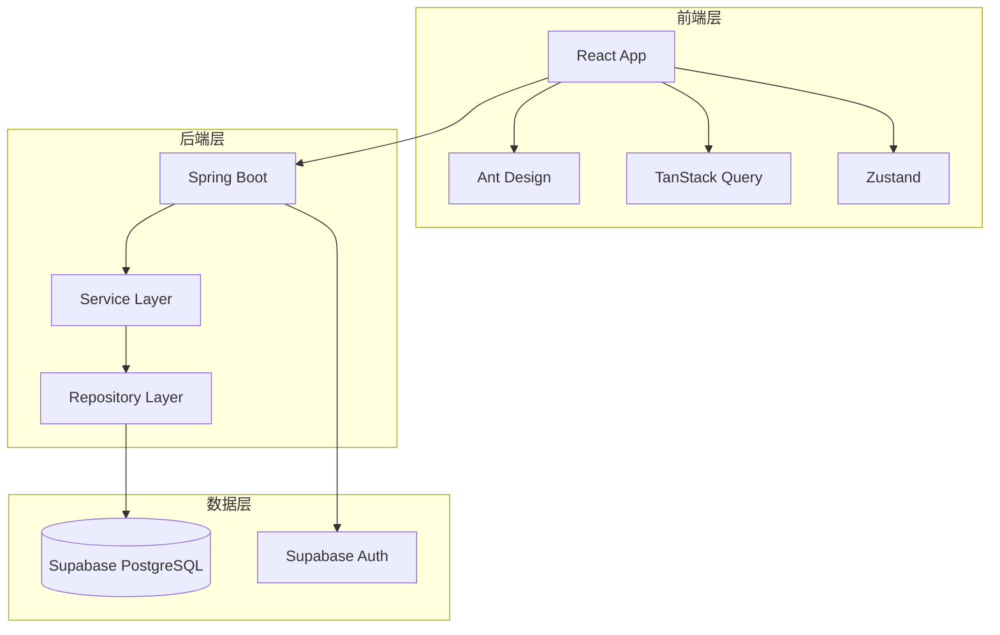

# 技术设计文档 (TDD) - P003-inventory-query

<!-- DOC-WRITER: AUTO-GENERATED START -->
**文档版本**: 1.0
**创建日期**: 2025-12-26
**作者**: Doc-Writer (自动生成)
**审核人**: [待指定]
**状态**: Draft

---

## 变更历史

| 版本 | 日期 | 作者 | 变更说明 |
|------|------|------|----------|
| 1.0 | 2025-12-26 | Doc-Writer | 初始版本 - 从 spec.md 自动生成 |

---

## 1. 概述

### 1.1 背景

店长查看门店SKU库存数量、搜索、筛选、查看详情功能

<!--
  规格编号格式说明 (Spec ID Format):
  P003 - P=商品/库存模块, 002=模块内编号
-->

## User Scenarios & Testing *(mandatory)*

### User Story 1 - 查看门店库存列表 (Priority: P0) [INV-001]

作为店长，我希望能够查看门店所有SKU的当前库存数量，以便掌握库存状态。

### 1.2 项目目标

本功能旨在实现以下目标：

- **P0**: 查看门店库存列表
- **P0**: 搜索库存
- **P0**: 多维度筛选库存
- **P1**: 查看库存详情

### 1.3 范围边界

**包含范围**:
[待补充: 功能需求范围]

**不包含范围**:
[待补充: 明确不包含的功能]

### 1.4 术语定义

| 术语 | 定义 |
|------|------|
| SKU | Stock Keeping Unit - 库存量单位 |
| 库存调整 | 因盘点、损耗等原因进行的库存数量变更 |
| [待补充] | [待补充: 添加其他术语] |

---

## 2. 需求摘要

### 2.1 功能需求

#### P0 - 查看门店库存列表

- **作为**: 店长
- **我希望**: 能够查看门店所有SKU的当前库存数量
- **以便**: 掌握库存状态

**验收标准**:
[待补充: 从spec.md的Acceptance Scenarios提取]

#### P0 - 搜索库存

- **作为**: 店长
- **我希望**: 能够按SKU名称/编码搜索库存
- **以便**: 快速定位商品

**验收标准**:
[待补充: 从spec.md的Acceptance Scenarios提取]

#### P0 - 多维度筛选库存

- **作为**: 店长
- **我希望**: 能够按门店、库存状态、商品分类筛选库存
- **以便**: 快速定位需要关注的商品

**验收标准**:
[待补充: 从spec.md的Acceptance Scenarios提取]

#### P1 - 查看库存详情

- **作为**: 店长
- **我希望**: 能够查看单个SKU的库存详情
- **以便**: 了解完整信息

**验收标准**:
[待补充: 从spec.md的Acceptance Scenarios提取]

### 2.2 非功能需求

| 类别 | 要求 | 指标 |
|------|------|------|
| 性能 | 页面加载时间 | < 2秒 |
| 可用性 | 系统可用率 | ≥ 99.9% |
| 安全性 | 数据加密传输 | HTTPS |
| 可扩展性 | 支持分页加载 | 每页20-50条 |

---

## 3. 技术选型

### 3.1 技术栈

| 层次 | 技术 | 版本 | 选型理由 |
|------|------|------|----------|
| 前端框架 | React | 19.2.0 | 符合项目规范，生态成熟 |
| UI 组件库 | Ant Design | 6.1.0 | B端标准组件库 |
| 状态管理 | Zustand | 5.0.9 | 轻量级状态管理 |
| 服务器状态 | TanStack Query | 5.90.12 | 数据获取和缓存 |
| 后端框架 | Spring Boot | 3.x | Java企业级框架 |
| 数据库 | Supabase (PostgreSQL) | - | 项目统一数据源 |

### 3.2 技术决策记录

[待补充: 从 plan.md 提取技术决策]

---

## 4. 系统架构设计

### 4.1 架构概览

### 4.2 分层架构

| 层次 | 职责 | 技术 |
|------|------|------|
| 表现层 | UI 渲染、用户交互 | React + Ant Design |
| 应用层 | 业务流程编排、状态管理 | TanStack Query + Zustand |
| 服务层 | 业务逻辑实现 | Spring Boot Services |
| 数据层 | 数据持久化、访问 | Supabase + JPA |

---

## 5. 核心模块设计

[待补充: 根据功能需求设计核心模块]

---

## 6. 数据模型设计

### 6.1 数据模型

[待补充: 如果存在 data-model.md，从中提取数据模型]

### 6.2 表结构定义

[待补充: 详细表结构]

---

## 7. 接口设计

### 7.1 API 概览

[待补充: 如果存在 contracts/api.yaml，从中提取 API 定义]

---

## 8. 安全设计

### 8.1 认证授权

- **认证方式**: Supabase Auth (JWT Token)
- **权限模型**: RBAC - 基于角色的访问控制

### 8.2 数据安全

- **敏感数据**: 无特殊敏感数据
- **加密策略**: HTTPS 传输加密

### 8.3 安全检查项

- [x] 输入验证（使用 Zod schema）
- [x] 认证授权检查
- [x] HTTPS 传输
- [ ] 日志脱敏（如有敏感日志）

---

## 9. 性能设计

### 9.1 性能目标

| 场景 | 目标 | 测量方法 |
|------|------|----------|
| 页面加载 | < 2秒 | Chrome DevTools |
| API 响应 | < 1秒 (P95) | 后端日志 |
| 列表滚动 | ≥ 50 FPS | Performance Monitor |

### 9.2 优化策略

- **前端优化**: React.memo、useMemo、虚拟滚动
- **数据查询**: 分页加载、缓存策略
- **网络优化**: TanStack Query 缓存、请求去重

---

## 10. 测试策略

### 10.1 测试覆盖

| 测试类型 | 覆盖范围 | 工具 |
|----------|----------|------|
| 单元测试 | 业务逻辑、工具函数 | Vitest |
| 集成测试 | API 接口、数据库 | MSW + Spring Test |
| E2E 测试 | 用户流程 | Playwright |

### 10.2 关键测试用例

[待补充: 根据 User Story 的 Acceptance Scenarios 生成测试用例]

---

## 11. 风险评估

### 11.1 技术风险

| 风险 | 影响 | 可能性 | 缓解措施 |
|------|------|--------|----------|
| Supabase 连接超时 | 高 | 低 | 设置合理超时时间，错误提示用户 |
| 数据量过大导致性能下降 | 中 | 中 | 分页加载、虚拟滚动 |

### 11.2 业务风险

| 风险 | 影响 | 可能性 | 缓解措施 |
|------|------|--------|----------|
| 需求变更 | 中 | 中 | 采用敏捷开发，快速响应变更 |

---

## 12. 部署方案

### 12.1 部署架构

[待补充: 部署架构图]

### 12.2 部署步骤

1. 前端构建: `npm run build`
2. 后端打包: `mvn clean package`
3. 部署到服务器

### 12.3 回滚方案

保留上一版本代码，如有问题快速回滚。

---

## 13. 附录

### 13.1 参考文档

- [项目技术规范](../../../.claude/rules/)
- [Spec 原文](specs/P003-inventory-query/spec.md)
- [Plan 文档](specs/P003-inventory-query/plan.md)

### 13.2 待确认事项

- [ ] 确认详细的数据模型设计
- [ ] 确认 API 接口契约
- [ ] 补充核心模块设计详情

<!-- DOC-WRITER: AUTO-GENERATED END -->

---

*本文档由 [doc-writer](../../../.claude/skills/doc-writer) 自动生成 | 生成时间: 2025-12-26*
*数据来源: specs/P003-inventory-query/spec.md*
