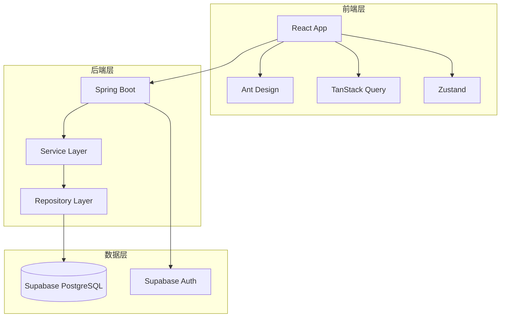

# 技术设计文档 (TDD) - P004-inventory-adjustment

<!-- DOC-WRITER: AUTO-GENERATED START -->
**文档版本**: 1.3
**创建日期**: 2025-12-26
**作者**: Doc-Writer (自动生成)
**审核人**: [待指定]
**状态**: Draft

---

## 变更历史

| 版本 | 日期 | 作者 | 变更说明 |
|------|------|------|----------|
| 1.0 | 2025-12-26 | Doc-Writer | 初始版本 - 从 spec.md 自动生成 |
| 1.1 | 2025-12-26 | Doc-Writer | 更新第6章数据模型设计，添加完整的实体关系图和表结构定义 |
| 1.2 | 2025-12-26 | Doc-Writer | 更新第7章接口设计，添加完整的 API 定义和请求/响应示例 |
| 1.3 | 2025-12-26 | Doc-Writer | 更新第1-2章需求章节，添加完整的用户故事、验收标准和功能需求列表 |

---

## 1. 概述

### 1.1 背景

影院商品管理中台需要支持日常库存调整操作。在实际运营中，由于盘点差异、货物损耗、过期报废等原因，库存管理员需要频繁调整库存数量。当前系统已支持库存查询（P003），但缺少调整录入和审批能力，导致库存数据无法及时反映实际情况。

本功能（P004-inventory-adjustment）旨在提供完整的库存调整管理能力，包括：
- 支持盘盈、盘亏、报损三种调整类型
- 强制填写调整原因，确保可追溯性
- 大额调整需审批，控制资产风险
- 完整的库存流水记录，支持差异分析
- 可自定义安全库存阈值，精准预警

**用户原始需求**: "INV-010~INV-014 库存调整录入、流水查看、原因追溯、大额审批、安全库存设置"

**规格编号**: P004（P=商品/库存模块，004=模块内递增编号）

**澄清事项**:
- Q: 库存调整的用户角色应该是店长(门店级)还是库存管理员(全局级)？
- A: 库存管理员（需授权才能调整，可跨门店操作，与产品功能文档一致）

### 1.2 项目目标

本功能旨在实现以下核心目标：

| 优先级 | 功能目标 | 业务价值 |
|--------|---------|---------|
| **P1** | 录入库存调整 | 核心功能，处理盘点差异和日常损耗，最高频使用场景 |
| **P2** | 查看库存流水记录 | 追溯库存变动历史，支持差异分析和审计合规 |
| **P2** | 填写调整原因（必填） | 确保数据可追溯，为后续差异分析提供基础 |
| **P3** | 大额库存调整审批 | 风险控制手段，保护公司资产，防止异常调整 |
| **P3** | 设置安全库存阈值 | 增强P003库存查询功能，支持自定义预警标准 |

**可衡量成果**:
- 库存管理员可在2分钟内完成一条库存调整录入
- 库存流水查询在500ms内返回结果（100条记录以内）
- 100%的库存调整都有原因记录（强制必填）
- 审批阈值触发准确率100%（金额>=1000元时必进入审批）
- 95%的用户能在首次使用时成功完成操作（无需培训）

### 1.3 范围边界

**包含范围**:

1. **调整管理**
   - 支持盘盈、盘亏、报损三种调整类型
   - 强制填写调整原因（从预设字典选择）
   - 调整提交前二次确认，展示调整前后库存对比
   - 记录调整前后库存快照

2. **审批流程**
   - 调整金额（数量×单价）超过1000元时触发审批
   - 运营总监可审批通过/拒绝
   - 申请人可撤回待审批的调整
   - 完整的审批历史记录

3. **流水查询**
   - 查看SKU的所有库存变动记录
   - 支持按时间范围筛选
   - 区分入库/出库类型（颜色标识）
   - 显示变动前后库存、操作人、原因等

4. **安全库存管理**
   - 编辑SKU的安全库存阈值
   - 修改后立即生效，影响库存状态计算
   - 支持乐观锁并发控制

**不包含范围**:

1. 批量调整 - 不支持批量导入调整记录
2. 调整模板 - 不支持保存调整模板或复制历史调整
3. 自动调整 - 不支持根据盘点结果自动生成调整
4. 多级审批 - 仅支持单级审批流程
5. 移动端审批 - 审批仅在B端管理后台
6. 调整金额统计报表 - 后续作为独立报表功能
7. 原因字典管理 - 由系统管理员后台管理
8. 库存预警推送 - 安全库存阈值变更后的预警推送

### 1.4 术语定义

| 术语 | 定义 |
|------|------|
| SKU | Stock Keeping Unit - 库存量单位，最小库存管理单元 |
| 库存调整 | 因盘点、损耗等原因进行的库存数量变更操作 |
| 盘盈 | 实际库存多于系统记录，需增加库存数量 |
| 盘亏 | 实际库存少于系统记录，需减少库存数量 |
| 报损 | 因损坏、过期等原因导致的库存减少，需特殊标记 |
| 调整金额 | 调整数量 × SKU单价，用于判断是否需要审批 |
| 审批阈值 | 触发审批流程的金额临界值（当前为1000元） |
| 库存流水 | 记录库存每次变动的详细日志，包含前后库存快照 |
| 安全库存 | 库存管理中的最低库存警戒线，低于此值需预警 |
| 库存管理员 | 拥有库存调整权限的全局角色，可跨门店操作 |
| 运营总监 | 拥有审批权限的角色，负责审批大额调整 |

### 1.5 假设与依赖

**假设条件**:
1. 审批阈值为固定值1000元，后续可通过系统配置调整
2. SKU单价数据已存在于SKU主数据中，用于计算调整金额
3. 角色权限体系已实现（库存管理员、运营总监）
4. 系统已有消息通知能力，审批结果可通过现有通知渠道推送
5. 原因字典在系统上线时预置，后续可由管理员维护

**依赖项**:
- P003-inventory-query: 库存查询和详情展示基础能力
- SKU主数据: SKU基本信息和单价数据
- 门店主数据: 门店基本信息
- 权限系统: 角色权限控制
- 消息通知系统: 审批结果通知

---

## 2. 需求摘要

### 2.1 用户故事与验收标准

#### US-001: 录入库存调整 (Priority: P1)

**用户故事**:
- **作为**: 库存管理员
- **我希望**: 能够录入库存调整（盘盈/盘亏/报损）
- **以便**: 处理盘点差异和日常损耗

**优先级理由**: 这是库存调整的核心功能，没有调整录入能力，其他功能（流水、审批）都无法使用。库存管理员日常盘点后需要立即录入差异，是最高频使用场景。

**验收标准**:

1. **AC-001-1**: Given 库存管理员进入库存调整页面，When 选择某个SKU并填写调整类型为"盘盈"、数量为10、原因为"盘点发现"，Then 系统保存调整记录并立即更新该SKU的库存数量+10
2. **AC-001-2**: Given 库存管理员录入一条"盘亏"调整，数量为5，When 提交保存，Then 该SKU库存减少5，且生成一条变动类型为"盘亏"的流水记录
3. **AC-001-3**: Given 库存管理员录入一条"报损"调整，When 提交保存，Then 系统扣减库存并标记变动来源为"报损"
4. **AC-001-4**: Given 库存管理员未选择调整原因，When 尝试提交，Then 系统阻止提交并提示"请选择调整原因"
5. **AC-001-5**: Given 库存管理员填写完调整信息，When 点击确认提交，Then 系统显示二次确认对话框，展示调整前后库存对比

---

#### US-002: 查看库存流水记录 (Priority: P2)

**用户故事**:
- **作为**: 库存管理员
- **我希望**: 能够查看库存流水记录
- **以便**: 追溯库存变动历史

**优先级理由**: 流水查询是库存管理的基础追溯能力，对于排查差异、审计合规至关重要。依赖P1的调整记录数据，但可以展示所有类型的库存变动。

**验收标准**:

1. **AC-002-1**: Given 库存管理员在库存详情页面，When 点击"流水记录"标签，Then 显示该SKU的所有变动记录列表，包含变动类型、数量、时间、操作人字段
2. **AC-002-2**: Given 流水列表有多条记录，When 查看任一记录，Then 可以看到变动前库存和变动后库存数量
3. **AC-002-3**: Given 库存管理员想按时间筛选流水，When 选择日期范围，Then 仅显示该时间段内的流水记录
4. **AC-002-4**: Given 流水列表显示入库类记录，When 查看变动数量，Then 数量以绿色"+"号显示
5. **AC-002-5**: Given 流水列表显示出库类记录，When 查看变动数量，Then 数量以红色"-"号显示

---

#### US-003: 填写调整原因（必填） (Priority: P2)

**用户故事**:
- **作为**: 库存管理员
- **我希望**: 库存调整必须填写原因
- **以便**: 后续分析差异根因

**优先级理由**: 原因记录是数据分析和运营改进的基础，与P1调整录入紧密关联。没有原因记录，无法进行后续的差异分析。

**验收标准**:

1. **AC-003-1**: Given 库存管理员在调整录入页面，When 未选择原因直接提交，Then 系统阻止提交并高亮原因字段
2. **AC-003-2**: Given 调整原因下拉框，When 点击展开，Then 显示预设的原因字典选项（盘点差异、货物损坏、过期报废、入库错误、其他）
3. **AC-003-3**: Given 库存管理员选择了原因，When 还需要补充说明，Then 可在备注字段输入更详细的描述（可选，最大500字符）

---

#### US-004: 大额库存调整审批 (Priority: P3)

**用户故事**:
- **作为**: 运营总监
- **我希望**: 大额库存调整需要审批
- **以便**: 控制资产风险

**优先级理由**: 审批机制是风险控制手段，优先级低于基础的录入和查询功能。当调整金额超过阈值时触发，保护公司资产。

**验收标准**:

1. **AC-004-1**: Given 库存管理员录入一条调整，调整金额（数量×单价）超过设定阈值（1000元），When 提交，Then 调整记录进入"待审批"状态，库存暂不更新
2. **AC-004-2**: Given 运营总监进入审批列表，When 审批通过某条待审批记录，Then 库存立即更新，状态变为"已审批"
3. **AC-004-3**: Given 审批人拒绝某条调整申请，When 操作完成，Then 库存不变，状态变为"已拒绝"，申请人收到拒绝通知
4. **AC-004-4**: Given 任何人查看已审批的调整记录，When 查看详情，Then 可以看到完整的审批记录（审批人、审批时间、审批意见）

---

#### US-005: 设置安全库存阈值 (Priority: P3)

**用户故事**:
- **作为**: 库存管理员
- **我希望**: 能够设置SKU的安全库存阈值
- **以便**: 自定义预警标准

**优先级理由**: 安全库存设置是对现有库存查询功能（P003）的增强，允许库存管理员根据门店/仓库情况自定义阈值，使预警更加精准。

**验收标准**:

1. **AC-005-1**: Given 库存管理员在库存详情抽屉中，When 点击编辑安全库存，Then 可以输入新的安全库存数值
2. **AC-005-2**: Given 库存管理员修改了安全库存值并保存，When 保存成功，Then 新阈值立即生效，库存列表中该SKU的状态标识根据新阈值重新计算
3. **AC-005-3**: Given 某SKU可用库存为10，原安全库存为5（状态正常），When 库存管理员将安全库存调整为15，Then 状态变为"偏低"或"不足"

### 2.2 功能需求列表

| 编号 | 功能需求 | 优先级 |
|------|---------|--------|
| FR-001 | 系统必须支持三种调整类型：盘盈、盘亏、报损 | P1 |
| FR-002 | 调整提交后，系统必须立即更新库存（除非需审批） | P1 |
| FR-003 | 系统必须记录每次调整的变动前后库存 | P1 |
| FR-004 | 库存流水必须显示：类型、数量、时间、操作人、前后库存 | P2 |
| FR-005 | 调整原因必须为必填字段，未填写时阻止提交 | P2 |
| FR-006 | 系统必须提供预设的调整原因字典供选择 | P2 |
| FR-007 | 系统必须支持填写调整备注（可选，最大500字符） | P2 |
| FR-008 | 调整金额超过阈值时，必须进入待审批状态 | P3 |
| FR-009 | 待审批状态的调整，库存不更新，直到审批通过 | P3 |
| FR-010 | 审批通过后，系统必须立即更新库存并记录审批信息 | P3 |
| FR-011 | 审批拒绝后，库存保持不变，记录拒绝原因 | P3 |
| FR-012 | 库存管理员必须能够在库存详情中编辑安全库存阈值 | P3 |
| FR-013 | 安全库存修改后必须立即生效，影响库存状态计算 | P3 |
| FR-014 | 流水记录必须支持按时间范围筛选 | P2 |
| FR-015 | 系统必须支持撤回待审批状态的调整申请 | P3 |
| FR-016 | 调整提交前必须显示二次确认对话框，展示调整前后库存对比 | P1 |
| FR-017 | 流水列表中入库类变动以绿色"+"显示，出库类以红色"-"显示 | P2 |

### 2.3 边界条件与异常处理

**边界条件**:
- 调整数量为0时，系统拒绝提交并提示"调整数量不能为0"
- 不允许输入负数，盘亏通过选择"盘亏"类型实现，数量始终为正数
- 调整金额刚好等于阈值（1000元）时，进入审批流程（>=阈值）

**异常处理**:
- **并发编辑安全库存**: 多人同时编辑同一SKU时，以最后保存者为准，前者收到"已被他人修改"提示（乐观锁机制）
- **审批中撤回**: 已提交待审批的调整，申请人可在审批前撤回
- **无权限访问**: 非库存管理员角色尝试录入调整时，显示无权限提示
- **SKU不存在**: 调整目标SKU已被删除时，阻止调整并提示"该商品不存在"

### 2.4 非功能需求

| 类别 | 要求 | 指标 | 测量方法 |
|------|------|------|----------|
| 性能 | 页面加载时间 | < 2秒 | Chrome DevTools |
| 性能 | API 响应时间 | < 1秒 (P95) | 后端日志 |
| 性能 | 流水查询响应时间 | < 500ms (100条记录内) | 后端日志 |
| 可用性 | 系统可用率 | ≥ 99.9% | 监控系统 |
| 安全性 | 数据加密传输 | HTTPS | SSL/TLS 证书 |
| 可扩展性 | 支持分页加载 | 每页20-50条 | 功能测试 |
| 易用性 | 首次使用成功率 | ≥ 95% | 用户测试 |
| 准确性 | 流水记录准确率 | 100% | 自动化测试 |
| 准确性 | 审批阈值触发准确率 | 100% | 自动化测试 |

---

## 3. 技术选型

### 3.1 技术栈

| 层次 | 技术 | 版本 | 选型理由 |
|------|------|------|----------|
| 前端框架 | React | 19.2.0 | 符合项目规范，生态成熟 |
| UI 组件库 | Ant Design | 6.1.0 | B端标准组件库 |
| 状态管理 | Zustand | 5.0.9 | 轻量级状态管理 |
| 服务器状态 | TanStack Query | 5.90.12 | 数据获取和缓存 |
| 后端框架 | Spring Boot | 3.x | Java企业级框架 |
| 数据库 | Supabase (PostgreSQL) | - | 项目统一数据源 |

### 3.2 技术决策记录

[待补充: 从 plan.md 提取技术决策]

---

## 4. 系统架构设计

### 4.1 架构概览



### 4.2 分层架构

| 层次 | 职责 | 技术 |
|------|------|------|
| 表现层 | UI 渲染、用户交互 | React + Ant Design |
| 应用层 | 业务流程编排、状态管理 | TanStack Query + Zustand |
| 服务层 | 业务逻辑实现 | Spring Boot Services |
| 数据层 | 数据持久化、访问 | Supabase + JPA |

---

## 5. 核心模块设计

[待补充: 根据功能需求设计核心模块]

---

## 6. 数据模型设计

### 6.1 实体关系图

```
┌─────────────────────────────────┐
│         adjustment_reasons      │
│  (调整原因字典)                  │
├─────────────────────────────────┤
│ PK id: uuid                     │
│    code: varchar(50)            │
│    name: varchar(100)           │
│    category: enum               │
│    is_active: boolean           │
│    sort_order: integer          │
└─────────────────────────────────┘
              │
              │ 1:N (reason_code)
              ▼
┌─────────────────────────────────┐         ┌─────────────────────────────────┐
│      inventory_adjustments      │◄───────▶│       approval_records          │
│  (库存调整单)                    │  1:N    │  (审批记录)                      │
├─────────────────────────────────┤         ├─────────────────────────────────┤
│ PK id: uuid                     │         │ PK id: uuid                     │
│ FK sku_id: uuid                 │         │ FK adjustment_id: uuid          │
│ FK store_id: uuid               │         │    approver_id: uuid            │
│    adjustment_type: enum        │         │    approver_name: varchar(100)  │
│    quantity: integer            │         │    action: enum                 │
│    unit_price: decimal          │         │    status_before: enum          │
│    adjustment_amount: decimal   │         │    status_after: enum           │
│ FK reason_code: varchar(50)     │         │    comments: text               │
│    reason_text: varchar(500)    │         │    action_time: timestamptz     │
│    remarks: varchar(500)        │         │    created_at: timestamptz      │
│    status: enum                 │         └─────────────────────────────────┘
│    stock_before: integer        │
│    stock_after: integer         │
│    available_before: integer    │
│    available_after: integer     │
│    requires_approval: boolean   │
│    operator_id: uuid            │
│    created_at: timestamptz      │
│    updated_at: timestamptz      │
│    version: integer             │
└─────────────────────────────────┘
              │
              │ 生成 (on approved)
              ▼
┌─────────────────────────────────┐
│     inventory_transactions      │
│  (库存流水 - P003已定义)          │
├─────────────────────────────────┤
│ PK id: uuid                     │
│ FK sku_id: uuid                 │
│ FK store_id: uuid               │
│    transaction_type: enum       │
│    quantity: integer            │
│    stock_before: integer        │
│    stock_after: integer         │
│    source_type: enum            │
│ FK source_id: uuid (adjustment) │
│    operator_id: uuid            │
│    remarks: varchar(500)        │
│    created_at: timestamptz      │
└─────────────────────────────────┘

┌─────────────────────────────────┐
│        store_inventory          │
│  (门店库存 - P003已定义)          │
├─────────────────────────────────┤
│ PK id: uuid                     │
│ FK sku_id: uuid                 │
│ FK store_id: uuid               │
│    on_hand_qty: integer         │
│    available_qty: integer       │
│    reserved_qty: integer        │
│    safety_stock: integer        │  ← 安全库存阈值(可编辑)
│    min_stock: integer           │
│    max_stock: integer           │
│    reorder_point: integer       │
│    version: integer             │  ← 乐观锁版本号
│    updated_at: timestamptz      │
└─────────────────────────────────┘
```

### 6.2 核心表定义

#### 6.2.1 adjustment_reasons (调整原因字典)

预置的库存调整原因列表，用于标准化原因录入。

| Column | Type | Constraints | Description |
|--------|------|-------------|-------------|
| id | uuid | PK, DEFAULT gen_random_uuid() | 主键 |
| code | varchar(50) | NOT NULL, UNIQUE | 原因代码（如 STOCK_DIFF） |
| name | varchar(100) | NOT NULL | 原因名称（如 盘点差异） |
| category | varchar(20) | NOT NULL | 分类：surplus/shortage/damage |
| is_active | boolean | DEFAULT true | 是否启用 |
| sort_order | integer | DEFAULT 0 | 排序序号 |
| created_at | timestamptz | DEFAULT now() | 创建时间 |
| updated_at | timestamptz | DEFAULT now() | 更新时间 |

**初始数据**:
```sql
INSERT INTO adjustment_reasons (code, name, category, sort_order) VALUES
('STOCK_DIFF', '盘点差异', 'surplus', 1),
('GOODS_DAMAGE', '货物损坏', 'damage', 2),
('EXPIRED_WRITE_OFF', '过期报废', 'damage', 3),
('INBOUND_ERROR', '入库错误', 'shortage', 4),
('OTHER', '其他', 'shortage', 5);
```

#### 6.2.2 inventory_adjustments (库存调整单)

记录每次库存调整操作的完整信息。

| Column | Type | Constraints | Description |
|--------|------|-------------|-------------|
| id | uuid | PK, DEFAULT gen_random_uuid() | 主键 |
| adjustment_number | varchar(30) | UNIQUE, NOT NULL | 调整单号（如 ADJ20251226001） |
| sku_id | uuid | FK → skus.id, NOT NULL | 关联SKU |
| store_id | uuid | FK → stores.id, NOT NULL | 关联门店 |
| adjustment_type | varchar(20) | NOT NULL | 调整类型：surplus/shortage/damage |
| quantity | integer | NOT NULL, CHECK > 0 | 调整数量（始终为正数） |
| unit_price | decimal(12,2) | NOT NULL | SKU单价（来自主数据） |
| adjustment_amount | decimal(12,2) | GENERATED | 调整金额 = quantity × unit_price |
| reason_code | varchar(50) | FK → adjustment_reasons.code, NOT NULL | 原因代码 |
| reason_text | varchar(500) | | 原因补充说明 |
| remarks | varchar(500) | | 备注 |
| status | varchar(20) | NOT NULL, DEFAULT 'draft' | 状态：draft/pending_approval/approved/rejected/withdrawn |
| stock_before | integer | NOT NULL | 调整前现存数量 |
| stock_after | integer | NOT NULL | 调整后现存数量 |
| available_before | integer | NOT NULL | 调整前可用数量 |
| available_after | integer | NOT NULL | 调整后可用数量 |
| requires_approval | boolean | DEFAULT false | 是否需要审批（金额>=阈值） |
| operator_id | uuid | FK → users.id, NOT NULL | 操作人ID |
| operator_name | varchar(100) | NOT NULL | 操作人姓名（冗余存储） |
| approved_at | timestamptz | | 审批通过时间 |
| approved_by | uuid | FK → users.id | 审批人ID |
| transaction_id | uuid | FK → inventory_transactions.id | 关联的流水ID（审批后生成） |
| created_at | timestamptz | DEFAULT now() | 创建时间 |
| updated_at | timestamptz | DEFAULT now() | 更新时间 |
| version | integer | DEFAULT 1 | 乐观锁版本号 |

**索引**:
```sql
CREATE INDEX idx_adjustments_sku_store ON inventory_adjustments(sku_id, store_id);
CREATE INDEX idx_adjustments_status ON inventory_adjustments(status);
CREATE INDEX idx_adjustments_created_at ON inventory_adjustments(created_at DESC);
CREATE INDEX idx_adjustments_operator ON inventory_adjustments(operator_id);
CREATE INDEX idx_adjustments_requires_approval ON inventory_adjustments(requires_approval) WHERE requires_approval = true;
```

**状态枚举**:
- `draft` - 草稿（未提交）
- `pending_approval` - 待审批
- `approved` - 已审批通过
- `rejected` - 已拒绝
- `withdrawn` - 已撤回

**调整类型枚举**:
- `surplus` - 盘盈（增加库存）
- `shortage` - 盘亏（减少库存）
- `damage` - 报损（减少库存并标记损耗）

#### 6.2.3 approval_records (审批记录)

记录调整审批的完整历史。

| Column | Type | Constraints | Description |
|--------|------|-------------|-------------|
| id | uuid | PK, DEFAULT gen_random_uuid() | 主键 |
| adjustment_id | uuid | FK → inventory_adjustments.id, NOT NULL | 关联调整单 |
| approver_id | uuid | FK → users.id, NOT NULL | 审批人ID |
| approver_name | varchar(100) | NOT NULL | 审批人姓名 |
| action | varchar(20) | NOT NULL | 操作：approve/reject/withdraw |
| status_before | varchar(20) | NOT NULL | 操作前状态 |
| status_after | varchar(20) | NOT NULL | 操作后状态 |
| comments | text | | 审批意见 |
| action_time | timestamptz | DEFAULT now() | 操作时间 |
| created_at | timestamptz | DEFAULT now() | 创建时间 |

**索引**:
```sql
CREATE INDEX idx_approval_adjustment ON approval_records(adjustment_id);
CREATE INDEX idx_approval_approver ON approval_records(approver_id);
CREATE INDEX idx_approval_action_time ON approval_records(action_time DESC);
```

### 6.3 设计原则

1. **复用现有结构**: 扩展 P003 定义的 `store_inventory` 和 `inventory_transactions` 表
2. **审批流程解耦**: 独立的审批记录表，便于扩展多级审批
3. **原因标准化**: 预置原因字典表，支持后续扩展
4. **乐观锁并发控制**: 使用 version 字段防止并发冲突
5. **审计追溯**: 完整记录调整前后库存快照、操作人、审批人信息

### 6.4 审批阈值配置

当前版本审批阈值硬编码为 **1000元**，后续可扩展为配置表。

```typescript
// 前端常量
const APPROVAL_THRESHOLD = 1000; // 单位：元

// 计算是否需要审批
const requiresApproval = (quantity: number, unitPrice: number): boolean => {
  const adjustmentAmount = Math.abs(quantity * unitPrice);
  return adjustmentAmount >= APPROVAL_THRESHOLD;
};
```

### 6.5 数据流转

1. **调整录入流程**:
   - 用户录入调整信息 → 系统验证 → 计算调整金额
   - 判断是否需要审批 → 创建调整记录
   - 如不需审批：立即更新库存 + 生成流水
   - 如需审批：状态设为 pending_approval

2. **审批流程**:
   - 审批人查看待审批列表 → 审批通过/拒绝
   - 记录审批操作 → 更新调整单状态
   - 如通过：更新库存 + 生成流水 + 关联 transaction_id
   - 发送通知给申请人

---

## 7. 接口设计

### 7.1 API 概览

本功能提供以下 REST API 接口，所有接口均遵循项目 API 响应格式标准（R8.1-R8.3）。

| 模块 | 接口路径 | 方法 | 说明 |
|------|---------|------|------|
| 调整管理 | `/api/adjustments` | POST | 创建库存调整 |
| 调整管理 | `/api/adjustments` | GET | 查询调整列表 |
| 调整管理 | `/api/adjustments/{id}` | GET | 获取调整详情 |
| 调整管理 | `/api/adjustments/{id}/withdraw` | POST | 撤回调整申请 |
| 审批管理 | `/api/approvals/pending` | GET | 获取待审批列表 |
| 审批管理 | `/api/approvals/{adjustmentId}` | POST | 执行审批操作 |
| 流水查询 | `/api/transactions` | GET | 查询库存流水 |
| 安全库存 | `/api/inventory/{id}/safety-stock` | PUT | 更新安全库存阈值 |
| 原因字典 | `/api/adjustment-reasons` | GET | 获取调整原因字典 |

**认证方式**: Bearer Token (Supabase Auth JWT)

### 7.2 核心接口详细设计

#### 7.2.1 创建库存调整

**接口**: `POST /api/adjustments`

**请求体**:
```json
{
  "skuId": "550e8400-e29b-41d4-a716-446655440001",
  "storeId": "550e8400-e29b-41d4-a716-446655440002",
  "adjustmentType": "surplus",
  "quantity": 10,
  "reasonCode": "STOCK_DIFF",
  "reasonText": "季度盘点发现实际数量多于系统记录",
  "remarks": "盘点编号: INV-2025-Q4-001"
}
```

**业务逻辑**:
1. 验证 SKU 和门店存在性
2. 获取当前库存快照（stock_before, available_before）
3. 计算调整金额 = quantity × unitPrice
4. 判断是否需要审批（金额 >= 1000元）
5. 如不需审批：
   - 立即更新库存
   - 生成库存流水记录
   - 状态设为 `approved`
6. 如需审批：
   - 状态设为 `pending_approval`
   - 不更新库存

**成功响应** (201):
```json
{
  "success": true,
  "data": {
    "id": "...",
    "adjustmentNumber": "ADJ20251226001",
    "status": "pending_approval",
    "requiresApproval": true,
    "adjustmentAmount": 850.00,
    ...
  },
  "timestamp": "2025-12-26T10:30:00Z"
}
```

**错误响应**:
- `400 Bad Request`: 参数错误
- `404 Not Found`: SKU 或门店不存在

---

#### 7.2.2 查询调整列表

**接口**: `GET /api/adjustments`

**查询参数**:
| 参数 | 类型 | 必填 | 说明 |
|------|------|------|------|
| skuId | uuid | 否 | 按SKU筛选 |
| storeId | uuid | 否 | 按门店筛选 |
| status | array | 否 | 按状态筛选（支持多选） |
| adjustmentType | enum | 否 | 按调整类型筛选 |
| startDate | date | 否 | 开始日期 |
| endDate | date | 否 | 结束日期 |
| page | integer | 否 | 页码（默认1） |
| pageSize | integer | 否 | 每页条数（默认20，最大100） |

**成功响应** (200):
```json
{
  "success": true,
  "data": [
    {
      "id": "...",
      "adjustmentNumber": "ADJ20251226001",
      "sku": {
        "id": "...",
        "code": "SKU001",
        "name": "可口可乐 500ml"
      },
      "store": {
        "id": "...",
        "code": "STORE01",
        "name": "万达影城"
      },
      "adjustmentType": "surplus",
      "quantity": 10,
      "status": "approved",
      ...
    }
  ],
  "total": 100,
  "page": 1,
  "pageSize": 20,
  "timestamp": "2025-12-26T10:30:00Z"
}
```

---

#### 7.2.3 执行审批操作

**接口**: `POST /api/approvals/{adjustmentId}`

**权限要求**: 运营总监 (operations_director)

**请求体**:
```json
{
  "action": "approve",
  "comments": "已核实盘点数据，准予调整"
}
```

**业务逻辑**:
1. 验证调整单状态为 `pending_approval`
2. 验证当前用户有审批权限
3. 记录审批操作到 `approval_records` 表
4. 更新调整单状态
5. 如果通过（action = approve）：
   - 更新库存数量
   - 生成库存流水记录
   - 关联 transaction_id
   - 记录 approved_at 和 approved_by
6. 发送通知给申请人

**成功响应** (200):
```json
{
  "success": true,
  "data": {
    "id": "...",
    "status": "approved",
    "approvedAt": "2025-12-26T11:00:00Z",
    "approvedBy": "...",
    "transactionId": "..."
  },
  "message": "审批成功",
  "timestamp": "2025-12-26T11:00:00Z"
}
```

**错误响应**:
- `400 Bad Request`: 状态不允许审批
- `403 Forbidden`: 无审批权限
- `404 Not Found`: 调整记录不存在

---

#### 7.2.4 更新安全库存阈值

**接口**: `PUT /api/inventory/{id}/safety-stock`

**请求体**:
```json
{
  "safetyStock": 50,
  "version": 1
}
```

**乐观锁机制**:
```sql
UPDATE store_inventory
SET safety_stock = :new_value,
    version = version + 1,
    updated_at = now()
WHERE id = :id AND version = :expected_version;

-- 如果更新行数为0，返回 409 Conflict
```

**成功响应** (200):
```json
{
  "success": true,
  "data": {
    "id": "...",
    "skuId": "...",
    "storeId": "...",
    "safetyStock": 50,
    "version": 2,
    "updatedAt": "2025-12-26T12:00:00Z"
  },
  "timestamp": "2025-12-26T12:00:00Z"
}
```

**错误响应**:
- `400 Bad Request`: 参数错误
- `404 Not Found`: 库存记录不存在
- `409 Conflict`: 并发冲突（已被他人修改）

---

#### 7.2.5 查询库存流水

**接口**: `GET /api/transactions`

**查询参数**:
| 参数 | 类型 | 必填 | 说明 |
|------|------|------|------|
| skuId | uuid | 否 | 按SKU筛选 |
| storeId | uuid | 否 | 按门店筛选 |
| transactionTypes | array | 否 | 按交易类型筛选（支持多选） |
| startDate | date | 否 | 开始日期 |
| endDate | date | 否 | 结束日期 |
| page | integer | 否 | 页码 |
| pageSize | integer | 否 | 每页条数 |

**流水类型映射**:
| 调整类型 | 流水类型 |
|---------|---------|
| surplus | adjustment_in |
| shortage | adjustment_out |
| damage | damage_out |

**成功响应** (200):
```json
{
  "success": true,
  "data": [
    {
      "id": "...",
      "sku": {
        "id": "...",
        "code": "SKU001",
        "name": "可口可乐 500ml"
      },
      "store": {
        "id": "...",
        "code": "STORE01",
        "name": "万达影城"
      },
      "transactionType": "adjustment_in",
      "quantity": 10,
      "stockBefore": 100,
      "stockAfter": 110,
      "sourceType": "adjustment_order",
      "sourceId": "...",
      "operatorName": "张三",
      "remarks": "盘点差异调整",
      "transactionTime": "2025-12-26T10:30:00Z"
    }
  ],
  "total": 50,
  "page": 1,
  "pageSize": 20,
  "timestamp": "2025-12-26T12:00:00Z"
}
```

### 7.3 枚举类型定义

#### AdjustmentType (调整类型)
- `surplus`: 盘盈（增加库存）
- `shortage`: 盘亏（减少库存）
- `damage`: 报损（减少库存并标记损耗）

#### AdjustmentStatus (调整状态)
- `draft`: 草稿（未提交）
- `pending_approval`: 待审批
- `approved`: 已审批通过
- `rejected`: 已拒绝
- `withdrawn`: 已撤回

#### ApprovalAction (审批操作)
- `approve`: 通过
- `reject`: 拒绝

#### TransactionType (流水类型)
- `purchase_in`: 采购入库
- `sale_out`: 销售出库
- `transfer_in`: 调拨入库
- `transfer_out`: 调拨出库
- `adjustment_in`: 盘盈调整
- `adjustment_out`: 盘亏调整
- `return_in`: 退货入库
- `return_out`: 退货出库
- `damage_out`: 报损出库
- `production_in`: 生产入库
- `expired_out`: 过期出库

### 7.4 权限控制

| 接口 | 所需角色 |
|------|---------|
| 创建调整 | inventory_admin（库存管理员） |
| 查询调整列表 | inventory_admin, operations_director |
| 撤回调整 | inventory_admin（仅本人创建的记录） |
| 执行审批 | operations_director（运营总监） |
| 查询流水 | inventory_admin, operations_director |
| 更新安全库存 | inventory_admin |
| 查询原因字典 | 所有已认证用户 |

### 7.5 API 契约文档

完整的 OpenAPI 3.0 规范见：
`specs/P004-inventory-adjustment/contracts/api.yaml`

---

## 8. 安全设计

### 8.1 认证授权

- **认证方式**: Supabase Auth (JWT Token)
- **权限模型**: RBAC - 基于角色的访问控制

### 8.2 数据安全

- **敏感数据**: 无特殊敏感数据
- **加密策略**: HTTPS 传输加密

### 8.3 安全检查项

- [x] 输入验证（使用 Zod schema）
- [x] 认证授权检查
- [x] HTTPS 传输
- [ ] 日志脱敏（如有敏感日志）

---

## 9. 性能设计

### 9.1 性能目标

| 场景 | 目标 | 测量方法 |
|------|------|----------|
| 页面加载 | < 2秒 | Chrome DevTools |
| API 响应 | < 1秒 (P95) | 后端日志 |
| 列表滚动 | ≥ 50 FPS | Performance Monitor |

### 9.2 优化策略

- **前端优化**: React.memo、useMemo、虚拟滚动
- **数据查询**: 分页加载、缓存策略
- **网络优化**: TanStack Query 缓存、请求去重

---

## 10. 测试策略

### 10.1 测试覆盖

| 测试类型 | 覆盖范围 | 工具 |
|----------|----------|------|
| 单元测试 | 业务逻辑、工具函数 | Vitest |
| 集成测试 | API 接口、数据库 | MSW + Spring Test |
| E2E 测试 | 用户流程 | Playwright |

### 10.2 关键测试用例

[待补充: 根据 User Story 的 Acceptance Scenarios 生成测试用例]

---

## 11. 风险评估

### 11.1 技术风险

| 风险 | 影响 | 可能性 | 缓解措施 |
|------|------|--------|----------|
| Supabase 连接超时 | 高 | 低 | 设置合理超时时间，错误提示用户 |
| 数据量过大导致性能下降 | 中 | 中 | 分页加载、虚拟滚动 |

### 11.2 业务风险

| 风险 | 影响 | 可能性 | 缓解措施 |
|------|------|--------|----------|
| 需求变更 | 中 | 中 | 采用敏捷开发，快速响应变更 |

---

## 12. 部署方案

### 12.1 部署架构

[待补充: 部署架构图]

### 12.2 部署步骤

1. 前端构建: `npm run build`
2. 后端打包: `mvn clean package`
3. 部署到服务器

### 12.3 回滚方案

保留上一版本代码，如有问题快速回滚。

---

## 13. 附录

### 13.1 参考文档

- [项目技术规范](../../../.claude/rules/)
- [Spec 原文](specs/P004-inventory-adjustment/spec.md)
- [Plan 文档](specs/P004-inventory-adjustment/plan.md)

### 13.2 待确认事项

- [x] 确认详细的数据模型设计（已完成 - 2025-12-26）
- [x] 确认 API 接口契约（已完成 - 2025-12-26）
- [ ] 补充核心模块设计详情

<!-- DOC-WRITER: AUTO-GENERATED END -->

---

*本文档由 [doc-writer](../../../.claude/skills/doc-writer) 自动生成 | 生成时间: 2025-12-26*
*数据来源: specs/P004-inventory-adjustment/spec.md*
