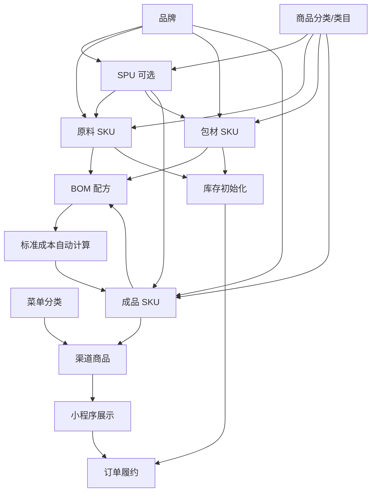

# 影院商品管理系统 - 商品上架全流程配置指南

**文档类型**: 运营配置手册  
**适用版本**: v1.0.0  
**创建日期**: 2026-01-08  
**适用人员**: 运营人员、系统管理员、商品配置人员

---

## 📋 文档概述

本文档提供从零开始到商品上架售卖的完整配置流程，适用于系统初始化或新增商品场景。

### 涉及规格引用
- `@spec P001-sku-master-data` - SKU 主数据管理
- `@spec P005-bom-inventory-deduction` - BOM 配方与库存扣料
- `@spec P004-inventory-adjustment` - 库存调整
- `@spec O002-miniapp-menu-config` - 小程序菜单分类配置
- `@spec O005-channel-product-config` - 渠道商品配置
- `@spec O003-beverage-order` - 饮品订单

---

## 📌 第一阶段：前置准备（系统环境）

### 1.1 系统启动验证

**检查清单**:

- [ ] **数据库初始化**
  - Supabase PostgreSQL 实例已创建
  - 数据库迁移脚本已执行（Flyway）
  - 表结构正常

- [ ] **后端服务启动**
  - Spring Boot 服务运行中
  - 访问地址: `http://localhost:8080`
  - 健康检查: `GET /actuator/health`

- [ ] **前端管理后台启动**
  - React + Vite 应用运行中
  - 访问地址: `http://localhost:3000`
  - 登录页面正常显示

- [ ] **管理员账号**
  - 管理员账号已创建
  - 拥有完整权限（SKU、BOM、库存、渠道商品管理）

### 1.2 权限与配置验证

- [ ] **API 认证**
  - JWT Token 生成正常
  - 请求头携带 `Authorization: Bearer <token>`
  - API 返回非 403 错误

- [ ] **存储配置**
  - Supabase Storage Bucket 已创建
  - Bucket 名称: `beverage-images`
  - 公开访问权限已配置

---

## 📦 第二阶段：基础数据配置

### 2.1 创建菜单分类（Menu Category）

#### 目的
为小程序商品提供分类导航，支持用户按分类浏览商品。

#### 操作路径
```
B端后台 → 菜单分类管理 → 新建分类
```

#### 配置字段说明

| 字段 | 类型 | 必填 | 说明 |
|------|------|------|------|
| 分类编码（code） | String | 是 | 唯一标识，建议使用大写英文，如 `ALCOHOL` |
| 分类名称（displayName） | String | 是 | 显示在小程序的分类名称 |
| 排序（sortOrder） | Number | 是 | 数字越小越靠前，建议从 1 开始 |
| 图标（icon） | String | 否 | 分类图标 emoji 或图片 URL |
| 状态（isVisible） | Boolean | 是 | 是否在小程序显示，默认 `true` |

#### 配置示例

```
| 分类编码  | 分类名称 | 排序 | 图标 | 状态 |
|----------|---------|------|------|------|
| ALCOHOL  | 经典特调 | 1    | 🍸   | 启用 |
| COFFEE   | 精品咖啡 | 2    | ☕   | 启用 |
| BEVERAGE | 清爽饮品 | 3    | 🥤   | 启用 |
| SNACK    | 主厨小食 | 4    | 🍔   | 启用 |
| REWARDS  | 积分兑换 | 5    | 🎁   | 启用 |
```

#### API 调用示例

**请求**:
```http
POST /api/admin/menu-categories
Authorization: Bearer <token>
Content-Type: application/json

{
  "code": "ALCOHOL",
  "displayName": "经典特调",
  "sortOrder": 1,
  "icon": "🍸",
  "isVisible": true
}
```

**响应**:
```json
{
  "success": true,
  "data": {
    "id": "550e8400-e29b-41d4-a716-446655440001",
    "code": "ALCOHOL",
    "displayName": "经典特调",
    "sortOrder": 1,
    "icon": "🍸",
    "isVisible": true,
    "createdAt": "2026-01-08T10:00:00Z"
  }
}
```

#### 验证方式

- [ ] B端：菜单分类列表显示新分类
- [ ] C端：调用小程序分类 API 可获取到分类
  ```http
  GET /api/client/menu-categories
  ```

--

## 📦 第三阶段：基础主数据配置

### 3.1 创建品牌（Brand）

#### 目的
品牌是商品的重要属性，用于标识商品的生产商或品牌方。SPU 和 SKU 都可以关联品牌信息。

#### 操作路径
```
B端后台 → 商品管理 → 品牌管理 → 新建品牌
```

#### 配置字段说明

| 字段 | 类型 | 必填 | 说明 |
|------|------|------|------|
| 品牌编码 | String | 是 | 全局唯一，建议使用大写英文，如 `BRAND-CHIVAS` |
| 品牌名称 | String | 是 | 品牌显示名称 |
| 品牌描述 | Text | 否 | 品牌简介 |
| 品牌 Logo | 图片 | 否 | 品牌标志图片 URL |
| 状态 | Enum | 是 | `ENABLED`（启用）/ `DISABLED`（禁用） |

#### 配置示例

**酒类品牌**:
```
品牌编码: BRAND-CHIVAS
品牌名称: 芝华士
品牌描述: 苏格兰威士忌品牌，创立于1801年
品牌 Logo: [上传图片]
状态: ENABLED
```

**饮料品牌**:
```
品牌编码: BRAND-COCACOLA
品牌名称: 可口可乐
品牌描述: 全球知名碳酸饮料品牌
品牌 Logo: [上传图片]
状态: ENABLED
```

**自有品牌**:
```
品牌编码: BRAND-HOUSE
品牌名称: 自有品牌
品牌描述: 影院自制商品品牌
品牌 Logo: [上传图片]
状态: ENABLED
```

#### 批量配置示例

| 品牌编码 | 品牌名称 | 品牌描述 | 状态 | 备注 |
|---------|---------|---------|------|------|
| BRAND-CHIVAS | 芝华士 | 苏格兰威士忌品牌 | 启用 | 进口酒类 |
| BRAND-COCACOLA | 可口可乐 | 碳酸饮料品牌 | 启用 | 软饮 |
| BRAND-ARABICA | 阿拉比卡 | 精品咖啡品牌 | 启用 | 咖啡类 |
| BRAND-GUANGMING | 光明 | 乳制品品牌 | 启用 | 乳制品 |
| BRAND-HOUSE | 自有品牌 | 影院自制商品 | 启用 | 自制商品 |

#### API 调用示例

**请求**:
```http
POST /api/brands
Authorization: Bearer <token>
Content-Type: application/json

{
  "code": "BRAND-CHIVAS",
  "name": "芝华士",
  "description": "苏格兰威士忌品牌，创立于1801年",
  "logo": "https://storage.supabase.co/brand-logos/chivas.png",
  "status": "ENABLED"
}
```

**响应**:
```json
{
  "success": true,
  "data": {
    "id": "550e8400-e29b-41d4-a716-446655440001",
    "code": "BRAND-CHIVAS",
    "name": "芝华士",
    "description": "苏格兰威士忌品牌，创立于1801年",
    "status": "ENABLED",
    "createdAt": "2026-01-08T10:00:00Z"
  }
}
```

#### 验证方式

- [ ] 品牌列表中显示新创建的品牌
- [ ] 编码全局唯一，无重复
- [ ] 品牌名称正确显示
- [ ] 状态为"启用"

---

### 3.2 创建商品分类（Category）

#### 目的
商品分类（也称类目）是商品的层级分类体系，用于组织和管理商品。通常包含多级分类（一级、二级、三级）。

#### 操作路径
```
B端后台 → 商品管理 → 类目管理 → 新建分类
```

#### 配置字段说明

| 字段 | 类型 | 必填 | 说明 |
|------|------|------|------|
| 分类编码 | String | 是 | 全局唯一，建议格式: `CAT-{分类名}` |
| 分类名称 | String | 是 | 分类显示名称 |
| 父分类 ID | UUID | 否 | 上级分类ID，顶级分类留空 |
| 分类层级 | Number | 自动 | 1-一级分类、2-二级分类、3-三级分类 |
| 排序 | Number | 是 | 数字越小越靠前，默认 0 |
| 分类描述 | Text | 否 | 分类说明 |
| 状态 | Enum | 是 | `ENABLED`（启用）/ `DISABLED`（禁用） |

#### 三级分类示例

**一级分类: 原料**
```
分类编码: CAT-RAW-MATERIAL
分类名称: 原料
父分类 ID: [空]
分类层级: 1
排序: 1
状态: ENABLED
```

**二级分类: 酒类**
```
分类编码: CAT-ALCOHOL
分类名称: 酒类
父分类 ID: CAT-RAW-MATERIAL (原料)
分类层级: 2
排序: 1
状态: ENABLED
```

**三级分类: 威士忌**
```
分类编码: CAT-WHISKEY
分类名称: 威士忌
父分类 ID: CAT-ALCOHOL (酒类)
分类层级: 3
排序: 1
状态: ENABLED
```

#### 完整分类树示例

```
原料 (CAT-RAW-MATERIAL)
├── 酒类 (CAT-ALCOHOL)
│   ├── 威士忌 (CAT-WHISKEY)
│   ├── 伏特加 (CAT-VODKA)
│   └── 朗姆酒 (CAT-RUM)
├── 软饮 (CAT-SOFT-DRINK)
│   ├── 碳酸饮料 (CAT-CARBONATED)
│   └── 果汁 (CAT-JUICE)
└── 咖啡类 (CAT-COFFEE)
    ├── 咖啡豆 (CAT-COFFEE-BEAN)
    └── 咖啡粉 (CAT-COFFEE-POWDER)

包材 (CAT-PACKAGING)
├── 容器包装 (CAT-CONTAINER)
│   ├── 玻璃杯 (CAT-GLASS-CUP)
│   └── 纸杯 (CAT-PAPER-CUP)
└── 配件 (CAT-ACCESSORIES)
    ├── 吸管 (CAT-STRAW)
    └── 餐巾纸 (CAT-NAPKIN)

成品 (CAT-FINISHED-PRODUCT)
├── 鸡尾酒 (CAT-COCKTAIL)
│   ├── 经典特调 (CAT-CLASSIC)
│   └── 创意特调 (CAT-CREATIVE)
├── 咖啡 (CAT-COFFEE-PRODUCT)
│   ├── 美式咖啡 (CAT-AMERICANO)
│   └── 意式咖啡 (CAT-ESPRESSO)
└── 饮品 (CAT-BEVERAGE)
    ├── 冷饮 (CAT-COLD-DRINK)
    └── 热饮 (CAT-HOT-DRINK)
```

#### 批量配置示例（三级分类）

| 分类编码 | 分类名称 | 父分类编码 | 层级 | 排序 | 状态 |
|---------|---------|-----------|------|------|------|
| CAT-RAW-MATERIAL | 原料 | - | 1 | 1 | 启用 |
| CAT-ALCOHOL | 酒类 | CAT-RAW-MATERIAL | 2 | 1 | 启用 |
| CAT-WHISKEY | 威士忌 | CAT-ALCOHOL | 3 | 1 | 启用 |
| CAT-VODKA | 伏特加 | CAT-ALCOHOL | 3 | 2 | 启用 |
| CAT-SOFT-DRINK | 软饮 | CAT-RAW-MATERIAL | 2 | 2 | 启用 |
| CAT-CARBONATED | 碳酸饮料 | CAT-SOFT-DRINK | 3 | 1 | 启用 |
| CAT-PACKAGING | 包材 | - | 1 | 2 | 启用 |
| CAT-CONTAINER | 容器包装 | CAT-PACKAGING | 2 | 1 | 启用 |
| CAT-GLASS-CUP | 玻璃杯 | CAT-CONTAINER | 3 | 1 | 启用 |
| CAT-FINISHED-PRODUCT | 成品 | - | 1 | 3 | 启用 |
| CAT-COCKTAIL | 鸡尾酒 | CAT-FINISHED-PRODUCT | 2 | 1 | 启用 |
| CAT-CLASSIC | 经典特调 | CAT-COCKTAIL | 3 | 1 | 启用 |

#### API 调用示例

**创建一级分类**:
```http
POST /api/categories
Authorization: Bearer <token>
Content-Type: application/json

{
  "code": "CAT-RAW-MATERIAL",
  "name": "原料",
  "parentId": null,
  "sortOrder": 1,
  "description": "商品原料分类",
  "status": "ENABLED"
}
```

**创建二级分类**:
```http
POST /api/categories
Authorization: Bearer <token>
Content-Type: application/json

{
  "code": "CAT-ALCOHOL",
  "name": "酒类",
  "parentId": "uuid-of-CAT-RAW-MATERIAL",
  "sortOrder": 1,
  "description": "酒精饮料原料",
  "status": "ENABLED"
}
```

**响应**:
```json
{
  "success": true,
  "data": {
    "id": "550e8400-e29b-41d4-a716-446655440002",
    "code": "CAT-ALCOHOL",
    "name": "酒类",
    "parentId": "550e8400-e29b-41d4-a716-446655440001",
    "level": 2,
    "sortOrder": 1,
    "status": "ENABLED",
    "createdAt": "2026-01-08T10:00:00Z"
  }
}
```

#### 验证方式

- [ ] 分类列表以树形结构显示
- [ ] 分类层级关系正确
- [ ] 编码全局唯一，无重复
- [ ] 状态为"启用"
- [ ] 可以正确展开/折叠子分类

#### ⚠️ 重要注意事项

1. **分类创建顺序**
   - 必须先创建父分类，再创建子分类
   - 建议顺序：一级 → 二级 → 三级

2. **分类层级限制**
   - 建议最多三级分类
   - 层级过深会影响用户体验

3. **分类编码规范**
   - 使用前缀 `CAT-` 标识分类
   - 使用大写英文和连字符
   - 保持简洁明了

4. **分类与 SPU/SKU 关联**
   - SPU 和 SKU 可以关联分类
   - 建议选择最底层（叶子节点）分类
   - 分类信息会在商品列表中展示

---

# 🧱 第四阶段：SKU 主数据配置

### 4.1 创建 SPU（Standard Product Unit）

#### 目的
SPU（标准产品单元）是商品的抽象概念，代表一类商品的通用属性。一个 SPU 下可以包含多个不同规格的 SKU。例如：「威士忌」是一个 SPU，而「芝华士12年威士忌750ml」和「芝华士18年威士忌1000ml」是该 SPU 下的不同 SKU。

#### 操作路径
```
B端后台 → 商品管理 → SPU 管理 → 新建 SPU
```

#### 配置字段说明

| 字段 | 类型 | 必填 | 说明 |
|------|------|------|------|
| SPU 编码 | String | 是 | 全局唯一，建议格式: `SPU-{品类}-{编号}` |
| SPU 名称 | String | 是 | 商品通用名称 |
| SPU 简称 | String | 否 | 商品简称，便于快速识别 |
| 产品类型 | Enum | 是 | RAW_MATERIAL（原料）/PACKAGING（包材）/FINISHED_PRODUCT（成品）/COMBO（套餐） |
| 类目 ID | String | 否 | 商品类目标识 |
| 类目名称 | String | 否 | 商品类目名称（冗余字段） |
| 品牌 ID | String | 否 | 品牌标识 |
| 品牌名称 | String | 否 | 品牌名称（冗余字段） |
| 基本单位 | String | 否 | 商品的基本计量单位 |
| SPU 描述 | Text | 否 | 商品详细描述 |
| 标签 | Array | 否 | 商品标签数组，如 ["进口", "高端"] |
| 图片列表 | JSON | 否 | 商品图片 URL 列表 |
| 规格列表 | JSON | 否 | SPU 级别的规格定义 |
| 属性列表 | JSON | 否 | SPU 级别的属性定义 |
| 状态 | Enum | 是 | DRAFT（草稿）/ACTIVE（启用）/INACTIVE（停用）/ARCHIVED（归档） |

#### 配置示例（酒类原料 SPU）

**威士忌 SPU**:
```
SPU 编码: SPU-WHISKEY-001
SPU 名称: 威士忌
SPU 简称: 威士忌
产品类型: RAW_MATERIAL
类目 ID: CAT-ALCOHOL
类目名称: 酒类
品牌 ID: BRAND-CHIVAS
品牌名称: 芝华士
基本单位: ml
SPU 描述: 进口威士忌，用于调制各类鸡尾酒
标签: ["进口", "酒类", "原料"]
状态: ACTIVE
```

**咖啡豆 SPU**:
```
SPU 编码: SPU-COFFEE-BEAN-001
SPU 名称: 咖啡豆
SPU 简称: 咖啡豆
产品类型: RAW_MATERIAL
类目 ID: CAT-COFFEE
类目名称: 咖啡类
品牌 ID: BRAND-ARABICA
品牌名称: 阿拉比卡
基本单位: g
SPU 描述: 精选阿拉比卡咖啡豆，口感醇厚
标签: ["进口", "精品", "原料"]
状态: ACTIVE
```

#### 批量配置示例

| SPU编码 | SPU名称 | 产品类型 | 品牌 | 基本单位 | 状态 | 备注 |
|---------|--------|---------|------|---------|------|------|
| SPU-WHISKEY-001 | 威士忌 | RAW_MATERIAL | 芝华士 | ml | ACTIVE | 进口威士忌 |
| SPU-COLA-001 | 可乐 | RAW_MATERIAL | 可口可乐 | ml | ACTIVE | 软饮 |
| SPU-COFFEE-BEAN-001 | 咖啡豆 | RAW_MATERIAL | 阿拉比卡 | g | ACTIVE | 精品咖啡豆 |
| SPU-MILK-001 | 牛奶 | RAW_MATERIAL | 光明 | ml | ACTIVE | 鲜牛奶 |
| SPU-CUP-GLASS-001 | 玻璃杯 | PACKAGING | 自有品牌 | 个 | ACTIVE | 玻璃杯 |
| SPU-COCKTAIL-001 | 鸡尾酒 | FINISHED_PRODUCT | 自有品牌 | 杯 | ACTIVE | 自制鸡尾酒 |

#### API 调用示例

**请求**:
```http
POST /api/spus
Authorization: Bearer <token>
Content-Type: application/json

{
  "code": "SPU-WHISKEY-001",
  "name": "威士忌",
  "shortName": "威士忌",
  "productType": "raw_material",
  "categoryId": "CAT-ALCOHOL",
  "categoryName": "酒类",
  "brandId": "BRAND-CHIVAS",
  "brandName": "芝华士",
  "unit": "ml",
  "description": "进口威士忌，用于调制各类鸡尾酒",
  "tags": ["进口", "酒类", "原料"],
  "status": "active"
}
```

**响应**:
```json
{
  "success": true,
  "data": {
    "id": "550e8400-e29b-41d4-a716-446655440001",
    "code": "SPU-WHISKEY-001",
    "name": "威士忌",
    "shortName": "威士忌",
    "productType": "raw_material",
    "categoryId": "CAT-ALCOHOL",
    "categoryName": "酒类",
    "brandId": "BRAND-CHIVAS",
    "brandName": "芝华士",
    "unit": "ml",
    "status": "active",
    "createdAt": "2026-01-08T10:00:00Z",
    "updatedAt": "2026-01-08T10:00:00Z"
  }
}
```

#### 验证方式

- [ ] SPU 列表中显示新创建的 SPU
- [ ] 编码全局唯一，无重复
- [ ] 产品类型正确设置
- [ ] 状态为"启用"

#### ⚠️ 重要注意事项

1. **SPU 与 SKU 的关系**
   - SPU 是商品的抽象概念（如：威士忌）
   - SKU 是具体的规格（如：芝华士12年750ml）
   - 一个 SPU 可以对应多个 SKU
   - SKU 继承 SPU 的产品类型

2. **产品类型继承**
   - SPU 的产品类型会被 SKU 继承
   - 同一 SPU 下的所有 SKU 类型必须一致
   - 创建 SKU 时会自动继承 SPU 的产品类型

3. **先创建 SPU 再创建 SKU**
   - 建议先创建 SPU，再创建关联的 SKU
   - 可以先创建 SKU，后续再关联 SPU（可选）

---

### 4.2 创建原料 SKU（Raw Material）

#### 目的
配置制作成品所需的原料，用于 BOM 配方和库存管理。

#### 操作路径
```
B端后台 → 商品管理 → SKU 管理 → 新建 SKU
```

#### 配置字段说明

| 字段 | 类型 | 必填 | 说明 |
|------|------|------|------|
| SKU 类型 | Enum | 是 | 选择 `RAW_MATERIAL`（原料） |
| SKU 编码 | String | 是 | 全局唯一，建议格式: `RAW-{品类}-{编号}` |
| SKU 名称 | String | 是 | 原料名称 |
| 关联 SPU | UUID | 否 | 选择对应的 SPU（如已创建） |
| 主单位 | String | 是 | 库存单位，如 `ml`、`g`、`kg` |
| 标准成本 | Decimal | 是 | 单位成本（元/单位） |
| 门店范围 | Array | 否 | 空数组表示全门店可用 |
| 状态 | Enum | 是 | `ENABLED`（启用）/ `DISABLED`（禁用） |
| 备注 | String | 否 | 原料说明 |

#### 配置示例（酒类饮品原料）

**威士忌**:
```
SKU 类型: RAW_MATERIAL
SKU 编码: RAW-WHISKEY-001
SKU 名称: 芝华士12年威士忌750ml
关联 SPU: SPU-WHISKEY-001（威士忌）
主单位: ml
标准成本: 0.50 元/ml
门店范围: []
状态: ENABLED
备注: 进口威士忌，用于调制鸡尾酒
```

**可乐**:
```
SKU 类型: RAW_MATERIAL
SKU 编码: RAW-COLA-001
SKU 名称: 可乐
主单位: ml
标准成本: 0.02 元/ml
门店范围: []
状态: ENABLED
备注: 可口可乐，用于调制鸡尾酒
```

#### 批量配置示例

| SKU编码           | SKU名称    | 主单位 | 标准成本 | 状态 | 备注                |
|------------------|-----------|-------|---------|------|---------------------|
| RAW-WHISKEY-001  | 威士忌     | ml    | 0.50    | 启用 | 进口威士忌           |
| RAW-COLA-001     | 可乐       | ml    | 0.02    | 启用 | 可口可乐             |
| RAW-COFFEE-001   | 咖啡豆     | g     | 0.08    | 启用 | 阿拉比卡咖啡豆       |
| RAW-MILK-001     | 牛奶       | ml    | 0.01    | 启用 | 全脂鲜牛奶           |
| RAW-SUGAR-001    | 白砂糖     | g     | 0.005   | 启用 | 精制白砂糖           |
| RAW-ICE-001      | 冰块       | g     | 0.001   | 启用 | 纯净水制冰           |

#### API 调用示例

**请求**:
```http
POST /api/skus
Authorization: Bearer <token>
Content-Type: application/json

{
  "skuType": "RAW_MATERIAL",
  "code": "RAW-WHISKEY-001",
  "name": "芝华士12年威士忌750ml",
  "spuId": "550e8400-e29b-41d4-a716-446655440001",
  "mainUnit": "ml",
  "standardCost": 0.50,
  "storeIds": [],
  "status": "ENABLED",
  "remark": "进口威士忌，用于调制鸡尾酒"
}
```

#### 验证方式

- [ ] SKU 列表中显示新创建的原料
- [ ] 编码全局唯一，无重复
- [ ] 标准成本 > 0

---

### 4.3 创建包材 SKU（Packaging）

#### 目的
配置包装材料，如杯子、吸管等。

#### 配置字段说明

与原料 SKU 相同，但 **SKU 类型** 选择 `PACKAGING`。

#### 配置示例

**玻璃杯**:
```
SKU 类型: PACKAGING
SKU 编码: PKG-CUP-GLASS-001
SKU 名称: 玻璃杯（250ml）
主单位: 个
标准成本: 2.00 元/个
门店范围: []
状态: ENABLED
备注: 玻璃材质，容量 250ml
```

**吸管**:
```
SKU 类型: PACKAGING
SKU 编码: PKG-STRAW-001
SKU 名称: 一次性吸管
主单位: 根
标准成本: 0.10 元/根
门店范围: []
状态: ENABLED
备注: 一次性塑料吸管
```

#### 批量配置示例

| SKU编码              | SKU名称           | 主单位 | 标准成本 | 状态 | 备注          |
|---------------------|------------------|-------|---------|------|---------------|
| PKG-CUP-GLASS-001   | 玻璃杯（250ml）   | 个    | 2.00    | 启用 | 玻璃材质       |
| PKG-CUP-PAPER-001   | 纸杯（500ml）     | 个    | 1.50    | 启用 | 热饮纸杯       |
| PKG-STRAW-001       | 一次性吸管        | 根    | 0.10    | 启用 | 塑料吸管       |
| PKG-LID-001         | 杯盖              | 个    | 0.20    | 启用 | 纸杯配套杯盖   |
| PKG-NAPKIN-001      | 餐巾纸            | 张    | 0.05    | 启用 | 一次性餐巾纸   |

---

### 4.4 创建成品 SKU（Finished Product）

#### 目的
创建最终销售给客户的商品 SKU，作为渠道商品的基础。

#### 配置字段说明

| 字段 | 类型 | 必填 | 说明 |
|------|------|------|------|
| SKU 类型 | Enum | 是 | 选择 `FINISHED_PRODUCT`（成品） |
| SKU 编码 | String | 是 | 建议格式: `PROD-{品类}-{名称}-{编号}` |
| SKU 名称 | String | 是 | 成品名称，显示在 C端 |
| 主单位 | String | 是 | 销售单位，如 `杯`、`份` |
| 零售价 | Decimal | 是 | 售价（元/单位） |
| 损耗率 | Decimal | 否 | 制作过程中的损耗率（%），默认 0 |
| 标准成本 | Decimal | 否 | **留空**，系统根据 BOM 自动计算 |
| 门店范围 | Array | 否 | 空数组表示全门店可用 |
| 状态 | Enum | 是 | 初始建议设为 `DRAFT`（草稿） |
| 商品描述 | String | 否 | 显示在 C端商品详情 |

#### 配置示例（威士忌可乐鸡尾酒）

```
SKU 类型: FINISHED_PRODUCT
SKU 编码: PROD-COCKTAIL-WHISKEY-COLA-001
SKU 名称: 威士忌可乐鸡尾酒
主单位: 杯
零售价: 35.00 元/杯
损耗率: 5.0%
标准成本: [留空] ← 系统自动计算
门店范围: []
状态: DRAFT ← 先保存为草稿
商品描述: 经典威士忌可乐鸡尾酒，口感醇厚，回味悠长
```

#### 批量配置示例

| SKU编码                           | SKU名称            | 主单位 | 零售价 | 损耗率 | 状态 | 描述                  |
|----------------------------------|--------------------|-------|-------|-------|------|-----------------------|
| PROD-COCKTAIL-WHISKEY-COLA-001   | 威士忌可乐鸡尾酒    | 杯    | 35.00 | 5%    | 草稿 | 经典鸡尾酒             |
| PROD-COFFEE-LATTE-001            | 拿铁咖啡            | 杯    | 28.00 | 3%    | 草稿 | 香醇拿铁               |
| PROD-COFFEE-CAPPUCCINO-001       | 卡布奇诺            | 杯    | 30.00 | 3%    | 草稿 | 意式卡布奇诺           |
| PROD-BEVERAGE-COLA-001           | 可口可乐            | 杯    | 15.00 | 1%    | 草稿 | 冰镇可乐               |

#### ⚠️ 重要注意事项

1. **状态初始为草稿**
   - 成品 SKU 创建后先设为 `DRAFT` 状态
   - 配置完 BOM 并验证成本后，再改为 `ENABLED`

2. **标准成本自动计算**
   - 成品 SKU 的 `standardCost` 字段**不要手动填写**
   - 系统会在配置 BOM 后自动计算并更新
   - 计算公式: `Σ(组件成本 × 用量) × (1 + 损耗率)`

3. **零售价与成本关系**
   - 零售价应大于标准成本，确保有利润空间
   - 建议毛利率: 15% - 30%

#### API 调用示例

**请求**:
```http
POST /api/skus
Authorization: Bearer <token>
Content-Type: application/json

{
  "skuType": "FINISHED_PRODUCT",
  "code": "PROD-COCKTAIL-WHISKEY-COLA-001",
  "name": "威士忌可乐鸡尾酒",
  "mainUnit": "杯",
  "price": 35.00,
  "wastageRate": 5.0,
  "storeIds": [],
  "status": "DRAFT",
  "description": "经典威士忌可乐鸡尾酒，口感醇厚，回味悠长"
}
```

#### 验证方式

- [ ] SKU 列表中显示新成品
- [ ] 状态为"草稿"
- [ ] 标准成本字段为空或 0

---

## 🔗 第五阶段：BOM 配方配置

### 5.1 配置 BOM（Bill of Materials）

#### 目的
定义成品与原料/包材的组成关系，实现成本自动计算和库存自动扣减。

#### 操作路径
```
B端后台 → SKU 管理 → 选择成品 SKU → 配置 BOM
```

或

```
B端后台 → BOM 配方管理 → 新建 BOM → 选择成品
```

#### BOM 配置结构

```
成品 SKU (1个)
  └── BOM 组件 (多个)
        ├── 原料/包材 SKU
        ├── 用量 (Quantity)
        └── 单位 (与 SKU 主单位一致)
```

#### 配置字段说明

| 字段 | 类型 | 必填 | 说明 |
|------|------|------|------|
| 成品 SKU ID | UUID | 是 | 成品 SKU 的唯一标识 |
| 组件列表 | Array | 是 | BOM 组件数组 |
| └─ 组件 SKU ID | UUID | 是 | 原料/包材 SKU 的唯一标识 |
| └─ 用量 | Decimal | 是 | 使用数量（必须 > 0） |

#### 配置示例（威士忌可乐鸡尾酒）

**成品**: `PROD-COCKTAIL-WHISKEY-COLA-001`（威士忌可乐鸡尾酒）

**BOM 组件表**:

```
┌──────────────────┬──────────┬──────┬──────┬───────────┐
│ SKU编码           │ SKU名称   │ 用量 │ 单位 │ 单位成本   │
├──────────────────┼──────────┼──────┼──────┼───────────┤
│ RAW-WHISKEY-001  │ 威士忌    │ 45   │ ml   │ 0.50元/ml │
│ RAW-COLA-001     │ 可乐      │ 150  │ ml   │ 0.02元/ml │
│ PKG-CUP-GLASS-001│ 玻璃杯    │ 1    │ 个   │ 2.00元/个 │
│ PKG-STRAW-001    │ 吸管      │ 1    │ 根   │ 0.10元/根 │
└──────────────────┴──────────┴──────┴──────┴───────────┘

成品损耗率: 5%
```

#### 成本自动计算

**计算公式**:
```
标准成本 = Σ(组件标准成本 × 用量) × (1 + 损耗率)
```

**计算过程**:
```
组件成本合计:
  威士忌: 45 ml × 0.50 元/ml = 22.50 元
  可乐:   150 ml × 0.02 元/ml = 3.00 元
  玻璃杯: 1 个 × 2.00 元/个 = 2.00 元
  吸管:   1 根 × 0.10 元/根 = 0.10 元
  小计:   27.60 元

加上损耗:
  标准成本 = 27.60 × (1 + 5%) = 27.60 × 1.05 = 28.98 元

毛利率:
  毛利 = 零售价 - 标准成本 = 35.00 - 28.98 = 6.02 元
  毛利率 = 6.02 / 35.00 = 17.2%
```

#### API 调用示例

**请求**:
```http
PUT /api/skus/{成品SKU_ID}/bom
Authorization: Bearer <token>
Content-Type: application/json

{
  "components": [
    {
      "componentSkuId": "uuid-of-RAW-WHISKEY-001",
      "quantity": 45
    },
    {
      "componentSkuId": "uuid-of-RAW-COLA-001",
      "quantity": 150
    },
    {
      "componentSkuId": "uuid-of-PKG-CUP-GLASS-001",
      "quantity": 1
    },
    {
      "componentSkuId": "uuid-of-PKG-STRAW-001",
      "quantity": 1
    }
  ]
}
```

**响应**:
```json
{
  "success": true,
  "data": {
    "finishedProductSkuId": "uuid-of-PROD-COCKTAIL-WHISKEY-COLA-001",
    "components": [
      {
        "componentSkuId": "uuid-of-RAW-WHISKEY-001",
        "componentSkuCode": "RAW-WHISKEY-001",
        "componentSkuName": "威士忌",
        "quantity": 45,
        "unit": "ml",
        "unitCost": 0.50,
        "totalCost": 22.50
      },
      // ... 其他组件
    ],
    "totalCost": 27.60,
    "wastageRate": 5.0,
    "standardCost": 28.98
  }
}
```

#### 验证方式

- [ ] **BOM 配置保存成功**
  - 查看成品 SKU 详情，BOM 组件列表正确

- [ ] **标准成本自动更新**
  - 成品 SKU 的 `standardCost` 字段更新为计算值
  - 计算结果 = 28.98 元

- [ ] **毛利率合理**
  - 毛利率 = (35.00 - 28.98) / 35.00 = 17.2%
  - 毛利率应在合理范围（建议 15% - 30%）

- [ ] **状态更新为启用**
  - BOM 配置完成后，将成品 SKU 状态改为 `ENABLED`

#### ⚠️ 注意事项

1. **组件 SKU 必须存在**
   - 所有组件 SKU 必须提前创建
   - SKU 状态必须为 `ENABLED`

2. **用量单位一致**
   - 组件用量的单位必须与 SKU 主单位一致
   - 例如：SKU 主单位是 `ml`，用量必须也是 `ml`

3. **BOM 修改影响**
   - 修改 BOM 后，标准成本会自动重新计算
   - 历史订单成本不受影响

4. **损耗率设置**
   - 损耗率在成品 SKU 上设置，不在 BOM 中设置
   - 常见损耗率: 液体饮品 3%-5%，固体食品 1%-2%

---

## 📊 第六阶段：库存初始化

### 6.1 初始化原料库存

#### 目的
为原料/包材添加初始库存，确保订单可以正常履约。

#### 操作路径
```
B端后台 → 库存管理 → 库存调整 → 新增入库
```

#### 配置字段说明

| 字段 | 类型 | 必填 | 说明 |
|------|------|------|------|
| SKU | 下拉选择 | 是 | 选择原料/包材 SKU |
| 调整类型 | Enum | 是 | 选择 `入库`（IN） |
| 数量 | Decimal | 是 | 入库数量（必须 > 0） |
| 单位 | String | 只读 | 自动显示 SKU 主单位 |
| 原因 | Enum | 是 | 选择 `采购入库` / `初始化` |
| 备注 | String | 否 | 入库说明 |

#### 配置示例（威士忌可乐鸡尾酒原料）

**入库单 1 - 威士忌**:
```
SKU: RAW-WHISKEY-001（威士忌）
调整类型: 入库
数量: 5000
单位: ml
原因: 采购入库
备注: 初始采购入库，品牌：芝华士
```

**入库单 2 - 可乐**:
```
SKU: RAW-COLA-001（可乐）
调整类型: 入库
数量: 10000
单位: ml
原因: 采购入库
备注: 初始采购入库，品牌：可口可乐
```

#### 批量入库示例

| SKU编码              | SKU名称      | 调整类型 | 数量   | 单位 | 原因     | 备注            |
|---------------------|-------------|---------|-------|------|---------|-----------------|
| RAW-WHISKEY-001     | 威士忌       | 入库    | 5000  | ml   | 采购入库 | 初始采购入库     |
| RAW-COLA-001        | 可乐         | 入库    | 10000 | ml   | 采购入库 | 初始采购入库     |
| PKG-CUP-GLASS-001   | 玻璃杯       | 入库    | 200   | 个   | 采购入库 | 初始采购入库     |
| PKG-STRAW-001       | 吸管         | 入库    | 500   | 根   | 采购入库 | 初始采购入库     |
| RAW-COFFEE-001      | 咖啡豆       | 入库    | 2000  | g    | 采购入库 | 初始采购入库     |
| RAW-MILK-001        | 牛奶         | 入库    | 5000  | ml   | 采购入库 | 初始采购入库     |

#### 库存计算

**理论可制作数量**（威士忌可乐鸡尾酒）:

```
原料约束:
  威士忌: 5000 ml / 45 ml = 111 杯
  可乐:   10000 ml / 150 ml = 66 杯
  玻璃杯: 200 个 / 1 个 = 200 杯
  吸管:   500 根 / 1 根 = 500 杯

最小值 = 66 杯 ← 可乐是瓶颈
```

#### API 调用示例

**请求**:
```http
POST /api/inventory/adjustments
Authorization: Bearer <token>
Content-Type: application/json

{
  "skuId": "uuid-of-RAW-WHISKEY-001",
  "adjustmentType": "IN",
  "quantity": 5000,
  "reason": "PURCHASE",
  "remark": "初始采购入库，品牌：芝华士"
}
```

**响应**:
```json
{
  "success": true,
  "data": {
    "id": "uuid-of-adjustment",
    "skuId": "uuid-of-RAW-WHISKEY-001",
    "skuCode": "RAW-WHISKEY-001",
    "skuName": "威士忌",
    "adjustmentType": "IN",
    "quantity": 5000,
    "unit": "ml",
    "reason": "PURCHASE",
    "beforeQuantity": 0,
    "afterQuantity": 5000,
    "createdAt": "2026-01-08T10:30:00Z"
  }
}
```

#### 验证方式

- [ ] **库存台账更新**
  - 查看 SKU 库存，可用量 > 0
  - 库存记录显示入库单

- [ ] **库存状态正确**
  - 库存充足: `availableQuantity >= safetyStock`
  - 库存状态: `IN_STOCK`（充足）

- [ ] **库存流水记录**
  - 库存流水表有对应记录
  - 期初库存 = 0，期末库存 = 入库数量

#### ⚠️ 注意事项

1. **先入库，后接单**
   - 必须先初始化库存，再接收订单
   - 否则订单会因库存不足而失败

2. **安全库存设置**
   - 建议为每个 SKU 设置安全库存（Safety Stock）
   - 低于安全库存时触发预警

3. **库存单位一致**
   - 入库数量的单位必须与 SKU 主单位一致

4. **成品不入库**
   - 成品 SKU 不需要手动入库
   - 成品库存由系统自动计算（根据原料库存和 BOM）

---

## 🏪 第七阶段：渠道商品配置

### 7.1 创建渠道商品（Channel Product）

#### 目的
将成品 SKU 配置到小程序渠道，设置销售信息和展示样式。

#### 操作路径
```
B端后台 → 渠道商品配置 → 新增商品
```

#### 配置流程

##### Step 1: 选择 SKU

**筛选条件**:
- SKU 类型: `FINISHED_PRODUCT`
- SKU 状态: `ENABLED`
- 未配置到当前渠道

**操作**:
1. 点击"新增商品"
2. 在 SKU 选择器中筛选成品 SKU
3. 选择"威士忌可乐鸡尾酒"（`PROD-COCKTAIL-WHISKEY-COLA-001`）
4. 点击"确定"

##### Step 2: 配置基础信息

**字段说明**:

| 字段 | 类型 | 必填 | 说明 |
|------|------|------|------|
| 销售渠道 | Enum | 是 | 固定 `MINI_PROGRAM`（小程序） |
| 显示名称 | String | 是 | 可与 SKU 名称不同，显示在小程序 |
| 分类 | 下拉选择 | 是 | 选择菜单分类（已在阶段2配置） |
| 渠道价格 | Decimal | 是 | 可覆盖 SKU 零售价 |
| 主图 | 图片上传 | 是 | 小程序商品列表显示（建议 800x800px） |
| 详情图 | 多图上传 | 否 | 商品详情页展示（建议 3-5张） |
| 商品描述 | Text | 否 | 商品详情页描述（支持富文本） |
| 是否推荐 | Boolean | 否 | 推荐商品在首页推荐位展示 |
| 排序 | Number | 是 | 数字越小越靠前，默认 0 |
| 状态 | Enum | 是 | `ACTIVE`（上架）/ `INACTIVE`（下架） |

**配置示例**:

```
【基础信息】
销售渠道: 小程序（MINI_PROGRAM）
显示名称: 威士忌可乐鸡尾酒
分类: ALCOHOL（经典特调）
渠道价格: 35.00 元

【图片信息】
主图: [上传图片] whiskey-cola-main.jpg
详情图: [上传3张] detail-1.jpg, detail-2.jpg, detail-3.jpg

【营销信息】
商品描述: 
  精选进口威士忌与可口可乐完美融合，
  口感醇厚，回味悠长。
  搭配精致玻璃杯，彰显品味。

是否推荐: 是 ✓
排序: 1

【状态】
状态: 上架（ACTIVE）
```

#### 图片上传规范

**主图要求**:
- 尺寸: 800x800px（推荐）
- 格式: JPG / PNG
- 大小: < 5MB
- 建议: 白色或浅色背景，商品居中

**详情图要求**:
- 尺寸: 750px 宽度（推荐）
- 格式: JPG / PNG
- 大小: 每张 < 5MB
- 数量: 3-5张
- 内容: 商品特写、场景图、卖点说明

#### API 调用示例

**请求**:
```http
POST /api/channel-products
Authorization: Bearer <token>
Content-Type: application/json

{
  "skuId": "uuid-of-PROD-COCKTAIL-WHISKEY-COLA-001",
  "channelType": "MINI_PROGRAM",
  "displayName": "威士忌可乐鸡尾酒",
  "categoryId": "uuid-of-ALCOHOL-category",
  "channelPrice": 35.00,
  "mainImage": "https://storage.supabase.co/beverage-images/channel-products/whiskey-cola-main.jpg",
  "detailImages": [
    "https://storage.supabase.co/beverage-images/channel-products/detail-1.jpg",
    "https://storage.supabase.co/beverage-images/channel-products/detail-2.jpg",
    "https://storage.supabase.co/beverage-images/channel-products/detail-3.jpg"
  ],
  "description": "精选进口威士忌与可口可乐完美融合，口感醇厚，回味悠长。搭配精致玻璃杯，彰显品味。",
  "isRecommended": true,
  "sortOrder": 1,
  "status": "ACTIVE"
}
```

**响应**:
```json
{
  "success": true,
  "data": {
    "id": "uuid-of-channel-product",
    "skuId": "uuid-of-PROD-COCKTAIL-WHISKEY-COLA-001",
    "channelType": "MINI_PROGRAM",
    "displayName": "威士忌可乐鸡尾酒",
    "categoryId": "uuid-of-ALCOHOL-category",
    "channelPrice": 35.00,
    "mainImage": "https://...",
    "status": "ACTIVE",
    "createdAt": "2026-01-08T11:00:00Z"
  }
}
```

#### 验证方式

- [ ] **B端验证**
  - 渠道商品列表显示新商品
  - 商品状态为"上架"
  - 主图、价格、分类显示正确

- [ ] **C端验证（见阶段7）**

---

### 7.2 配置商品规格（可选）

#### 目的
为商品添加可选规格（如大小杯、温度、甜度等），支持加价或减价。

#### 使用场景
- 咖啡饮品: 大小杯、温度、甜度
- 鸡尾酒: 酒精度、甜度
- 小食: 口味、份量

#### 规格类型（SpecType）

| 规格类型 | 说明 | 示例 |
|---------|------|------|
| SIZE | 尺寸/大小 | 小杯、中杯、大杯 |
| TEMPERATURE | 温度 | 热饮、温饮、冰饮 |
| SWEETNESS | 甜度 | 标准糖、半糖、无糖 |
| ICE_LEVEL | 冰量 | 正常冰、少冰、去冰 |
| FLAVOR | 口味 | 原味、巧克力、香草 |
| PORTION | 份量 | 单人份、双人份 |
| ALCOHOL_LEVEL | 酒精度 | 标准度、低度、无酒精 |

#### 配置字段说明

| 字段 | 类型 | 必填 | 说明 |
|------|------|------|------|
| 规格类型 | Enum | 是 | 见上表规格类型 |
| 规格名称 | String | 是 | 显示在小程序的规格名称 |
| 是否必选 | Boolean | 是 | 用户必须选择此规格 |
| 是否多选 | Boolean | 否 | 允许选择多个选项（如配料） |
| 选项列表 | Array | 是 | 规格选项数组 |
| └─ 选项名称 | String | 是 | 选项显示名称 |
| └─ 价格调整 | Decimal | 是 | 加价金额（可为负数） |
| └─ 是否默认 | Boolean | 否 | 默认选中此选项 |

#### 配置示例（拿铁咖啡）

**规格 1: 尺寸（SIZE）**
```
规格类型: SIZE
规格名称: 选择大小
是否必选: 是
是否多选: 否

选项:
  ┌─────────┬────────┬──────────┐
  │ 选项名称 │ 价格调整│ 是否默认 │
  ├─────────┼────────┼──────────┤
  │ 小杯     │ 0.00   │ 是       │
  │ 中杯     │ +5.00  │ 否       │
  │ 大杯     │ +8.00  │ 否       │
  └─────────┴────────┴──────────┘
```

**规格 2: 温度（TEMPERATURE）**
```
规格类型: TEMPERATURE
规格名称: 温度
是否必选: 是
是否多选: 否

选项:
  ┌─────────┬────────┬──────────┐
  │ 选项名称 │ 价格调整│ 是否默认 │
  ├─────────┼────────┼──────────┤
  │ 热饮     │ 0.00   │ 是       │
  │ 温饮     │ 0.00   │ 否       │
  │ 冰饮     │ +2.00  │ 否       │
  └─────────┴────────┴──────────┘
```

**规格 3: 甜度（SWEETNESS）**
```
规格类型: SWEETNESS
规格名称: 甜度
是否必选: 否
是否多选: 否

选项:
  ┌─────────┬────────┬──────────┐
  │ 选项名称 │ 价格调整│ 是否默认 │
  ├─────────┼────────┼──────────┤
  │ 标准糖   │ 0.00   │ 是       │
  │ 半糖     │ 0.00   │ 否       │
  │ 无糖     │ 0.00   │ 否       │
  └─────────┴────────┴──────────┘
```

#### 价格计算

**基础价格**: 28.00 元（拿铁咖啡）

**用户选择**:
- 大小: 大杯（+8.00）
- 温度: 冰饮（+2.00）
- 甜度: 半糖（+0.00）

**最终价格**:
```
最终价格 = 基础价格 + Σ(规格加价)
         = 28.00 + 8.00 + 2.00 + 0.00
         = 38.00 元
```

#### API 调用示例

**请求**:
```http
PUT /api/channel-products/{channel-product-id}
Authorization: Bearer <token>
Content-Type: application/json

{
  "specs": [
    {
      "specType": "SIZE",
      "specName": "选择大小",
      "isRequired": true,
      "allowMultiple": false,
      "options": [
        {
          "optionName": "小杯",
          "priceAdjustment": 0,
          "isDefault": true
        },
        {
          "optionName": "中杯",
          "priceAdjustment": 5.00,
          "isDefault": false
        },
        {
          "optionName": "大杯",
          "priceAdjustment": 8.00,
          "isDefault": false
        }
      ]
    },
    {
      "specType": "TEMPERATURE",
      "specName": "温度",
      "isRequired": true,
      "allowMultiple": false,
      "options": [
        {
          "optionName": "热饮",
          "priceAdjustment": 0,
          "isDefault": true
        },
        {
          "optionName": "温饮",
          "priceAdjustment": 0,
          "isDefault": false
        },
        {
          "optionName": "冰饮",
          "priceAdjustment": 2.00,
          "isDefault": false
        }
      ]
    }
  ]
}
```

#### 验证方式

- [ ] **规格显示正确**
  - 小程序商品详情页显示规格选择
  - 规格名称、选项名称正确

- [ ] **价格计算正确**
  - 选择不同规格，价格实时更新
  - 最终价格 = 基础价格 + 规格加价

- [ ] **必选规格验证**
  - 未选择必选规格时，无法加入购物车
  - 提示用户选择必选规格

---

## ✅ 第八阶段：上架验证

### 8.1 B端验证

#### 验证清单

**渠道商品列表页**:
- [ ] 商品显示在列表中
- [ ] 商品信息正确
  - [ ] 商品名称: 威士忌可乐鸡尾酒
  - [ ] 分类: 经典特调
  - [ ] 价格: ¥35.00
  - [ ] 状态: 上架（ACTIVE）
- [ ] 主图正常显示
- [ ] 排序正确（推荐商品靠前）

**渠道商品详情页**:
- [ ] 点击商品进入详情页
- [ ] SKU 信息正确
  - [ ] SKU 编码: PROD-COCKTAIL-WHISKEY-COLA-001
  - [ ] 标准成本: ¥28.98
  - [ ] 毛利率: 17.2%
- [ ] BOM 信息完整
  - [ ] BOM 组件列表显示
  - [ ] 用量正确
- [ ] 规格信息完整（如有配置）
- [ ] 详情图正常显示

**库存状态**:
- [ ] 查看 SKU 库存
- [ ] 原料库存充足
  - [ ] 威士忌: 5000 ml
  - [ ] 可乐: 10000 ml
  - [ ] 玻璃杯: 200 个
  - [ ] 吸管: 500 根
- [ ] 理论可制作数量 > 0
- [ ] 库存状态: 充足（IN_STOCK）

---

### 8.2 C端验证（小程序）

#### 验证路径
```
小程序 → 首页 → 分类筛选 → 商品列表 → 商品详情
```

#### 验证清单

**首页**:
- [ ] 推荐商品位展示"威士忌可乐鸡尾酒"
- [ ] 商品图片清晰
- [ ] 价格显示: ¥35.00

**分类筛选**:
- [ ] 点击"经典特调"分类
- [ ] 商品列表显示"威士忌可乐鸡尾酒"
- [ ] 商品排序正确（按 sortOrder）

**商品详情页**:
- [ ] 商品名称: 威士忌可乐鸡尾酒
- [ ] 价格: ¥35.00
- [ ] 商品描述显示
- [ ] 详情图轮播正常
- [ ] 规格选择功能正常（如有）
  - [ ] 必选规格有标识
  - [ ] 选择规格后价格更新
  - [ ] 默认规格已选中
- [ ] 库存状态: 有货

**加入购物车**:
- [ ] 选择数量: 1
- [ ] 点击"加入购物车"
- [ ] 提示"已加入购物车"
- [ ] 购物车角标数量 +1

**购物车页面**:
- [ ] 商品显示在购物车
- [ ] 商品信息正确
  - [ ] 名称: 威士忌可乐鸡尾酒
  - [ ] 规格: 选中的规格选项（如有）
  - [ ] 单价: ¥35.00（或含规格加价）
  - [ ] 数量: 1
  - [ ] 小计: ¥35.00
- [ ] 可修改数量
- [ ] 可删除商品

**提交订单**:
- [ ] 点击"去结算"
- [ ] 进入订单确认页
- [ ] 订单信息正确
  - [ ] 商品列表
  - [ ] 总金额
  - [ ] 收货信息（如需）
- [ ] 点击"提交订单"
- [ ] 订单创建成功
- [ ] 跳转到订单详情页

---

### 8.3 订单履约验证

#### 验证路径
```
B端后台 → 订单管理 → 订单列表 → 订单详情
```

#### 验证清单

**订单创建**:
- [ ] 订单显示在列表中
- [ ] 订单状态: 待支付 / 待处理
- [ ] 订单金额: ¥35.00
- [ ] 订单商品信息正确

**库存预占（订单创建时）**:
- [ ] 查看库存台账
- [ ] 原料库存已预占（冻结）
  - [ ] 威士忌: 可用量减少 45 ml
  - [ ] 可乐: 可用量减少 150 ml
  - [ ] 玻璃杯: 可用量减少 1 个
  - [ ] 吸管: 可用量减少 1 根
- [ ] 预占数量 = 订单数量 × BOM 用量 × (1 + 损耗率)

**库存扣减（订单完成时）**:
- [ ] 订单状态改为"已完成"
- [ ] 查看库存台账
- [ ] 原料实际库存扣减
  - [ ] 威士忌: 实际库存减少 47.25 ml（45 × 1.05）
  - [ ] 可乐: 实际库存减少 157.5 ml（150 × 1.05）
  - [ ] 玻璃杯: 实际库存减少 1.05 个（1 × 1.05）
  - [ ] 吸管: 实际库存减少 1.05 根（1 × 1.05）
- [ ] 预占数量释放
- [ ] 库存流水记录完整

**库存释放（订单取消时）**:
- [ ] 取消订单
- [ ] 查看库存台账
- [ ] 预占库存释放
- [ ] 可用量恢复

#### BOM 扣料计算验证

**订单数量**: 1 杯  
**损耗率**: 5%

**预占/扣减数量**:
```
威士忌: 45 ml × 1 × (1 + 5%) = 47.25 ml
可乐:   150 ml × 1 × (1 + 5%) = 157.5 ml
玻璃杯: 1 个 × 1 × (1 + 5%) = 1.05 个
吸管:   1 根 × 1 × (1 + 5%) = 1.05 根
```

**验证方式**:
- [ ] 查询库存流水 API
- [ ] 筛选条件: 订单 ID、SKU ID
- [ ] 验证扣减数量与计算值一致

---

## 📋 配置流程总结

### 配置顺序（不可颠倒）

```
1. 系统启动验证
   ↓
2. 创建菜单分类
   ↓
3. 创建品牌
   ↓
4. 创建商品分类（类目）
   ↓
5. 创建 SPU（可选）
   ↓
6. 创建原料 SKU ←┐
   ↓              │
7. 创建包材 SKU ←┤
   ↓              │
8. 创建成品 SKU ←┘
   ↓
9. 配置 BOM 配方
   ↓
10. 标准成本自动计算
   ↓
11. 初始化库存（原料/包材）
   ↓
12. 创建渠道商品
   ↓
13. 配置商品规格（可选）
   ↓
14. 上架发布
   ↓
15. 小程序验证
   ↓
16. 订单履约验证
```

### 数据依赖关系



---

## 🔑 关键注意事项

### 1. 配置顺序不可颠倒

**正确顺序**:
- 品牌 → 商品分类 → SPU（可选）→ 原料/包材 SKU → 成品 SKU → BOM 配方 → 渠道商品

**错误示例**:
- ❌ 先创建成品 SKU，再创建原料 SKU
  - 问题: 配置 BOM 时找不到原料 SKU
- ❌ 先创建渠道商品，再配置 BOM
  - 问题: 成品标准成本为 0，毛利率计算错误

### 2. 数据依赖关系

**渠道商品依赖链**:
```
渠道商品 → 成品 SKU → BOM → 原料/包材 SKU
                ↑              ↑
              SPU（可选）    品牌 + 商品分类
```

**关键点**:
- 品牌和商品分类必须先创建，因为 SPU 和 SKU 都需要关联它们
- SPU 是可选的，但建议创建以便更好地组织商品
- 渠道商品只能选择 **FINISHED_PRODUCT** 类型的 SKU
- 成品 SKU 必须配置 BOM 才能准确计算成本
- BOM 组件必须是已存在的原料/包材 SKU
- SKU 可以关联 SPU，继承 SPU 的产品类型、品牌和分类信息

### 3. 成本计算自动化

**自动计算规则**:
```
成品标准成本 = Σ(组件成本 × 用量) × (1 + 损耗率)
```

**注意事项**:
- 成品 SKU 的 `standardCost` **不要手动填写**
- 系统会在配置 BOM 后自动计算并更新
- 修改 BOM 后，成本会自动重新计算

### 4. 库存预扣机制

**订单生命周期与库存状态**:

| 订单状态 | 库存操作 | 说明 |
|---------|---------|------|
| 待支付 | 预占库存（冻结） | 扣减可用量，不扣减实际库存 |
| 待处理 | 保持预占 | 库存继续冻结 |
| 已完成 | 实扣库存 | 扣减实际库存，释放预占 |
| 已取消 | 释放库存 | 释放预占，恢复可用量 |

**BOM 扣减公式**:
```
扣减数量 = 订单数量 × BOM 用量 × (1 + 损耗率)
```

### 5. 图片上传规范

**主图**:
- 尺寸: 800x800px（1:1 正方形）
- 格式: JPG / PNG
- 大小: < 5MB
- 背景: 白色或浅色，商品居中

**详情图**:
- 尺寸: 750px 宽度（手机屏幕宽度）
- 格式: JPG / PNG
- 大小: 每张 < 5MB
- 数量: 3-5张
- 内容: 商品特写、场景图、卖点说明

### 6. 规格配置最佳实践

**必选规格**:
- 影响商品本质属性的规格设为必选
- 例如: 咖啡的大小杯、温度

**可选规格**:
- 不影响商品本质的规格设为可选
- 例如: 甜度、配料

**价格调整**:
- 加价规格: `priceAdjustment > 0`
- 减价规格: `priceAdjustment < 0`
- 无加价: `priceAdjustment = 0`

---

## 📚 相关文档索引

| 文档路径 | 说明 |
|---------|------|
| `docs/configuration/威士忌可乐鸡尾酒-上架配置指南.md` | 单品配置操作手册 |
| `docs/api/O002-miniapp-menu-config-api.md` | 菜单分类 API 文档 |
| `docs/api/O005-channel-product-config-api.md` | 渠道商品配置 API 文档 |
| `docs/api/unified-api-spec.md` | 统一 API 规范 |
| `docs/unified/unified-database.md` | 数据库表结构文档 |
| `scenarios/channel-product/E2E-CHANNEL-001.yaml` | 渠道商品 E2E 测试场景 |

---

## 🆘 常见问题（FAQ）

### Q1: 为什么成品 SKU 的标准成本显示为 0？
**A**: 成品 SKU 的标准成本需要在配置 BOM 后自动计算。如果显示 0，可能是：
- BOM 尚未配置
- BOM 组件缺失
- 组件 SKU 的标准成本为 0

**解决方案**: 完整配置 BOM 后，系统会自动更新标准成本。

---

### Q2: 小程序看不到新上架的商品？
**A**: 请检查：
- [ ] 渠道商品状态是否为 `ACTIVE`（上架）
- [ ] 商品分类是否在小程序可见（`isVisible = true`）
- [ ] 成品 SKU 状态是否为 `ENABLED`
- [ ] 是否清除了小程序缓存

**解决方案**: 确认以上配置正确后，重启小程序或清除缓存。

---

### Q3: 订单创建失败，提示库存不足？
**A**: 可能原因：
- 原料/包材库存未初始化
- 可用库存 < 订单所需库存
- BOM 配置错误，导致扣减数量异常

**解决方案**:
1. 查看 SKU 库存台账，确认可用量
2. 检查 BOM 配置，验证用量是否正确
3. 补充库存（新增入库单）

---

### Q4: BOM 配置后，成本计算不正确？
**A**: 请检查：
- [ ] 组件 SKU 的标准成本是否正确
- [ ] BOM 用量是否正确（单位一致）
- [ ] 损耗率设置是否合理

**计算公式**:
```
标准成本 = Σ(组件成本 × 用量) × (1 + 损耗率)
```

**调试方法**: 手动计算一次，与系统计算值对比。

---

### Q5: 如何批量上架多个商品？
**A**: 建议流程：
1. 批量创建原料/包材 SKU（Excel 导入或 API 批量调用）
2. 批量创建成品 SKU
3. 逐个配置 BOM（BOM 配置较复杂，建议逐个操作）
4. 批量初始化库存
5. 批量创建渠道商品

**注意**: BOM 配置建议人工操作，确保准确性。

---

## 📞 技术支持

如遇到配置问题，请联系技术支持团队：

- **文档问题**: 查看 `docs/` 目录下的详细文档
- **API 问题**: 查看 Swagger UI (`http://localhost:8080/swagger-ui.html`)
- **数据库问题**: 查看 Supabase Dashboard

---

**文档版本**: v1.0.0  
**最后更新**: 2026-01-08  
**维护