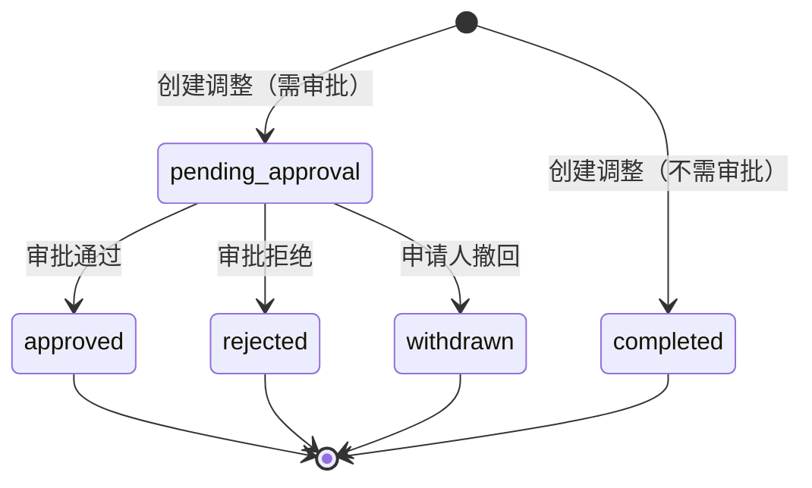

# 库存调整管理用户手册 (Inventory Adjustment Management User Manual)

<!-- DOC-WRITER: AUTO-GENERATED START -->
**功能标识**: P004-inventory-adjustment
**文档版本**: 1.0.0
**生成时间**: 2025-12-27
**所属系统**: 商品管理中台
**所属模块**: 库存管理 > 库存调整
**适用角色**: 库存管理员、运营总监

---

## 文档说明

本手册面向影院商品管理中台的库存管理人员和运营总监，提供库存调整管理功能的完整操作指南。阅读本手册后，您将能够独立完成库存调整录入、审批、流水查询和安全库存设置等日常操作。

**相关文档**:
- [功能规格说明](../../../specs/P004-inventory-adjustment/spec.md)
- [详细设计文档](../../detail-design/inventory/P004-inventory-adjustment.md)
- [业务概念澄清](../../../specs/P004-inventory-adjustment/business-clarification.md)

---

## 目录

1. [功能概述](#1-功能概述)
2. [核心业务概念](#2-核心业务概念)
3. [角色与权限](#3-角色与权限)
4. [操作指南](#4-操作指南)
   - 4.1 [库存调整录入](#41-库存调整录入)
   - 4.2 [查看库存流水](#42-查看库存流水)
   - 4.3 [大额调整审批](#43-大额调整审批)
   - 4.4 [编辑安全库存](#44-编辑安全库存)
5. [常见问题 FAQ](#5-常见问题-faq)
6. [注意事项与最佳实践](#6-注意事项与最佳实践)

---

## 1. 功能概述

### 1.1 功能定位

库存调整管理是影院商品管理中台的核心模块之一，用于处理日常运营中的库存盘点差异、货物损耗、报废等场景。通过本功能，您可以：

- ✅ **录入库存调整**：处理盘盈、盘亏、报损三种调整类型
- ✅ **查看流水记录**：追溯库存变动历史，审计合规
- ✅ **大额审批控制**：超过阈值的调整需运营总监审批，控制资产风险
- ✅ **安全库存设置**：自定义库存预警阈值，精准预警

### 1.2 核心特性

| 特性 | 说明 |
|------|------|
| **强制原因记录** | 所有调整必须填写原因，确保可追溯 |
| **二次确认机制** | 提交前展示调整前后库存对比，防止误操作 |
| **审批阈值保护** | 调整金额 ≥ 1000 元时自动触发审批流程 |
| **实时生效** | 调整通过后立即更新库存，安全库存修改 1 秒内生效 |
| **完整审计日志** | 所有操作记录到流水表，支持追溯 |

---

## 2. 核心业务概念

### 2.1 库存台账 vs 库存查询

在使用库存调整功能前，您需要理解两个核心业务概念：

#### 库存台账 (Inventory Ledger)

**定义**：特定位置特定 SKU 的**库存状态快照**，是库存管理系统的核心数据实体。

**核心指标**：

| 指标 | 英文 | 说明 |
|------|------|------|
| 现存数量 | OnHand Qty | 实际在仓库/门店中的商品数量 |
| 可用数量 | Available Qty | 现存数量 - 预占数量 |
| 预占数量 | Reserved Qty | 已被订单锁定但尚未出库的数量 |
| 在途数量 | In-Transit Qty | 已采购/调拨但尚未到货的数量 |
| 安全库存 | Safety Stock | 库存警戒线 |

**计算关系**：

```
可用数量 (Available) = 现存数量 (OnHand) - 预占数量 (Reserved)
```

#### 库存查询 (Inventory Query)

**定义**：基于库存台账数据的**查询视图**，提供多条件筛选和展示能力。

**核心区别**：

| 维度 | 库存台账 | 库存查询 |
|------|---------|---------|
| **本质** | 数据实体（Data Entity） | 查询视图（Query View） |
| **关系** | 底层数据源 | 上层展示层 |
| **操作能力** | 支持库存调整操作入口 | 侧重只读查询 |
| **前端路由** | `/inventory/ledger` | `/inventory/query` |

**简单理解**：
- **库存台账** = 库存数据的"原始账本"，包含所有指标和操作入口
- **库存查询** = 快速查看库存的"搜索窗口"，侧重高效检索

### 2.2 调整类型定义

| 调整类型 | 代码 | 库存影响 | 使用场景 | 流水类型 |
|---------|------|---------|---------|---------|
| **盘盈** | `surplus` | 增加现存库存 | 盘点发现实际数量多于系统记录 | `adjustment_in` |
| **盘亏** | `shortage` | 减少现存库存 | 盘点发现实际数量少于系统记录 | `adjustment_out` |
| **报损** | `damage` | 减少现存库存 | 货物损坏、过期报废 | `damage_out` |

**关键规则**：
- 调整数量始终为**正整数**，盘亏/报损通过类型区分，不使用负数
- 盘盈直接增加 `现存数量` 和 `可用数量`
- 盘亏/报损减少 `现存数量` 和 `可用数量`
- 所有调整必须确保调整后库存 ≥ 0（**负库存拦截**）

**示例**：

```
场景 1：盘点发现可口可乐多了 10 瓶
- 调整类型：盘盈
- 调整数量：10（正数）
- 库存影响：现存库存 +10，可用库存 +10

场景 2：发现冰红茶过期 5 瓶
- 调整类型：报损
- 调整数量：5（正数，不是 -5）
- 库存影响：现存库存 -5，可用库存 -5
```

### 2.3 审批业务规则

#### 审批触发条件

**阈值定义**：调整金额 = 调整数量 × SKU 单价 **≥ 1000 元**时触发审批

**计算示例**：

| 调整数量 | SKU 单价 | 调整金额 | 是否需要审批 |
|---------|---------|---------|-------------|
| 50 瓶 | 19.9 元 | 995 元 | ❌ 否（直接生效） |
| 51 瓶 | 19.9 元 | 1014.9 元 | ✅ 是（进入待审批） |
| 100 瓶 | 10 元 | 1000 元 | ✅ 是（刚好达到阈值） |

**规则细节**：
- 盘盈、盘亏、报损均参与金额计算
- 金额 **≥ 1000 元**时触发审批（**包含等于边界**）
- SKU 单价来源：SKU 主数据的 `unit_price` 字段

#### 审批状态流转



| 状态代码 | 状态名称 | 说明 | 允许操作 |
|---------|---------|------|---------|
| `pending_approval` | 待审批 | 已提交，等待审批 | 审批通过、审批拒绝、申请人撤回 |
| `approved` | 已审批通过 | 审批通过，库存已更新 | 无（终态） |
| `rejected` | 已拒绝 | 审批拒绝，库存未更新 | 无（终态） |
| `withdrawn` | 已撤回 | 申请人主动撤回 | 无（终态） |
| `completed` | 已完成 | 不需审批，直接完成 | 无（终态） |

### 2.4 库存预占与订单管理

#### 库存预占业务流程

```
┌─────────────────────────────────────────────────────────────────┐
│                        订单生命周期中的库存预占                    │
└─────────────────────────────────────────────────────────────────┘

      订单创建             支付成功             出品完成             退款/取消
         │                   │                   │                   │
         ▼                   ▼                   ▼                   ▼
    ┌─────────┐         ┌─────────┐         ┌─────────┐         ┌─────────┐
    │ 库存预占 │────────▶│ 预占保持 │────────▶│ 预占转扣减│         │ 预占释放 │
    │ +N      │         │         │         │ -N      │         │ -N      │
    └─────────┘         └─────────┘         └─────────┘         └─────────┘
         │                                       │                   │
         ▼                                       ▼                   ▼
    可用库存 -N                            现存库存 -N           可用库存 +N
```

#### 订单事件与库存操作

| 订单事件 | 库存操作 | 影响字段 | 说明 |
|---------|---------|---------|------|
| **订单创建** | 创建预占 | `reserved_qty += N` | 锁定库存，防止超卖 |
| **支付超时** | 释放预占 | `reserved_qty -= N` | 归还可用库存 |
| **用户取消** | 释放预占 | `reserved_qty -= N` | 归还可用库存 |
| **出品完成** | 预占→扣减 | `on_hand_qty -= N`, `reserved_qty -= N` | 实际出库 |
| **退款** | 库存回补 | `on_hand_qty += N` (视情况) | 根据商品状态决定 |

**注意**：当前系统暂未实现库存预占功能，该部分为业务概念说明，供后续扩展参考。

---

## 3. 角色与权限

### 3.1 角色定义

| 角色 | 权限范围 |
|------|---------|
| **库存管理员** | - 可录入调整（盘盈/盘亏/报损）<br>- 可查看流水记录<br>- 可编辑安全库存<br>- 可撤回待审批的调整（仅本人申请的）<br>- 可跨门店操作 |
| **运营总监** | - 可审批调整（通过/拒绝）<br>- 可查看所有调整记录<br>- 可查看审批历史 |
| **普通用户** | - 无权限访问库存调整功能 |

### 3.2 权限验证逻辑

**撤回权限验证**：
- ✅ 状态必须为"待审批"
- ✅ 申请人本人或系统管理员

**审批权限验证**：
- ✅ 角色为运营总监或系统管理员

---

## 4. 操作指南

### 4.1 库存调整录入

#### 4.1.1 操作步骤

**Step 1：进入库存详情页**

1. 在库存管理菜单中，点击"库存查询"或"库存台账"
2. 在库存列表中找到需要调整的 SKU
3. 点击 SKU 行的"详情"按钮或 SKU 名称，打开库存详情抽屉

**Step 2：打开调整录入弹窗**

1. 在库存详情抽屉中，点击"库存调整"按钮
2. 系统弹出"库存调整"对话框

**Step 3：填写调整信息**

| 字段 | 必填 | 说明 |
|-----|------|------|
| **调整类型** | 是 | 选择：盘盈（增加库存）、盘亏（减少库存）、报损（减少库存） |
| **调整数量** | 是 | 输入正整数（1-9999），系统实时显示调整后库存 |
| **调整原因** | 是 | 从下拉框选择：盘点差异、货物损坏、过期报废、入库错误、其他 |
| **原因说明** | 否 | 可选，补充说明调整原因（最大 500 字符） |
| **备注** | 否 | 可选，其他备注信息（最大 500 字符） |

**表单示例**：

```
┌────────────────────────────────────────┐
│      库存调整                            │
├────────────────────────────────────────┤
│ SKU: 可口可乐 330ml                     │
│ 门店: 北京朝阳影院                       │
│ 当前库存: 50                            │
│                                        │
│ 调整类型: [盘盈 ▼]                     │
│ 调整数量: [10        ]                 │
│                                        │
│ 库存变化预览:                           │
│   当前库存: 50                          │
│   调整后库存: 60 (+10)                  │
│   调整金额: ¥199.00                     │
│   ⚠️ 调整金额未达到审批阈值，将直接生效   │
│                                        │
│ 调整原因: [盘点差异 ▼] *必填            │
│ 原因说明: [_________________________]  │
│          (可选，最大 500 字符)          │
│ 备注:     [_________________________]  │
│          (可选，最大 500 字符)          │
│                                        │
│ [取消]              [提交]              │
└────────────────────────────────────────┘
```

**Step 4：查看实时计算**

系统会自动计算并显示：
- ✅ 调整后库存 = 当前库存 ± 调整数量
- ✅ 调整金额 = 调整数量 × SKU 单价
- ✅ 是否需要审批（金额 ≥ 1000 元时显示审批提示）

**示例 1：无需审批**

```
库存变化预览:
  当前库存: 50
  调整后库存: 60 (+10)
  调整金额: ¥199.00
  ✅ 调整金额未达到审批阈值，将直接生效
```

**示例 2：需要审批**

```
库存变化预览:
  当前库存: 100
  调整后库存: 150 (+50)
  调整金额: ¥1,995.00
  ⚠️ 调整金额超过审批阈值（¥1000），需运营总监审批
```

**Step 5：提交调整**

1. 点击"提交"按钮
2. 系统显示**二次确认对话框**，展示调整前后库存对比
3. 确认无误后，点击"确认调整"

**二次确认对话框**：

```
┌────────────────────────────────────────┐
│      确认库存调整                        │
├────────────────────────────────────────┤
│ SKU: 可口可乐 330ml                     │
│ 门店: 北京朝阳影院                       │
│ 调整类型: 盘盈                          │
│ 调整数量: +10                           │
│                                        │
│ 库存变化:                               │
│   调整前: 50                            │
│   调整后: 60 (+10)                      │
│                                        │
│ 调整原因: 盘点差异                       │
│                                        │
│ [取消]              [确认调整]          │
└────────────────────────────────────────┘
```

**Step 6：查看提交结果**

**情况 1：无需审批**
- ✅ 提示"调整成功"
- ✅ 库存立即更新
- ✅ 自动生成流水记录

**情况 2：需要审批**
- ⚠️ 提示"已提交，等待审批"
- ⏳ 调整记录进入"待审批"状态
- ⏳ 库存暂不更新，直到审批通过

#### 4.1.2 输入验证规则

| 验证项 | 规则 | 错误提示 |
|-------|------|---------|
| 调整数量 | 必须为正整数，范围 1-9999 | "调整数量必须为正整数" |
| 调整数量 | 不能为 0 | "调整数量不能为 0" |
| 调整后库存 | 不能为负数 | "调整后库存不能为负数（当前库存: X, 调整数量: Y）" |
| 调整原因 | 必填 | "请选择调整原因" |
| 原因说明 | 最大 500 字符 | "原因说明不能超过 500 字符" |
| 备注 | 最大 500 字符 | "备注不能超过 500 字符" |

#### 4.1.3 快捷操作提示

- 💡 **查看当前库存**：调整前请先在库存详情中确认当前库存数量
- 💡 **选择正确的调整类型**：盘盈用于增加库存，盘亏/报损用于减少库存
- 💡 **填写详细原因**：建议在"原因说明"中详细描述调整原因，便于后续追溯
- 💡 **注意审批阈值**：调整前可先计算调整金额，判断是否需要审批

---

### 4.2 查看库存流水

#### 4.2.1 操作步骤

**Step 1：打开流水列表**

1. 在库存详情抽屉中，点击"流水记录"标签页
2. 系统显示该 SKU 的所有库存变动记录

**Step 2：查看流水详情**

流水列表展示以下信息：

| 字段 | 说明 |
|-----|------|
| **变动时间** | 记录创建时间 |
| **变动类型** | 盘盈、盘亏、报损、采购入库、销售出库等 |
| **数量** | 变动数量（入库类绿色 +，出库类红色 -） |
| **变动前** | 操作前的库存数量 |
| **变动后** | 操作后的库存数量 |
| **操作人** | 执行调整的用户名 |

**流水列表示例**：

```
变动时间          变动类型      数量        变动前    变动后    操作人
━━━━━━━━━━━━━━━━━━━━━━━━━━━━━━━━━━━━━━━━━━━━━━━━━━━━━━━━━━
2025-12-27 10:30  盘盈         +10        50       60       张三
2025-12-27 09:15  报损         -5         55       50       李四
2025-12-26 18:00  盘亏         -3         58       55       王五
2025-12-26 14:20  采购入库     +100       -42      58       系统
```

**颜色标识规则**：
- ✅ **入库类变动**（盘盈、采购入库等）：绿色 `+` 号
- ❌ **出库类变动**（盘亏、报损、销售出库等）：红色 `-` 号

**Step 3：筛选流水记录**

支持以下筛选条件：
- 📅 **时间范围**：选择开始日期和结束日期
- 🏷️ **流水类型**：支持多选（盘盈、盘亏、报损、采购入库等）

**筛选操作**：
1. 点击"筛选"按钮
2. 选择时间范围和流水类型
3. 点击"确定"，列表自动刷新

#### 4.2.2 流水类型说明

| 流水类型代码 | 流水类型名称 | 说明 |
|------------|------------|------|
| `adjustment_in` | 盘盈 | 库存调整-盘盈 |
| `adjustment_out` | 盘亏 | 库存调整-盘亏 |
| `damage_out` | 报损 | 库存调整-报损 |
| `purchase_in` | 采购入库 | 采购订单入库 |
| `sale_out` | 销售出库 | 销售订单出库 |
| `transfer_in` | 调拨入库 | 门店间调拨入库 |
| `transfer_out` | 调拨出库 | 门店间调拨出库 |

#### 4.2.3 快捷操作提示

- 💡 **追溯异常变动**：当发现库存异常时，可通过流水记录快速定位具体操作时间和操作人
- 💡 **导出流水记录**：点击"导出"按钮可导出 Excel 文件（当前版本暂不支持，后续版本提供）
- 💡 **审计合规**：所有流水记录不可修改、不可删除，确保审计追溯

---

### 4.3 大额调整审批

#### 4.3.1 审批人操作步骤

**Step 1：进入待审批列表**

1. 在主菜单中，点击"库存管理" > "调整审批"
2. 系统显示所有待审批的调整记录列表

**待审批列表示例**：

```
调整单号          SKU          门店          调整类型  数量  金额      申请人  申请时间
━━━━━━━━━━━━━━━━━━━━━━━━━━━━━━━━━━━━━━━━━━━━━━━━━━━━━━━━━━━━━━━━━━━━━━━
ADJ20251227001  可口可乐 330ml  北京朝阳影院   盘盈    51   ¥1,014.90  张三   2025-12-27 10:00
ADJ20251227002  冰红茶 500ml   上海浦东影院   盘亏    100  ¥1,200.00  李四   2025-12-27 09:30
```

**Step 2：查看调整详情**

1. 点击待审批记录的"查看详情"按钮
2. 系统弹出"调整详情"对话框

**调整详情对话框**：

```
┌────────────────────────────────────────┐
│      调整详情                            │
├────────────────────────────────────────┤
│ 调整单号: ADJ20251227001                │
│ 状态: 待审批                            │
│                                        │
│ SKU 信息:                               │
│   SKU 名称: 可口可乐 330ml              │
│   SKU 单价: ¥19.90                      │
│   门店: 北京朝阳影院                     │
│                                        │
│ 调整信息:                               │
│   调整类型: 盘盈                        │
│   调整数量: 51 瓶                       │
│   调整金额: ¥1,014.90                   │
│                                        │
│ 库存变化:                               │
│   调整前: 100 瓶                        │
│   调整后: 151 瓶 (+51)                  │
│                                        │
│ 调整原因:                               │
│   原因: 盘点差异                        │
│   说明: 年度盘点发现实际库存多于系统记录  │
│                                        │
│ 申请人信息:                             │
│   申请人: 张三（库存管理员）             │
│   申请时间: 2025-12-27 10:00:00         │
│                                        │
│ 审批历史:                               │
│   暂无审批记录                          │
│                                        │
│ [关闭]     [拒绝]     [通过]            │
└────────────────────────────────────────┘
```

**Step 3：执行审批操作**

**操作 A：审批通过**

1. 点击"通过"按钮
2. （可选）填写审批意见（最大 1000 字符）
3. 点击"确认通过"

**系统执行**：
- ✅ 更新调整单状态为"已审批通过"
- ✅ 立即更新库存（现存数量、可用数量）
- ✅ 生成库存流水记录
- ✅ 记录审批历史（审批人、时间、意见）
- ✅ 发送通知给申请人（异步）

**操作 B：审批拒绝**

1. 点击"拒绝"按钮
2. **必填**：填写拒绝原因（最大 1000 字符）
3. 点击"确认拒绝"

**系统执行**：
- ❌ 更新调整单状态为"已拒绝"
- ❌ 库存保持不变
- ✅ 记录拒绝原因
- ✅ 记录审批历史
- ✅ 发送通知给申请人

**审批意见对话框**：

```
┌────────────────────────────────────────┐
│      审批通过                            │
├────────────────────────────────────────┤
│ 审批意见（可选）:                        │
│ ┌────────────────────────────────────┐ │
│ │ 已核实盘点数据，准予调整             │ │
│ │                                    │ │
│ │                                    │ │
│ └────────────────────────────────────┘ │
│ (最大 1000 字符)                        │
│                                        │
│ [取消]              [确认通过]          │
└────────────────────────────────────────┘
```

**Step 4：查看审批历史**

审批完成后，可在调整详情中查看完整的审批历史：

```
审批历史:
┌──────────────────────────────────────────────────────────┐
│ 时间: 2025-12-27 10:30:00                                │
│ 操作人: 王总（运营总监）                                   │
│ 操作: 审批通过                                            │
│ 状态变化: 待审批 → 已审批通过                              │
│ 审批意见: 已核实盘点数据，准予调整                         │
└──────────────────────────────────────────────────────────┘
```

#### 4.3.2 申请人撤回操作

**适用场景**：申请人发现调整信息填写错误，需要撤回待审批的调整

**撤回步骤**：

1. 进入"我的调整"列表
2. 找到状态为"待审批"的调整记录
3. 点击"撤回"按钮
4. 确认撤回操作

**系统执行**：
- ✅ 更新调整单状态为"已撤回"
- ✅ 库存保持不变
- ✅ 记录撤回操作

**撤回限制**：
- ❌ 仅申请人本人可撤回
- ❌ 仅"待审批"状态可撤回
- ❌ 已审批通过/拒绝的调整不可撤回

#### 4.3.3 快捷操作提示

- 💡 **审批前核实**：建议审批前联系申请人核实调整原因和数据
- 💡 **拒绝必须说明原因**：拒绝时必须填写拒绝原因，便于申请人理解
- 💡 **查看完整历史**：审批前可查看该 SKU 的流水记录，了解历史变动情况
- 💡 **及时审批**：待审批调整会阻塞库存更新，建议及时处理

---

### 4.4 编辑安全库存

#### 4.4.1 操作步骤

**Step 1：进入安全库存编辑**

1. 在库存详情抽屉中，找到"安全库存"字段
2. 点击"编辑"图标（铅笔图标）
3. 进入编辑模式

**Step 2：修改安全库存值**

1. 在输入框中输入新的安全库存值（非负整数，最大 99999）
2. 点击"保存"按钮

**安全库存编辑界面**：

```
┌────────────────────────────────────────┐
│      库存详情                            │
├────────────────────────────────────────┤
│ SKU: 可口可乐 330ml                     │
│ 门店: 北京朝阳影院                       │
│                                        │
│ 现存数量: 50                            │
│ 可用数量: 45                            │
│ 预占数量: 5                             │
│                                        │
│ 安全库存: [20        ] 🖊️  [保存]      │
│           ↑ 输入新值                    │
│                                        │
│ 库存状态: ⚠️ 偏低（可用库存 < 安全库存） │
└────────────────────────────────────────┘
```

**Step 3：查看生效结果**

保存后，系统立即生效：
- ✅ 安全库存值更新
- ✅ 库存状态标识根据新阈值重新计算（1 秒内完成）
- ✅ 库存列表中该 SKU 的状态标识同步更新

**库存状态计算规则**：

| 可用库存与安全库存关系 | 库存状态 | 颜色标识 |
|---------------------|---------|---------|
| 可用库存 < 安全库存 × 0.5 | 🔴 严重不足 | 红色 |
| 可用库存 < 安全库存 | 🟡 偏低 | 黄色 |
| 可用库存 ≥ 安全库存 | 🟢 正常 | 绿色 |

**示例**：

```
场景：某 SKU 可用库存 10 瓶

原安全库存: 5 瓶
- 计算: 10 ≥ 5 → 状态: 🟢 正常

修改安全库存为: 15 瓶
- 计算: 10 < 15 且 10 ≥ 15 × 0.5 → 状态: 🟡 偏低

修改安全库存为: 30 瓶
- 计算: 10 < 30 × 0.5 → 状态: 🔴 严重不足
```

#### 4.4.2 输入验证规则

| 验证项 | 规则 | 错误提示 |
|-------|------|---------|
| 安全库存 | 必须为非负整数 | "安全库存不能为负数" |
| 安全库存 | 范围 0-99999 | "安全库存不能超过 99999" |
| 并发编辑 | 乐观锁检测 | "该记录已被他人修改，请刷新后重试" |

#### 4.4.3 并发编辑处理

当多人同时编辑同一 SKU 的安全库存时：
- ⚠️ 系统使用**乐观锁**机制
- ⚠️ 后保存者会收到"已被他人修改"提示
- ✅ 建议：刷新页面后重新编辑

#### 4.4.4 快捷操作提示

- 💡 **根据实际情况设置**：安全库存应根据门店销量、补货周期合理设置
- 💡 **定期调整**：建议每季度根据销售数据调整安全库存阈值
- 💡 **批量设置**：当前版本仅支持单个 SKU 编辑，后续版本将支持批量设置
- 💡 **预警联动**：安全库存修改后，库存预警规则立即生效（后续版本提供推送通知）

---

## 5. 常见问题 FAQ

### 5.1 调整录入相关

**Q1：调整数量可以输入负数吗？**

A：不可以。调整数量始终为**正整数**。盘亏和报损通过选择"调整类型"区分，数量输入正数即可。

**示例**：
- ❌ 错误：盘亏 -10（不允许负数）
- ✅ 正确：选择"盘亏"，数量输入 10

---

**Q2：调整后库存为负数时可以提交吗？**

A：不可以。系统会自动检测，当调整后库存 < 0 时，阻止提交并提示"调整后库存不能为负数"。

**示例**：
- 当前库存：10 瓶
- 盘亏数量：15 瓶
- 系统提示：❌ "调整后库存不能为负数（当前库存: 10, 调整数量: 15）"

---

**Q3：调整原因是必填的吗？**

A：是的。所有库存调整**必须**填写调整原因，未填写时系统阻止提交。这是为了确保所有调整都有原因记录，便于后续追溯和分析。

---

**Q4：可以自定义调整原因吗？**

A：当前版本不支持。调整原因必须从预设的原因字典中选择（盘点差异、货物损坏、过期报废、入库错误、其他）。如有特殊原因，可选择"其他"并在"原因说明"中详细描述。

---

**Q5：提交调整后可以撤销吗？**

A：分两种情况：
- ✅ **待审批状态**：可以撤回（仅申请人本人）
- ❌ **已审批通过/已完成**：不可撤销，库存已更新

---

**Q6：二次确认对话框可以跳过吗？**

A：不可以。二次确认是强制流程，确保您充分了解调整影响，防止误操作。

---

### 5.2 审批相关

**Q7：审批阈值是多少？**

A：当前审批阈值为 **1000 元**。计算公式：

```
调整金额 = 调整数量 × SKU 单价

若 调整金额 ≥ 1000 元 → 触发审批
```

**示例**：
- 调整 50 瓶可口可乐（单价 19.9 元）：50 × 19.9 = 995 元 → ❌ 不需审批
- 调整 51 瓶可口可乐（单价 19.9 元）：51 × 19.9 = 1014.9 元 → ✅ 需要审批

---

**Q8：审批阈值可以修改吗？**

A：当前版本为硬编码 1000 元，不支持修改。后续版本将支持系统管理员配置阈值。

---

**Q9：待审批的调整可以继续录入新调整吗？**

A：可以。待审批调整不会阻塞您继续录入新的调整。

---

**Q10：审批拒绝后库存会变化吗？**

A：不会。审批拒绝后，库存保持不变，不生成流水记录。

---

**Q11：审批有时效限制吗？**

A：当前版本无时效限制。待审批调整可无限期等待审批，申请人可随时撤回。

---

**Q12：谁可以审批调整？**

A：仅**运营总监**和**系统管理员**角色可审批。

---

### 5.3 流水记录相关

**Q13：流水记录可以修改或删除吗？**

A：不可以。所有流水记录**不可修改、不可删除**，确保审计追溯。

---

**Q14：流水记录的绿色和红色数字代表什么？**

A：
- 🟢 **绿色 +**：入库类变动（盘盈、采购入库等）
- 🔴 **红色 -**：出库类变动（盘亏、报损、销售出库等）

---

**Q15：如何查看某段时间的流水记录？**

A：在流水列表中点击"筛选"，选择开始日期和结束日期，点击"确定"即可。

---

**Q16：流水记录可以导出吗？**

A：当前版本暂不支持导出。后续版本将提供 Excel 导出功能。

---

### 5.4 安全库存相关

**Q17：安全库存是什么？**

A：安全库存是**库存警戒线**。当可用库存低于安全库存时，系统会标记为"偏低"或"严重不足"，提醒您及时补货。

---

**Q18：安全库存修改后多久生效？**

A：立即生效（**1 秒内**）。修改保存后，库存列表中该 SKU 的状态标识会根据新阈值重新计算。

---

**Q19：如何设置合理的安全库存？**

A：建议参考以下因素：
- 📊 **日均销量**：安全库存 = 日均销量 × 补货周期（天）
- 🚚 **补货周期**：供应商配送时间
- 📈 **销售波动**：季节性商品需设置更高安全库存

**示例**：
- 某 SKU 日均销量 10 瓶，补货周期 3 天 → 建议安全库存：10 × 3 = 30 瓶

---

**Q20：安全库存为 0 会怎样？**

A：安全库存可以设置为 0。此时系统不会进行库存预警，适用于非常规商品或临时商品。

---

## 6. 注意事项与最佳实践

### 6.1 操作注意事项

#### 调整录入

- ⚠️ **调整前核实库存**：录入调整前，请先确认当前库存数量，避免因数据不准确导致调整错误
- ⚠️ **选择正确的调整类型**：盘盈用于增加库存，盘亏/报损用于减少库存，请勿混淆
- ⚠️ **填写详细原因**：建议在"原因说明"中详细描述调整原因，便于后续追溯和分析
- ⚠️ **注意审批阈值**：调整金额 ≥ 1000 元时会进入审批流程，请合理安排调整时间

#### 审批处理

- ⚠️ **审批前核实数据**：建议审批前联系申请人核实调整原因和数据
- ⚠️ **拒绝必须说明原因**：拒绝时必须填写拒绝原因，便于申请人理解和改进
- ⚠️ **及时审批**：待审批调整会阻塞库存更新，请及时处理审批请求

#### 流水查询

- ⚠️ **定期审查流水**：建议每月审查库存流水，排查异常变动
- ⚠️ **关注异常数据**：发现异常变动时，及时联系操作人核实

#### 安全库存设置

- ⚠️ **合理设置阈值**：安全库存应根据实际销量和补货周期合理设置
- ⚠️ **定期调整**：建议每季度根据销售数据调整安全库存阈值
- ⚠️ **避免频繁修改**：频繁修改安全库存可能导致库存状态频繁波动

### 6.2 最佳实践

#### 盘点与调整流程

1. **定期盘点**：建议每月进行一次全面盘点，每周对重点商品进行抽查盘点
2. **盘点记录**：盘点时记录实际库存数量和系统库存数量，计算差异
3. **及时录入**：盘点完成后及时录入调整，避免数据延迟
4. **差异分析**：对大额差异进行根因分析，改进库存管理流程

#### 调整原因规范

建议按以下规范选择调整原因：

| 调整类型 | 推荐原因 | 示例说明 |
|---------|---------|---------|
| 盘盈 | 盘点差异 | "年度盘点发现实际库存多于系统记录" |
| 盘亏 | 盘点差异 | "月度盘点发现实际库存少于系统记录" |
| 盘亏 | 入库错误 | "上次入库录入错误，实际未入库" |
| 报损 | 货物损坏 | "运输过程中包装破损，商品无法销售" |
| 报损 | 过期报废 | "商品已过保质期，按规定报废处理" |

#### 审批效率优化

1. **分级阈值**（后续版本）：建议设置多级审批阈值，如：
   - 1000-5000 元：部门主管审批
   - \> 5000 元：运营总监审批

2. **审批时效**（后续版本）：建议设置审批时效规则，如：
   - 24 小时未审批：自动提醒审批人
   - 7 天未审批：自动作废

#### 安全库存优化

1. **ABC 分类管理**：
   - **A 类商品**（高价值）：安全库存 = 日均销量 × 5 天
   - **B 类商品**（中价值）：安全库存 = 日均销量 × 3 天
   - **C 类商品**（低价值）：安全库存 = 日均销量 × 2 天

2. **季节性调整**：
   - 旺季：安全库存 × 1.5
   - 淡季：安全库存 × 0.8

3. **动态调整**：每季度根据实际销售数据调整安全库存阈值

### 6.3 数据质量保障

#### 库存数据准确性

- ✅ **定期盘点**：每月全面盘点，确保库存数据准确
- ✅ **二次确认**：所有调整提交前二次确认，防止误操作
- ✅ **审批控制**：大额调整通过审批控制，防止恶意操作
- ✅ **流水追溯**：所有变动记录流水，确保可追溯

#### 原因记录完整性

- ✅ **强制必填**：所有调整必须填写原因
- ✅ **详细说明**：建议在"原因说明"中详细描述
- ✅ **原因分类**：使用标准化原因字典，便于后续分析

#### 审批记录完整性

- ✅ **审批历史**：所有审批操作记录历史，不可修改
- ✅ **审批意见**：建议审批时填写详细意见
- ✅ **拒绝原因**：拒绝时必须填写原因，确保可追溯

### 6.4 常见错误与解决方案

| 常见错误 | 原因 | 解决方案 |
|---------|------|---------|
| 调整后库存为负 | 调整数量超过当前库存 | 减少调整数量或先补货后再调整 |
| 无法提交调整 | 未填写调整原因 | 从下拉框选择调整原因 |
| 并发编辑冲突 | 多人同时编辑同一 SKU | 刷新页面后重新编辑 |
| 审批权限不足 | 当前用户非运营总监 | 联系运营总监进行审批 |
| 无法撤回调整 | 调整已审批通过 | 已审批通过的调整不可撤回，如需修正请重新录入反向调整 |

### 6.5 系统限制说明

| 限制项 | 当前限制 | 后续规划 |
|-------|---------|---------|
| 批量调整 | 不支持 | 后续版本提供批量导入功能 |
| 调整模板 | 不支持 | 后续版本提供模板功能 |
| 审批层级 | 单级审批 | 后续版本支持多级审批 |
| 移动端审批 | 不支持 | 后续版本提供小程序审批 |
| 流水导出 | 不支持 | 后续版本提供 Excel 导出 |
| 原因字典管理 | 不支持前端管理 | 后续版本提供管理界面 |
| 审批时效 | 无时效限制 | 后续版本提供超时提醒和自动作废 |
| 审批阈值配置 | 硬编码 1000 元 | 后续版本支持系统管理员配置 |

---

<!-- DOC-WRITER: AUTO-GENERATED END -->

<!-- DOC-WRITER: USER-SECTION START -->
## 补充说明

本手册由 doc-writer skill 基于以下数据源自动生成：
- `specs/P004-inventory-adjustment/spec.md` - 功能规格说明
- `specs/P004-inventory-adjustment/business-clarification.md` - 业务概念澄清
- `docs/detail-design/inventory/P004-inventory-adjustment.md` - 详细设计文档

如需补充内容，请在此区域添加，增量更新时会保留此部分内容。
<!-- DOC-WRITER: USER-SECTION END -->

---

**文档维护信息**：
- 生成时间：2025-12-27
- 生成工具：doc-writer skill v2.1.0
- 目标用户：库存管理员、运营总监
- 更新策略：增量更新时保留 USER-SECTION 标记的内容
