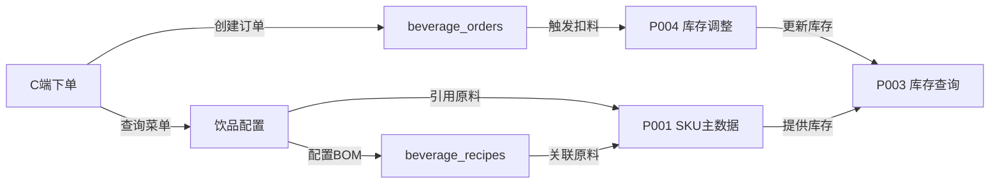
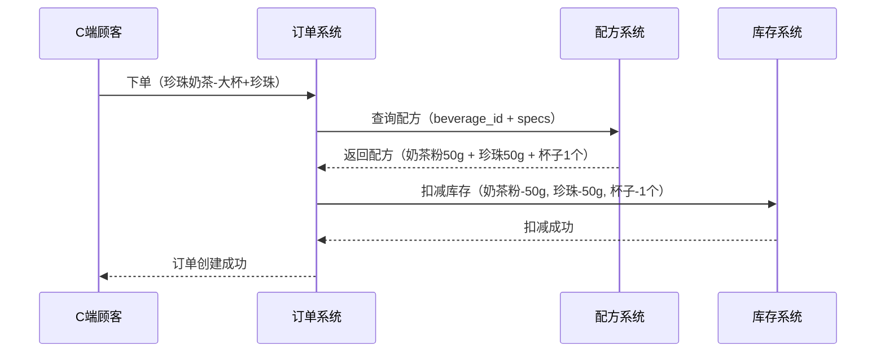
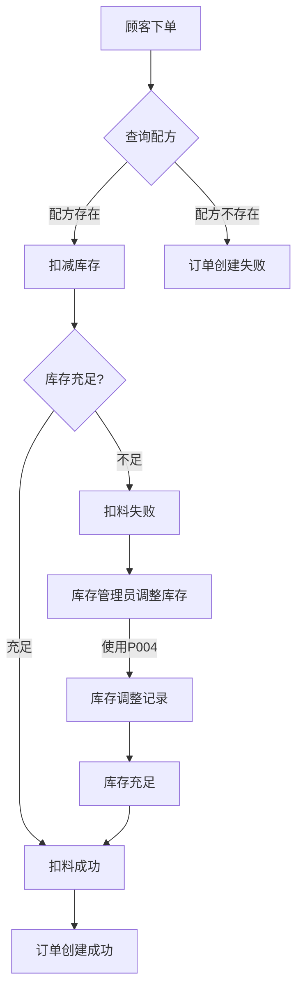

# 饮品上架配置操作手册 (Beverage Configuration User Manual)

<!-- DOC-WRITER: AUTO-GENERATED START -->
**功能标识**: O003-beverage-order
**文档版本**: 1.0.0
**生成时间**: 2025-12-28
**所属系统**: 商品管理中台
**所属模块**: 订单管理 > 饮品订单 > 饮品配置
**适用角色**: 商品管理员、运营人员、门店店长

---

## 文档说明

本手册面向影院商品管理中台的商品管理人员和运营人员，提供饮品上架配置功能的完整操作指南。阅读本手册后，您将能够独立完成饮品创建、规格配置、BOM配方设置、上架下架等日常操作。

**相关文档**:
- [功能规格说明](../../../specs/O003-beverage-order/spec.md) - 饮品订单功能需求与用户故事
- [技术设计文档](../../tdd/O003-beverage-order-tdd.md) - 系统架构与技术方案
- [API 接口文档](../../api/O003-beverage-order-api.md) - API 接口定义与调用示例
- [数据库设计](../../database/O003-beverage-order-db.md) - 数据表结构与关系
- [饮品订单管理手册](./O003-beverage-order-manual.md) - B端订单出品操作指南

**依赖功能模块**:
- [P001 SKU主数据管理](../../../specs/P001-sku-master-data/spec.md) - 原料/包材主数据维护
- [P002 单位换算](../../../specs/P002-unit-conversion/spec.md) - 原料单位转换规则
- [P003 库存查询](../../../specs/P003-inventory-query/spec.md) - 门店原料库存查询
- [P004 库存调整](../../../specs/P004-inventory-adjustment/spec.md) - BOM扣料后的库存调整

---

## 📋 目录

1. [功能概述](#1-功能概述)
2. [核心业务概念](#2-核心业务概念)
3. [适用人员与权限](#3-适用人员与权限)
4. [前置准备](#4-前置准备)
5. [操作指南](#5-操作指南)
   - [5.1 新增饮品](#51-新增饮品)
   - [5.2 配置饮品规格](#52-配置饮品规格)
   - [5.3 配置饮品配方(BOM)](#53-配置饮品配方bom)
   - [5.4 上架饮品](#54-上架饮品)
   - [5.5 下架饮品](#55-下架饮品)
   - [5.6 批量管理](#56-批量管理)
6. [常见问题 FAQ](#6-常见问题-faq)
7. [注意事项与最佳实践](#7-注意事项与最佳实践)
8. [错误处理](#8-错误处理)
9. [附录](#9-附录)

---

## 1. 功能概述

### 1.1 功能定位

饮品上架配置是影院商品管理中台的饮品订单模块的核心子功能，用于管理影院饮品菜单的完整生命周期。通过本功能，您可以：

- ✅ **饮品信息管理**：创建、编辑、删除饮品基本信息（名称、描述、价格、分类、图片）
- ✅ **规格配置**：为饮品配置可选规格（大小、温度、甜度、配料），每个规格可单独定价
- ✅ **配方管理(BOM)**：配置饮品制作配方，关联原料及用量，实现自动扣料
- ✅ **上架/下架管理**：控制饮品在C端小程序菜单中的显示状态

### 1.2 核心特性

| 特性 | 说明 |
|------|------|
| **多规格支持** | 支持 4 种规格类型（大小/温度/甜度/配料），每种可独立定价 |
| **BOM自动扣料** | 订单下单后自动根据配方扣减原料库存，无需人工干预 |
| **灵活定价策略** | 基础价格 + 规格价格调整，支持复杂定价场景 |
| **实时生效** | 饮品上架/下架立即在C端菜单中生效 |
| **图片管理** | 支持主图+详情图数组，使用 Supabase Storage 统一管理 |

### 1.3 业务价值

- ✅ **标准化流程**：规范饮品信息管理，减少人工失误
- ✅ **灵活配置**：支持多规格产品，满足个性化需求
- ✅ **成本透明**：通过 BOM 配方精确计算饮品成本
- ✅ **库存联动**：自动扣料机制，保证库存数据准确性
- ✅ **快速响应**：支持批量操作，快速调整菜单

### 1.4 系统架构位置

```
影院商品管理中台
└── 订单管理模块
    ├── 饮品订单 (O003-beverage-order)
    │   ├── C端：顾客下单（小程序菜单浏览与下单）
    │   ├── B端：订单出品（吧台接单与出品管理）
    │   └── 管理端：饮品配置 ⬅️ 本手册涵盖范围
    └── 预约订单 (U###)
```

**与其他模块的关系**：



---

## 2. 核心业务概念

### 2.1 饮品 vs 饮品规格 vs 饮品配方

在使用饮品配置功能前，您需要理解三个核心业务概念的关系：

#### 饮品 (Beverage)

**定义**：菜单中的饮品商品，是顾客可见的**销售单元**。

**核心属性**：

| 属性 | 说明 | 示例 |
|-----|------|------|
| 名称 | 饮品显示名称 | "美式咖啡" |
| 分类 | 饮品分类 | COFFEE（咖啡类） |
| 基础价格 | 标准规格的价格 | 15.00 元（中杯价格） |
| 状态 | 上架状态 | ACTIVE（已上架）/ INACTIVE（已下架） |

**数据表**：`beverages`

#### 饮品规格 (Beverage Spec)

**定义**：饮品的可选配置项，用于**个性化定制**。

**规格类型**：

| 类型 | 说明 | 典型选项 | 价格调整示例 |
|-----|------|---------|------------|
| SIZE | 大小/容量 | 小杯、中杯、大杯 | 大杯 +3元 |
| TEMPERATURE | 温度 | 热、常温、冰 | 通常 +0元 |
| SWEETNESS | 甜度 | 无糖、半糖、全糖 | 通常 +0元 |
| TOPPING | 配料 | 珍珠、椰果、奶盖 | 珍珠 +2元 |

**价格计算公式**：
```
最终价格 = 基础价格 + SIZE价格调整 + TOPPING价格调整
```

**示例**：
```
美式咖啡（中杯）: 15.00 元（基础价格）
美式咖啡（大杯）: 15.00 + 3.00 = 18.00 元
珍珠奶茶（大杯+珍珠）: 18.00 + 3.00 + 2.00 = 23.00 元
```

**数据表**：`beverage_specs`

#### 饮品配方 (Beverage Recipe / BOM)

**定义**：饮品制作所需的**原料清单**，用于自动扣减库存。

**核心组成**：
- **饮品ID**：关联的饮品
- **规格组合**（可选）：如 `{"SIZE": "LARGE", "TOPPING": "PEARL"}`
- **原料列表**：每种原料的 SKU ID 和用量

**BOM 扣料流程**：



**数据表**：`beverage_recipes`、`recipe_ingredients`

### 2.2 饮品配置 vs 订单出品

理解饮品配置与订单出品的区别：

| 维度 | 饮品配置 | 订单出品 |
|------|---------|---------|
| **本质** | 商品主数据管理 | 业务流程管理 |
| **操作人员** | 商品管理员、运营人员 | 吧台工作人员 |
| **操作频率** | 低频（新品上架、菜单调整） | 高频（每笔订单） |
| **核心目标** | 维护菜单数据准确性 | 完成订单制作与交付 |
| **数据表** | `beverages`, `beverage_specs`, `beverage_recipes` | `beverage_orders`, `beverage_order_items` |
| **前端路由** | `/admin/beverages` (MVP阶段无UI，仅API) | `/admin/beverage-orders` |
| **操作手册** | 本文档 | [饮品订单管理手册](./O003-beverage-order-manual.md) |

### 2.3 饮品配方 vs SKU主数据

饮品配方依赖 SKU 主数据，理解两者关系至关重要：

#### SKU 主数据 (P001)

**定义**：系统中所有物料的主档案，包括原料、包材、成品。

**典型 SKU 类型**：

| SKU类型 | 说明 | 用途 | 示例 |
|--------|------|------|------|
| 原料 (RAW_MATERIAL) | 制作饮品的原材料 | BOM组件 | 咖啡豆、奶茶粉、糖浆 |
| 包材 (PACKAGING) | 包装材料 | BOM组件 | 杯子、吸管、杯盖 |
| 成品 (FINISHED_GOOD) | 售卖给顾客的产品 | 关联饮品 | 美式咖啡（成品） |

**重要提示**：
- ✅ 配置饮品配方前，必须先在 [P001 SKU主数据管理](../../../specs/P001-sku-master-data/spec.md) 中创建所需的原料和包材 SKU
- ✅ 原料 SKU 的单位（如 g、ml、个）必须与配方中的用量单位一致
- ✅ 如需单位转换（如 kg → g），参考 [P002 单位换算](../../../specs/P002-unit-conversion/spec.md)

#### 配方关联示例

**场景**：配置"珍珠奶茶（大杯+珍珠）"的配方

**前置条件**：SKU 主数据已录入
```
sku-001: 奶茶粉（单位：g）
sku-002: 珍珠（单位：g）
sku-003: 大杯（单位：个）
```

**配方配置**：
```json
{
  "beverageId": "bev-001",
  "recipeName": "珍珠奶茶-大杯+珍珠配方",
  "specCombination": {
    "SIZE": "LARGE",
    "TOPPING": "PEARL"
  },
  "ingredients": [
    {"skuId": "sku-001", "quantity": 50, "unit": "g"},
    {"skuId": "sku-002", "quantity": 50, "unit": "g"},
    {"skuId": "sku-003", "quantity": 1, "unit": "个"}
  ]
}
```

---

## 3. 适用人员与权限

### 适用角色

| 角色 | 权限范围 | 典型操作 |
|-----|---------|---------|
| **商品管理员** | 完整CRUD权限 | 新增饮品、配置规格、管理配方、上架下架 |
| **运营人员** | 查看+编辑权限 | 调整价格、修改描述、临时下架 |
| **门店店长** | 仅查看权限 | 查看菜单配置、确认库存关联 |

### 权限说明

> ⚠️ **MVP 阶段特别说明**
> 当前 MVP 阶段，B端管理后台**无需登录**即可访问（Mock认证）。系统假设在内网或受信任环境中使用。
> Phase 2 版本将实现完整的工作人员账号体系和基于角色的权限管理。

---

## 前置准备

### 1. 系统准备

- [ ] 确认已部署 Spring Boot 后端服务（端口 8080）
- [ ] 确认 Supabase 数据库连接正常
- [ ] 准备 API 调试工具（Postman / Insomnia / curl）

### 2. 数据准备

- [ ] **原料库存数据**：确保 `skus` 表中已录入原料主数据（咖啡豆、牛奶、糖浆等）
- [ ] **门店库存数据**：确保 `store_inventory` 表中有对应门店的库存记录
- [ ] **图片资源**：准备饮品主图和详情图（推荐尺寸 750x750px，格式 JPG/PNG）

### 3. 了解数据模型

需要熟悉以下 3 张核心表：

| 表名 | 用途 | 关键字段 |
|-----|------|---------|
| `beverages` | 饮品主表 | id, name, category, base_price, status |
| `beverage_specs` | 饮品规格 | beverage_id, spec_type, spec_name, price_adjustment |
| `beverage_recipes` | 饮品配方 | beverage_id, spec_combination, ingredients |

---

## 5. 操作指南

### 5.1 新增饮品

#### 步骤 1：准备饮品基本信息

收集以下信息：
- **名称**：饮品中文名称（如：美式咖啡）
- **分类**：从以下选项中选择
  - `COFFEE` - 咖啡类
  - `TEA` - 茶饮类
  - `JUICE` - 果汁类
  - `SMOOTHIE` - 冰沙类
  - `MILK_TEA` - 奶茶类
  - `OTHER` - 其他
- **基础价格**：标准规格的价格（单位：元）
- **描述**：饮品详细描述（可选，建议50-200字）
- **主图URL**：上传到 Supabase Storage 后的图片链接
- **营养信息**：卡路里、糖分等（可选）

#### 步骤 2：上传图片到 Supabase Storage

```bash
# 1. 登录 Supabase Studio (https://supabase.com/dashboard)
# 2. 进入 Storage → 创建 bucket "beverages" (如不存在)
# 3. 上传图片文件
# 4. 复制图片的公开URL
```

**图片要求**：
- 主图尺寸：750x750px 或 1:1 比例
- 详情图尺寸：750x1000px 或 3:4 比例
- 格式：JPG 或 PNG
- 大小：< 500KB（推荐压缩）

#### 步骤 3：调用创建饮品 API

**接口信息**：
- **URL**: `POST /api/admin/beverages`
- **认证**: 无需认证（MVP阶段）
- **Content-Type**: `application/json`

**请求示例**：

```json
{
  "name": "美式咖啡",
  "description": "经典美式咖啡，浓郁香醇，选用优质咖啡豆现磨",
  "category": "COFFEE",
  "basePrice": 15.00,
  "imageUrl": "https://fxhgyxceqrmnpezluaht.supabase.co/storage/v1/object/public/beverages/americano.jpg",
  "detailImages": [
    "https://fxhgyxceqrmnpezluaht.supabase.co/storage/v1/object/public/beverages/americano-detail-1.jpg",
    "https://fxhgyxceqrmnpezluaht.supabase.co/storage/v1/object/public/beverages/americano-detail-2.jpg"
  ],
  "nutritionInfo": {
    "calories": 10,
    "sugar": "0g",
    "caffeine": "150mg"
  },
  "isRecommended": true,
  "sortOrder": 100
}
```

**字段说明**：

| 字段 | 必填 | 类型 | 说明 |
|-----|-----|------|------|
| name | 是 | String | 饮品名称，最长100字符 |
| description | 否 | String | 饮品描述 |
| category | 是 | Enum | 分类（COFFEE/TEA/JUICE/SMOOTHIE/MILK_TEA/OTHER） |
| basePrice | 是 | Decimal | 基础价格，必须 ≥ 0 |
| imageUrl | 否 | String | 主图URL |
| detailImages | 否 | Array | 详情图数组 |
| nutritionInfo | 否 | JSON | 营养信息 |
| isRecommended | 否 | Boolean | 是否推荐，默认false |
| sortOrder | 否 | Integer | 排序权重，默认0，数字越大越靠前 |

**成功响应示例**：

```json
{
  "success": true,
  "data": {
    "id": "550e8400-e29b-41d4-a716-446655440000",
    "name": "美式咖啡",
    "description": "经典美式咖啡，浓郁香醇，选用优质咖啡豆现磨",
    "category": "COFFEE",
    "basePrice": 15.00,
    "imageUrl": "https://fxhgyxceqrmnpezluaht.supabase.co/storage/v1/object/public/beverages/americano.jpg",
    "status": "ACTIVE",
    "isRecommended": true,
    "sortOrder": 100,
    "createdAt": "2025-12-28T10:00:00Z",
    "updatedAt": "2025-12-28T10:00:00Z"
  },
  "message": "饮品创建成功",
  "timestamp": "2025-12-28T10:00:00Z"
}
```

**保存返回的 `id` 字段**，后续配置规格和配方时需要使用。

#### 步骤 4：验证创建结果

通过 C端 API 验证饮品是否已创建成功：

```bash
curl -X GET "http://localhost:8080/api/client/beverages?category=COFFEE"
```

确认返回的列表中包含新创建的饮品。

---

### 5.2 配置饮品规格

饮品创建后，需要配置可选规格。每种饮品可以配置 4 种类型的规格：

| 规格类型 | 说明 | 示例 |
|---------|------|------|
| `SIZE` | 大小/容量 | 小杯、中杯、大杯 |
| `TEMPERATURE` | 温度 | 热、常温、冰 |
| `SWEETNESS` | 甜度 | 无糖、三分糖、半糖、全糖 |
| `TOPPING` | 配料/加料 | 珍珠、椰果、布丁、奶盖 |

#### 步骤 1：规划规格组合

以"珍珠奶茶"为例，规划如下规格：

**SIZE（大小）**：
- 中杯（500ml）：+0 元（基准价格）
- 大杯（700ml）：+3 元

**TEMPERATURE（温度）**：
- 热：+0 元
- 常温：+0 元
- 冰：+0 元

**SWEETNESS（甜度）**：
- 无糖：+0 元
- 三分糖：+0 元
- 半糖：+0 元
- 全糖：+0 元

**TOPPING（配料）**：
- 珍珠：+2 元
- 椰果：+2 元
- 布丁：+3 元
- 奶盖：+5 元

#### 步骤 2：调用添加规格 API

**接口信息**：
- **URL**: `POST /api/admin/beverage-specs`
- **认证**: 无需认证（MVP阶段）

**请求示例**（添加"大杯"规格）：

```json
{
  "beverageId": "550e8400-e29b-41d4-a716-446655440000",
  "specType": "SIZE",
  "specName": "大杯",
  "specCode": "LARGE",
  "priceAdjustment": 3.00,
  "isDefault": false,
  "sortOrder": 2
}
```

**字段说明**：

| 字段 | 必填 | 类型 | 说明 |
|-----|-----|------|------|
| beverageId | 是 | UUID | 饮品ID（来自步骤4.1的返回值） |
| specType | 是 | Enum | 规格类型（SIZE/TEMPERATURE/SWEETNESS/TOPPING） |
| specName | 是 | String | 规格名称（显示给用户的文本） |
| specCode | 否 | String | 规格代码（用于配方匹配，如LARGE、MEDIUM、SMALL） |
| priceAdjustment | 否 | Decimal | 价格调整（正数加价，负数减价），默认0 |
| isDefault | 否 | Boolean | 是否默认选中，默认false |
| sortOrder | 否 | Integer | 排序权重，默认0 |

#### 步骤 3：批量添加所有规格

建议使用脚本批量添加。示例 bash 脚本：

```bash
#!/bin/bash
BEVERAGE_ID="550e8400-e29b-41d4-a716-446655440000"
API_URL="http://localhost:8080/api/admin/beverage-specs"

# SIZE 规格
curl -X POST "$API_URL" -H "Content-Type: application/json" -d '{
  "beverageId": "'$BEVERAGE_ID'",
  "specType": "SIZE",
  "specName": "中杯",
  "specCode": "MEDIUM",
  "priceAdjustment": 0,
  "isDefault": true,
  "sortOrder": 1
}'

curl -X POST "$API_URL" -H "Content-Type: application/json" -d '{
  "beverageId": "'$BEVERAGE_ID'",
  "specType": "SIZE",
  "specName": "大杯",
  "specCode": "LARGE",
  "priceAdjustment": 3.00,
  "isDefault": false,
  "sortOrder": 2
}'

# TEMPERATURE 规格
curl -X POST "$API_URL" -H "Content-Type: application/json" -d '{
  "beverageId": "'$BEVERAGE_ID'",
  "specType": "TEMPERATURE",
  "specName": "热",
  "specCode": "HOT",
  "priceAdjustment": 0,
  "isDefault": true,
  "sortOrder": 1
}'

curl -X POST "$API_URL" -H "Content-Type: application/json" -d '{
  "beverageId": "'$BEVERAGE_ID'",
  "specType": "TEMPERATURE",
  "specName": "冰",
  "specCode": "ICED",
  "priceAdjustment": 0,
  "isDefault": false,
  "sortOrder": 2
}'

# SWEETNESS 规格
curl -X POST "$API_URL" -H "Content-Type: application/json" -d '{
  "beverageId": "'$BEVERAGE_ID'",
  "specType": "SWEETNESS",
  "specName": "半糖",
  "specCode": "HALF_SUGAR",
  "priceAdjustment": 0,
  "isDefault": true,
  "sortOrder": 1
}'

# TOPPING 规格
curl -X POST "$API_URL" -H "Content-Type: application/json" -d '{
  "beverageId": "'$BEVERAGE_ID'",
  "specType": "TOPPING",
  "specName": "珍珠",
  "specCode": "PEARL",
  "priceAdjustment": 2.00,
  "isDefault": false,
  "sortOrder": 1
}'
```

#### 步骤 4：验证规格配置

通过饮品详情 API 验证规格是否配置成功：

```bash
curl -X GET "http://localhost:8080/api/client/beverages/550e8400-e29b-41d4-a716-446655440000"
```

返回示例中应包含 `specs` 字段，包含所有已配置的规格。

---

### 5.3 配置饮品配方(BOM)

配方管理用于定义饮品制作所需的原料及用量，实现订单下单后自动扣减库存。

#### 步骤 1：了解配方结构

一个饮品可以有多个配方，每个配方对应特定的规格组合：
- **基础配方**：适用于所有规格组合
- **特定规格配方**：如"大杯+珍珠"的配方与"中杯+椰果"不同

配方由以下部分组成：
- **饮品ID**：关联的饮品
- **规格组合**（可选）：如 `{"SIZE": "LARGE", "TOPPING": "PEARL"}`
- **原料列表**：每种原料的 SKU ID 和用量

#### 步骤 2：准备原料主数据

确保 `skus` 表中已录入所需原料：

```sql
-- 示例：查询现有原料
SELECT id, sku_code, name, unit
FROM skus
WHERE name LIKE '%咖啡%' OR name LIKE '%牛奶%' OR name LIKE '%糖%';
```

**典型原料示例**：

| SKU ID | SKU Code | Name | Unit |
|--------|----------|------|------|
| sku-001 | COFFEE_BEAN_001 | 咖啡豆（阿拉比卡） | g |
| sku-002 | MILK_001 | 全脂牛奶 | ml |
| sku-003 | SUGAR_SYRUP_001 | 糖浆 | ml |
| sku-004 | PEARL_001 | 珍珠 | g |

#### 步骤 3：配置基础配方

以"美式咖啡（中杯）"为例：

**接口信息**：
- **URL**: `POST /api/admin/beverage-recipes`
- **认证**: 无需认证（MVP阶段）

**请求示例**：

```json
{
  "beverageId": "550e8400-e29b-41d4-a716-446655440000",
  "recipeName": "美式咖啡-中杯基础配方",
  "specCombination": {
    "SIZE": "MEDIUM"
  },
  "ingredients": [
    {
      "skuId": "sku-001",
      "quantity": 20,
      "unit": "g",
      "notes": "咖啡豆研磨"
    },
    {
      "skuId": "sku-002",
      "quantity": 200,
      "unit": "ml",
      "notes": "热水"
    }
  ],
  "instructions": "1. 研磨20g咖啡豆\n2. 萃取浓缩咖啡\n3. 加入200ml热水稀释",
  "isActive": true
}
```

**字段说明**：

| 字段 | 必填 | 类型 | 说明 |
|-----|-----|------|------|
| beverageId | 是 | UUID | 饮品ID |
| recipeName | 是 | String | 配方名称（便于管理识别） |
| specCombination | 否 | JSON | 规格组合（不填则为通用配方） |
| ingredients | 是 | Array | 原料列表 |
| ingredients[].skuId | 是 | String | 原料SKU ID |
| ingredients[].quantity | 是 | Decimal | 用量（数值） |
| ingredients[].unit | 是 | String | 单位（g/ml/个） |
| ingredients[].notes | 否 | String | 备注说明 |
| instructions | 否 | String | 制作步骤（可选） |
| isActive | 否 | Boolean | 是否启用，默认true |

#### 步骤 4：配置规格组合配方

如果不同规格用量不同，需要分别配置：

**大杯配方**（用量增加）：

```json
{
  "beverageId": "550e8400-e29b-41d4-a716-446655440000",
  "recipeName": "美式咖啡-大杯配方",
  "specCombination": {
    "SIZE": "LARGE"
  },
  "ingredients": [
    {
      "skuId": "sku-001",
      "quantity": 25,
      "unit": "g"
    },
    {
      "skuId": "sku-002",
      "quantity": 300,
      "unit": "ml"
    }
  ],
  "isActive": true
}
```

**加珍珠配方**（额外添加珍珠原料）：

```json
{
  "beverageId": "660e8400-e29b-41d4-a716-446655440001",
  "recipeName": "珍珠奶茶-加珍珠配方",
  "specCombination": {
    "TOPPING": "PEARL"
  },
  "ingredients": [
    {
      "skuId": "sku-004",
      "quantity": 50,
      "unit": "g",
      "notes": "煮熟的珍珠"
    }
  ],
  "isActive": true
}
```

#### 步骤 5：验证配方配置

配方配置后，可以通过以下方式验证：

1. **数据库查询**：
```sql
SELECT r.*, ri.sku_id, ri.quantity, ri.unit, s.name AS ingredient_name
FROM beverage_recipes r
LEFT JOIN recipe_ingredients ri ON r.id = ri.recipe_id
LEFT JOIN skus s ON ri.sku_id = s.id
WHERE r.beverage_id = '550e8400-e29b-41d4-a716-446655440000';
```

2. **模拟下单测试**：
   - 在C端创建订单
   - 观察 `store_inventory` 表，确认库存已自动扣减
   - 查看 `inventory_adjustments` 表，确认生成了扣料记录

---

### 5.4 上架饮品

饮品创建后，默认状态为 `ACTIVE`（已上架），会自动在C端菜单中显示。

#### 验证上架状态

通过C端 API 查询验证：

```bash
curl -X GET "http://localhost:8080/api/client/beverages?category=COFFEE"
```

返回列表中应包含新上架的饮品。

#### 修改上架状态

如果需要修改饮品为上架状态（之前被下架）：

**接口信息**：
- **URL**: `PUT /api/admin/beverages/{id}`

**请求示例**：

```json
{
  "status": "ACTIVE"
}
```

---

### 5.5 下架饮品

#### 场景说明

以下情况需要下架饮品：
- 季节性饮品到期（如冬季热饮、夏季冰饮）
- 原料缺货无法制作
- 菜单调整，移除低销量产品
- 临时促销活动结束

#### 下架操作（软删除）

**接口信息**：
- **URL**: `DELETE /api/admin/beverages/{id}`
- **说明**: 软删除，不删除数据库记录，只将 `status` 改为 `INACTIVE`

**请求示例**：

```bash
curl -X DELETE "http://localhost:8080/api/admin/beverages/550e8400-e29b-41d4-a716-446655440000"
```

**成功响应**：

```
HTTP/1.1 204 No Content
```

#### 验证下架结果

1. **C端菜单不再显示**：
```bash
curl -X GET "http://localhost:8080/api/client/beverages"
# 返回的列表中不包含已下架的饮品
```

2. **已存在订单不受影响**：
   - 历史订单中仍可查看已下架饮品的订单详情
   - 订单报表统计仍包含已下架饮品

---

### 5.6 批量管理

#### 批量上架

使用脚本批量将多个饮品设置为上架状态：

```bash
#!/bin/bash
BEVERAGE_IDS=("id1" "id2" "id3")

for id in "${BEVERAGE_IDS[@]}"; do
  curl -X PUT "http://localhost:8080/api/admin/beverages/$id" \
    -H "Content-Type: application/json" \
    -d '{"status": "ACTIVE"}'
  echo "Activated beverage: $id"
done
```

#### 批量下架

```bash
#!/bin/bash
BEVERAGE_IDS=("id1" "id2" "id3")

for id in "${BEVERAGE_IDS[@]}"; do
  curl -X DELETE "http://localhost:8080/api/admin/beverages/$id"
  echo "Deactivated beverage: $id"
done
```

#### 批量修改排序

```bash
#!/bin/bash
# 调整咖啡类饮品的排序权重

curl -X PUT "http://localhost:8080/api/admin/beverages/id-americano" \
  -H "Content-Type: application/json" \
  -d '{"sortOrder": 100}'

curl -X PUT "http://localhost:8080/api/admin/beverages/id-latte" \
  -H "Content-Type: application/json" \
  -d '{"sortOrder": 90}'

curl -X PUT "http://localhost:8080/api/admin/beverages/id-cappuccino" \
  -H "Content-Type: application/json" \
  -d '{"sortOrder": 80}'
```

---

## 6. 常见问题 FAQ

### Q1: 饮品创建成功，但C端菜单看不到？

**可能原因**：
1. `status` 字段不是 `ACTIVE`
2. 数据库主从复制延迟（Supabase通常无此问题）
3. C端缓存未刷新

**解决方案**：
```bash
# 1. 检查饮品状态
curl -X GET "http://localhost:8080/api/admin/beverages/{id}"

# 2. 如果 status 是 INACTIVE，改为 ACTIVE
curl -X PUT "http://localhost:8080/api/admin/beverages/{id}" \
  -H "Content-Type: application/json" \
  -d '{"status": "ACTIVE"}'

# 3. 清除C端缓存（如有）
```

### Q2: 如何修改已上架饮品的价格？

**操作步骤**：
```bash
curl -X PUT "http://localhost:8080/api/admin/beverages/{id}" \
  -H "Content-Type: application/json" \
  -d '{"basePrice": 18.00}'
```

**注意**：
- 价格修改**立即生效**，新订单使用新价格
- 已存在订单不受影响，仍按下单时的价格
- 如果修改规格价格调整，需调用规格更新 API

### Q3: 下架后能否重新上架？

**可以**。下架是软删除，数据仍保留。重新上架操作：

```bash
curl -X PUT "http://localhost:8080/api/admin/beverages/{id}" \
  -H "Content-Type: application/json" \
  -d '{"status": "ACTIVE"}'
```

### Q4: 配方配置错误，如何修改？

**MVP 阶段暂不支持配方修改 API**。临时解决方案：

1. **方案 A：直接修改数据库**（推荐测试环境）
```sql
UPDATE recipe_ingredients
SET quantity = 30
WHERE recipe_id = 'xxx' AND sku_id = 'sku-001';
```

2. **方案 B：删除重建**（推荐生产环境）
```sql
-- 删除旧配方
DELETE FROM beverage_recipes WHERE id = 'recipe-id';

-- 重新调用 POST /api/admin/beverage-recipes 创建新配方
```

### Q5: BOM 扣料失败，如何排查？

**排查步骤**：

1. **检查配方是否存在**：
```sql
SELECT * FROM beverage_recipes WHERE beverage_id = 'xxx';
```

2. **检查原料库存是否充足**：
```sql
SELECT si.*, s.name
FROM store_inventory si
JOIN skus s ON si.sku_id = s.id
WHERE si.store_id = 'store-xxx'
  AND si.sku_id IN ('sku-001', 'sku-002');
```

3. **查看扣料日志**（后端日志）：
```bash
tail -f /var/log/cinema-backend/application.log | grep "BOM扣料"
```

4. **查看库存调整记录**：
```sql
SELECT * FROM inventory_adjustments
WHERE adjustment_type = 'BOM_DEDUCTION'
ORDER BY created_at DESC
LIMIT 10;
```

### Q6: 如何批量导入饮品数据？

**推荐使用 SQL 脚本批量插入**：

```sql
-- 1. 插入饮品主表
INSERT INTO beverages (id, name, category, base_price, status, created_at, updated_at)
VALUES
  (gen_random_uuid(), '拿铁咖啡', 'COFFEE', 18.00, 'ACTIVE', NOW(), NOW()),
  (gen_random_uuid(), '卡布奇诺', 'COFFEE', 20.00, 'ACTIVE', NOW(), NOW()),
  (gen_random_uuid(), '摩卡咖啡', 'COFFEE', 22.00, 'ACTIVE', NOW(), NOW());

-- 2. 批量插入规格（需先获取 beverage_id）
INSERT INTO beverage_specs (id, beverage_id, spec_type, spec_name, price_adjustment, created_at)
SELECT
  gen_random_uuid(),
  b.id,
  'SIZE',
  unnest(ARRAY['中杯', '大杯']),
  unnest(ARRAY[0, 3]::decimal[]),
  NOW()
FROM beverages b
WHERE b.category = 'COFFEE';
```

**或者使用 API 批量导入脚本**（Python示例）：

```python
import requests
import json

beverages = [
    {"name": "拿铁咖啡", "category": "COFFEE", "basePrice": 18.00},
    {"name": "卡布奇诺", "category": "COFFEE", "basePrice": 20.00},
    {"name": "摩卡咖啡", "category": "COFFEE", "basePrice": 22.00},
]

for bev in beverages:
    response = requests.post(
        "http://localhost:8080/api/admin/beverages",
        json=bev,
        headers={"Content-Type": "application/json"}
    )
    print(f"Created: {bev['name']} - Status: {response.status_code}")
```

---

## 7. 注意事项与最佳实践

### 7.1 与SKU主数据的协同

#### ⚠️ 配方配置前的SKU检查清单

在配置饮品配方前，务必确认以下事项：

1. **原料SKU已录入** ([P001 SKU主数据管理](../../../specs/P001-sku-master-data/spec.md))
   ```sql
   -- 检查原料SKU是否存在
   SELECT id, sku_code, name, unit, sku_type
   FROM skus
   WHERE sku_type IN ('RAW_MATERIAL', 'PACKAGING')
     AND status = 'ACTIVE';
   ```

2. **单位一致性**
   - 配方中的用量单位必须与SKU主数据中的单位一致
   - 示例：如果咖啡豆SKU单位是"g"，配方中的用量也必须是"g"
   - **错误示例**：SKU单位"kg"，配方用量"500g" ❌
   - **正确做法**：使用 [P002 单位换算](../../../specs/P002-unit-conversion/spec.md) 配置转换规则

3. **库存充足性检查** ([P003 库存查询](../../../specs/P003-inventory-query/spec.md))
   ```sql
   -- 检查门店原料库存
   SELECT si.*, s.name, s.unit
   FROM store_inventory si
   JOIN skus s ON si.sku_id = s.id
   WHERE si.store_id = 'store-xxx'
     AND si.sku_id IN ('sku-001', 'sku-002')
     AND si.quantity > 0;
   ```

4. **配方测试流程**
   - **步骤1**：在测试环境配置配方
   - **步骤2**：创建测试订单，观察扣料日志
   - **步骤3**：检查 `inventory_adjustments` 表，验证扣料记录
   - **步骤4**：确认生产环境上线

#### 最佳实践：配方版本管理

```sql
-- 为配方添加版本号（使用 recipe_name 字段）
INSERT INTO beverage_recipes (beverage_id, recipe_name, ...)
VALUES ('bev-001', '美式咖啡-v1.0-中杯', ...);

-- 更新配方时创建新版本（保留历史版本用于审计）
INSERT INTO beverage_recipes (beverage_id, recipe_name, is_active, ...)
VALUES ('bev-001', '美式咖啡-v1.1-中杯', true, ...);

UPDATE beverage_recipes
SET is_active = false
WHERE beverage_id = 'bev-001'
  AND recipe_name = '美式咖啡-v1.0-中杯';
```

### 7.2 库存调整与BOM扣料的协同

#### BOM扣料失败的常见原因

| 原因 | 错误信息 | 解决方案 | 相关文档 |
|-----|---------|---------|---------|
| SKU不存在 | `BEV_NTF_001: SKU未找到` | 在 P001 中创建 SKU | [P001 SKU主数据](../../../specs/P001-sku-master-data/spec.md) |
| 单位不匹配 | `BEV_VAL_003: 单位不一致` | 使用 P002 配置单位转换 | [P002 单位换算](../../../specs/P002-unit-conversion/spec.md) |
| 库存不足 | `INV_VAL_001: 库存不足` | 通过 P004 调整库存 | [P004 库存调整](../../../specs/P004-inventory-adjustment/spec.md) |
| 配方未配置 | `BEV_NTF_002: 配方未找到` | 本文档 5.3 节配置配方 | - |

#### 库存调整与扣料的关系



**最佳实践**：
- ✅ 定期通过 [P003 库存查询](../../../specs/P003-inventory-query/spec.md) 检查原料库存
- ✅ 设置安全库存预警（参考 [P004 库存调整手册](../../inventory/P004-inventory-adjustment-manual.md)）
- ✅ 原料缺货时，及时下架相关饮品或调整配方

### 7.3 重要操作提醒

1. **删除操作不可恢复**
   - 虽然是软删除（改状态为 INACTIVE），但如果手动在数据库中执行 `DELETE` 语句，将永久删除数据
   - **建议**: 始终使用 API 进行删除操作，避免直接操作数据库

2. **价格调整立即生效**
   - 修改 `base_price` 或规格 `price_adjustment` 后，新订单立即使用新价格
   - **建议**: 提前通知顾客价格调整，或在非高峰期修改

3. **规格组合唯一性**
   - 同一饮品的同一规格类型（如 SIZE）不能有重复的规格名称
   - 违反约束会导致 API 返回 400 错误
   - **建议**: 提前规划规格命名规范

4. **配方与库存关联**
   - 配方中引用的 `skuId` 必须在 `skus` 表中存在
   - 下单扣料时，如果 `store_inventory` 中无对应门店库存记录，扣料会失败
   - **建议**: 新增饮品前，先确认原料主数据和门店库存数据已录入

5. **图片资源管理**
   - 图片上传到 Supabase Storage 后，URL 需设置为公开访问
   - 删除饮品时，图片不会自动删除（需手动清理）
   - **建议**: 定期清理未使用的图片资源，节省存储空间

6. **MVP 阶段限制**
   - 当前版本**无B端UI界面**，所有操作通过 API 调试工具完成
   - **无需登录认证**，假设内网环境使用
   - Phase 2 版本将提供完整的B端管理界面和权限控制

---

## 8. 错误处理

### 常见错误码

| HTTP状态码 | 错误码 | 错误信息 | 原因 | 解决方案 |
|-----------|--------|---------|------|---------|
| 400 | BEV_VAL_001 | 饮品名称不能为空 | 请求体缺少 `name` 字段 | 补充 `name` 字段 |
| 400 | BEV_VAL_002 | 基础价格必须大于等于0 | `basePrice` 为负数 | 修改为 ≥ 0 的值 |
| 400 | BEV_VAL_003 | 无效的分类 | `category` 不在枚举范围内 | 使用有效分类（COFFEE/TEA/JUICE/SMOOTHIE/MILK_TEA/OTHER） |
| 404 | BEV_NTF_001 | 饮品不存在 | 饮品ID无效或已被删除 | 检查饮品ID是否正确 |
| 409 | BEV_DUP_001 | 饮品规格已存在 | 同一饮品的同一规格类型已有相同名称 | 修改规格名称或删除重复规格 |
| 500 | BEV_SYS_001 | 数据库连接失败 | Supabase 连接异常 | 检查网络连接和 Supabase 配置 |

### 错误响应示例

```json
{
  "success": false,
  "error": "BEV_VAL_002",
  "message": "基础价格必须大于等于0",
  "details": {
    "field": "basePrice",
    "providedValue": -5.00
  },
  "timestamp": "2025-12-28T10:30:00Z"
}
```

### 处理建议

1. **400 错误**：检查请求参数格式和必填字段
2. **404 错误**：确认资源ID是否正确，可能资源已被删除
3. **409 错误**：检查唯一性约束，修改冲突数据
4. **500 错误**：检查后端日志，联系技术支持

---

## 9. 附录

### 9. 附录 A：饮品分类枚举值

| 枚举值 | 中文名称 | 说明 |
|-------|---------|------|
| COFFEE | 咖啡类 | 美式、拿铁、卡布奇诺、摩卡等 |
| TEA | 茶饮类 | 绿茶、红茶、乌龙茶等 |
| JUICE | 果汁类 | 鲜榨果汁、混合果汁 |
| SMOOTHIE | 冰沙类 | 水果冰沙、奶昔 |
| MILK_TEA | 奶茶类 | 珍珠奶茶、波霸奶茶等 |
| OTHER | 其他 | 不属于以上分类的饮品 |

### 9. 附录 B：规格类型枚举值

| 枚举值 | 中文名称 | 典型选项 |
|-------|---------|---------|
| SIZE | 大小/容量 | 小杯、中杯、大杯、超大杯 |
| TEMPERATURE | 温度 | 热、常温、少冰、正常冰、多冰 |
| SWEETNESS | 甜度 | 无糖、三分糖、半糖、七分糖、全糖 |
| TOPPING | 配料/加料 | 珍珠、椰果、布丁、红豆、奶盖、芝士 |

### 9. 附录 C：饮品状态枚举值

| 枚举值 | 中文名称 | 说明 | C端显示 |
|-------|---------|------|---------|
| ACTIVE | 已上架 | 正常销售中 | 正常显示 |
| INACTIVE | 已下架 | 暂停销售 | 不显示 |
| OUT_OF_STOCK | 暂时缺货 | 原料缺货 | 显示"暂时缺货"标签 |

### 9. 附录 D：相关数据表结构

#### beverages 表

```sql
CREATE TABLE beverages (
  id UUID PRIMARY KEY DEFAULT gen_random_uuid(),
  name VARCHAR(100) NOT NULL,
  description TEXT,
  category VARCHAR(50) NOT NULL,
  image_url TEXT,
  detail_images JSONB DEFAULT '[]'::jsonb,
  base_price DECIMAL(10,2) NOT NULL,
  nutrition_info JSONB,
  status VARCHAR(20) NOT NULL DEFAULT 'ACTIVE',
  is_recommended BOOLEAN DEFAULT false,
  sort_order INTEGER DEFAULT 0,
  created_at TIMESTAMP NOT NULL DEFAULT NOW(),
  updated_at TIMESTAMP NOT NULL DEFAULT NOW(),
  created_by UUID,
  updated_by UUID,

  CONSTRAINT check_category CHECK (category IN ('COFFEE', 'TEA', 'JUICE', 'SMOOTHIE', 'MILK_TEA', 'OTHER')),
  CONSTRAINT check_status CHECK (status IN ('ACTIVE', 'INACTIVE', 'OUT_OF_STOCK')),
  CONSTRAINT check_base_price CHECK (base_price >= 0)
);
```

#### beverage_specs 表

```sql
CREATE TABLE beverage_specs (
  id UUID PRIMARY KEY DEFAULT gen_random_uuid(),
  beverage_id UUID NOT NULL REFERENCES beverages(id) ON DELETE CASCADE,
  spec_type VARCHAR(50) NOT NULL,
  spec_name VARCHAR(50) NOT NULL,
  spec_code VARCHAR(50),
  price_adjustment DECIMAL(10,2) DEFAULT 0,
  sort_order INTEGER DEFAULT 0,
  is_default BOOLEAN DEFAULT false,
  created_at TIMESTAMP NOT NULL DEFAULT NOW(),

  CONSTRAINT check_spec_type CHECK (spec_type IN ('SIZE', 'TEMPERATURE', 'SWEETNESS', 'TOPPING')),
  CONSTRAINT unique_beverage_spec UNIQUE (beverage_id, spec_type, spec_name)
);
```

#### beverage_recipes 表

```sql
CREATE TABLE beverage_recipes (
  id UUID PRIMARY KEY DEFAULT gen_random_uuid(),
  beverage_id UUID NOT NULL REFERENCES beverages(id) ON DELETE CASCADE,
  recipe_name VARCHAR(200) NOT NULL,
  spec_combination JSONB DEFAULT '{}'::jsonb,
  instructions TEXT,
  is_active BOOLEAN DEFAULT true,
  created_at TIMESTAMP NOT NULL DEFAULT NOW(),
  updated_at TIMESTAMP NOT NULL DEFAULT NOW(),

  CONSTRAINT unique_beverage_spec_recipe UNIQUE (beverage_id, spec_combination)
);
```

#### recipe_ingredients 表

```sql
CREATE TABLE recipe_ingredients (
  id UUID PRIMARY KEY DEFAULT gen_random_uuid(),
  recipe_id UUID NOT NULL REFERENCES beverage_recipes(id) ON DELETE CASCADE,
  sku_id VARCHAR(50) NOT NULL REFERENCES skus(id) ON DELETE RESTRICT,
  quantity DECIMAL(10,3) NOT NULL,
  unit VARCHAR(20) NOT NULL,
  notes TEXT,

  CONSTRAINT check_quantity CHECK (quantity > 0)
);
```

### 9. 附录 E：API 完整列表

| 功能 | HTTP方法 | 路径 | 说明 |
|-----|---------|------|------|
| 创建饮品 | POST | `/api/admin/beverages` | 新增饮品基本信息 |
| 更新饮品 | PUT | `/api/admin/beverages/{id}` | 修改饮品信息 |
| 删除/下架饮品 | DELETE | `/api/admin/beverages/{id}` | 软删除（改状态为INACTIVE） |
| 添加规格 | POST | `/api/admin/beverage-specs` | 为饮品添加规格 |
| 配置配方 | POST | `/api/admin/beverage-recipes` | 配置饮品制作配方 |
| 查询菜单 | GET | `/api/client/beverages` | C端查询饮品列表 |
| 查询详情 | GET | `/api/client/beverages/{id}` | C端查询饮品详情 |

### 9. 附录 F：相关功能模块文档

#### 依赖模块

| 模块 | 功能说明 | 文档链接 |
|-----|---------|---------|
| **P001 SKU主数据管理** | 原料、包材、成品主数据维护 | [功能规格](../../../specs/P001-sku-master-data/spec.md) |
| **P002 单位换算** | 原料单位转换规则配置 | [功能规格](../../../specs/P002-unit-conversion/spec.md) |
| **P003 库存查询** | 门店原料库存查询与展示 | [功能规格](../../../specs/P003-inventory-query/spec.md) |
| **P004 库存调整** | 库存盘点、调整、BOM扣料 | [功能规格](../../../specs/P004-inventory-adjustment/spec.md) <br> [操作手册](../../inventory/P004-inventory-adjustment-manual.md) |

#### 关联模块

| 模块 | 功能说明 | 文档链接 |
|-----|---------|---------|
| **O003 饮品订单管理** | B端订单接收与出品流程 | [操作手册](./O003-beverage-order-manual.md) |

#### 本功能文档

| 文档类型 | 路径 | 说明 |
|---------|------|------|
| 功能规格 | [specs/O003-beverage-order/spec.md](../../../specs/O003-beverage-order/spec.md) | 用户故事、验收标准、功能需求 |
| 数据模型 | [specs/O003-beverage-order/data-model.md](../../../specs/O003-beverage-order/data-model.md) | 数据表结构、关系图、验证规则 |
| API契约 | [specs/O003-beverage-order/contracts/api.yaml](../../../specs/O003-beverage-order/contracts/api.yaml) | OpenAPI 3.0 规范、请求/响应示例 |
| 技术设计 | [docs/tdd/O003-beverage-order-tdd.md](../../tdd/O003-beverage-order-tdd.md) | 技术选型、架构设计、核心模块 |
| 架构设计 | [docs/architecture/O003-beverage-order-arch.md](../../architecture/O003-beverage-order-arch.md) | 系统分层、组件交互、部署架构 |
| API文档 | [docs/api/O003-beverage-order-api.md](../../api/O003-beverage-order-api.md) | API接口详细定义与调用示例 |
| 数据库设计 | [docs/database/O003-beverage-order-db.md](../../database/O003-beverage-order-db.md) | ER图、表结构、索引策略 |

---

<!-- DOC-WRITER: AUTO-GENERATED END -->

## 版本历史

| 版本 | 日期 | 变更内容 | 作者 |
|-----|------|---------|------|
| 1.1.0 | 2025-12-28 | 新增核心业务概念章节、相关文档链接、与SKU/库存模块的协同说明、Mermaid流程图 | doc-writer skill |
| 1.0.0 | 2025-12-28 | 初始版本，完整覆盖饮品上架配置流程 | doc-writer skill |

---

**文档生成工具**: Claude Code - doc-writer skill
**最后更新**: 2025-12-28
**反馈与支持**: dev@cinema.com
