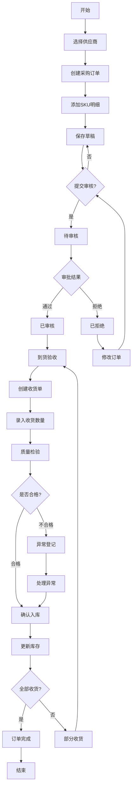
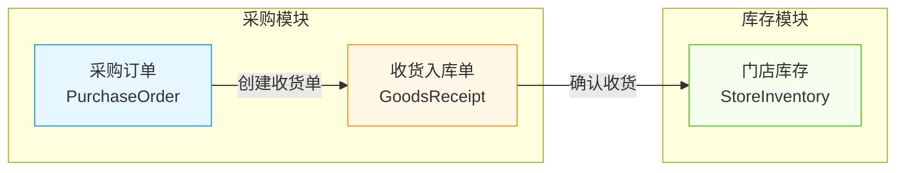
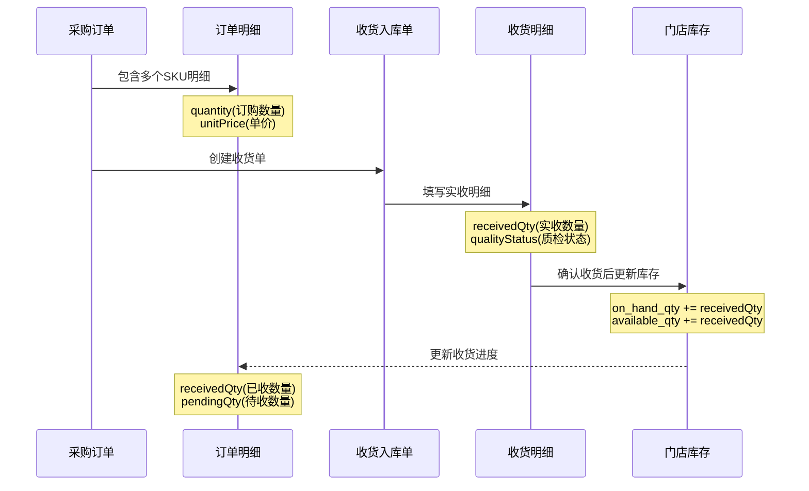
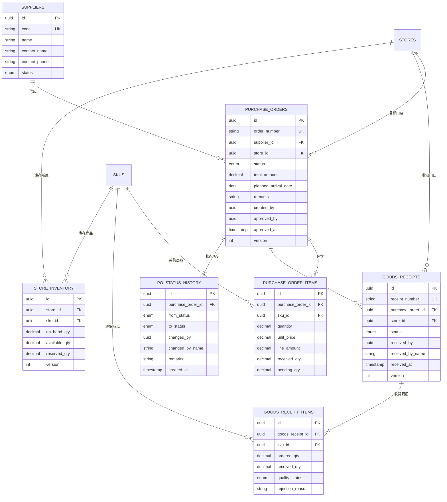

# 采购入库模块业务文档

**文档版本**: 1.0.0
**生成时间**: 2026-01-11
**Spec ID**: N001-purchase-inbound
**文档类型**: 业务流程与数据关系说明

---

## 目录

1. [模块概述](#1-模块概述)
2. [功能模块说明](#2-功能模块说明)
3. [核心业务流程](#3-核心业务流程)
4. [功能间流程关系](#4-功能间流程关系)
5. [数据关系模型](#5-数据关系模型)
6. [状态流转机制](#6-状态流转机制)
7. [业务规则约束](#7-业务规则约束)
8. [异常处理场景](#8-异常处理场景)

---

## 1. 模块概述

### 1.1 业务背景

采购入库模块是影院商品管理中台的核心供应链管理功能，主要解决以下业务问题：

- **新商品入库**：新 SKU 首次采购时自动创建库存记录
- **库存补充**：已有商品的库存增量更新
- **供应链追溯**：完整的采购-入库-库存更新链路追踪
- **异常管理**：短缺、拒收、报损等异常情况的标准化处理

### 1.2 功能全景图

```
┌─────────────────────────────────────────────────────────────────────────┐
│                         采购入库模块 (N001)                              │
├─────────────────────────────────────────────────────────────────────────┤
│                                                                         │
│  ┌─────────────┐    ┌─────────────┐    ┌─────────────┐                 │
│  │  供应商管理  │───▶│  采购订单   │───▶│ 收货入库    │                 │
│  │  (基础数据)  │    │  (PO)      │    │  (GR)      │                 │
│  └─────────────┘    └─────────────┘    └─────────────┘                 │
│         │                  │                  │                         │
│         │                  ▼                  ▼                         │
│         │           ┌─────────────┐    ┌─────────────┐                 │
│         │           │ 订单审批    │    │ 到货验收    │                 │
│         │           │ (状态流转)  │    │ (质量检验)  │                 │
│         │           └─────────────┘    └─────────────┘                 │
│         │                                     │                         │
│         │                                     ▼                         │
│         │                              ┌─────────────┐                 │
│         │                              │ 库存更新    │                 │
│         │                              │ (自动)      │                 │
│         │                              └─────────────┘                 │
│         │                                     │                         │
│         ▼                                     ▼                         │
│  ┌─────────────┐                       ┌─────────────┐                 │
│  │ 调拨管理    │◀──────────────────────│ 入库单查询  │                 │
│  │ (门店间)    │                       │  (历史)     │                 │
│  └─────────────┘                       └─────────────┘                 │
│                                                                         │
└─────────────────────────────────────────────────────────────────────────┘
```

---

## 2. 功能模块说明

### 2.1 供应商管理

| 属性 | 说明 |
|------|------|
| **功能定位** | 基础数据管理 |
| **主要职责** | 维护供应商信息，为采购订单提供供应商选项 |
| **核心字段** | 供应商编码、名称、联系人、联系电话、状态 |

**业务操作**：
- 新增供应商：创建新的合作供应商档案
- 编辑供应商：更新供应商联系信息
- 启用/停用：控制供应商是否可被采购订单选择

**数据约束**：
- 供应商编码全局唯一
- 仅 `ACTIVE` 状态的供应商可被新订单选择

---

### 2.2 采购订单 (PO)

| 属性 | 说明 |
|------|------|
| **功能定位** | 核心业务单据 |
| **主要职责** | 记录采购需求，驱动后续收货入库流程 |
| **核心字段** | 订单号、供应商、目标门店、明细清单、订单状态、总金额 |

**业务操作**：
- **创建订单**：选择供应商、目标门店，添加 SKU 采购明细
- **提交审核**：草稿订单提交进入审批流程
- **审批操作**：通过/拒绝待审核订单
- **删除订单**：仅草稿状态可删除

**订单号规则**：
- 格式：`PO` + `日期(YYYYMMDD)` + `4位序号`
- 示例：`PO202601110001`

---

### 2.3 采购订单列表

| 属性 | 说明 |
|------|------|
| **功能定位** | 查询与监控 |
| **主要职责** | 展示所有采购订单，提供筛选、操作入口 |
| **核心字段** | 订单号、供应商、门店、金额、状态、创建时间 |

**业务操作**：
- **筛选查询**：按状态、门店、日期范围筛选
- **订单操作**：查看详情、提交审核、审批、删除
- **导出数据**：导出订单列表到 Excel

**快捷入口**：
- 点击「创建订单」跳转到采购订单创建页
- 点击订单行进入订单详情/收货入库页

---

### 2.4 新建收货入库

| 属性 | 说明 |
|------|------|
| **功能定位** | 业务操作入口 |
| **主要职责** | 针对已审核的采购订单创建收货入库单 |
| **前置条件** | 采购订单状态为 `已审核` 或 `部分收货` |

**业务操作**：
1. 选择待收货的采购订单
2. 录入各 SKU 的实际收货数量
3. 标记质量状态（合格/不合格/待检验）
4. 提交创建收货单

**自动处理**：
- 生成收货单号（格式：`GR` + `日期` + `序号`）
- 更新采购订单明细的已收货数量
- 根据收货进度更新订单状态

---

### 2.5 到货验收 & 收货入库

| 属性 | 说明 |
|------|------|
| **功能定位** | 质量管控 + 库存更新 |
| **主要职责** | 对到货商品进行质量检验，确认后更新库存 |
| **关键动作** | 验收确认、库存写入 |

**验收流程**：

```
到货 → 清点数量 → 质量检验 → 录入系统 → 确认入库
                    ↓
              ┌─────┴─────┐
              ↓           ↓
           合格品      不合格品
              ↓           ↓
           入库存      异常登记
```

**质量状态枚举**：
| 状态 | 说明 | 后续处理 |
|------|------|---------|
| `QUALIFIED` | 合格 | 正常入库 |
| `UNQUALIFIED` | 不合格 | 记录原因，可拒收或报损 |
| `PENDING_CHECK` | 待检验 | 暂不入库，等待质检结果 |

**库存更新规则**：
- **新 SKU**：自动创建库存记录，`on_hand_qty = 收货数`
- **已有 SKU**：库存累加，`on_hand_qty += 收货数`

---

### 2.6 异常/短缺/拒收/报损登记

| 属性 | 说明 |
|------|------|
| **功能定位** | 异常处理 |
| **主要职责** | 记录和处理收货过程中的各类异常情况 |
| **异常类型** | 短缺、超量、拒收、报损、质量问题 |

**异常场景处理**：

| 异常类型 | 场景描述 | 处理方式 |
|---------|---------|---------|
| **短缺** | 实收数量 < 订单数量 | 按实收入库，剩余标记待收货 |
| **超量** | 实收数量 > 订单数量 | 允许超收（with 警告），全量入库 |
| **拒收** | 质量不合格 | 标记 `UNQUALIFIED`，填写拒收原因 |
| **报损** | 运输损坏 | 记录损坏原因，按实际完好数量入库 |

**异常记录字段**：
- 异常类型
- 异常数量
- 原因说明
- 处理人
- 处理时间

---

### 2.7 入库单历史/查询

| 属性 | 说明 |
|------|------|
| **功能定位** | 历史追溯 |
| **主要职责** | 查询历史收货入库单，支持审计追溯 |
| **核心字段** | 收货单号、关联采购订单、门店、状态、收货时间 |

**查询维度**：
- 按收货单号精确查询
- 按采购订单号关联查询
- 按门店、时间范围筛选
- 按状态筛选（待确认/已确认/已取消）

**详情展示**：
- 收货单基本信息
- 关联的采购订单信息
- 收货明细（SKU、订单数量、实收数量、质量状态）
- 操作日志

---

### 2.8 调拨管理

| 属性 | 说明 |
|------|------|
| **功能定位** | 库存再分配 |
| **主要职责** | 管理门店间的库存调拨 |
| **与入库关系** | 调拨入库是库存增加的另一种来源 |

**调拨流程**：

```
调出门店                     调入门店
   │                           │
   │  创建调拨单               │
   ├──────────────────────────▶│
   │                           │
   │  确认出库                 │
   │  (库存减少)               │
   ├──────────────────────────▶│
   │                           │
   │                      确认入库
   │                      (库存增加)
   │◀──────────────────────────┤
   │                           │
   │  调拨完成                 │
   └───────────────────────────┘
```

**与采购入库的区别**：
| 维度 | 采购入库 | 调拨入库 |
|------|---------|---------|
| 库存来源 | 外部供应商 | 内部门店 |
| 关联单据 | 采购订单 (PO) | 调拨单 (TR) |
| 成本计算 | 采购价格 | 内部转移价 |
| 审批流程 | 采购审批 | 调拨审批 |

---

## 3. 核心业务流程

### 3.1 采购入库全流程



### 3.2 关键节点说明

| 节点 | 操作人 | 系统行为 |
|------|--------|---------|
| 创建采购订单 | 采购员 | 生成订单号，状态=DRAFT |
| 提交审核 | 采购员 | 状态→PENDING_APPROVAL，记录状态历史 |
| 审批通过 | 审批人 | 状态→APPROVED，记录审批人和时间 |
| 审批拒绝 | 审批人 | 状态→REJECTED，记录拒绝原因 |
| 创建收货单 | 仓管员 | 生成收货单号，状态=PENDING |
| 确认入库 | 仓管员 | 更新库存，收货单状态→CONFIRMED |
| 更新采购订单 | 系统 | 根据收货进度更新订单状态 |

---

## 4. 功能间流程关系

### 4.1 功能流程依赖图

```
                    ┌─────────────────┐
                    │   供应商管理     │
                    │  (基础数据)      │
                    └────────┬────────┘
                             │ 提供供应商选项
                             ▼
┌─────────────────────────────────────────────────────────────┐
│                     采购订单管理                             │
│  ┌─────────┐    ┌─────────┐    ┌─────────┐    ┌─────────┐  │
│  │ 创建    │───▶│ 审批    │───▶│ 收货    │───▶│ 完成    │  │
│  │ (草稿)  │    │ (待审核) │    │ (已审核) │    │ (已收货) │  │
│  └─────────┘    └─────────┘    └─────────┘    └─────────┘  │
└─────────────────────────┬───────────────────────────────────┘
                          │ 关联采购订单
                          ▼
┌─────────────────────────────────────────────────────────────┐
│                     收货入库管理                             │
│  ┌─────────┐    ┌─────────┐    ┌─────────┐                 │
│  │ 新建    │───▶│ 验收    │───▶│ 入库    │                 │
│  │ 收货单  │    │ (质检)  │    │ (确认)  │                 │
│  └─────────┘    └────┬────┘    └────┬────┘                 │
│                      │              │                       │
│                      ▼              ▼                       │
│               ┌─────────┐    ┌─────────┐                   │
│               │ 异常登记 │    │ 库存更新 │                   │
│               │ (报损等) │    │ (自动)  │                   │
│               └─────────┘    └─────────┘                   │
└─────────────────────────────────────────────────────────────┘
                          │
                          ▼
                ┌─────────────────┐
                │   入库单查询     │
                │  (历史追溯)      │
                └─────────────────┘
                          │
                          ▼
                ┌─────────────────┐
                │   调拨管理       │
                │ (库存再分配)     │
                └─────────────────┘
```

### 4.2 功能交互矩阵

| 源功能 | 目标功能 | 交互方式 | 数据传递 |
|-------|---------|---------|---------|
| 供应商管理 | 采购订单 | 数据引用 | 供应商ID、名称 |
| 采购订单 | 采购订单列表 | 数据展示 | 订单列表数据 |
| 采购订单列表 | 采购订单 | 页面跳转 | 订单ID |
| 采购订单 | 收货入库 | 流程驱动 | 订单ID、明细清单 |
| 收货入库 | 到货验收 | 业务触发 | 收货单ID |
| 到货验收 | 异常登记 | 条件触发 | 异常SKU信息 |
| 到货验收 | 库存管理 | 数据写入 | 入库数量、SKU |
| 收货入库 | 入库单查询 | 数据存储 | 收货单记录 |
| 库存管理 | 调拨管理 | 数据读取 | 库存余量 |

---

## 5. 采购与库存的关系

采购入库是库存管理的重要数据来源，理解两者的关系对于正确使用系统至关重要。

### 5.1 核心关系概述

**采购是库存的主要来源**：采购入库流程是库存增加的主要途径之一。当收货确认后，系统自动触发库存更新，为新 SKU 创建库存记录或为已有 SKU 累加库存数量。



### 5.2 数据流向关系

采购到库存的完整数据链路：



### 5.3 收货如何影响库存

收货确认后，系统根据 SKU 在目标门店的库存状态执行不同逻辑：

#### 场景一：新 SKU 入库（首次采购）

当 SKU+门店 组合在 `store_inventory` 表中不存在记录时：

```
系统自动创建新的库存记录：
├── store_id = 收货单的目标门店
├── sku_id = 收货明细的 SKU
├── on_hand_qty = 本次实收数量
├── available_qty = 本次实收数量
├── reserved_qty = 0
└── created_at = 当前时间
```

**这解决了"新 SKU 无法入库"的核心问题** —— 无需预先创建库存记录，采购入库会自动初始化。

#### 场景二：已有 SKU 入库（补货采购）

当 SKU+门店 组合在 `store_inventory` 表中已存在记录时：

```
系统累加现有库存数量：
├── on_hand_qty = on_hand_qty + 本次实收数量
├── available_qty = available_qty + 本次实收数量
└── updated_at = 当前时间
```

#### 质检状态对库存的影响

| 质检状态 | 枚举值 | 是否入库 | 说明 |
|---------|--------|---------|------|
| 合格 | `QUALIFIED` | ✅ 是 | 正常入库，增加可用库存 |
| 不合格 | `UNQUALIFIED` | ❌ 否 | 不入库，需登记异常处理 |
| 待检验 | `PENDING_CHECK` | ⏳ 暂不 | 暂不入库，待质检完成后处理 |

**重要**：只有质检状态为 `QUALIFIED`（合格）的商品才会计入库存。

### 5.4 关键字段映射

| 来源表/字段 | 目标表/字段 | 数据关系 | 说明 |
|------------|------------|---------|------|
| `PurchaseOrderItem.quantity` | - | 订购数量 | 采购订单中计划采购的数量 |
| `PurchaseOrderItem.receivedQty` | - | 已收数量 | 累计已完成收货的数量 |
| `PurchaseOrderItem.pendingQty` | - | 待收数量 | = quantity - receivedQty |
| `GoodsReceiptItem.receivedQty` | `StoreInventory.on_hand_qty` | 累加 | 本次实收数量加到在库数量 |
| `GoodsReceiptItem.receivedQty` | `StoreInventory.available_qty` | 累加 | 本次实收数量加到可用数量 |
| `GoodsReceipt.storeId` | `StoreInventory.store_id` | 关联 | 确定库存记录所属门店 |
| `GoodsReceiptItem.skuId` | `StoreInventory.sku_id` | 关联 | 确定库存记录对应商品 |

### 5.5 状态联动表

收货操作触发采购订单状态和库存的联动变化：

| 收货情况 | 采购订单状态变化 | 库存变化 | 触发条件 |
|---------|-----------------|---------|---------|
| 首次部分收货 | `APPROVED` → `PARTIAL_RECEIVED` | 实收数量入库 | 0 < 累计收货 < 订单总量 |
| 继续部分收货 | 保持 `PARTIAL_RECEIVED` | 实收数量累加入库 | 累计收货仍未达到订单总量 |
| 完成全部收货 | → `FULLY_RECEIVED` | 最后一批数量入库 | 累计收货 = 订单总量 |
| 超量收货 | → `FULLY_RECEIVED` | 实际收货数量入库 | 累计收货 > 订单总量（允许但有警告） |
| 关闭订单 | → `CLOSED` | 无新增入库 | 管理员手动关闭未完成订单 |

### 5.6 实际操作示例

**场景**：门店A首次采购可乐和薯片

```
采购订单 PO202601110001：
├── SKU-001 可乐 × 100瓶 @ ¥3.00
└── SKU-002 薯片 × 50袋 @ ¥5.00

收货入库单 GR202601110001：
├── SKU-001 可乐：实收 80瓶（合格）
└── SKU-002 薯片：实收 50袋（合格）

库存变化（门店A）：
├── SKU-001 可乐：新建记录，on_hand_qty = 80
└── SKU-002 薯片：新建记录，on_hand_qty = 50

采购订单状态：APPROVED → PARTIAL_RECEIVED
（可乐还有20瓶待收货）
```

```
后续收货入库单 GR202601120001：
└── SKU-001 可乐：实收 20瓶（合格）

库存变化（门店A）：
└── SKU-001 可乐：on_hand_qty = 80 + 20 = 100

采购订单状态：PARTIAL_RECEIVED → FULLY_RECEIVED
（全部收货完成）
```

---

## 6. 数据关系模型

### 6.1 ER 关系图



### 6.2 核心数据表说明

| 表名 | 中文名 | 核心职责 | 关联关系 |
|------|--------|---------|---------|
| `suppliers` | 供应商表 | 供应商主数据 | 被 purchase_orders 引用 |
| `purchase_orders` | 采购订单表 | 采购订单主表 | 关联 supplier, store, items |
| `purchase_order_items` | 采购明细表 | 订单商品明细 | 属于 purchase_orders |
| `goods_receipts` | 收货入库单表 | 收货单主表 | 关联 purchase_order, store |
| `goods_receipt_items` | 收货明细表 | 收货商品明细 | 属于 goods_receipts |
| `purchase_order_status_history` | 状态历史表 | 订单状态变更记录 | 属于 purchase_orders |
| `store_inventory` | 门店库存表 | 库存实时数据 | 关联 store, sku |

### 6.3 数据流向图

```
┌──────────────┐
│   供应商      │
│  (suppliers) │
└──────┬───────┘
       │ supplier_id
       ▼
┌──────────────────────────────────────────────────────────┐
│                    采购订单 (purchase_orders)            │
│  order_number │ supplier_id │ store_id │ status │ total │
└───────┬────────────────────────────────────────┬─────────┘
        │ purchase_order_id                      │
        ▼                                        │
┌────────────────────────┐                       │
│   采购明细              │                       │
│ (purchase_order_items) │                       │
│  sku_id │ qty │ price  │                       │
└───────────────┬────────┘                       │
                │                                │
                │  收货时创建                     │
                ▼                                ▼
┌──────────────────────────────────────────────────────────┐
│                    收货入库单 (goods_receipts)           │
│  receipt_number │ purchase_order_id │ store_id │ status │
└───────┬──────────────────────────────────────────────────┘
        │ goods_receipt_id
        ▼
┌────────────────────────┐
│   收货明细              │
│ (goods_receipt_items)  │
│  sku_id │ received_qty │
└───────────────┬────────┘
                │
                │  确认入库时写入
                ▼
┌──────────────────────────────────────────────────────────┐
│                    门店库存 (store_inventory)            │
│  store_id │ sku_id │ on_hand_qty │ available_qty        │
└──────────────────────────────────────────────────────────┘
```

---

## 7. 状态流转机制

### 7.1 采购订单状态

```
┌─────────────────────────────────────────────────────────────────┐
│                     采购订单状态流转                             │
├─────────────────────────────────────────────────────────────────┤
│                                                                 │
│   DRAFT ──(提交)──▶ PENDING_APPROVAL ──(审批通过)──▶ APPROVED   │
│     │                      │                            │       │
│     │                      │                            │       │
│  (删除)                 (拒绝)                      (部分收货)   │
│     │                      │                            │       │
│     ▼                      ▼                            ▼       │
│  [已删除]              REJECTED                PARTIAL_RECEIVED │
│                            │                            │       │
│                        (修改后重新提交)              (全部收货)   │
│                            │                            │       │
│                            ▼                            ▼       │
│                    PENDING_APPROVAL              FULLY_RECEIVED │
│                                                         │       │
│                                                     (关闭)      │
│                                                         │       │
│                                                         ▼       │
│                                                      CLOSED     │
└─────────────────────────────────────────────────────────────────┘
```

**状态说明**：

| 状态 | 中文 | 允许的操作 |
|------|------|-----------|
| `DRAFT` | 草稿 | 编辑、删除、提交审核 |
| `PENDING_APPROVAL` | 待审核 | 审批通过、审批拒绝 |
| `APPROVED` | 已审核 | 创建收货单 |
| `REJECTED` | 已拒绝 | 修改后重新提交 |
| `PARTIAL_RECEIVED` | 部分收货 | 继续收货 |
| `FULLY_RECEIVED` | 全部收货 | 关闭订单 |
| `CLOSED` | 已关闭 | 仅查看 |

### 7.2 收货入库单状态

```
PENDING ──(确认收货)──▶ CONFIRMED
    │
    └──(取消)──▶ CANCELLED
```

| 状态 | 中文 | 说明 |
|------|------|------|
| `PENDING` | 待确认 | 收货单已创建，待最终确认 |
| `CONFIRMED` | 已确认 | 收货完成，库存已更新 |
| `CANCELLED` | 已取消 | 收货单被取消 |

### 7.3 状态变更记录

每次采购订单状态变更都会记录到 `purchase_order_status_history` 表：

| 字段 | 说明 |
|------|------|
| `from_status` | 变更前状态（首次为 NULL） |
| `to_status` | 变更后状态 |
| `changed_by` | 操作人 ID |
| `changed_by_name` | 操作人姓名 |
| `remarks` | 备注（如拒绝原因） |
| `created_at` | 变更时间 |

---

## 8. 业务规则约束

### 8.1 采购订单规则

| 规则编号 | 规则描述 | 校验时机 |
|---------|---------|---------|
| PO-001 | 供应商必须为 ACTIVE 状态 | 创建/编辑订单 |
| PO-002 | 目标门店必须为 ACTIVE 状态 | 创建/编辑订单 |
| PO-003 | 订单明细至少包含 1 个 SKU | 提交审核 |
| PO-004 | 采购数量必须大于 0 | 添加明细 |
| PO-005 | 单价不能为负数 | 添加明细 |
| PO-006 | 仅 DRAFT 状态可删除 | 删除操作 |
| PO-007 | 仅 PENDING_APPROVAL 可审批 | 审批操作 |

### 8.2 收货入库规则

| 规则编号 | 规则描述 | 校验时机 |
|---------|---------|---------|
| GR-001 | 仅 APPROVED/PARTIAL_RECEIVED 订单可收货 | 创建收货单 |
| GR-002 | 收货数量不能为负数 | 录入收货数量 |
| GR-003 | 超量收货需警告确认 | 确认入库 |
| GR-004 | 不合格品必须填写原因 | 质量检验 |
| GR-005 | 已确认的收货单不可修改 | 编辑收货单 |

### 8.3 库存更新规则

| 规则编号 | 规则描述 |
|---------|---------|
| INV-001 | 新 SKU 首次入库自动创建库存记录 |
| INV-002 | 已有 SKU 入库累加 on_hand_qty |
| INV-003 | 入库同时更新 available_qty |
| INV-004 | 使用乐观锁防止并发更新冲突 |

---

## 9. 异常处理场景

### 9.1 场景：短缺收货

**场景描述**：订单 100 件，实际到货 80 件

**处理流程**：
1. 录入实际收货数量 80
2. 系统计算短缺数量 20
3. 按实收 80 件入库
4. 订单状态变更为 `PARTIAL_RECEIVED`
5. 剩余 20 件待后续收货

**数据变化**：
```
purchase_order_items.received_qty = 80
purchase_order_items.pending_qty = 20
purchase_orders.status = PARTIAL_RECEIVED
store_inventory.on_hand_qty += 80
```

### 9.2 场景：超量收货

**场景描述**：订单 100 件，实际到货 120 件

**处理流程**：
1. 录入实际收货数量 120
2. 系统提示超量警告
3. 用户确认接收超量部分
4. 按实收 120 件入库
5. 订单状态变更为 `FULLY_RECEIVED`

**数据变化**：
```
purchase_order_items.received_qty = 120
purchase_order_items.pending_qty = 0 (或负数)
purchase_orders.status = FULLY_RECEIVED
store_inventory.on_hand_qty += 120
```

### 9.3 场景：部分拒收

**场景描述**：到货 100 件，其中 10 件质量不合格

**处理流程**：
1. 录入合格品数量 90，质量状态 `QUALIFIED`
2. 录入不合格品数量 10，质量状态 `UNQUALIFIED`
3. 填写不合格原因（如：包装破损）
4. 仅合格品 90 件入库
5. 不合格品记录在案，可后续索赔

**数据变化**：
```
goods_receipt_items (合格): received_qty=90, quality_status=QUALIFIED
goods_receipt_items (不合格): received_qty=10, quality_status=UNQUALIFIED
store_inventory.on_hand_qty += 90 (仅合格品)
```

### 8.4 场景：新 SKU 首次入库

**场景描述**：采购新商品，门店库存表中不存在该 SKU 记录

**处理流程**：
1. 创建采购订单，包含新 SKU
2. 审批通过后创建收货单
3. 录入收货数量
4. 确认入库时，系统自动创建库存记录

**数据变化**：
```sql
-- 自动创建库存记录
INSERT INTO store_inventory (store_id, sku_id, on_hand_qty, available_qty, reserved_qty)
VALUES ('{store_id}', '{sku_id}', {received_qty}, {received_qty}, 0)
```

---

## 附录

### A. 单据号生成规则

| 单据类型 | 前缀 | 格式 | 示例 |
|---------|------|------|------|
| 采购订单 | PO | PO + YYYYMMDD + 4位序号 | PO202601110001 |
| 收货入库单 | GR | GR + YYYYMMDD + 4位序号 | GR202601110001 |
| 调拨单 | TR | TR + YYYYMMDD + 4位序号 | TR202601110001 |

### B. 枚举值参考

**采购订单状态 (PurchaseOrderStatus)**：
- `DRAFT` - 草稿
- `PENDING_APPROVAL` - 待审核
- `APPROVED` - 已审核
- `REJECTED` - 已拒绝
- `PARTIAL_RECEIVED` - 部分收货
- `FULLY_RECEIVED` - 全部收货
- `CLOSED` - 已关闭

**收货单状态 (GoodsReceiptStatus)**：
- `PENDING` - 待确认
- `CONFIRMED` - 已确认
- `CANCELLED` - 已取消

**质量状态 (QualityStatus)**：
- `QUALIFIED` - 合格
- `UNQUALIFIED` - 不合格
- `PENDING_CHECK` - 待检验

**供应商状态 (SupplierStatus)**：
- `ACTIVE` - 启用
- `INACTIVE` - 停用

---

**文档结束**

<!-- DOC-WRITER: AUTO-GENERATED -->
<!-- Spec: N001-purchase-inbound -->
<!-- Generated: 2026-01-11 -->
