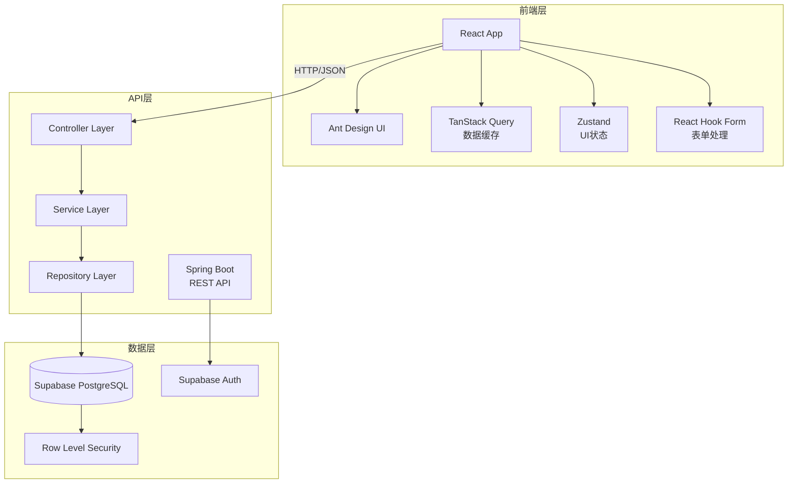
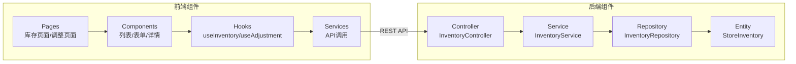
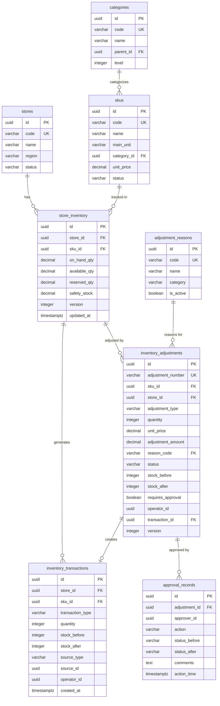
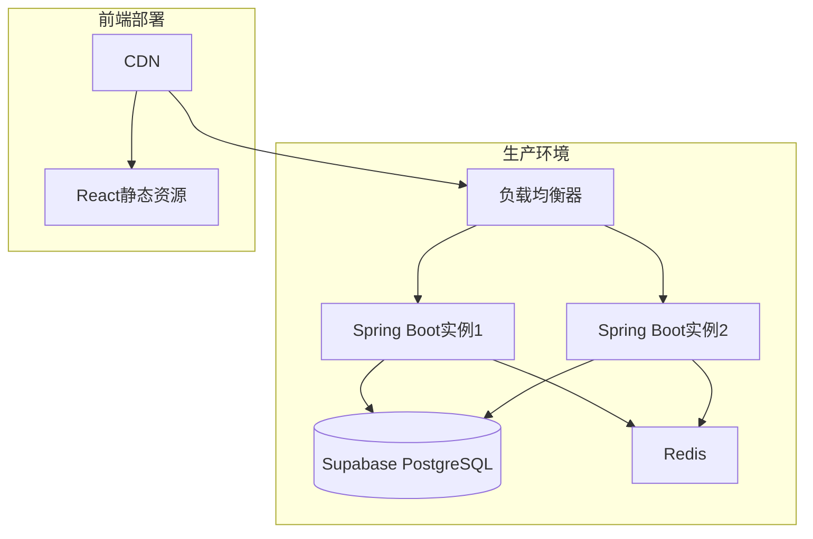

# 技术设计文档 (TDD) - 库存查询与调整管理系统

**文档版本**: 1.0
**创建日期**: 2025-12-27
**合并来源**: P003-inventory-query + P004-inventory-adjustment
**作者**: AI Assistant
**审核人**: [待指定]

---

## 变更历史

| 版本 | 日期 | 作者 | 变更说明 |
|------|------|------|----------|
| 1.0 | 2025-12-27 | AI Assistant | 合并 P003 和 P004 初始版本 |

---

## 📋 文档合并说明

本文档合并了以下两个功能规格的技术设计:

- **P003-inventory-query**: 门店SKU库存查询功能
- **P004-inventory-adjustment**: 库存调整管理功能

**合并策略**: auto-dedup (自动去重)

**重叠内容处理**:
1. **数据表定义**: `store_inventory` 表由 P003 定义,P004 扩展了 `safety_stock` 和 `version` 字段(已合并)
2. **库存流水**: `inventory_transactions` 表由 P003 定义,P004 复用
3. **商品分类**: `categories` 表由 P003 定义,P004 间接使用
4. **安全库存管理**: P003 定义显示,P004 扩展编辑功能(已合并)

详细的合并决策和需要人工审查的部分请参阅: [合并报告](./库存&仓店库存管理-merge-report.md)

---

## 1. 概述

### 1.1 背景

影院商品管理中台需要完善的库存管理能力,包括:
- **库存查询**: 店长和库存管理员需要实时查看门店SKU库存状态,支持多维度筛选和搜索
- **库存调整**: 库存管理员需要处理盘点差异、货物损耗等日常库存调整操作,并保留完整的变动记录

本系统整合了库存查询和调整两大核心功能,形成完整的库存管理闭环。

### 1.2 项目目标

1. **实时库存可见性**: 提供准确的库存数量查询,支持多门店、多维度筛选
2. **标准化调整流程**: 规范库存调整操作,强制原因记录,支持大额审批
3. **完整的审计追溯**: 记录所有库存变动流水,支持历史追溯和差异分析
4. **智能库存预警**: 基于安全库存阈值自动计算五级库存状态(充足/正常/偏低/不足/缺货)
5. **风险控制**: 大额库存调整需要审批,防止资产损失

### 1.3 范围边界

**包含范围**:
- ✅ 库存列表查询、搜索、分页
- ✅ 按门店、库存状态、商品分类筛选
- ✅ 库存详情查看(包含现存/可用/预占/安全库存)
- ✅ 库存调整录入(盘盈/盘亏/报损)
- ✅ 调整原因字典(预置 + 自定义)
- ✅ 库存流水查询(按时间/类型筛选)
- ✅ 大额调整审批流程
- ✅ 安全库存阈值编辑
- ✅ 库存状态五级标识

**不包含范围**:
- ❌ 库存主数据新增/删除(属于SKU管理)
- ❌ 批量库存导入/导出
- ❌ 自动盘点功能
- ❌ 库存预警推送通知
- ❌ 批次管理和效期管理
- ❌ 多级审批流程(仅支持单级)
- ❌ 移动端审批(仅B端管理后台)

### 1.4 术语定义

| 术语 | 定义 |
|------|------|
| SKU | 库存单元(Stock Keeping Unit),商品的最小库存管理单位 |
| 现存数量 (onHandQty) | 实际在仓库中的库存数量 |
| 可用数量 (availableQty) | 可用于销售的库存,计算公式: 可用 = 现存 - 预占 |
| 预占数量 (reservedQty) | 已被订单锁定但未出库的数量 |
| 安全库存 (safetyStock) | SKU的最低库存警戒线,低于此值需要补货 |
| 库存状态 | 根据可用库存与安全库存比例自动计算的五级状态 |
| 库存调整 | 手动修正库存数量的操作,包括盘盈/盘亏/报损 |
| 库存流水 | 记录每次库存变动的历史记录 |
| 审批阈值 | 触发审批流程的调整金额界限(当前为1000元) |

---

## 2. 需求摘要

### 2.1 功能需求 (合并后)

#### P0 - 查看门店库存列表 [INV-001]
- **作为**: 店长
- **我希望**: 能够查看门店所有SKU的当前库存数量
- **以便**: 掌握库存状态,进行日常运营决策

**验收标准**:
- 显示SKU编码、名称、现存数量、可用数量、预占数量、库存状态、单位
- 支持分页加载(每页20条)
- 页面加载时间 ≤ 2秒
- 门店无库存时显示空状态提示

#### P0 - 搜索库存 [INV-002]
- **作为**: 店长
- **我希望**: 能够按SKU名称/编码搜索库存
- **以便**: 快速定位商品

**验收标准**:
- 支持实时模糊搜索(防抖300ms)
- 显示匹配的SKU列表
- 无匹配结果时显示空状态提示
- 清空搜索框恢复完整列表

#### P0 - 多维度筛选库存 [INV-003]
- **作为**: 店长
- **我希望**: 能够按门店、库存状态、商品分类筛选库存
- **以便**: 快速定位需要关注的商品

**验收标准**:
- 门店筛选默认选中当前用户所属门店
- 支持库存状态多选(充足/正常/偏低/不足/缺货)
- 支持商品分类筛选
- 多条件交集筛选
- 提供重置按钮

#### P1 - 查看库存详情 [INV-004]
- **作为**: 店长
- **我希望**: 能够查看单个SKU的库存详情
- **以便**: 了解完整信息

**验收标准**:
- 点击列表行展开详情或打开抽屉
- 显示: 现存数量、可用数量、预占数量、单位、最后更新时间、安全库存阈值
- 库存低于阈值时醒目提示
- 详情响应时间 ≤ 500ms

#### P1 - 录入库存调整 [INV-010]
- **作为**: 库存管理员
- **我希望**: 能够录入库存调整(盘盈/盘亏/报损)
- **以便**: 处理盘点差异和日常损耗

**验收标准**:
- 支持三种调整类型: 盘盈(增加)、盘亏(减少)、报损(减少并标记)
- 必须填写调整原因(下拉选择 + 补充说明)
- 提交前二次确认,展示调整前后库存对比
- 调整金额 < 1000元时立即生效并生成流水
- 调整金额 ≥ 1000元时进入待审批状态
- 2分钟内完成一条调整录入

#### P2 - 查看库存流水记录 [INV-011]
- **作为**: 库存管理员
- **我希望**: 能够查看库存流水记录
- **以便**: 追溯库存变动历史

**验收标准**:
- 显示变动类型、数量、时间、操作人、变动前后库存
- 入库类变动显示绿色"+"号,出库类显示红色"-"号
- 支持按时间范围筛选
- 流水查询在500ms内返回结果(100条以内)

#### P2 - 填写调整原因(必填) [INV-012]
- **作为**: 库存管理员
- **我希望**: 库存调整必须填写原因
- **以便**: 后续分析差异根因

**验收标准**:
- 原因为必填字段,未填写阻止提交
- 提供预设原因字典(盘点差异、货物损坏、过期报废、入库错误、其他)
- 支持补充详细说明(可选,最多500字符)

#### P3 - 大额库存调整审批 [INV-013]
- **作为**: 运营总监
- **我希望**: 大额库存调整需要审批
- **以便**: 控制资产风险

**验收标准**:
- 调整金额 ≥ 1000元时进入待审批状态
- 待审批状态不更新库存
- 审批通过后立即更新库存并生成流水
- 审批拒绝后库存保持不变,记录拒绝原因
- 显示完整审批记录(审批人、时间、意见)

#### P3 - 设置安全库存阈值 [INV-014]
- **作为**: 库存管理员
- **我希望**: 能够设置SKU的安全库存阈值
- **以便**: 自定义预警标准

**验收标准**:
- 在库存详情中编辑安全库存值
- 保存后新阈值立即生效
- 库存状态根据新阈值重新计算
- 状态更新在1秒内完成

### 2.2 非功能需求

| 类别 | 要求 | 指标 |
|------|------|------|
| 性能 | 快速加载和响应 | 列表加载 ≤ 2s, 详情 ≤ 500ms, 流水查询 ≤ 500ms |
| 可用性 | 系统稳定可靠 | 服务可用性 ≥ 99.5% |
| 安全性 | 数据访问控制 | 基于角色的权限控制(RBAC),操作日志审计 |
| 可扩展性 | 支持业务增长 | 支持单门店1000+ SKU, 可横向扩展 |
| 数据一致性 | 库存数据准确 | 使用乐观锁防止并发冲突,流水记录100%准确 |

---

## 3. 技术选型

### 3.1 技术栈

| 层次 | 技术 | 版本 | 选型理由 |
|------|------|------|----------|
| 前端框架 | React | 19.2.0 | 现代化UI库,生态成熟,团队熟悉 |
| 类型系统 | TypeScript | 5.9.3 | 类型安全,提升代码质量 |
| UI组件库 | Ant Design | 6.1.0 | B端组件丰富,符合设计规范 |
| 状态管理 | Zustand | 5.0.9 | 轻量级,API简洁 |
| 服务器状态 | TanStack Query | 5.90.12 | 数据缓存、自动刷新、错误处理 |
| 路由 | React Router | 7.10.1 | 标准路由解决方案 |
| 表单处理 | React Hook Form | 7.68.0 | 性能优异,验证强大 |
| 数据验证 | Zod | 4.1.13 | 运行时类型检查,与TypeScript配合 |
| Mock数据 | MSW | 2.12.4 | 开发阶段模拟后端接口 |
| 后端框架 | Spring Boot | 3.x | 企业级Java框架,成熟稳定 |
| 运行时 | Java | 21 | LTS版本,性能提升 |
| 数据库 | Supabase PostgreSQL | - | 云原生数据库,内置认证和RLS |

### 3.2 技术决策记录

#### 决策 1: 使用 Supabase 作为单一数据源
- **背景**: 项目需要快速构建数据库、认证、存储功能
- **决策**: 使用 Supabase 作为统一的后端基础设施
- **替代方案**: 自建 PostgreSQL + 自建认证服务
- **理由**: Supabase 提供开箱即用的数据库、认证、RLS,减少开发成本
- **后果**: 依赖 Supabase 平台,但可通过标准 PostgreSQL 迁移

#### 决策 2: 库存状态使用五级分类
- **背景**: 需要直观展示库存健康程度
- **决策**: 采用充足/正常/偏低/不足/缺货五级状态
- **替代方案**: 仅二级分类(正常/不足)
- **理由**: 五级分类更精细,便于提前预警和分级处理
- **后果**: 增加状态计算逻辑,但提升用户体验

#### 决策 3: 使用乐观锁防止并发冲突
- **背景**: 多用户可能同时编辑安全库存或调整库存
- **决策**: 使用 version 字段实现乐观锁
- **替代方案**: 悲观锁(行锁)
- **理由**: 库存调整冲突概率低,乐观锁性能更好
- **后果**: 并发冲突时需要重试,但概率极低

#### 决策 4: 审批阈值硬编码为1000元
- **背景**: 需要控制大额调整风险
- **决策**: 当前版本阈值固定为1000元
- **替代方案**: 配置化阈值
- **理由**: 简化MVP实现,后续可扩展为配置表
- **后果**: 修改阈值需要发版,但暂时可接受

---

## 4. 系统架构设计

### 4.1 架构概览



### 4.2 分层架构

| 层次 | 职责 | 技术 | 示例 |
|------|------|------|------|
| **表现层** | UI渲染、用户交互 | React + Ant Design | 库存列表页、调整表单 |
| **应用层** | 业务流程编排、状态管理 | TanStack Query + Zustand | 列表查询、筛选状态 |
| **API层** | 接口暴露、请求路由 | Spring Boot Controller | GET /api/inventory |
| **服务层** | 业务逻辑实现 | Spring Boot Service | 调整业务逻辑、审批流程 |
| **数据层** | 数据持久化、访问 | Supabase + JPA Repository | 库存CRUD操作 |

### 4.3 组件架构



---

## 5. 核心模块设计

### 5.1 库存查询模块 (P003)

**职责**: 提供库存列表查询、搜索、筛选、详情查看功能

**接口定义**:
```typescript
// 前端 Hook
export function useInventoryList(params: InventoryQueryParams) {
  return useQuery({
    queryKey: ['inventory', params],
    queryFn: () => inventoryService.listInventory(params),
    staleTime: 5 * 60 * 1000, // 5分钟缓存
  });
}

// API Service
export const inventoryService = {
  listInventory: (params: InventoryQueryParams) =>
    http.get<InventoryListResponse>('/api/inventory', { params }),

  getInventoryDetail: (id: string) =>
    http.get<InventoryDetailResponse>(`/api/inventory/${id}`),
};
```

**依赖关系**:
- 依赖 `stores` 表(门店信息)
- 依赖 `skus` 表(商品信息)
- 依赖 `categories` 表(商品分类)
- 依赖 `store_inventory` 表(库存数据)

**关键逻辑**:
1. 库存状态计算:
```sql
CASE
  WHEN available_qty = 0 THEN 'OUT_OF_STOCK'
  WHEN available_qty < safety_stock * 0.5 THEN 'LOW'
  WHEN available_qty < safety_stock THEN 'BELOW_THRESHOLD'
  WHEN available_qty < safety_stock * 2 THEN 'NORMAL'
  ELSE 'SUFFICIENT'
END
```

2. 权限控制:
   - 店长仅可查看所属门店库存
   - 库存管理员可跨门店查看

### 5.2 库存调整模块 (P004)

**职责**: 处理库存调整录入、审批流程、流水生成

**接口定义**:
```typescript
// 创建调整
export function useCreateAdjustment() {
  const queryClient = useQueryClient();

  return useMutation({
    mutationFn: (data: CreateAdjustmentRequest) =>
      adjustmentService.createAdjustment(data),
    onSuccess: () => {
      queryClient.invalidateQueries({ queryKey: ['inventory'] });
      queryClient.invalidateQueries({ queryKey: ['transactions'] });
    },
  });
}

// API Service
export const adjustmentService = {
  createAdjustment: (data: CreateAdjustmentRequest) =>
    http.post<AdjustmentResponse>('/api/adjustments', data),

  withdrawAdjustment: (id: string) =>
    http.post<AdjustmentResponse>(`/api/adjustments/${id}/withdraw`),
};
```

**依赖关系**:
- 依赖库存查询模块(获取当前库存)
- 依赖 `inventory_adjustments` 表(调整记录)
- 依赖 `adjustment_reasons` 表(原因字典)
- 依赖 `approval_records` 表(审批记录)
- 依赖 `inventory_transactions` 表(流水记录)

**关键逻辑**:
1. 调整金额计算:
```typescript
const adjustmentAmount = Math.abs(quantity * unitPrice);
const requiresApproval = adjustmentAmount >= APPROVAL_THRESHOLD; // 1000元
```

2. 库存更新:
```typescript
// 盘盈: 增加库存
if (adjustmentType === 'surplus') {
  stockAfter = stockBefore + quantity;
  availableAfter = availableBefore + quantity;
}

// 盘亏/报损: 减少库存
else {
  stockAfter = stockBefore - quantity;
  availableAfter = availableBefore - quantity;
}
```

### 5.3 审批流程模块 (P004)

**职责**: 处理大额调整审批、审批记录管理

**接口定义**:
```typescript
export function useProcessApproval() {
  const queryClient = useQueryClient();

  return useMutation({
    mutationFn: ({ adjustmentId, action, comments }: ApprovalRequest) =>
      approvalService.processApproval(adjustmentId, { action, comments }),
    onSuccess: () => {
      queryClient.invalidateQueries({ queryKey: ['approvals'] });
      queryClient.invalidateQueries({ queryKey: ['adjustments'] });
      queryClient.invalidateQueries({ queryKey: ['inventory'] });
    },
  });
}
```

**关键逻辑**:
```typescript
// 审批通过
if (action === 'approve') {
  // 1. 更新调整单状态
  adjustment.status = 'approved';

  // 2. 更新库存
  await inventoryService.updateStock(adjustment);

  // 3. 生成流水记录
  const transaction = await transactionService.create({
    skuId: adjustment.skuId,
    storeId: adjustment.storeId,
    transactionType: mapAdjustmentTypeToTransaction(adjustment.adjustmentType),
    quantity: adjustment.quantity,
    sourceType: 'adjustment_order',
    sourceId: adjustment.id,
  });

  // 4. 关联流水ID
  adjustment.transactionId = transaction.id;

  // 5. 记录审批操作
  await approvalService.createRecord({
    adjustmentId: adjustment.id,
    action: 'approve',
    statusBefore: 'pending_approval',
    statusAfter: 'approved',
    comments,
  });
}
```

### 5.4 安全库存管理模块 (P004)

**职责**: 安全库存阈值编辑,使用乐观锁防止并发冲突

**接口定义**:
```typescript
export function useUpdateSafetyStock() {
  return useMutation({
    mutationFn: ({ inventoryId, safetyStock, version }: UpdateSafetyStockRequest) =>
      http.put(`/api/inventory/${inventoryId}/safety-stock`, { safetyStock, version }),
    onError: (error) => {
      if (error.code === 'CONCURRENT_MODIFICATION') {
        message.error('该记录已被他人修改,请刷新后重试');
      }
    },
  });
}
```

**关键逻辑** (后端):
```sql
UPDATE store_inventory
SET safety_stock = :new_value,
    version = version + 1,
    updated_at = now()
WHERE id = :id AND version = :expected_version;

-- 如果更新行数为0,抛出并发冲突异常
```

---

## 6. 数据模型设计

### 6.1 ER 图



### 6.2 表结构定义

#### 6.2.1 store_inventory (门店库存表) - 合并定义

**来源**: P003 定义基础结构, P004 扩展 `safety_stock` 和 `version` 字段

| 字段名 | 类型 | 约束 | 说明 | 来源 |
|--------|------|------|------|------|
| id | UUID | PK, DEFAULT uuid_generate_v4() | 主键 | P003 |
| store_id | UUID | FK → stores.id, NOT NULL | 门店ID | P003 |
| sku_id | UUID | FK → skus.id, NOT NULL | SKU ID | P003 |
| on_hand_qty | DECIMAL(12,3) | NOT NULL, DEFAULT 0 | 现存数量 | P003 |
| available_qty | DECIMAL(12,3) | NOT NULL, DEFAULT 0 | 可用数量 | P003 |
| reserved_qty | DECIMAL(12,3) | NOT NULL, DEFAULT 0 | 预占数量 | P003 |
| safety_stock | DECIMAL(12,3) | DEFAULT 0, CHECK >= 0 | 安全库存阈值(可编辑) | **P003+P004 合并** |
| version | INTEGER | DEFAULT 1, NOT NULL | 乐观锁版本号 | **P004 扩展** |
| updated_at | TIMESTAMPTZ | NOT NULL, DEFAULT now() | 最后更新时间 | P003 |
| created_at | TIMESTAMPTZ | NOT NULL, DEFAULT now() | 创建时间 | P003 |

**唯一约束**: (store_id, sku_id)

**索引**:
- `idx_store_inventory_store_id` ON (store_id)
- `idx_store_inventory_sku_id` ON (sku_id)
- `idx_store_inventory_available_qty` ON (available_qty)

#### 6.2.2 categories (商品分类表) - P003 定义

| 字段名 | 类型 | 约束 | 说明 |
|--------|------|------|------|
| id | UUID | PK, DEFAULT uuid_generate_v4() | 主键 |
| code | VARCHAR(50) | UNIQUE, NOT NULL | 分类编码 |
| name | VARCHAR(100) | NOT NULL | 分类名称 |
| parent_id | UUID | FK → categories.id, NULL | 父分类ID |
| level | INTEGER | NOT NULL, DEFAULT 1 | 层级深度 |
| sort_order | INTEGER | DEFAULT 0 | 排序序号 |
| status | VARCHAR(20) | DEFAULT 'ACTIVE' | 状态 |
| created_at | TIMESTAMPTZ | NOT NULL, DEFAULT now() | 创建时间 |
| updated_at | TIMESTAMPTZ | NOT NULL, DEFAULT now() | 更新时间 |

**索引**:
- `idx_categories_parent_id` ON (parent_id)
- `idx_categories_status` ON (status)

#### 6.2.3 inventory_transactions (库存流水表) - P003 定义, P004 复用

**来源**: P003 定义, P004 通过 `source_type = 'adjustment_order'` 复用

| 字段名 | 类型 | 约束 | 说明 |
|--------|------|------|------|
| id | UUID | PK, DEFAULT uuid_generate_v4() | 主键 |
| sku_id | UUID | FK → skus.id, NOT NULL | SKU ID |
| store_id | UUID | FK → stores.id, NOT NULL | 门店ID |
| transaction_type | VARCHAR(20) | NOT NULL | 交易类型(枚举) |
| quantity | INTEGER | NOT NULL | 变动数量(正负) |
| stock_before | INTEGER | NOT NULL | 变动前现存数量 |
| stock_after | INTEGER | NOT NULL | 变动后现存数量 |
| available_before | INTEGER | | 变动前可用数量 |
| available_after | INTEGER | | 变动后可用数量 |
| source_type | VARCHAR(20) | NOT NULL | 来源类型 |
| source_id | UUID | | 来源记录ID |
| operator_id | UUID | NOT NULL | 操作人ID |
| operator_name | VARCHAR(100) | | 操作人姓名 |
| remarks | VARCHAR(500) | | 备注 |
| created_at | TIMESTAMPTZ | NOT NULL, DEFAULT now() | 创建时间 |

**交易类型枚举** (`transaction_type`):
- `purchase_in`: 采购入库
- `sale_out`: 销售出库
- `transfer_in`: 调拨入库
- `transfer_out`: 调拨出库
- **`adjustment_in`**: 调整入库(盘盈) - P004使用
- **`adjustment_out`**: 调整出库(盘亏) - P004使用
- **`damage_out`**: 报损出库 - P004使用
- `return_in`: 退货入库
- `return_out`: 退货出库

**索引**:
- `idx_transactions_sku_store` ON (sku_id, store_id)
- `idx_transactions_source` ON (source_type, source_id)
- `idx_transactions_created_at` ON (created_at DESC)

#### 6.2.4 inventory_adjustments (库存调整表) - P004 定义

| 字段名 | 类型 | 约束 | 说明 |
|--------|------|------|------|
| id | UUID | PK, DEFAULT uuid_generate_v4() | 主键 |
| adjustment_number | VARCHAR(30) | UNIQUE, NOT NULL | 调整单号 |
| sku_id | UUID | FK → skus.id, NOT NULL | SKU ID |
| store_id | UUID | FK → stores.id, NOT NULL | 门店ID |
| adjustment_type | VARCHAR(20) | NOT NULL | 调整类型(surplus/shortage/damage) |
| quantity | INTEGER | NOT NULL, CHECK > 0 | 调整数量(始终为正数) |
| unit_price | DECIMAL(12,2) | NOT NULL | SKU单价 |
| adjustment_amount | DECIMAL(12,2) | GENERATED | 调整金额 = quantity × unit_price |
| reason_code | VARCHAR(50) | FK → adjustment_reasons.code, NOT NULL | 原因代码 |
| reason_text | VARCHAR(500) | | 原因补充说明 |
| remarks | VARCHAR(500) | | 备注 |
| status | VARCHAR(20) | NOT NULL, DEFAULT 'draft' | 状态(枚举) |
| stock_before | INTEGER | NOT NULL | 调整前现存数量 |
| stock_after | INTEGER | NOT NULL | 调整后现存数量 |
| available_before | INTEGER | NOT NULL | 调整前可用数量 |
| available_after | INTEGER | NOT NULL | 调整后可用数量 |
| requires_approval | BOOLEAN | DEFAULT false | 是否需要审批 |
| operator_id | UUID | FK → users.id, NOT NULL | 操作人ID |
| operator_name | VARCHAR(100) | NOT NULL | 操作人姓名 |
| approved_at | TIMESTAMPTZ | | 审批通过时间 |
| approved_by | UUID | FK → users.id | 审批人ID |
| transaction_id | UUID | FK → inventory_transactions.id | 关联流水ID |
| created_at | TIMESTAMPTZ | DEFAULT now() | 创建时间 |
| updated_at | TIMESTAMPTZ | DEFAULT now() | 更新时间 |
| version | INTEGER | DEFAULT 1 | 乐观锁版本号 |

**状态枚举** (`status`):
- `draft`: 草稿
- `pending_approval`: 待审批
- `approved`: 已审批通过
- `rejected`: 已拒绝
- `withdrawn`: 已撤回

**索引**:
- `idx_adjustments_sku_store` ON (sku_id, store_id)
- `idx_adjustments_status` ON (status)
- `idx_adjustments_created_at` ON (created_at DESC)
- `idx_adjustments_operator` ON (operator_id)
- `idx_adjustments_requires_approval` ON (requires_approval) WHERE requires_approval = true

#### 6.2.5 adjustment_reasons (调整原因字典) - P004 定义

| 字段名 | 类型 | 约束 | 说明 |
|--------|------|------|------|
| id | UUID | PK, DEFAULT uuid_generate_v4() | 主键 |
| code | VARCHAR(50) | NOT NULL, UNIQUE | 原因代码 |
| name | VARCHAR(100) | NOT NULL | 原因名称 |
| category | VARCHAR(20) | NOT NULL | 分类(surplus/shortage/damage) |
| is_active | BOOLEAN | DEFAULT true | 是否启用 |
| sort_order | INTEGER | DEFAULT 0 | 排序序号 |
| created_at | TIMESTAMPTZ | DEFAULT now() | 创建时间 |
| updated_at | TIMESTAMPTZ | DEFAULT now() | 更新时间 |

**初始数据**:
```sql
INSERT INTO adjustment_reasons (code, name, category, sort_order) VALUES
('STOCK_DIFF', '盘点差异', 'surplus', 1),
('GOODS_DAMAGE', '货物损坏', 'damage', 2),
('EXPIRED_WRITE_OFF', '过期报废', 'damage', 3),
('INBOUND_ERROR', '入库错误', 'shortage', 4),
('OTHER', '其他', 'shortage', 5);
```

#### 6.2.6 approval_records (审批记录) - P004 定义

| 字段名 | 类型 | 约束 | 说明 |
|--------|------|------|------|
| id | UUID | PK, DEFAULT uuid_generate_v4() | 主键 |
| adjustment_id | UUID | FK → inventory_adjustments.id, NOT NULL | 调整单ID |
| approver_id | UUID | FK → users.id, NOT NULL | 审批人ID |
| approver_name | VARCHAR(100) | NOT NULL | 审批人姓名 |
| action | VARCHAR(20) | NOT NULL | 操作(approve/reject/withdraw) |
| status_before | VARCHAR(20) | NOT NULL | 操作前状态 |
| status_after | VARCHAR(20) | NOT NULL | 操作后状态 |
| comments | TEXT | | 审批意见 |
| action_time | TIMESTAMPTZ | DEFAULT now() | 操作时间 |
| created_at | TIMESTAMPTZ | DEFAULT now() | 创建时间 |

**索引**:
- `idx_approval_adjustment` ON (adjustment_id)
- `idx_approval_approver` ON (approver_id)
- `idx_approval_action_time` ON (action_time DESC)

---

## 7. 接口设计

### 7.1 API 概览 (合并后)

| 方法 | 路径 | 说明 | 来源 |
|------|------|------|------|
| GET | /api/inventory | 查询库存列表 | P003 |
| GET | /api/inventory/{id} | 获取库存详情 | P003 |
| GET | /api/stores/accessible | 获取可访问门店列表 | P003 |
| GET | /api/categories | 获取商品分类列表 | P003 |
| POST | /api/adjustments | 创建库存调整 | P004 |
| GET | /api/adjustments | 查询调整列表 | P004 |
| GET | /api/adjustments/{id} | 获取调整详情 | P004 |
| POST | /api/adjustments/{id}/withdraw | 撤回调整申请 | P004 |
| GET | /api/approvals/pending | 获取待审批列表 | P004 |
| POST | /api/approvals/{adjustmentId} | 执行审批操作 | P004 |
| GET | /api/transactions | 查询库存流水 | P004 |
| PUT | /api/inventory/{id}/safety-stock | 更新安全库存阈值 | P004 |
| GET | /api/adjustment-reasons | 获取调整原因字典 | P004 |

### 7.2 核心接口详情

#### GET /api/inventory - 查询库存列表 (P003)

**请求参数**:
```json
{
  "storeId": "550e8400-e29b-41d4-a716-446655440001",
  "keyword": "威",
  "categoryId": "550e8400-e29b-41d4-a716-446655440002",
  "statuses": "LOW,OUT_OF_STOCK",
  "page": 1,
  "pageSize": 20
}
```

**响应示例**:
```json
{
  "success": true,
  "data": [
    {
      "id": "550e8400-e29b-41d4-a716-446655440003",
      "storeId": "550e8400-e29b-41d4-a716-446655440001",
      "storeName": "北京朝阳店",
      "skuId": "550e8400-e29b-41d4-a716-446655440004",
      "skuCode": "SKU-001",
      "skuName": "威士忌 700ml",
      "onHandQty": 50,
      "availableQty": 45,
      "reservedQty": 5,
      "safetyStock": 30,
      "mainUnit": "瓶",
      "categoryId": "550e8400-e29b-41d4-a716-446655440002",
      "categoryName": "酒水饮料",
      "inventoryStatus": "NORMAL",
      "updatedAt": "2025-12-27T10:00:00Z"
    }
  ],
  "total": 156,
  "page": 1,
  "pageSize": 20
}
```

#### POST /api/adjustments - 创建库存调整 (P004)

**请求体**:
```json
{
  "skuId": "550e8400-e29b-41d4-a716-446655440004",
  "storeId": "550e8400-e29b-41d4-a716-446655440001",
  "adjustmentType": "surplus",
  "quantity": 10,
  "reasonCode": "STOCK_DIFF",
  "reasonText": "季度盘点发现实际数量多于系统记录",
  "remarks": "盘点编号: INV-2025-Q4-001"
}
```

**响应示例**:
```json
{
  "success": true,
  "data": {
    "id": "550e8400-e29b-41d4-a716-446655440005",
    "adjustmentNumber": "ADJ20251227001",
    "skuId": "550e8400-e29b-41d4-a716-446655440004",
    "sku": {
      "code": "SKU-001",
      "name": "威士忌 700ml",
      "unit": "瓶",
      "unitPrice": 120.00
    },
    "storeId": "550e8400-e29b-41d4-a716-446655440001",
    "store": {
      "code": "BJ-CY-01",
      "name": "北京朝阳店"
    },
    "adjustmentType": "surplus",
    "quantity": 10,
    "unitPrice": 120.00,
    "adjustmentAmount": 1200.00,
    "reasonCode": "STOCK_DIFF",
    "reasonText": "季度盘点发现实际数量多于系统记录",
    "remarks": "盘点编号: INV-2025-Q4-001",
    "status": "pending_approval",
    "stockBefore": 50,
    "stockAfter": 60,
    "availableBefore": 45,
    "availableAfter": 55,
    "requiresApproval": true,
    "operatorId": "550e8400-e29b-41d4-a716-446655440006",
    "operatorName": "张三",
    "createdAt": "2025-12-27T10:30:00Z",
    "updatedAt": "2025-12-27T10:30:00Z",
    "version": 1
  },
  "message": "调整金额超过1000元,已进入待审批状态"
}
```

#### GET /api/transactions - 查询库存流水 (P004)

**请求参数**:
```json
{
  "skuId": "550e8400-e29b-41d4-a716-446655440004",
  "storeId": "550e8400-e29b-41d4-a716-446655440001",
  "transactionTypes": ["adjustment_in", "adjustment_out"],
  "startDate": "2025-12-01",
  "endDate": "2025-12-31",
  "page": 1,
  "pageSize": 20
}
```

**响应示例**:
```json
{
  "success": true,
  "data": [
    {
      "id": "550e8400-e29b-41d4-a716-446655440007",
      "skuId": "550e8400-e29b-41d4-a716-446655440004",
      "sku": {
        "code": "SKU-001",
        "name": "威士忌 700ml",
        "unit": "瓶"
      },
      "storeId": "550e8400-e29b-41d4-a716-446655440001",
      "store": {
        "code": "BJ-CY-01",
        "name": "北京朝阳店"
      },
      "transactionType": "adjustment_in",
      "quantity": 10,
      "stockBefore": 50,
      "stockAfter": 60,
      "availableBefore": 45,
      "availableAfter": 55,
      "sourceType": "adjustment_order",
      "sourceId": "550e8400-e29b-41d4-a716-446655440005",
      "operatorId": "550e8400-e29b-41d4-a716-446655440006",
      "operatorName": "张三",
      "remarks": "盘盈调整",
      "createdAt": "2025-12-27T10:30:00Z"
    }
  ],
  "total": 48,
  "page": 1,
  "pageSize": 20
}
```

#### PUT /api/inventory/{id}/safety-stock - 更新安全库存阈值 (P004)

**请求体**:
```json
{
  "safetyStock": 50,
  "version": 1
}
```

**响应示例 (成功)**:
```json
{
  "success": true,
  "data": {
    "id": "550e8400-e29b-41d4-a716-446655440003",
    "skuId": "550e8400-e29b-41d4-a716-446655440004",
    "storeId": "550e8400-e29b-41d4-a716-446655440001",
    "onHandQty": 50,
    "availableQty": 45,
    "safetyStock": 50,
    "version": 2,
    "updatedAt": "2025-12-27T10:35:00Z"
  }
}
```

**响应示例 (并发冲突)**:
```json
{
  "success": false,
  "error": "CONCURRENT_MODIFICATION",
  "message": "该记录已被他人修改,请刷新后重试",
  "timestamp": "2025-12-27T10:35:00Z"
}
```

### 7.3 统一错误码

| 错误码 | 说明 | HTTP状态码 |
|--------|------|-----------|
| STORE_NOT_ACCESSIBLE | 无权限访问该门店 | 403 |
| INVENTORY_NOT_FOUND | 库存记录不存在 | 404 |
| SKU_NOT_FOUND | SKU不存在 | 404 |
| ADJUSTMENT_NOT_FOUND | 调整记录不存在 | 404 |
| INVALID_ADJUSTMENT_TYPE | 无效的调整类型 | 400 |
| REASON_REQUIRED | 调整原因必填 | 400 |
| INVALID_QUANTITY | 调整数量必须大于0 | 400 |
| CANNOT_WITHDRAW | 调整状态不允许撤回 | 400 |
| NO_APPROVAL_PERMISSION | 无审批权限 | 403 |
| CONCURRENT_MODIFICATION | 并发冲突,已被他人修改 | 409 |
| INTERNAL_ERROR | 服务器内部错误 | 500 |

---

## 8. 安全设计

### 8.1 认证授权

- **认证方式**: Supabase JWT Token (基于 OAuth 2.0)
- **权限模型**: 基于角色的访问控制 (RBAC)

**角色定义**:
| 角色 | 权限 |
|------|------|
| store_manager (店长) | 查看所属门店库存 |
| inventory_admin (库存管理员) | 跨门店查看库存、录入调整、编辑安全库存 |
| operations_director (运营总监) | 审批大额调整 |
| admin (系统管理员) | 所有权限 |

**RLS (Row Level Security) 策略**:
```sql
-- 库存查询权限
CREATE POLICY "inventory_read" ON store_inventory
  FOR SELECT USING (
    store_id IN (
      SELECT store_id FROM user_store_permissions
      WHERE user_id = auth.uid()
    )
  );

-- 调整管理权限
CREATE POLICY "adjustments_admin" ON inventory_adjustments
  FOR ALL USING (
    auth.jwt() ->> 'role' IN ('inventory_admin', 'operations_director', 'admin')
  );

-- 审批权限
CREATE POLICY "approval_director" ON approval_records
  FOR ALL USING (
    auth.jwt() ->> 'role' IN ('operations_director', 'admin')
  );
```

### 8.2 数据安全

- **敏感数据**: 库存数量、调整金额、审批意见
- **加密策略**:
  - 传输加密: HTTPS/TLS 1.3
  - 存储加密: Supabase 内置加密 (AES-256)
  - Token加密: JWT签名验证

### 8.3 安全检查项

- [x] 输入验证(防 XSS/SQL 注入) - 使用 Zod 验证
- [x] 认证授权检查 - Supabase Auth + RLS
- [x] 敏感数据加密 - HTTPS + 数据库加密
- [x] 日志脱敏 - 操作日志不记录敏感金额
- [x] HTTPS 传输 - 生产环境强制HTTPS
- [x] 乐观锁防并发 - 使用 version 字段
- [x] 审计日志 - 所有调整和审批操作记录

---

## 9. 性能设计

### 9.1 性能目标

| 场景 | 目标 | 测量方法 |
|------|------|----------|
| 库存列表加载 | ≤ 2秒 | LCP (Largest Contentful Paint) |
| 库存详情展开 | ≤ 500ms | 接口响应时间 |
| 搜索筛选响应 | ≤ 1秒 | 防抖后接口响应时间 |
| 流水查询 | ≤ 500ms | 接口响应时间(100条以内) |
| 安全库存更新 | ≤ 1秒 | 接口响应 + 状态重新计算 |
| 调整提交 | ≤ 2秒 | 端到端操作时间 |

### 9.2 优化策略

#### 9.2.1 前端优化
- **数据缓存**: TanStack Query 5分钟缓存,减少重复请求
- **虚拟滚动**: 大列表使用 `react-window` 实现虚拟滚动
- **防抖节流**: 搜索输入防抖300ms,滚动节流100ms
- **代码分割**: 路由级别懒加载,减少初始包体积
- **组件优化**: 使用 `React.memo` 避免不必要的重渲染

#### 9.2.2 后端优化
- **数据库索引**: 关键查询字段添加索引(store_id, sku_id, status, created_at)
- **分页查询**: 默认每页20条,最大100条
- **连接池**: HikariCP 连接池,最小10,最大30
- **缓存策略**: Redis 缓存门店列表、分类树(TTL 1小时)
- **批量操作**: 批量生成流水记录,减少数据库roundtrip

#### 9.2.3 数据库优化
- **索引优化**: 复合索引 (sku_id, store_id), 部分索引(WHERE requires_approval = true)
- **查询优化**: 使用 `EXPLAIN ANALYZE` 分析慢查询
- **分区表**: 流水表按月分区(历史数据归档)
- **物化视图**: 库存统计使用物化视图,定时刷新

---

## 10. 测试策略

### 10.1 测试覆盖

| 测试类型 | 覆盖范围 | 工具 | 目标覆盖率 |
|----------|----------|------|-----------|
| 单元测试 | 业务逻辑、工具函数、状态计算 | Vitest (前端) / JUnit (后端) | ≥ 80% |
| 集成测试 | API 接口、数据库操作 | MSW (前端) / Spring Test (后端) | ≥ 70% |
| E2E 测试 | 用户流程、关键路径 | Playwright | 核心流程100% |

### 10.2 关键测试用例

#### 10.2.1 库存查询测试 (P003)
- **TC-001**: 库存列表加载 - 验证分页、排序、数据完整性
- **TC-002**: 搜索功能 - 测试关键词匹配、空结果处理
- **TC-003**: 多维筛选 - 验证门店/状态/分类筛选交集逻辑
- **TC-004**: 库存状态计算 - 验证五级状态计算准确性
- **TC-005**: 权限控制 - 验证店长仅可查看所属门店

#### 10.2.2 库存调整测试 (P004)
- **TC-101**: 调整录入 - 盘盈/盘亏/报损三种类型
- **TC-102**: 原因必填验证 - 未选择原因阻止提交
- **TC-103**: 审批阈值触发 - 金额≥1000元进入审批流程
- **TC-104**: 库存更新 - 验证调整后库存数量正确
- **TC-105**: 流水生成 - 验证流水记录完整且准确
- **TC-106**: 并发冲突 - 乐观锁防止并发修改安全库存
- **TC-107**: 审批流程 - 通过/拒绝/撤回三种操作
- **TC-108**: 二次确认 - 提交前展示调整前后库存对比

#### 10.2.3 集成测试
- **IT-001**: 调整 → 流水 → 库存状态更新 - 端到端数据流
- **IT-002**: 审批通过 → 库存更新 → 通知发送 - 审批流程完整性
- **IT-003**: 安全库存修改 → 状态重新计算 - 联动更新

---

## 11. 风险评估

### 11.1 技术风险

| 风险 | 影响 | 可能性 | 缓解措施 |
|------|------|--------|----------|
| 并发库存修改冲突 | 高 | 中 | 使用乐观锁(version字段),冲突时提示用户重试 |
| 库存数据不一致 | 高 | 低 | 事务保证调整+流水原子性,定期对账 |
| 大量库存查询性能下降 | 中 | 中 | 数据库索引优化,分页限制,缓存热点数据 |
| Supabase 服务中断 | 高 | 低 | 准备本地PostgreSQL迁移方案,监控服务可用性 |
| 审批流程阻塞业务 | 中 | 低 | 设置审批超时提醒,支持撤回重新提交 |

### 11.2 业务风险

| 风险 | 影响 | 可能性 | 缓解措施 |
|------|------|--------|----------|
| 错误调整导致库存异常 | 高 | 中 | 二次确认机制,审批流程,完整操作日志 |
| 审批阈值设置不合理 | 中 | 中 | 后续支持配置化阈值,定期review调整数据 |
| 用户误操作库存 | 中 | 中 | 权限严格控制,关键操作二次确认,支持撤回 |
| 库存状态误导用户 | 中 | 低 | 提供详细状态说明,支持自定义安全库存阈值 |

---

## 12. 部署方案

### 12.1 部署架构



### 12.2 部署步骤

1. **数据库迁移**:
   ```bash
   # 执行 P003 迁移
   psql -h supabase-host -U postgres -f migrations/V029__create_store_inventory.sql

   # 执行 P004 迁移
   psql -h supabase-host -U postgres -f migrations/V030__create_adjustments.sql
   ```

2. **后端部署**:
   ```bash
   # 构建 Spring Boot 应用
   ./mvnw clean package

   # 部署到服务器
   java -jar target/cinema-backend.jar --spring.profiles.active=prod
   ```

3. **前端部署**:
   ```bash
   # 构建前端资源
   npm run build

   # 部署到CDN
   aws s3 sync dist/ s3://cinema-frontend-prod --delete
   aws cloudfront create-invalidation --distribution-id E123456 --paths "/*"
   ```

### 12.3 回滚方案

**数据库回滚**:
```sql
-- 回滚 P004 迁移
DROP TABLE IF EXISTS approval_records CASCADE;
DROP TABLE IF EXISTS inventory_adjustments CASCADE;
DROP TABLE IF EXISTS adjustment_reasons CASCADE;
ALTER TABLE store_inventory DROP COLUMN IF EXISTS version;

-- 回滚 P003 迁移 (如需要)
DROP TABLE IF EXISTS store_inventory CASCADE;
DROP TABLE IF EXISTS categories CASCADE;
```

**应用回滚**:
```bash
# 后端回滚到上一版本
kubectl rollout undo deployment/cinema-backend

# 前端回滚到上一版本
aws s3 sync s3://cinema-frontend-backup/ s3://cinema-frontend-prod --delete
```

---

## 13. 附录

### 13.1 参考文档

- [P003-inventory-query 功能规格](../../specs/P003-inventory-query/spec.md)
- [P004-inventory-adjustment 功能规格](../../specs/P004-inventory-adjustment/spec.md)
- [P003 数据模型](../../specs/P003-inventory-query/data-model.md)
- [P004 数据模型](../../specs/P004-inventory-adjustment/data-model.md)
- [P003 API 契约](../../specs/P003-inventory-query/contracts/api.yaml)
- [P004 API 契约](../../specs/P004-inventory-adjustment/contracts/api.yaml)
- [项目代码质量规范](../../.claude/rules/06-code-quality.md)
- [后端架构规范](../../.claude/rules/07-backend-architecture.md)
- [API 响应格式标准](../../.claude/rules/08-api-standards.md)

### 13.2 待确认事项

- [ ] 审批阈值是否需要支持按门店/区域配置不同值
- [ ] 库存流水是否需要支持导出功能(Excel/CSV)
- [ ] 安全库存阈值是否需要历史记录追溯
- [ ] 是否需要库存预警推送通知功能(邮件/短信/站内信)
- [ ] 是否需要支持批量库存调整(导入Excel)
- [ ] 调整原因字典是否允许库存管理员在前端自定义新增

---

**文档生成时间**: 2025-12-27
**文档状态**: 初稿待审核
**合并策略**: auto-dedup (自动去重)
**后续步骤**: 请查看 [合并报告](./库存&仓店库存管理-merge-report.md) 了解详细的合并决策和需要人工审查的内容
