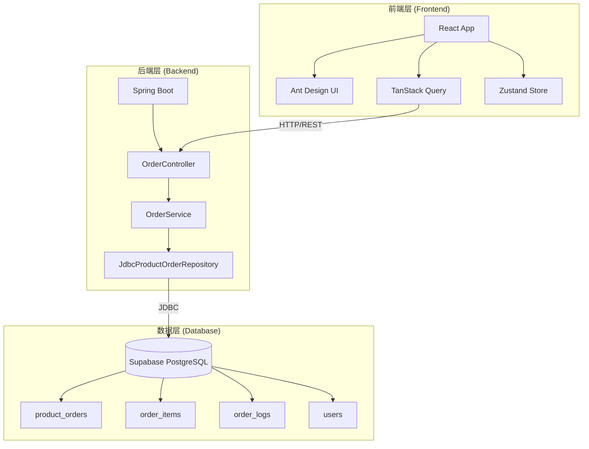
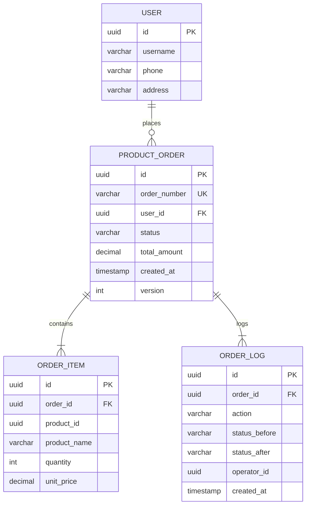
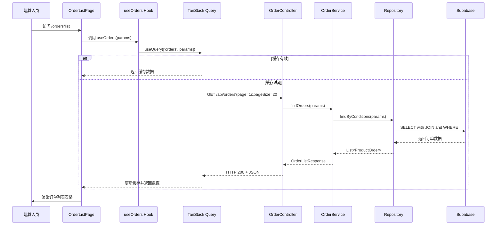
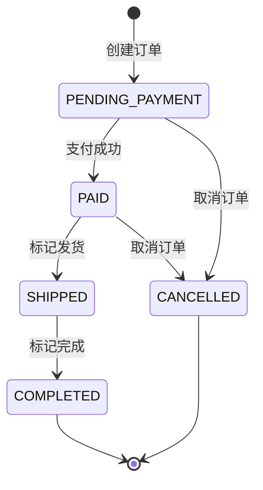
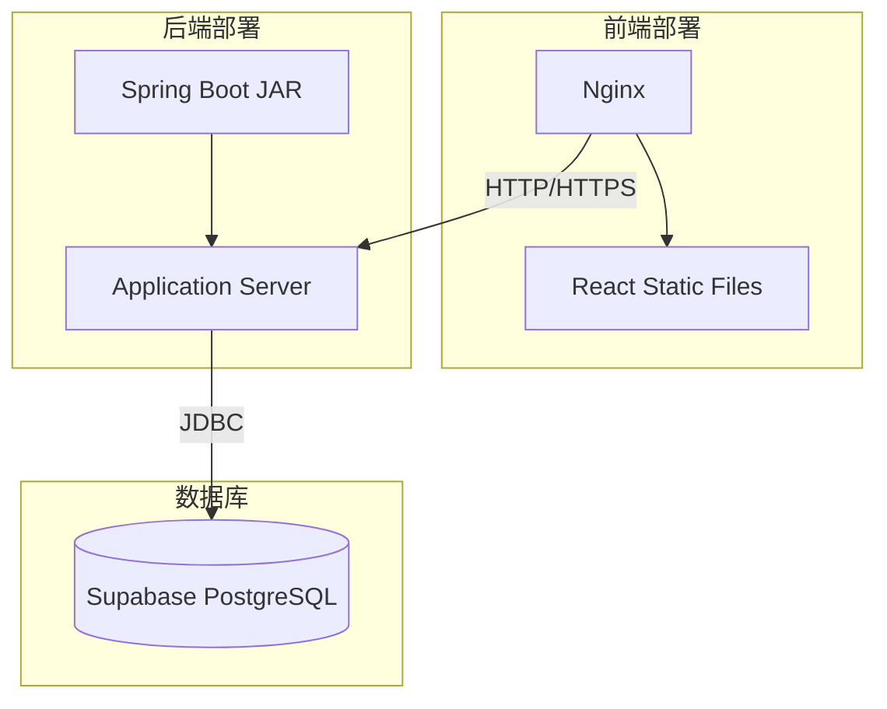

# 商品订单列表查看与管理 - 技术设计文档 (TDD)

<!-- DOC-WRITER: AUTO-GENERATED START -->
**文档版本**: 1.0.0
**功能标识**: O001-product-order-list
**创建日期**: 2025-12-27
**作者**: Cinema Business Center Platform Team
**状态**: 已实现

---

## 文档变更历史

| 版本 | 日期 | 作者 | 变更说明 |
|------|------|------|----------|
| 1.0.0 | 2025-12-27 | System | 初始版本 - 完整技术设计 |

---

## 1. 需求背景与目标

### 1.1 业务背景

影院商品管理中台需要为运营人员提供完整的商品订单管理能力。目前系统缺乏订单查看和管理功能,运营人员无法高效处理订单,影响业务运营效率。

**痛点**:
- 运营人员无法查看订单列表,不了解订单全貌
- 缺乏订单筛选功能,在大量订单中定位目标订单困难
- 无法查看订单详细信息,处理订单问题效率低
- 缺乏订单状态管理功能,无法及时更新订单流转状态
- 没有操作日志记录,无法追溯订单处理历史

### 1.2 项目目标

**功能目标**:
- 提供订单列表查看功能,支持分页展示
- 提供多维度筛选功能(状态、时间、用户)
- 提供订单详情查看功能,展示完整信息
- 提供订单状态管理功能(发货、完成、取消)
- 记录完整的订单操作日志

**性能目标**:
- 订单列表首屏加载时间 < 3 秒
- 订单筛选操作响应时间 < 1 秒
- 订单详情页加载时间 < 2 秒
- 订单状态变更响应时间 < 1 秒
- 支持 50000+ 条订单数据,分页翻页 ≤ 2 秒
- 并发支持 100 个运营人员同时操作

**质量目标**:
- 关键业务流程测试覆盖率 100%
- 系统可用性 ≥ 99.9%
- 订单状态变更成功率 ≥ 99.9%

### 1.3 范围边界

**包含**:
- B端 订单管理后台(React + Ant Design)
- 后端 API 服务(Spring Boot + Supabase)
- 数据库表结构设计和迁移
- 单元测试和 E2E 测试

**不包含**:
- C端 用户下单流程(属于其他模块)
- 订单支付功能(属于支付模块)
- 订单退款/售后功能(未来版本)
- 预约订单管理(属于 U/RSV 模块)

---

## 2. 技术选型与决策

### 2.1 技术栈选择

#### 前端技术栈(B端 管理后台)

| 技术 | 版本 | 选型理由 |
|------|------|----------|
| React | 19.2.0 | 项目标准框架,组件化开发,生态成熟 |
| TypeScript | 5.9.3 | 类型安全,提升代码质量和可维护性 |
| Ant Design | 6.1.0 | B端 UI 组件库,组件丰富,符合设计规范 |
| Zustand | 5.0.9 | 轻量级状态管理,适合客户端 UI 状态 |
| TanStack Query | 5.90.12 | 服务器状态管理,智能缓存和数据同步 |
| React Router | 7.10.1 | 前端路由,支持嵌套路由和动态路由 |
| React Hook Form | 7.68.0 | 高性能表单处理,与 Zod 集成良好 |
| Zod | 4.1.13 | 数据验证,TypeScript 类型推导 |
| MSW | 2.12.4 | Mock API 数据,支持本地开发和测试 |
| dayjs | 1.11.19 | 日期处理,轻量级替代 moment.js |
| Vite | 6.0.7 | 构建工具,快速冷启动和热更新 |

#### 后端技术栈

| 技术 | 版本 | 选型理由 |
|------|------|----------|
| Java | 21 | 项目标准语言,性能优秀,生态成熟 |
| Spring Boot | 3.x | 企业级框架,开发效率高,功能完善 |
| Supabase | - | PostgreSQL 数据库,提供认证和存储 |
| JdbcTemplate | Spring 内置 | 轻量级数据访问,避免 JPA 复杂性 |
| Jackson | Spring 内置 | JSON 序列化/反序列化 |
| Bean Validation | Spring 内置 | 输入数据校验 |
| SLF4J + Logback | Spring 内置 | 日志记录 |

#### 测试框架

| 技术 | 用途 |
|------|------|
| Vitest | 前端单元测试 |
| Playwright | 前端 E2E 测试 |
| Testing Library | 前端组件测试 |
| JUnit 5 | 后端单元测试 |
| Spring Boot Test | 后端集成测试 |

### 2.2 架构决策

#### ADR-001: 前端使用 React + Ant Design

**决策**: B端 管理后台使用 React 19.2.0 + Ant Design 6.1.0

**理由**:
- 符合项目宪章规定的 B端 技术栈
- Ant Design 提供丰富的 B端 组件,开发效率高
- 团队熟悉 React 生态,学习成本低

**替代方案**: Vue + Element UI(被否决,不符合项目规范)

---

#### ADR-002: 后端数据访问使用 JdbcTemplate

**决策**: 使用 Spring JdbcTemplate 而非 JPA/Hibernate

**理由**:
- 订单查询需要复杂的动态 SQL(多维度筛选)
- JdbcTemplate 更轻量,性能更好
- 避免 JPA N+1 查询问题
- 团队对 SQL 熟悉,控制力更强

**替代方案**: Spring Data JPA(被否决,复杂查询性能较差)

---

#### ADR-003: 订单号使用日期+随机字符格式

**决策**: 订单号格式为 `ORD + YYYYMMDD + 6位随机字母数字`

**理由**:
- 包含日期信息,便于追溯和分析
- 随机字符确保唯一性,避免冲突
- 格式固定,易于识别和验证
- 长度适中,便于展示和存储

**替代方案**: UUID(被否决,不包含日期信息,不便于追溯)

---

#### ADR-004: 手机号脱敏保留前3位+后4位

**决策**: 手机号脱敏格式为 `138****8000`(前3位+4位星号+后4位)

**理由**:
- 符合隐私保护要求,保护用户敏感信息
- 保留前3位可识别运营商,后4位便于用户确认
- 中间4位脱敏足以保护隐私

**替代方案**: 只显示后4位(被否决,信息量不足)

---

#### ADR-005: 使用乐观锁防止并发冲突

**决策**: 使用 version 字段实现乐观锁机制

**理由**:
- 订单状态变更是低频操作,乐观锁性能更好
- 避免数据库行锁,提升并发能力
- 冲突时可友好提示用户刷新重试

**替代方案**: 悲观锁(被否决,性能较差)

---

#### ADR-006: 默认显示近30天订单

**决策**: 订单列表未筛选时默认显示近30天订单

**理由**:
- 平衡性能和实用性,避免加载过多数据
- 运营人员通常关注近期订单
- 历史订单可通过时间筛选查看

**替代方案**: 显示全部订单(被否决,性能较差)

---

## 3. 系统架构设计

### 3.1 整体架构图



### 3.2 前端架构

#### 3.2.1 目录结构

```
frontend/src/
├── features/
│   └── order-management/          # 订单管理功能模块
│       ├── components/             # 功能专属组件
│       │   ├── OrderList.tsx      # 订单列表组件
│       │   ├── OrderFilter.tsx    # 订单筛选器组件
│       │   ├── OrderDetail.tsx    # 订单详情组件
│       │   ├── OrderStatusBadge.tsx # 订单状态标签
│       │   └── OrderActions.tsx   # 订单操作按钮
│       ├── hooks/                  # 自定义 Hooks
│       │   ├── useOrders.ts       # 订单列表查询 Hook
│       │   ├── useOrderDetail.ts  # 订单详情查询 Hook
│       │   └── useUpdateOrderStatus.ts # 订单状态更新 Hook
│       ├── services/               # API 服务
│       │   └── orderService.ts    # 订单相关 API 调用
│       ├── types/                  # TypeScript 类型定义
│       │   └── order.ts           # 订单类型定义
│       └── utils/                  # 工具函数
│           ├── maskPhone.ts       # 手机号脱敏
│           └── formatOrderStatus.ts # 订单状态格式化
├── pages/
│   └── orders/
│       ├── OrderListPage.tsx      # 订单列表页
│       └── OrderDetailPage.tsx    # 订单详情页
└── mocks/
    ├── handlers/
    │   └── orderHandlers.ts       # MSW Mock 处理器
    └── data/
        └── orders.ts              # Mock 订单数据
```

#### 3.2.2 组件分层

遵循原子设计理念:

- **Atoms(原子组件)**: OrderStatusBadge(订单状态标签)
- **Molecules(分子组件)**: OrderFilter(筛选器)、OrderActions(操作按钮)
- **Organisms(有机体)**: OrderList(订单列表)、OrderDetail(订单详情)
- **Templates(模板)**: PageLayout(页面布局)
- **Pages(页面)**: OrderListPage、OrderDetailPage

#### 3.2.3 状态管理策略

```typescript
// 客户端状态 (Zustand) - UI 状态
interface AppState {
  sidebarCollapsed: boolean
  toggleSidebar: () => void
}

// 服务器状态 (TanStack Query) - 订单数据
const useOrders = (params: OrderQueryParams) => {
  return useQuery({
    queryKey: ['orders', params],
    queryFn: () => orderService.fetchOrders(params),
    staleTime: 30 * 1000, // 30 秒缓存
    keepPreviousData: true // 翻页时保留旧数据
  })
}
```

### 3.3 后端架构

#### 3.3.1 分层架构

```
backend/src/main/java/com/cinema/order/
├── controller/           # API 控制器层
│   └── OrderController.java
├── service/              # 业务逻辑层
│   ├── OrderService.java
│   └── ExportService.java (未来版本)
├── repository/           # 数据访问层
│   └── JdbcProductOrderRepository.java
├── mapper/               # 对象映射层
│   └── OrderMapper.java
├── domain/               # 领域模型
│   ├── ProductOrder.java
│   ├── OrderItem.java
│   ├── OrderLog.java
│   └── OrderStatus.java (枚举)
├── dto/                  # 数据传输对象
│   ├── ProductOrderDTO.java
│   ├── OrderQueryParams.java
│   └── UpdateStatusRequest.java
└── exception/            # 异常定义
    ├── OrderNotFoundException.java
    ├── InvalidOrderStatusTransitionException.java
    ├── OrderOptimisticLockException.java
    └── CancelReasonRequiredException.java
```

#### 3.3.2 职责划分

| 层级 | 职责 | 示例 |
|------|------|------|
| Controller | 接收 HTTP 请求,参数校验,响应封装 | OrderController.getOrders() |
| Service | 业务逻辑,状态机校验,事务管理 | OrderService.updateOrderStatus() |
| Repository | 数据库 CRUD 操作,SQL 执行 | JdbcProductOrderRepository.findByConditions() |
| Mapper | 对象转换,数据脱敏,字段计算 | OrderMapper.toDTO() |
| Domain | 领域模型,业务规则 | OrderStatus.canTransitionTo() |

### 3.4 数据库架构

#### 3.4.1 ER 关系图



#### 3.4.2 表结构设计

详见 [数据库设计文档](docs/database/O001-product-order-list.md)

---

## 4. 核心模块设计

### 4.1 订单列表查询模块

#### 4.1.1 流程图



#### 4.1.2 核心代码

**前端 Hook**:

```typescript
/**
 * @spec O001-product-order-list
 * 订单列表查询 Hook
 */
export const useOrders = (params: OrderQueryParams) => {
  return useQuery({
    queryKey: ['orders', params],
    queryFn: async () => {
      const response = await orderService.fetchOrders(params)
      return response.data
    },
    staleTime: 30 * 1000, // 30 秒缓存
    keepPreviousData: true // 翻页时保留旧数据
  })
}
```

**后端 Service**:

```java
/**
 * @spec O001-product-order-list
 * 查询订单列表(支持筛选和分页)
 */
public OrderListResponse findOrders(OrderQueryParams params) {
    logger.info("Querying orders with params: status={}, page={}, pageSize={}",
        params.getStatus(), params.getPage(), params.getPageSize());

    JdbcProductOrderRepository.PageResult<ProductOrder> pageResult =
        repository.findByConditions(params);

    List<ProductOrderDTO> orderDTOs = mapper.toDTOList(pageResult.getData());

    return OrderListResponse.success(
        orderDTOs,
        pageResult.getTotal(),
        params.getPage(),
        params.getPageSize(),
        "查询成功"
    );
}
```

**后端 Repository**:

```java
/**
 * @spec O001-product-order-list
 * 动态 SQL 构建和查询
 */
public PageResult<ProductOrder> findByConditions(OrderQueryParams params) {
    StringBuilder sql = new StringBuilder(
        "SELECT * FROM product_orders WHERE 1=1"
    );
    List<Object> args = new ArrayList<>();

    // 状态筛选
    if (params.getStatus() != null) {
        sql.append(" AND status = ?");
        args.add(params.getStatus().name());
    }

    // 时间范围筛选
    if (params.getStartDate() != null) {
        sql.append(" AND created_at >= ?");
        args.add(params.getStartDate());
    }

    // 分页
    sql.append(" ORDER BY created_at DESC LIMIT ? OFFSET ?");
    args.add(params.getPageSize());
    args.add((params.getPage() - 1) * params.getPageSize());

    return jdbcTemplate.query(sql.toString(), productOrderRowMapper, args.toArray());
}
```

### 4.2 订单状态管理模块

#### 4.2.1 状态机设计



**状态转换规则**:

```java
/**
 * @spec O001-product-order-list
 * 订单状态枚举
 */
public enum OrderStatus {
    PENDING_PAYMENT,
    PAID,
    SHIPPED,
    COMPLETED,
    CANCELLED;

    /**
     * 判断是否可以转换到目标状态
     */
    public boolean canTransitionTo(OrderStatus targetStatus) {
        return switch (this) {
            case PENDING_PAYMENT -> targetStatus == PAID || targetStatus == CANCELLED;
            case PAID -> targetStatus == SHIPPED || targetStatus == CANCELLED;
            case SHIPPED -> targetStatus == COMPLETED;
            case COMPLETED, CANCELLED -> false; // 终态不可变更
        };
    }
}
```

#### 4.2.2 乐观锁机制

```java
/**
 * @spec O001-product-order-list
 * 乐观锁更新订单状态
 */
@Transactional
public ProductOrderDTO updateOrderStatus(String orderId, UpdateStatusRequest request) {
    // 1. 查询订单
    ProductOrder order = repository.findById(UUID.fromString(orderId));

    // 2. 版本检查
    if (!order.getVersion().equals(request.getVersion())) {
        throw new OrderOptimisticLockException(
            orderId,
            request.getVersion(),
            order.getVersion()
        );
    }

    // 3. 状态转换验证
    if (!order.getStatus().canTransitionTo(request.getStatus())) {
        throw new InvalidOrderStatusTransitionException(
            orderId,
            order.getStatus(),
            request.getStatus()
        );
    }

    // 4. 更新订单状态
    order.setStatus(request.getStatus());

    // 5. 执行更新(version + 1)
    int updatedRows = repository.updateOrderStatus(order);

    if (updatedRows == 0) {
        // 乐观锁冲突
        throw new OrderOptimisticLockException(orderId, request.getVersion(), order.getVersion());
    }

    // 6. 记录操作日志
    repository.insertOrderLog(createOrderLog(order, request));

    return mapper.toDTO(order);
}
```

**数据库更新 SQL**:

```sql
UPDATE product_orders
SET
    status = ?,
    shipped_time = ?,
    version = version + 1,
    updated_at = NOW()
WHERE
    id = ?
    AND version = ?  -- 乐观锁关键条件
```

### 4.3 手机号脱敏模块

#### 4.3.1 脱敏规则

```typescript
/**
 * @spec O001-product-order-list
 * 前端手机号脱敏工具
 */
export const maskPhone = (phone: string): string => {
  if (!phone || phone.length !== 11) {
    return phone
  }
  return `${phone.slice(0, 3)}****${phone.slice(7)}`
}

// 示例:
// maskPhone('13800138000') => '138****8000'
```

```java
/**
 * @spec O001-product-order-list
 * 后端手机号脱敏工具
 */
public String maskPhone(String phone) {
    if (phone == null || phone.length() != 11) {
        return phone;
    }
    return phone.substring(0, 3) + "****" + phone.substring(7);
}
```

#### 4.3.2 权限控制(未来版本)

```java
// 未来版本支持基于角色的脱敏控制
public String maskPhoneByRole(String phone, String userRole) {
    if ("ADMIN".equals(userRole)) {
        return phone; // 管理员查看完整手机号
    }
    return maskPhone(phone); // 普通运营人员查看脱敏手机号
}
```

---

## 5. 数据模型设计

详见 [数据库设计文档](docs/database/O001-product-order-list.md)

### 5.1 核心实体

- **ProductOrder(商品订单)**: id, order_number, user_id, status, total_amount, version
- **OrderItem(订单商品项)**: id, order_id, product_id, product_name, quantity, unit_price
- **OrderLog(订单日志)**: id, order_id, action, status_before, status_after, operator_id
- **User(用户)**: id, username, phone, address

### 5.2 索引设计

```sql
-- 订单号唯一索引
CREATE UNIQUE INDEX idx_order_number ON product_orders(order_number);

-- 复合索引(状态 + 创建时间) - 加速筛选查询
CREATE INDEX idx_orders_status_created_at ON product_orders(status, created_at DESC);

-- 用户索引 - 加速按用户查询
CREATE INDEX idx_orders_user_id ON product_orders(user_id);

-- 订单项索引 - 加速 JOIN 查询
CREATE INDEX idx_items_order_id ON order_items(order_id);
```

---

## 6. 接口设计

详见 [API 设计文档](docs/api/O001-product-order-list.md)

### 6.1 API 端点列表

| 端点 | 方法 | 说明 | 用户故事 |
|------|------|------|---------|
| `/api/orders` | GET | 订单列表查询 | US1, US2 |
| `/api/orders/{id}` | GET | 订单详情查询 | US3 |
| `/api/orders/{id}/status` | PUT | 更新订单状态 | US4 |

### 6.2 响应格式标准

**成功响应**:

```json
{
  "success": true,
  "data": [...],
  "total": 100,
  "page": 1,
  "pageSize": 20,
  "message": "查询成功",
  "timestamp": "2025-12-27T15:00:00Z"
}
```

**错误响应**:

```json
{
  "success": false,
  "error": "ORD_NTF_001",
  "message": "订单不存在",
  "details": { "orderId": "xxx" },
  "timestamp": "2025-12-27T15:00:00Z"
}
```

---

## 7. 非功能性需求

### 7.1 性能需求

| 指标 | 标准 | 实现方式 |
|------|------|----------|
| 订单列表加载 | < 3 秒 | 数据库索引 + 分页查询 |
| 订单筛选响应 | < 1 秒 | 数据库索引 + TanStack Query 缓存 |
| 订单详情加载 | < 2 秒 | 主键查询 + JOIN 优化 |
| 状态变更响应 | < 1 秒 | 单条更新 + 事务优化 |
| 并发支持 | 100 用户 | 无状态设计 + 数据库连接池 |
| 大数据量支持 | 50000+ 订单 | 分页 + 索引 + 数据归档 |

### 7.2 安全需求

| 安全项 | 实现方式 |
|--------|----------|
| 认证 | JWT Token(所有 API 接口需认证) |
| 授权 | 基于角色的权限控制(RBAC) |
| 数据脱敏 | 手机号脱敏 `138****8000` |
| 输入校验 | Zod(前端) + Bean Validation(后端) |
| SQL 注入防护 | 参数化查询(PreparedStatement) |
| XSS 防护 | 避免 dangerouslySetInnerHTML |
| 审计日志 | 所有状态变更操作记录到 order_logs |

### 7.3 可用性需求

| 需求 | 标准 | 实现方式 |
|------|------|----------|
| 系统可用性 | ≥ 99.9% | 健康检查 + 自动重启 |
| 错误恢复 | 自动重试 | TanStack Query retry 机制 |
| 友好提示 | 所有错误有明确提示 | 错误信息本地化 |
| 空状态处理 | 显示空状态提示 | Empty 组件 |
| 键盘导航 | 支持键盘操作 | aria-label + tabIndex |
| 色彩对比度 | ≥ 4.5:1 | WCAG 2.1 AA 标准 |

### 7.4 可扩展性需求

- 预留批量操作接口(批量发货、批量导出)
- 预留订单备注功能
- 预留订单退款/售后流程
- 预留物流跟踪集成接口
- 预留订单自动化流转规则配置

---

## 8. 风险评估与缓解

### 8.1 技术风险

| 风险 | 影响 | 概率 | 缓解措施 |
|------|------|------|----------|
| 数据库性能瓶颈 | 高 | 中 | 数据库索引优化 + 分页查询 + 数据归档 |
| 并发冲突 | 中 | 中 | 乐观锁机制 + 友好提示 + 自动重试 |
| 大数据量导出超时 | 中 | 低 | 限制导出数量(10000条) + 流式生成 |
| 前端缓存不一致 | 低 | 低 | TanStack Query 自动刷新 + staleTime 设置 |

### 8.2 业务风险

| 风险 | 影响 | 概率 | 缓解措施 |
|------|------|------|----------|
| 订单状态错误流转 | 高 | 低 | 状态机严格校验 + 操作日志记录 |
| 误操作取消订单 | 中 | 中 | 取消原因必填 + 二次确认 |
| 手机号泄露 | 高 | 低 | 前后端双重脱敏 + 权限控制 |

### 8.3 安全风险

| 风险 | 影响 | 概率 | 缓解措施 |
|------|------|------|----------|
| SQL 注入攻击 | 高 | 低 | 参数化查询 + 输入校验 |
| XSS 攻击 | 中 | 低 | 避免 innerHTML + CSP 头 |
| CSRF 攻击 | 中 | 低 | CSRF Token + SameSite Cookie |

---

## 9. 部署架构

### 9.1 部署架构图



### 9.2 部署配置

**前端部署**:
```bash
# 构建
npm run build

# 部署到 Nginx
cp -r dist/* /var/www/html/
```

**后端部署**:
```bash
# 打包
mvn clean package

# 运行
java -jar target/cinema-backend.jar
```

**数据库迁移**:
```bash
# Flyway 自动迁移
mvn flyway:migrate
```

---

## 10. 测试策略

### 10.1 测试类型

| 测试类型 | 框架 | 覆盖范围 | 目标覆盖率 |
|---------|------|---------|-----------|
| 单元测试 | Vitest, JUnit 5 | 工具函数、Hook、Service | ≥ 80% |
| 组件测试 | Testing Library | React 组件 | ≥ 70% |
| 集成测试 | Spring Boot Test | API 端点 + 数据库 | 100% |
| E2E 测试 | Playwright | 用户流程 | 4 个用户故事 100% |

### 10.2 关键测试场景

**单元测试**:
- 手机号脱敏: `maskPhone('13800138000')` => `'138****8000'`
- 订单号生成: 格式校验 `ORD + YYYYMMDD + 6位随机`
- 状态转换校验: `PAID.canTransitionTo(SHIPPED)` => `true`
- 状态转换校验: `COMPLETED.canTransitionTo(CANCELLED)` => `false`

**E2E 测试**:
- US1: 访问 `/orders/list`,查看订单列表,翻页
- US2: 应用筛选条件(状态、时间、搜索),查看筛选结果,重置筛选
- US3: 点击订单,查看订单详情,验证手机号脱敏
- US4: 标记发货,验证状态更新,查看日志记录

---

## 11. 监控与运维

### 11.1 监控指标

| 指标 | 说明 | 阈值 |
|------|------|------|
| API 响应时间 | 订单列表查询响应时间 | < 1 秒 |
| 错误率 | API 请求失败率 | < 0.1% |
| 数据库连接数 | 活跃连接数 | < 80% 连接池 |
| 内存使用率 | JVM 堆内存使用 | < 80% |

### 11.2 日志规范

```java
// INFO 级别 - 正常业务操作
logger.info("Querying orders: status={}, page={}", status, page);

// WARN 级别 - 业务异常
logger.warn("Order not found: orderId={}", orderId);

// ERROR 级别 - 系统错误
logger.error("Failed to update order status: orderId={}", orderId, e);
```

### 11.3 告警规则

- API 错误率 > 1%: 发送告警邮件
- 响应时间 > 3 秒: 发送告警邮件
- 数据库连接数 > 80%: 发送告警邮件

---

## 12. 版本规划

| 版本 | 功能 | 预计发布时间 |
|------|------|-------------|
| v1.0.0 | MVP - 订单列表、筛选、详情、状态管理 | 2025-12-27(已发布) |
| v1.1.0 | 批量操作(批量发货、批量导出) | 2026-01-15 |
| v1.2.0 | 订单备注功能 | 2026-02-01 |
| v1.3.0 | 订单退款/售后流程 | 2026-03-01 |
| v2.0.0 | 物流跟踪集成 | 2026-04-01 |

---

## 13. 相关文档

- [功能规格说明](/specs/O001-product-order-list/spec.md)
- [实现计划](/specs/O001-product-order-list/plan.md)
- [数据模型设计](/specs/O001-product-order-list/data-model.md)
- [开发任务拆解](/specs/O001-product-order-list/tasks.md)
- [产品文档](/docs/product/order-management/O001-product-order-list.md)
- [API 设计文档](/docs/api/O001-product-order-list.md)
- [数据库设计文档](/docs/database/O001-product-order-list.md)
- [用户操作手册](/docs/manual/order-management/O001-product-order-list.md)

---

<!-- DOC-WRITER: AUTO-GENERATED END -->

**文档生成信息**:
- 生成工具: doc-writer skill v2.1.0
- 生成时间: 2025-12-27
- 数据来源: spec.md, plan.md, data-model.md, tasks.md
