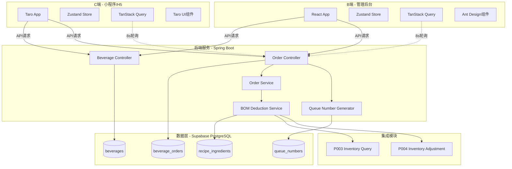
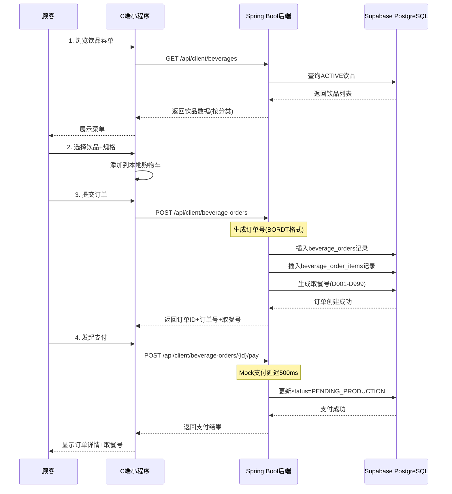
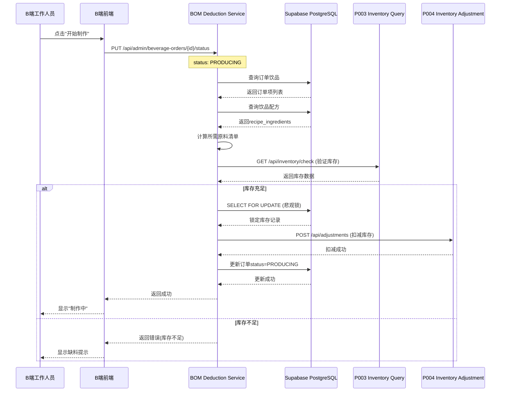
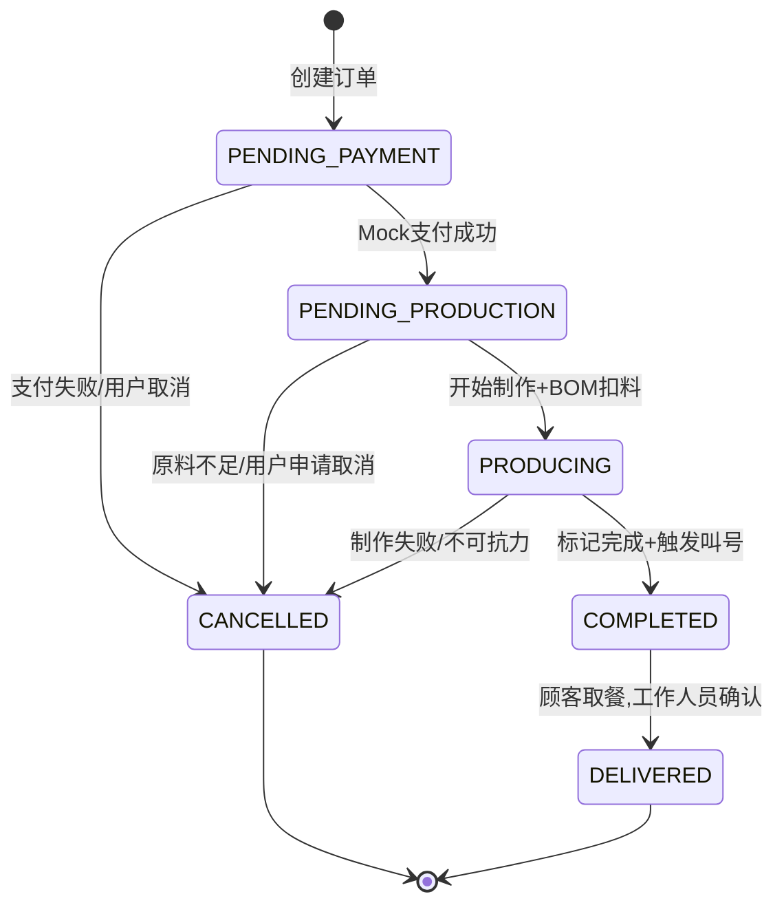
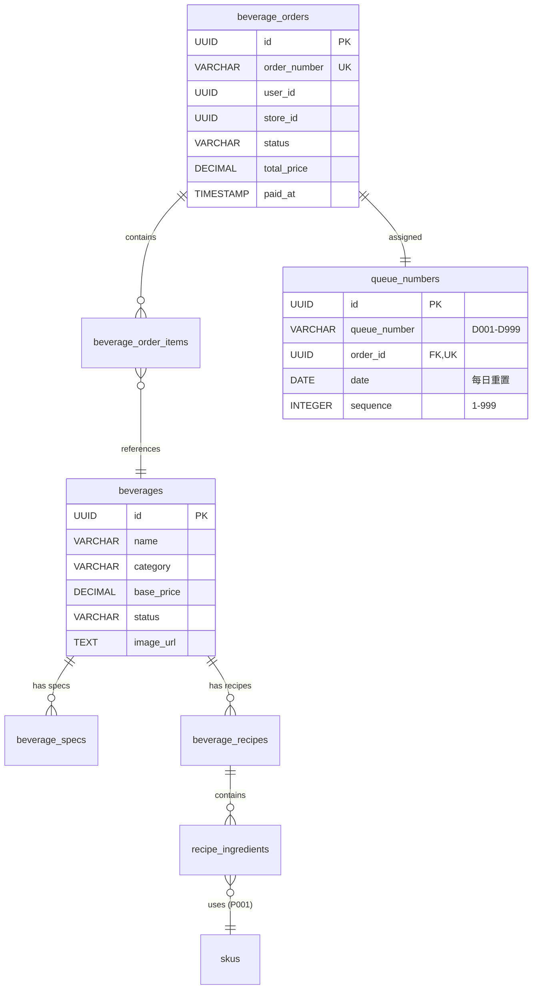

# 技术设计文档 (TDD) - 饮品订单创建与出品管理

**Feature ID**: O003-beverage-order
**System**: 商品管理中台
**Module**: 订单管理 > 饮品订单
**Version**: 1.0.0
**Date**: 2025-12-28
**Status**: Approved
**Author**: Claude (doc-writer skill)

---

## 变更历史

| 版本 | 日期 | 变更说明 | 作者 |
|------|------|---------|------|
| 1.0.0 | 2025-12-28 | 初始版本 | Claude |

---

## 目录

1. [需求背景与目标](#需求背景与目标)
2. [技术选型与决策](#技术选型与决策)
3. [系统架构设计](#系统架构设计)
4. [核心模块设计](#核心模块设计)
5. [数据模型设计](#数据模型设计)
6. [接口设计](#接口设计)
7. [非功能性需求](#非功能性需求)
8. [风险评估与缓解](#风险评估与缓解)

---

## 1. 需求背景与目标

### 1.1 业务背景

影院吧台饮品销售场景需要支持顾客在小程序上自助点单、在线支付、取餐号叫号，同时支持B端工作人员接收订单、管理出品流程、BOM自动扣料。当前缺乏完整的饮品订单管理系统，导致:

- 顾客排队等待时间长，点单效率低
- 工作人员手工记录订单易出错
- 原料库存扣减不及时，导致缺料或浪费
- 叫号系统依赖人工，容易遗漏或重复

### 1.2 项目目标

**核心目标**:
1. 提供C端小程序饮品点单功能,支持菜单浏览、规格选择、在线支付
2. 提供B端管理后台出品管理功能,支持订单接收、状态管理、BOM扣料、叫号通知
3. 实现订单全生命周期管理(待支付 → 待制作 → 制作中 → 已完成 → 已交付)
4. 集成库存管理模块,实现BOM自动扣料和库存验证

**性能目标**:
- 菜单页面首屏加载时间 ≤ 2秒
- 订单状态更新延迟 ≤ 3秒
- 支持高峰期100个并发订单

**可用性目标**:
- 订单提交成功率 ≥ 95%
- BOM扣料准确率 = 100%
- 叫号通知到达率 ≥ 95%

### 1.3 范围边界

**包含**:
- ✅ C端小程序饮品下单流程
- ✅ B端管理后台出品管理
- ✅ BOM自动扣料(集成P003/P004)
- ✅ Mock支付和Mock叫号(MVP阶段)
- ✅ 订单历史查询与统计

**不包含**:
- ❌ 外卖配送功能
- ❌ 真实微信支付集成(Phase 2)
- ❌ 真实TTS语音叫号(Phase 2)
- ❌ WebSocket实时推送(Phase 2)
- ❌ 会员积分/优惠券

---

## 2. 技术选型与决策

### 2.1 技术栈

#### 前端技术栈

| 层次 | C端(小程序) | B端(管理后台) |
|-----|------------|-------------|
| **框架** | Taro 3.x + React | React 19.2.0 |
| **UI组件** | Taro UI / NutUI | Ant Design 6.1.0 |
| **状态管理** | Zustand 5.0.9 | Zustand 5.0.9 |
| **服务器状态** | TanStack Query 5.90.12 | TanStack Query 5.90.12 |
| **路由** | Taro Router | React Router 7.10.1 |
| **类型系统** | TypeScript 5.9.3 | TypeScript 5.9.3 |

#### 后端技术栈

| 技术 | 版本 | 用途 |
|-----|------|------|
| Java | 21 | 运行时 |
| Spring Boot | 3.x | 应用框架 |
| Supabase | Latest | 数据库/认证/存储 |
| PostgreSQL | 15+ | 关系数据库 |
| Lombok | Latest | 简化Java代码 |

### 2.2 关键技术决策

#### Decision 1: Mock Payment (MVP简化)

**问题**: MVP阶段是否需要接入真实微信支付?

**决策**: 使用Mock支付,500ms固定延迟模拟支付网关,100%成功率

**理由**:
- MVP阶段优先验证业务流程,降低接入成本
- 真实微信支付需要商户资质、合同签订、联调测试(≥2周)
- Mock支付足以验证订单创建、状态流转、BOM扣料等核心逻辑

**替代方案被拒绝**:
- 方案A(接入真实微信支付): 接入周期长,增加MVP风险
- 方案B(接入测试支付沙箱): 需要微信开发者资质,仍有接入成本

**未来演进**: Phase 2接入微信支付JSAPI

---

#### Decision 2: Polling Notifications (简化实时推送)

**问题**: B端订单通知和C端状态更新如何实现实时性?

**决策**: 使用8秒轮询(TanStack Query `refetchInterval: 8000`)

**理由**:
- MVP阶段订单并发量低(< 100单/小时),轮询开销可接受
- 实现简单,无需维护WebSocket连接或SSE服务端
- TanStack Query内置轮询支持,代码量小

**替代方案被拒绝**:
- 方案A(WebSocket): 需要服务端WebSocket支持、连接管理、心跳机制,复杂度高
- 方案B(SSE Server-Sent Events): 浏览器兼容性问题,部分旧版Safari不支持

**未来演进**: Phase 2升级为WebSocket实时推送

---

#### Decision 3: BOM Deduction Integration (真实库存扣减)

**问题**: BOM扣料是使用Mock数据还是集成真实库存模块?

**决策**: 集成P003(库存查询)和P004(库存调整)真实API,使用悲观锁(`SELECT FOR UPDATE`)

**理由**:
- BOM扣料是核心业务逻辑,Mock数据无法验证库存一致性
- P003/P004模块已实现,集成成本可控
- 悲观锁防止并发订单扣减同一原料导致库存负数

**实现细节**:
```java
// BOMDeductionService.java
@Transactional
public void deductMaterials(Order order) {
    // 1. 悲观锁查询库存
    Inventory inventory = inventoryRepo
        .findBySkuIdAndStoreIdForUpdate(skuId, storeId); // SELECT FOR UPDATE

    // 2. 验证库存充足性
    if (inventory.getAvailableQty() < requiredQty) {
        throw new InsufficientInventoryException();
    }

    // 3. 调用P004扣减API
    inventoryService.adjustInventory(...);
}
```

**替代方案被拒绝**:
- 方案A(乐观锁): 高并发场景下重试次数过多,用户体验差
- 方案B(本地库存): 数据不一致风险,无法与P003/P004统一管理

---

#### Decision 4: Queue Number Generation (取餐号生成策略)

**问题**: 如何生成唯一且每日重置的取餐号?

**决策**: 格式D001-D999,每日00:00重置,使用PostgreSQL Advisory Lock保证并发安全

**理由**:
- D前缀 + 三位数字易于播报和识别
- 每日重置避免号码过大,符合实际场景
- Advisory Lock无需额外中间件(Redis),简化架构

**实现细节**:
```java
// QueueNumberGenerator.java
@Transactional
public String generate(UUID storeId) {
    LocalDate today = LocalDate.now();
    long lockKey = (storeId + today.toString()).hashCode();

    // 获取事务级Advisory Lock
    jdbcTemplate.execute("SELECT pg_advisory_xact_lock(" + lockKey + ")");

    // 查询当日最大序号
    Integer maxSeq = queueRepo.findMaxSequenceByStoreAndDate(storeId, today);
    int nextSeq = (maxSeq == null) ? 1 : maxSeq + 1;

    if (nextSeq > 999) {
        nextSeq = 1; // 循环使用
    }

    return String.format("D%03d", nextSeq);
}
```

**替代方案被拒绝**:
- 方案A(Redis INCR): 需要引入Redis,增加运维成本
- 方案B(UUID): 不便于语音播报,用户体验差

---

#### Decision 5: Taro Multi-Platform (多端统一)

**问题**: C端小程序如何兼容微信、支付宝、H5等多端?

**决策**: 使用Taro框架统一开发,优先适配微信小程序和H5

**理由**:
- Taro官方支持微信/支付宝小程序、H5、React Native等10+平台
- 一套代码编译多端,减少重复开发
- Taro UI组件库提供跨平台UI一致性

**平台适配策略**:
```typescript
// 条件编译处理平台差异
if (process.env.TARO_ENV === 'weapp') {
  // 微信小程序专属逻辑
  Taro.requestPayment({ ... });
} else if (process.env.TARO_ENV === 'h5') {
  // H5专属逻辑
  window.location.href = paymentUrl;
}
```

**替代方案被拒绝**:
- 方案A(原生小程序开发): 需要分别开发微信/支付宝版本,维护成本高
- 方案B(uni-app): 团队已选择Taro,避免技术栈分裂

---

### 2.3 依赖模块

| 模块 | 用途 | 优先级 | 说明 |
|-----|------|--------|------|
| P001-sku-master-data | SKU主数据 | P0 | 必须 - recipe_ingredients.sku_id外键依赖 |
| P003-inventory-query | 库存查询 | P0 | 必须 - BOM扣料前验证库存 |
| P004-inventory-adjustment | 库存调整 | P0 | 必须 - 执行BOM扣料 |
| Supabase Instance | 数据库/认证/存储 | P0 | 必须 - 所有持久化数据 |
| 认证系统 | 用户Token管理 | P0 | 必须 - API鉴权 |

---

## 3. 系统架构设计

### 3.1 整体架构图



### 3.2 分层架构

#### C端 (Taro)

```
pages/ (页面层)
  ├── beverage-menu/ (菜单浏览)
  ├── beverage-detail/ (饮品详情)
  ├── beverage-order-cart/ (订单确认)
  └── beverage-my-orders/ (我的订单)

components/ (组件层)
  ├── BeverageCard (饮品卡片)
  ├── SpecSelector (规格选择器)
  └── LoadingSpinner (加载状态)

hooks/ (数据层)
  ├── useBeverages (饮品列表)
  ├── useCreateOrder (创建订单)
  └── useMockPayment (Mock支付)

stores/ (状态管理)
  ├── beverageStore (饮品状态)
  └── orderCartStore (订单购物车)

services/ (API服务)
  └── beverageService (API封装)
```

#### B端 (React + Ant Design)

```
features/beverage-order-management/
  ├── pages/
  │   ├── PendingOrdersPage (待处理订单)
  │   └── SalesStatisticsPage (营业统计)
  ├── components/
  │   ├── OrderCard (订单卡片)
  │   ├── BOMList (BOM清单)
  │   └── OrderStatusBadge (状态徽章)
  ├── hooks/
  │   ├── usePendingOrders (订单轮询)
  │   └── useUpdateOrderStatus (状态更新)
  ├── stores/
  │   └── orderStore (订单状态)
  └── services/
      └── beverageOrderApi (API封装)
```

#### 后端 (Spring Boot)

```
com.cinema.beverage/
  ├── controller/ (控制器层)
  │   ├── BeverageController (饮品API)
  │   ├── BeverageOrderController (订单API - C端)
  │   └── BeverageOrderAdminController (订单API - B端)
  ├── service/ (业务逻辑层)
  │   ├── BeverageService (饮品管理)
  │   ├── BeverageOrderService (订单管理)
  │   ├── BOMDeductionService (BOM扣料)
  │   ├── OrderNumberGenerator (订单号生成)
  │   ├── QueueNumberGenerator (取餐号生成)
  │   └── InventoryIntegrationService (库存集成)
  ├── repository/ (数据访问层)
  │   ├── BeverageRepository
  │   ├── BeverageOrderRepository
  │   └── RecipeIngredientRepository
  ├── entity/ (实体模型)
  │   ├── Beverage
  │   ├── BeverageOrder
  │   ├── RecipeIngredient
  │   └── QueueNumber
  ├── dto/ (数据传输对象)
  │   ├── BeverageDTO
  │   ├── CreateOrderRequest
  │   └── OrderStatisticsDTO
  └── exception/ (异常处理)
      ├── BeverageException
      └── GlobalExceptionHandler
```

---

## 4. 核心模块设计

### 4.1 订单创建流程

#### 时序图



#### 核心代码

```java
// BeverageOrderService.java
@Service
@Transactional
public class BeverageOrderService {

    public BeverageOrderDTO createOrder(CreateBeverageOrderRequest request) {
        // 1. 生成订单号
        String orderNumber = orderNumberGenerator.generate(); // BORDT + timestamp + 4位随机

        // 2. 计算订单总价
        BigDecimal totalPrice = calculateTotalPrice(request.getItems());

        // 3. 创建订单主记录
        BeverageOrder order = BeverageOrder.builder()
            .orderNumber(orderNumber)
            .userId(request.getUserId())
            .storeId(request.getStoreId())
            .totalPrice(totalPrice)
            .status(OrderStatus.PENDING_PAYMENT)
            .build();
        orderRepository.save(order);

        // 4. 创建订单项(快照饮品信息)
        for (OrderItemRequest item : request.getItems()) {
            BeverageOrderItem orderItem = createOrderItem(order, item);
            orderItemRepository.save(orderItem);
        }

        // 5. 生成取餐号
        String queueNumber = queueNumberGenerator.generate(
            request.getStoreId(), order.getId());

        return toDTO(order, queueNumber);
    }

    public BeverageOrderDTO mockPay(UUID orderId) throws InterruptedException {
        // Mock支付延迟
        Thread.sleep(mockPaymentDelay); // 默认500ms

        // 更新订单状态
        BeverageOrder order = orderRepository.findById(orderId)
            .orElseThrow(() -> new OrderNotFoundException());

        order.setStatus(OrderStatus.PENDING_PRODUCTION);
        order.setPaidAt(Instant.now());
        order.setPaymentMethod("MOCK_WECHAT_PAY");
        order.setTransactionId("MOCK_" + System.currentTimeMillis());

        orderRepository.save(order);

        return toDTO(order);
    }
}
```

---

### 4.2 BOM自动扣料流程

#### 时序图



#### 核心代码

```java
// BOMDeductionService.java
@Service
@Transactional
public class BOMDeductionService {

    public BomDeductionResult deductMaterialsForOrder(BeverageOrder order) {
        // 1. 计算订单所需原料清单
        List<MaterialDeductionItem> materials = calculateMaterialRequirements(order);

        // 2. 验证库存充足性(悲观锁)
        validateInventory(materials, order);

        // 3. 执行扣料
        int successCount = 0;
        for (MaterialDeductionItem item : materials) {
            performInventoryDeduction(item, order);
            successCount++;
        }

        return BomDeductionResult.success(successCount);
    }

    private void validateInventory(List<MaterialDeductionItem> materials,
                                   BeverageOrder order) {
        List<String> insufficientItems = new ArrayList<>();

        for (MaterialDeductionItem item : materials) {
            // 使用P003查询库存
            InventoryInfo inventory = inventoryService.queryInventory(
                item.getSkuId(), item.getStoreId());

            if (inventory == null) {
                insufficientItems.add(item.getMaterialName() + ": 库存记录不存在");
                continue;
            }

            // 验证可用库存
            BigDecimal available = inventory.getAvailableQty();
            BigDecimal required = BigDecimal.valueOf(item.getQuantity());

            if (available.compareTo(required) < 0) {
                insufficientItems.add(String.format(
                    "%s: 可用库存 %s %s < 需求 %s %s",
                    item.getMaterialName(), available, item.getUnit(),
                    required, item.getUnit()));
            }
        }

        if (!insufficientItems.isEmpty()) {
            throw new InsufficientInventoryException(
                "库存不足:\n" + String.join("\n", insufficientItems));
        }
    }

    private void performInventoryDeduction(MaterialDeductionItem item,
                                          BeverageOrder order) {
        AdjustmentRequest request = AdjustmentRequest.builder()
            .skuId(item.getSkuId().toString())
            .storeId(item.getStoreId().toString())
            .adjustmentType("shortage") // 盘亏类型扣减
            .quantity(item.getQuantity())
            .reasonCode("BOM_DEDUCTION")
            .reasonText("饮品订单自动扣料")
            .remarks(String.format("订单号: %s", order.getOrderNumber()))
            .build();

        // 调用P004执行扣减
        inventoryService.adjustInventory(request);
    }
}
```

---

### 4.3 订单状态管理

#### 状态机图



#### 状态转换规则

| From Status | To Status | Trigger | Preconditions |
|------------|-----------|---------|--------------|
| PENDING_PAYMENT | PENDING_PRODUCTION | Mock支付成功 | 无 |
| PENDING_PAYMENT | CANCELLED | 支付失败/用户取消 | 无 |
| PENDING_PRODUCTION | PRODUCING | B端开始制作 | BOM扣料成功 |
| PENDING_PRODUCTION | CANCELLED | 原料不足/用户取消 | 无 |
| PRODUCING | COMPLETED | B端标记完成 | 无 |
| PRODUCING | CANCELLED | 制作失败 | 需人工审批 |
| COMPLETED | DELIVERED | 顾客取餐 | 无 |

#### 核心代码

```java
// BeverageOrderService.java
@Transactional
public BeverageOrderDTO updateStatus(UUID orderId, OrderStatus newStatus) {
    BeverageOrder order = orderRepository.findById(orderId)
        .orElseThrow(() -> new OrderNotFoundException());

    OrderStatus oldStatus = order.getStatus();

    // 验证状态转换合法性
    validateStatusTransition(oldStatus, newStatus);

    // 执行状态转换
    switch (newStatus) {
        case PRODUCING:
            // 触发BOM扣料
            bomDeductionService.deductMaterialsForOrder(order);
            order.setProductionStartTime(Instant.now());
            break;

        case COMPLETED:
            // 触发叫号通知
            callingService.mockCall(orderId);
            order.setCompletedAt(Instant.now());
            break;

        case DELIVERED:
            order.setDeliveredAt(Instant.now());
            break;

        case CANCELLED:
            order.setCancelledAt(Instant.now());
            break;
    }

    order.setStatus(newStatus);
    orderRepository.save(order);

    // 记录状态变更日志(FR-027审计要求)
    auditLogService.logStatusChange(orderId, oldStatus, newStatus);

    return toDTO(order);
}
```

---

## 5. 数据模型设计

### 5.1 核心实体ER图



### 5.2 关键表结构

详见 [data-model.md](../data-model.md) 完整定义。

#### beverages (饮品)

| 字段名 | 类型 | 约束 | 说明 |
|-------|------|------|------|
| id | UUID | PK | 主键 |
| name | VARCHAR(100) | NOT NULL | 饮品名称 |
| category | VARCHAR(50) | NOT NULL | 分类(COFFEE/TEA/JUICE等) |
| base_price | DECIMAL(10,2) | NOT NULL, >= 0 | 基础价格 |
| status | VARCHAR(20) | NOT NULL | ACTIVE/INACTIVE/OUT_OF_STOCK |
| image_url | TEXT | NULL | 主图URL(Supabase Storage) |

#### beverage_orders (订单)

| 字段名 | 类型 | 约束 | 说明 |
|-------|------|------|------|
| id | UUID | PK | 主键 |
| order_number | VARCHAR(50) | NOT NULL, UNIQUE | 订单号(BORDT格式) |
| user_id | UUID | NOT NULL | 下单用户 |
| store_id | UUID | NOT NULL | 门店ID |
| total_price | DECIMAL(10,2) | NOT NULL, >= 0 | 订单总价 |
| status | VARCHAR(20) | NOT NULL | 订单状态(6种) |
| paid_at | TIMESTAMP | NULL | 支付时间 |
| production_start_time | TIMESTAMP | NULL | 开始制作时间 |
| completed_at | TIMESTAMP | NULL | 完成时间 |
| delivered_at | TIMESTAMP | NULL | 交付时间 |

#### queue_numbers (取餐号)

| 字段名 | 类型 | 约束 | 说明 |
|-------|------|------|------|
| id | UUID | PK | 主键 |
| queue_number | VARCHAR(10) | NOT NULL | 取餐号(D001-D999) |
| order_id | UUID | FK, UNIQUE | 关联订单(一对一) |
| store_id | UUID | NOT NULL | 门店ID |
| date | DATE | NOT NULL | 生成日期(每日重置) |
| sequence | INTEGER | NOT NULL | 当日序号(1-999) |
| status | VARCHAR(20) | NOT NULL | PENDING/CALLED/PICKED |

### 5.3 数据完整性规则

#### 外键级联

| 父表 | 子表 | 删除策略 | 说明 |
|-----|------|---------|------|
| beverages | beverage_specs | CASCADE | 删除饮品同时删除规格 |
| beverage_orders | beverage_order_items | CASCADE | 删除订单同时删除订单项 |
| skus | recipe_ingredients | RESTRICT | 原料被引用时不允许删除 |

#### Check约束

```sql
-- beverages表
CHECK (category IN ('COFFEE', 'TEA', 'JUICE', 'SMOOTHIE', 'MILK_TEA', 'OTHER'))
CHECK (status IN ('ACTIVE', 'INACTIVE', 'OUT_OF_STOCK'))
CHECK (base_price >= 0)

-- beverage_orders表
CHECK (status IN ('PENDING_PAYMENT', 'PENDING_PRODUCTION', 'PRODUCING',
                  'COMPLETED', 'DELIVERED', 'CANCELLED'))
CHECK (total_price >= 0)

-- queue_numbers表
CHECK (sequence >= 1 AND sequence <= 999)
UNIQUE (store_id, date, sequence) -- 同店同日序号唯一
```

---

## 6. 接口设计

### 6.1 API响应格式标准

所有API遵循统一响应格式:

```json
// 成功响应
{
  "success": true,
  "data": { ... },
  "timestamp": "2025-12-28T10:00:00Z"
}

// 错误响应
{
  "success": false,
  "error": "ORD_NTF_001",
  "message": "订单不存在",
  "details": { "orderId": "xxx" },
  "timestamp": "2025-12-28T10:00:00Z"
}
```

### 6.2 C端核心API

#### GET /api/client/beverages

**用途**: 查询饮品菜单(按分类分组)

**请求**:
```http
GET /api/client/beverages?category=COFFEE&status=ACTIVE
Authorization: Bearer {token}
```

**响应**:
```json
{
  "success": true,
  "data": {
    "COFFEE": [
      {
        "id": "uuid",
        "name": "美式咖啡",
        "basePrice": 15.00,
        "imageUrl": "https://...",
        "status": "ACTIVE",
        "isRecommended": true
      }
    ],
    "TEA": [ ... ]
  }
}
```

#### POST /api/client/beverage-orders

**用途**: 创建饮品订单

**请求**:
```json
{
  "userId": "uuid",
  "storeId": "uuid",
  "items": [
    {
      "beverageId": "uuid",
      "beverageName": "美式咖啡",
      "selectedSpecs": {
        "size": {"name": "大杯", "priceAdjustment": 5.00},
        "temperature": {"name": "热", "priceAdjustment": 0}
      },
      "quantity": 2,
      "unitPrice": 20.00,
      "subtotal": 40.00
    }
  ],
  "totalPrice": 40.00,
  "customerNote": "少冰"
}
```

**响应**:
```json
{
  "success": true,
  "data": {
    "id": "order-uuid",
    "orderNumber": "BORDT202512281000001234",
    "queueNumber": "D042",
    "status": "PENDING_PAYMENT",
    "totalPrice": 40.00,
    "createdAt": "2025-12-28T10:00:00Z"
  }
}
```

#### POST /api/client/beverage-orders/{id}/pay

**用途**: Mock支付(500ms延迟)

**请求**:
```http
POST /api/client/beverage-orders/{orderId}/pay
Authorization: Bearer {token}
```

**响应**:
```json
{
  "success": true,
  "data": {
    "id": "order-uuid",
    "status": "PENDING_PRODUCTION",
    "paidAt": "2025-12-28T10:00:01Z",
    "paymentMethod": "MOCK_WECHAT_PAY",
    "transactionId": "MOCK_1735380001000"
  }
}
```

### 6.3 B端核心API

#### GET /api/admin/beverage-orders/pending

**用途**: 轮询待处理订单(8秒轮询间隔)

**请求**:
```http
GET /api/admin/beverage-orders/pending?storeId={uuid}&statuses=PENDING_PRODUCTION,PRODUCING
Authorization: Bearer {adminToken}
```

**响应**:
```json
{
  "success": true,
  "data": [
    {
      "id": "uuid",
      "orderNumber": "BORDT202512281000001234",
      "queueNumber": "D042",
      "status": "PENDING_PRODUCTION",
      "totalPrice": 40.00,
      "items": [
        {
          "beverageName": "美式咖啡",
          "selectedSpecs": { ... },
          "quantity": 2
        }
      ],
      "createdAt": "2025-12-28T10:00:00Z"
    }
  ],
  "total": 5
}
```

#### PUT /api/admin/beverage-orders/{id}/status

**用途**: 更新订单状态(触发BOM扣料)

**请求**:
```json
{
  "status": "PRODUCING",
  "operator": "admin-user-id",
  "reason": "开始制作"
}
```

**响应**:
```json
{
  "success": true,
  "data": {
    "id": "uuid",
    "status": "PRODUCING",
    "productionStartTime": "2025-12-28T10:05:00Z",
    "bomDeductionResult": {
      "success": true,
      "totalMaterials": 3,
      "successCount": 3
    }
  }
}
```

完整API文档见 [contracts/api.yaml](../contracts/api.yaml)

---

## 7. 非功能性需求

### 7.1 性能要求

| 指标 | 目标值 | 测试方法 |
|-----|--------|---------|
| 菜单首屏加载 | ≤ 2秒 | Lighthouse / Web Vitals |
| 订单状态更新延迟 | ≤ 3秒 | 8秒轮询机制保证 |
| API响应时间(P95) | ≤ 1秒 | JMeter负载测试 |
| 并发订单支持 | 100单/小时 | k6压力测试 |

#### 性能优化措施

1. **前端优化**:
   - 饮品图片懒加载(`<Image lazyLoad />`)
   - TanStack Query缓存(staleTime: 5分钟)
   - 虚拟滚动(Ant Design Table virtualization)

2. **后端优化**:
   - 数据库索引优化(见T019)
   - 悲观锁减少乐观锁重试
   - PostgreSQL Advisory Lock减少分布式锁开销

3. **数据库优化**:
   - 复合索引: `(store_id, status, created_at DESC)`
   - 部分索引: `WHERE status = 'ACTIVE'`
   - 查询优化: EXPLAIN ANALYZE验证(T145.4)

### 7.2 安全要求

| 需求 | 实现方式 |
|-----|---------|
| C端API鉴权 | JWT Token(SecurityConfig + JwtAuthenticationFilter) |
| B端API鉴权 | ⚠️ MVP阶段使用Mock认证(无需登录),Phase 2升级为JWT |
| 输入验证 | Bean Validation + Zod schema |
| XSS防护 | 避免dangerouslySetInnerHTML,使用Ant Design转义 |
| CSRF防护 | Spring Security CSRF token |
| SQL注入防护 | JPA PreparedStatement参数化查询 |

⚠️ **MVP阶段B端认证简化**:
- **当前阶段**: B端工作人员无需登录,直接访问管理后台
- **实现方式**: Mock认证服务,前端跳过登录流程,后端API暂不校验Authorization header
- **安全说明**: MVP阶段假设B端在内网环境访问,后续版本将升级为完整的JWT认证+角色权限控制
- **Phase 2升级**: 实现完整的工作人员账号体系(用户名/密码登录,STAFF/ADMIN角色权限)

#### 错误码规范

所有业务异常使用标准化错误编号:

| 错误码 | 含义 | HTTP状态码 |
|-------|------|-----------|
| BEV_NTF_001 | 饮品不存在 | 404 |
| BEV_VAL_002 | 饮品规格无效 | 400 |
| ORD_NTF_001 | 订单不存在 | 404 |
| ORD_VAL_002 | 订单金额异常 | 400 |
| ORD_BIZ_001 | 订单状态流转非法 | 422 |
| INV_NTF_001 | 库存不足 | 422 |

详见 [contracts/error-codes.md](../contracts/error-codes.md)

### 7.3 可用性要求

| 需求 | 目标 | 实现方式 |
|-----|------|---------|
| 订单提交成功率 | ≥ 95% | 事务保证 + 重试机制 |
| BOM扣料准确率 | 100% | 悲观锁 + 库存验证 |
| 叫号通知到达率 | ≥ 95% | Mock播报 + 小程序推送 |
| 系统可用性 | 99% | 异常监控 + 降级策略 |

#### 容错设计

1. **网络异常**:
   - 前端: Zustand持久化到localStorage/Taro.setStorageSync
   - 后端: 接口幂等性设计(订单号唯一约束)

2. **库存不足**:
   - BOM扣料前验证(validateInventory)
   - 扣料失败事务回滚
   - B端显示缺料提示,支持取消订单

3. **并发冲突**:
   - 取餐号: PostgreSQL Advisory Lock
   - 库存扣减: SELECT FOR UPDATE悲观锁

### 7.4 可维护性要求

1. **代码归属标识**:
   - 所有业务文件添加`@spec O003-beverage-order`注释(T025, T033, T048.1等)

2. **审计日志**:
   - 订单创建/状态变更/BOM扣料记录日志(FR-027)
   - 使用SLF4J结构化JSON格式

3. **文档维护**:
   - OpenAPI 3.0规范(contracts/api.yaml)
   - Postman集合(O003-beverage-order.postman_collection.json)
   - 快速启动指南(quickstart.md)

---

## 8. 风险评估与缓解

### 8.1 技术风险

#### Risk 1: P003/P004库存模块不可用

**影响**: BOM扣料失败,订单无法流转到PRODUCING状态

**可能性**: 中等(依赖外部模块)

**缓解措施**:
- 集成测试验证P003/P004 API连通性(T090.1-T090.2)
- 提供降级策略:BOM扣料失败时允许人工标记"缺料"状态,后续补扣
- 监控P003/P004响应时间,超时告警

---

#### Risk 2: 轮询机制导致服务器负载过高

**影响**: 8秒轮询在高峰期可能产生大量无效请求

**可能性**: 低(MVP并发量<100单/小时)

**缓解措施**:
- Phase 1: 使用轮询,简化实现
- Phase 2: 升级为WebSocket实时推送,减少轮询开销
- 增量更新策略:只返回有变化的订单(`modifiedAfter`参数)

---

#### Risk 3: 取餐号并发冲突

**影响**: 多个订单同时生成取餐号,序号重复

**可能性**: 低(已使用Advisory Lock)

**缓解措施**:
- PostgreSQL Advisory Lock保证并发安全(已实现)
- 唯一约束: `UNIQUE (store_id, date, sequence)`
- 单元测试验证并发场景(需补充)

---

### 8.2 业务风险

#### Risk 4: Mock支付100%成功率不符合实际

**影响**: 生产环境无法处理支付失败场景

**可能性**: 高(MVP设计如此)

**缓解措施**:
- MVP阶段明确告知用户为Mock支付
- Phase 2接入真实微信支付前,补充支付失败、退款等逻辑
- 订单状态机预留CANCELLED状态处理支付失败

---

#### Risk 5: 叫号系统无真实语音播报

**影响**: 顾客可能错过取餐通知

**可能性**: 高(MVP设计如此)

**缓解措施**:
- B端显示"已叫号"状态,工作人员人工叫号
- C端小程序推送通知(`Taro.showToast` + `Taro.vibrateShort`)
- Phase 2集成TTS服务实现真实语音播报

---

### 8.3 数据风险

#### Risk 6: 饮品配方数据缺失

**影响**: BOM扣料无法计算所需原料

**可能性**: 中等(依赖人工录入配方)

**缓解措施**:
- 数据校验脚本验证所有ACTIVE饮品都有配方(data-model.md Section 7步骤3)
- 后端接口查询配方时抛出明确异常
- B端提供配方管理功能(Phase 2)

---

### 8.4 运维风险

#### Risk 7: 数据库迁移失败

**影响**: 后端无法启动,阻塞所有开发工作

**可能性**: 低(Flyway自动化)

**缓解措施**:
- T020: 在本地环境先验证迁移脚本
- 使用Flyway版本控制,支持回滚
- 数据库备份策略(Supabase自动备份)

---

## 9. 附录

### 9.1 术语表

| 术语 | 英文 | 说明 |
|-----|------|------|
| BOM | Bill of Materials | 物料清单,饮品配方所需原料 |
| MVP | Minimum Viable Product | 最小可行产品 |
| TDD | Technical Design Document | 技术设计文档 |
| Mock | Mock/Stub | 模拟数据或模拟实现 |
| 悲观锁 | Pessimistic Lock | SELECT FOR UPDATE锁定记录 |
| 轮询 | Polling | 定时查询服务器获取最新数据 |
| 取餐号 | Queue Number | 叫号系统的取餐编号(D001-D999) |

### 9.2 参考文档

- [spec.md](../spec.md) - 功能需求规格
- [plan.md](../plan.md) - 实现计划
- [data-model.md](../data-model.md) - 数据模型详细设计
- [contracts/api.yaml](../contracts/api.yaml) - OpenAPI规范
- [contracts/error-codes.md](../contracts/error-codes.md) - 错误码定义
- [tasks.md](../tasks.md) - 任务清单

### 9.3 联系方式

- 技术支持: [GitHub Issues](https://github.com/cinema-platform/beverage-order/issues)
- 项目Wiki: [Confluence Page](https://wiki.example.com/beverage-order)

---

**文档结束**
