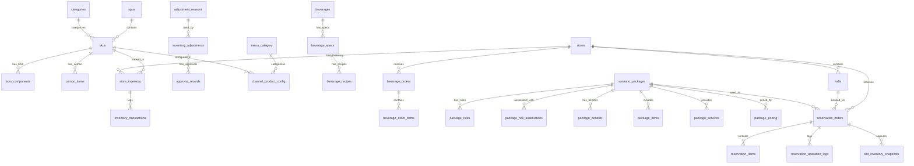

# 统一数据库设计文档

**生成时间**: 2026-01-04
**扫描范围**: specs/ (数据模型文档)
**数据库**: PostgreSQL (Supabase)

---

## 目录

- [统计概览](#统计概览)
- [商品管理模块](#商品管理模块-p001)
- [单位换算模块](#单位换算模块-p002)
- [库存查询模块](#库存查询模块-p003)
- [库存调整模块](#库存调整模块-p004)
- [BOM库存扣减模块](#bom库存扣减模块-p005)
- [菜单分类模块](#菜单分类模块-o002)
- [饮品订单模块](#饮品订单模块-o003)
- [场景包管理模块](#场景包管理模块-017)
- [门店影厅模块](#门店影厅模块-014)
- [预约订单模块](#预约订单模块-u001)
- [ER关系图](#er关系图)

---

## 统计概览

| 指标 | 数量 |
|------|------|
| **模块总数** | 10 |
| **数据表总数** | 40+ |
| **核心业务表** | 25 |
| **审计/日志表** | 5 |
| **配置表** | 10 |

### 设计规范

- **主键**: 统一使用 UUID，默认值 `gen_random_uuid()`
- **时间戳**: `created_at`, `updated_at` 使用 `TIMESTAMP WITH TIME ZONE`
- **软删除**: 使用 `deleted_at` 字段（NULL 表示未删除）
- **乐观锁**: 使用 `version` BIGINT 字段
- **状态机**: 使用 VARCHAR + CHECK 约束

---

## 商品管理模块 (P001)

### skus（SKU主数据表）

| 字段名 | 类型 | 约束 | 默认值 | 说明 |
|--------|------|------|--------|------|
| `id` | UUID | PRIMARY KEY | `gen_random_uuid()` | SKU 主键 |
| `code` | VARCHAR(50) | NOT NULL, UNIQUE | - | SKU 编码 |
| `name` | VARCHAR(200) | NOT NULL | - | SKU 名称 |
| `type` | VARCHAR(20) | NOT NULL | - | 类型：raw_material/packaging/finished_product/combo |
| `unit` | VARCHAR(20) | NOT NULL | - | 基本单位 |
| `cost` | DECIMAL(10,2) | NOT NULL | `0.00` | 成本价 |
| `price` | DECIMAL(10,2) | NOT NULL | `0.00` | 销售价 |
| `category_id` | UUID | FOREIGN KEY | - | 分类 ID |
| `brand_id` | UUID | FOREIGN KEY | - | 品牌 ID |
| `spu_id` | UUID | FOREIGN KEY | - | SPU ID |
| `specs` | JSONB | - | `'{}'` | 规格属性 |
| `store_scope` | TEXT[] | - | `'{}'` | 适用门店列表 |
| `status` | VARCHAR(20) | NOT NULL | `'active'` | 状态：active/inactive |
| `deleted_at` | TIMESTAMP | - | NULL | 软删除标记 |
| `created_at` | TIMESTAMP | NOT NULL | `CURRENT_TIMESTAMP` | 创建时间 |
| `updated_at` | TIMESTAMP | NOT NULL | `CURRENT_TIMESTAMP` | 更新时间 |

**索引**:
- `idx_skus_code`: code 字段唯一索引
- `idx_skus_type`: type 字段索引
- `idx_skus_category`: category_id 字段索引
- `idx_skus_store_scope`: store_scope GIN 索引

---

### bom_components（BOM组件表）

| 字段名 | 类型 | 约束 | 默认值 | 说明 |
|--------|------|------|--------|------|
| `id` | UUID | PRIMARY KEY | `gen_random_uuid()` | 组件主键 |
| `parent_sku_id` | UUID | FOREIGN KEY, NOT NULL | - | 父 SKU ID |
| `component_sku_id` | UUID | FOREIGN KEY, NOT NULL | - | 组件 SKU ID |
| `quantity` | DECIMAL(10,4) | NOT NULL | - | 数量 |
| `unit` | VARCHAR(20) | NOT NULL | - | 单位 |
| `sort_order` | INTEGER | NOT NULL | `0` | 排序 |
| `created_at` | TIMESTAMP | NOT NULL | `CURRENT_TIMESTAMP` | 创建时间 |
| `updated_at` | TIMESTAMP | NOT NULL | `CURRENT_TIMESTAMP` | 更新时间 |

**索引**:
- `idx_bom_parent`: parent_sku_id 索引
- `idx_bom_component`: component_sku_id 索引

**唯一约束**: `(parent_sku_id, component_sku_id)`

---

### combo_items（组合商品明细表）

| 字段名 | 类型 | 约束 | 默认值 | 说明 |
|--------|------|------|--------|------|
| `id` | UUID | PRIMARY KEY | `gen_random_uuid()` | 明细主键 |
| `combo_sku_id` | UUID | FOREIGN KEY, NOT NULL | - | 组合 SKU ID |
| `item_sku_id` | UUID | FOREIGN KEY, NOT NULL | - | 子项 SKU ID |
| `quantity` | INTEGER | NOT NULL | `1` | 数量 |
| `is_optional` | BOOLEAN | NOT NULL | `false` | 是否可选 |
| `created_at` | TIMESTAMP | NOT NULL | `CURRENT_TIMESTAMP` | 创建时间 |

**索引**:
- `idx_combo_parent`: combo_sku_id 索引

---

### spus（SPU主数据表）

| 字段名 | 类型 | 约束 | 默认值 | 说明 |
|--------|------|------|--------|------|
| `id` | UUID | PRIMARY KEY | `gen_random_uuid()` | SPU 主键 |
| `code` | VARCHAR(50) | NOT NULL, UNIQUE | - | SPU 编码 |
| `name` | VARCHAR(200) | NOT NULL | - | SPU 名称 |
| `category_id` | UUID | FOREIGN KEY | - | 分类 ID |
| `brand_id` | UUID | FOREIGN KEY | - | 品牌 ID |
| `description` | TEXT | - | - | 描述 |
| `images` | TEXT[] | - | `'{}'` | 图片列表 |
| `status` | VARCHAR(20) | NOT NULL | `'active'` | 状态 |
| `created_at` | TIMESTAMP | NOT NULL | `CURRENT_TIMESTAMP` | 创建时间 |
| `updated_at` | TIMESTAMP | NOT NULL | `CURRENT_TIMESTAMP` | 更新时间 |

---

## 单位换算模块 (P002)

### unit_conversions（单位换算表）

| 字段名 | 类型 | 约束 | 默认值 | 说明 |
|--------|------|------|--------|------|
| `id` | UUID | PRIMARY KEY | `gen_random_uuid()` | 主键 |
| `from_unit` | VARCHAR(20) | NOT NULL | - | 源单位 |
| `to_unit` | VARCHAR(20) | NOT NULL | - | 目标单位 |
| `conversion_rate` | DECIMAL(15,6) | NOT NULL | - | 换算率 |
| `category` | VARCHAR(20) | NOT NULL | - | 类别：volume/weight/quantity |
| `is_active` | BOOLEAN | NOT NULL | `true` | 是否启用 |
| `created_at` | TIMESTAMP | NOT NULL | `CURRENT_TIMESTAMP` | 创建时间 |
| `updated_at` | TIMESTAMP | NOT NULL | `CURRENT_TIMESTAMP` | 更新时间 |

**唯一约束**: `(from_unit, to_unit)`

**业务规则**:
- 换算率必须 > 0
- 支持双向换算：rate 和 1/rate

---

## 库存查询模块 (P003)

### store_inventory（门店库存表）

| 字段名 | 类型 | 约束 | 默认值 | 说明 |
|--------|------|------|--------|------|
| `id` | UUID | PRIMARY KEY | `gen_random_uuid()` | 主键 |
| `store_id` | UUID | FOREIGN KEY, NOT NULL | - | 门店 ID |
| `sku_id` | UUID | FOREIGN KEY, NOT NULL | - | SKU ID |
| `available_qty` | DECIMAL(10,2) | NOT NULL | `0` | 可用数量 |
| `reserved_qty` | DECIMAL(10,2) | NOT NULL | `0` | 预留数量 |
| `in_transit_qty` | DECIMAL(10,2) | NOT NULL | `0` | 在途数量 |
| `safety_stock` | DECIMAL(10,2) | NOT NULL | `0` | 安全库存 |
| `last_count_date` | DATE | - | NULL | 最后盘点日期 |
| `version` | BIGINT | NOT NULL | `0` | 乐观锁版本 |
| `created_at` | TIMESTAMP | NOT NULL | `CURRENT_TIMESTAMP` | 创建时间 |
| `updated_at` | TIMESTAMP | NOT NULL | `CURRENT_TIMESTAMP` | 更新时间 |

**唯一约束**: `(store_id, sku_id)`

**索引**:
- `idx_inventory_store`: store_id 索引
- `idx_inventory_sku`: sku_id 索引
- `idx_inventory_status`: 库存状态计算索引

**库存状态计算规则**:
| 状态 | 条件 |
|------|------|
| `out_of_stock` | available_qty = 0 |
| `critical` | available_qty > 0 AND available_qty < safety_stock * 0.5 |
| `low` | available_qty >= safety_stock * 0.5 AND available_qty < safety_stock |
| `normal` | available_qty >= safety_stock AND available_qty < safety_stock * 2 |
| `excess` | available_qty >= safety_stock * 2 |

---

### categories（分类表）

| 字段名 | 类型 | 约束 | 默认值 | 说明 |
|--------|------|------|--------|------|
| `id` | UUID | PRIMARY KEY | `gen_random_uuid()` | 主键 |
| `code` | VARCHAR(50) | NOT NULL, UNIQUE | - | 分类编码 |
| `name` | VARCHAR(100) | NOT NULL | - | 分类名称 |
| `parent_id` | UUID | FOREIGN KEY | NULL | 父分类 ID |
| `level` | INTEGER | NOT NULL | `1` | 层级 |
| `sort_order` | INTEGER | NOT NULL | `0` | 排序 |
| `is_active` | BOOLEAN | NOT NULL | `true` | 是否启用 |
| `created_at` | TIMESTAMP | NOT NULL | `CURRENT_TIMESTAMP` | 创建时间 |
| `updated_at` | TIMESTAMP | NOT NULL | `CURRENT_TIMESTAMP` | 更新时间 |

---

## 库存调整模块 (P004)

### adjustment_reasons（调整原因表）

| 字段名 | 类型 | 约束 | 默认值 | 说明 |
|--------|------|------|--------|------|
| `id` | UUID | PRIMARY KEY | `gen_random_uuid()` | 主键 |
| `code` | VARCHAR(50) | NOT NULL, UNIQUE | - | 原因编码 |
| `name` | VARCHAR(100) | NOT NULL | - | 原因名称 |
| `type` | VARCHAR(20) | NOT NULL | - | 类型：increase/decrease |
| `requires_approval` | BOOLEAN | NOT NULL | `false` | 是否需审批 |
| `is_active` | BOOLEAN | NOT NULL | `true` | 是否启用 |
| `created_at` | TIMESTAMP | NOT NULL | `CURRENT_TIMESTAMP` | 创建时间 |

---

### inventory_adjustments（库存调整单表）

| 字段名 | 类型 | 约束 | 默认值 | 说明 |
|--------|------|------|--------|------|
| `id` | UUID | PRIMARY KEY | `gen_random_uuid()` | 主键 |
| `adjustment_no` | VARCHAR(50) | NOT NULL, UNIQUE | - | 调整单号 |
| `store_id` | UUID | FOREIGN KEY, NOT NULL | - | 门店 ID |
| `sku_id` | UUID | FOREIGN KEY, NOT NULL | - | SKU ID |
| `reason_id` | UUID | FOREIGN KEY, NOT NULL | - | 原因 ID |
| `adjustment_type` | VARCHAR(20) | NOT NULL | - | 类型：increase/decrease |
| `quantity` | DECIMAL(10,2) | NOT NULL | - | 调整数量 |
| `before_qty` | DECIMAL(10,2) | NOT NULL | - | 调整前数量 |
| `after_qty` | DECIMAL(10,2) | NOT NULL | - | 调整后数量 |
| `status` | VARCHAR(20) | NOT NULL | `'draft'` | 状态 |
| `remark` | TEXT | - | NULL | 备注 |
| `created_by` | UUID | NOT NULL | - | 创建人 |
| `version` | BIGINT | NOT NULL | `0` | 乐观锁版本 |
| `created_at` | TIMESTAMP | NOT NULL | `CURRENT_TIMESTAMP` | 创建时间 |
| `updated_at` | TIMESTAMP | NOT NULL | `CURRENT_TIMESTAMP` | 更新时间 |

**状态机**:
```
draft → pending_approval → approved → applied
                        ↘ rejected
```

---

### approval_records（审批记录表）

| 字段名 | 类型 | 约束 | 默认值 | 说明 |
|--------|------|------|--------|------|
| `id` | UUID | PRIMARY KEY | `gen_random_uuid()` | 主键 |
| `adjustment_id` | UUID | FOREIGN KEY, NOT NULL | - | 调整单 ID |
| `approver_id` | UUID | NOT NULL | - | 审批人 ID |
| `action` | VARCHAR(20) | NOT NULL | - | 动作：approve/reject |
| `comment` | TEXT | - | NULL | 审批意见 |
| `created_at` | TIMESTAMP | NOT NULL | `CURRENT_TIMESTAMP` | 审批时间 |

---

## BOM库存扣减模块 (P005)

### inventory_reservations（库存预留表）

| 字段名 | 类型 | 约束 | 默认值 | 说明 |
|--------|------|------|--------|------|
| `id` | UUID | PRIMARY KEY | `gen_random_uuid()` | 主键 |
| `order_id` | UUID | NOT NULL | - | 订单 ID |
| `order_type` | VARCHAR(50) | NOT NULL | - | 订单类型 |
| `store_id` | UUID | FOREIGN KEY, NOT NULL | - | 门店 ID |
| `sku_id` | UUID | FOREIGN KEY, NOT NULL | - | SKU ID |
| `reserved_qty` | DECIMAL(10,4) | NOT NULL | - | 预留数量 |
| `status` | VARCHAR(20) | NOT NULL | `'reserved'` | 状态 |
| `expires_at` | TIMESTAMP | NOT NULL | - | 过期时间 |
| `released_at` | TIMESTAMP | - | NULL | 释放时间 |
| `created_at` | TIMESTAMP | NOT NULL | `CURRENT_TIMESTAMP` | 创建时间 |

**状态**: `reserved` → `consumed` / `released` / `expired`

---

### bom_snapshots（BOM快照表）

| 字段名 | 类型 | 约束 | 默认值 | 说明 |
|--------|------|------|--------|------|
| `id` | UUID | PRIMARY KEY | `gen_random_uuid()` | 主键 |
| `order_id` | UUID | NOT NULL | - | 订单 ID |
| `order_item_id` | UUID | NOT NULL | - | 订单明细 ID |
| `parent_sku_id` | UUID | NOT NULL | - | 父 SKU ID |
| `bom_data` | JSONB | NOT NULL | - | BOM 数据快照 |
| `created_at` | TIMESTAMP | NOT NULL | `CURRENT_TIMESTAMP` | 创建时间 |

**bom_data 结构**:
```json
{
  "components": [
    {
      "sku_id": "uuid",
      "sku_code": "RAW001",
      "sku_name": "原料A",
      "quantity": 0.5,
      "unit": "kg"
    }
  ]
}
```

---

### inventory_transactions（库存事务表）

| 字段名 | 类型 | 约束 | 默认值 | 说明 |
|--------|------|------|--------|------|
| `id` | UUID | PRIMARY KEY | `gen_random_uuid()` | 主键 |
| `store_id` | UUID | FOREIGN KEY, NOT NULL | - | 门店 ID |
| `sku_id` | UUID | FOREIGN KEY, NOT NULL | - | SKU ID |
| `transaction_type` | VARCHAR(50) | NOT NULL | - | 事务类型 |
| `quantity` | DECIMAL(10,4) | NOT NULL | - | 变动数量（正/负） |
| `before_qty` | DECIMAL(10,2) | NOT NULL | - | 变动前数量 |
| `after_qty` | DECIMAL(10,2) | NOT NULL | - | 变动后数量 |
| `reference_type` | VARCHAR(50) | - | NULL | 关联类型 |
| `reference_id` | UUID | - | NULL | 关联 ID |
| `remark` | TEXT | - | NULL | 备注 |
| `created_by` | UUID | - | NULL | 操作人 |
| `created_at` | TIMESTAMP | NOT NULL | `CURRENT_TIMESTAMP` | 创建时间 |

**事务类型**:
- `bom_deduction` - BOM 扣减
- `adjustment_increase` - 调整增加
- `adjustment_decrease` - 调整减少
- `reservation_release` - 预留释放

---

## 菜单分类模块 (O002)

### menu_category（菜单分类表）

| 字段名 | 类型 | 约束 | 默认值 | 说明 |
|--------|------|------|--------|------|
| `id` | UUID | PRIMARY KEY | `gen_random_uuid()` | 分类主键 |
| `code` | VARCHAR(50) | NOT NULL, UNIQUE | - | 分类编码（大写字母开头） |
| `display_name` | VARCHAR(50) | NOT NULL | - | 显示名称（中文） |
| `sort_order` | INTEGER | NOT NULL | - | 排序序号（越小越靠前） |
| `is_visible` | BOOLEAN | NOT NULL | `true` | 是否可见（小程序） |
| `is_default` | BOOLEAN | NOT NULL | `false` | 是否为默认分类 |
| `icon_url` | VARCHAR(500) | - | NULL | 图标 URL |
| `description` | VARCHAR(500) | - | NULL | 分类描述 |
| `version` | BIGINT | NOT NULL | `0` | 乐观锁版本号 |
| `deleted_at` | TIMESTAMP | - | NULL | 软删除标记 |
| `created_at` | TIMESTAMP | NOT NULL | `CURRENT_TIMESTAMP` | 创建时间 |
| `updated_at` | TIMESTAMP | NOT NULL | `CURRENT_TIMESTAMP` | 更新时间 |

**业务规则**:
- `code` 格式: `^[A-Z][A-Z0-9_]{1,49}$`
- `is_default=true` 的分类不可删除、不可隐藏

**初始数据**:
| code | display_name | sort_order | is_default |
|------|-------------|------------|------------|
| OTHER | 其他商品 | 999 | ✅ |
| ALCOHOL | 经典特调 | 10 | ❌ |
| BEVERAGE | 经典饮品 | 20 | ❌ |
| COFFEE | 精品咖啡 | 30 | ❌ |
| SNACK | 主厨小食 | 40 | ❌ |

---

### channel_product_config（渠道商品配置表）

| 字段名 | 类型 | 约束 | 默认值 | 说明 |
|--------|------|------|--------|------|
| `id` | UUID | PRIMARY KEY | `gen_random_uuid()` | 主键 |
| `sku_id` | UUID | FOREIGN KEY, NOT NULL | - | SKU ID |
| `channel` | VARCHAR(50) | NOT NULL | - | 渠道：miniapp/h5/pos |
| `category_id` | UUID | FOREIGN KEY | - | 分类 ID |
| `is_visible` | BOOLEAN | NOT NULL | `true` | 是否可见 |
| `sort_order` | INTEGER | NOT NULL | `0` | 排序 |
| `created_at` | TIMESTAMP | NOT NULL | `CURRENT_TIMESTAMP` | 创建时间 |
| `updated_at` | TIMESTAMP | NOT NULL | `CURRENT_TIMESTAMP` | 更新时间 |

---

### category_audit_log（分类审计日志表）

| 字段名 | 类型 | 约束 | 默认值 | 说明 |
|--------|------|------|--------|------|
| `id` | UUID | PRIMARY KEY | `gen_random_uuid()` | 日志主键 |
| `category_id` | UUID | - | NULL | 分类 ID（删除时可为 NULL） |
| `category_code` | VARCHAR(50) | NOT NULL | - | 分类编码 |
| `operation_type` | VARCHAR(20) | NOT NULL | - | 操作类型 |
| `affected_products` | INTEGER | NOT NULL | `0` | 影响商品数量 |
| `operation_data` | JSONB | - | NULL | 操作详情 |
| `created_at` | TIMESTAMP | NOT NULL | `CURRENT_TIMESTAMP` | 操作时间 |

**操作类型**: `DELETE`, `BATCH_SORT`

---

## 饮品订单模块 (O003)

### beverages（饮品表）

| 字段名 | 类型 | 约束 | 默认值 | 说明 |
|--------|------|------|--------|------|
| `id` | UUID | PRIMARY KEY | `gen_random_uuid()` | 主键 |
| `code` | VARCHAR(50) | NOT NULL, UNIQUE | - | 饮品编码 |
| `name` | VARCHAR(100) | NOT NULL | - | 饮品名称 |
| `category_id` | UUID | FOREIGN KEY | - | 分类 ID |
| `description` | TEXT | - | NULL | 描述 |
| `image_url` | VARCHAR(500) | - | NULL | 图片 URL |
| `is_hot` | BOOLEAN | NOT NULL | `false` | 是否热销 |
| `is_new` | BOOLEAN | NOT NULL | `false` | 是否新品 |
| `status` | VARCHAR(20) | NOT NULL | `'active'` | 状态 |
| `created_at` | TIMESTAMP | NOT NULL | `CURRENT_TIMESTAMP` | 创建时间 |
| `updated_at` | TIMESTAMP | NOT NULL | `CURRENT_TIMESTAMP` | 更新时间 |

---

### beverage_specs（饮品规格表）

| 字段名 | 类型 | 约束 | 默认值 | 说明 |
|--------|------|------|--------|------|
| `id` | UUID | PRIMARY KEY | `gen_random_uuid()` | 主键 |
| `beverage_id` | UUID | FOREIGN KEY, NOT NULL | - | 饮品 ID |
| `name` | VARCHAR(50) | NOT NULL | - | 规格名称（大/中/小） |
| `price` | DECIMAL(10,2) | NOT NULL | - | 价格 |
| `cost` | DECIMAL(10,2) | NOT NULL | `0` | 成本 |
| `is_default` | BOOLEAN | NOT NULL | `false` | 是否默认规格 |
| `sort_order` | INTEGER | NOT NULL | `0` | 排序 |
| `created_at` | TIMESTAMP | NOT NULL | `CURRENT_TIMESTAMP` | 创建时间 |

---

### beverage_recipes（饮品配方表）

| 字段名 | 类型 | 约束 | 默认值 | 说明 |
|--------|------|------|--------|------|
| `id` | UUID | PRIMARY KEY | `gen_random_uuid()` | 主键 |
| `spec_id` | UUID | FOREIGN KEY, NOT NULL | - | 规格 ID |
| `ingredient_sku_id` | UUID | FOREIGN KEY, NOT NULL | - | 原料 SKU ID |
| `quantity` | DECIMAL(10,4) | NOT NULL | - | 用量 |
| `unit` | VARCHAR(20) | NOT NULL | - | 单位 |
| `created_at` | TIMESTAMP | NOT NULL | `CURRENT_TIMESTAMP` | 创建时间 |

---

### beverage_orders（饮品订单表）

| 字段名 | 类型 | 约束 | 默认值 | 说明 |
|--------|------|------|--------|------|
| `id` | UUID | PRIMARY KEY | `gen_random_uuid()` | 主键 |
| `order_no` | VARCHAR(50) | NOT NULL, UNIQUE | - | 订单号 |
| `store_id` | UUID | FOREIGN KEY, NOT NULL | - | 门店 ID |
| `queue_number` | VARCHAR(10) | NOT NULL | - | 取餐号 |
| `customer_name` | VARCHAR(50) | - | NULL | 顾客姓名 |
| `customer_phone` | VARCHAR(20) | - | NULL | 顾客电话 |
| `total_amount` | DECIMAL(10,2) | NOT NULL | - | 订单总额 |
| `discount_amount` | DECIMAL(10,2) | NOT NULL | `0` | 折扣金额 |
| `pay_amount` | DECIMAL(10,2) | NOT NULL | - | 实付金额 |
| `status` | VARCHAR(20) | NOT NULL | `'pending'` | 状态 |
| `paid_at` | TIMESTAMP | - | NULL | 支付时间 |
| `completed_at` | TIMESTAMP | - | NULL | 完成时间 |
| `remark` | TEXT | - | NULL | 备注 |
| `created_by` | UUID | - | NULL | 创建人 |
| `created_at` | TIMESTAMP | NOT NULL | `CURRENT_TIMESTAMP` | 创建时间 |
| `updated_at` | TIMESTAMP | NOT NULL | `CURRENT_TIMESTAMP` | 更新时间 |

**状态机**:
```
pending → paid → preparing → ready → completed
                           ↘ cancelled
```

---

### beverage_order_items（饮品订单明细表）

| 字段名 | 类型 | 约束 | 默认值 | 说明 |
|--------|------|------|--------|------|
| `id` | UUID | PRIMARY KEY | `gen_random_uuid()` | 主键 |
| `order_id` | UUID | FOREIGN KEY, NOT NULL | - | 订单 ID |
| `beverage_id` | UUID | NOT NULL | - | 饮品 ID |
| `spec_id` | UUID | NOT NULL | - | 规格 ID |
| `beverage_name` | VARCHAR(100) | NOT NULL | - | 饮品名称（快照） |
| `spec_name` | VARCHAR(50) | NOT NULL | - | 规格名称（快照） |
| `quantity` | INTEGER | NOT NULL | `1` | 数量 |
| `unit_price` | DECIMAL(10,2) | NOT NULL | - | 单价（快照） |
| `subtotal` | DECIMAL(10,2) | NOT NULL | - | 小计 |
| `customizations` | JSONB | - | `'{}'` | 定制选项 |
| `bom_snapshot` | JSONB | - | NULL | BOM 快照 |
| `created_at` | TIMESTAMP | NOT NULL | `CURRENT_TIMESTAMP` | 创建时间 |

**customizations 结构**:
```json
{
  "sugar": "少糖",
  "ice": "去冰",
  "extras": ["加珍珠", "加椰果"]
}
```

---

### queue_numbers（取餐号表）

| 字段名 | 类型 | 约束 | 默认值 | 说明 |
|--------|------|------|--------|------|
| `id` | UUID | PRIMARY KEY | `gen_random_uuid()` | 主键 |
| `store_id` | UUID | FOREIGN KEY, NOT NULL | - | 门店 ID |
| `date` | DATE | NOT NULL | - | 日期 |
| `current_number` | INTEGER | NOT NULL | `0` | 当前号码 |
| `prefix` | VARCHAR(10) | NOT NULL | `'A'` | 号码前缀 |
| `created_at` | TIMESTAMP | NOT NULL | `CURRENT_TIMESTAMP` | 创建时间 |
| `updated_at` | TIMESTAMP | NOT NULL | `CURRENT_TIMESTAMP` | 更新时间 |

**唯一约束**: `(store_id, date)`

**业务规则**: 每天 00:00 重置为 0

---

## 场景包管理模块 (017)

### scenario_packages（场景包表）

| 字段名 | 类型 | 约束 | 默认值 | 说明 |
|--------|------|------|--------|------|
| `id` | UUID | PRIMARY KEY | `gen_random_uuid()` | 主键 |
| `code` | VARCHAR(50) | NOT NULL, UNIQUE | - | 场景包编码 |
| `name` | VARCHAR(100) | NOT NULL | - | 场景包名称 |
| `type` | VARCHAR(50) | NOT NULL | - | 类型：team_building/private/celebration |
| `description` | TEXT | - | NULL | 描述 |
| `cover_image` | VARCHAR(500) | - | NULL | 封面图 |
| `min_guests` | INTEGER | NOT NULL | `1` | 最少人数 |
| `max_guests` | INTEGER | NOT NULL | `999` | 最多人数 |
| `duration_hours` | DECIMAL(4,1) | NOT NULL | `2.0` | 时长（小时） |
| `base_price` | DECIMAL(10,2) | NOT NULL | - | 基础价格 |
| `status` | VARCHAR(20) | NOT NULL | `'draft'` | 状态 |
| `version` | INTEGER | NOT NULL | `1` | 版本号 |
| `base_package_id` | UUID | FOREIGN KEY | NULL | 基础版本 ID（用于版本管理） |
| `valid_from` | DATE | - | NULL | 生效日期 |
| `valid_to` | DATE | - | NULL | 失效日期 |
| `created_by` | UUID | NOT NULL | - | 创建人 |
| `created_at` | TIMESTAMP | NOT NULL | `CURRENT_TIMESTAMP` | 创建时间 |
| `updated_at` | TIMESTAMP | NOT NULL | `CURRENT_TIMESTAMP` | 更新时间 |

**状态**: `draft` → `published` → `archived`

---

### package_rules（场景包规则表）

| 字段名 | 类型 | 约束 | 默认值 | 说明 |
|--------|------|------|--------|------|
| `id` | UUID | PRIMARY KEY | `gen_random_uuid()` | 主键 |
| `package_id` | UUID | FOREIGN KEY, NOT NULL | - | 场景包 ID |
| `rule_type` | VARCHAR(50) | NOT NULL | - | 规则类型 |
| `rule_config` | JSONB | NOT NULL | - | 规则配置 |
| `priority` | INTEGER | NOT NULL | `0` | 优先级 |
| `is_active` | BOOLEAN | NOT NULL | `true` | 是否启用 |
| `created_at` | TIMESTAMP | NOT NULL | `CURRENT_TIMESTAMP` | 创建时间 |

**规则类型**:
- `booking_advance` - 提前预订天数
- `cancellation` - 取消政策
- `modification` - 修改政策

---

### package_hall_associations（场景包影厅关联表）

| 字段名 | 类型 | 约束 | 默认值 | 说明 |
|--------|------|------|--------|------|
| `id` | UUID | PRIMARY KEY | `gen_random_uuid()` | 主键 |
| `package_id` | UUID | FOREIGN KEY, NOT NULL | - | 场景包 ID |
| `hall_id` | UUID | FOREIGN KEY, NOT NULL | - | 影厅 ID |
| `price_adjustment` | DECIMAL(10,2) | NOT NULL | `0` | 价格调整 |
| `is_active` | BOOLEAN | NOT NULL | `true` | 是否启用 |
| `created_at` | TIMESTAMP | NOT NULL | `CURRENT_TIMESTAMP` | 创建时间 |

**唯一约束**: `(package_id, hall_id)`

---

### package_benefits（场景包权益表）

| 字段名 | 类型 | 约束 | 默认值 | 说明 |
|--------|------|------|--------|------|
| `id` | UUID | PRIMARY KEY | `gen_random_uuid()` | 主键 |
| `package_id` | UUID | FOREIGN KEY, NOT NULL | - | 场景包 ID |
| `benefit_type` | VARCHAR(50) | NOT NULL | - | 权益类型 |
| `benefit_name` | VARCHAR(100) | NOT NULL | - | 权益名称 |
| `benefit_value` | JSONB | - | NULL | 权益值 |
| `sort_order` | INTEGER | NOT NULL | `0` | 排序 |
| `created_at` | TIMESTAMP | NOT NULL | `CURRENT_TIMESTAMP` | 创建时间 |

---

### package_items（场景包商品表）

| 字段名 | 类型 | 约束 | 默认值 | 说明 |
|--------|------|------|--------|------|
| `id` | UUID | PRIMARY KEY | `gen_random_uuid()` | 主键 |
| `package_id` | UUID | FOREIGN KEY, NOT NULL | - | 场景包 ID |
| `sku_id` | UUID | FOREIGN KEY, NOT NULL | - | SKU ID |
| `quantity` | INTEGER | NOT NULL | `1` | 数量 |
| `is_optional` | BOOLEAN | NOT NULL | `false` | 是否可选 |
| `extra_price` | DECIMAL(10,2) | NOT NULL | `0` | 加购价格 |
| `sort_order` | INTEGER | NOT NULL | `0` | 排序 |
| `created_at` | TIMESTAMP | NOT NULL | `CURRENT_TIMESTAMP` | 创建时间 |

---

### package_services（场景包服务表）

| 字段名 | 类型 | 约束 | 默认值 | 说明 |
|--------|------|------|--------|------|
| `id` | UUID | PRIMARY KEY | `gen_random_uuid()` | 主键 |
| `package_id` | UUID | FOREIGN KEY, NOT NULL | - | 场景包 ID |
| `service_type` | VARCHAR(50) | NOT NULL | - | 服务类型 |
| `service_name` | VARCHAR(100) | NOT NULL | - | 服务名称 |
| `service_config` | JSONB | - | NULL | 服务配置 |
| `is_included` | BOOLEAN | NOT NULL | `true` | 是否包含 |
| `extra_price` | DECIMAL(10,2) | NOT NULL | `0` | 额外价格 |
| `sort_order` | INTEGER | NOT NULL | `0` | 排序 |
| `created_at` | TIMESTAMP | NOT NULL | `CURRENT_TIMESTAMP` | 创建时间 |

---

### package_pricing（场景包定价表）

| 字段名 | 类型 | 约束 | 默认值 | 说明 |
|--------|------|------|--------|------|
| `id` | UUID | PRIMARY KEY | `gen_random_uuid()` | 主键 |
| `package_id` | UUID | FOREIGN KEY, NOT NULL | - | 场景包 ID |
| `pricing_type` | VARCHAR(50) | NOT NULL | - | 定价类型 |
| `condition_config` | JSONB | NOT NULL | - | 条件配置 |
| `price` | DECIMAL(10,2) | NOT NULL | - | 价格 |
| `priority` | INTEGER | NOT NULL | `0` | 优先级 |
| `valid_from` | DATE | - | NULL | 生效日期 |
| `valid_to` | DATE | - | NULL | 失效日期 |
| `created_at` | TIMESTAMP | NOT NULL | `CURRENT_TIMESTAMP` | 创建时间 |

**定价类型**:
- `weekday` - 工作日价格
- `weekend` - 周末价格
- `holiday` - 节假日价格
- `peak_hour` - 高峰时段
- `off_peak` - 低峰时段

---

## 门店影厅模块 (014)

### stores（门店表）

| 字段名 | 类型 | 约束 | 默认值 | 说明 |
|--------|------|------|--------|------|
| `id` | UUID | PRIMARY KEY | `gen_random_uuid()` | 主键 |
| `code` | VARCHAR(50) | NOT NULL, UNIQUE | - | 门店编码 |
| `name` | VARCHAR(100) | NOT NULL | - | 门店名称 |
| `address` | VARCHAR(500) | - | NULL | 地址 |
| `city` | VARCHAR(50) | - | NULL | 城市 |
| `district` | VARCHAR(50) | - | NULL | 区县 |
| `contact_phone` | VARCHAR(20) | - | NULL | 联系电话 |
| `business_hours` | JSONB | - | NULL | 营业时间 |
| `location` | JSONB | - | NULL | 地理位置 |
| `status` | VARCHAR(20) | NOT NULL | `'active'` | 状态 |
| `created_at` | TIMESTAMP | NOT NULL | `CURRENT_TIMESTAMP` | 创建时间 |
| `updated_at` | TIMESTAMP | NOT NULL | `CURRENT_TIMESTAMP` | 更新时间 |

**状态**: `active`, `disabled`, `maintenance`

**business_hours 结构**:
```json
{
  "monday": { "open": "09:00", "close": "22:00" },
  "tuesday": { "open": "09:00", "close": "22:00" }
}
```

---

### halls（影厅表）

| 字段名 | 类型 | 约束 | 默认值 | 说明 |
|--------|------|------|--------|------|
| `id` | UUID | PRIMARY KEY | `gen_random_uuid()` | 主键 |
| `store_id` | UUID | FOREIGN KEY, NOT NULL | - | 门店 ID |
| `code` | VARCHAR(50) | NOT NULL | - | 影厅编码 |
| `name` | VARCHAR(100) | NOT NULL | - | 影厅名称 |
| `type` | VARCHAR(50) | NOT NULL | - | 类型：standard/vip/imax |
| `capacity` | INTEGER | NOT NULL | - | 容量 |
| `area_sqm` | DECIMAL(10,2) | - | NULL | 面积（平方米） |
| `facilities` | JSONB | - | `'[]'` | 设施列表 |
| `status` | VARCHAR(20) | NOT NULL | `'active'` | 状态 |
| `created_at` | TIMESTAMP | NOT NULL | `CURRENT_TIMESTAMP` | 创建时间 |
| `updated_at` | TIMESTAMP | NOT NULL | `CURRENT_TIMESTAMP` | 更新时间 |

**唯一约束**: `(store_id, code)`

---

## 预约订单模块 (U001)

### reservation_orders（预约订单表）

| 字段名 | 类型 | 约束 | 默认值 | 说明 |
|--------|------|------|--------|------|
| `id` | UUID | PRIMARY KEY | `gen_random_uuid()` | 主键 |
| `order_no` | VARCHAR(50) | NOT NULL, UNIQUE | - | 订单号 |
| `store_id` | UUID | FOREIGN KEY, NOT NULL | - | 门店 ID |
| `hall_id` | UUID | FOREIGN KEY, NOT NULL | - | 影厅 ID |
| `package_id` | UUID | FOREIGN KEY | - | 场景包 ID |
| `customer_name` | VARCHAR(50) | NOT NULL | - | 客户姓名 |
| `customer_phone` | VARCHAR(20) | NOT NULL | - | 客户电话 |
| `guest_count` | INTEGER | NOT NULL | - | 人数 |
| `reservation_date` | DATE | NOT NULL | - | 预约日期 |
| `start_time` | TIME | NOT NULL | - | 开始时间 |
| `end_time` | TIME | NOT NULL | - | 结束时间 |
| `total_amount` | DECIMAL(10,2) | NOT NULL | - | 总金额 |
| `deposit_amount` | DECIMAL(10,2) | NOT NULL | `0` | 定金金额 |
| `paid_amount` | DECIMAL(10,2) | NOT NULL | `0` | 已付金额 |
| `status` | VARCHAR(20) | NOT NULL | `'PENDING'` | 状态 |
| `remark` | TEXT | - | NULL | 备注 |
| `version` | BIGINT | NOT NULL | `0` | 乐观锁版本 |
| `created_by` | UUID | - | NULL | 创建人 |
| `created_at` | TIMESTAMP | NOT NULL | `CURRENT_TIMESTAMP` | 创建时间 |
| `updated_at` | TIMESTAMP | NOT NULL | `CURRENT_TIMESTAMP` | 更新时间 |

**状态机**:
```
PENDING → CONFIRMED → COMPLETED
       ↘ CANCELLED
```

---

### reservation_items（预约订单明细表）

| 字段名 | 类型 | 约束 | 默认值 | 说明 |
|--------|------|------|--------|------|
| `id` | UUID | PRIMARY KEY | `gen_random_uuid()` | 主键 |
| `order_id` | UUID | FOREIGN KEY, NOT NULL | - | 订单 ID |
| `item_type` | VARCHAR(50) | NOT NULL | - | 项目类型 |
| `sku_id` | UUID | - | NULL | SKU ID |
| `item_name` | VARCHAR(100) | NOT NULL | - | 项目名称 |
| `quantity` | INTEGER | NOT NULL | `1` | 数量 |
| `unit_price` | DECIMAL(10,2) | NOT NULL | - | 单价 |
| `subtotal` | DECIMAL(10,2) | NOT NULL | - | 小计 |
| `snapshot_data` | JSONB | - | NULL | 快照数据 |
| `created_at` | TIMESTAMP | NOT NULL | `CURRENT_TIMESTAMP` | 创建时间 |

---

### reservation_operation_logs（预约操作日志表）

| 字段名 | 类型 | 约束 | 默认值 | 说明 |
|--------|------|------|--------|------|
| `id` | UUID | PRIMARY KEY | `gen_random_uuid()` | 主键 |
| `order_id` | UUID | FOREIGN KEY, NOT NULL | - | 订单 ID |
| `operation_type` | VARCHAR(50) | NOT NULL | - | 操作类型 |
| `before_status` | VARCHAR(20) | - | NULL | 操作前状态 |
| `after_status` | VARCHAR(20) | - | NULL | 操作后状态 |
| `operation_data` | JSONB | - | NULL | 操作详情 |
| `operator_id` | UUID | - | NULL | 操作人 ID |
| `operator_name` | VARCHAR(50) | - | NULL | 操作人姓名 |
| `remark` | TEXT | - | NULL | 备注 |
| `created_at` | TIMESTAMP | NOT NULL | `CURRENT_TIMESTAMP` | 操作时间 |

---

### slot_inventory_snapshots（时段库存快照表）

| 字段名 | 类型 | 约束 | 默认值 | 说明 |
|--------|------|------|--------|------|
| `id` | UUID | PRIMARY KEY | `gen_random_uuid()` | 主键 |
| `order_id` | UUID | FOREIGN KEY, NOT NULL | - | 订单 ID |
| `hall_id` | UUID | NOT NULL | - | 影厅 ID |
| `slot_date` | DATE | NOT NULL | - | 日期 |
| `slot_time` | TIME | NOT NULL | - | 时段 |
| `snapshot_data` | JSONB | NOT NULL | - | 快照数据 |
| `created_at` | TIMESTAMP | NOT NULL | `CURRENT_TIMESTAMP` | 创建时间 |

---

## ER关系图



---

## 附录

### A. 通用设计模式

#### 软删除模式
```sql
-- 添加软删除字段
ALTER TABLE table_name ADD COLUMN deleted_at TIMESTAMP WITH TIME ZONE;

-- 创建过滤视图
CREATE VIEW active_table_name AS
SELECT * FROM table_name WHERE deleted_at IS NULL;
```

#### 乐观锁模式
```sql
-- 更新时检查版本
UPDATE table_name
SET field = value, version = version + 1, updated_at = NOW()
WHERE id = $1 AND version = $2;
```

#### 审计字段模式
```sql
-- 标准审计字段
created_at TIMESTAMP WITH TIME ZONE NOT NULL DEFAULT CURRENT_TIMESTAMP,
updated_at TIMESTAMP WITH TIME ZONE NOT NULL DEFAULT CURRENT_TIMESTAMP,
created_by UUID,
updated_by UUID
```

### B. 索引策略

| 场景 | 索引类型 | 示例 |
|------|---------|------|
| 唯一标识 | UNIQUE | `CREATE UNIQUE INDEX idx_code ON table(code)` |
| 外键查询 | B-TREE | `CREATE INDEX idx_fk ON table(foreign_id)` |
| JSONB 查询 | GIN | `CREATE INDEX idx_jsonb ON table USING GIN(data)` |
| 数组查询 | GIN | `CREATE INDEX idx_array ON table USING GIN(array_col)` |
| 全文搜索 | GIN | `CREATE INDEX idx_fts ON table USING GIN(to_tsvector('chinese', name))` |

### C. 数据迁移脚本命名

格式: `V{版本号}__{描述}.sql`

示例:
- `V1__Create_initial_tables.sql`
- `V2__Add_menu_category_table.sql`
- `V3__Insert_default_categories.sql`
- `V4__Add_category_id_to_channel_product.sql`

---

**版本**: 1.0.0
**最后更新**: 2026-01-04
**维护者**: Cinema Business Center Platform Team
