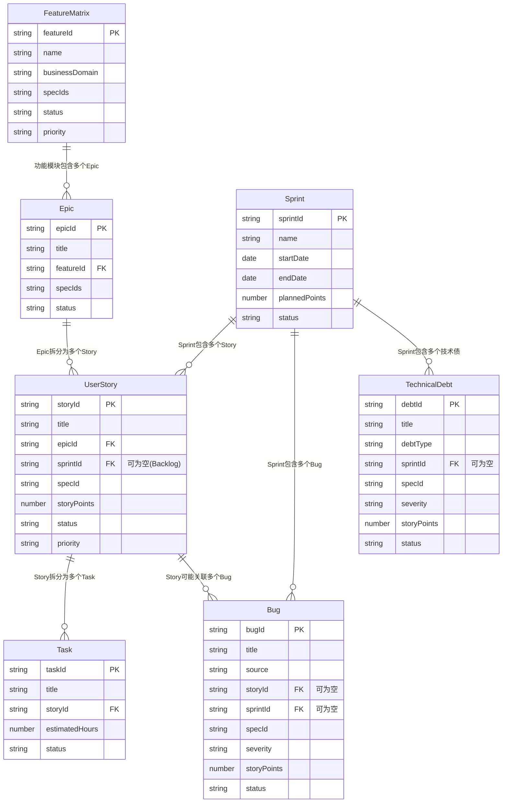

# 完整的 Scrum + 功能矩阵架构规划

**@spec T004-lark-project-management**

## 📋 核心问题

**如何在 Scrum 框架下统一管理：**
1. **功能矩阵**（Feature Matrix）- 产品功能全景图
2. **Bug**（缺陷）- 生产环境和开发过程中发现的问题
3. **待办事项**（Backlog）- 未分配到 Sprint 的需求
4. **技术债**（Technical Debt）- 需要重构和改进的技术问题

---

## 🎯 完整架构设计

### 1. 数据实体总览

| 层级 | 实体 | 飞书表名 | 用途 | 生命周期 | 关联 Spec |
|-----|------|---------|------|---------|----------|
| **战略层** | FeatureMatrix | 功能矩阵 | 产品功能全景图 | 长期（产品级） | ✅ |
| **战术层** | Epic | 史诗 | 大型功能目标 | 中期（季度级） | ✅ |
| | UserStory | 用户故事 | 可交付价值 | 短期（迭代级） | ✅ |
| | Task | 任务 | 具体开发工作 | 短期（天级） | 继承 Story |
| **迭代层** | Sprint | 迭代 | 时间盒容器 | 2-4周 | ❌ |
| **质量层** | Bug | 缺陷 | 质量问题 | 按优先级处理 | ✅ |
| | TechnicalDebt | 技术债 | 技术改进项 | 按优先级处理 | ✅ |

---

### 2. 完整架构图

```
┌─────────────────────────────────────────────────────────────────────┐
│                        Feature Matrix (功能矩阵)                      │
│                     产品功能全景图 - 战略规划层                          │
│  ┌──────────────┬──────────────┬──────────────┬──────────────┐      │
│  │ 库存管理模块  │ 商品管理模块  │ 订单管理模块  │ 门店管理模块  │      │
│  │ (I###)       │ (P###)       │ (O###)       │ (S###)       │      │
│  └──────────────┴──────────────┴──────────────┴──────────────┘      │
└─────────────────────────────────────────────────────────────────────┘
                              │
                              ↓ (功能模块 → Epic 映射)
┌─────────────────────────────────────────────────────────────────────┐
│                           Epic (史诗)                                 │
│                        大型功能目标 - 战术层                           │
│  ┌────────────────────────────────────────────────────────────┐     │
│  │ EPIC-001: 库存管理系统 (关联 I003, I004, I005)              │     │
│  │   ├── 需求阶段: 功能矩阵定义                                │     │
│  │   ├── 拆分阶段: 分解为 User Stories                         │     │
│  │   └── 执行阶段: 分配到 Sprints                              │     │
│  └────────────────────────────────────────────────────────────┘     │
└─────────────────────────────────────────────────────────────────────┘
                              │
                              ↓ (Epic 拆分)
┌─────────────────────────────────────────────────────────────────────┐
│                        User Story (用户故事)                          │
│                       可交付的用户价值 - 迭代层                        │
│  ┌────────────────────────────────────────────────────────────┐     │
│  │ STORY-042: 用户可以查看库存列表 (5 点, I003)                │     │
│  │   ├── 所属 Epic: EPIC-001                                   │     │
│  │   ├── 所属 Sprint: SPR-012 (或在 Product Backlog)          │     │
│  │   └── Tasks: TASK-128, TASK-129, TASK-130                  │     │
│  └────────────────────────────────────────────────────────────┘     │
└─────────────────────────────────────────────────────────────────────┘
                              │
              ┌───────────────┼───────────────┐
              ↓               ↓               ↓
    ┌─────────────┐  ┌─────────────┐  ┌─────────────┐
    │   Sprint     │  │Product      │  │   Bug +     │
    │   (迭代)     │  │Backlog      │  │TechnicalDebt│
    │              │  │(产品待办)    │  │ (质量层)     │
    │ SPR-012      │  │             │  │             │
    │ ├─ Story-042 │  │ Story-044   │  │ BUG-001     │
    │ ├─ Story-052 │  │ Story-045   │  │ DEBT-001    │
    │ ├─ Bug-001   │  │ Story-046   │  │             │
    │ └─ Debt-001  │  │ ...         │  │             │
    └─────────────┘  └─────────────┘  └─────────────┘
```

---

## 3. 功能矩阵（Feature Matrix）详细设计

### 3.1 定位与作用

**功能矩阵 ≠ Epic**

| 维度 | Feature Matrix | Epic |
|-----|----------------|------|
| **定位** | 产品功能全景图（What） | 大型功能目标（How） |
| **粒度** | 功能模块级别 | 多个 Story 的集合 |
| **时间跨度** | 长期（产品生命周期） | 中期（1-3 个月） |
| **状态** | 规划中/开发中/已上线/已废弃 | 未开始/进行中/已完成/已取消 |
| **关联关系** | 1 个功能模块 → 多个 Epic | 1 个 Epic → 多个 Story |

### 3.2 飞书表结构

**FeatureMatrix 表**:

| 字段名 | 飞书字段类型 | 必需 | 默认值 | 说明 |
|--------|-------------|------|--------|------|
| 功能模块名称 | 多行文本 (Text) | ✅ | - | 如"库存查询"、"商品管理" |
| 功能模块 ID | 多行文本 (Text) | ✅ | - | 自动生成（如 FM-I003） |
| 所属业务域 | 单选 (SingleSelect) | ✅ | - | 库存、商品、订单、门店、用户、报表、系统 |
| 关联规格 | 多行文本 (Text) | ✅ | - | 如 I003, I004（可多个） |
| 状态 | 单选 (SingleSelect) | ✅ | 📝 规划中 | 📝 规划中、🚀 开发中、✅ 已上线、❌ 已废弃 |
| 优先级 | 单选 (SingleSelect) | ✅ | 🟡 P2 | 🔴 P0、🟠 P1、🟡 P2、🟢 P3 |
| 负责人 | 人员 (User) | ❌ | - | Product Owner |
| 关联 Epics | 双向关联 (DuplexLink) | ❌ | - | 关联到 Epic 表 |
| Epic 数量 | 公式 (Formula) | 自动 | - | COUNT(关联 Epics) |
| 完成进度 | 公式 (Formula) | 自动 | - | 已上线 Epics / 总 Epics |
| 目标上线日期 | 日期 (DateTime) | ❌ | - | - |
| 实际上线日期 | 日期 (DateTime) | ❌ | - | - |
| 功能描述 | 多行文本 (Text) | ❌ | - | 功能详细说明 |
| 备注 | 多行文本 (Text) | ❌ | - | - |

### 3.3 功能矩阵 → Epic → Story 映射关系

**示例**:

```yaml
功能矩阵: FM-I003 "库存管理系统"
  关联规格: "I003, I004, I005"
  状态: 🚀 开发中
  关联 Epics:
    - EPIC-001: "库存查询功能" (I003)
        ├── STORY-042: 用户可以查看库存列表
        ├── STORY-043: 用户可以筛选库存记录
        └── STORY-044: 用户可以导出库存数据

    - EPIC-002: "库存调整审批" (I006)
        ├── STORY-052: 管理员可以查看待审批单
        ├── STORY-053: 管理员可以审批通过
        └── STORY-054: 管理员可以拒绝申请

    - EPIC-003: "库存盘点" (I005)
        └── STORY-060: 门店可以发起盘点
```

### 3.4 功能矩阵的使用场景

#### 场景 1：产品规划会议

**目标**: 决定下个季度要开发哪些功能模块

```bash
# 查看所有规划中的功能模块
lark-pm feature list --status planning

# 输出:
# FM-I003 | 库存管理系统 | I003,I004,I005 | 📝 规划中 | P0
# FM-P005 | 商品批量导入 | P005 | 📝 规划中 | P1
# FM-O008 | 订单退款流程 | O008 | 📝 规划中 | P2

# 决策: 优先开发 FM-I003（P0 优先级）
lark-pm feature update --feature-id FM-I003 --status in-development
```

#### 场景 2：功能模块进度跟踪

```bash
# 查看库存管理系统的进度
lark-pm feature stats --feature-id FM-I003

# 输出:
# 功能模块: FM-I003 "库存管理系统"
# 关联规格: I003, I004, I005
# 状态: 🚀 开发中
#
# Epic 统计:
#   - EPIC-001 (I003): ✅ 已完成 (3/3 Stories 完成)
#   - EPIC-002 (I006): 🚀 进行中 (2/3 Stories 完成)
#   - EPIC-003 (I005): 📝 未开始 (0/1 Stories 完成)
#
# 整体进度: 62.5% (5/8 Stories 完成)
# 预计上线: 2025-02-15
```

---

## 4. Bug 管理详细设计

### 4.1 Bug 的三种来源

| 来源 | 发现阶段 | 处理方式 | 优先级 |
|-----|---------|---------|--------|
| **生产环境 Bug** | 已上线功能 | 立即修复，可能插入当前 Sprint | 🔴 严重/🟡 中 |
| **测试阶段 Bug** | Story 开发完成后 | 阻塞 Story，必须修复才能完成 | 🔴 严重/🟡 中 |
| **开发过程 Bug** | 编码阶段 | 作为 Task 处理，不单独记录 | - |

### 4.2 Bug 飞书表结构（改造后）

| 字段名 | 飞书字段类型 | 必需 | 默认值 | 说明 |
|--------|-------------|------|--------|------|
| Bug ID | 多行文本 (Text) | ✅ | - | 自动生成（如 BUG-001） |
| Bug 标题 | 多行文本 (Text) | ✅ | - | Bug 描述 |
| **来源** | 单选 (SingleSelect) | ✅ | - | 🔴 生产环境、🟡 测试阶段、🟢 开发过程 |
| **关联 Story** | 单向关联 (Link) | ❌ | - | 关联到 UserStory 表（如果是测试阶段 Bug） |
| **所属 Sprint** | 单向关联 (Link) | ❌ | - | 关联到 Sprint 表 |
| 关联规格 | 多行文本 (Text) | ❌ | - | 如 I003 |
| 严重程度 | 单选 (SingleSelect) | ✅ | 🟡 中 | 🔴 严重、🟡 中、🟢 轻微 |
| 状态 | 单选 (SingleSelect) | ✅ | 📝 待修复 | 📝 待修复、🚀 修复中、✅ 已修复、⏸️ 待验证、❌ 不修复 |
| 报告人 | 人员 (User) | ❌ | - | - |
| 负责人 | 人员 (User) | ❌ | - | - |
| Story 点数 | 数字 (Number) | ❌ | - | 如果在 Sprint 中修复（计入速度） |
| 发现日期 | 日期 (DateTime) | ❌ | - | - |
| 修复日期 | 日期 (DateTime) | ❌ | - | - |
| 复现步骤 | 多行文本 (Text) | ❌ | - | - |
| 环境信息 | 多行文本 (Text) | ❌ | - | - |
| 备注 | 多行文本 (Text) | ❌ | - | - |

### 4.3 Bug 处理流程

#### 流程 1：生产环境 Bug

```
1. Bug 报告
   ↓
2. 评估严重程度
   ├─ 🔴 严重: 立即插入当前 Sprint
   ├─ 🟡 中: 加入下个 Sprint
   └─ 🟢 轻微: 加入 Product Backlog

3. 分配 Story 点数（计入速度）
   ↓
4. 创建修复 Tasks
   ↓
5. 开发 → 测试 → 上线
   ↓
6. 关闭 Bug (状态: ✅ 已修复)
```

**CLI 示例**:

```bash
# 1. 创建生产环境 Bug
lark-pm bug create \
  --title "库存查询接口返回 500 错误" \
  --source production \
  --spec-id I003 \
  --severity critical \
  --reporter "客服团队"

# 2. 评估后插入当前 Sprint
lark-pm bug update --bug-id BUG-001 \
  --sprint SPR-012 \
  --points 5 \
  --assignee "张三"

# 3. Bug 修复后更新状态
lark-pm bug update --bug-id BUG-001 \
  --status fixed \
  --fixed-date $(date +%s)
```

#### 流程 2：测试阶段 Bug（阻塞 Story）

```
1. Story 开发完成 → 提交测试
   ↓
2. 测试发现 Bug
   ↓
3. 创建 Bug，关联到 Story
   ├─ Story 状态: 👀 待评审 → 🚀 进行中
   └─ Bug 状态: 📝 待修复
   ↓
4. 修复 Bug
   ├─ 不创建新 Task（Bug 本身就是工作项）
   └─ Story 保持 "进行中" 状态
   ↓
5. Bug 修复 → 重新提交测试
   ├─ Bug 状态: ✅ 已修复
   └─ Story 状态: 👀 待评审
   ↓
6. 测试通过
   └─ Story 状态: ✅ 已完成
```

**CLI 示例**:

```bash
# 1. Story 提交测试后发现 Bug
lark-pm bug create \
  --title "库存列表分页显示错误" \
  --source testing \
  --story STORY-042 \
  --spec-id I003 \
  --severity medium

# 2. Story 状态回退
lark-pm story update --story-id STORY-042 --status in-progress

# 3. Bug 修复后
lark-pm bug update --bug-id BUG-002 --status fixed

# 4. Story 重新提交测试
lark-pm story update --story-id STORY-042 --status in-review
```

### 4.4 Bug 统计与报表

```bash
# 查看当前 Sprint 的 Bug 统计
lark-pm bug stats --sprint SPR-012

# 输出:
# Sprint 12 Bug 统计:
# 总数: 8
# ├─ 生产环境: 3 (🔴 2, 🟡 1)
# ├─ 测试阶段: 4 (🟡 3, 🟢 1)
# └─ 开发过程: 1 (🟢 1)
#
# 状态分布:
# ├─ 待修复: 2
# ├─ 修复中: 3
# ├─ 已修复: 3
# └─ 不修复: 0

# 按 Spec 分组统计
lark-pm bug stats --group-by spec

# 输出:
# Bug 统计（按 Spec 分组）:
# ┌─────────┬──────┬─────────┬─────────┬─────────┐
# │ Spec ID │ 总数 │ 🔴 严重 │ 🟡 中   │ 🟢 轻微 │
# ├─────────┼──────┼─────────┼─────────┼─────────┤
# │ I003    │ 5    │ 2       │ 2       │ 1       │
# │ P001    │ 2    │ 0       │ 1       │ 1       │
# │ O003    │ 1    │ 1       │ 0       │ 0       │
# └─────────┴──────┴─────────┴─────────┴─────────┘
```

---

## 5. 待办事项（Backlog）管理详细设计

### 5.1 Backlog 的两种类型

| 类型 | 名称 | 内容 | 管理者 | 优先级排序 |
|-----|------|------|--------|-----------|
| **Product Backlog** | 产品待办 | 所有未分配到 Sprint 的 Story | Product Owner | ✅ 严格排序 |
| **Sprint Backlog** | 迭代待办 | 当前 Sprint 的 Story + Task | Scrum Master + 团队 | ❌ 无需排序 |

### 5.2 Product Backlog 实现方式

**方案**: **不创建单独的表**，通过 UserStory 表的 `所属 Sprint` 字段为空来标识

```bash
# Product Backlog = 所有 sprintId 为空的 Story
lark-pm backlog list

# 等价于
lark-pm story list --sprint null
```

### 5.3 Product Backlog 管理流程

#### 流程 1：新需求加入 Backlog

```
1. Product Owner 创建 User Story
   ├─ 关联 Epic（可选）
   ├─ 关联 Spec
   └─ 所属 Sprint: 留空（自动进入 Product Backlog）
   ↓
2. Product Owner 评估 Story 点数
   ↓
3. Product Owner 设置优先级
   ↓
4. 需求进入 Product Backlog，等待 Sprint 规划
```

**CLI 示例**:

```bash
# 1. 创建 Story（不指定 Sprint）
lark-pm story create \
  --title "用户可以批量导入商品" \
  --epic EPIC-005 \
  --spec-id P005 \
  --priority p1

# 2. 评估 Story 点数
lark-pm backlog estimate --story-id STORY-088 --points 8

# 3. 调整优先级
lark-pm backlog prioritize --story-id STORY-088 --priority p0

# 4. 查看 Product Backlog（按优先级排序）
lark-pm backlog list --sort priority-asc

# 输出:
# Product Backlog (按优先级排序):
# ┌───────────┬────────────────────────────┬──────┬────────┬─────────┐
# │ Story ID  │ 标题                        │ 点数 │ 优先级 │ Spec ID │
# ├───────────┼────────────────────────────┼──────┼────────┼─────────┤
# │ STORY-088 │ 用户可以批量导入商品        │ 8    │ 🔴 P0  │ P005    │
# │ STORY-042 │ 用户可以查看库存列表        │ 5    │ 🔴 P0  │ I003    │
# │ STORY-052 │ 管理员可以查看待审批单      │ 5    │ 🟠 P1  │ I006    │
# │ STORY-090 │ 用户可以导出订单数据        │ 3    │ 🟡 P2  │ O003    │
# └───────────┴────────────────────────────┴──────┴────────┴─────────┘
```

#### 流程 2：Sprint 规划会议（从 Backlog 选择 Story）

```
1. 查看 Product Backlog 顶部（最高优先级）
   ↓
2. 团队评估承诺点数（基于历史速度）
   ├─ 过去 3 个 Sprint 平均速度: 40 点
   └─ 本次 Sprint 承诺: 42 点
   ↓
3. 从 Backlog 顶部依次选择 Story，直到达到承诺点数
   ├─ STORY-088 (8 点)
   ├─ STORY-042 (5 点)
   ├─ STORY-052 (5 点)
   └─ ...（总计 42 点）
   ↓
4. 将选中的 Story 分配到新 Sprint
   ↓
5. 这些 Story 从 Product Backlog 移除，进入 Sprint Backlog
```

**CLI 示例**:

```bash
# 1. 创建 Sprint
lark-pm sprint create \
  --name "Sprint 13" \
  --start 2025-01-20 \
  --end 2025-02-02 \
  --planned-points 42

# 2. 将 Story 从 Backlog 移入 Sprint
lark-pm story move --story-id STORY-088 --to-sprint SPR-013
lark-pm story move --story-id STORY-042 --to-sprint SPR-013
lark-pm story move --story-id STORY-052 --to-sprint SPR-013

# 3. 查看 Sprint Backlog
lark-pm story list --sprint SPR-013

# 输出:
# Sprint 13 Backlog:
# ┌───────────┬────────────────────────────┬──────┬────────┬─────────┐
# │ Story ID  │ 标题                        │ 点数 │ 状态   │ Spec ID │
# ├───────────┼────────────────────────────┼──────┼────────┼─────────┤
# │ STORY-088 │ 用户可以批量导入商品        │ 8    │ 📝 待办│ P005    │
# │ STORY-042 │ 用户可以查看库存列表        │ 5    │ 📝 待办│ I003    │
# │ STORY-052 │ 管理员可以查看待审批单      │ 5    │ 📝 待办│ I006    │
# └───────────┴────────────────────────────┴──────┴────────┴─────────┘
```

### 5.4 Backlog Grooming（待办梳理会议）

**目标**: 保持 Product Backlog 的健康状态

```bash
# 每周进行 Backlog Grooming

# 1. 查看 Backlog 顶部（即将进入下个 Sprint 的 Story）
lark-pm backlog list --priority p0,p1 --limit 10

# 2. 补充 Story 详细信息
lark-pm story update --story-id STORY-088 \
  --acceptance-criteria "支持 Excel 和 CSV 格式；最多 1000 行；显示导入进度"

# 3. 重新评估 Story 点数
lark-pm backlog estimate --story-id STORY-088 --points 13

# 4. 调整优先级
lark-pm backlog prioritize --story-id STORY-090 --priority p3

# 5. 删除过时的 Story
lark-pm story delete --story-id STORY-095 --confirm
```

---

## 6. 技术债管理详细设计

### 6.1 技术债的分类

| 分类 | 来源 | 优先级判断 | 处理方式 |
|-----|------|-----------|---------|
| **架构层技术债** | 系统设计缺陷 | 高（影响扩展性） | 单独规划 Epic |
| **代码层技术债** | 代码质量问题 | 中（影响维护性） | 作为 Story 处理 |
| **工具层技术债** | 开发工具落后 | 低（影响效率） | 根据团队容量处理 |

### 6.2 技术债飞书表结构（改造后）

| 字段名 | 飞书字段类型 | 必需 | 默认值 | 说明 |
|--------|-------------|------|--------|------|
| 技术债 ID | 多行文本 (Text) | ✅ | - | 自动生成（如 DEBT-001） |
| 债务标题 | 多行文本 (Text) | ✅ | - | 技术债描述 |
| **技术债类型** | 单选 (SingleSelect) | ✅ | - | 🏛️ 架构层、💻 代码层、🔧 工具层 |
| **所属 Sprint** | 单向关联 (Link) | ❌ | - | 关联到 Sprint 表 |
| 关联规格 | 多行文本 (Text) | ❌ | - | 如 I003 |
| 严重程度 | 单选 (SingleSelect) | ✅ | 🟡 中 | 🔴 严重、🟡 中、🟢 轻微 |
| 状态 | 单选 (SingleSelect) | ✅ | 📝 未处理 | 📝 未处理、🚀 处理中、✅ 已解决、❌ 已搁置 |
| 影响范围 | 多行文本 (Text) | ❌ | - | 受影响的模块 |
| Story 点数 | 数字 (Number) | ❌ | - | 如果在 Sprint 中处理（计入速度） |
| 预计工作量 | 数字 (Number) | ❌ | - | 单位: 小时 |
| 负责人 | 人员 (User) | ❌ | - | - |
| 发现日期 | 日期 (DateTime) | ❌ | - | - |
| 解决日期 | 日期 (DateTime) | ❌ | - | - |
| 备注 | 多行文本 (Text) | ❌ | - | - |

### 6.3 技术债处理流程

#### 策略 1：技术债容量预留（推荐）

```
每个 Sprint 预留 20% 容量处理技术债

示例:
  Sprint 13 计划点数: 42 点
  ├─ 功能开发: 34 点 (80%)
  └─ 技术债处理: 8 点 (20%)
```

**CLI 示例**:

```bash
# 1. Sprint 规划时预留技术债容量
lark-pm sprint create \
  --name "Sprint 13" \
  --start 2025-01-20 \
  --end 2025-02-02 \
  --planned-points 42 \
  --debt-capacity 8  # 预留 8 点处理技术债

# 2. 选择高优先级技术债
lark-pm debt list --severity critical,medium --limit 5

# 输出:
# DEBT-001 | 重构数据库连接池 | 🔴 严重 | I003 | 8 点
# DEBT-003 | 优化 API 响应时间 | 🟡 中 | T004 | 5 点
# ...

# 3. 将技术债分配到 Sprint
lark-pm debt update --debt-id DEBT-003 \
  --sprint SPR-013 \
  --points 5 \
  --assignee "李四"

# 4. 技术债处理完成
lark-pm debt update --debt-id DEBT-003 \
  --status resolved \
  --resolved-date $(date +%s)
```

#### 策略 2：技术债专项 Sprint

```
每季度安排 1 个 Sprint 专门处理技术债

示例:
  Sprint 14: 技术债清理 Sprint
  ├─ DEBT-001: 重构数据库连接池 (8 点)
  ├─ DEBT-002: 升级 React 到 19 (13 点)
  ├─ DEBT-005: 统一错误处理机制 (5 点)
  └─ ...
```

**CLI 示例**:

```bash
# 1. 创建技术债专项 Sprint
lark-pm sprint create \
  --name "Sprint 14 - Tech Debt Sprint" \
  --start 2025-02-03 \
  --end 2025-02-16 \
  --planned-points 40

# 2. 批量分配技术债
lark-pm debt move --debt-ids DEBT-001,DEBT-002,DEBT-005 --to-sprint SPR-014
```

### 6.4 技术债统计与趋势

```bash
# 查看技术债总量
lark-pm debt stats

# 输出:
# 技术债统计:
# 总数: 15
# ├─ 🏛️ 架构层: 3 (🔴 2, 🟡 1)
# ├─ 💻 代码层: 10 (🔴 1, 🟡 6, 🟢 3)
# └─ 🔧 工具层: 2 (🟡 2)
#
# 状态分布:
# ├─ 📝 未处理: 8
# ├─ 🚀 处理中: 3
# ├─ ✅ 已解决: 4
# └─ ❌ 已搁置: 0
#
# 预计工作量: 120 小时

# 查看技术债趋势（最近 6 个 Sprint）
lark-pm debt trend --last 6

# 输出:
# 技术债趋势（最近 6 个 Sprint）:
# ┌──────────┬─────────┬─────────┬─────────┐
# │ Sprint   │ 新增    │ 解决    │ 净增长  │
# ├──────────┼─────────┼─────────┼─────────┤
# │ SPR-008  │ 5       │ 2       │ +3      │
# │ SPR-009  │ 3       │ 3       │ 0       │
# │ SPR-010  │ 4       │ 1       │ +3      │
# │ SPR-011  │ 2       │ 4       │ -2      │
# │ SPR-012  │ 6       │ 2       │ +4      │
# │ SPR-013  │ 1       │ 3       │ -2      │
# └──────────┴─────────┴─────────┴─────────┘
#
# 趋势: ⚠️ 技术债持续累积，建议安排专项 Sprint
```

---

## 7. 完整数据关系图



---

## 8. CLI 命令完整列表

### 8.1 功能矩阵管理

```bash
# 功能矩阵 CRUD
lark-pm feature list [--status <status>] [--domain <domain>]
lark-pm feature create --name "库存管理系统" --spec-id I003 --domain inventory
lark-pm feature update --feature-id FM-I003 --status in-development
lark-pm feature delete --feature-id FM-I003 --confirm
lark-pm feature stats --feature-id FM-I003  # 查看功能模块进度
```

### 8.2 Epic 管理

```bash
lark-pm epic list [--feature <featureId>] [--status <status>]
lark-pm epic create --title "库存查询功能" --feature FM-I003 --spec-id I003
lark-pm epic update --epic-id EPIC-001 --status in-progress
lark-pm epic delete --epic-id EPIC-001 --confirm
```

### 8.3 User Story 管理

```bash
lark-pm story list [--sprint <sprintId>] [--epic <epicId>] [--status <status>]
lark-pm story create --title "用户可以查看库存列表" --epic EPIC-001 --points 5
lark-pm story update --story-id STORY-042 --status in-progress
lark-pm story move --story-id STORY-042 --to-sprint SPR-013
lark-pm story delete --story-id STORY-042 --confirm
```

### 8.4 Task 管理

```bash
lark-pm task list [--story <storyId>] [--status <status>]
lark-pm task create --title "实现库存查询 API" --story STORY-042 --estimated 8
lark-pm task update --task-id TASK-128 --status done --actual 6
lark-pm task delete --task-id TASK-128 --confirm
```

### 8.5 Sprint 管理

```bash
lark-pm sprint list [--status <status>]
lark-pm sprint create --name "Sprint 13" --start 2025-01-20 --end 2025-02-02 --planned-points 42
lark-pm sprint update --sprint-id SPR-013 --status in-progress
lark-pm sprint close --sprint-id SPR-013 --retrospective "团队协作良好"
lark-pm sprint stats --sprint-id SPR-013 [--group-by spec]
lark-pm sprint burndown --sprint-id SPR-013
lark-pm sprint velocity --last 6
```

### 8.6 Product Backlog 管理

```bash
lark-pm backlog list [--priority <priority>] [--sort priority-asc]
lark-pm backlog estimate --story-id STORY-088 --points 8
lark-pm backlog prioritize --story-id STORY-088 --priority p0
```

### 8.7 Bug 管理

```bash
lark-pm bug list [--source <source>] [--severity <severity>] [--sprint <sprintId>]
lark-pm bug create --title "库存查询返回 500" --source production --spec-id I003 --severity critical
lark-pm bug update --bug-id BUG-001 --sprint SPR-013 --points 5 --status in-progress
lark-pm bug delete --bug-id BUG-001 --confirm
lark-pm bug stats [--sprint <sprintId>] [--group-by spec]
```

### 8.8 技术债管理

```bash
lark-pm debt list [--type <type>] [--severity <severity>] [--sprint <sprintId>]
lark-pm debt create --title "重构数据库连接池" --type architecture --spec-id I003 --severity critical
lark-pm debt update --debt-id DEBT-001 --sprint SPR-013 --points 8 --status in-progress
lark-pm debt delete --debt-id DEBT-001 --confirm
lark-pm debt stats
lark-pm debt trend --last 6
lark-pm debt move --debt-ids DEBT-001,DEBT-002 --to-sprint SPR-014
```

### 8.9 导出与配置

```bash
lark-pm export --format excel --output project-data.xlsx
lark-pm stats [--sprint <sprintId>] [--spec <specId>]
lark-pm status
lark-pm config show
lark-pm config set --key xxx --value yyy
```

---

## 9. 最佳实践与使用指南

### 9.1 工作流程总览

```
产品规划阶段:
  1. Product Owner 在功能矩阵中定义功能模块
  2. 为功能模块创建 Epic
  3. 将 Epic 拆分为 User Stories
  4. Stories 进入 Product Backlog
  ↓
Sprint 规划阶段:
  5. 团队评估历史速度
  6. 从 Product Backlog 顶部选择 Stories
  7. Stories 分配到新 Sprint
  8. 预留 20% 容量处理 Bug 和技术债
  ↓
Sprint 执行阶段:
  9. 开发人员将 Stories 拆分为 Tasks
  10. 每日站会更新 Task 状态
  11. Bug 立即插入当前 Sprint（严重）或下个 Sprint（一般）
  12. 技术债按容量预留处理
  ↓
Sprint 评审阶段:
  13. Demo 已完成的 Stories
  14. 未完成的 Stories 回退到 Product Backlog
  15. 计算 Sprint 速度（Velocity）
  ↓
Sprint 回顾阶段:
  16. 记录回顾总结
  17. 识别新的技术债
  18. 调整下个 Sprint 的工作方式
```

### 9.2 数据录入规范

| 实体 | 必填字段 | 推荐填写 | 可选 |
|-----|---------|---------|------|
| **FeatureMatrix** | 名称、业务域、关联规格、状态 | 负责人、目标上线日期 | 描述、备注 |
| **Epic** | 标题、关联功能模块 | 关联规格、负责人 | 开始/结束日期、描述 |
| **UserStory** | 标题、所属 Epic | Story 点数、优先级、关联规格 | 验收标准、标签 |
| **Task** | 标题、所属 Story | 工作量、负责人 | 标签、备注 |
| **Sprint** | 名称、开始/结束日期 | 计划点数、团队成员 | Sprint 目标、回顾 |
| **Bug** | 标题、来源、严重程度 | 关联规格、负责人 | 复现步骤、环境信息 |
| **TechnicalDebt** | 标题、类型、严重程度 | 关联规格、影响范围 | 预计工作量、备注 |

### 9.3 关键指标跟踪

```bash
# 每日跟踪
lark-pm sprint burndown --sprint-id SPR-013  # 燃尽图

# 每周跟踪
lark-pm sprint stats --sprint-id SPR-013 --group-by spec  # Sprint 进度
lark-pm bug stats --sprint SPR-013  # Bug 统计
lark-pm debt stats  # 技术债总量

# 每月跟踪
lark-pm sprint velocity --last 6  # 速度趋势
lark-pm debt trend --last 6  # 技术债趋势
lark-pm feature stats --feature-id FM-I003  # 功能模块进度
```

---

## 10. 数据迁移路径

### 10.1 迁移步骤

```
Step 1: 创建新表
  ├─ FeatureMatrix (功能矩阵)
  ├─ Epic (史诗)
  ├─ UserStory (用户故事)
  └─ Sprint (迭代)

Step 2: 调整现有表
  ├─ Task: 新增 "所属 Story" 字段
  ├─ Bug: 新增 "来源"、"所属 Sprint"、"关联 Story"、"Story 点数" 字段
  └─ TechnicalDebt: 新增 "技术债类型"、"所属 Sprint"、"Story 点数" 字段

Step 3: 数据迁移
  ├─ FeatureModule → FeatureMatrix (保留)
  ├─ 将高优先级 Task 提升为 UserStory
  ├─ 将低优先级 Task 作为新 Story 的子 Task
  └─ 创建默认 Sprint "Backlog"（sprintId = null）

Step 4: 删除旧表
  └─ TestRecord (可选保留或合并到 Task)
```

### 10.2 迁移脚本（伪代码）

```typescript
async function migrateToCompleteScrum() {
  // Step 1: 创建新表
  await createFeatureMatrixTable()
  await createEpicTable()
  await createUserStoryTable()
  await createSprintTable()

  // Step 2: 迁移 FeatureModule → FeatureMatrix
  const featureModules = await getFeatureModules()
  for (const fm of featureModules) {
    await createFeatureMatrix({
      name: fm.name,
      specIds: fm.specId,
      businessDomain: inferDomain(fm.module),
      status: mapStatus(fm.status),
      priority: fm.priority,
    })
  }

  // Step 3: 将高优先级 Task 提升为 UserStory
  const highPriorityTasks = await getTasks({ priority: 'high' })
  for (const task of highPriorityTasks) {
    // 创建 Story
    const storyId = await createUserStory({
      title: task.title,
      specId: task.specId,
      storyPoints: estimatePoints(task.estimatedHours),
      priority: mapPriority(task.priority),
    })

    // 将原 Task 作为新 Story 的子 Task
    await createTask({
      title: `实现 ${task.title}`,
      storyId: storyId,
      estimatedHours: task.estimatedHours,
    })
  }

  // Step 4: 更新 Bug 和 TechnicalDebt 表结构
  await addFieldToBugTable('来源', 'SingleSelect')
  await addFieldToBugTable('所属 Sprint', 'Link')
  await addFieldToDebtTable('技术债类型', 'SingleSelect')

  console.log('✅ 迁移完成！')
}
```

---

## 11. 总结

### 11.1 完整数据实体

| 实体 | 飞书表 | 用途 | 关联 Spec | 关联 Sprint |
|-----|--------|------|----------|------------|
| **FeatureMatrix** | 功能矩阵 | 产品功能全景图 | ✅ 多个 | ❌ |
| **Epic** | 史诗 | 大型功能目标 | ✅ 多个 | ❌ |
| **UserStory** | 用户故事 | 可交付价值 | ✅ 单个 | ✅ 可选（Backlog 为空） |
| **Task** | 任务 | 具体工作 | 继承 Story | 继承 Story |
| **Sprint** | 迭代 | 时间盒 | ❌ | - |
| **Bug** | 缺陷 | 质量问题 | ✅ 单个 | ✅ 可选 |
| **TechnicalDebt** | 技术债 | 技术改进 | ✅ 单个 | ✅ 可选 |

### 11.2 核心工作流

```
功能矩阵 → Epic → User Story → Task
              ↓
            Sprint (包含 Story + Bug + Debt)
              ↓
          Sprint Backlog → 开发 → 完成
              ↓
        未完成的 Story → Product Backlog
```

### 11.3 关键设计原则

1. **功能矩阵 ≠ Epic**: 功能矩阵是产品级规划，Epic 是执行级目标
2. **Product Backlog 不是独立表**: 通过 `sprintId = null` 标识
3. **Bug 分三种来源**: 生产环境、测试阶段、开发过程
4. **技术债预留容量**: 每个 Sprint 预留 20% 容量
5. **Story 点数计入速度**: Bug 和技术债如果在 Sprint 中处理，需要分配点数

---

**版本**: 2.0.0
**最后更新**: 2025-12-31
**下一步**: 实施飞书表结构创建和代码实现
