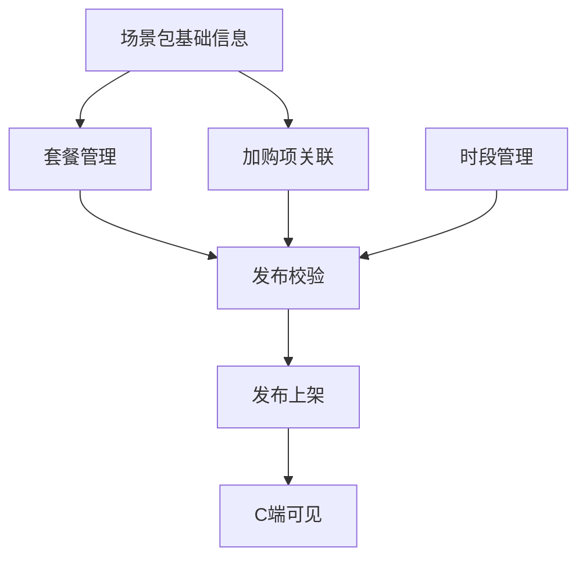
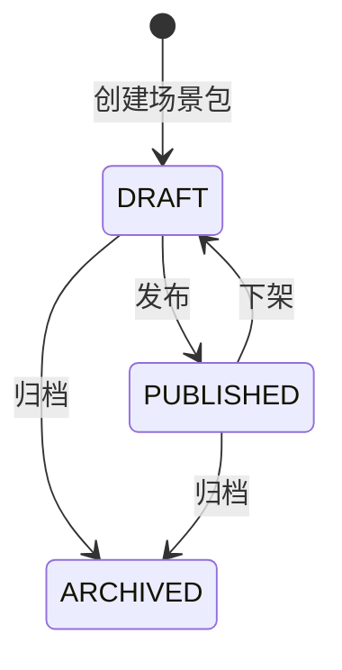

# 业务需求规约文档 - 场景包预订核心功能（P0）

**项目名称**: Cinema Business Center Platform - 场景包预订管理模块  
**文档版本**: v1.0  
**创建日期**: 2025-12-23  
**最后更新**: 2025-12-23  
**状态**: 需求分析  
**关联 Spec**: `specs/017-scenario-package/`, `specs/018-hall-reserve-homepage/`

---

## 1. 文档概述

### 1.1 目的

本文档定义影院场景包预订系统的核心功能需求（P0优先级），确保运营平台（B端）与用户预订小程序（C端）的数据一致性，实现场景包的完整配置与销售闭环。

### 1.2 适用范围

- **B端运营平台**: 场景包套餐配置、加购项管理、时段管理、发布上下架
- **C端小程序**: 场景包详情展示、套餐选择、加购选择、时段预订
- **后端服务**: API设计、数据模型、业务逻辑

### 1.3 术语定义

| 术语 | 英文 | 定义 |
|------|------|------|
| 场景包 | Scenario Package | 一种可预订的场地服务组合，如"企业年会专场"、"求婚惊喜专场" |
| 套餐 | Package Tier | 场景包下的价格档位，如"基础套餐"、"豪华套餐" |
| 加购项 | Add-on Item | 可额外购买的增值服务或商品，如"高端茶歇"、"鲜花布置" |
| 时段 | Time Slot | 可预订的具体时间段，如"10:00-13:00" |
| 库存 | Inventory | 某时段可预订的数量 |
| 发布 | Publish | 将场景包状态从草稿变为上架可售 |
| 下架 | Unpublish | 将场景包状态从上架变为下架不可售 |

---

## 2. 业务背景

### 2.1 业务场景

影院除常规电影放映外，提供影厅包场服务，用于：
- **商务活动**: 企业年会、发布会、路演、团建
- **私人定制**: 求婚、纪念日、私密观影
- **派对策划**: 生日派对、粉丝应援、主题活动

### 2.2 当前问题

| 问题 | 现状 | 影响 |
|------|------|------|
| 套餐配置缺失 | C端套餐数据硬编码 | 运营无法调整价格和内容 |
| 加购项不可管理 | C端加购项硬编码 | 无法新增/修改/下架加购商品 |
| 时段无法配置 | C端时段硬编码 | 无法根据实际排期管理可预订时段 |
| 无发布流程 | 场景包创建即可见 | 草稿/未完善的场景包可能被用户看到 |

### 2.3 目标价值

1. **可配置性**: 运营人员可在后台灵活配置套餐、加购、时段
2. **一致性**: B端配置 → 后端API → C端展示，数据全链路一致
3. **可控性**: 通过发布/下架机制控制场景包的可售状态
4. **实时性**: 配置变更实时生效，用户看到最新信息

---

## 3. 功能模块划分

### 3.1 模块总览

```
场景包预订核心功能 (P0)
├── 1. 套餐管理 (Package Tier Management)
│   ├── 1.1 套餐列表查看
│   ├── 1.2 套餐创建
│   ├── 1.3 套餐编辑
│   ├── 1.4 套餐删除
│   └── 1.5 套餐排序
├── 2. 加购项管理 (Add-on Management)
│   ├── 2.1 加购项列表
│   ├── 2.2 加购项创建
│   ├── 2.3 加购项编辑
│   ├── 2.4 加购项上下架
│   └── 2.5 加购项关联场景包
├── 3. 可预订时段管理 (Time Slot Management)
│   ├── 3.1 时段模板配置
│   ├── 3.2 特定日期时段覆盖
│   ├── 3.3 时段库存设置
│   └── 3.4 时段状态管理
└── 4. 发布/下架管理 (Publish Workflow)
    ├── 4.1 发布前校验
    ├── 4.2 发布操作
    ├── 4.3 下架操作
    └── 4.4 状态历史记录
```

### 3.2 模块依赖关系



---

## 4. 详细功能需求

### 4.1 套餐管理 (Package Tier Management)

#### 4.1.1 功能描述

为场景包配置多个价格档位的套餐，每个套餐包含名称、描述、价格、原价、标签等信息，用户在C端选择套餐进行预订。

#### 4.1.2 数据模型

```sql
CREATE TABLE package_tiers (
    id UUID PRIMARY KEY DEFAULT gen_random_uuid(),
    scenario_package_id UUID NOT NULL REFERENCES scenario_packages(id),
    name VARCHAR(100) NOT NULL,           -- 套餐名称，如"基础套餐"
    description TEXT,                      -- 套餐描述
    price DECIMAL(10,2) NOT NULL,         -- 售价
    original_price DECIMAL(10,2),          -- 原价（用于显示折扣）
    tags JSONB DEFAULT '[]',              -- 标签数组，如["推荐", "限时优惠"]
    sort_order INTEGER DEFAULT 0,          -- 排序顺序
    is_active BOOLEAN DEFAULT true,        -- 是否启用
    created_at TIMESTAMPTZ DEFAULT NOW(),
    updated_at TIMESTAMPTZ DEFAULT NOW(),
    UNIQUE(scenario_package_id, name)
);

-- 索引
CREATE INDEX idx_package_tiers_scenario ON package_tiers(scenario_package_id);
CREATE INDEX idx_package_tiers_active ON package_tiers(scenario_package_id, is_active);
```

#### 4.1.3 功能要求

**FR-PKG-001**: 套餐列表展示
- 系统必须在场景包编辑页面显示该场景包下所有套餐
- 列表按 `sort_order` 升序排列
- 显示字段：名称、价格、原价、标签、状态

**FR-PKG-002**: 套餐创建
- 必填字段：名称、价格
- 可选字段：描述、原价、标签
- 原价必须 ≥ 售价（用于显示折扣）
- 同一场景包下套餐名称不能重复

**FR-PKG-003**: 套餐编辑
- 支持编辑所有字段
- 已发布场景包的套餐编辑后需重新发布生效

**FR-PKG-004**: 套餐删除
- 软删除（设置 `is_active = false`）
- 已有订单关联的套餐不可删除，仅可禁用

**FR-PKG-005**: 套餐排序
- 支持拖拽排序
- C端按排序顺序展示

**FR-PKG-006**: 价格校验
- 价格必须 > 0
- 原价必须 ≥ 售价
- 价格精度到分（两位小数）

#### 4.1.4 API 设计

| 方法 | 端点 | 描述 |
|------|------|------|
| GET | `/api/scenario-packages/{id}/tiers` | 获取套餐列表 |
| POST | `/api/scenario-packages/{id}/tiers` | 创建套餐 |
| PUT | `/api/scenario-packages/{id}/tiers/{tierId}` | 更新套餐 |
| DELETE | `/api/scenario-packages/{id}/tiers/{tierId}` | 删除套餐 |
| PUT | `/api/scenario-packages/{id}/tiers/sort` | 批量更新排序 |

**请求示例 - 创建套餐**:
```json
POST /api/scenario-packages/{id}/tiers
{
  "name": "豪华套餐",
  "description": "包含VIP包厢、专属服务、茶歇饮品",
  "price": 3888.00,
  "originalPrice": 4999.00,
  "tags": ["推荐", "限时优惠"]
}
```

**响应示例**:
```json
{
  "success": true,
  "data": {
    "id": "tier-uuid",
    "scenarioPackageId": "pkg-uuid",
    "name": "豪华套餐",
    "description": "包含VIP包厢、专属服务、茶歇饮品",
    "price": 3888.00,
    "originalPrice": 4999.00,
    "tags": ["推荐", "限时优惠"],
    "sortOrder": 1,
    "isActive": true,
    "createdAt": "2025-12-23T10:00:00Z"
  }
}
```

#### 4.1.5 界面要求

- **套餐卡片**: 每个套餐以卡片形式展示，显示核心信息
- **拖拽排序**: 支持拖拽卡片调整顺序
- **快捷操作**: 卡片右上角提供编辑、删除按钮
- **价格格式**: 显示为 "¥3,888.00"，原价显示删除线

#### 4.1.6 验收标准

| ID | 验收条件 |
|----|----------|
| AS-PKG-001 | 用户点击"添加套餐"按钮，弹出套餐编辑表单 |
| AS-PKG-002 | 用户填写套餐信息并保存，套餐出现在列表中 |
| AS-PKG-003 | 用户拖拽套餐卡片，排序顺序自动保存 |
| AS-PKG-004 | 用户在C端详情页看到套餐列表，与B端配置一致 |
| AS-PKG-005 | 用户选择套餐后，总价正确计算 |

---

### 4.2 加购项管理 (Add-on Management)

#### 4.2.1 功能描述

管理可额外购买的增值服务或商品，用户在预订时可选择添加。加购项为全局资源，可关联到多个场景包。

#### 4.2.2 数据模型

```sql
-- 加购项主表
CREATE TABLE addon_items (
    id UUID PRIMARY KEY DEFAULT gen_random_uuid(),
    name VARCHAR(100) NOT NULL,           -- 加购项名称
    description TEXT,                      -- 描述
    price DECIMAL(10,2) NOT NULL,         -- 单价
    category VARCHAR(50),                  -- 分类：Food/Drink/Service/Decoration
    image_url TEXT,                        -- 图片
    max_quantity INTEGER DEFAULT 99,       -- 单次预订最大数量
    is_active BOOLEAN DEFAULT true,        -- 是否上架
    created_at TIMESTAMPTZ DEFAULT NOW(),
    updated_at TIMESTAMPTZ DEFAULT NOW()
);

-- 场景包-加购项关联表
CREATE TABLE scenario_package_addons (
    id UUID PRIMARY KEY DEFAULT gen_random_uuid(),
    scenario_package_id UUID NOT NULL REFERENCES scenario_packages(id),
    addon_item_id UUID NOT NULL REFERENCES addon_items(id),
    sort_order INTEGER DEFAULT 0,
    is_required BOOLEAN DEFAULT false,    -- 是否必选
    created_at TIMESTAMPTZ DEFAULT NOW(),
    UNIQUE(scenario_package_id, addon_item_id)
);

-- 索引
CREATE INDEX idx_addon_items_active ON addon_items(is_active);
CREATE INDEX idx_scenario_addons_pkg ON scenario_package_addons(scenario_package_id);
```

#### 4.2.3 功能要求

**FR-ADD-001**: 加购项列表（全局管理）
- 运营人员可查看所有加购项
- 支持按分类筛选、按名称搜索
- 显示：名称、分类、价格、状态、关联场景包数

**FR-ADD-002**: 加购项创建
- 必填字段：名称、价格、分类
- 可选字段：描述、图片、最大数量
- 分类枚举：Food（餐饮）、Drink（饮品）、Service（服务）、Decoration（布置）

**FR-ADD-003**: 加购项编辑
- 支持编辑所有字段
- 修改后所有关联场景包自动生效

**FR-ADD-004**: 加购项上下架
- 下架后所有关联场景包不再显示该加购项
- 上架后恢复显示

**FR-ADD-005**: 场景包关联加购项
- 在场景包编辑页面选择可用的加购项
- 支持设置排序顺序
- 支持设置是否必选

**FR-ADD-006**: C端展示逻辑
- 只展示 `is_active = true` 的加购项
- 按关联表的 `sort_order` 排序
- 必选项默认数量为1，不可减为0

#### 4.2.4 API 设计

| 方法 | 端点 | 描述 |
|------|------|------|
| GET | `/api/addon-items` | 获取加购项列表（支持分页筛选） |
| POST | `/api/addon-items` | 创建加购项 |
| PUT | `/api/addon-items/{id}` | 更新加购项 |
| PATCH | `/api/addon-items/{id}/status` | 上下架加购项 |
| GET | `/api/scenario-packages/{id}/addons` | 获取场景包关联的加购项 |
| PUT | `/api/scenario-packages/{id}/addons` | 更新场景包的加购项关联 |

**请求示例 - 更新关联**:
```json
PUT /api/scenario-packages/{id}/addons
{
  "addons": [
    { "addonItemId": "addon-1", "sortOrder": 1, "isRequired": false },
    { "addonItemId": "addon-2", "sortOrder": 2, "isRequired": true }
  ]
}
```

#### 4.2.5 界面要求

**全局加购项管理页面**:
- 表格形式展示所有加购项
- 支持新增、编辑、上下架操作
- 显示每个加购项被多少场景包引用

**场景包编辑页面**:
- 穿梭框形式选择加购项
- 已选加购项支持拖拽排序
- 可设置必选标记

#### 4.2.6 验收标准

| ID | 验收条件 |
|----|----------|
| AS-ADD-001 | 运营创建加购项"高端茶歇"，价格58元，分类为Food |
| AS-ADD-002 | 运营在场景包A中关联该加购项 |
| AS-ADD-003 | C端用户在场景包A详情页看到"高端茶歇"加购选项 |
| AS-ADD-004 | 用户添加2份茶歇，总价增加116元 |
| AS-ADD-005 | 运营下架该加购项，C端立即不再显示 |

---

### 4.3 可预订时段管理 (Time Slot Management)

#### 4.3.1 功能描述

配置场景包的可预订时段，支持模板化配置和特定日期覆盖，管理每个时段的库存数量。

#### 4.3.2 数据模型

```sql
-- 时段模板（每周重复）
CREATE TABLE time_slot_templates (
    id UUID PRIMARY KEY DEFAULT gen_random_uuid(),
    scenario_package_id UUID NOT NULL REFERENCES scenario_packages(id),
    day_of_week INTEGER NOT NULL,         -- 0=周日, 1=周一, ..., 6=周六
    start_time TIME NOT NULL,             -- 开始时间
    end_time TIME NOT NULL,               -- 结束时间
    capacity INTEGER DEFAULT 1,            -- 可预订数量
    is_active BOOLEAN DEFAULT true,
    created_at TIMESTAMPTZ DEFAULT NOW(),
    UNIQUE(scenario_package_id, day_of_week, start_time)
);

-- 特定日期时段（覆盖模板）
CREATE TABLE time_slot_overrides (
    id UUID PRIMARY KEY DEFAULT gen_random_uuid(),
    scenario_package_id UUID NOT NULL REFERENCES scenario_packages(id),
    slot_date DATE NOT NULL,              -- 具体日期
    start_time TIME NOT NULL,
    end_time TIME NOT NULL,
    capacity INTEGER DEFAULT 1,            -- 可预订数量，0表示不可预订
    override_type VARCHAR(20) NOT NULL,    -- ADD（新增）/MODIFY（修改）/CANCEL（取消）
    reason TEXT,                           -- 原因说明
    created_at TIMESTAMPTZ DEFAULT NOW(),
    UNIQUE(scenario_package_id, slot_date, start_time)
);

-- 时段库存记录（实际预订后扣减）
CREATE TABLE time_slot_inventory (
    id UUID PRIMARY KEY DEFAULT gen_random_uuid(),
    scenario_package_id UUID NOT NULL REFERENCES scenario_packages(id),
    slot_date DATE NOT NULL,
    start_time TIME NOT NULL,
    total_capacity INTEGER NOT NULL,       -- 总库存
    booked_count INTEGER DEFAULT 0,        -- 已预订数量
    created_at TIMESTAMPTZ DEFAULT NOW(),
    updated_at TIMESTAMPTZ DEFAULT NOW(),
    UNIQUE(scenario_package_id, slot_date, start_time)
);

-- 索引
CREATE INDEX idx_slot_templates_pkg ON time_slot_templates(scenario_package_id);
CREATE INDEX idx_slot_overrides_date ON time_slot_overrides(scenario_package_id, slot_date);
CREATE INDEX idx_slot_inventory_date ON time_slot_inventory(scenario_package_id, slot_date);
```

#### 4.3.3 功能要求

**FR-SLT-001**: 时段模板配置
- 按星期几配置默认可预订时段
- 每个时段指定开始时间、结束时间、库存数量
- 支持一天多个时段

**FR-SLT-002**: 特定日期覆盖
- 新增特定日期的额外时段
- 修改特定日期的时段库存
- 取消特定日期的某个时段

**FR-SLT-003**: 时段查询（C端API）
- 查询指定日期的可预订时段列表
- 返回：时间、剩余库存、状态（可预订/售罄/不可用）
- 缓存策略：5分钟

**FR-SLT-004**: 库存管理
- 预订成功后扣减库存
- 取消预订后释放库存
- 库存为0时显示"售罄"

**FR-SLT-005**: 时段状态计算
```
if (override.type == CANCEL) {
    status = "不可用"
} else if (booked_count >= capacity) {
    status = "售罄"
} else {
    status = "可预订"
    remaining = capacity - booked_count
}
```

#### 4.3.4 API 设计

| 方法 | 端点 | 描述 |
|------|------|------|
| GET | `/api/scenario-packages/{id}/slot-templates` | 获取时段模板 |
| PUT | `/api/scenario-packages/{id}/slot-templates` | 批量更新时段模板 |
| GET | `/api/scenario-packages/{id}/slot-overrides?date=2025-12-25` | 获取特定日期覆盖 |
| POST | `/api/scenario-packages/{id}/slot-overrides` | 添加日期覆盖 |
| DELETE | `/api/scenario-packages/{id}/slot-overrides/{overrideId}` | 删除日期覆盖 |
| GET | `/api/scenario-packages/{id}/available-slots?date=2025-12-25` | 【C端】查询可预订时段 |

**C端查询响应示例**:
```json
{
  "success": true,
  "data": {
    "date": "2025-12-25",
    "slots": [
      { "startTime": "10:00", "endTime": "13:00", "status": "available", "remaining": 2 },
      { "startTime": "14:30", "endTime": "17:30", "status": "sold_out", "remaining": 0 },
      { "startTime": "19:00", "endTime": "22:00", "status": "available", "remaining": 1 }
    ]
  }
}
```

#### 4.3.5 界面要求

**时段模板配置**:
- 周视图：显示周一至周日的时段安排
- 可视化时间轴：拖拽添加/调整时段
- 批量复制：将某天配置复制到其他天

**日历视图**:
- 日历形式显示未来30天
- 有覆盖配置的日期特殊标记
- 点击日期查看/编辑该日时段

#### 4.3.6 验收标准

| ID | 验收条件 |
|----|----------|
| AS-SLT-001 | 运营配置周一至周五 10:00、14:30、19:00 三个时段 |
| AS-SLT-002 | C端查询周三可预订时段，返回3个时段 |
| AS-SLT-003 | 运营取消12月25日19:00时段（节假日调整） |
| AS-SLT-004 | C端查询12月25日，只返回2个可预订时段 |
| AS-SLT-005 | 用户预订10:00时段后，该时段剩余库存-1 |

---

### 4.4 发布/下架管理 (Publish Workflow)

#### 4.4.1 功能描述

控制场景包的上架状态，确保只有配置完整的场景包才能被用户看到，支持发布前预览和下架操作。

#### 4.4.2 状态流转



| 状态 | 英文 | 说明 | C端可见 |
|------|------|------|---------|
| 草稿 | DRAFT | 新建或修改中 | ❌ |
| 已发布 | PUBLISHED | 上架可售 | ✅ |
| 已归档 | ARCHIVED | 停用归档 | ❌ |

#### 4.4.3 功能要求

**FR-PUB-001**: 发布前校验
发布场景包前必须满足以下条件：
- ✅ 基础信息完整（名称、描述、分类、背景图）
- ✅ 至少配置1个套餐
- ✅ 至少配置1个可预订时段
- ✅ 套餐价格有效（> 0）

**FR-PUB-002**: 发布操作
- 校验通过后状态变为 PUBLISHED
- 记录发布时间、操作人
- 发布后C端API可查询到该场景包

**FR-PUB-003**: 下架操作
- 状态变为 DRAFT
- 记录下架时间、操作人、下架原因
- 下架后C端API不再返回该场景包
- 已有进行中订单的场景包需二次确认

**FR-PUB-004**: 发布前预览
- 提供预览链接，模拟C端显示效果
- 仅运营人员可访问预览链接
- 预览链接包含临时token，有效期24小时

**FR-PUB-005**: 状态历史记录
- 记录所有状态变更历史
- 包含：操作类型、操作时间、操作人、备注

#### 4.4.4 数据模型扩展

```sql
-- 状态历史表
CREATE TABLE scenario_package_status_history (
    id UUID PRIMARY KEY DEFAULT gen_random_uuid(),
    scenario_package_id UUID NOT NULL REFERENCES scenario_packages(id),
    from_status VARCHAR(20),
    to_status VARCHAR(20) NOT NULL,
    operated_by UUID,                      -- 操作人ID
    operated_at TIMESTAMPTZ DEFAULT NOW(),
    reason TEXT,                           -- 原因/备注
    FOREIGN KEY (operated_by) REFERENCES users(id)
);

-- 修改场景包主表
ALTER TABLE scenario_packages ADD COLUMN IF NOT EXISTS
    published_at TIMESTAMPTZ;              -- 最近发布时间
```

#### 4.4.5 API 设计

| 方法 | 端点 | 描述 |
|------|------|------|
| GET | `/api/scenario-packages/{id}/publish-check` | 发布前校验 |
| POST | `/api/scenario-packages/{id}/publish` | 发布场景包 |
| POST | `/api/scenario-packages/{id}/unpublish` | 下架场景包 |
| GET | `/api/scenario-packages/{id}/preview-token` | 获取预览链接 |
| GET | `/api/scenario-packages/{id}/status-history` | 获取状态历史 |

**发布校验响应示例**:
```json
{
  "success": true,
  "data": {
    "canPublish": false,
    "checks": [
      { "item": "basicInfo", "passed": true, "message": "基础信息完整" },
      { "item": "tiers", "passed": false, "message": "至少需要1个套餐" },
      { "item": "timeSlots", "passed": true, "message": "已配置3个时段" },
      { "item": "pricing", "passed": true, "message": "价格设置有效" }
    ]
  }
}
```

#### 4.4.6 界面要求

**场景包编辑页面**:
- 页面顶部显示当前状态徽章
- "发布"按钮在校验不通过时禁用
- 点击禁用按钮时显示校验失败原因

**发布确认弹窗**:
- 显示校验结果清单
- 全部通过时显示"确认发布"按钮
- 发布成功后跳转列表页

**下架确认弹窗**:
- 显示该场景包的进行中订单数量
- 要求输入下架原因
- 有订单时显示警告提示

#### 4.4.7 验收标准

| ID | 验收条件 |
|----|----------|
| AS-PUB-001 | 场景包未配置套餐时，发布按钮禁用，提示"至少需要1个套餐" |
| AS-PUB-002 | 场景包配置完整后，点击发布，状态变为"已发布" |
| AS-PUB-003 | 已发布场景包在C端列表中可见 |
| AS-PUB-004 | 点击下架，输入原因后，状态变为"草稿" |
| AS-PUB-005 | 下架后C端立即不可见 |

---

## 5. 非功能需求

### 5.1 性能要求

| 指标 | 要求 |
|------|------|
| C端时段查询响应时间 | ≤ 500ms |
| B端套餐保存响应时间 | ≤ 1s |
| C端场景包列表加载 | ≤ 2s |
| 发布校验响应时间 | ≤ 1s |

### 5.2 并发要求

| 场景 | 要求 |
|------|------|
| C端时段查询 | 支持1000 QPS |
| 预订库存扣减 | 支持乐观锁防超卖 |
| B端配置操作 | 支持50并发用户 |

### 5.3 缓存策略

| 数据 | 缓存时间 | 更新策略 |
|------|----------|----------|
| 场景包列表 | 5分钟 | 发布/下架时主动失效 |
| 时段可用性 | 1分钟 | 预订成功后主动失效 |
| 加购项列表 | 10分钟 | 编辑后主动失效 |

---

## 6. 实施计划

### 6.1 开发阶段

| 阶段 | 内容 | 预估工时 |
|------|------|----------|
| Phase 1 | 套餐管理（后端+前端） | 3天 |
| Phase 2 | 加购项管理（后端+前端） | 3天 |
| Phase 3 | 时段管理（后端+前端） | 4天 |
| Phase 4 | 发布/下架流程 | 2天 |
| Phase 5 | C端API对接 | 2天 |
| Phase 6 | 集成测试 | 2天 |

### 6.2 技术栈

| 层次 | 技术 |
|------|------|
| 后端 | Spring Boot 3.x + Supabase PostgreSQL |
| 前端B端 | React + Ant Design + TanStack Query |
| 前端C端 | Taro + React |
| 缓存 | Spring Cache (Memory) |

---

## 7. 附录

### 7.1 C端详情页字段映射

| C端字段 | 数据来源 | 当前状态 |
|---------|----------|----------|
| 场景包标题 | scenario_packages.name | ✅ 已有 |
| 场景包分类 | scenario_packages.category | ✅ 已有 |
| 场景包图片 | scenario_packages.background_image_url | ✅ 已有 |
| 套餐列表 | package_tiers (新增) | ❌ 待建设 |
| 加购项列表 | scenario_package_addons + addon_items (新增) | ❌ 待建设 |
| 日期选项 | 动态计算（今天起30天） | ⚠️ 硬编码 |
| 时段列表 | time_slot_templates/overrides/inventory (新增) | ❌ 待建设 |

### 7.2 相关文档

- [specs/017-scenario-package/spec.md](../specs/017-scenario-package/spec.md) - 场景包管理需求
- [specs/018-hall-reserve-homepage/spec.md](../specs/018-hall-reserve-homepage/spec.md) - C端首页需求
- [数据模型文档](./data-model/data_model.md) - 系统数据模型
