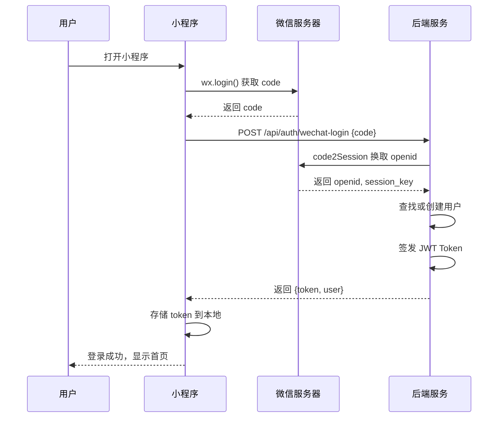

# 业务需求规约文档 - 微信小程序登录功能

**项目名称**: Cinema Business Center Platform - 用户认证模块  
**文档版本**: v1.0  
**创建日期**: 2025-12-24  
**最后更新**: 2025-12-24  
**状态**: 需求分析  
**关联 Spec**: `hall-reserve-taro/`（C端小程序）

---

## 1. 文档概述

### 1.1 目的

本文档定义影院多元经营小程序的用户登录功能需求，确保用户身份认证、预约单查询等需要用户身份标识的功能正常运作。

### 1.2 适用范围

- **C端小程序**: 微信登录、用户信息获取、登录态管理
- **后端服务**: 微信登录验证、JWT Token 签发、用户数据管理

### 1.3 术语定义

| 术语 | 英文 | 定义 |
|------|------|------|
| OpenID | openid | 微信用户在当前小程序的唯一标识 |
| UnionID | unionid | 微信用户在同一开放平台下的唯一标识 |
| Session Key | session_key | 微信会话密钥，用于解密用户数据 |
| JWT | JSON Web Token | 无状态身份认证令牌 |
| 静默登录 | Silent Login | 无需用户手动操作的自动登录方式 |
| 授权登录 | Authorized Login | 需用户点击确认的登录方式 |

---

## 2. 业务背景

### 2.1 业务场景

影院多元经营小程序提供场景包预订服务，用户可以：
- **浏览场景包列表**（无需登录）
- **查看场景包详情**（无需登录）
- **创建预约订单**（需要登录）
- **查看我的预约**（需要登录）
- **取消预约订单**（需要登录）

### 2.2 当前问题

| 问题 | 现状 | 影响 |
|------|------|------|
| 无登录功能 | 小程序没有登录页面和登录流程 | 无法识别用户身份 |
| 预约单查询失败 | API 返回 401 Unauthorized | 用户无法查看自己的预约 |
| 无用户体系 | 后端无用户表和认证接口 | 订单无法关联到具体用户 |
| Token 为空 | `access_token` 始终为 null | 所有需认证的 API 都会失败 |

### 2.3 目标价值

1. **身份识别**: 通过微信登录获取用户唯一标识（OpenID）
2. **数据关联**: 预约订单关联到具体用户，支持"我的预约"查询
3. **安全保障**: 通过 JWT Token 验证用户身份，防止越权操作
4. **体验优化**: 静默登录无感知，授权登录一键完成

---

## 3. 功能模块划分

### 3.1 模块总览

```
微信小程序登录功能
├── 1. 静默登录 (Silent Login)
│   ├── 1.1 wx.login 获取 code
│   ├── 1.2 后端换取 openid
│   └── 1.3 签发 JWT Token
├── 2. 授权登录 (Authorized Login)
│   ├── 2.1 获取用户头像昵称
│   ├── 2.2 获取手机号（可选）
│   └── 2.3 完善用户资料
├── 3. 登录态管理 (Session Management)
│   ├── 3.1 Token 存储
│   ├── 3.2 Token 刷新
│   ├── 3.3 Token 过期处理
│   └── 3.4 退出登录
└── 4. 路由守卫 (Route Guard)
    ├── 4.1 登录检查
    ├── 4.2 自动跳转
    └── 4.3 登录后回调
```

### 3.2 登录流程图



---

## 4. 详细功能需求

### 4.1 静默登录 (Silent Login)

#### 4.1.1 功能描述

用户打开小程序时，后台自动完成登录流程，无需用户手动操作。通过微信提供的临时登录凭证 code 换取用户唯一标识 openid。

#### 4.1.2 数据模型

```sql
-- 用户表
CREATE TABLE users (
    id UUID PRIMARY KEY DEFAULT gen_random_uuid(),
    openid VARCHAR(100) NOT NULL UNIQUE,       -- 微信 OpenID
    unionid VARCHAR(100),                       -- 微信 UnionID（可选）
    nickname VARCHAR(100),                      -- 昵称
    avatar_url TEXT,                            -- 头像 URL
    phone VARCHAR(20),                          -- 手机号（可选）
    status VARCHAR(20) DEFAULT 'ACTIVE',        -- 状态: ACTIVE/DISABLED
    last_login_at TIMESTAMPTZ,                  -- 最后登录时间
    created_at TIMESTAMPTZ DEFAULT NOW(),
    updated_at TIMESTAMPTZ DEFAULT NOW()
);

-- 索引
CREATE INDEX idx_users_openid ON users(openid);
CREATE INDEX idx_users_phone ON users(phone);
```

#### 4.1.3 功能要求

**FR-AUTH-001**: 获取微信登录凭证
- 小程序启动时调用 `wx.login()` 获取临时登录凭证 `code`
- `code` 有效期 5 分钟，只能使用一次

**FR-AUTH-002**: 后端验证登录凭证
- 后端使用 `code` + `appid` + `appsecret` 调用微信 `code2Session` 接口
- 获取用户唯一标识 `openid` 和会话密钥 `session_key`
- `session_key` 用于后续解密用户敏感数据

**FR-AUTH-003**: 用户注册/查找
- 根据 `openid` 查找用户记录
- 如不存在则自动创建新用户（仅存储 openid）
- 更新用户最后登录时间

**FR-AUTH-004**: 签发 JWT Token
- 生成包含 `userId` 和 `openid` 的 JWT Token
- Access Token 有效期：7 天
- Refresh Token 有效期：30 天

#### 4.1.4 API 设计

**接口**: `POST /api/auth/wechat-login`

**请求参数**:
```json
{
  "code": "0a3xxx...xxx"
}
```

**响应示例**:
```json
{
  "success": true,
  "data": {
    "accessToken": "eyJhbGciOiJIUzI1NiIs...",
    "refreshToken": "eyJhbGciOiJIUzI1NiIs...",
    "expiresIn": 604800,
    "user": {
      "id": "uuid-xxx",
      "openid": "oXXX...XXX",
      "nickname": null,
      "avatarUrl": null,
      "phone": null,
      "isNewUser": true
    }
  }
}
```

#### 4.1.5 验收标准

| ID | 验收条件 |
|----|----------|
| AS-AUTH-001 | 用户首次打开小程序，后台自动完成登录，获得 JWT Token |
| AS-AUTH-002 | 登录成功后，Token 正确存储到本地 Storage |
| AS-AUTH-003 | 新用户自动创建用户记录，数据库可查到对应 openid |
| AS-AUTH-004 | 老用户登录后，更新 last_login_at 时间戳 |

---

### 4.2 授权登录 (Authorized Login)

#### 4.2.1 功能描述

当需要获取用户头像、昵称或手机号时，需要用户主动授权。授权后可完善用户资料。

#### 4.2.2 功能要求

**FR-AUTH-005**: 获取用户头像昵称
- 使用微信头像昵称组件 `<button open-type="chooseAvatar">` 获取头像
- 使用 `<input type="nickname">` 获取昵称
- 用户点击确认后更新用户资料

**FR-AUTH-006**: 获取手机号（可选）
- 使用 `<button open-type="getPhoneNumber">` 获取手机号
- 后端解密手机号数据
- 用于订单联系、短信通知等场景

**FR-AUTH-007**: 更新用户资料
- 支持更新 nickname、avatarUrl、phone
- 更新后返回最新用户信息

#### 4.2.3 API 设计

**接口**: `PUT /api/users/profile`

**请求参数**:
```json
{
  "nickname": "张三",
  "avatarUrl": "https://..."
}
```

**接口**: `POST /api/auth/decrypt-phone`

**请求参数**:
```json
{
  "encryptedData": "xxx...",
  "iv": "xxx..."
}
```

**响应示例**:
```json
{
  "success": true,
  "data": {
    "phone": "13800138000"
  }
}
```

#### 4.2.4 验收标准

| ID | 验收条件 |
|----|----------|
| AS-AUTH-005 | 用户点击头像选择器，可选择本地图片作为头像 |
| AS-AUTH-006 | 用户输入昵称并保存，数据库更新用户昵称 |
| AS-AUTH-007 | 用户授权手机号后，后端正确解密并存储 |

---

### 4.3 登录态管理 (Session Management)

#### 4.3.1 功能描述

管理用户的登录状态，包括 Token 存储、刷新、过期处理和退出登录。

#### 4.3.2 功能要求

**FR-AUTH-008**: Token 存储
- Access Token 存储到 `Taro.setStorageSync('access_token', token)`
- Refresh Token 存储到 `Taro.setStorageSync('refresh_token', token)`
- 用户信息存储到 `Taro.setStorageSync('user_info', user)`

**FR-AUTH-009**: Token 刷新
- Access Token 过期前 1 天自动刷新
- 使用 Refresh Token 换取新的 Access Token
- 刷新失败则跳转登录页

**FR-AUTH-010**: Token 过期处理
- API 请求返回 401 时，尝试用 Refresh Token 刷新
- Refresh Token 也过期时，清除本地 Token，跳转登录页
- 显示提示："登录已过期，请重新登录"

**FR-AUTH-011**: 退出登录
- 清除本地所有登录态数据
- 跳转到首页

#### 4.3.3 API 设计

**接口**: `POST /api/auth/refresh-token`

**请求参数**:
```json
{
  "refreshToken": "eyJhbGciOiJIUzI1NiIs..."
}
```

**响应示例**:
```json
{
  "success": true,
  "data": {
    "accessToken": "eyJhbGciOiJIUzI1NiIs...",
    "expiresIn": 604800
  }
}
```

#### 4.3.4 验收标准

| ID | 验收条件 |
|----|----------|
| AS-AUTH-008 | Token 存储后，关闭小程序重新打开，Token 仍然存在 |
| AS-AUTH-009 | Access Token 过期后，自动使用 Refresh Token 刷新 |
| AS-AUTH-010 | 所有 Token 过期后，跳转到登录页并提示 |
| AS-AUTH-011 | 点击退出登录，清除所有数据并跳回首页 |

---

### 4.4 路由守卫 (Route Guard)

#### 4.4.1 功能描述

对需要登录的页面进行访问控制，未登录用户访问时自动跳转登录页，登录成功后返回原页面。

#### 4.4.2 功能要求

**FR-AUTH-012**: 页面权限分类

| 页面类型 | 示例页面 | 登录要求 |
|----------|----------|----------|
| 公开页面 | 首页、场景包详情、门店详情 | ❌ 不需要 |
| 受保护页面 | 我的预约、预约详情、预约表单 | ✅ 需要 |

**FR-AUTH-013**: 未登录拦截
- 用户访问受保护页面时，检查 Token 是否存在
- Token 不存在或已过期，显示登录提示弹窗
- 用户确认后跳转登录页

**FR-AUTH-014**: 登录后回调
- 记录用户原本要访问的页面路径
- 登录成功后自动跳转回该页面
- 如无记录则跳转首页

**FR-AUTH-015**: 登录提示交互
- 点击"立即预约"按钮时，若未登录则弹出提示
- 提示内容："请先登录后再进行预约"
- 按钮："去登录" / "取消"

#### 4.4.3 验收标准

| ID | 验收条件 |
|----|----------|
| AS-AUTH-012 | 未登录用户可正常浏览首页和场景包详情 |
| AS-AUTH-013 | 未登录用户点击"我的预约"，弹出登录提示 |
| AS-AUTH-014 | 用户从详情页跳转登录，登录后返回详情页 |
| AS-AUTH-015 | 未登录用户点击"立即预约"，提示去登录 |

---

## 5. 非功能需求

### 5.1 安全要求

| 要求 | 说明 |
|------|------|
| AppSecret 保密 | 微信 AppSecret 只能存储在后端，不能暴露给前端 |
| HTTPS 传输 | 所有 API 请求必须使用 HTTPS |
| Token 签名 | JWT 使用 HS256 算法签名，密钥 ≥ 256 位 |
| 防重放攻击 | code 只能使用一次，使用后立即失效 |

### 5.2 性能要求

| 指标 | 要求 |
|------|------|
| 静默登录耗时 | ≤ 2s（包含微信 API 调用） |
| Token 验证耗时 | ≤ 50ms |
| Token 刷新耗时 | ≤ 500ms |

### 5.3 容错处理

| 场景 | 处理方式 |
|------|----------|
| 微信 API 调用失败 | 重试 1 次，仍失败则提示"网络异常，请重试" |
| Token 解析失败 | 清除本地 Token，重新登录 |
| 用户信息获取失败 | 使用默认头像和昵称 |

---

## 6. 实施计划

### 6.1 开发阶段

| 阶段 | 内容 | 预估工时 |
|------|------|----------|
| Phase 1 | 后端用户表和登录接口 | 1 天 |
| Phase 2 | 小程序静默登录实现 | 1 天 |
| Phase 3 | 路由守卫和登录态管理 | 1 天 |
| Phase 4 | 授权登录（头像昵称手机号） | 1 天 |
| Phase 5 | 集成测试和联调 | 1 天 |

### 6.2 技术栈

| 层次 | 技术 |
|------|------|
| 后端 | Spring Boot 3.x + Spring Security + JWT |
| 小程序 | Taro + React + Zustand |
| 数据库 | PostgreSQL (Supabase) |

### 6.3 配置要求

| 配置项 | 说明 |
|--------|------|
| 微信 AppID | 小程序的唯一标识，需在微信公众平台申请 |
| 微信 AppSecret | 小程序密钥，用于调用微信 API |
| JWT Secret | JWT 签名密钥，需安全保管 |
| 服务器域名 | 需在微信公众平台配置请求合法域名 |

---

## 7. 附录

### 7.1 需登录的 API 清单

| API | 方法 | 用途 |
|-----|------|------|
| `/api/reservations` | POST | 创建预约订单 |
| `/api/reservations/my` | GET | 查询我的预约列表 |
| `/api/reservations/{id}` | GET | 查询预约详情 |
| `/api/reservations/{id}/cancel` | POST | 取消预约 |
| `/api/users/profile` | GET/PUT | 获取/更新用户资料 |

### 7.2 微信 API 参考

| API | 文档链接 |
|-----|----------|
| wx.login | https://developers.weixin.qq.com/miniprogram/dev/api/open-api/login/wx.login.html |
| code2Session | https://developers.weixin.qq.com/miniprogram/dev/OpenApiDoc/user-login/code2Session.html |
| 获取手机号 | https://developers.weixin.qq.com/miniprogram/dev/framework/open-ability/getPhoneNumber.html |

### 7.3 相关文档

- [reservationService.ts](../../hall-reserve-taro/src/services/reservationService.ts) - 预约单 API 服务
- [request.ts](../../hall-reserve-taro/src/utils/request.ts) - 请求封装
- [app.config.ts](../../hall-reserve-taro/src/app.config.ts) - 小程序页面配置
