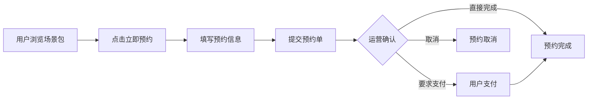
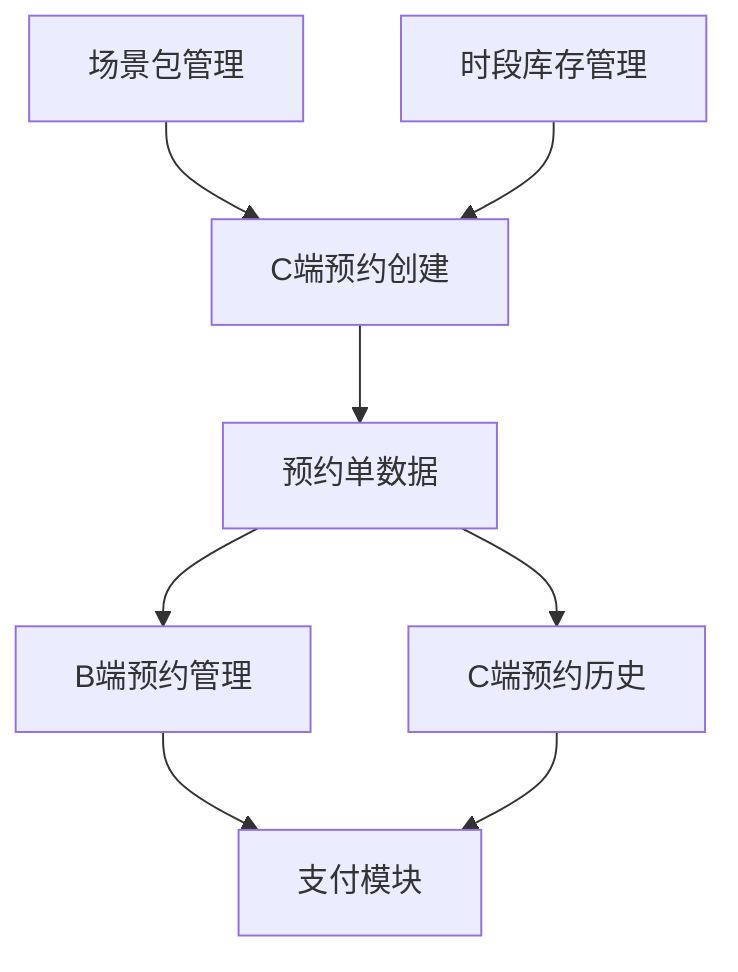
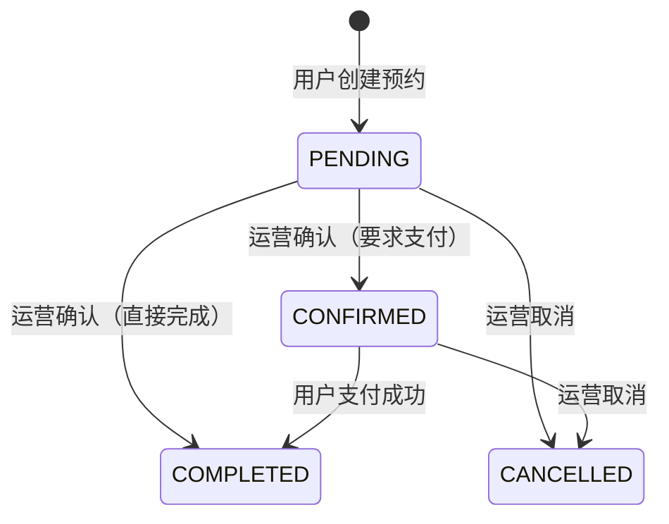

# 业务需求规约文档 - 预约订单管理功能

**项目名称**: Cinema Business Center Platform - 预约订单管理模块  
**文档版本**: v1.0  
**创建日期**: 2025-12-23  
**最后更新**: 2025-12-23  
**状态**: 已完成  
**关联 Spec**: `specs/U001-reservation-order-management/`

---

## 1. 文档概述

### 1.1 目的

本文档定义影院场景包预约订单管理系统的功能需求，实现从用户预约到运营确认的完整业务闭环，支持B端运营平台的预约单管理和C端用户的预约下单流程。

### 1.2 适用范围

- **B端运营平台**: 预约单列表查看、预约确认、预约取消、信息修改
- **C端小程序/H5**: 预约单创建、预约历史查看、预约详情
- **后端服务**: 预约单API、库存管理、状态流转

### 1.3 术语定义

| 术语 | 英文 | 定义 |
|------|------|------|
| 预约单 | Reservation Order | 用户对场景包的预订意向记录，包含选择的套餐、时段、加购项等信息 |
| 预约单号 | Order Number | 预约单的唯一标识，格式：R+时间戳+4位随机数 |
| 待确认 | Pending | 用户提交预约后的初始状态，等待运营确认 |
| 已确认 | Confirmed | 运营确认后，等待用户支付（可选） |
| 已完成 | Completed | 预约流程完成（已支付或无需支付） |
| 已取消 | Cancelled | 预约被取消（运营取消或系统自动取消） |

---

## 2. 业务背景

### 2.1 业务场景

影院场景包预订采用"先预约后确认"的业务模式：
- **企业客户**: 需要人工确认档期、沟通细节后再支付
- **个人客户**: 预约后由运营确认，可选择立即支付或线下支付
- **特殊场景**: 内部活动、合作方预约可免支付直接确认

### 2.2 业务流程



### 2.3 当前改进

| 改进点 | 改进前 | 改进后 |
|--------|--------|--------|
| 下单方式 | 直接支付（立即支付） | 先预约后确认（立即预约） |
| 确认流程 | 无 | 运营可确认/取消预约 |
| 支付灵活性 | 必须在线支付 | 可选支付或免支付 |
| 预约管理 | 无后台管理 | B端完整管理功能 |

---

## 3. 功能模块划分

### 3.1 模块总览

```
预约订单管理功能
├── 1. C端预约创建 (Reservation Creation)
│   ├── 1.1 预约信息填写
│   ├── 1.2 实时价格计算
│   ├── 1.3 库存检查与扣减
│   └── 1.4 预约提交与成功页
├── 2. B端预约管理 (Reservation Management)
│   ├── 2.1 预约单列表
│   ├── 2.2 预约单搜索与筛选
│   ├── 2.3 预约单详情查看
│   ├── 2.4 预约确认操作
│   ├── 2.5 预约取消操作
│   └── 2.6 预约信息修改
└── 3. C端预约历史 (My Reservations)
    ├── 3.1 预约列表查看
    ├── 3.2 预约详情查看
    └── 3.3 预约状态追踪
```

### 3.2 模块依赖关系



---

## 4. 详细功能需求

### 4.1 C端预约创建

#### 4.1.1 功能描述

用户在场景包详情页点击"立即预约"进入预约流程，选择时段、套餐、加购项，填写联系人信息后提交预约单。

#### 4.1.2 数据模型

```sql
-- 预约单主表
CREATE TABLE reservation_orders (
    id UUID PRIMARY KEY DEFAULT gen_random_uuid(),
    order_number VARCHAR(50) NOT NULL UNIQUE,  -- 预约单号 R202512230001
    customer_id UUID,                           -- 客户ID（可为空，支持游客预约）
    scenario_package_id UUID NOT NULL,          -- 场景包ID
    package_tier_id UUID NOT NULL,              -- 套餐ID
    time_slot_template_id UUID NOT NULL,        -- 时段模板ID
    reservation_date DATE NOT NULL,             -- 预订日期
    contact_name VARCHAR(100) NOT NULL,         -- 联系人姓名
    contact_phone VARCHAR(20) NOT NULL,         -- 联系人手机
    remark TEXT,                                 -- 备注
    total_amount DECIMAL(10,2) NOT NULL,        -- 总金额
    status VARCHAR(20) NOT NULL DEFAULT 'PENDING', -- 状态
    requires_payment BOOLEAN DEFAULT true,       -- 是否需要支付
    cancel_reason TEXT,                          -- 取消原因
    confirmed_at TIMESTAMPTZ,                    -- 确认时间
    completed_at TIMESTAMPTZ,                    -- 完成时间
    cancelled_at TIMESTAMPTZ,                    -- 取消时间
    created_at TIMESTAMPTZ DEFAULT NOW(),
    updated_at TIMESTAMPTZ DEFAULT NOW()
);

-- 预约单明细（加购项）
CREATE TABLE reservation_items (
    id UUID PRIMARY KEY DEFAULT gen_random_uuid(),
    reservation_order_id UUID NOT NULL REFERENCES reservation_orders(id),
    addon_item_id UUID NOT NULL,                 -- 加购项ID
    addon_name VARCHAR(100) NOT NULL,            -- 加购项名称
    quantity INTEGER NOT NULL DEFAULT 1,         -- 数量
    unit_price DECIMAL(10,2) NOT NULL,           -- 单价
    subtotal DECIMAL(10,2) NOT NULL,             -- 小计
    created_at TIMESTAMPTZ DEFAULT NOW()
);

-- 操作日志
CREATE TABLE reservation_operation_logs (
    id UUID PRIMARY KEY DEFAULT gen_random_uuid(),
    reservation_order_id UUID NOT NULL REFERENCES reservation_orders(id),
    operation_type VARCHAR(30) NOT NULL,         -- CREATE/CONFIRM/CANCEL/UPDATE
    operator_id UUID,                             -- 操作人ID
    operator_name VARCHAR(100),                   -- 操作人姓名
    before_data JSONB,                            -- 操作前数据
    after_data JSONB,                             -- 操作后数据
    reason TEXT,                                  -- 原因说明
    created_at TIMESTAMPTZ DEFAULT NOW()
);

-- 时段库存快照
CREATE TABLE slot_inventory_snapshots (
    id UUID PRIMARY KEY DEFAULT gen_random_uuid(),
    reservation_order_id UUID NOT NULL REFERENCES reservation_orders(id),
    scenario_package_id UUID NOT NULL,
    slot_date DATE NOT NULL,
    start_time TIME NOT NULL,
    total_capacity INTEGER NOT NULL,
    booked_before INTEGER NOT NULL,              -- 预订前已预订数
    booked_after INTEGER NOT NULL,               -- 预订后已预订数
    created_at TIMESTAMPTZ DEFAULT NOW()
);

-- 索引
CREATE INDEX idx_reservation_orders_status ON reservation_orders(status);
CREATE INDEX idx_reservation_orders_date ON reservation_orders(reservation_date);
CREATE INDEX idx_reservation_orders_customer ON reservation_orders(customer_id);
CREATE INDEX idx_reservation_orders_package ON reservation_orders(scenario_package_id);
CREATE INDEX idx_reservation_items_order ON reservation_items(reservation_order_id);
CREATE INDEX idx_operation_logs_order ON reservation_operation_logs(reservation_order_id);
```

#### 4.1.3 功能要求

**FR-RES-001**: 预约入口
- C端场景包详情页"立即支付"按钮修改为"立即预约"
- 点击后跳转到预约信息填写页面

**FR-RES-002**: 预约信息填写页面
- 必填字段：预订日期、时段、套餐、联系人姓名、联系人手机号
- 可选字段：加购项、备注（最多200字符）
- 联系人手机号验证：11位数字格式

**FR-RES-003**: 实时价格计算
- 总价 = 套餐价格 + Σ(加购项单价 × 数量)
- 金额变化时立即更新显示
- 金额单位为元，精确到分

**FR-RES-004**: 时段可用性检查
- 仅显示当日及未来可预订时段
- 库存为0的时段显示"售罄"不可选
- 提交前实时检查库存，防止超售

**FR-RES-005**: 预约单创建
- 生成唯一预约单号（格式：R+yyyyMMddHHmmss+4位随机数）
- 初始状态为"待确认"
- 扣减对应时段库存

**FR-RES-006**: 预约成功页面
- 显示预约单号、场景包名称、套餐、时段、总金额
- 提供"返回首页"和"查看订单"按钮
- 显示温馨提示（到场时间、取消规则等）

#### 4.1.4 API 设计

| 方法 | 端点 | 描述 |
|------|------|------|
| POST | `/api/reservations` | 创建预约单 |
| GET | `/api/reservations/{orderNumber}` | 查询预约单详情 |
| GET | `/api/reservations/my` | 查询我的预约列表 |

**请求示例 - 创建预约单**:
```json
POST /api/reservations
{
  "scenarioPackageId": "pkg-uuid",
  "packageTierId": "tier-uuid",
  "timeSlotTemplateId": "slot-uuid",
  "reservationDate": "2025-12-25",
  "contactName": "张三",
  "contactPhone": "13800138000",
  "remark": "希望提前布置",
  "addonItems": [
    { "addonId": "addon-1", "quantity": 2 },
    { "addonId": "addon-2", "quantity": 1 }
  ]
}
```

**响应示例**:
```json
{
  "success": true,
  "data": {
    "id": "order-uuid",
    "orderNumber": "R202512231530001234",
    "scenarioPackageName": "求婚惊喜专场",
    "packageTierName": "浪漫套餐",
    "reservationDate": "2025-12-25",
    "timeSlot": "10:00 - 14:00",
    "totalAmount": 3597.00,
    "status": "PENDING",
    "createdAt": "2025-12-23T15:30:00Z"
  }
}
```

#### 4.1.5 验收标准

| ID | 验收条件 |
|----|----------|
| AS-RES-001 | 用户点击"立即预约"，跳转到预约信息填写页面 |
| AS-RES-002 | 用户选择套餐和加购项后，总价正确计算 |
| AS-RES-003 | 用户填写完整信息后，"提交预约"按钮可点击 |
| AS-RES-004 | 用户提交预约成功后，显示预约成功页面和预约单号 |
| AS-RES-005 | 库存不足时，提交预约失败并提示"该时段已满" |

---

### 4.2 B端预约管理

#### 4.2.1 功能描述

运营人员在后台管理平台查看、筛选、确认、取消预约单，支持修改联系人信息和查看操作记录。

#### 4.2.2 功能要求

**FR-ADM-001**: 预约单列表
- 默认按创建时间倒序排列
- 每页显示20条，支持分页
- 显示字段：预约单号、联系人、手机号、场景包、套餐、预订日期、时段、金额、状态、创建时间、操作

**FR-ADM-002**: 预约单筛选
- 状态筛选：待确认/已确认/已取消/已完成（支持多选）
- 日期范围筛选：预订日期起止
- 搜索框：预约单号、客户手机号模糊搜索

**FR-ADM-003**: 预约单详情
- 显示完整预约信息：场景包、套餐、加购项明细、联系人、备注
- 显示状态变更历史和操作记录
- 根据状态显示可用操作按钮

**FR-ADM-004**: 确认预约
- 仅"待确认"状态可确认
- 确认时选择：要求支付 / 直接完成（无需支付）
- 确认后状态变更为"已确认"或"已完成"
- 记录确认时间和操作人

**FR-ADM-005**: 取消预约
- "待确认"和"已确认"状态可取消
- 必须填写取消原因
- 取消后释放时段库存
- 记录取消时间、原因和操作人

**FR-ADM-006**: 修改预约信息
- 可修改字段：联系人姓名、联系人手机、备注
- 不可修改字段：场景包、套餐、时段、加购项
- 修改后记录操作日志

#### 4.2.3 API 设计

| 方法 | 端点 | 描述 |
|------|------|------|
| GET | `/api/admin/reservations` | 获取预约单列表（支持分页筛选） |
| GET | `/api/admin/reservations/{id}` | 获取预约单详情 |
| POST | `/api/admin/reservations/{id}/confirm` | 确认预约 |
| POST | `/api/admin/reservations/{id}/cancel` | 取消预约 |
| PUT | `/api/admin/reservations/{id}` | 修改预约信息 |

**请求示例 - 确认预约**:
```json
POST /api/admin/reservations/{id}/confirm
{
  "requiresPayment": true,
  "remark": "已电话确认"
}
```

**请求示例 - 取消预约**:
```json
POST /api/admin/reservations/{id}/cancel
{
  "reason": "客户要求取消",
  "category": "CUSTOMER_REQUEST"
}
```

#### 4.2.4 界面要求

**预约单列表页面**:
- 表格形式展示预约单
- 状态使用不同颜色标签区分
- 操作列提供快捷操作按钮

**预约单详情页面**:
- 分区展示：基本信息、套餐详情、加购项明细、联系人信息、操作记录
- 顶部显示状态和可用操作按钮

#### 4.2.5 验收标准

| ID | 验收条件 |
|----|----------|
| AS-ADM-001 | 运营进入预约管理页面，看到预约单列表 |
| AS-ADM-002 | 运营使用状态筛选器，列表正确过滤 |
| AS-ADM-003 | 运营确认预约单，状态变更为"已确认"或"已完成" |
| AS-ADM-004 | 运营取消预约单，状态变更为"已取消"，库存释放 |
| AS-ADM-005 | 运营修改联系人信息，修改成功并记录日志 |

---

### 4.3 C端预约历史

#### 4.3.1 功能描述

用户在C端查看自己的预约历史记录，包括各状态的预约单列表和详情。

#### 4.3.2 功能要求

**FR-MYR-001**: 预约列表
- 显示当前用户所有预约单
- 按创建时间倒序排列
- 支持按状态筛选

**FR-MYR-002**: 预约详情
- 显示完整预约信息
- 显示状态变更历史
- 已取消的预约显示取消原因

**FR-MYR-003**: 状态展示
- 待确认：等待影院确认
- 已确认：等待支付（如需）
- 已完成：预约成功
- 已取消：显示取消原因

#### 4.3.3 验收标准

| ID | 验收条件 |
|----|----------|
| AS-MYR-001 | 用户进入"我的预约"，看到自己的预约列表 |
| AS-MYR-002 | 用户点击预约单，查看详情信息 |
| AS-MYR-003 | 预约被取消后，用户能看到取消原因 |

---

## 5. 状态流转规则

### 5.1 状态定义

| 状态 | 英文 | 描述 | C端显示 |
|------|------|------|---------|
| 待确认 | PENDING | 用户已提交，等待运营确认 | 等待确认 |
| 已确认 | CONFIRMED | 运营已确认，等待支付 | 已确认 |
| 已完成 | COMPLETED | 预约流程结束 | 预约成功 |
| 已取消 | CANCELLED | 预约已取消 | 已取消 |

### 5.2 状态转换



### 5.3 库存规则

| 操作 | 库存变化 |
|------|----------|
| 创建预约单 | 库存 -1 |
| 取消预约单 | 库存 +1 |
| 确认预约单 | 无变化 |
| 完成预约单 | 无变化 |

---

## 6. 非功能需求

### 6.1 性能要求

| 指标 | 要求 |
|------|------|
| 预约提交响应时间 | ≤ 2s |
| 预约列表加载时间 | ≤ 1s |
| 并发预约处理 | 支持50并发无超售 |

### 6.2 并发控制

- 使用乐观锁机制防止超售
- 库存扣减使用数据库事务保证原子性
- 状态变更使用版本号防止并发冲突

---

## 7. 已完成实现

### 7.1 后端实现

- ✅ 预约单实体和仓储层
- ✅ 预约单创建API（含库存检查和扣减）
- ✅ 预约单查询API（列表、详情）
- ✅ 预约单确认API（支持支付选项）
- ✅ 预约单取消API（含库存释放）
- ✅ 操作日志记录
- ✅ 数据库迁移脚本 V025

### 7.2 B端前端实现

- ✅ 预约单管理菜单入口
- ✅ 预约单列表页面（分页、筛选、搜索）
- ✅ 预约单详情页面
- ✅ 确认预约弹窗
- ✅ 取消预约弹窗

### 7.3 C端H5实现

- ✅ 预约信息填写页面
- ✅ 时段选择器组件
- ✅ 套餐选择器组件
- ✅ 加购项选择器组件
- ✅ 联系人表单组件
- ✅ 预约成功页面
- ✅ 我的预约列表页面
- ✅ 预约详情页面

---

## 8. 附录

### 8.1 相关文档

- [specs/U001-reservation-order-management/spec.md](../../specs/U001-reservation-order-management/spec.md) - 功能规格说明
- [场景包预订核心功能需求规约.md](./场景包预订核心功能需求规约.md) - 场景包管理需求

### 8.2 Git 分支

- **功能分支**: `U001-reservation-order-management`
- **合并目标**: `dev`
