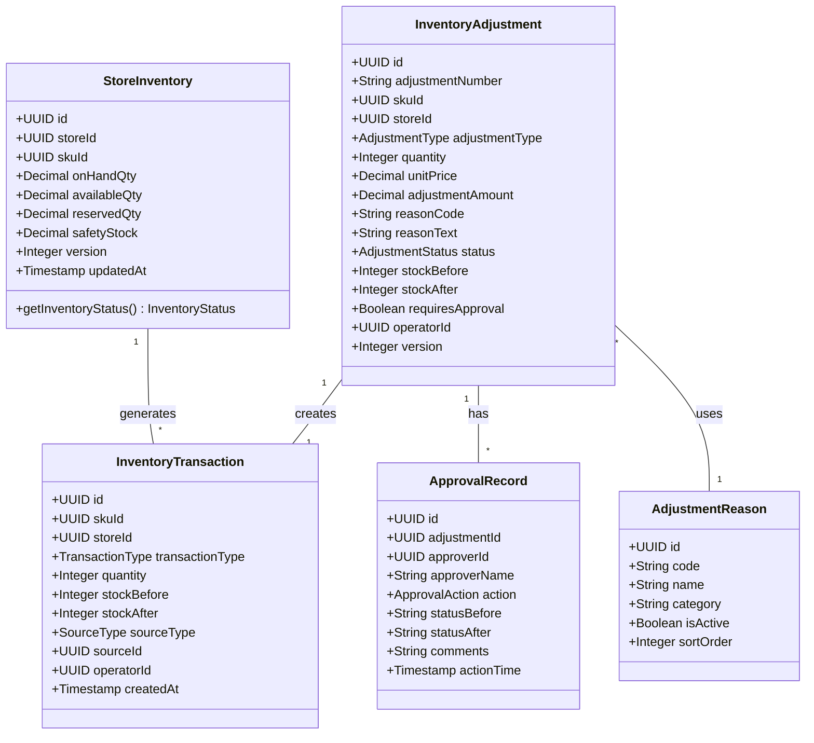
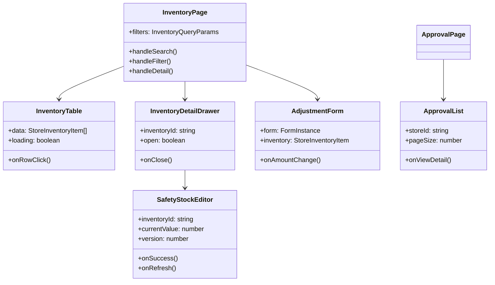
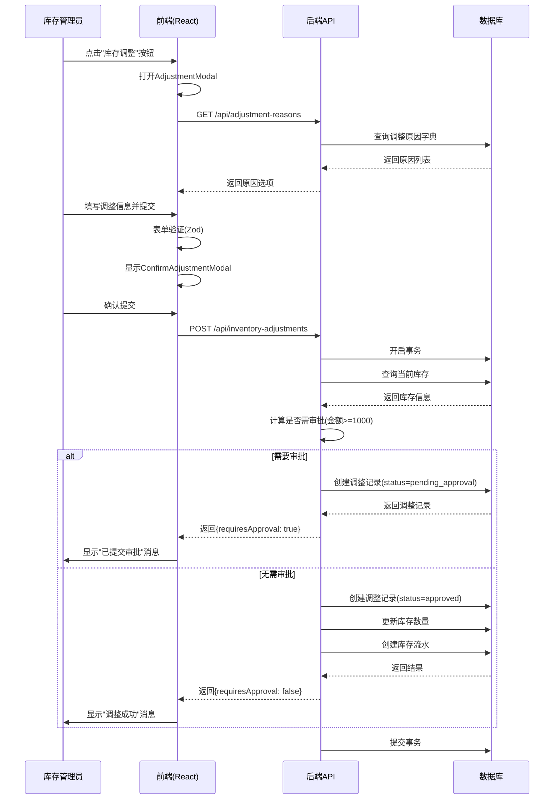
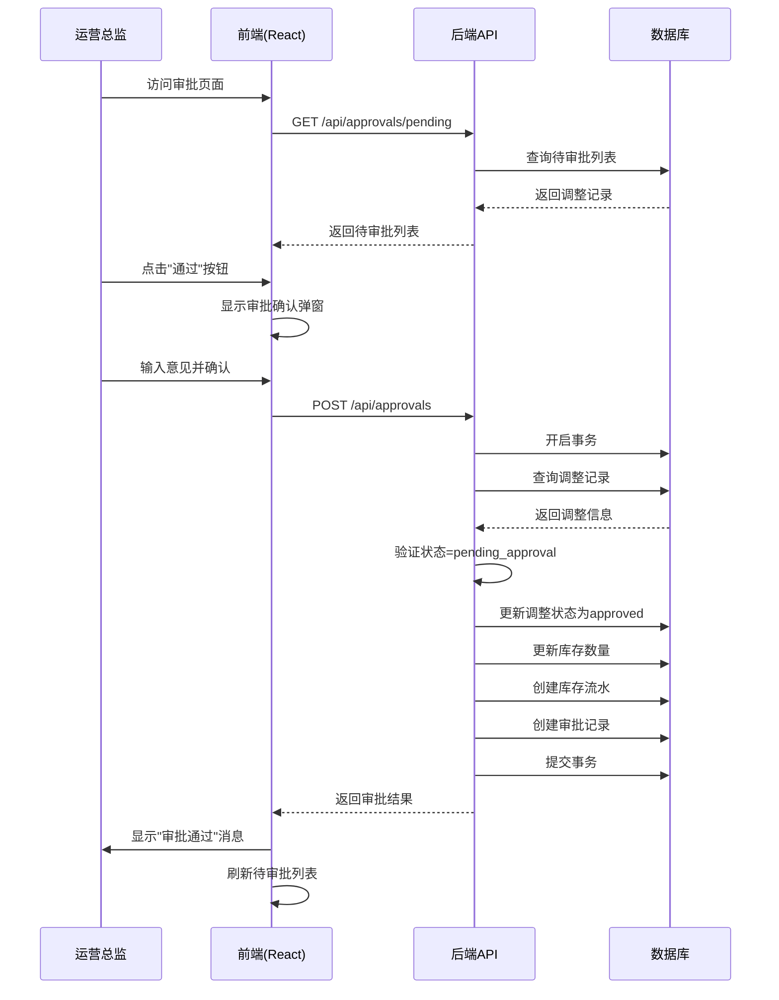
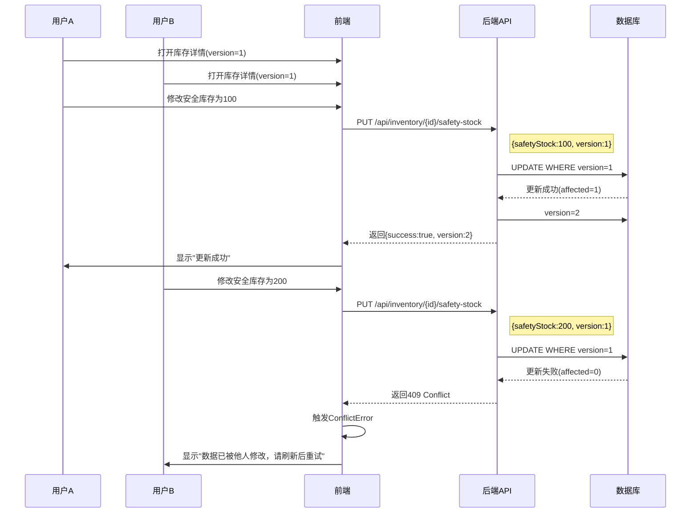
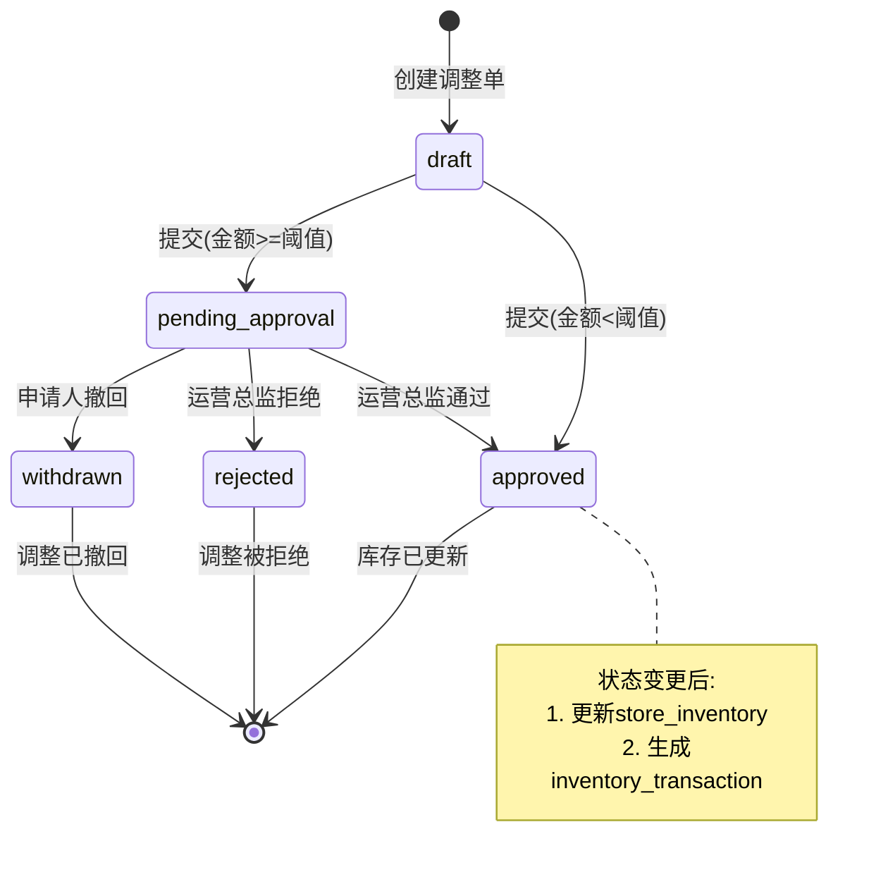

# 库存管理系统 - 详细设计文档 (DDD)

**版本**: V1.0  
**日期**: 2025-12-26  
**状态**: Final  
**作者**: 系统自动生成  
**适用模块**: P003-inventory-query (库存查询) + P004-inventory-adjustment (库存调整)

---

## 目录

1. [概述](#1-概述)
2. [模块详细设计](#2-模块详细设计)
3. [类图设计](#3-类图设计)
4. [时序图设计](#4-时序图设计)
5. [状态机设计](#5-状态机设计)
6. [算法设计](#6-算法设计)
7. [异常处理设计](#7-异常处理设计)
8. [性能优化设计](#8-性能优化设计)
9. [安全设计](#9-安全设计)
10. [附录](#10-附录)

---

## 1. 概述

### 1.1 文档目的

本文档为库存管理系统的详细设计文档，包含库存查询(P003)和库存调整(P004)两个核心模块的技术设计细节。面向开发人员，提供实现指导。

### 1.2 系统边界

```
┌─────────────────────────────────────────────────────────────────────┐
│                        库存管理系统                                   │
├─────────────────────────────────────────────────────────────────────┤
│  ┌──────────────────────┐    ┌──────────────────────────────────┐   │
│  │  P003 库存查询模块    │    │      P004 库存调整模块            │   │
│  ├──────────────────────┤    ├──────────────────────────────────┤   │
│  │ • 库存列表查询        │    │ • 库存调整录入（盘盈/盘亏/报损）  │   │
│  │ • 多维度筛选          │    │ • 库存流水查看                    │   │
│  │ • 库存详情查看        │    │ • 大额调整审批                    │   │
│  │ • 库存状态计算        │    │ • 安全库存设置                    │   │
│  └──────────────────────┘    └──────────────────────────────────┘   │
└─────────────────────────────────────────────────────────────────────┘
                                    │
                                    ▼
┌─────────────────────────────────────────────────────────────────────┐
│                        数据存储层                                     │
│                  Supabase PostgreSQL                                 │
│  store_inventory | inventory_adjustments | inventory_transactions   │
│  adjustment_reasons | approval_records                              │
└─────────────────────────────────────────────────────────────────────┘
```

### 1.3 技术栈

| 层级 | 技术选型 | 版本 |
|------|---------|------|
| 前端框架 | React + TypeScript | React 19.2.0, TS 5.9.3 |
| UI 组件库 | Ant Design | 6.1.0 |
| 状态管理 | Zustand + TanStack Query | 5.0.9 / 5.90.12 |
| 后端框架 | Spring Boot | 3.x |
| 数据库 | PostgreSQL (Supabase) | - |
| 测试框架 | Vitest + Playwright | - |

---

## 2. 模块详细设计

### 2.1 库存查询模块 (P003)

#### 2.1.1 功能分解

| 功能ID | 功能名称 | 描述 | 优先级 |
|--------|---------|------|--------|
| INV-001 | 库存列表查看 | 展示门店SKU库存列表，含7列数据 | P0 |
| INV-002 | 关键词搜索 | 按SKU名称/编码模糊搜索 | P0 |
| INV-003 | 多维度筛选 | 按门店/状态/分类组合筛选 | P0 |
| INV-004 | 库存详情 | 展示单个SKU的完整库存信息 | P1 |

#### 2.1.2 前端组件架构

```
frontend/src/features/inventory/
├── components/
│   ├── InventoryTable.tsx         # 库存数据表格
│   ├── InventoryStatusTag.tsx     # 库存状态标签
│   ├── InventoryFilterBar.tsx     # 筛选栏
│   ├── InventoryDetailDrawer.tsx  # 详情抽屉
│   └── SearchInput.tsx            # 搜索输入框
├── hooks/
│   ├── useInventoryList.ts        # 库存列表查询Hook
│   └── useInventoryDetail.ts      # 库存详情查询Hook
├── services/
│   └── inventoryService.ts        # API服务层
└── types/
    └── index.ts                   # 类型定义
```

#### 2.1.3 API 设计

| 接口 | 方法 | 路径 | 描述 |
|------|------|------|------|
| 库存列表 | GET | /api/inventory | 分页查询库存列表 |
| 库存详情 | GET | /api/inventory/{id} | 查询单个库存详情 |
| 分类列表 | GET | /api/categories | 获取商品分类 |
| 门店列表 | GET | /api/stores/accessible | 获取可访问门店 |

### 2.2 库存调整模块 (P004)

#### 2.2.1 功能分解

| 功能ID | 功能名称 | 描述 | 优先级 |
|--------|---------|------|--------|
| ADJ-001 | 调整录入 | 盘盈/盘亏/报损录入 | P1 |
| ADJ-002 | 二次确认 | 提交前确认调整信息 | P1 |
| ADJ-003 | 流水查看 | 查看库存变动历史 | P2 |
| ADJ-004 | 大额审批 | 超阈值调整审批 | P3 |
| ADJ-005 | 安全库存 | 编辑安全库存阈值 | P3 |

#### 2.2.2 前端组件架构

```
frontend/src/features/inventory/
├── components/
│   ├── AdjustmentForm.tsx           # 调整表单
│   ├── AdjustmentModal.tsx          # 调整弹窗
│   ├── ConfirmAdjustmentModal.tsx   # 二次确认弹窗
│   ├── TransactionList.tsx          # 流水列表
│   ├── TransactionQuantityTag.tsx   # 流水数量标签
│   ├── ApprovalList.tsx             # 审批列表
│   ├── AdjustmentStatusTag.tsx      # 调整状态标签
│   ├── SafetyStockEditor.tsx        # 安全库存编辑器
│   └── AdjustmentDetailDrawer.tsx   # 调整详情抽屉
├── hooks/
│   ├── useInventoryAdjustment.ts    # 调整相关Hook
│   ├── useAdjustmentReasons.ts      # 调整原因Hook
│   ├── useApproval.ts               # 审批Hook
│   └── useSafetyStock.ts            # 安全库存Hook
├── services/
│   └── adjustmentService.ts         # 调整API服务
├── utils/
│   ├── approvalUtils.ts             # 审批工具函数
│   ├── errorHandling.ts             # 错误处理
│   └── accessibility.ts             # 可访问性工具
└── types/
    └── adjustment.ts                # 调整类型定义
```

#### 2.2.3 API 设计

| 接口 | 方法 | 路径 | 描述 |
|------|------|------|------|
| 创建调整 | POST | /api/inventory-adjustments | 创建调整记录 |
| 调整列表 | GET | /api/inventory-adjustments | 查询调整记录 |
| 调整详情 | GET | /api/inventory-adjustments/{id} | 查询调整详情 |
| 撤回调整 | POST | /api/inventory-adjustments/{id}/withdraw | 撤回待审批调整 |
| 待审批列表 | GET | /api/approvals/pending | 查询待审批列表 |
| 审批操作 | POST | /api/approvals | 执行审批操作 |
| 调整原因 | GET | /api/adjustment-reasons | 获取原因字典 |
| 流水查询 | GET | /api/inventory-transactions | 查询库存流水 |
| 更新安全库存 | PUT | /api/inventory/{id}/safety-stock | 更新安全库存 |

---

## 3. 类图设计

### 3.1 核心实体类图



### 3.2 前端组件类图



---

## 4. 时序图设计

### 4.1 库存调整录入时序图



### 4.2 审批流程时序图



### 4.3 安全库存编辑时序图(乐观锁)



---

## 5. 状态机设计

### 5.1 库存调整状态机



### 5.2 状态转换规则

| 当前状态 | 操作 | 目标状态 | 操作人 | 业务规则 |
|---------|------|---------|--------|---------|
| draft | submit | pending_approval | 库存管理员 | 调整金额 >= 1000元 |
| draft | submit | approved | 库存管理员 | 调整金额 < 1000元 |
| pending_approval | approve | approved | 运营总监 | 通过审批 |
| pending_approval | reject | rejected | 运营总监 | 拒绝审批 |
| pending_approval | withdraw | withdrawn | 库存管理员 | 仅限创建者撤回 |

### 5.3 库存状态计算

| 状态码 | 状态名称 | 颜色 | 判断条件 |
|--------|---------|------|---------|
| SUFFICIENT | 充足 | green | available >= safety × 2 |
| NORMAL | 正常 | blue | safety <= available < safety × 2 |
| BELOW_THRESHOLD | 偏低 | yellow | safety × 0.5 <= available < safety |
| LOW | 不足 | orange | 0 < available < safety × 0.5 |
| OUT_OF_STOCK | 缺货 | red | available = 0 |

---

## 6. 算法设计

### 6.1 审批阈值计算

```typescript
/**
 * 审批阈值常量（单位：元）
 */
export const APPROVAL_THRESHOLD = 1000;

/**
 * 计算调整金额
 * @param quantity 调整数量（始终为正）
 * @param unitPrice SKU单价
 * @returns 调整金额（绝对值）
 */
export function calculateAdjustmentAmount(
  quantity: number,
  unitPrice: number
): number {
  return Math.abs(quantity * unitPrice);
}

/**
 * 判断是否需要审批
 * @param quantity 调整数量
 * @param unitPrice SKU单价
 * @returns true=需要审批, false=无需审批
 */
export function requiresApproval(
  quantity: number,
  unitPrice: number
): boolean {
  const adjustmentAmount = calculateAdjustmentAmount(quantity, unitPrice);
  return adjustmentAmount >= APPROVAL_THRESHOLD;
}
```

### 6.2 乐观锁冲突处理

```typescript
/**
 * 冲突错误类
 */
export class ConflictError extends Error {
  constructor(message: string) {
    super(message);
    this.name = 'ConflictError';
  }
}

/**
 * 安全库存更新（含乐观锁处理）
 */
async function updateSafetyStock(request: UpdateSafetyStockRequest): Promise<UpdateSafetyStockResponse> {
  try {
    const response = await apiClient.put(
      `/inventory/${request.inventoryId}/safety-stock`,
      {
        safetyStock: request.safetyStock,
        version: request.version,
      }
    );
    return response.data;
  } catch (error: any) {
    // 处理 409 冲突错误
    if (error.response?.status === 409) {
      throw new ConflictError(
        error.response?.data?.message || '该记录已被他人修改，请刷新后重试'
      );
    }
    throw error;
  }
}
```

**后端SQL实现**:

```sql
-- 乐观锁更新安全库存
UPDATE store_inventory
SET safety_stock = :new_value,
    version = version + 1,
    updated_at = now()
WHERE id = :id AND version = :expected_version;

-- 如果受影响行数为0，则抛出409 Conflict
```

### 6.3 库存状态计算算法

```typescript
/**
 * 计算库存状态
 * @param availableQty 可用数量
 * @param safetyStock 安全库存阈值
 * @returns 库存状态枚举值
 */
export function calculateInventoryStatus(
  availableQty: number,
  safetyStock: number
): InventoryStatus {
  if (availableQty === 0) {
    return 'OUT_OF_STOCK';
  }
  if (availableQty < safetyStock * 0.5) {
    return 'LOW';
  }
  if (availableQty < safetyStock) {
    return 'BELOW_THRESHOLD';
  }
  if (availableQty < safetyStock * 2) {
    return 'NORMAL';
  }
  return 'SUFFICIENT';
}
```

### 6.4 调整后库存计算

```typescript
/**
 * 计算调整后库存
 * @param currentStock 当前库存
 * @param adjustmentType 调整类型
 * @param quantity 调整数量
 * @returns 调整后库存
 */
export function calculateStockAfter(
  currentStock: number,
  adjustmentType: AdjustmentType,
  quantity: number
): number {
  switch (adjustmentType) {
    case 'surplus':  // 盘盈
      return currentStock + quantity;
    case 'shortage': // 盘亏
    case 'damage':   // 报损
      return currentStock - quantity;
    default:
      return currentStock;
  }
}
```

---

## 7. 异常处理设计

### 7.1 错误分类

| 错误类型 | HTTP状态码 | 描述 | 处理方式 |
|---------|-----------|------|---------|
| ValidationError | 400 | 输入验证失败 | 表单显示错误提示 |
| UnauthorizedError | 401 | 未登录或token过期 | 跳转登录页 |
| ForbiddenError | 403 | 无操作权限 | 显示权限不足提示 |
| NotFoundError | 404 | 资源不存在 | 显示"记录不存在" |
| ConflictError | 409 | 乐观锁冲突 | 提示刷新后重试 |
| ServerError | 500 | 服务器内部错误 | 显示通用错误提示 |

### 7.2 统一错误处理工具

```typescript
// frontend/src/features/inventory/utils/errorHandling.ts

/**
 * 统一错误处理函数
 */
export function handleApiError(error: unknown): void {
  if (axios.isAxiosError(error)) {
    const status = error.response?.status;
    const serverMessage = error.response?.data?.message;

    switch (status) {
      case 400:
        message.error(serverMessage || '请求参数错误');
        break;
      case 401:
        message.warning('登录已过期，请重新登录');
        window.location.href = '/login';
        break;
      case 403:
        message.error('无操作权限');
        break;
      case 404:
        message.error('资源不存在');
        break;
      case 409:
        message.warning('数据已被他人修改，请刷新后重试');
        break;
      case 500:
        message.error('服务器繁忙，请稍后重试');
        break;
      default:
        message.error('操作失败，请重试');
    }
  } else if (error instanceof Error) {
    message.error(error.message);
  } else {
    message.error('未知错误');
  }
}

/**
 * 业务错误类型
 */
export class BusinessError extends Error {
  constructor(
    message: string,
    public code: string,
    public details?: Record<string, unknown>
  ) {
    super(message);
    this.name = 'BusinessError';
  }
}
```

### 7.3 前端错误边界

```typescript
/**
 * 库存模块错误边界
 */
export class InventoryErrorBoundary extends React.Component<
  { children: React.ReactNode },
  { hasError: boolean; error?: Error }
> {
  static getDerivedStateFromError(error: Error) {
    return { hasError: true, error };
  }

  componentDidCatch(error: Error, errorInfo: React.ErrorInfo) {
    console.error('库存模块错误:', error, errorInfo);
    // 可接入监控系统
  }

  render() {
    if (this.state.hasError) {
      return (
        <Result
          status="error"
          title="页面出错了"
          subTitle={this.state.error?.message}
          extra={<Button onClick={() => window.location.reload()}>刷新页面</Button>}
        />
      );
    }
    return this.props.children;
  }
}
```

---

## 8. 性能优化设计

### 8.1 性能目标

| 指标 | 目标值 | 测量方式 |
|------|-------|---------|
| 库存列表加载 | ≤ 2秒 | 首屏渲染时间 |
| 搜索响应 | ≤ 1秒 | 输入停止后 |
| 流水查询 | ≤ 500ms | API响应时间(100条) |
| 详情展开 | ≤ 500ms | 抽屉打开时间 |
| 安全库存更新 | ≤ 1秒 | 生效时间 |

### 8.2 前端优化策略

#### 8.2.1 数据缓存

```typescript
// TanStack Query 缓存配置
export function useInventoryList(params: InventoryQueryParams) {
  return useQuery({
    queryKey: ['inventory', 'list', params],
    queryFn: () => inventoryService.list(params),
    staleTime: 30 * 1000,      // 30秒内不重新请求
    gcTime: 5 * 60 * 1000,     // 5分钟后垃圾回收
    placeholderData: keepPreviousData, // 切换参数时保持旧数据
  });
}

// 调整原因缓存更长时间（字典数据）
export function useAdjustmentReasons() {
  return useQuery({
    queryKey: ['adjustment-reasons'],
    queryFn: () => adjustmentService.listReasons(),
    staleTime: 5 * 60 * 1000,  // 5分钟
    gcTime: 30 * 60 * 1000,    // 30分钟
  });
}
```

#### 8.2.2 搜索防抖

```typescript
// 300ms防抖搜索
export function useDebounce<T>(value: T, delay: number = 300): T {
  const [debouncedValue, setDebouncedValue] = useState(value);

  useEffect(() => {
    const timer = setTimeout(() => {
      setDebouncedValue(value);
    }, delay);

    return () => clearTimeout(timer);
  }, [value, delay]);

  return debouncedValue;
}
```

#### 8.2.3 骨架屏加载

```typescript
// frontend/src/features/inventory/components/SkeletonScreens.tsx
export const InventoryTableSkeleton: React.FC = () => (
  <div>
    <Skeleton.Input active style={{ width: '100%', marginBottom: 16 }} />
    <Skeleton active paragraph={{ rows: 10 }} />
  </div>
);

export const DetailDrawerSkeleton: React.FC = () => (
  <Space direction="vertical" style={{ width: '100%' }}>
    <Skeleton.Input active style={{ width: '60%' }} />
    <Skeleton active paragraph={{ rows: 4 }} />
    <Skeleton.Input active style={{ width: '40%' }} />
  </Space>
);
```

### 8.3 后端优化策略

#### 8.3.1 数据库索引

```sql
-- 库存查询优化索引
CREATE INDEX idx_store_inventory_store_id ON store_inventory(store_id);
CREATE INDEX idx_store_inventory_sku_id ON store_inventory(sku_id);
CREATE INDEX idx_store_inventory_available_qty ON store_inventory(available_qty);

-- 调整记录索引
CREATE INDEX idx_adjustments_sku_store ON inventory_adjustments(sku_id, store_id);
CREATE INDEX idx_adjustments_status ON inventory_adjustments(status);
CREATE INDEX idx_adjustments_created_at ON inventory_adjustments(created_at DESC);
CREATE INDEX idx_adjustments_requires_approval 
  ON inventory_adjustments(requires_approval) WHERE requires_approval = true;

-- 流水记录索引
CREATE INDEX idx_transactions_sku_store ON inventory_transactions(sku_id, store_id);
CREATE INDEX idx_transactions_created_at ON inventory_transactions(created_at DESC);
```

#### 8.3.2 分页查询

```java
// 统一分页参数
public class PageRequest {
    private int page = 1;
    private int pageSize = 20;
    
    // 限制最大分页
    public int getPageSize() {
        return Math.min(pageSize, 100);
    }
}

// 分页响应
public class PageResponse<T> {
    private List<T> data;
    private long total;
    private int page;
    private int pageSize;
}
```

### 8.4 分页优化

```typescript
// frontend/src/features/inventory/utils/pagination.ts

export interface PaginationConfig {
  defaultPageSize: number;
  pageSizeOptions: number[];
  maxPageSize: number;
}

export const INVENTORY_PAGINATION: PaginationConfig = {
  defaultPageSize: 20,
  pageSizeOptions: [10, 20, 50, 100],
  maxPageSize: 100,
};

export function createPaginationProps(config: PaginationConfig) {
  return {
    showSizeChanger: true,
    showQuickJumper: true,
    pageSizeOptions: config.pageSizeOptions.map(String),
    showTotal: (total: number, range: [number, number]) =>
      `第 ${range[0]}-${range[1]} 条，共 ${total} 条`,
  };
}
```

---

## 9. 安全设计

### 9.1 权限控制矩阵

| 操作 | 店长 | 库存管理员 | 运营总监 | 管理员 |
|------|:----:|:---------:|:--------:|:------:|
| 查看库存列表 | ✓ | ✓ | ✓ | ✓ |
| 查看库存详情 | ✓ | ✓ | ✓ | ✓ |
| 录入库存调整 | ✗ | ✓ | ✗ | ✓ |
| 编辑安全库存 | ✗ | ✓ | ✗ | ✓ |
| 查看流水记录 | ✓ | ✓ | ✓ | ✓ |
| 审批调整申请 | ✗ | ✗ | ✓ | ✓ |
| 撤回调整申请 | ✗ | ✓(仅自己) | ✗ | ✓ |

### 9.2 输入验证

```typescript
// Zod 验证模式
import { z } from 'zod';

export const CreateAdjustmentSchema = z.object({
  skuId: z.string().uuid('无效的SKU ID'),
  storeId: z.string().uuid('无效的门店ID'),
  adjustmentType: z.enum(['surplus', 'shortage', 'damage'], {
    errorMap: () => ({ message: '请选择有效的调整类型' })
  }),
  quantity: z.number()
    .int('调整数量必须为整数')
    .positive('调整数量必须大于0'),
  reasonCode: z.string().min(1, '请选择调整原因'),
  reasonText: z.string().max(500, '原因说明不能超过500字符').optional(),
  remarks: z.string().max(500, '备注不能超过500字符').optional()
});

export const UpdateSafetyStockSchema = z.object({
  inventoryId: z.string().uuid('无效的库存ID'),
  safetyStock: z.number()
    .int('安全库存必须为整数')
    .nonnegative('安全库存不能为负数'),
  version: z.number().int().positive()
});
```

### 9.3 数据库行级安全(RLS)

```sql
-- 启用RLS
ALTER TABLE inventory_adjustments ENABLE ROW LEVEL SECURITY;
ALTER TABLE approval_records ENABLE ROW LEVEL SECURITY;

-- 库存管理员可管理调整
CREATE POLICY "adjustments_admin_all" ON inventory_adjustments
  FOR ALL USING (
    auth.jwt() ->> 'role' IN ('inventory_admin', 'operations_director', 'admin')
  );

-- 运营总监可审批
CREATE POLICY "approval_records_director_all" ON approval_records
  FOR ALL USING (
    auth.jwt() ->> 'role' IN ('operations_director', 'admin')
  );
```

---

## 10. 附录

### 10.1 数据库表结构

#### store_inventory (门店库存表)

| 字段 | 类型 | 约束 | 说明 |
|------|------|------|------|
| id | UUID | PK | 主键 |
| store_id | UUID | FK, NOT NULL | 门店ID |
| sku_id | UUID | FK, NOT NULL | SKU ID |
| on_hand_qty | DECIMAL(12,3) | NOT NULL, DEFAULT 0 | 现存数量 |
| available_qty | DECIMAL(12,3) | NOT NULL, DEFAULT 0 | 可用数量 |
| reserved_qty | DECIMAL(12,3) | NOT NULL, DEFAULT 0 | 预占数量 |
| safety_stock | DECIMAL(12,3) | DEFAULT 0 | 安全库存 |
| version | INTEGER | DEFAULT 1, NOT NULL | 乐观锁版本 |
| updated_at | TIMESTAMPTZ | NOT NULL | 更新时间 |

#### inventory_adjustments (库存调整单)

| 字段 | 类型 | 约束 | 说明 |
|------|------|------|------|
| id | UUID | PK | 主键 |
| adjustment_number | VARCHAR(30) | UNIQUE, NOT NULL | 调整单号 |
| sku_id | UUID | FK, NOT NULL | SKU ID |
| store_id | UUID | FK, NOT NULL | 门店ID |
| adjustment_type | ENUM | NOT NULL | 调整类型 |
| quantity | INTEGER | NOT NULL, CHECK > 0 | 调整数量 |
| unit_price | DECIMAL(12,2) | NOT NULL | 单价 |
| adjustment_amount | DECIMAL(12,2) | GENERATED | 调整金额 |
| reason_code | VARCHAR(50) | FK, NOT NULL | 原因代码 |
| status | ENUM | NOT NULL | 状态 |
| stock_before | INTEGER | NOT NULL | 调整前库存 |
| stock_after | INTEGER | NOT NULL | 调整后库存 |
| requires_approval | BOOLEAN | DEFAULT false | 是否需审批 |
| operator_id | UUID | FK, NOT NULL | 操作人ID |
| version | INTEGER | DEFAULT 1 | 乐观锁版本 |

### 10.2 枚举定义

```typescript
// 调整类型
export type AdjustmentType = 'surplus' | 'shortage' | 'damage';

// 调整状态
export type AdjustmentStatus = 
  | 'draft'           // 草稿
  | 'pending_approval' // 待审批
  | 'approved'        // 已通过
  | 'rejected'        // 已拒绝
  | 'withdrawn';      // 已撤回

// 审批操作
export type ApprovalAction = 'approve' | 'reject' | 'withdraw';

// 库存状态
export type InventoryStatus =
  | 'SUFFICIENT'      // 充足
  | 'NORMAL'          // 正常
  | 'BELOW_THRESHOLD' // 偏低
  | 'LOW'             // 不足
  | 'OUT_OF_STOCK';   // 缺货

// 流水类型
export type TransactionType =
  | 'adjustment_in'   // 盘点入库(盘盈)
  | 'adjustment_out'  // 盘点出库(盘亏)
  | 'damage_out'      // 损耗出库(报损)
  | 'purchase_in'     // 采购入库
  | 'sale_out';       // 销售出库
```

### 10.3 API响应格式

```typescript
// 统一响应格式
interface ApiResponse<T> {
  success: boolean;
  data?: T;
  message?: string;
  error?: {
    code: string;
    details?: Record<string, unknown>;
  };
}

// 分页响应
interface PaginatedResponse<T> extends ApiResponse<T[]> {
  total: number;
  page: number;
  pageSize: number;
}
```

### 10.4 相关文档

| 文档 | 路径 | 描述 |
|------|------|------|
| P003规格 | specs/P003-inventory-query/spec.md | 库存查询功能规格 |
| P004规格 | specs/P004-inventory-adjustment/spec.md | 库存调整功能规格 |
| P003数据模型 | specs/P003-inventory-query/data-model.md | 库存查询数据模型 |
| P004数据模型 | specs/P004-inventory-adjustment/data-model.md | 库存调整数据模型 |
| 产品功能说明 | docs/产品功能/库存管理系统_产品功能说明.md | 产品功能说明 |

---

## 文档更新记录

| 版本 | 日期 | 更新内容 | 作者 |
|------|------|---------|------|
| V1.0 | 2025-12-26 | 初始版本 | 系统自动生成 |

---

**文档结束**
