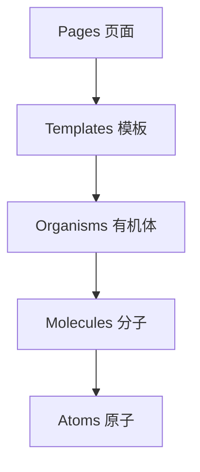

# 组件架构设计

## 概述

本文档详细说明商品管理中台前端系统的组件架构设计，包括组件分层、设计模式、复用策略和最佳实践。系统采用原子设计理念和组件化开发模式，确保代码的可维护性和可复用性。

## 组件设计原则

### 1. 设计原则

- **单一职责原则**: 每个组件只负责一个特定功能
- **开闭原则**: 组件对扩展开放，对修改封闭
- **依赖倒置原则**: 依赖抽象而不是具体实现
- **接口隔离原则**: 使用小而专注的接口
- **组合优于继承**: 通过组合实现复杂功能

### 2. 命名规范

```typescript
// 组件命名：PascalCase，语义化
ProductList、ProductForm、SearchForm

// Props命名：camelCase，语义化
productId、onSubmit、isLoading

// 事件处理函数：handle + 动作 + 组件名
handleProductSubmit、handleFormChange

// Hook命名：use + 功能名
useProductList、useFormValidation
```

## 组件分层架构

### 原子设计分层



### 1. Atoms（原子组件）

最基础的UI组件，无法再拆分：

```typescript
// Button组件
interface ButtonProps {
  type?: 'primary' | 'secondary' | 'danger';
  size?: 'small' | 'medium' | 'large';
  loading?: boolean;
  disabled?: boolean;
  icon?: React.ReactNode;
  children: React.ReactNode;
  onClick?: () => void;
}

const Button: React.FC<ButtonProps> = ({
  type = 'primary',
  size = 'medium',
  loading = false,
  disabled = false,
  icon,
  children,
  onClick,
}) => {
  return (
    <AntButton
      type={type}
      size={size}
      loading={loading}
      disabled={disabled}
      icon={icon}
      onClick={onClick}
    >
      {children}
    </AntButton>
  );
};
```

```typescript
// Input组件
interface InputProps {
  placeholder?: string;
  value?: string;
  onChange?: (value: string) => void;
  disabled?: boolean;
  error?: string;
  prefix?: React.ReactNode;
  suffix?: React.ReactNode;
}

const Input: React.FC<InputProps> = ({
  placeholder,
  value,
  onChange,
  disabled = false,
  error,
  prefix,
  suffix,
}) => {
  return (
    <div className="input-wrapper">
      <AntInput
        placeholder={placeholder}
        value={value}
        onChange={(e) => onChange?.(e.target.value)}
        disabled={disabled}
        prefix={prefix}
        suffix={suffix}
        status={error ? 'error' : undefined}
      />
      {error && <div className="input-error">{error}</div>}
    </div>
  );
};
```

### 2. Molecules（分子组件）

由原子组件组合而成，具有特定功能：

```typescript
// SearchForm组件
interface SearchFormProps {
  onSearch: (params: SearchParams) => void;
  onReset: () => void;
  loading?: boolean;
}

const SearchForm: React.FC<SearchFormProps> = ({
  onSearch,
  onReset,
  loading = false,
}) => {
  const [form] = Form.useForm();

  const handleSearch = () => {
    const values = form.getFieldsValue();
    onSearch(values);
  };

  const handleReset = () => {
    form.resetFields();
    onReset();
  };

  return (
    <div className="search-form">
      <Form form={form} layout="inline">
        <Form.Item name="keyword">
          <Input placeholder="请输入关键词" />
        </Form.Item>
        <Form.Item name="categoryId">
          <CategorySelect placeholder="请选择分类" />
        </Form.Item>
        <Form.Item name="status">
          <Select placeholder="请选择状态" options={STATUS_OPTIONS} />
        </Form.Item>
        <Form.Item>
          <Space>
            <Button type="primary" onClick={handleSearch} loading={loading}>
              搜索
            </Button>
            <Button onClick={handleReset}>重置</Button>
          </Space>
        </Form.Item>
      </Form>
    </div>
  );
};
```

```typescript
// FileUploader组件
interface FileUploaderProps {
  accept?: string;
  maxSize?: number;
  maxCount?: number;
  onChange?: (files: File[]) => void;
  onPreview?: (file: File) => void;
  value?: File[];
  disabled?: boolean;
}

const FileUploader: React.FC<FileUploaderProps> = ({
  accept = 'image/*',
  maxSize = 5 * 1024 * 1024, // 5MB
  maxCount = 5,
  onChange,
  onPreview,
  value = [],
  disabled = false,
}) => {
  const uploadProps: UploadProps = {
    name: 'file',
    multiple: true,
    accept,
    beforeUpload: (file) => {
      if (file.size > maxSize) {
        message.error(`文件大小不能超过 ${maxSize / 1024 / 1024}MB`);
        return false;
      }
      return false; // 阻止自动上传
    },
    onChange: ({ fileList }) => {
      const files = fileList.map(item => item.originFileObj!).filter(Boolean);
      onChange?.(files);
    },
    onPreview: (file) => {
      onPreview?.(file.originFileObj!);
    },
    disabled,
    fileList: value.map((file, index) => ({
      uid: `${index}`,
      name: file.name,
      status: 'done' as const,
      originFileObj: file,
    })),
  };

  return (
    <Upload {...uploadProps}>
      {value.length < maxCount && (
        <Button icon={<UploadOutlined />}>上传文件</Button>
      )}
    </Upload>
  );
};
```

### 3. Organisms（有机体）

复杂的业务组件，由分子组件组成：

```typescript
// ProductList组件
interface ProductListProps {
  onEdit: (product: Product) => void;
  onDelete: (productId: string) => void;
  onView: (product: Product) => void;
}

const ProductList: React.FC<ProductListProps> = ({
  onEdit,
  onDelete,
  onView,
}) => {
  const { data, loading, refetch } = useProductList();
  const [selectedRowKeys, setSelectedRowKeys] = useState<string[]>([]);

  const columns: ColumnsType<Product> = [
    {
      title: '商品图片',
      dataIndex: 'images',
      key: 'images',
      render: (images: ProductImage[]) => (
        <Image
          width={60}
          height={60}
          src={images[0]?.url}
          fallback="/placeholder.png"
        />
      ),
    },
    {
      title: '商品名称',
      dataIndex: 'name',
      key: 'name',
      render: (name: string, record: Product) => (
        <div>
          <div className="product-name">{name}</div>
          <div className="product-sku">SKU: {record.skuId}</div>
        </div>
      ),
    },
    {
      title: '价格',
      dataIndex: 'basePrice',
      key: 'basePrice',
      render: (price: number) => `¥${price.toFixed(2)}`,
    },
    {
      title: '状态',
      dataIndex: 'status',
      key: 'status',
      render: (status: ProductStatus) => (
        <Tag color={getStatusColor(status)}>
          {getStatusText(status)}
        </Tag>
      ),
    },
    {
      title: '操作',
      key: 'actions',
      render: (_, record: Product) => (
        <Space>
          <Button
            type="link"
            size="small"
            onClick={() => onView(record)}
          >
            查看
          </Button>
          <Button
            type="link"
            size="small"
            onClick={() => onEdit(record)}
          >
            编辑
          </Button>
          <Popconfirm
            title="确定删除此商品吗？"
            onConfirm={() => onDelete(record.id)}
            okText="确定"
            cancelText="取消"
          >
            <Button type="link" size="small" danger>
              删除
            </Button>
          </Popconfirm>
        </Space>
      ),
    },
  ];

  return (
    <div className="product-list">
      <div className="list-header">
        <div className="list-title">
          商品列表 ({data?.pagination.total || 0})
        </div>
        <div className="list-actions">
          <BatchActions
            selectedRowKeys={selectedRowKeys}
            onSuccess={() => {
              setSelectedRowKeys([]);
              refetch();
            }}
          />
        </div>
      </div>

      <Table
        columns={columns}
        dataSource={data?.data || []}
        loading={loading}
        rowKey="id"
        pagination={{
          current: data?.pagination.current,
          pageSize: data?.pagination.pageSize,
          total: data?.pagination.total,
          showSizeChanger: true,
          showQuickJumper: true,
        }}
        rowSelection={{
          selectedRowKeys,
          onChange: setSelectedRowKeys,
        }}
        scroll={{ x: 1200 }}
      />
    </div>
  );
};
```

```typescript
// ProductForm组件
interface ProductFormProps {
  product?: Product;
  mode: 'create' | 'edit';
  onSubmit: (data: ProductFormData) => Promise<void>;
  onCancel: () => void;
}

const ProductForm: React.FC<ProductFormProps> = ({
  product,
  mode,
  onSubmit,
  onCancel,
}) => {
  const [form] = Form.useForm();
  const [currentStep, setCurrentStep] = useState(0);
  const [loading, setLoading] = useState(false);

  const steps = [
    { title: '基础信息', content: <BasicInfoStep /> },
    { title: '内容管理', content: <ContentStep /> },
    { title: '规格属性', content: <SpecsStep /> },
    { title: 'BOM配方', content: <BOMStep /> },
  ];

  const handleSubmit = async () => {
    try {
      setLoading(true);
      const values = await form.validateFields();
      await onSubmit(values);
      message.success(`${mode === 'create' ? '创建' : '更新'}成功`);
    } catch (error) {
      console.error('提交失败:', error);
      message.error('提交失败，请重试');
    } finally {
      setLoading(false);
    }
  };

  return (
    <div className="product-form">
      <Steps current={currentStep} onChange={setCurrentStep}>
        {steps.map(step => (
          <Step key={step.title} title={step.title} />
        ))}
      </Steps>

      <div className="form-content">
        <Form
          form={form}
          layout="vertical"
          initialValues={product}
          scrollToFirstError
        >
          {steps[currentStep].content}
        </Form>
      </div>

      <div className="form-actions">
        <Space>
          <Button onClick={onCancel}>取消</Button>
          {currentStep > 0 && (
            <Button onClick={() => setCurrentStep(currentStep - 1)}>
              上一步
            </Button>
          )}
          {currentStep < steps.length - 1 && (
            <Button
              type="primary"
              onClick={() => setCurrentStep(currentStep + 1)}
            >
              下一步
            </Button>
          )}
          {currentStep === steps.length - 1 && (
            <Button
              type="primary"
              loading={loading}
              onClick={handleSubmit}
            >
              {mode === 'create' ? '创建商品' : '更新商品'}
            </Button>
          )}
        </Space>
      </div>
    </div>
  );
};
```

## 复合组件模式

### 1. 组合模式（Composition Pattern）

```typescript
// Card组件组合
const ProductCard: React.FC<ProductCardProps> = ({ product, actions }) => {
  return (
    <Card
      hoverable
      cover={<ProductImage images={product.images} />}
      actions={actions}
    >
      <Card.Meta
        title={<ProductTitle product={product} />}
        description={<ProductDescription product={product} />}
      />
      <div className="product-price">
        <Price value={product.basePrice} />
      </div>
    </Card>
  );
};

// 使用示例
<ProductCard
  product={product}
  actions={[
    <Button key="edit" onClick={() => onEdit(product)}>
      编辑
    </Button>,
    <Button key="delete" danger onClick={() => onDelete(product.id)}>
      删除
    </Button>,
  ]}
/>
```

### 2. Render Props模式

```typescript
// DataTable组件
interface DataTableProps<T> {
  data: T[];
  columns: ColumnsType<T>;
  loading?: boolean;
  renderEmpty?: () => React.ReactNode;
  renderHeader?: (data: T[]) => React.ReactNode;
  renderFooter?: (data: T[]) => React.ReactNode;
}

function DataTable<T extends Record<string, any>>({
  data,
  columns,
  loading,
  renderEmpty,
  renderHeader,
  renderFooter,
}: DataTableProps<T>) {
  if (loading) return <Skeleton active />;
  if (data.length === 0 && renderEmpty) return renderEmpty();

  return (
    <div className="data-table">
      {renderHeader?.(data)}
      <Table columns={columns} dataSource={data} rowKey="id" />
      {renderFooter?.(data)}
    </div>
  );
}

// 使用示例
<DataTable
  data={products}
  columns={productColumns}
  loading={loading}
  renderEmpty={() => <Empty description="暂无数据" />}
  renderHeader={(data) => (
    <div className="table-header">
      共 {data.length} 条记录
    </div>
  )}
  renderFooter={(data) => (
    <div className="table-footer">
      <Pagination total={data.length} />
    </div>
  )}
/>
```

### 3. 高阶组件（HOC）模式

```typescript
// withLoading高阶组件
const withLoading = <P extends object>(
  Component: React.ComponentType<P>
) => {
  return React.memo(({ loading, ...props }: P & { loading?: boolean }) => {
    if (loading) {
      return <Skeleton active />;
    }
    return <Component {...(props as P)} />;
  });
};

// 使用示例
const ProductListWithLoading = withLoading(ProductList);

// withPermission高阶组件
const withPermission = <P extends object>(
  permission: string,
  Component: React.ComponentType<P>
) => {
  return (props: P) => {
    const hasPermission = usePermission(permission);

    if (!hasPermission) {
      return <NoPermission />;
    }

    return <Component {...props} />;
  };
};

// 使用示例
const ProductFormWithPermission = withPermission(
  'product:write',
  ProductForm
);
```

## 自定义Hook设计

### 1. 数据获取Hook

```typescript
// useProductList Hook
interface UseProductListOptions {
  params?: ProductQueryParams;
  immediate?: boolean;
}

export const useProductList = (options: UseProductListOptions = {}) => {
  const { params = {}, immediate = true } = options;
  const [data, setData] = useState<PaginatedResponse<Product>>();
  const [loading, setLoading] = useState(false);
  const [error, setError] = useState<string>();

  const fetchProducts = useCallback(async (fetchParams?: ProductQueryParams) => {
    try {
      setLoading(true);
      setError(undefined);
      const response = await productService.getProducts(fetchParams || params);
      setData(response);
    } catch (err) {
      setError(err instanceof Error ? err.message : '获取商品列表失败');
    } finally {
      setLoading(false);
    }
  }, [params]);

  useEffect(() => {
    if (immediate) {
      fetchProducts();
    }
  }, [immediate, fetchProducts]);

  return {
    data,
    loading,
    error,
    refetch: fetchProducts,
    mutate: setData,
  };
};
```

### 2. 表单处理Hook

```typescript
// useFormValidation Hook
interface UseFormValidationOptions<T> {
  initialValues: Partial<T>;
  validationSchema: ZodSchema<T>;
  onSubmit: (values: T) => Promise<void>;
}

export const useFormValidation = <T extends Record<string, any>>({
  initialValues,
  validationSchema,
  onSubmit,
}: UseFormValidationOptions<T>) => {
  const [values, setValues] = useState<Partial<T>>(initialValues);
  const [errors, setErrors] = useState<Record<string, string>>({});
  const [touched, setTouched] = useState<Record<string, boolean>>({});
  const [isSubmitting, setIsSubmitting] = useState(false);

  const setValue = useCallback((name: keyof T, value: any) => {
    setValues(prev => ({ ...prev, [name]: value }));
    setTouched(prev => ({ ...prev, [name as string]: true }));
  }, []);

  const setError = useCallback((name: keyof T, error: string) => {
    setErrors(prev => ({ ...prev, [name as string]: error }));
  }, []);

  const validateField = useCallback((name: keyof T, value: any) => {
    try {
      validationSchema.pick({ [name]: true } as any).parse({ [name]: value });
      setError(name, '');
      return true;
    } catch (err) {
      if (err instanceof ZodError) {
        setError(name, err.errors[0]?.message || '验证失败');
        return false;
      }
      return false;
    }
  }, [validationSchema, setError]);

  const validateForm = useCallback(() => {
    try {
      validationSchema.parse(values);
      setErrors({});
      return true;
    } catch (err) {
      if (err instanceof ZodError) {
        const formErrors: Record<string, string> = {};
        err.errors.forEach(error => {
          if (error.path.length > 0) {
            formErrors[error.path[0] as string] = error.message;
          }
        });
        setErrors(formErrors);
      }
      return false;
    }
  }, [values, validationSchema]);

  const handleSubmit = useCallback(async () => {
    if (!validateForm()) return;

    try {
      setIsSubmitting(true);
      await onSubmit(values as T);
    } catch (err) {
      console.error('提交失败:', err);
    } finally {
      setIsSubmitting(false);
    }
  }, [validateForm, onSubmit, values]);

  return {
    values,
    errors,
    touched,
    isSubmitting,
    setValue,
    setError,
    validateField,
    validateForm,
    handleSubmit,
    reset: () => {
      setValues(initialValues);
      setErrors({});
      setTouched({});
    },
  };
};
```

### 3. 状态管理Hook

```typescript
// useDebounce Hook
export const useDebounce = <T>(value: T, delay: number): T => {
  const [debouncedValue, setDebouncedValue] = useState<T>(value);

  useEffect(() => {
    const handler = setTimeout(() => {
      setDebouncedValue(value);
    }, delay);

    return () => {
      clearTimeout(handler);
    };
  }, [value, delay]);

  return debouncedValue;
};

// useLocalStorage Hook
export const useLocalStorage = <T>(
  key: string,
  initialValue: T
): [T, (value: T) => void] => {
  const [storedValue, setStoredValue] = useState<T>(() => {
    try {
      const item = window.localStorage.getItem(key);
      return item ? JSON.parse(item) : initialValue;
    } catch (error) {
      console.error(`Error reading localStorage key "${key}":`, error);
      return initialValue;
    }
  });

  const setValue = useCallback((value: T) => {
    try {
      setStoredValue(value);
      window.localStorage.setItem(key, JSON.stringify(value));
    } catch (error) {
      console.error(`Error setting localStorage key "${key}":`, error);
    }
  }, [key]);

  return [storedValue, setValue];
};
```

## 组件通信模式

### 1. Props传递

```typescript
// 父组件向子组件传递数据
const ParentComponent = () => {
  const [product, setProduct] = useState<Product>();

  return (
    <ChildComponent
      product={product}
      onProductChange={setProduct}
    />
  );
};

const ChildComponent = ({ product, onProductChange }: ChildComponentProps) => {
  return (
    <div>
      <ProductDetail product={product} />
      <Button onClick={() => onProductChange(updatedProduct)}>
        更新商品
      </Button>
    </div>
  );
};
```

### 2. Context通信

```typescript
// 创建Context
const ProductContext = createContext<{
  product: Product | null;
  updateProduct: (product: Partial<Product>) => void;
}>({
  product: null,
  updateProduct: () => {},
});

// Provider组件
const ProductProvider: React.FC<{ children: React.ReactNode }> = ({
  children,
}) => {
  const [product, setProduct] = useState<Product | null>(null);

  const updateProduct = useCallback((updates: Partial<Product>) => {
    setProduct(prev => prev ? { ...prev, ...updates } : null);
  }, []);

  return (
    <ProductContext.Provider value={{ product, updateProduct }}>
      {children}
    </ProductContext.Provider>
  );
};

// Hook使用Context
export const useProduct = () => {
  const context = useContext(ProductContext);
  if (!context) {
    throw new Error('useProduct must be used within ProductProvider');
  }
  return context;
};
```

### 3. 自定义事件

```typescript
// 使用EventEmitter进行组件通信
class EventBus {
  private events = new Map<string, Function[]>();

  on(event: string, callback: Function) {
    if (!this.events.has(event)) {
      this.events.set(event, []);
    }
    this.events.get(event)!.push(callback);
  }

  off(event: string, callback: Function) {
    const callbacks = this.events.get(event);
    if (callbacks) {
      const index = callbacks.indexOf(callback);
      if (index > -1) {
        callbacks.splice(index, 1);
      }
    }
  }

  emit(event: string, ...args: any[]) {
    const callbacks = this.events.get(event);
    if (callbacks) {
      callbacks.forEach(callback => callback(...args));
    }
  }
}

export const eventBus = new EventBus();

// 组件中使用
const ComponentA = () => {
  useEffect(() => {
    const handleProductUpdate = (product: Product) => {
      console.log('商品更新:', product);
    };

    eventBus.on('product:updated', handleProductUpdate);
    return () => eventBus.off('product:updated', handleProductUpdate);
  }, []);

  return <div>Component A</div>;
};

const ComponentB = () => {
  const handleUpdateProduct = () => {
    const updatedProduct = { id: '1', name: '更新后的商品' };
    eventBus.emit('product:updated', updatedProduct);
  };

  return <Button onClick={handleUpdateProduct}>更新商品</Button>;
};
```

## 性能优化策略

### 1. 组件懒加载

```typescript
// 路由级别的懒加载
const ProductListPage = lazy(() => import('@/pages/ProductListPage'));
const ProductDetailPage = lazy(() => import('@/pages/ProductDetailPage'));

// 组件级别的懒加载
const HeavyChart = lazy(() => import('@/components/HeavyChart'));

const Dashboard = () => {
  return (
    <div>
      <h1>仪表板</h1>
      <Suspense fallback={<Loading />}>
        <HeavyChart />
      </Suspense>
    </div>
  );
};
```

### 2. 组件缓存

```typescript
// 使用React.memo进行组件缓存
const ProductItem = React.memo<ProductItemProps>(({ product, onSelect }) => {
  return (
    <Card
      title={product.name}
      onClick={() => onSelect(product.id)}
    >
      {product.description}
    </Card>
  );
}, (prevProps, nextProps) => {
  // 自定义比较函数
  return (
    prevProps.product.id === nextProps.product.id &&
    prevProps.product.updatedAt === nextProps.product.updatedAt
  );
});

// 使用useMemo缓存计算结果
const ProductList = ({ products }: ProductListProps) => {
  const expensiveProducts = useMemo(() => {
    return products.filter(product => {
      // 复杂的计算逻辑
      return product.price > 1000 && product.status === 'active';
    });
  }, [products]);

  return (
    <div>
      {expensiveProducts.map(product => (
        <ProductItem key={product.id} product={product} />
      ))}
    </div>
  );
};
```

### 3. 虚拟化长列表

```typescript
// 使用react-window进行虚拟滚动
import { FixedSizeList as List } from 'react-window';

const VirtualProductList = ({ products }: { products: Product[] }) => {
  const Row = ({ index, style }: { index: number; style: React.CSSProperties }) => (
    <div style={style}>
      <ProductItem product={products[index]} />
    </div>
  );

  return (
    <List
      height={600}
      itemCount={products.length}
      itemSize={120}
      width="100%"
    >
      {Row}
    </List>
  );
};
```

## 测试策略

### 1. 单元测试

```typescript
// ProductItem.test.tsx
import { render, screen, fireEvent } from '@testing-library/react';
import { ProductItem } from './ProductItem';

const mockProduct = {
  id: '1',
  name: '测试商品',
  price: 100,
  status: 'active',
};

describe('ProductItem', () => {
  it('应该正确渲染商品信息', () => {
    render(<ProductItem product={mockProduct} />);

    expect(screen.getByText('测试商品')).toBeInTheDocument();
    expect(screen.getByText('¥100')).toBeInTheDocument();
  });

  it('点击时应该调用onSelect回调', () => {
    const mockOnSelect = jest.fn();
    render(<ProductItem product={mockProduct} onSelect={mockOnSelect} />);

    fireEvent.click(screen.getByRole('button'));
    expect(mockOnSelect).toHaveBeenCalledWith('1');
  });
});
```

### 2. 集成测试

```typescript
// ProductForm.test.tsx
import { render, screen, waitFor } from '@testing-library/react';
import userEvent from '@testing-library/user-event';
import { ProductForm } from './ProductForm';

describe('ProductForm Integration', () => {
  it('应该能够创建新商品', async () => {
    const mockOnSubmit = jest.fn().mockResolvedValue(undefined);
    render(<ProductForm mode="create" onSubmit={mockOnSubmit} />);

    await userEvent.type(screen.getByLabelText('商品名称'), '新商品');
    await userEvent.type(screen.getByLabelText('价格'), '200');
    await userEvent.click(screen.getByRole('button', { name: '创建商品' }));

    await waitFor(() => {
      expect(mockOnSubmit).toHaveBeenCalledWith({
        name: '新商品',
        price: 200,
      });
    });
  });
});
```

## 最佳实践总结

### 1. 组件设计最佳实践

- **保持组件简洁**: 单个组件不超过200行代码
- **使用TypeScript**: 为所有Props定义明确的类型
- **文档注释**: 为复杂组件添加JSDoc注释
- **错误边界**: 为关键组件添加错误边界处理
- **可访问性**: 遵循WAI-ARIA标准，支持键盘导航

### 2. 性能优化最佳实践

- **懒加载**: 对大型组件和页面使用懒加载
- **缓存策略**: 合理使用React.memo、useMemo和useCallback
- **虚拟化**: 大列表使用虚拟滚动技术
- **代码分割**: 按路由和功能进行代码分割

### 3. 开发体验最佳实践

- **组件库**: 建立统一的组件库和设计系统
- **开发工具**: 使用Storybook进行组件开发和测试
- **自动化测试**: 保持高覆盖率的单元测试和集成测试
- **代码审查**: 建立严格的代码审查流程

通过遵循这些组件架构设计原则和最佳实践，可以构建出高质量、可维护、可扩展的前端应用。