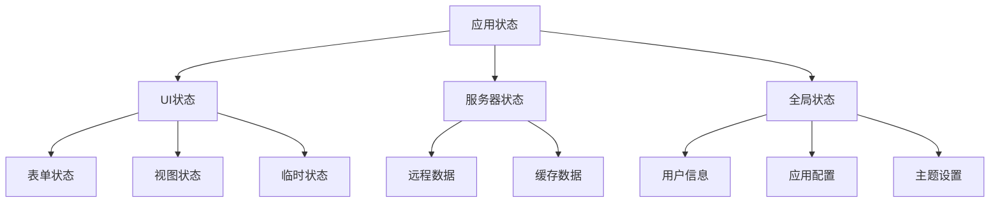
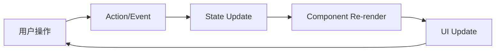

# 状态管理架构

## 概述

本文档详细说明商品管理中台前端系统的状态管理架构，包括状态分类、管理策略、数据流向和最佳实践。

## 状态管理策略

### 1. 状态分类

我们将应用状态分为以下几类：



#### UI状态管理

使用React内置状态管理（useState, useReducer）：

```typescript
// 表单状态
const [formData, setFormData] = useState<ProductFormData>({
  name: '',
  description: '',
  price: 0,
});

// 视图状态
const [currentView, setCurrentView] = useState<'table' | 'grid'>('table');
const [selectedItems, setSelectedItems] = useState<string[]>([]);

// 复杂UI状态使用useReducer
const [formState, dispatch] = useReducer(formReducer, initialState);
```

#### 服务器状态管理

使用React Query管理服务器状态：

```typescript
// 商品列表状态
const {
  data: products,
  isLoading,
  error,
  refetch,
} = useQuery({
  queryKey: ['products', filters],
  queryFn: () => productService.getProducts(filters),
  staleTime: 5 * 60 * 1000, // 5分钟
});

// 商品详情状态
const { data: product } = useQuery({
  queryKey: ['product', productId],
  queryFn: () => productService.getProductById(productId),
  enabled: !!productId,
});
```

#### 全局状态管理

使用Zustand管理全局状态：

```typescript
// 用户状态store
interface UserStore {
  user: User | null;
  permissions: string[];
  login: (credentials: LoginCredentials) => Promise<void>;
  logout: () => void;
  updateProfile: (profile: Partial<User>) => void;
}

export const useUserStore = create<UserStore>((set, get) => ({
  user: null,
  permissions: [],

  login: async (credentials) => {
    const response = await authService.login(credentials);
    set({
      user: response.user,
      permissions: response.user.permissions,
    });
    localStorage.setItem('token', response.token);
  },

  logout: () => {
    set({ user: null, permissions: [] });
    localStorage.removeItem('token');
  },

  updateProfile: (profile) => {
    const currentUser = get().user;
    if (currentUser) {
      set({
        user: { ...currentUser, ...profile },
      });
    }
  },
}));
```

### 2. 状态持久化

#### LocalStorage持久化

```typescript
// 持久化用户偏好设置
const usePersistentSettings = () => {
  const [settings, setSettings] = useState(() => {
    const saved = localStorage.getItem('userSettings');
    return saved ? JSON.parse(saved) : defaultSettings;
  });

  const updateSettings = useCallback((newSettings: Partial<UserSettings>) => {
    const updated = { ...settings, ...newSettings };
    setSettings(updated);
    localStorage.setItem('userSettings', JSON.stringify(updated));
  }, [settings]);

  return { settings, updateSettings };
};

// 持久化表单草稿
const useFormDraft = (formKey: string) => {
  const [draft, setDraft] = useState(() => {
    const saved = localStorage.getItem(`formDraft_${formKey}`);
    return saved ? JSON.parse(saved) : {};
  });

  const saveDraft = useCallback((data: any) => {
    setDraft(data);
    localStorage.setItem(`formDraft_${formKey}`, JSON.stringify(data));
  }, [formKey]);

  const clearDraft = useCallback(() => {
    setDraft({});
    localStorage.removeItem(`formDraft_${formKey}`);
  }, [formKey]);

  return { draft, saveDraft, clearDraft };
};
```

## React Query配置

### 1. 全局配置

```typescript
// src/config/queryClient.ts
import { QueryClient } from '@tanstack/react-query';

export const queryClient = new QueryClient({
  defaultOptions: {
    queries: {
      staleTime: 5 * 60 * 1000, // 5分钟内数据被认为是新鲜的
      cacheTime: 10 * 60 * 1000, // 10分钟后清除缓存
      retry: (failureCount, error) => {
        // 网络错误重试3次，其他错误不重试
        if (error instanceof Error && error.message.includes('Network Error')) {
          return failureCount < 3;
        }
        return false;
      },
      refetchOnWindowFocus: false, // 窗口聚焦时不自动重新获取
      refetchOnReconnect: true, // 网络重连时重新获取
    },
    mutations: {
      retry: 1, // Mutation失败时重试1次
    },
  },
});
```

### 2. 自定义Hooks

```typescript
// src/hooks/useProducts.ts
import { useQuery, useMutation, useQueryClient } from '@tanstack/react-query';
import { productService } from '@/services/productService';

export const useProducts = (params?: ProductQueryParams) => {
  return useQuery({
    queryKey: ['products', params],
    queryFn: () => productService.getProducts(params),
    select: (data) => ({
      ...data,
      // 数据转换
      data: data.data.map(product => ({
        ...product,
        // 计算属性
        statusText: getStatusText(product.status),
        formattedPrice: formatPrice(product.basePrice),
      })),
    }),
  });
};

export const useCreateProduct = () => {
  const queryClient = useQueryClient();

  return useMutation({
    mutationFn: productService.createProduct,
    onSuccess: () => {
      // 使商品列表缓存失效
      queryClient.invalidateQueries({ queryKey: ['products'] });
      // 显示成功消息
      message.success('商品创建成功');
    },
    onError: (error) => {
      message.error(error.message || '创建失败');
    },
  });
};

export const useUpdateProduct = () => {
  const queryClient = useQueryClient();

  return useMutation({
    mutationFn: ({ id, data }: { id: string; data: Partial<Product> }) =>
      productService.updateProduct(id, data),
    onMutate: async ({ id, data }) => {
      // 取消正在进行的查询
      await queryClient.cancelQueries({ queryKey: ['products'] });

      // 获取当前数据快照
      const previousProducts = queryClient.getQueryData(['products']);

      // 乐观更新
      queryClient.setQueryData(['products'], (old: any) => ({
        ...old,
        data: old.data.map((product: Product) =>
          product.id === id ? { ...product, ...data } : product
        ),
      }));

      return { previousProducts };
    },
    onError: (err, newProduct, context) => {
      // 回滚到之前的状态
      if (context?.previousProducts) {
        queryClient.setQueryData(['products'], context.previousProducts);
      }
    },
    onSettled: () => {
      // 无论成功失败都重新获取数据
      queryClient.invalidateQueries({ queryKey: ['products'] });
    },
  });
};
```

## Zustand状态管理

### 1. Store结构设计

```typescript
// src/stores/index.ts
import { create } from 'zustand';
import { devtools, persist } from 'zustand/middleware';

// 用户状态
export const useUserStore = create<UserStore>()(
  devtools(
    persist(
      (set, get) => ({
        user: null,
        permissions: [],
        isLoggedIn: false,

        login: async (credentials) => {
          // 登录逻辑
        },

        logout: () => {
          set({ user: null, permissions: [], isLoggedIn: false });
        },
      }),
      {
        name: 'user-storage',
        partialize: (state) => ({
          user: state.user,
          permissions: state.permissions,
        }),
      }
    )
  )
);

// 应用状态
export const useAppStore = create<AppStore>((set, get) => ({
  // 主题
  theme: 'light',
  setTheme: (theme) => set({ theme }),

  // 语言
  language: 'zh-CN',
  setLanguage: (language) => set({ language }),

  // 侧边栏
  sidebarCollapsed: false,
  toggleSidebar: () => set((state) => ({
    sidebarCollapsed: !state.sidebarCollapsed
  })),

  // 加载状态
  globalLoading: false,
  setGlobalLoading: (loading) => set({ globalLoading: loading }),

  // 消息通知
  notifications: [],
  addNotification: (notification) => set((state) => ({
    notifications: [...state.notifications, { ...notification, id: Date.now() }],
  })),
  removeNotification: (id) => set((state) => ({
    notifications: state.notifications.filter(n => n.id !== id),
  })),
}));

// 商品状态
export const useProductStore = create<ProductStore>((set, get) => ({
  // 选中的商品
  selectedProducts: [],
  setSelectedProducts: (products) => set({ selectedProducts: products }),

  // 商品筛选条件
  filters: {},
  setFilters: (filters) => set({ filters: { ...get().filters, ...filters } }),
  clearFilters: () => set({ filters: {} }),

  // 商品视图模式
  viewMode: 'table',
  setViewMode: (mode) => set({ viewMode: mode }),

  // 批量操作
  batchOperation: null,
  setBatchOperation: (operation) => set({ batchOperation: operation }),
}));
```

### 2. 中间件使用

```typescript
// 日志中间件
const loggerMiddleware = (config) => (set, get, api) =>
  config(
    (...args) => {
      console.log('State before:', get());
      set(...args);
      console.log('State after:', get());
    },
    get,
    api
  );

// 订阅中间件
const subscriptionMiddleware = (config) => (set, get, api) => {
  const store = config(set, get, api);

  // 订阅状态变化
  api.subscribe((state) => {
    // 处理状态变化逻辑
    if (state.user !== get().user) {
      // 用户状态变化时的处理
    }
  });

  return store;
};

// 组合中间件
export const useEnhancedStore = create<ProductStore>()(
  loggerMiddleware(
    subscriptionMiddleware(
      devtools((set, get) => ({
        // store logic
      }))
    )
  )
);
```

## 数据流架构

### 1. 单向数据流



### 2. 数据流向示例

```typescript
// 商品列表数据流
const ProductListPage = () => {
  // 1. 从React Query获取数据
  const { data, isLoading, error } = useProducts(filters);

  // 2. 从Zustand获取UI状态
  const { selectedProducts, setSelectedProducts } = useProductStore();
  const { viewMode } = useProductStore();

  // 3. 事件处理
  const handleProductSelect = (productId: string) => {
    setSelectedProducts([...selectedProducts, productId]);
  };

  // 4. 渲染组件
  return (
    <div>
      {isLoading && <Loading />}
      {error && <ErrorMessage error={error} />}
      {data && (
        <ProductList
          products={data.data}
          viewMode={viewMode}
          selectedProducts={selectedProducts}
          onSelect={handleProductSelect}
        />
      )}
    </div>
  );
};
```

## 缓存策略

### 1. 查询缓存配置

```typescript
// 不同类型数据的缓存策略
const cacheConfig = {
  // 商品数据 - 中等缓存时间
  products: {
    staleTime: 5 * 60 * 1000, // 5分钟
    cacheTime: 30 * 60 * 1000, // 30分钟
  },

  // 用户信息 - 长时间缓存
  user: {
    staleTime: 30 * 60 * 1000, // 30分钟
    cacheTime: 60 * 60 * 1000, // 1小时
  },

  // 配置数据 - 很长时间缓存
  config: {
    staleTime: 60 * 60 * 1000, // 1小时
    cacheTime: 24 * 60 * 60 * 1000, // 24小时
  },
};

// 使用配置
export const useConfig = () => {
  return useQuery({
    queryKey: ['config'],
    queryFn: () => configService.getConfig(),
    ...cacheConfig.config,
  });
};
```

### 2. 缓存失效策略

```typescript
// 智能缓存失效
const useProductOperations = () => {
  const queryClient = useQueryClient();

  const createProduct = useMutation({
    mutationFn: productService.createProduct,
    onSuccess: () => {
      // 失效商品列表缓存
      queryClient.invalidateQueries({ queryKey: ['products'] });

      // 预加载新数据
      queryClient.prefetchQuery({
        queryKey: ['products'],
        queryFn: () => productService.getProducts(),
      });
    },
  });

  const updateProduct = useMutation({
    mutationFn: productService.updateProduct,
    onSuccess: (updatedProduct) => {
      // 更新单个商品缓存
      queryClient.setQueryData(
        ['product', updatedProduct.id],
        updatedProduct
      );

      // 更新列表中的商品
      queryClient.setQueriesData(
        { queryKey: ['products'] },
        (old: any) => ({
          ...old,
          data: old.data.map((product: Product) =>
            product.id === updatedProduct.id ? updatedProduct : product
          ),
        })
      );
    },
  });

  return { createProduct, updateProduct };
};
```

## 错误处理

### 1. 全局错误边界

```typescript
// src/components/ErrorBoundary.tsx
export class GlobalErrorBoundary extends Component<Props, State> {
  componentDidCatch(error: Error, errorInfo: ErrorInfo) {
    console.error('Global error:', error, errorInfo);

    // 发送错误报告
    if (process.env.NODE_ENV === 'production') {
      reportError(error, errorInfo);
    }

    // 清除可能损坏的缓存
    queryClient.clear();
  }

  render() {
    if (this.state.hasError) {
      return <ErrorFallback onRetry={this.handleRetry} />;
    }

    return this.props.children;
  }
}
```

### 2. 错误状态管理

```typescript
// 错误状态store
export const useErrorStore = create<ErrorStore>((set) => ({
  errors: [],

  addError: (error) => set((state) => ({
    errors: [...state.errors, { ...error, id: Date.now() }],
  })),

  removeError: (id) => set((state) => ({
    errors: state.errors.filter(e => e.id !== id),
  })),

  clearErrors: () => set({ errors: [] }),
}));

// 错误处理Hook
export const useErrorHandler = () => {
  const { addError } = useErrorStore();

  const handleError = useCallback((error: unknown) => {
    const errorObj = {
      message: error instanceof Error ? error.message : '未知错误',
      type: error instanceof Error ? error.constructor.name : 'UnknownError',
      timestamp: new Date().toISOString(),
    };

    addError(errorObj);

    // 控制台输出
    console.error('Error handled:', error);
  }, [addError]);

  return { handleError };
};
```

## 性能优化

### 1. 状态选择优化

```typescript
// 使用选择器避免不必要的重渲染
const useUserName = () => {
  return useUserStore(
    (state) => state.user?.name,
    (a, b) => a === b
  );
};

// 浅比较优化
const useProductsSelector = (selector: (state: ProductStore) => any) => {
  return useProductStore(selector, shallow);
};
```

### 2. 内存管理

```typescript
// 清理过期缓存
const useCacheCleanup = () => {
  const queryClient = useQueryClient();

  useEffect(() => {
    const interval = setInterval(() => {
      // 清理过期的查询缓存
      queryClient.removeQueries({
        predicate: (query) => {
          const age = Date.now() - query.state.dataUpdatedAt;
          return age > 60 * 60 * 1000; // 1小时
        },
      });
    }, 30 * 60 * 1000); // 每30分钟清理一次

    return () => clearInterval(interval);
  }, [queryClient]);
};
```

通过合理的状态管理架构，我们可以确保应用的可维护性、性能和用户体验。