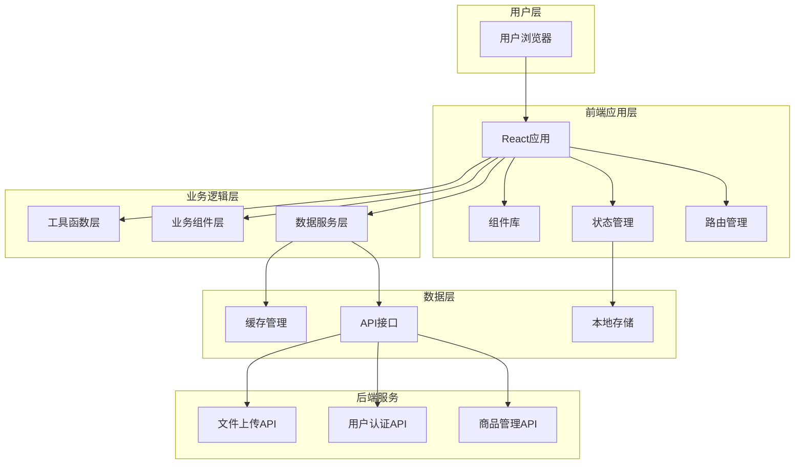
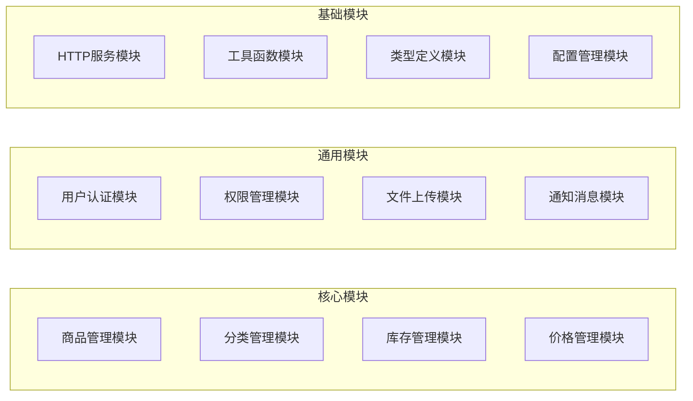
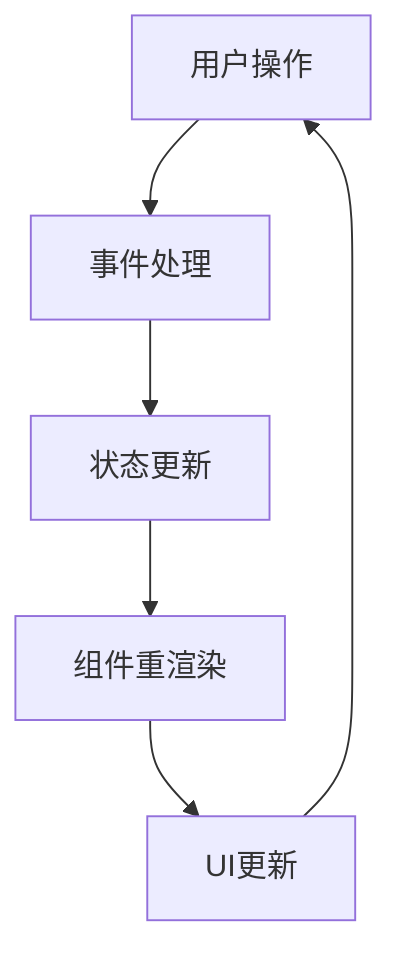
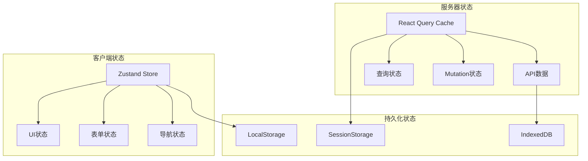
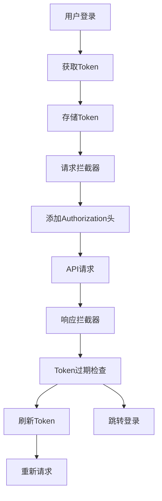
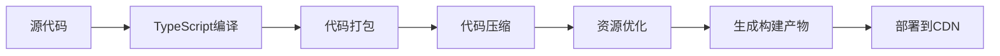

# 系统架构设计

## 概述

商品管理中台前端系统采用现代化的前端技术栈，基于React 18 + TypeScript 5.0构建，提供高性能、可扩展、可维护的用户界面。本文档详细说明系统的整体架构设计理念和技术选型。

## 技术栈概览

### 核心技术栈

| 技术类别 | 技术选型 | 版本 | 用途说明 |
|----------|----------|------|----------|
| 前端框架 | React | 18.2.0 | 核心UI框架，组件化开发 |
| 编程语言 | TypeScript | 5.0.0 | 类型安全，提高代码质量 |
| UI组件库 | Ant Design | 5.12.0 | 企业级UI组件库 |
| 路由管理 | React Router | 6.8.0 | 单页应用路由管理 |
| 状态管理 | Zustand | 5.0.9 | 轻量级状态管理 |
| 数据获取 | React Query | 5.90.12 | 服务器状态管理 |
| HTTP客户端 | Axios | 1.13.2 | API请求处理 |
| 表单处理 | React Hook Form | 7.68.0 | 高性能表单管理 |
| 构建工具 | Vite | 7.2.4 | 现代化构建工具 |
| 包管理器 | npm | 9.6.7 | 依赖管理和脚本执行 |

### 开发工具链

| 工具类型 | 工具名称 | 版本 | 用途说明 |
|----------|----------|------|----------|
| 代码规范 | ESLint | 9.39.1 | 代码质量检查 |
| 代码格式化 | Prettier | 3.7.4 | 代码格式化 |
| 类型检查 | TypeScript | 5.9.3 | 静态类型检查 |
| Git钩子 | Husky | 9.1.7 | Git提交钩子管理 |
| 提交规范 | Commitlint | 20.2.0 | 提交信息规范检查 |

## 系统架构图



## 整体架构设计

### 1. 分层架构

系统采用经典的分层架构设计，从上到下分为：

#### 表现层（Presentation Layer）
- **职责**: 用户界面展示和用户交互处理
- **技术**: React组件、Ant Design、CSS/Styled Components
- **特点**: 组件化、可复用、响应式设计

#### 业务逻辑层（Business Logic Layer）
- **职责**: 业务逻辑处理、数据转换、状态管理
- **技术**: React Hooks、Custom Hooks、Zustand Store
- **特点**: 业务逻辑封装、数据流管理、副作用处理

#### 数据访问层（Data Access Layer）
- **职责**: API调用、数据缓存、错误处理
- **技术**: Axios、React Query、LocalStorage
- **特点**: 统一数据接口、缓存策略、请求重试

### 2. 模块化设计

系统采用功能模块化的设计思路：



### 3. 组件架构

采用原子设计理念，组件分为以下层级：

#### 原子组件（Atoms）
最基础的UI组件，无法再拆分：
- Button、Input、Select、Modal等基础组件
- Typography、Icon、Divider等展示组件
- Form.Item、Table.Column等业务基础组件

#### 分子组件（Molecules）
由原子组件组合而成，具有特定功能：
- SearchForm（搜索表单）
- DataTable（数据表格）
- FileUploader（文件上传）
- ImagePreview（图片预览）

#### 有机体（Organisms）
复杂的业务组件，由分子组件组成：
- ProductList（商品列表）
- ProductForm（商品表单）
- CategoryTree（分类树）
- UserMenu（用户菜单）

#### 模板（Templates）
页面布局模板：
- MainLayout（主布局）
- AuthLayout（认证布局）
- BlankLayout（空白布局）

#### 页面（Pages）
完整的页面组件：
- ProductListPage（商品列表页）
- ProductDetailPage（商品详情页）
- UserLoginPage（用户登录页）

## 数据流架构

### 1. 单向数据流

采用React的单向数据流设计：



### 2. 状态管理架构

使用Zustand进行状态管理，结合React Query处理服务器状态：



### 3. 数据缓存策略

#### React Query缓存策略
- **查询缓存**: 自动缓存API响应数据
- **后台刷新**: 定期在后台刷新数据
- **失效策略**: 基于时间的手动/自动失效
- **乐观更新**: 提升用户体验的即时UI更新

#### 本地存储策略
- **用户偏好**: LocalStorage持久化
- **临时数据**: SessionStorage会话存储
- **大数据量**: IndexedDB存储

## 性能优化架构

### 1. 代码分割策略

```typescript
// 路由级别代码分割
const ProductListPage = lazy(() => import('@/pages/ProductListPage'));
const ProductDetailPage = lazy(() => import('@/pages/ProductDetailPage'));

// 组件级别代码分割
const HeavyComponent = lazy(() => import('@/components/HeavyComponent'));
```

### 2. 组件优化策略

#### React.memo优化
```typescript
const ProductItem = React.memo(({ product }: ProductItemProps) => {
  return <div>{product.name}</div>;
}, (prevProps, nextProps) => {
  return prevProps.product.id === nextProps.product.id;
});
```

#### useMemo和useCallback优化
```typescript
const ProductList = ({ products }: ProductListProps) => {
  const expensiveValue = useMemo(() => {
    return products.filter(p => p.status === 'active');
  }, [products]);

  const handleClick = useCallback((productId: string) => {
    onProductSelect(productId);
  }, [onProductSelect]);
};
```

### 3. 虚拟滚动优化

对于大数据量列表，使用虚拟滚动技术：

```typescript
const VirtualProductList = () => {
  return (
    <VirtualScroll
      height={600}
      itemCount={products.length}
      itemSize={80}
      renderItem={({ index, style }) => (
        <div style={style}>
          <ProductItem product={products[index]} />
        </div>
      )}
    />
  );
};
```

## 安全架构

### 1. 认证授权架构



### 2. 数据安全

- **输入验证**: 使用Zod进行数据验证
- **XSS防护**: React自动XSS防护
- **CSRF防护**: Token验证机制
- **敏感信息**: 避免在前端存储敏感数据

### 3. 权限控制

```typescript
// 权限控制Hook
const usePermission = (permission: string) => {
  const { user } = useAuthStore();
  return user?.permissions?.includes(permission) || false;
};

// 权限控制组件
const PermissionGuard = ({ permission, children }: PermissionGuardProps) => {
  const hasPermission = usePermission(permission);
  return hasPermission ? <>{children}</> : <NoPermission />;
};
```

## 错误处理架构

### 1. 错误边界

```typescript
class ErrorBoundary extends React.Component<Props, State> {
  componentDidCatch(error: Error, errorInfo: ErrorInfo) {
    console.error('Error caught by boundary:', error, errorInfo);
    // 发送错误报告到监控服务
    reportError(error, errorInfo);
  }

  render() {
    if (this.state.hasError) {
      return <ErrorFallback onRetry={this.handleRetry} />;
    }
    return this.props.children;
  }
}
```

### 2. 全局错误处理

```typescript
// 全局错误处理器
const setupGlobalErrorHandler = () => {
  // 未捕获的Promise错误
  window.addEventListener('unhandledrejection', (event) => {
    console.error('Unhandled promise rejection:', event.reason);
    reportError(event.reason);
  });

  // 未捕获的JavaScript错误
  window.addEventListener('error', (event) => {
    console.error('Global error:', event.error);
    reportError(event.error);
  });
};
```

## 监控与分析

### 1. 性能监控

```typescript
// Web Vitals性能监控
const reportWebVitals = (metric: any) => {
  console.log('Web Vital:', metric);
  // 发送到分析服务
  analytics.track('web_vital', {
    name: metric.name,
    value: metric.value,
    id: metric.id,
  });
};
```

### 2. 用户行为分析

```typescript
// 用户行为追踪
const useAnalytics = () => {
  const trackEvent = (eventName: string, properties?: object) => {
    analytics.track(eventName, {
      timestamp: new Date().toISOString(),
      userAgent: navigator.userAgent,
      ...properties,
    });
  };

  return { trackEvent };
};
```

## 部署架构

### 1. 构建流程



### 2. 环境配置

```typescript
// 环境变量配置
interface EnvConfig {
  API_BASE_URL: string;
  UPLOAD_URL: string;
  ENABLE_MOCK: boolean;
  LOG_LEVEL: 'debug' | 'info' | 'warn' | 'error';
}

const config: Record<string, EnvConfig> = {
  development: {
    API_BASE_URL: 'http://localhost:8080/api',
    UPLOAD_URL: 'http://localhost:8080/upload',
    ENABLE_MOCK: true,
    LOG_LEVEL: 'debug',
  },
  production: {
    API_BASE_URL: 'https://api.example.com',
    UPLOAD_URL: 'https://upload.example.com',
    ENABLE_MOCK: false,
    LOG_LEVEL: 'warn',
  },
};
```

### 3. CI/CD流程

```yaml
# 构建流程示例
name: Build and Deploy
on: [push]

jobs:
  build:
    runs-on: ubuntu-latest
    steps:
      - uses: actions/checkout@v2
      - name: Setup Node.js
        uses: actions/setup-node@v2
        with:
          node-version: '18'
      - name: Install dependencies
        run: npm ci
      - name: Run tests
        run: npm test
      - name: Run linting
        run: npm run lint
      - name: Build
        run: npm run build
      - name: Deploy
        run: npm run deploy
```

## 扩展性设计

### 1. 插件化架构

系统支持插件化扩展，便于功能模块的动态加载：

```typescript
// 插件接口定义
interface Plugin {
  name: string;
  version: string;
  install: (app: App) => void;
  uninstall: (app: App) => void;
}

// 插件管理器
class PluginManager {
  private plugins = new Map<string, Plugin>();

  install(plugin: Plugin) {
    if (this.plugins.has(plugin.name)) {
      throw new Error(`Plugin ${plugin.name} already installed`);
    }
    plugin.install(app);
    this.plugins.set(plugin.name, plugin);
  }
}
```

### 2. 主题系统

支持多主题切换的架构设计：

```typescript
// 主题配置接口
interface Theme {
  name: string;
  colors: {
    primary: string;
    secondary: string;
    success: string;
    warning: string;
    error: string;
  };
  typography: {
    fontFamily: string;
    fontSize: Record<string, string>;
  };
  spacing: Record<string, string>;
}

// 主题提供者
const ThemeProvider: React.FC<{ theme: Theme; children: React.ReactNode }> = ({
  theme,
  children,
}) => {
  return (
    <ConfigProvider theme={theme}>
      {children}
    </ConfigProvider>
  );
};
```

## 技术债务管理

### 1. 代码质量监控

- **SonarQube**: 代码质量分析
- **ESLint规则**: 代码规范检查
- **TypeScript严格模式**: 类型安全检查
- **单元测试覆盖率**: 代码覆盖率监控

### 2. 重构策略

- **小步重构**: 频繁的小幅度重构
- **测试保障**: 重构前确保测试覆盖
- **向后兼容**: API接口向后兼容
- **文档同步**: 重构后及时更新文档

## 总结

本系统架构设计遵循现代前端开发的最佳实践，具有以下特点：

1. **高性能**: 通过代码分割、虚拟滚动、缓存策略等技术保证性能
2. **可维护性**: 模块化设计、类型安全、代码规范确保可维护性
3. **可扩展性**: 插件化架构、主题系统支持功能扩展
4. **安全性**: 完善的认证授权机制和数据安全措施
5. **用户体验**: 优化的加载性能和错误处理机制

通过合理的架构设计，系统具备了良好的技术基础，能够支撑业务的快速发展和变化。