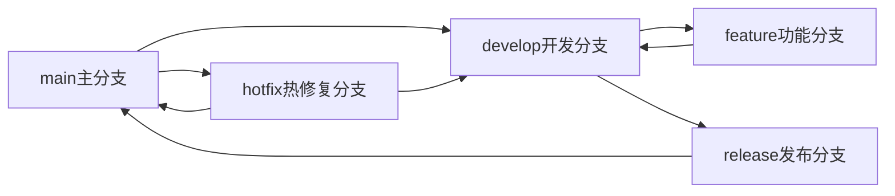
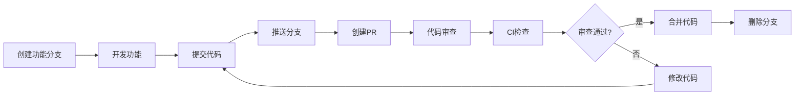

# Git工作流规范

## 概述

本文档定义了商品管理中台前端项目的Git工作流程规范，包括分支管理、提交规范、代码审查流程等。所有团队成员都需要严格遵循这些规范以确保代码质量和协作效率。

## 分支管理策略

### 1. 分支类型

我们采用Git Flow工作流，主要包含以下分支类型：



#### 主分支（main）

- **用途**: 生产环境代码，只包含稳定的发布版本
- **保护**: 设置为保护分支，禁止直接推送
- **命名**: `main`
- **合并**: 只能从`release`或`hotfix`分支合并

#### 开发分支（develop）

- **用途**: 开发环境代码，集成最新的功能开发
- **保护**: 设置为保护分支，禁止直接推送
- **命名**: `develop`
- **合并**: 接受`feature`分支的合并

#### 功能分支（feature）

- **用途**: 新功能开发
- **命名**: `feature/功能描述`，使用kebab-case
- **源分支**: 从`develop`分支创建
- **目标分支**: 合并到`develop`分支
- **生命周期**: 功能开发完成后删除

```bash
# 示例功能分支命名
feature/user-authentication
feature/product-management
feature/image-upload
feature/search-filtering
```

#### 发布分支（release）

- **用途**: 发布准备，bug修复，版本文档更新
- **命名**: `release/版本号`，如`release/v1.2.0`
- **源分支**: 从`develop`分支创建
- **目标分支**: 合并到`main`和`develop`分支
- **生命周期**: 发布完成后删除

#### 热修复分支（hotfix）

- **用途**: 紧急修复生产环境问题
- **命名**: `hotfix/问题描述`，使用kebab-case
- **源分支**: 从`main`分支创建
- **目标分支**: 合并到`main`和`develop`分支
- **生命周期**: 修复完成后删除

```bash
# 示例热修复分支命名
hotfix/login-page-crash
hotfix/payment-gateway-timeout
hotfix/security-vulnerability-fix
```

### 2. 分支操作规范

#### 创建功能分支

```bash
# 1. 切换到develop分支并更新到最新
git checkout develop
git pull origin develop

# 2. 创建新功能分支
git checkout -b feature/product-search

# 3. 推送新分支到远程仓库
git push -u origin feature/product-search
```

#### 创建发布分支

```bash
# 1. 切换到develop分支
git checkout develop
git pull origin develop

# 2. 创建发布分支
git checkout -b release/v1.2.0

# 3. 推送到远程仓库
git push -u origin release/v1.2.0
```

#### 创建热修复分支

```bash
# 1. 切换到main分支
git checkout main
git pull origin main

# 2. 创建热修复分支
git checkout -b hotfix/critical-bug-fix

# 3. 推送到远程仓库
git push -u origin hotfix/critical-bug-fix
```

## 提交规范

### 1. 提交信息格式

我们使用Conventional Commits规范：

```
<type>(<scope>): <subject>

<body>

<footer>
```

#### 提交类型（type）

| 类型 | 描述 | 示例 |
|------|------|------|
| `feat` | 新功能 | `feat(product): 添加商品搜索功能` |
| `fix` | 修复bug | `fix(auth): 修复登录页面崩溃问题` |
| `docs` | 文档更新 | `docs(readme): 更新安装说明` |
| `style` | 代码格式调整 | `style(product): 格式化商品列表代码` |
| `refactor` | 重构代码 | `refactor(api): 重构商品服务层` |
| `perf` | 性能优化 | `perf(list): 优化虚拟滚动性能` |
| `test` | 测试相关 | `test(product): 添加商品组件单元测试` |
| `chore` | 构建工具、依赖更新 | `chore(deps): 更新React到18.2.0` |
| `revert` | 回滚提交 | `revert: 回滚之前的提交` |

#### 范围（scope）

范围说明本次提交影响的模块或组件：

- `product`: 商品管理相关
- `auth`: 用户认证相关
- `ui`: UI组件相关
- `api`: API接口相关
- `utils`: 工具函数相关
- `config`: 配置相关
- `docs`: 文档相关

#### 主题（subject）

- 使用动词开头，使用祈使语气
- 首字母小写
- 结尾不加句号
- 不超过50个字符

#### 正文（body）

- 详细描述本次提交的内容
- 说明代码变更的原因和动机
- 使用过去时态
- 每行不超过72个字符

#### 脚注（footer）

- 关联的Issue编号
- 破坏性变更说明
- 其他元数据

### 2. 提交信息示例

```bash
# 新功能提交
feat(product): 添加商品图片上传功能

- 支持拖拽上传多张图片
- 添加图片预览和删除功能
- 限制上传文件大小为5MB
- 支持jpg、png格式

Closes #123

# 修复bug提交
fix(auth): 修复登录token过期不跳转问题

当访问token过期的API端点时，用户没有被正确重定向到登录页面，
导致用户看到错误信息而不是登录界面。

修复内容：
- 添加axios响应拦截器处理401错误
- 在token过期时清除本地存储
- 自动跳转到登录页面

Fixes #145

# 性能优化提交
perf(list): 优化商品列表虚拟滚动性能

- 使用react-window替代原生滚动
- 实现组件级别的懒加载
- 优化渲染函数，减少不必要的重渲染

性能提升：
- 初始渲染时间减少60%
- 滚动流畅度提升40%
- 内存使用量减少30%

# 重构提交
refactor(services): 重构API服务层架构

将API调用逻辑从组件中抽离，创建统一的服务层管理，
提高代码复用性和可维护性。

变更内容：
- 创建baseService处理通用逻辑
- 重构productService使用新的架构
- 添加统一的错误处理机制
- 实现请求拦截和响应处理

BREAKING CHANGE: productService的API调用方式已更新，
需要更新相关组件的使用方式。
```

### 3. 提交工具配置

#### 安装Commitizen和Commitlint

```bash
# 安装依赖
npm install -D commitizen @commitizen/cz-commitlint @commitlint/cli @commitlint/config-conventional

# 初始化commitizen
echo '{ "path": "@commitizen/cz-commitlint" }' > .czrc

# 配置commitlint
echo "module.exports = { extends: ['@commitlint/config-conventional'] };" > commitlint.config.js
```

#### package.json配置

```json
{
  "scripts": {
    "commit": "git-cz",
    "prepare": "husky install"
  },
  "husky": {
    "hooks": {
      "commit-msg": "commitlint -E HUSKY_GIT_PARAMS"
    }
  },
  "config": {
    "commitizen": {
      "path": "@commitizen/cz-commitlint"
    }
  }
}
```

## 代码审查流程

### 1. Pull Request流程



#### 创建Pull Request

1. **分支准备**：
   - 确保功能开发完成
   - 运行测试确保通过
   - 代码格式化和lint检查

2. **创建PR**：
   - 使用有意义的标题
   - 填写详细的描述
   - 关联相关的Issue
   - 选择正确的审查者

3. **PR模板**：

```markdown
## 变更类型
- [ ] 新功能 (feature)
- [ ] 修复 (fix)
- [ ] 文档 (docs)
- [ ] 样式 (style)
- [ ] 重构 (refactor)
- [ ] 性能优化 (perf)
- [ ] 测试 (test)
- [ ] 构建 (chore)

## 变更描述
简要描述本次PR的主要变更内容

## 相关Issue
Closes #123

## 测试
- [ ] 单元测试已通过
- [ ] 集成测试已通过
- [ ] 手动测试已完成
- [ ] 浏览器兼容性测试

## 截图（如适用）
如果是UI相关的变更，请提供截图

## Checklist
- [ ] 代码已通过lint检查
- [ ] 已添加或更新了测试
- [ ] 文档已更新
- [ ] 变更不会破坏现有功能
- [ ] 已考虑向后兼容性
```

### 2. 代码审查标准

#### 代码质量检查项

- **功能正确性**：
  - [ ] 功能实现符合需求
  - [ ] 边界情况处理完善
  - [ ] 错误处理机制健全

- **代码规范**：
  - [ ] 遵循TypeScript/JavaScript规范
  - [ ] 命名清晰语义化
  - [ ] 代码结构清晰
  - [ ] 没有冗余代码

- **性能考虑**：
  - [ ] 避免不必要的重渲染
  - [ ] 合理使用缓存
  - [ ] 大数据量处理优化
  - [ ] 内存泄漏检查

- **安全性**：
  - [ ] 输入验证和数据清理
  - [ ] 敏感信息处理
  - [ ] 权限检查
  - [ ] XSS/CSRF防护

#### 审查者职责

1. **主审查者**：
   - 负责整体代码质量把控
   - 决定是否可以合并
   - 协调解决审查意见

2. **技术审查者**：
   - 关注技术实现细节
   - 检查最佳实践遵循
   - 提供技术改进建议

3. **业务审查者**：
   - 验证业务逻辑正确性
   - 检查用户体验
   - 确认需求符合性

### 3. 审查反馈处理

#### 反馈分类

- **必须修复**：
  - 功能性问题
  - 安全隐患
  - 性能严重问题
  - 代码规范严重问题

- **建议修复**：
  - 代码改进建议
  - 性能优化建议
  - 最佳实践建议

- **讨论项**：
  - 设计方案讨论
  - 架构改进讨论
  - 未来规划讨论

#### 反馈处理流程

```typescript
// 审查者反馈示例
interface ReviewComment {
  type: 'required' | 'suggested' | 'discussion';
  file: string;
  line: number;
  message: string;
  suggestions?: string[];
}

// 示例审查评论
const reviewComments: ReviewComment[] = [
  {
    type: 'required',
    file: 'src/components/ProductCard.tsx',
    line: 45,
    message: '这里缺少错误边界处理，可能导致组件崩溃',
    suggestions: [
      '添加try-catch包装',
      '使用ErrorBoundary组件包裹'
    ]
  },
  {
    type: 'suggested',
    file: 'src/hooks/useProductList.ts',
    line: 23,
    message: '建议使用useMemo缓存计算结果以提高性能',
    suggestions: [
      '将filter操作包装在useMemo中'
    ]
  }
];
```

## CI/CD集成

### 1. 持续集成配置

#### GitHub Actions工作流

```yaml
# .github/workflows/ci.yml
name: CI Pipeline

on:
  push:
    branches: [ main, develop ]
  pull_request:
    branches: [ main, develop ]

jobs:
  test:
    runs-on: ubuntu-latest

    strategy:
      matrix:
        node-version: [18.x, 20.x]

    steps:
      - uses: actions/checkout@v3

      - name: Setup Node.js ${{ matrix.node-version }}
        uses: actions/setup-node@v3
        with:
          node-version: ${{ matrix.node-version }}
          cache: 'npm'

      - name: Install dependencies
        run: npm ci

      - name: Run linting
        run: npm run lint

      - name: Run type checking
        run: npm run type-check

      - name: Run tests
        run: npm test -- --coverage

      - name: Upload coverage to Codecov
        uses: codecov/codecov-action@v3

  build:
    runs-on: ubuntu-latest
    needs: test

    steps:
      - uses: actions/checkout@v3

      - name: Setup Node.js
        uses: actions/setup-node@v3
        with:
          node-version: '18.x'
          cache: 'npm'

      - name: Install dependencies
        run: npm ci

      - name: Build application
        run: npm run build

      - name: Upload build artifacts
        uses: actions/upload-artifact@v3
        with:
          name: build-files
          path: dist/
```

### 2. 质量门禁

#### 质量检查项

- **代码覆盖率** ≥ 80%
- **ESLint检查** 无错误
- **TypeScript检查** 无类型错误
- **构建检查** 成功构建
- **安全扫描** 无高危漏洞

#### 分支保护规则

```yaml
# GitHub分支保护配置
branch_protection:
  main:
    required_status_checks:
      strict: true
      contexts:
        - "CI Pipeline"
        - "CodeQL Analysis"
        - "Security Scan"
    enforce_admins: true
    required_pull_request_reviews:
      required_approving_review_count: 2
      dismiss_stale_reviews: true
      require_code_owner_reviews: true
    restrictions:
      users: []
      teams: ["core-developers"]
```

## 发布流程

### 1. 版本管理

#### 语义化版本控制

- **主版本号（Major）**：不兼容的API变更
- **次版本号（Minor）**：向后兼容的功能新增
- **修订号（Patch）**：向后兼容的问题修正

#### 版本号示例

```
v1.0.0    # 首个正式版本
v1.1.0    # 新增功能
v1.1.1    # 修复bug
v2.0.0    # 重大变更，不兼容
```

### 2. 发布步骤

#### 准备发布

```bash
# 1. 创建发布分支
git checkout develop
git pull origin develop
git checkout -b release/v1.2.0

# 2. 更新版本号
npm version 1.2.0

# 3. 更新CHANGELOG
npm run changelog

# 4. 提交版本更新
git add package.json CHANGELOG.md
git commit -m "chore(release): prepare v1.2.0 release"

# 5. 推送发布分支
git push origin release/v1.2.0
```

#### 执行发布

```bash
# 1. 合并到main分支
git checkout main
git merge release/v1.2.0
git tag v1.2.0
git push origin main --tags

# 2. 合并回develop分支
git checkout develop
git merge release/v1.2.0
git push origin develop

# 3. 删除发布分支
git branch -d release/v1.2.0
git push origin --delete release/v1.2.0

# 4. 部署到生产环境
npm run deploy:prod
```

### 3. 热修复流程

```bash
# 1. 创建热修复分支
git checkout main
git pull origin main
git checkout -b hotfix/critical-security-fix

# 2. 修复问题
# ... 编写修复代码 ...

# 3. 提交修复
git add .
git commit -m "fix(security): 修复XSS安全漏洞"

# 4. 推送分支
git push origin hotfix/critical-security-fix

# 5. 创建PR并合并
# ... 审查通过后合并 ...

# 6. 发布热修复版本
git checkout main
git merge hotfix/critical-security-fix
git tag v1.1.1
git push origin main --tags

# 7. 合并回develop
git checkout develop
git merge hotfix/critical-security-fix
git push origin develop

# 8. 删除热修复分支
git branch -d hotfix/critical-security-fix
git push origin --delete hotfix/critical-security-fix
```

## 团队协作规范

### 1. 分支分配

- **主开发者**：负责`main`和`develop`分支管理
- **功能开发者**：负责`feature`分支开发
- **发布工程师**：负责`release`和`hotfix`分支

### 2. 协作工具

- **项目管理**：使用GitHub Projects或Jira
- **代码审查**：使用GitHub Pull Request
- **沟通工具**：使用Slack或企业微信
- **文档协作**：使用Notion或Confluence

### 3. 沟通规范

#### 日常沟通

- **每日站会**：同步开发进度和问题
- **周会**：回顾和计划
- **代码审查会议**：讨论复杂的设计决策

#### 问题反馈

- **Bug报告**：使用Issue模板
- **功能请求**：包含详细的需求描述
- **技术问题**：提供重现步骤和环境信息

## 最佳实践

### 1. 分支管理最佳实践

- 保持分支简短生命周期
- 定期同步主分支更新
- 使用描述性的分支名称
- 及时删除已合并的分支

### 2. 提交最佳实践

- 原子性提交：一个提交只做一件事
- 频繁提交：小步快跑，便于回滚
- 清晰的提交信息：便于理解和回溯
- 包含测试：确保代码质量

### 3. 代码审查最佳实践

- 及时响应审查请求
- 提供建设性的反馈
- 保持专业和尊重的态度
- 关注代码而不是人

### 4. 发布最佳实践

- 使用自动化测试确保质量
- 在测试环境充分验证
- 准备回滚计划
- 监控发布后的运行状态

通过遵循这些Git工作流规范，我们可以确保代码质量、提高协作效率、降低发布风险，并建立一个高效的开发团队。