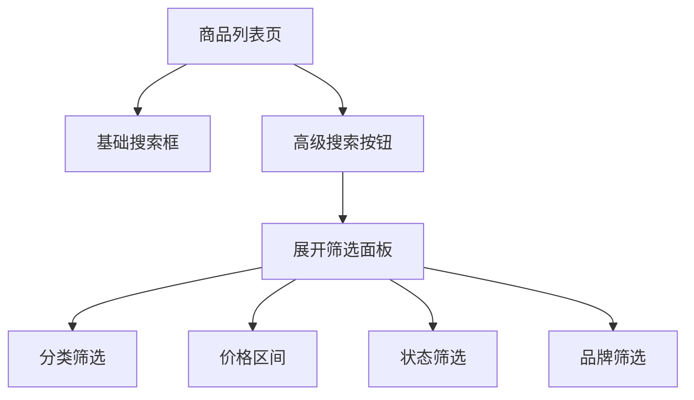

# 商品管理操作指南

## 概述

商品管理是系统的核心功能模块，提供完整的商品生命周期管理，包括商品创建、编辑、发布、下架等操作。本指南将详细介绍商品管理的各项功能和使用方法。

## 商品列表

### 访问商品列表

1. 登录系统后，在左侧菜单中点击"商品管理"
2. 在展开的子菜单中选择"商品列表"

### 列表页面功能

#### 1. 搜索功能

页面顶部提供强大的搜索功能：

- **关键词搜索**: 在搜索框中输入商品名称、SKU、描述等关键词
- **高级搜索**: 点击"高级搜索"展开更多筛选条件



#### 2. 筛选条件

可用的筛选条件包括：

| 筛选项   | 说明                 | 示例                 |
| -------- | -------------------- | -------------------- |
| 商品分类 | 选择特定分类下的商品 | 电子产品 > 手机      |
| 商品状态 | 筛选不同状态的商品   | 已发布、草稿、已下架 |
| 价格区间 | 按价格范围筛选       | 1000-5000元          |
| 创建时间 | 按创建时间筛选       | 最近7天、最近30天    |
| 物料类型 | 按物料类型筛选       | 成品、半成品、原材料 |

#### 3. 排序功能

支持按以下字段排序：

- **创建时间**: 按商品创建时间排序
- **更新时间**: 按最后更新时间排序
- **商品名称**: 按商品名称字母顺序
- **价格**: 按商品价格高低
- **库存**: 按库存数量

#### 4. 视图模式

提供两种列表视图模式：

- **表格视图**: 详细信息表格展示，适合批量操作
- **卡片视图**: 卡片式展示，包含商品图片，适合快速浏览

### 列表操作

#### 单个商品操作

每行商品数据后面提供操作按钮：

| 操作按钮 | 功能                 | 权限要求 |
| -------- | -------------------- | -------- |
| 查看     | 查看商品详细信息     | 查看权限 |
| 编辑     | 编辑商品信息         | 编辑权限 |
| 复制     | 快速复制创建相似商品 | 创建权限 |
| 发布     | 将草稿状态商品发布   | 发布权限 |
| 下架     | 下架已发布商品       | 下架权限 |
| 删除     | 删除商品（需确认）   | 删除权限 |

#### 批量操作

1. **选择商品**: 勾选要操作的商品行
2. **选择操作**: 在顶部批量操作栏中选择操作类型
3. **确认执行**: 根据提示完成操作

支持的批量操作：

- **批量删除**: 一次性删除多个商品
- **批量发布**: 将多个草稿商品同时发布
- **批量下架**: 将多个已发布商品同时下架
- **批量分类**: 将商品移动到指定分类
- **批量调价**: 批量修改商品价格

## 创建商品

### 创建流程

#### 1. 开始创建

在商品列表页面点击右上角的"新增商品"按钮，进入商品创建流程。

#### 2. 分步骤表单

商品创建采用分步骤表单，确保信息完整性和用户体验：


### 步骤详解

#### 步骤一：基础信息

必填字段用红色星号(\*)标记：

- **商品名称**: 商品完整名称，最多100字符
- **商品简称**: 商品短名称，用于列表展示
- **商品描述**: 详细描述商品特点和用途
- **商品分类**: 选择商品所属分类
- **物料类型**: 选择成品、半成品或原材料
- **基础价格**: 设置商品基础销售价格
- **商品条码**: 商品条形码（可选）
- **计量单位**: 销售单位（个、台、件等）
- **品牌**: 商品品牌（可选）

**填写提示**：

- 商品名称建议包含关键词，便于搜索
- 分类选择会影响后续的筛选和统计
- 价格设置后可以根据渠道进行差异化定价

#### 步骤二：内容管理

管理商品的展示内容：

- **内容标题**: 商品展示标题
- **副标题**: 商品副标题或宣传语
- **详细描述**: 富文本编辑器，支持格式化内容
- **商品图片**:
  - 上传商品主图和详情图
  - 支持jpg、png格式，单张不超过5MB
  - 主图建议尺寸800×800像素
  - 可拖拽调整图片顺序
- **商品视频**: 可上传商品介绍视频

**图片上传操作**：

1. 点击"上传图片"按钮
2. 选择本地图片文件
3. 等待上传完成
4. 设置图片alt文本和排序
5. 点击"确定"保存

#### 步骤三：规格属性

设置商品的规格选项：

- **添加规格**: 点击"添加规格"按钮
- **规格名称**: 如"颜色"、"尺寸"、"容量"等
- **规格类型**:
  - 文本输入
  - 数字输入
  - 下拉选择
  - 多选
  - 是/否选择
- **规格值**: 设置具体的规格选项
- **是否必填**: 设置该规格是否为必填项

**规格示例**：

```
规格名称：颜色
规格类型：下拉选择
规格值：红色、蓝色、黑色
是否必填：是
```

#### 步骤四：BOM配方（仅成品）

如果商品类型为成品，需要配置BOM（物料清单）：

- **添加物料**: 点击"添加物料"按钮
- **选择物料**: 从物料库中选择或搜索物料
- **设置用量**: 输入该物料在成品中的使用数量
- **单位成本**: 系统自动计算或手动输入
- **总计成本**: 系统自动计算总成本

**BOM配置示例**：

```
成品：iPhone手机
├── 屏幕：1个 × 2000元 = 2000元
├── 电池：1个 × 500元 = 500元
├── 主板：1个 × 1500元 = 1500元
└── 总成本：4000元
```

#### 步骤五：渠道覆写（可选）

为不同销售渠道设置差异化信息：

- **选择渠道**: 选择要覆写的渠道（小程序、APP、官网等）
- **差异化标题**: 为该渠道设置专门的商品标题
- **差异化描述**: 针对该渠道的商品描述
- **渠道专属图片**: 上传该渠道专用的商品图片
- **渠道属性**: 设置渠道特有的属性信息

#### 步骤六：确认创建

系统会显示所有填写信息的摘要：

1. **信息核对**: 检查所有填写的信息是否正确
2. **必填项检查**: 系统自动检查必填项是否完整
3. **数据验证**: 验证数据格式和逻辑合理性
4. **确认创建**: 点击"确认创建"完成商品创建

### 保存选项

创建时提供多种保存选项：

- **保存草稿**: 保存当前信息，商品状态为草稿
- **直接发布**: 保存并直接发布商品
- **预览**: 预览商品在前端的展示效果

## 编辑商品

### 进入编辑模式

1. 在商品列表中找到要编辑的商品
2. 点击操作列中的"编辑"按钮
3. 进入商品编辑页面

### 编辑功能

编辑页面与创建页面类似，但有以下特点：

- **数据预填充**: 所有字段都已填充现有数据
- **变更追踪**: 系统记录所有修改内容
- **版本控制**: 支持查看历史版本
- **部分更新**: 支持只修改部分字段

### 特殊编辑功能

#### 1. 状态变更

在编辑页面可以快速变更商品状态：

- **草稿 → 已发布**: 发布商品到销售渠道
- **已发布 → 已下架**: 暂时停止销售
- **已下架 → 已发布**: 重新开始销售

#### 2. 规格管理

- **新增规格**: 为商品添加新的规格选项
- **修改规格**: 更新现有规格的名称或值
- **删除规格**: 删除不需要的规格（需要确认）

#### 3. 图片管理

- **替换图片**: 上传新图片替换现有图片
- **调整顺序**: 拖拽调整图片展示顺序
- **批量上传**: 一次上传多张图片

## 商品复制

### 复制功能使用场景

- **创建相似商品**: 快速创建款式相似的商品
- **批量创建**: 基于模板商品批量创建
- **多规格管理**: 为同一商品创建不同规格版本

### 复制操作步骤

1. **选择源商品**: 在列表中选择要复制的商品
2. **点击复制**: 点击操作列中的"复制"按钮
3. **修改信息**: 在弹出的表单中修改必要信息
4. **确认复制**: 点击"确认"完成复制

### 复制时自动继承

以下信息会自动从源商品继承：

- 基础信息（名称、描述等，但需要修改）
- 分类信息
- 规格属性配置
- BOM配方（如果适用）
- 渠道覆写设置

### 需要修改的信息

复制后必须修改以下信息：

- **商品名称**: 不能与源商品完全相同
- **SKU**: 需要生成新的SKU码
- **条码**: 如果有条码需要更新

## 商品导入导出

### 导出商品

#### 批量导出

1. 在商品列表页面设置筛选条件
2. 点击右上角的"导出"按钮
3. 选择导出格式（Excel、CSV）
4. 点击"确认导出"
5. 等待导出完成并下载文件

#### 导出选项

- **导出字段**: 选择要导出的字段
- **导出范围**: 当前页面或全部筛选结果
- **包含图片**: 是否包含图片链接信息

### 导入商品

#### 准备导入文件

1. **下载模板**: 点击"导入"按钮，下载Excel模板
2. **填写数据**: 按照模板格式填写商品信息
3. **数据验证**: 确保数据格式正确，必填项完整

#### 执行导入

1. 在商品列表页面点击"导入"按钮
2. 选择准备好的Excel文件
3. 选择导入选项：
   - **新增模式**: 只创建新商品
   - **更新模式**: 更新现有商品
   - **混合模式**: 新增和更新同时进行
4. 点击"开始导入"
5. 监控导入进度和结果

#### 导入结果处理

导入完成后会显示详细结果：

- **成功数量**: 成功导入的商品数量
- **失败数量**: 导入失败的商品数量
- **错误详情**: 失败原因和行号信息
- **部分成功**: 可以下载失败记录进行修正

### 导入注意事项

1. **数据格式**: 严格按照模板格式填写
2. **必填字段**: 确保必填字段不为空
3. **数据长度**: 注意字段长度限制
4. **编码格式**: 文件保存为UTF-8编码
5. **文件大小**: 单个文件不超过10MB

## 常见问题

### Q1: 为什么商品创建失败？

**可能原因**：

- 必填字段未填写完整
- 商品名称重复
- 分类选择错误
- 图片格式不支持

**解决方法**：

1. 检查所有带红色星号的字段
2. 确认商品名称唯一性
3. 重新选择正确的分类
4. 检查上传图片的格式和大小

### Q2: 如何批量修改商品价格？

**操作步骤**：

1. 在商品列表中勾选要调价的商品
2. 点击"批量操作" > "批量调价"
3. 选择调价方式（按金额或按比例）
4. 输入调价数值
5. 确认执行调价操作

### Q3: 商品导入时出现乱码怎么办？

**解决方法**：

1. 确保Excel文件保存为UTF-8编码
2. 检查特殊字符是否正确
3. 使用系统提供的模板文件
4. 避免使用公式和特殊格式

### Q4: 如何删除不需要的规格？

**操作步骤**：

1. 进入商品编辑页面
2. 切换到"规格属性"步骤
3. 找到要删除的规格
4. 点击规格右侧的删除按钮
5. 确认删除操作

**注意**: 删除规格会影响已有订单数据，请谨慎操作。

### Q5: 商品发布后在哪里可以看到？

**查看位置**：

- **各销售渠道**: 小程序、APP、官网等
- **商品列表**: 状态显示为"已发布"
- **前台页面**: 根据分类和关键词搜索

## 最佳实践

### 1. 商品命名规范

- **简洁明了**: 名称要简洁，突出主要特点
- **包含关键词**: 便于搜索和SEO
- **统一格式**: 同类商品使用统一命名格式
- **避免特殊字符**: 尽量使用中英文、数字、常见符号

### 2. 图片质量要求

- **主图要求**: 800×800像素，白底，商品占70%以上
- **详情图**: 宽度750像素，高度不限
- **文件格式**: JPG、PNG，优先使用JPG
- **文件大小**: 单张图片不超过2MB
- **图片内容**: 清晰、真实、无水印

### 3. 价格策略

- **成本核算**: 准确计算商品成本
- **市场调研**: 参考竞品价格
- **渠道差异**: 不同渠道可设置不同价格
- **促销考虑**: 预留促销空间

### 4. 库存管理

- **安全库存**: 设置合理的安全库存
- **及时更新**: 销售后及时更新库存
- **预警设置**: 设置库存预警提醒
- **定期盘点**: 定期进行库存盘点

通过遵循这些最佳实践，可以有效提高商品管理的效率和质量。
