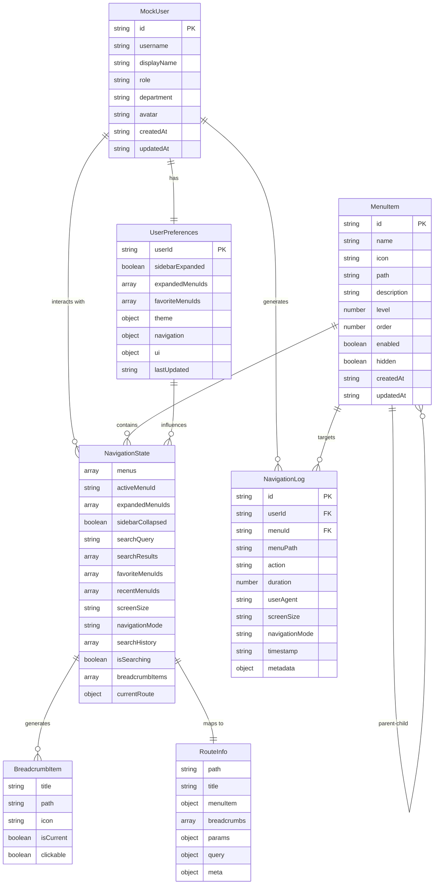

/# Data Model: 影院商品管理中台功能导航系统

**日期**: 2025-12-11
**版本**: 1.0
**来源**: 功能规格规范和澄清要求

## 概述

本文档定义了影院商品管理中台导航系统的核心数据模型，包括Mock用户身份数据、菜单结构、导航状态和用户偏好设置等关键实体。所有数据模型都基于TypeScript严格类型定义，确保类型安全和开发体验。

## 核心实体定义

### 1. Mock用户实体 (MockUser)

**描述**: 简化的单一用户身份数据，用于替代登录系统的用户身份信息

```typescript
interface MockUser {
  /** 用户唯一标识符 */
  id: string;

  /** 用户登录名 */
  username: string;

  /** 用户显示名称 */
  displayName: string;

  /** 用户角色 */
  role: 'admin' | 'operator' | 'manager' | 'viewer';

  /** 所属部门 */
  department: string;

  /** 用户头像URL（可选） */
  avatar?: string;

  /** 创建时间 */
  createdAt: string;

  /** 更新时间 */
  updatedAt: string;
}
```

**默认Mock数据**:
```typescript
const defaultMockUser: MockUser = {
  id: 'user-001',
  username: 'admin',
  displayName: '系统管理员',
  role: 'admin',
  department: '信息部',
  avatar: undefined,
  createdAt: '2025-01-01T00:00:00.000Z',
  updatedAt: '2025-12-11T00:00:00.000Z'
};
```

### 2. 菜单项实体 (MenuItem)

**描述**: 导航系统的基本组成单位，定义菜单的层次结构和属性

```typescript
interface MenuItem {
  /** 菜单唯一标识符 */
  id: string;

  /** 菜单显示名称 */
  name: string;

  /** 菜单图标名称（可选） */
  icon?: string;

  /** 菜单路径（可选） */
  path?: string;

  /** 菜单描述（可选） */
  description?: string;

  /** 子菜单项 */
  children?: MenuItem[];

  /** 菜单层级：1为一级菜单，2为二级菜单 */
  level: number;

  /** 菜单排序 */
  order: number;

  /** 是否启用 */
  enabled: boolean;

  /** 是否隐藏 */
  hidden: boolean;

  /** 创建时间 */
  createdAt: string;

  /** 更新时间 */
  updatedAt: string;
}
```

**菜单枚举定义**:
```typescript
enum MenuLevel {
  PRIMARY = 1,    // 一级菜单
  SECONDARY = 2   // 二级菜单
}

enum UserRole {
  ADMIN = 'admin',
  OPERATOR = 'operator',
  MANAGER = 'manager',
  VIEWER = 'viewer'
}

enum FunctionalArea {
  BASIC_SETTINGS = 'basic_settings',           // 基础设置与主数据
  PRODUCT_MANAGEMENT = 'product_management',   // 商品管理
  INVENTORY = 'inventory',                     // 库存与仓店库存管理
  PRICING = 'pricing',                         // 价格体系管理
  PROCUREMENT = 'procurement',                 // 采购与入库管理
  SCHEDULING = 'scheduling',                   // 档期/排期/资源预约管理
  ORDER_MANAGEMENT = 'order_management',       // 订单与履约管理
  OPERATIONS = 'operations',                   // 运营 & 报表 / 指标看板
  SYSTEM_MANAGEMENT = 'system_management'      // 系统管理 / 设置 /权限
}
```

### 3. 导航状态实体 (NavigationState)

**描述**: 导航系统的运行时状态，包括当前激活菜单、展开状态等

```typescript
interface NavigationState {
  /** 菜单数据列表 */
  menus: MenuItem[];

  /** 当前激活的菜单ID */
  activeMenuId: string | null;

  /** 展开的菜单ID列表 */
  expandedMenuIds: string[];

  /** 侧边栏折叠状态 */
  sidebarCollapsed: boolean;

  /** 搜索查询 */
  searchQuery: string;

  /** 搜索结果 */
  searchResults: MenuItem[];

  /** 收藏的菜单ID列表 */
  favoriteMenuIds: string[];

  /** 最近访问的菜单ID列表 */
  recentMenuIds: string[];

  /** 屏幕尺寸 */
  screenSize: 'mobile' | 'tablet' | 'desktop';

  /** 导航模式 */
  navigationMode: 'drawer' | 'collapsed' | 'expanded';

  /** 搜索历史 */
  searchHistory: string[];

  /** 是否正在搜索 */
  isSearching: boolean;

  /** 面包屑导航项 */
  breadcrumbItems: BreadcrumbItem[];

  /** 当前路由信息 */
  currentRoute: RouteInfo | null;
}
```

### 4. 用户偏好设置实体 (UserPreferences)

**描述**: 用户个性化导航设置，存储在LocalStorage中

```typescript
interface UserPreferences {
  /** 用户ID */
  userId: string;

  /** 侧边栏默认展开状态 */
  sidebarExpanded: boolean;

  /** 默认展开的菜单ID列表 */
  expandedMenuIds: string[];

  /** 收藏的菜单ID列表 */
  favoriteMenuIds: string[];

  /** 主题设置 */
  theme: {
    /** 主题模式 */
    mode: 'light' | 'dark' | 'auto';
    /** 主题颜色 */
    primaryColor: string;
  };

  /** 导航偏好 */
  navigation: {
    /** 面包屑显示 */
    showBreadcrumb: boolean;
    /** 菜单搜索启用 */
    enableSearch: boolean;
    /** 最近访问数量限制 */
    recentItemsLimit: number;
    /** 搜索历史数量限制 */
    searchHistoryLimit: number;
  };

  /** 界面偏好 */
  ui: {
    /** 紧凑模式 */
    compactMode: boolean;
    /** 固定侧边栏 */
    fixedSidebar: boolean;
    /** 动画效果 */
    enableAnimation: boolean;
  };

  /** 最后更新时间 */
  lastUpdated: string;
}
```

**默认用户偏好**:
```typescript
const defaultUserPreferences: UserPreferences = {
  userId: 'user-001',
  sidebarExpanded: true,
  expandedMenuIds: [],
  favoriteMenuIds: [],
  theme: {
    mode: 'light',
    primaryColor: '#1890ff'
  },
  navigation: {
    showBreadcrumb: true,
    enableSearch: true,
    recentItemsLimit: 10,
    searchHistoryLimit: 20
  },
  ui: {
    compactMode: false,
    fixedSidebar: true,
    enableAnimation: true
  },
  lastUpdated: new Date().toISOString()
};
```

### 5. 面包屑项实体 (BreadcrumbItem)

**描述**: 面包屑导航的组成项

```typescript
interface BreadcrumbItem {
  /** 面包屑标题 */
  title: string;

  /** 面包屑路径 */
  path: string;

  /** 面包屑图标名称（可选） */
  icon?: string;

  /** 是否为当前页面 */
  isCurrent: boolean;

  /** 是否可点击 */
  clickable: boolean;
}
```

### 6. 路由信息实体 (RouteInfo)

**描述**: 当前路由的详细信息

```typescript
interface RouteInfo {
  /** 路由路径 */
  path: string;

  /** 路由标题 */
  title: string;

  /** 关联的菜单项 */
  menuItem?: MenuItem;

  /** 面包屑导航 */
  breadcrumbs: BreadcrumbItem[];

  /** 路由参数 */
  params?: Record<string, string>;

  /** 查询参数 */
  query?: Record<string, string>;

  /** 页面元数据 */
  meta?: {
    /** 页面标题 */
    title?: string;
    /** 页面描述 */
    description?: string;
    /** 页面关键字 */
    keywords?: string[];
  };
}
```

### 7. 导航日志实体 (NavigationLog)

**描述**: 用户导航行为记录，用于分析和优化用户体验

```typescript
interface NavigationLog {
  /** 日志唯一标识符 */
  id: string;

  /** 用户ID */
  userId: string;

  /** 菜单ID */
  menuId: string;

  /** 菜单路径 */
  menuPath: string;

  /** 导航动作类型 */
  action: NavigationAction;

  /** 页面停留时间（毫秒） */
  duration?: number;

  /** 用户代理信息 */
  userAgent?: string;

  /** 屏幕尺寸 */
  screenSize: string;

  /** 导航模式 */
  navigationMode: string;

  /** 访问时间戳 */
  timestamp: string;

  /** 额外的元数据 */
  metadata?: Record<string, any>;
}
```

**导航动作枚举**:
```typescript
enum NavigationAction {
  MENU_CLICK = 'menu_click',           // 点击菜单
  BREADCRUMB_CLICK = 'breadcrumb_click', // 点击面包屑
  SEARCH_SELECT = 'search_select',     // 搜索选择
  FAVORITE_CLICK = 'favorite_click',   // 点击收藏
  PAGE_VIEW = 'page_view',             // 页面浏览
  PAGE_EXIT = 'page_exit',             // 页面退出
  SEARCH_QUERY = 'search_query',       // 搜索查询
  MENU_EXPAND = 'menu_expand',         // 展开菜单
  MENU_COLLAPSE = 'menu_collapse'      // 收起菜单
}
```

## 数据关系图



## 数据验证规则

### Mock用户验证

```typescript
const validateMockUser = (user: Partial<MockUser>): boolean => {
  return !!(
    user.id &&
    user.username &&
    user.displayName &&
    ['admin', 'operator', 'manager', 'viewer'].includes(user.role) &&
    user.department &&
    user.createdAt &&
    user.updatedAt
  );
};
```

### 菜单项验证

```typescript
const validateMenuItem = (menu: Partial<MenuItem>): boolean => {
  return !!(
    menu.id &&
    menu.name &&
    typeof menu.level === 'number' &&
    [1, 2].includes(menu.level) &&
    typeof menu.order === 'number' &&
    typeof menu.enabled === 'boolean' &&
    typeof menu.hidden === 'boolean'
  );
};
```

### 菜单结构验证

```typescript
const validateMenuStructure = (menus: MenuItem[]): boolean => {
  const validateLevel = (items: MenuItem[], expectedLevel: number): boolean => {
    return items.every(item => {
      if (item.level !== expectedLevel) return false;

      if (item.children) {
        // 二级菜单不能有子菜单
        if (expectedLevel === 2) return false;
        return validateLevel(item.children, expectedLevel + 1);
      }

      return true;
    });
  };

  return validateLevel(menus, 1);
};
```

### 用户偏好验证

```typescript
const validateUserPreferences = (preferences: Partial<UserPreferences>): boolean => {
  return !!(
    preferences.userId &&
    typeof preferences.sidebarExpanded === 'boolean' &&
    Array.isArray(preferences.expandedMenuIds) &&
    Array.isArray(preferences.favoriteMenuIds) &&
    preferences.theme &&
    ['light', 'dark', 'auto'].includes(preferences.theme.mode) &&
    preferences.navigation &&
    typeof preferences.navigation.showBreadcrumb === 'boolean' &&
    typeof preferences.navigation.enableSearch === 'boolean' &&
    preferences.ui &&
    typeof preferences.ui.compactMode === 'boolean' &&
    preferences.lastUpdated
  );
};
```

## 数据迁移和版本控制

### LocalStorage数据版本

```typescript
interface LocalStorageVersion {
  version: string;
  migrationDate: string;
}

interface StorageData {
  version: LocalStorageVersion;
  userPreferences: UserPreferences;
  navigationState: Partial<NavigationState>;
  searchHistory: string[];
  favoriteMenus: string[];
}
```

### 数据迁移函数

```typescript
const migrateLocalStorageData = (): void => {
  const storageKey = 'cinema-navigation-preferences';
  const currentData = localStorage.getItem(storageKey);

  if (!currentData) {
    // 初始化默认数据
    const initialData: StorageData = {
      version: { version: '1.0', migrationDate: new Date().toISOString() },
      userPreferences: defaultUserPreferences,
      navigationState: {},
      searchHistory: [],
      favoriteMenus: []
    };
    localStorage.setItem(storageKey, JSON.stringify(initialData));
    return;
  }

  try {
    const parsedData: StorageData = JSON.parse(currentData);

    // 检查版本并进行迁移
    if (!parsedData.version || parsedData.version.version !== '1.0') {
      // 执行迁移逻辑
      const migratedData = {
        ...parsedData,
        version: { version: '1.0', migrationDate: new Date().toISOString() },
        userPreferences: { ...defaultUserPreferences, ...parsedData.userPreferences },
        searchHistory: parsedData.searchHistory || [],
        favoriteMenus: parsedData.favoriteMenus || []
      };
      localStorage.setItem(storageKey, JSON.stringify(migratedData));
    }
  } catch (error) {
    console.error('Failed to migrate localStorage data:', error);
    // 重置为默认数据
    localStorage.removeItem(storageKey);
    migrateLocalStorageData();
  }
};
```

## Mock数据示例

### 完整菜单结构示例

```typescript
const mockMenuData: MenuItem[] = [
  {
    id: 'menu-001',
    name: '基础设置与主数据',
    icon: 'SettingOutlined',
    level: 1,
    order: 1,
    enabled: true,
    hidden: false,
    createdAt: '2025-01-01T00:00:00.000Z',
    updatedAt: '2025-12-11T00:00:00.000Z',
    children: [
      {
        id: 'menu-001-001',
        name: '组织/门店/仓库管理',
        path: '/settings/organization',
        level: 2,
        order: 1,
        enabled: true,
        hidden: false,
        createdAt: '2025-01-01T00:00:00.000Z',
        updatedAt: '2025-12-11T00:00:00.000Z'
      },
      {
        id: 'menu-001-002',
        name: '单位 & 换算规则管理',
        path: '/settings/unit',
        level: 2,
        order: 2,
        enabled: true,
        hidden: false,
        createdAt: '2025-01-01T00:00:00.000Z',
        updatedAt: '2025-12-11T00:00:00.000Z'
      },
      {
        id: 'menu-001-003',
        name: '字典与规则配置',
        path: '/settings/dictionary',
        level: 2,
        order: 3,
        enabled: true,
        hidden: false,
        createdAt: '2025-01-01T00:00:00.000Z',
        updatedAt: '2025-12-11T00:00:00.000Z'
      },
      {
        id: 'menu-001-004',
        name: '角色与权限管理',
        path: '/settings/role',
        level: 2,
        order: 4,
        enabled: true,
        hidden: false,
        createdAt: '2025-01-01T00:00:00.000Z',
        updatedAt: '2025-12-11T00:00:00.000Z'
      },
      {
        id: 'menu-001-005',
        name: '审批流配置',
        path: '/settings/approval',
        level: 2,
        order: 5,
        enabled: true,
        hidden: false,
        createdAt: '2025-01-01T00:00:00.000Z',
        updatedAt: '2025-12-11T00:00:00.000Z'
      }
    ]
  },
  {
    id: 'menu-002',
    name: '商品管理 (MDM / PIM)',
    icon: 'ShopOutlined',
    level: 1,
    order: 2,
    enabled: true,
    hidden: false,
    createdAt: '2025-01-01T00:00:00.000Z',
    updatedAt: '2025-12-11T00:00:00.000Z',
    children: [
      {
        id: 'menu-002-001',
        name: 'SPU 管理',
        path: '/product/spu',
        level: 2,
        order: 1,
        enabled: true,
        hidden: false,
        createdAt: '2025-01-01T00:00:00.000Z',
        updatedAt: '2025-12-11T00:00:00.000Z'
      },
      {
        id: 'menu-002-002',
        name: 'SKU 管理',
        path: '/product/sku',
        level: 2,
        order: 2,
        enabled: true,
        hidden: false,
        createdAt: '2025-01-01T00:00:00.000Z',
        updatedAt: '2025-12-11T00:00:00.000Z'
      },
      {
        id: 'menu-002-003',
        name: '属性/规格/条码/单位设置',
        path: '/product/attributes',
        level: 2,
        order: 3,
        enabled: true,
        hidden: false,
        createdAt: '2025-01-01T00:00:00.000Z',
        updatedAt: '2025-12-11T00:00:00.000Z'
      },
      {
        id: 'menu-002-004',
        name: '商品状态/上下架管理',
        path: '/product/status',
        level: 2,
        order: 4,
        enabled: true,
        hidden: false,
        createdAt: '2025-01-01T00:00:00.000Z',
        updatedAt: '2025-12-11T00:00:00.000Z'
      },
      {
        id: 'menu-002-005',
        name: '内容编辑',
        path: '/product/content',
        level: 2,
        order: 5,
        enabled: true,
        hidden: false,
        createdAt: '2025-01-01T00:00:00.000Z',
        updatedAt: '2025-12-11T00:00:00.000Z'
      },
      {
        id: 'menu-002-006',
        name: '素材库管理',
        path: '/product/media',
        level: 2,
        order: 6,
        enabled: true,
        hidden: false,
        createdAt: '2025-01-01T00:00:00.000Z',
        updatedAt: '2025-12-11T00:00:00.000Z'
      },
      {
        id: 'menu-002-007',
        name: '渠道映射字段管理',
        path: '/product/channel-mapping',
        level: 2,
        order: 7,
        enabled: true,
        hidden: false,
        createdAt: '2025-01-01T00:00:00.000Z',
        updatedAt: '2025-12-11T00:00:00.000Z'
      },
      {
        id: 'menu-002-008',
        name: '内容发布/审核/历史版本管理',
        path: '/product/publish',
        level: 2,
        order: 8,
        enabled: true,
        hidden: false,
        createdAt: '2025-01-01T00:00:00.000Z',
        updatedAt: '2025-12-11T00:00:00.000Z'
      }
    ]
  }
  // ... 更多一级菜单
];
```

## API响应格式

### 标准响应格式

```typescript
interface ApiResponse<T> {
  success: boolean;
  data: T;
  message: string;
  code?: number;
}
```

### Mock API响应示例

```typescript
// 获取菜单数据
const menuResponse: ApiResponse<MenuItem[]> = {
  success: true,
  data: mockMenuData,
  message: '获取菜单数据成功'
};

// 获取用户信息
const userResponse: ApiResponse<MockUser> = {
  success: true,
  data: defaultMockUser,
  message: '获取用户信息成功'
};

// 获取用户偏好
const preferencesResponse: ApiResponse<UserPreferences> = {
  success: true,
  data: defaultUserPreferences,
  message: '获取用户偏好成功'
};
```

## 错误处理

### 错误类型定义

```typescript
enum NavigationErrorType {
  USER_DATA_ERROR = 'USER_DATA_ERROR',
  MENU_DATA_ERROR = 'MENU_DATA_ERROR',
  STORAGE_ERROR = 'STORAGE_ERROR',
  ROUTE_ERROR = 'ROUTE_ERROR',
  VALIDATION_ERROR = 'VALIDATION_ERROR',
  NETWORK_ERROR = 'NETWORK_ERROR'
}

interface NavigationError {
  type: NavigationErrorType;
  message: string;
  code?: string;
  details?: any;
  timestamp?: string;
}
```

### 错误处理策略

```typescript
const handleNavigationError = (error: NavigationError): void => {
  console.error(`Navigation Error [${error.type}]:`, error.message);

  switch (error.type) {
    case NavigationErrorType.USER_DATA_ERROR:
      // 使用默认用户数据
      console.warn('使用默认Mock用户数据');
      break;
    case NavigationErrorType.MENU_DATA_ERROR:
      // 使用默认菜单结构
      console.warn('使用默认菜单数据结构');
      break;
    case NavigationErrorType.STORAGE_ERROR:
      // 重置用户偏好为默认值
      console.warn('重置用户偏好为默认值');
      break;
    case NavigationErrorType.ROUTE_ERROR:
      // 重定向到首页
      console.warn('重定向到首页');
      break;
    case NavigationErrorType.VALIDATION_ERROR:
      // 显示验证错误信息
      console.warn('数据验证错误:', error.details);
      break;
    case NavigationErrorType.NETWORK_ERROR:
      // 显示网络错误提示
      console.warn('网络连接错误，使用缓存数据');
      break;
  }
};
```

## 边缘情况处理

### LocalStorage边缘情况

```typescript
const handleLocalStorageEdgeCases = (): void => {
  try {
    // 检查LocalStorage可用性
    const testKey = 'test-local-storage';
    localStorage.setItem(testKey, 'test');
    localStorage.removeItem(testKey);
  } catch (error) {
    console.error('LocalStorage不可用，使用内存存储替代');
    // 使用内存存储替代方案
  }

  // 检查存储空间
  const storageData = localStorage.getItem('cinema-navigation-preferences');
  if (storageData && storageData.length > 4 * 1024 * 1024) { // 4MB限制
    console.warn('LocalStorage存储空间不足，清理旧数据');
    localStorage.removeItem('cinema-navigation-preferences');
  }
};
```

### Mock数据加载失败处理

```typescript
const handleMockDataLoadFailure = <T>(defaultData: T, dataType: string): T => {
  console.warn(`${dataType}数据加载失败，使用默认数据`);

  // 记录导航日志
  const errorLog: NavigationLog = {
    id: generateId(),
    userId: defaultMockUser.id,
    menuId: 'system',
    menuPath: '/system',
    action: NavigationAction.PAGE_VIEW,
    duration: 0,
    userAgent: navigator.userAgent,
    screenSize: 'unknown',
    navigationMode: 'unknown',
    timestamp: new Date().toISOString(),
    metadata: {
      error: `${dataType}数据加载失败`,
      fallback: '使用默认数据'
    }
  };

  // 存储错误日志（如果可能）
  try {
    const logs = JSON.parse(localStorage.getItem('navigation-logs') || '[]');
    logs.push(errorLog);
    localStorage.setItem('navigation-logs', JSON.stringify(logs));
  } catch (e) {
    console.warn('无法存储错误日志');
  }

  return defaultData;
};
```

## 总结

本数据模型文档定义了影院商品管理中台导航系统的核心数据结构，包括Mock用户身份数据、菜单层次结构、导航状态管理和用户偏好设置等。所有数据模型都基于TypeScript严格类型定义，确保类型安全和开发体验。

**关键特性**:
- 完整的TypeScript类型定义
- 基于用户澄清要求的Mock用户数据设计
- LocalStorage用户偏好持久化
- 数据验证和迁移机制
- 错误处理和边界情况管理
- 标准化的API响应格式
- 导航行为日志记录

该数据模型为导航系统的实现提供了清晰的数据架构指导，确保系统的可维护性和扩展性，同时符合取消登录页面和使用Mock数据的用户要求。