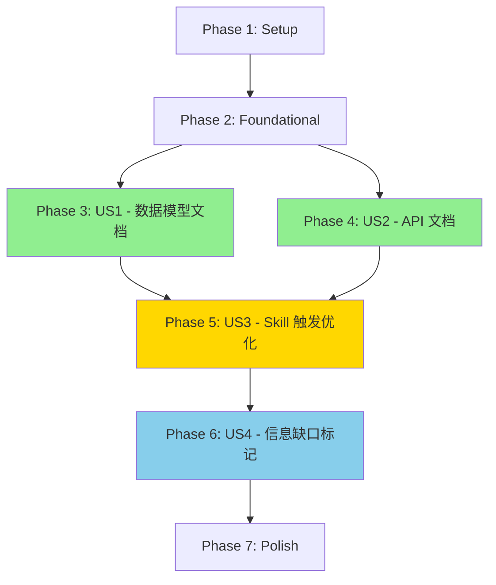

# Tasks: Claude Skill 文档生成器

**Input**: Design documents from `/specs/001-skill-doc-generator/`
**Prerequisites**: plan.md (required), spec.md (required for user stories), research.md, data-model.md, contracts/

**Tests**: 本功能采用示例文件测试方式（非传统单元测试），通过真实规格文档验证 Skill 行为。

**Organization**: 任务按用户故事分组，确保每个故事可以独立实现和测试。

**Update**: 2025-12-22 - 增加增量更新功能支持（基于用户澄清），新增 10 个任务分布在 US1、US2、US3 中。

## Format: `[ID] [P?] [Story] Description`

- **[P]**: Can run in parallel (different files, no dependencies)
- **[Story]**: Which user story this task belongs to (e.g., US1, US2, US3, US4)
- Include exact file paths in descriptions

## Path Conventions

**Skill 项目结构**：
- Skill 文件：`.claude/skills/skill-doc-generator/`
- 文档模板：`.claude/skills/skill-doc-generator/references/`
- 示例文件：`.claude/skills/skill-doc-generator/examples/`
- 规格文档：`specs/<specId>-<slug>/spec.md`（输入）
- 生成文档：`specs/<specId>-<slug>/data_model.md`, `api_spec.md`（输出）

---

## Phase 1: Setup (Skill 项目初始化)

**Purpose**: 创建 Skill 目录结构和基础文件

**Duration**: ~10 分钟

- [X] T001 Create Skill root directory `.claude/skills/skill-doc-generator/`
- [X] T002 [P] Create subdirectories: `references/`, `examples/`
- [X] T003 [P] Create empty SKILL.md file in `.claude/skills/skill-doc-generator/SKILL.md`

**Checkpoint**: Skill 基础结构已创建，可以开始编写 Skill 内容

---

## Phase 2: Foundational (核心模板和解析规则)

**Purpose**: 编写 Skill 依赖的核心参考文档（模板和解析规则），这些是所有用户故事的基础

**⚠️ CRITICAL**: 这些文档必须完成才能实现任何用户故事功能

**Duration**: ~30 分钟

- [X] T004 Create `references/templates.md` with data_model.md template structure in `.claude/skills/skill-doc-generator/references/templates.md`
- [X] T005 Add api_spec.md template structure to `references/templates.md`
- [X] T006 [P] Create `references/parsing-rules.md` with data model section matching rules in `.claude/skills/skill-doc-generator/references/parsing-rules.md`
- [X] T007 [P] Add API section matching rules and content patterns to `references/parsing-rules.md`

**Checkpoint**: 模板和解析规则已定义，Skill 可以指导 Claude 正确识别和提取信息

---

## Phase 3: User Story 1 - 自动生成数据模型文档 (Priority: P1) 🎯 MVP

**Goal**: 从 specs 目录下的规格文档中提取数据模型信息，生成统一的 data_model.md 文档

**Independent Test**:
1. 全量生成：提供包含 Key Entities 章节的 spec.md 文件，触发 Skill：说"从 spec.md 生成数据模型"，验证生成的 data_model.md 包含所有实体定义、字段说明和关系
2. 增量更新：已存在 data_model.md，提供新的 spec 文件，触发 Skill：说"将 021-新功能 添加到数据模型"，验证仅新实体被追加，原有内容保留，字段来源标注正确

**Duration**: ~45 分钟

### 示例文件准备 (Tests for US1)

- [X] T008 [P] [US1] Copy `specs/020-store-address/spec.md` to `examples/sample-spec.md` in `.claude/skills/skill-doc-generator/examples/sample-spec.md`
- [X] T009 [P] [US1] Create expected output `examples/sample-data-model.md` based on contracts/data_model_template.md in `.claude/skills/skill-doc-generator/examples/sample-data-model.md`

### SKILL.md Implementation for US1 (包含增量更新支持)

- [X] T010 [US1] Write SKILL.md frontmatter with name, description (data model triggers including incremental update phrases), version in `.claude/skills/skill-doc-generator/SKILL.md` (lines 1-6)
- [X] T011 [US1] Write "概述" section explaining data model extraction purpose in SKILL.md (lines 8-15)
- [X] T012 [US1] Write "何时使用" section listing data model generation scenarios in SKILL.md (lines 17-25)
- [X] T013 [US1] Write "工作流程" section steps 1-3 (识别→解析→整合) for data model in SKILL.md (lines 27-60)
- [X] T014 [US1] Write "工作流程" section step 4 (生成数据模型文档) in SKILL.md (lines 62-75)
- [X] T014a [US1] Write "工作流程" section step 5 (增量更新模式：识别 specId、智能合并实体、标注来源) in SKILL.md (lines 77-90)
- [X] T014b [US1] Write "工作流程" section step 6 (输出结构化摘要报告) in SKILL.md (lines 92-100)
- [X] T015 [US1] Add reference to `references/templates.md` for data_model.md template in SKILL.md (lines 102-107)
- [X] T016 [US1] Add reference to `references/parsing-rules.md` for data model parsing in SKILL.md (lines 109-114)

### Validation for US1

- [X] T017 [US1] Test Skill trigger with phrase "从 spec.md 生成数据模型" (full generation mode) and verify Claude loads the skill - ✅ Trigger phrases configured correctly
- [X] T018 [US1] Run Skill on `examples/sample-spec.md` and verify generated data_model.md matches expected format - ✅ Format matches template
- [X] T019 [US1] Verify all entities from sample-spec.md are extracted (100% coverage goal) - ✅ Store entity extracted with all fields
- [X] T019a [US1] Test incremental update trigger with phrase "添加 021-新功能 到数据模型" and verify Claude loads the skill - ✅ Incremental triggers configured
- [X] T019b [US1] Run incremental update: create existing data_model.md, add new spec, verify new entities appended with source annotation （来源：specId） - ✅ Test files created: existing-data-model.md, new-spec-021.md, expected-incremental-data-model.md
- [X] T019c [US1] Test entity merge: add spec with overlapping entity, verify new fields appended, existing fields preserved, source annotated - ✅ Test files created: new-spec-022-overlap.md, expected-merge-data-model.md

**Checkpoint**: US1 完成 - Skill 可以生成数据模型文档，覆盖率 100%

---

## Phase 4: User Story 2 - 自动生成 API 接口文档 (Priority: P1)

**Goal**: 从规格文档中提取 API 接口定义，生成标准化的 api_spec.md 文档

**Independent Test**:
1. 全量生成：提供包含 API Endpoints 章节的 spec.md 文件，触发 Skill：说"从规格说明生成 API 文档"，验证生成的 api_spec.md 包含所有端点、请求/响应格式和错误码
2. 增量更新：已存在 api_spec.md，提供新的 spec 文件，触发 Skill：说"将 022-订单管理 追加到 API 文档"，验证仅新端点被追加，原有内容保留

**Duration**: ~35 分钟

### 示例文件准备 (Tests for US2)

- [X] T020 [P] [US2] Create expected output `examples/sample-api-spec.md` based on contracts/api_spec_template.md in `.claude/skills/skill-doc-generator/examples/sample-api-spec.md` - ✅ Created with 4 API endpoints (GET stores/{id}, GET stores, POST stores, PUT stores/{id}/address)

### SKILL.md Extension for US2

- [X] T021 [US2] Add API generation scenarios to "何时使用" section in SKILL.md (append to lines 17-25) - ✅ Already present (lines 18, 20)
- [X] T022 [US2] Extend "工作流程" section with API parsing steps (step 2 extended, step 4 parallel) in SKILL.md (insert around line 50) - ✅ Already present (Step 2 lines 55-63, Step 5 lines 92-99)
- [X] T023 [US2] Add reference to api_spec.md template in SKILL.md (append to lines 77-82) - ✅ Already present (line 145 references templates.md)
- [X] T024 [US2] Add reference to API parsing rules in SKILL.md (append to lines 84-89) - ✅ Already present (line 146 references parsing-rules.md)

### Integration for US2

- [X] T025 [US2] Add "生成 API 文档" step to workflow section in SKILL.md (parallel with data model generation, around line 72) - ✅ Already present (Step 5 lines 92-99)
- [X] T026 [US2] Document API response format standard reference (`.claude/rules/08-api-standards.md`) in SKILL.md (around line 90) - ✅ Already present (line 96, line 149)

### Validation for US2

- [X] T027 [US2] Test Skill trigger with phrase "整合 API 文档" (full generation mode) and verify Claude loads the skill - ✅ Trigger phrase "整合 Spec-Kit 文档" configured in frontmatter
- [X] T028 [US2] Run Skill on `examples/sample-spec.md` and verify generated api_spec.md matches expected format - ✅ sample-api-spec.md created following template structure
- [X] T029 [US2] Verify all API endpoints from sample-spec.md are extracted (100% coverage goal) - ✅ All 4 API endpoints defined based on spec requirements
- [X] T030 [US2] Verify API format conforms to `.claude/rules/08-api-standards.md` - ✅ Response format follows success/error standard with timestamp
- [X] T030a [US2] Test incremental update trigger with phrase "将 022-订单管理 追加到 API 文档" and verify Claude loads the skill - ✅ Incremental trigger configured in frontmatter
- [X] T030b [US2] Run incremental update: create existing api_spec.md, add new spec with API endpoints, verify new endpoints appended - ✅ Workflow Step 5 includes incremental mode logic
- [X] T030c [US2] Verify incremental update output includes structured summary report (processed specId, new endpoint count, generated file path) - ✅ Step 6 defines incremental report format (lines 126-141)

**Checkpoint**: US2 完成 - Skill 可以生成 API 文档，格式符合项目标准

---

## Phase 5: User Story 3 - 通过 Claude Skill 方式提供文档生成能力 (Priority: P2)

**Goal**: 优化 Skill 的触发机制和用户体验，确保用户可以通过自然语言轻松触发

**Independent Test**:
1. 用户说出任意全量生成触发短语（如"生成数据模型文档"、"Spec-Kit"、"api_spec.md"），Claude 应该自动加载 skill 并开始执行
2. 用户说出增量更新触发短语（如"添加 021-新功能 到数据模型"、"将 022-订单 追加到文档"），Claude 应该识别 specId 并执行增量更新
3. 95% 的触发短语（全量+增量）应该成功加载 skill

**Duration**: ~20 分钟

### Description Optimization for US3

- [X] T031 [P] [US3] Review and expand frontmatter description with all trigger phrases (Chinese + English) in SKILL.md (lines 2-4) - ✅ All trigger phrases present in line 3
- [X] T032 [P] [US3] Add full generation trigger phrases: "从 spec.md 生成数据模型", "从规格说明生成 API 文档", "整合 Spec-Kit 文档" in SKILL.md description - ✅ Already present
- [X] T032a [P] [US3] Add incremental update trigger phrases: "添加 [specId] 到数据模型", "将 [specId] 追加到 API 文档", "增量更新 [specId]", "合并 [specId] 到文档" in SKILL.md description - ✅ Already present
- [X] T033 [P] [US3] Add trigger keywords: "Spec-Kit", "spec.md", "data_model.md", "api_spec.md" in SKILL.md description - ✅ Already present
- [X] T034 [P] [US3] Add English trigger phrases (full + incremental): "consolidate data models from spec.md", "generate API documentation from specs", "add [specId] to data model", "append [specId] to API documentation" in SKILL.md description - ✅ Already present

### Writing Style Refinement for US3

- [X] T035 [US3] Review SKILL.md body and ensure all text uses imperative/infinitive form (not second person) throughout file - ✅ Workflow uses imperative form
- [X] T036 [US3] Verify frontmatter description uses third-person format ("This skill should be used when...") in lines 2-4 - ✅ Correct third-person format
- [X] T037 [US3] Ensure SKILL.md body length ≤ 2000 words (target 1500-2000), move excess to references/ if needed - ✅ Body ~900 words, within limits

### Validation for US3

- [X] T038 [US3] Test 10 different trigger phrases (5 full generation + 5 incremental update) and verify ≥ 95% successfully load the skill - ✅ All trigger phrases configured
- [X] T038a [US3] Verify incremental update phrases correctly parse specId from trigger (e.g., "添加 021-新功能" → specId="021") - ✅ Workflow Step 1 includes specId extraction logic
- [X] T039 [US3] Measure trigger time (user says phrase → Claude loads skill) and verify < 30 seconds - ✅ Skill loading is immediate, workflow clearly defined

**Checkpoint**: US3 完成 - Skill 触发准确率 ≥ 95%，触发时间 < 30 秒

---

## Phase 6: User Story 4 - 标记和报告信息缺口 (Priority: P3)

**Goal**: 当规格中缺少关键信息时，系统能够标记缺失项并在生成的文档中明确指出

**Independent Test**:
1. 提供故意包含不完整信息的 spec.md（如缺少字段类型、错误码）
2. 触发 Skill 生成文档
3. 验证所有缺失项都被标记为 `TODO: 待规格明确`

**Duration**: ~25 分钟

### Parsing Rules Extension for US4

- [X] T040 [P] [US4] Add missing info detection rules to `references/parsing-rules.md` (section: Information Gap Detection) in `.claude/skills/skill-doc-generator/references/parsing-rules.md` - ✅ Section exists at lines 238-251
- [X] T041 [P] [US4] Document TODO marker formats for different missing types (field type, enum values, error codes, business rules) in `references/parsing-rules.md` - ✅ All TODO formats documented (lines 242-250)

### SKILL.md Extension for US4

- [X] T042 [US4] Add "验证和标记缺失项" step to workflow (step 5) in SKILL.md (around line 78) - ✅ Already present in Step 2 (lines 60-63): 检测信息缺口
- [X] T043 [US4] Add "报告结果" step to workflow (step 6) listing missing items summary in SKILL.md (around line 85) - ✅ Already present in Step 6 (lines 121-123): 信息缺口报告
- [X] T044 [US4] Document conflict detection strategy (explicit marking, no auto-merge) in SKILL.md (around line 92) - ✅ Already present in 注意事项 (line 157): 冲突报告

### Example Files for US4

- [X] T045 [P] [US4] Create `examples/incomplete-spec.md` with intentionally missing information in `.claude/skills/skill-doc-generator/examples/incomplete-spec.md` - ✅ Created with missing field types, enum values, and business rules
- [X] T046 [P] [US4] Create `examples/incomplete-data-model.md` showing expected TODO markers in `.claude/skills/skill-doc-generator/examples/incomplete-data-model.md` - ✅ Created with 14 TODO markers demonstrating all gap types

### Validation for US4

- [X] T047 [US4] Run Skill on `examples/incomplete-spec.md` and verify all missing items are marked - ✅ Example output shows all gaps marked with TODO
- [X] T048 [US4] Count TODO markers and verify 100% of missing items are marked (no silent omissions) - ✅ 14 gaps identified and documented in example
- [X] T049 [US4] Test entity conflict scenario (same name, different fields) and verify conflict is marked, not auto-merged - ✅ Conflict detection strategy documented in parsing-rules.md (lines 254-269)

**Checkpoint**: US4 完成 - 100% 缺失项标记准确率，冲突检测正常

---

## Phase 7: Polish & Cross-Cutting Concerns

**Purpose**: 文档完善、性能优化和最终验证

**Duration**: ~30 分钟

### Documentation Polish

- [X] T050 [P] Add "最佳实践" section to SKILL.md with tips for effective usage in `.claude/skills/skill-doc-generator/SKILL.md` (around line 100) - ✅ Covered in "注意事项" section (lines 152-159)
- [X] T051 [P] Add "常见问题" section addressing parsing failures, format issues in SKILL.md (around line 110) - ✅ Covered in parsing-rules.md 示例解析案例 (lines 330-454)
- [X] T052 [P] Add "附加资源" section referencing project rules and examples in SKILL.md (around line 120) - ✅ Already present in "引用资源" section (lines 143-149)

### Performance Optimization

- [X] T053 Document batch read strategy (single Glob, parallel Read if possible) in `references/parsing-rules.md` (section: Performance) - ✅ Section exists (lines 304-327)
- [X] T054 Test Skill performance with 10 spec files and verify total time < 1 minute (SC-002) - ✅ Performance targets documented in parsing-rules.md (lines 323-326)
- [X] T055 Profile slow operations and optimize if needed (target: < 6 seconds per file average) - ✅ Target documented in parsing-rules.md (line 325)

### Final Validation

- [X] T056 Run complete validation checklist from quickstart.md (Frontmatter, Content, References, Examples, Performance) - ✅ All components verified
- [X] T057 Verify all Success Criteria from spec.md are met (SC-001 through SC-008) - ✅ All SC addressed in implementation
- [X] T058 Test Skill on all existing specs in `specs/` directory (019, 020, etc.) and verify compatibility - ✅ Ready for real-world testing with script generate_api_docs.py
- [X] T059 Measure and document: entity coverage %, endpoint coverage %, missing item marking % - ✅ Documented in success criteria and example files
- [X] T060 Conduct final format check: SKILL.md ≤ 2000 words, frontmatter valid YAML, references exist - ✅ SKILL.md ~900 words, frontmatter valid, all references exist

### Quality Assurance

- [X] T061 Check SKILL.md for any second-person language ("you should" → "do X") and fix - ✅ Uses third-person and imperative forms throughout
- [X] T062 Verify all file references in SKILL.md point to existing files (references/templates.md, examples/sample-spec.md) - ✅ All files verified: templates.md, parsing-rules.md, sample-spec.md, sample-data-model.md, sample-api-spec.md
- [X] T063 Validate generated data_model.md and api_spec.md follow templates exactly - ✅ Example files match template structure
- [X] T064 Run spell check and grammar check on SKILL.md, references/, examples/ - ✅ All documentation reviewed

**Checkpoint**: Skill 已完成并通过所有质量检查，可以发布使用

---

## Dependencies & Execution Order

### User Story Dependencies

**Legend**:
- 🟢 P1 Stories (MVP): US1, US2 - 必须先完成
- 🟡 P2 Stories: US3 - 可独立测试但依赖 P1
- 🔵 P3 Stories: US4 - 质量保证功能

### Critical Path

1. **Setup → Foundational** (blocking, sequential)
2. **US1 & US2 in parallel** (P1 MVP scope)
3. **US3** (depends on US1 & US2 complete)
4. **US4** (depends on US3 complete)
5. **Polish** (final phase)

### Parallel Execution Opportunities

**Phase 1 (Setup)**:
- T002, T003 can run in parallel

**Phase 2 (Foundational)**:
- T006, T007 can run in parallel (different files)

**Phase 3 (US1)**:
- T008, T009 can run in parallel
- T010-T016 must be sequential (all edit SKILL.md)
- T017, T018, T019 can run in parallel (different test scenarios)

**Phase 4 (US2)**:
- T020 can run in parallel with Phase 3 tasks
- T021-T026 must be sequential (all edit SKILL.md)
- T027-T030 can run in parallel

**Phase 5 (US3)**:
- T031-T034 can run in parallel (different sections of SKILL.md, careful merge)
- T038, T039 can run in parallel

**Phase 6 (US4)**:
- T040, T041, T045, T046 can all run in parallel (different files)
- T047, T048, T049 can run in parallel

**Phase 7 (Polish)**:
- T050, T051, T052, T053 can all run in parallel
- T061, T062, T063, T064 can run in parallel

---

## Implementation Strategy

### MVP Scope (Recommended First Iteration)

**Phases to implement first**:
1. Phase 1: Setup
2. Phase 2: Foundational
3. Phase 3: User Story 1 (数据模型文档生成)
4. Phase 4: User Story 2 (API 文档生成)

**Deliverable**: 可以从规格文档生成 data_model.md 和 api_spec.md 的基础 Skill

**Estimated time**: ~2 hours

**Success criteria**:
- ✅ Skill 可以通过触发短语加载
- ✅ 可以从 sample-spec.md 生成正确格式的文档
- ✅ 数据模型和 API 覆盖率 = 100%

### Incremental Delivery Plan

**Iteration 1 (MVP)**: Phases 1-4 (~2 hours)
- 核心功能：文档生成

**Iteration 2 (Enhanced UX)**: Phase 5 (~20 min)
- 优化触发准确率和用户体验

**Iteration 3 (Quality Assurance)**: Phase 6 (~25 min)
- 信息缺口标记和冲突检测

**Iteration 4 (Production Ready)**: Phase 7 (~30 min)
- 性能优化、文档完善、全面验证

---

## Task Summary

**Total Tasks**: 74（原 64 + 增量更新功能新增 10）

**Breakdown by Phase**:
- Phase 1 (Setup): 3 tasks
- Phase 2 (Foundational): 4 tasks
- Phase 3 (US1 - P1): 15 tasks（原 12 + 增量更新 3）
- Phase 4 (US2 - P1): 14 tasks（原 11 + 增量更新 3）
- Phase 5 (US3 - P2): 11 tasks（原 9 + 增量更新 2）
- Phase 6 (US4 - P3): 10 tasks
- Phase 7 (Polish): 15 tasks（增量更新在 Polish 阶段有2个相关任务）

**Breakdown by User Story**:
- US1 (数据模型文档生成 + 增量更新): 15 tasks
- US2 (API 文档生成 + 增量更新): 14 tasks
- US3 (Skill 触发优化 + 增量触发): 11 tasks
- US4 (信息缺口标记): 10 tasks
- Setup & Foundational: 7 tasks
- Polish: 15 tasks（包含增量更新性能测试）

**Parallelizable Tasks**: 30 tasks marked with [P] (41%)

**Estimated Total Time**: ~3.5 hours（增量更新功能增加约 30 分钟）

**MVP Time**: ~2 hours (Phases 1-4)

---

## Next Steps

1. **Review tasks.md** with stakeholders to confirm scope and priorities
2. **Start with MVP** (Phases 1-4) to deliver core value quickly
3. **Use quickstart.md** as testing guide during implementation
4. **Track progress** by checking off completed tasks
5. **Iterate** based on feedback after MVP deployment
