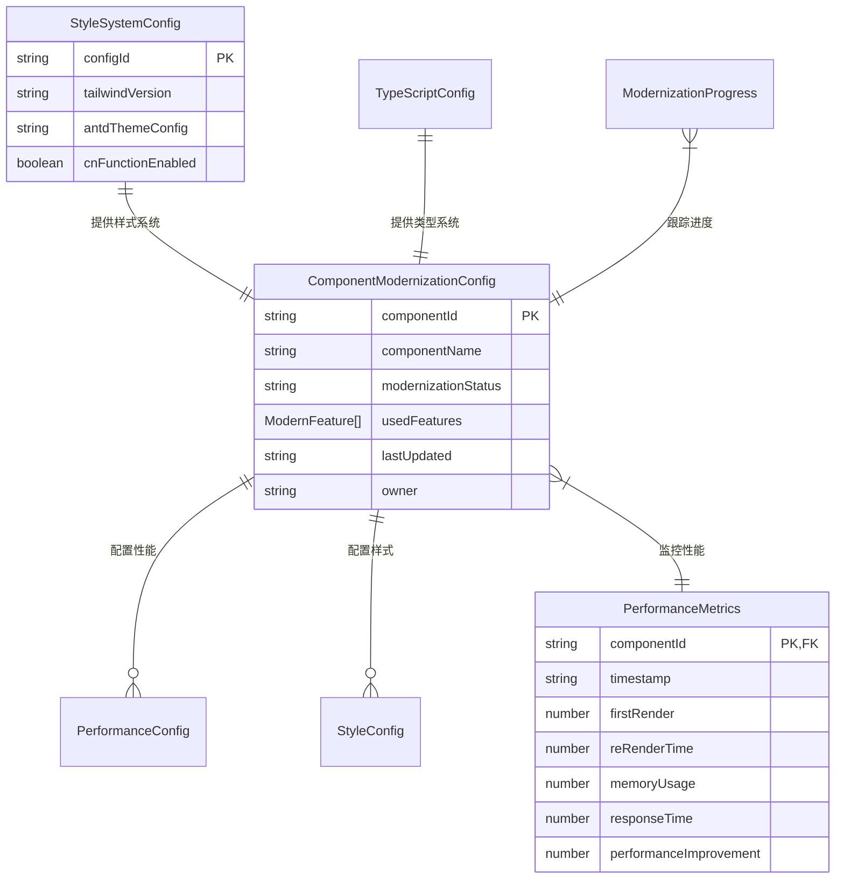

# 数据模型: Ant Design 6 现代化改造

**说明**: 本规格主要涉及前端框架现代化，不包含业务数据实体变更
**重点**: 组件配置、样式定义、性能配置等前端技术实体

## 核心技术实体

### 1. 组件现代化配置

#### ComponentModernizationConfig
```typescript
interface ComponentModernizationConfig {
  /** 组件唯一标识 */
  componentId: string;
  /** 组件名称 */
  componentName: string;
  /** 现代化状态 */
  modernizationStatus: 'pending' | 'in-progress' | 'completed';
  /** 使用的新 API 特性 */
  usedFeatures: ModernFeature[];
  /** 性能优化配置 */
  performanceConfig: PerformanceConfig;
  /** 样式配置 */
  styleConfig: StyleConfig;
  /** 最后更新时间 */
  lastUpdated: string;
  /** 负责人 */
  owner: string;
}

type ModernFeature =
  | 'classNames-api'
  | 'styles-api'
  | 'virtual-scrolling'
  | 'lazy-loading'
  | 'typescript-strict'
  | 'accessibility-enhanced';

interface PerformanceConfig {
  /** 是否启用虚拟滚动 */
  virtualScrolling?: boolean;
  /** 懒加载配置 */
  lazyLoading?: boolean;
  /** 销毁隐藏组件 */
  destroyOnHidden?: boolean;
  /** 内存优化 */
  memoryOptimization?: boolean;
}

interface StyleConfig {
  /** 使用 Tailwind CSS 类名 */
  tailwindClasses?: Record<string, string>;
  /** 自定义样式 */
  customStyles?: Record<string, CSSProperties>;
  /** 主题配置 */
  themeTokens?: Record<string, string>;
}
```

### 2. TypeScript 配置

#### TypeScriptConfig
```typescript
interface TypeScriptConfig {
  /** 严格模式配置 */
  strictMode: {
    enabled: boolean;
    noImplicitAny: boolean;
    strictNullChecks: boolean;
    strictFunctionTypes: boolean;
  };
  /** 类型定义优化 */
  typeDefinitions: {
    enhancedComponentTypes: boolean;
    strictPropTypes: boolean;
    genericOptimization: boolean;
  };
  /** 编译选项 */
  compilerOptions: {
    target: string;
    lib: string[];
    moduleResolution: string;
    allowSyntheticDefaultImports: boolean;
    esModuleInterop: boolean;
  };
}
```

### 3. 样式系统配置

#### StyleSystemConfig
```typescript
interface StyleSystemConfig {
  /** Tailwind CSS 配置 */
  tailwind: {
    version: string;
    prefix: string;
    customTheme: CustomTheme;
    utilityGroups: UtilityGroup[];
  };
  /** Ant Design 主题配置 */
  antdTheme: {
    token: ThemeToken;
    algorithm: ThemeAlgorithm[];
    components: ComponentThemeConfig[];
  };
  /** 样式工具函数 */
  utils: {
    cnFunction: boolean;
    styleMerger: boolean;
    responsiveHelper: boolean;
  };
}

interface CustomTheme {
  colors: Record<string, string>;
  spacing: Record<string, string>;
  typography: Record<string, TypographyConfig>;
  breakpoints: Record<string, string>;
}

interface ThemeToken {
  colorPrimary: string;
  colorSuccess: string;
  colorWarning: string;
  colorError: string;
  colorInfo: string;
  borderRadius: number;
  wireframe: boolean;
}
```

### 4. 性能监控实体

#### PerformanceMetrics
```typescript
interface PerformanceMetrics {
  /** 组件ID */
  componentId: string;
  /** 测量时间戳 */
  timestamp: string;
  /** 渲染性能指标 */
  renderingMetrics: {
    firstRender: number; // ms
    reRenderTime: number; // ms
    memoryUsage: number; // MB
  };
  /** 交互性能指标 */
  interactionMetrics: {
    responseTime: number; // ms
    animationFrameRate: number; // fps
    scrollPerformance: number; // score
  };
  /** 优化效果 */
  optimizationResults: {
    bundleSizeReduction: number; // %
    performanceImprovement: number; // %
    memoryOptimization: number; // %
  };
}
```

### 5. 现代化进度跟踪

#### ModernizationProgress
```typescript
interface ModernizationProgress {
  /** 项目ID */
  projectId: string;
  /** 总体进度 */
  overallProgress: {
    totalComponents: number;
    modernizedComponents: number;
    completionPercentage: number;
  };
  /** 分阶段进度 */
  phaseProgress: {
    codeModernization: PhaseStatus;
    performanceOptimization: PhaseStatus;
    developerExperience: PhaseStatus;
  };
  /** 质量指标 */
  qualityMetrics: {
    typeScriptErrors: number;
    testCoverage: number; // %
    performanceScore: number; // 0-100
    codeQualityScore: number; // 0-100
  };
  /** 里程碑 */
  milestones: Milestone[];
}

type PhaseStatus = {
  status: 'not-started' | 'in-progress' | 'completed';
  progress: number; // 0-100
  estimatedCompletion?: string;
};

interface Milestone {
  id: string;
  name: string;
  description: string;
  dueDate: string;
  status: 'pending' | 'completed' | 'delayed';
  dependencies: string[];
}
```

## 实体关系图



## 验证规则

### ComponentModernizationConfig
- `componentId`: 必填，唯一标识符
- `modernizationStatus`: 必填，枚举值之一
- `usedFeatures`: 必填，至少包含一个特性
- `lastUpdated`: 必填，ISO 8601 格式

### TypeScriptConfig
- `strictMode.enabled`: 布尔值，默认 true
- `compilerOptions.target`: 必填，支持的 ES 版本
- `compilerOptions.moduleResolution`: 必填，'node' 或 'classic'

### PerformanceMetrics
- `componentId`: 外键，关联 ComponentModernizationConfig
- `timestamp`: 必填，ISO 8601 格式
- `renderingMetrics.firstRender`: 正数，单位毫秒
- `optimizationResults.performanceImprovement`: 百分比值，0-100

### ModernizationProgress
- `projectId`: 必填，项目唯一标识
- `overallProgress.completionPercentage`: 0-100 的数值
- `qualityMetrics.testCoverage`: 0-100 的百分比值

## 数据持久化

### 存储策略
由于这是前端现代化项目，主要使用：

1. **配置文件**: JSON/YAML 格式存储在项目仓库
2. **构建时配置**: 通过 TypeScript 模块导入
3. **运行时数据**: 使用 localStorage 或内存状态管理
4. **监控数据**: 可选择发送到分析服务或本地存储

### 示例配置文件结构
```
config/
├── modernization.json          # 现代化配置
├── typescript.json             # TypeScript 配置
├── tailwind.config.js          # Tailwind CSS 配置
└── antd.theme.ts               # Ant Design 主题配置
```

## 迁移策略

### 阶段 1: 配置准备
1. 创建 ComponentModernizationConfig 实例
2. 设置 TypeScriptConfig 严格模式
3. 配置 StyleSystemConfig

### 阶段 2: 渐进式应用
1. 按组件逐个应用现代化配置
2. 收集 PerformanceMetrics 数据
3. 更新 ModernizationProgress

### 阶段 3: 优化完善
1. 基于监控数据优化配置
2. 完善最佳实践文档
3. 建立持续改进机制