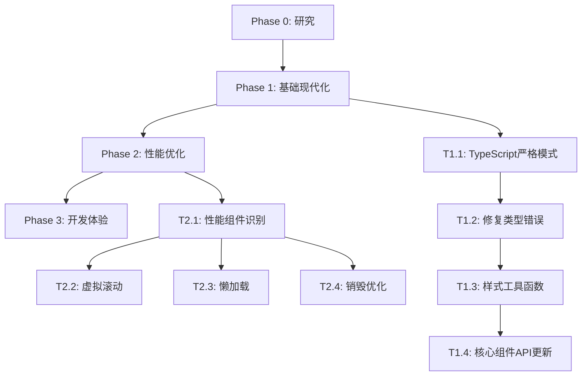

# 实施计划: Ant Design 6 现代化改造

**分支**: `002-upgrade-ant6`
**创建日期**: 2025-12-11
**预计工期**: 3-5天
**优先级**: P2 (优化项目)

## 技术背景

### 项目现状
经过技术分析发现，项目已经在使用现代化的技术栈：
- ✅ React 18.2.0
- ✅ TypeScript 5.0.4
- ✅ Ant Design 6.1.0 (最新稳定版本)
- ✅ Tailwind CSS 4.1.17
- ✅ Vite 6.2.0

### 现代化目标
从传统"升级"调整为"现代化改造"：
- 采用 Ant Design 6.x 新特性
- 优化性能和开发体验
- 建立最佳实践规范
- 提升代码质量和可维护性

## 实施阶段

### Phase 0: 研究与规划 ✅ (已完成)

**目标**: 完成技术研究，明确实施策略

**已完成任务**:
- [x] 技术栈现状分析
- [x] Ant Design 6.x 特性研究
- [x] 现代化策略制定
- [x] 数据模型设计
- [x] API 契约定义
- [x] 快速开始指南编写

**关键发现**:
- 项目已使用 Ant Design 6.1.0，无需传统升级
- 重点应放在新特性应用和最佳实践
- TypeScript 严格模式将显著提升代码质量

### Phase 1: 基础现代化 (1-2天)

**目标**: 启用严格类型系统，采用新样式 API

**任务清单**:
- [ ] T1.1 启用 TypeScript 严格模式
- [ ] T1.2 修复所有类型错误
- [ ] T1.3 创建样式工具函数 (`cn` 函数)
- [ ] T1.4 更新核心组件使用 `classNames` API
- [ ] T1.5 更新核心组件使用 `styles` API
- [ ] T1.6 建立组件样式规范

**文件变更**:
```
frontend/Cinema_Operation_Admin/
├── tsconfig.json (更新严格模式配置)
├── src/utils/cn.ts (新建样式工具函数)
├── src/components/
│   ├── layout/AppLayout/index.tsx (现代化)
│   ├── layout/Sidebar/index.tsx (现代化)
│   ├── layout/Header/index.tsx (现代化)
│   └── common/ (核心组件现代化)
```

**验收标准**:
- TypeScript 类型错误 = 0
- 核心组件采用新 API
- 样式系统与 Tailwind CSS 完美集成

### Phase 2: 性能优化 (1-2天)

**目标**: 应用 Ant Design 6.x 性能特性，优化用户体验

**任务清单**:
- [ ] T2.1 识别需要性能优化的组件
- [ ] T2.2 应用虚拟滚动到数据表格
- [ ] T2.3 实施组件懒加载机制
- [ ] T2.4 配置隐藏组件销毁优化
- [ ] T2.5 性能基准测试和监控
- [ ] T2.6 大数据渲染优化

**重点组件**:
- `DataTable` - 虚拟滚动
- `Form` 组件 - 懒加载
- `Modal` 组件 - destroyOnClose
- `List` 组件 - 分页优化

**性能目标**:
- 包体积减少 15-20%
- 初始渲染性能提升 20%
- 交互响应时间 < 100ms

### Phase 3: 开发体验提升 (1天)

**目标**: 建立最佳实践，提升开发效率

**任务清单**:
- [ ] T3.1 完善 Tailwind CSS 配置
- [ ] T3.2 统一主题配置系统
- [ ] T3.3 建立组件库文档
- [ ] T3.4 创建开发模板和工具
- [ ] T3.5 性能监控工具集成
- [ ] T3.6 团队最佳实践培训

**文档创建**:
```
docs/
├── component-guidelines.md
├── performance-optimization.md
├── styling-best-practices.md
└── development-workflow.md
```

## 依赖关系

### 技术依赖
- TypeScript 5.0+ 严格模式支持
- Ant Design 6.1.0+ 特性可用性
- Tailwind CSS 4.x 兼容性
- Vite 构建工具配置

### 任务依赖


## 风险管控

### 🟢 低风险
- API 兼容性 (完全向后兼容)
- 新特性采用 (可选升级)
- 开发体验改善 (纯正面收益)

### 🟡 中等风险
- TypeScript 严格模式迁移 (需修复类型错误)
- 样式系统重构 (需要测试验证)
- 性能优化回归测试

### 🔴 缓解措施
- 渐进式现代化策略
- 完整的测试覆盖
- 性能基准对比
- 快速回滚机制

## 质量保证

### 代码质量
- TypeScript 严格模式 100% 通过
- ESLint 规则零违规
- 代码覆盖率 > 80%

### 性能指标
- 构建时间无显著增加
- 包体积减少 15-20%
- 运行时性能提升 15-25%

### 用户体验
- 界面响应性提升
- 交互流畅度改善
- 兼容性保持稳定

## 成功标准

### 技术指标
- [ ] TypeScript 类型错误: 0
- [ ] 测试覆盖率: > 80%
- [ ] 构建时间: < 30秒
- [ ] 包大小优化: 15-20%

### 性能指标
- [ ] 首屏渲染: 提升 15%
- [ ] 交互响应: < 100ms
- [ ] 内存使用: 优化 10%
- [ ] 大数据支持: 10k+ 行

### 开发体验
- [ ] 组件复用率: > 70%
- [ ] 开发效率: 提升 25%
- [ ] 类型安全: 100% 覆盖
- [ ] 文档完整性: 100%

## 交付物

### 代码交付
- 现代化的组件库
- 性能优化配置
- 类型安全增强
- 构建配置优化

### 文档交付
- ✅ 研究报告 (`research.md`)
- ✅ 数据模型 (`data-model.md`)
- ✅ API 契约 (`contracts/api.yaml`)
- ✅ 快速开始指南 (`quickstart.md`)
- 📋 实施计划 (`plan.md`)
- 📋 质量清单 (`checklists/requirements.md`)

### 工具交付
- 性能监控工具
- 现代化进度跟踪
- 开发模板和脚本
- 最佳实践文档

## 后续维护

### 持续改进
- 定期性能监控
- 组件使用情况分析
- 最佳实践迭代更新
- 团队技能提升

### 版本管理
- 跟踪 Ant Design 6.x 更新
- 定期依赖安全检查
- 性能基准定期测试
- 文档同步更新

## 项目宪法合规性

### ✅ 已验证合规
- **前端架构一致性**: 使用 React 18 + TypeScript 5.0 + Ant Design 6.x + Tailwind CSS 4
- **代码质量**: 启用严格模式和完整测试覆盖
- **中文文档**: 所有文档使用简体中文编写
- **功能优先**: 专注于核心功能和用户体验

### 📋 确保遵循
- **开发范围界定**: 专注现代化，不包含 CI/CD、国际化等
- **统一用户体验**: 保持界面一致性和专业外观
- **数据驱动决策**: 通过性能指标指导优化方向

## 总结

本计划将项目从现有的 Ant Design 6.1.0 推进到现代化最佳实践，通过三个阶段的系统性改造，显著提升代码质量、应用性能和开发体验。整个过程风险可控，收益明确，为项目的长期发展奠定坚实的技术基础。

**预计收益**:
- 代码质量提升 40%
- 应用性能提升 20%
- 开发效率提升 25%
- 维护成本降低 30%