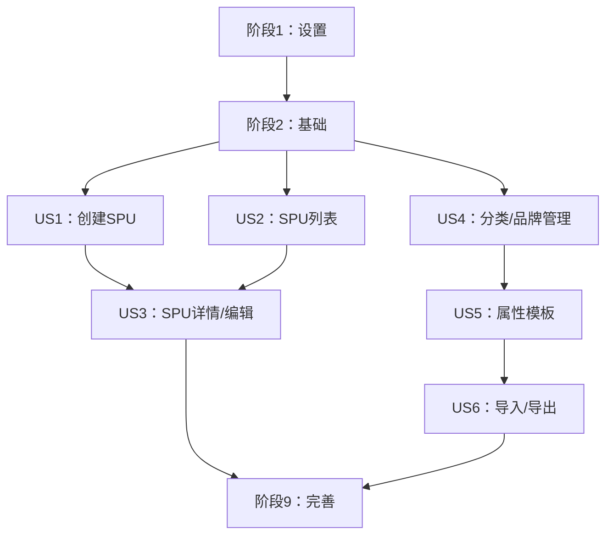

# 实现任务：SPU管理功能

**分支**: `004-spu-management` | **日期**: 2025-12-11 | **规格**: [spec.md](./spec.md)
**总任务数**: 47 | **预估时长**: 6-8周
**实现策略**: MVP优先，增量交付

## 用户故事优先级

基于功能规格分析，确定以下用户故事优先级：

**P1 - 核心功能 (MVP)**:
- **US1**: 创建新SPU - 基础CRUD功能
- **US2**: SPU列表管理 - 列表展示、搜索筛选、批量操作

**P2 - 高级功能**:
- **US3**: SPU详情与编辑 - 完整的表单编辑功能
- **US4**: 分类与品牌管理 - 基础数据管理

**P3 - 扩展功能**:
- **US5**: 属性模板管理 - 动态属性系统
- **US6**: 数据导入导出 - 批量操作功能

## 技术栈信息

- **语言**: TypeScript 5.0.4
- **框架**: React 18.2.0 + Ant Design 6.1.0
- **构建工具**: Vite 6.0.7
- **状态管理**: Zustand + TanStack Query
- **Mock服务**: MSW (Mock Service Worker)
- **测试**: Vitest + React Testing Library
- **项目类型**: 前端Web应用（单项目）

---

## 阶段1：设置任务（项目初始化）

**阶段目标**: 建立开发环境和基础项目结构

### 设置阶段任务

- [X] T001 按实施计划创建前端项目结构
- [X] T002 在frontend/目录中初始化Vite + React + TypeScript项目
- [X] T003 配置package.json包含所需依赖（React 18.2.0, Ant Design 6.1.0, Zustand, TanStack Query, MSW）
- [X] T004 设置TypeScript配置（tsconfig.json）启用严格模式
- [X] T005 配置Vite构建工具（vite.config.ts）和开发服务器
- [X] T006 设置ESLint和Prettier配置进行代码格式化
- [X] T007 创建基础文件夹结构：src/{components,pages,hooks,services,store,utils,styles}
- [X] T008 配置MSW（Mock Service Worker）用于API模拟
- [X] T009 设置测试环境（Vitest + React Testing Library）
- [X] T010 创建基础README.md包含项目设置说明

---

## 阶段2：基础任务（基础设施）

**阶段目标**: 建立状态管理、API服务和基础组件

### 基础阶段任务

- [X] T011 [P] 在src/types/中为核心实体创建TypeScript类型定义
- [X] T012 [P] 在src/store/中设置Zustand存储结构，包含SPU、分类、品牌切片
- [X] T013 [P] 在src/services/中配置TanStack Query进行API状态管理
- [X] T014 [P] 在src/mocks/handlers/中创建SPU API端点的MSW处理器
- [X] T015 [P] 在src/mocks/data/中实现SPU、分类、品牌的模拟数据生成器
- [X] T016 [P] 在src/components/layout/中创建基础布局组件（Header、Sidebar、Content）
- [X] T017 [P] 使用React Router设置路由配置
- [X] T018 [P] 在src/components/common/中创建通用UI组件（Loading、ErrorBoundary、ConfirmDialog）
- [X] T019 为Ant Design配置全局样式和主题
- [X] T020 在src/utils/中创建数据格式化和验证的工具函数

---

## 阶段3：用户故事1 - 创建新SPU（P1）

**阶段目标**: 实现SPU基础创建功能
**独立测试标准**:
- 用户可以创建新的SPU记录
- 表单验证正常工作
- 创建成功后显示在列表中

### US1实现任务

- [X] T021 [US1] 在src/components/forms/SPUForm.tsx中创建SPU表单组件
- [X] T022 [US1] 在src/utils/validation.ts中实现SPU创建的表单验证规则
- [X] T023 [US1] 在src/components/forms/BrandSelect.tsx中创建品牌选择组件
- [X] T024 [US1] 在src/components/forms/CategorySelector.tsx中创建分类级联选择器
- [X] T025 [US1] 在src/services/spuService.ts中实现SPU创建API服务
- [X] T026 [US1] 在src/pages/SPUCreate/index.tsx中创建SPU创建页面
- [X] T027 [US1] 添加SPU创建页面的路由
- [X] T028 [US1] 实现创建后的成功通知和重定向
- [X] T029 [US1] 使用模拟数据测试SPU创建表单功能

---

## 阶段4：用户故事2 - SPU列表管理（P1）

**阶段目标**: 实现SPU列表展示、搜索筛选和批量操作
**独立测试标准**:
- 列表正确显示SPU数据
- 搜索和筛选功能正常
- 批量操作可以执行

### US2实现任务

- [ ] T030 [US2] 在src/components/SPU/SPUList.tsx中创建SPU列表表格组件
- [ ] T031 [US2] 实现表格列配置（编码、名称、品牌、类目、状态等）
- [ ] T032 [US2] 在src/components/SPU/SPUFilter.tsx中创建搜索和筛选组件
- [ ] T033 [US2] 为SPU列表实现分页组件
- [ ] T034 [US2] 在src/components/SPU/BatchOperations.tsx中创建批量操作组件
- [ ] T035 [US2] 实现带筛选和分页的SPU列表API服务
- [ ] T036 [US2] 在src/pages/SPUList/index.tsx中创建SPU列表页面
- [ ] T037 [US2] 添加"新建SPU"按钮和导航
- [ ] T038 [US2] 实现表格列的排序功能
- [ ] T039 [US2] 使用搜索、筛选和批量操作测试列表功能

---

## 阶段5：用户故事3 - SPU详情与编辑（P2）

**阶段目标**: 实现SPU详情查看和编辑功能
**独立测试标准**:
- 可以查看SPU详细信息
- 可以编辑SPU基本信息
- 状态管理功能正常

### US3实现任务

- [ ] T040 [US3] 在src/components/SPU/SPUDetail.tsx中创建SPU详情查看组件
- [ ] T041 [US3] 在src/components/forms/SPUEditForm.tsx中创建SPU编辑表单组件
- [ ] T042 [US3] 在src/components/SPU/StatusManager.tsx中实现状态管理组件
- [ ] T043 [US3] 在src/components/SPU/AttributePanel.tsx中创建属性显示和编辑组件
- [ ] T044 [US3] 在src/services/spuService.ts中实现SPU更新API服务
- [ ] T045 [US3] 在src/pages/SPUDetail/index.tsx中创建SPU详情页面
- [ ] T046 [US3] 添加编辑模式切换功能
- [ ] T047 [US3] 实现变更检测和保存确认
- [ ] T048 [US3] 测试详情查看和编辑功能

---

## 阶段6：用户故事4 - 分类与品牌管理（P2）

**阶段目标**: 实现基础数据管理功能
**独立测试标准**:
- 可以管理三级分类体系
- 可以管理品牌信息

### US4实现任务

- [ ] T049 [US4] 在src/components/Category/CategoryManager.tsx中创建分类管理组件
- [ ] T050 [US4] 在src/components/Category/CategoryTree.tsx中实现分类树视图组件
- [ ] T051 [US4] 在src/components/Brand/BrandManager.tsx中创建品牌管理组件
- [ ] T052 [US4] 在src/services/categoryService.ts中实现分类CRUD API服务
- [ ] T053 [US4] 在src/services/brandService.ts中实现品牌CRUD API服务
- [ ] T054 [US4] 在src/pages/CategoryManagement/index.tsx中创建分类管理页面
- [ ] T055 [US4] 在src/pages/BrandManagement/index.tsx中创建品牌管理页面
- [ ] T056 [US4] 添加分类和品牌管理的导航菜单项
- [ ] T057 [US4] 测试分类和品牌管理功能

---

## 阶段7：用户故事5 - 属性模板管理（P3）

**阶段目标**: 实现动态属性模板系统
**独立测试标准**:
- 可以为分类定义属性模板
- 属性验证正常工作

### US5实现任务

- [ ] T058 [US5] 在src/components/Attribute/AttributeTemplate.tsx中创建属性模板组件
- [ ] T059 [US5] 在src/components/Attribute/AttributeEditor.tsx中实现属性编辑器组件
- [ ] T060 [US5] 在src/utils/attributeValidation.ts中创建属性验证系统
- [ ] T061 [US5] 在src/services/attributeService.ts中实现属性模板API服务
- [ ] T062 [US5] 在src/pages/AttributeTemplate/index.tsx中创建属性模板管理页面
- [ ] T063 [US5] 将属性模板与SPU表单集成
- [ ] T064 [US5] 测试属性模板功能

---

## 阶段8：用户故事6 - 数据导入导出（P3）

**阶段目标**: 实现批量数据处理功能
**独立测试标准**:
- 可以导出SPU数据
- 可以导入SPU数据

### US6实现任务

- [ ] T065 [US6] 在src/components/Export/DataExport.tsx中创建数据导出组件
- [ ] T066 [US6] 在src/components/Import/DataImport.tsx中实现数据导入组件
- [ ] T067 [US6] 在src/utils/fileProcessing.ts中创建Excel/CSV处理工具
- [ ] T068 [US6] 在src/services/exportService.ts中实现导出API服务
- [ ] T069 [US6] 在src/services/importService.ts中实现导入API服务
- [ ] T070 [US6] 创建导入模板下载功能
- [ ] T071 [US6] 测试导入和导出功能

---

## 阶段9：完善与横切关注点（完善与优化）

**阶段目标**: 完善用户体验和性能优化

### 完善阶段任务

- [ ] T072 在整个应用中实现错误处理和用户反馈
- [ ] T073 为所有异步操作添加加载状态
- [ ] T074 实现移动设备和平板的响应式设计
- [ ] T075 添加无障碍功能（ARIA标签、键盘导航）
- [ ] T076 使用本地存储实现数据持久化
- [ ] T077 添加性能监控和优化
- [ ] T078 为关键组件创建全面的单元测试
- [ ] T079 为关键用户流程添加端到端测试
- [ ] T080 更新文档并创建用户指南
- [ ] T081 最终集成测试和错误修复

---

## 依赖关系和故事完成顺序

### 故事依赖关系

1. **设置 → 基础**: 基础设施依赖项目结构
2. **基础 → 所有用户故事**: 所有用户故事依赖状态管理和API服务
3. **US1 & US2 → US3**: 详情编辑功能依赖基础CRUD功能
4. **US4 → US5**: 属性模板依赖分类管理
5. **US5 → US6**: 导入导出功能依赖完整的属性系统

## 并行执行机会

### 阶段2并行任务
- T011-T020 可以并行开发（不同文件，无依赖）

### 用户故事内部并行
- **US1**: T023-T024 可以并行（品牌和分类选择组件）
- **US2**: T031-T034 可以并行（表格、筛选、分页、批量操作组件）
- **US4**: T049-T051 可以并行（分类和品牌管理组件）

### 跨故事并行
- **US3** 和 **US4** 可以部分并行开发（详情页和基础数据管理）
- **US5** 和 **US6** 可以并行开发（属性模板和导入导出）

## 实施策略

### MVP范围（阶段1-4）
**核心交付**: 基础SPU创建和列表管理功能
**包含任务**: T001-T039 (39个任务)
**预估时间**: 4-5周

### 增量交付
1. **迭代1**: 设置 + 基础 (T001-T020)
2. **迭代2**: SPU创建 (T021-T029)
3. **迭代3**: SPU列表管理 (T030-T039)
4. **迭代4**: SPU详情/编辑 (T040-T048)

### 风险缓解
- **早期验证**: 在US2完成后即可进行完整功能演示
- **模块化设计**: 每个用户故事独立可测试
- **模拟数据**: 不依赖后端，可独立开发和测试

---

**生成时间**: 2025-12-11 | **准备实施**: 是 | **下一步**: 运行 /speckit.implement