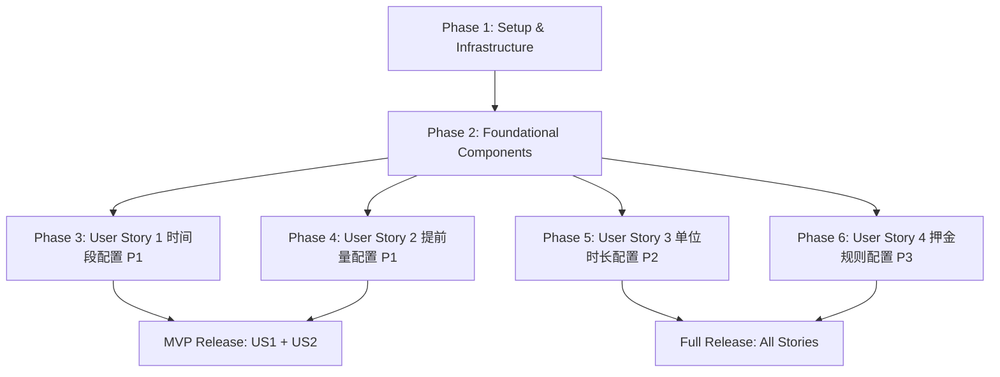

# Implementation Tasks: 门店预约设置管理（已整合到门店管理）

**Feature**: 016-store-reservation-settings
**Branch**: `016-store-reservation-settings`
**Date**: 2025-12-22
**Updated**: 2025-12-22
**Status**: Integrated to Store Management

---

## 整合说明

> 本功能已整合到「门店管理」页面，不再作为独立菜单项。以下是整合方案的关键改动：
>
> **已完成的整合任务**:
> - [X] 修改 `StoreTable.tsx` - 在操作列添加「预约」按钮
> - [X] 修改 `stores/index.tsx` - 集成 `ReservationSettingsModal` 组件
> - [X] 更新 `AppLayout.tsx` - 移除独立的「门店预约设置」菜单项
> - [X] 更新 `Router.tsx` - 添加路由注释说明
> - [X] 更新 `spec.md`、`plan.md`、`tasks.md` 文档

---

## Overview

本文档定义门店预约设置管理功能的实现任务，按用户故事组织，支持增量交付和独立测试。遵循TDD开发模式，每个用户故事都包含完整的测试和实现任务。

**总任务数**: 45个任务
**用户故事**: 4个（P1×2, P2×1, P3×1）
**建议MVP范围**: User Story 1 + User Story 2（P1优先级故事）

---

## Task Phases

### Phase 1: Setup & Infrastructure (5 tasks)

本阶段完成项目初始化和基础设施搭建，为所有用户故事提供必要的技术基础。

- [ ] T001 Run database migration script to create reservation_settings table in backend/src/main/resources/db/migration/V016_001__create_reservation_settings.sql
- [ ] T002 [P] Create TypeScript types for ReservationSettings in frontend/src/features/store-management/types/reservation-settings.ts
- [ ] T003 [P] Create Zod validation schemas for form validation in frontend/src/features/store-management/types/reservation-settings.ts
- [ ] T004 [P] Create API service client for reservation-settings endpoints in frontend/src/features/store-management/services/reservation-settings.service.ts
- [ ] T005 Configure MSW mock handlers for reservation-settings API in frontend/src/mocks/handlers/reservation-settings.ts

**Completion Criteria**:
- ✅ Database table `reservation_settings` exists with correct schema and indexes
- ✅ TypeScript types exported and match OpenAPI schema in contracts/api.yaml
- ✅ Zod schemas validate all required fields and business rules
- ✅ API service client implements all 3 endpoints (GET, PUT, DELETE)
- ✅ MSW handlers return valid mock data for all endpoints

---

### Phase 2: Foundational Components (5 tasks)

本阶段创建所有用户故事共享的基础组件和后端服务，为后续用户故事实现提供公共能力。

- [ ] T006 Create JPA Entity ReservationSettings in backend/src/main/java/com/cinema/domain/ReservationSettings.java
- [ ] T007 Create JPA Repository ReservationSettingsRepository in backend/src/main/java/com/cinema/repository/ReservationSettingsRepository.java
- [ ] T008 Create TimeSlot DTO class for JSONB mapping in backend/src/main/java/com/cinema/dto/TimeSlot.java
- [ ] T009 Implement ReservationSettingsService interface and implementation in backend/src/main/java/com/cinema/service/ReservationSettingsService.java
- [ ] T010 Create Spring Boot Controller ReservationSettingsController with all REST endpoints in backend/src/main/java/com/cinema/controller/ReservationSettingsController.java

**Completion Criteria**:
- ✅ ReservationSettings entity maps correctly to database table with JSONB support
- ✅ Repository provides findByStoreId() and deleteByStoreId() methods
- ✅ TimeSlot DTO serializes/deserializes to/from JSONB correctly
- ✅ Service layer implements createOrUpdate(), findByStoreId(), deleteByStoreId() with validation
- ✅ Controller exposes 3 endpoints: GET, PUT, DELETE /api/stores/{storeId}/reservation-settings
- ✅ All responses wrapped in ApiResponse format per 08-api-standards.md

---

### Phase 3: User Story 1 - 配置门店预约时间段 (Priority: P1) (11 tasks)

**Story Goal**: 运营人员可以为门店配置可预约时间段（按星期分组），前端影厅预约页面根据配置自动过滤不可用时段。

**Independent Test Criteria**:
- ✅ 运营可以为指定门店设置营业时间段（如工作日 10:00-22:00，周末 9:00-23:00）
- ✅ 保存后，前端影厅预约页面在选择时段时自动过滤掉非营业时间
- ✅ 只允许选择配置的可预约时间段

#### Tests (TDD - Write Tests First)

- [ ] T011 [P] [US1] Write E2E test for time slot configuration flow in frontend/tests/e2e/reservation-settings/time-slots.spec.ts
- [ ] T012 [P] [US1] Write unit test for TimeSlot validation logic in frontend/src/features/store-management/types/reservation-settings.test.ts
- [ ] T013 [P] [US1] Write unit test for useReservationSettings Hook in frontend/src/features/store-management/hooks/useReservationSettings.test.ts
- [ ] T014 [P] [US1] Write backend integration test for time slots CRUD in backend/src/test/java/com/cinema/service/ReservationSettingsServiceTest.java

#### Implementation

- [ ] T015 [US1] Implement TanStack Query Hook useReservationSettings in frontend/src/features/store-management/hooks/useReservationSettings.ts
- [ ] T016 [US1] Implement TanStack Query Hook useUpdateReservationSettings in frontend/src/features/store-management/hooks/useUpdateReservationSettings.ts
- [ ] T017 [US1] Create TimeSlotFormItem molecule component in frontend/src/features/store-management/components/TimeSlotFormItem.tsx
- [ ] T018 [US1] Create ReservationSettingsForm organism component in frontend/src/features/store-management/components/ReservationSettingsForm.tsx
- [X] T019 [US1] Create ReservationSettingsModal container component in frontend/src/pages/store-reservation-settings/components/ReservationSettingsModal.tsx
- [X] T020 [US1] Integrate "预约" button into StoreTable and ReservationSettingsModal into StoresPage (已整合到 stores/index.tsx)
- [ ] T021 [US1] Implement backend validation for time slots (startTime < endTime) in backend/src/main/java/com/cinema/service/impl/ReservationSettingsServiceImpl.java

**Completion Criteria for US1**:
- ✅ All tests pass (E2E, unit, integration)
- ✅ 运营可以在门店管理页面点击"预约设置"按钮打开配置Modal
- ✅ Modal显示7个时间段配置项（周一至周日）
- ✅ 可以为每天配置开始时间和结束时间（使用Ant Design TimePicker）
- ✅ 保存时前端Zod验证startTime < endTime
- ✅ 保存成功后配置存储到Supabase数据库（time_slots JSONB字段）
- ✅ 前端影厅预约页面（假设已存在）可以通过API获取时间段配置

---

### Phase 4: User Story 2 - 配置门店预约提前量 (Priority: P1) (9 tasks)

**Story Goal**: 运营人员可以为门店设置预约提前量（最小/最大提前时间），前端预约页面根据规则限制可选日期。

**Independent Test Criteria**:
- ✅ 运营可以为指定门店设置最小提前时间（如 2 小时）和最大提前时间（如 30 天）
- ✅ 保存后，前端预约页面在选择日期时自动禁用不符合提前量规则的日期
- ✅ 小于最小提前时间或大于最大提前时间的日期不可选

#### Tests (TDD - Write Tests First)

- [ ] T022 [P] [US2] Write E2E test for advance time configuration in frontend/tests/e2e/reservation-settings/advance-time.spec.ts
- [ ] T023 [P] [US2] Write unit test for advance time validation logic in frontend/src/features/store-management/types/reservation-settings.test.ts
- [ ] T024 [P] [US2] Write backend integration test for advance time validation in backend/src/test/java/com/cinema/service/ReservationSettingsServiceTest.java

#### Implementation

- [ ] T025 [US2] Add minAdvanceHours and maxAdvanceDays fields to ReservationSettingsForm in frontend/src/features/store-management/components/ReservationSettingsForm.tsx
- [ ] T026 [US2] Implement Zod validation rule for advance time (maxAdvanceDays * 24 > minAdvanceHours) in frontend/src/features/store-management/types/reservation-settings.ts
- [ ] T027 [US2] Implement backend validation for advance time in backend/src/main/java/com/cinema/service/impl/ReservationSettingsServiceImpl.java
- [ ] T028 [US2] Add database CHECK constraint for advance time validation in backend/src/main/resources/db/migration/V016_001__create_reservation_settings.sql
- [ ] T029 [US2] Create utility function to calculate valid date range based on advance time in frontend/src/features/store-management/utils/calculateValidDateRange.ts
- [ ] T030 [US2] Write unit test for calculateValidDateRange utility in frontend/src/features/store-management/utils/calculateValidDateRange.test.ts

**Completion Criteria for US2**:
- ✅ All tests pass (E2E, unit, integration)
- ✅ ReservationSettingsForm包含最小提前小时数和最大提前天数输入框
- ✅ 前端Zod验证maxAdvanceDays * 24 > minAdvanceHours
- ✅ 后端Spring Validation验证相同规则
- ✅ 数据库CHECK约束保证数据完整性
- ✅ calculateValidDateRange工具函数正确计算可选日期范围

---

### Phase 5: User Story 3 - 配置门店预约单位时长 (Priority: P2) (8 tasks)

**Story Goal**: 运营人员可以为门店设置预约单位时长（1/2/4小时），前端预约页面时长选择器仅显示允许的时长选项。

**Independent Test Criteria**:
- ✅ 运营可以为指定门店设置预约时间单位（如 2 小时）
- ✅ 保存后，前端预约页面的时长选择器只显示 2h、4h、6h 等选项
- ✅ 无法选择不符合单位的时长（如 1 小时或 3 小时）

#### Tests (TDD - Write Tests First)

- [ ] T031 [P] [US3] Write E2E test for duration unit configuration in frontend/tests/e2e/reservation-settings/duration-unit.spec.ts
- [ ] T032 [P] [US3] Write unit test for duration unit validation in frontend/src/features/store-management/types/reservation-settings.test.ts
- [ ] T033 [P] [US3] Write backend integration test for duration unit validation in backend/src/test/java/com/cinema/service/ReservationSettingsServiceTest.java

#### Implementation

- [ ] T034 [US3] Add durationUnit field to ReservationSettingsForm with Select component (options: 1/2/4) in frontend/src/features/store-management/components/ReservationSettingsForm.tsx
- [ ] T035 [US3] Implement Zod validation for durationUnit (must be 1, 2, or 4) in frontend/src/features/store-management/types/reservation-settings.ts
- [ ] T036 [US3] Implement backend validation for durationUnit using @Pattern annotation in backend/src/main/java/com/cinema/domain/ReservationSettings.java
- [ ] T037 [US3] Add database CHECK constraint for durationUnit in backend/src/main/resources/db/migration/V016_001__create_reservation_settings.sql
- [ ] T038 [US3] Create utility function to generate duration options based on unit in frontend/src/features/store-management/utils/generateDurationOptions.ts

**Completion Criteria for US3**:
- ✅ All tests pass (E2E, unit, integration)
- ✅ ReservationSettingsForm包含预约单位时长选择器（下拉框）
- ✅ 选项为1小时、2小时、4小时
- ✅ 前端和后端均验证durationUnit必须为1、2或4
- ✅ 数据库CHECK约束保证durationUnit IN (1, 2, 4)
- ✅ generateDurationOptions工具函数根据单位生成可选时长列表

---

### Phase 6: User Story 4 - 配置门店预约押金规则 (Priority: P3) (7 tasks)

**Story Goal**: 运营人员可以为门店设置押金规则（是否需要押金、押金金额或比例），前端预约页面根据规则显示押金信息。

**Independent Test Criteria**:
- ✅ 运营可以为指定门店设置押金规则（如需要押金，押金金额 200 元）
- ✅ 保存后，前端预约页面在选择门店时显示"需支付押金 200 元"提示
- ✅ 用户提交预约时跳转到支付页面要求支付押金

#### Tests (TDD - Write Tests First)

- [ ] T039 [P] [US4] Write E2E test for deposit configuration in frontend/tests/e2e/reservation-settings/deposit.spec.ts
- [ ] T040 [P] [US4] Write unit test for deposit validation logic in frontend/src/features/store-management/types/reservation-settings.test.ts
- [ ] T041 [P] [US4] Write backend integration test for deposit validation in backend/src/test/java/com/cinema/service/ReservationSettingsServiceTest.java

#### Implementation

- [ ] T042 [US4] Create DepositFormItem molecule component in frontend/src/features/store-management/components/DepositFormItem.tsx
- [ ] T043 [US4] Integrate DepositFormItem into ReservationSettingsForm with conditional rendering in frontend/src/features/store-management/components/ReservationSettingsForm.tsx
- [ ] T044 [US4] Implement Zod validation for deposit rules (if depositRequired=true, must have depositAmount or depositPercentage) in frontend/src/features/store-management/types/reservation-settings.ts
- [ ] T045 [US4] Implement backend validation for deposit configuration in backend/src/main/java/com/cinema/service/impl/ReservationSettingsServiceImpl.java

**Completion Criteria for US4**:
- ✅ All tests pass (E2E, unit, integration)
- ✅ ReservationSettingsForm包含押金配置：是否需要押金（Switch）、押金金额（InputNumber）、押金比例（InputNumber）
- ✅ 当depositRequired为true时，显示押金金额和押金比例输入框
- ✅ 前端Zod验证：depositRequired为true时，depositAmount和depositPercentage必须至少有一个非空
- ✅ 后端Spring Validation验证相同规则
- ✅ 押金配置正确存储到数据库

---

## Task Dependencies

### User Story Completion Order



**Key Dependencies**:
- **US1, US2, US3, US4**: 所有用户故事均依赖Phase 1和Phase 2完成
- **US1和US2**: 可以并行开发（P1优先级，建议MVP范围）
- **US3和US4**: 可以在MVP发布后增量开发

### Task-Level Dependencies

**Phase 1 (Setup)**:
- T001必须首先执行（数据库表创建）
- T002-T005可以并行执行

**Phase 2 (Foundational)**:
- T006依赖T001（Entity需要表存在）
- T007依赖T006（Repository需要Entity）
- T008可以与T006并行
- T009依赖T007和T008（Service需要Repository和DTO）
- T010依赖T009（Controller需要Service）

**Phase 3-6 (User Stories)**:
- 每个User Story内部：Tests → Implementation（TDD模式）
- 同一Story内的Tests可以并行编写
- Implementation tasks按依赖顺序执行（Hooks → Components）

---

## Parallel Execution Opportunities

### Phase 1: 4个任务可并行

```bash
# 并行执行组1（前端TypeScript类型和服务）
T002, T003, T004 可以并行开发（不同文件）

# 串行执行
T001（数据库迁移）必须先执行
T005（MSW handlers）依赖T004（API service）
```

### Phase 2: 部分任务可并行

```bash
# 并行执行组1
T008（TimeSlot DTO）可以与T006（Entity）并行开发

# 串行执行
T006 → T007 → T009 → T010（后端层级依赖）
```

### Phase 3 (US1): 测试全部可并行

```bash
# 并行执行组1（所有测试）
T011, T012, T013, T014 可以并行编写（测试文件独立）

# 并行执行组2（前端Hooks）
T015, T016 可以并行实现（不同文件）

# 串行执行（组件依赖）
T017（TimeSlotFormItem）→ T018（ReservationSettingsForm）→ T019（Modal）→ T020（集成到页面）
T021（后端验证）可以与前端并行
```

### Phase 4 (US2): 测试可并行

```bash
# 并行执行组1（所有测试）
T022, T023, T024 可以并行编写

# 并行执行组2
T025, T026, T027, T028 可以部分并行（前端和后端分离）
T029, T030（工具函数）可以独立开发
```

### Phase 5 (US3): 测试可并行

```bash
# 并行执行组1（所有测试）
T031, T032, T033 可以并行编写

# 并行执行组2
T034, T035, T036, T037 可以部分并行
T038（工具函数）可以独立开发
```

### Phase 6 (US4): 测试可并行

```bash
# 并行执行组1（所有测试）
T039, T040, T041 可以并行编写

# 串行执行（组件集成）
T042（DepositFormItem）→ T043（集成到ReservationSettingsForm）
T044, T045（验证逻辑）可以与组件并行
```

---

## Implementation Strategy

### MVP Scope (建议首次发布)

**包含User Story**: US1 + US2（P1优先级）

**MVP任务范围**: T001-T030（共30个任务）

**MVP交付能力**:
- ✅ 运营可以配置门店预约时间段（按星期）
- ✅ 运营可以配置预约提前量（最小/最大提前时间）
- ✅ 配置保存到Supabase数据库
- ✅ 前端影厅预约页面可以获取配置并过滤不可用时段/日期
- ✅ 完整的E2E测试和单元测试覆盖

**MVP预计工作量**: 约5-7个工作日（1名全栈工程师）

### Incremental Delivery Plan

**第一次迭代（MVP）**: Phase 1-4（T001-T030）
- 完成基础设施 + US1 + US2
- 发布到测试环境验证核心功能
- 收集运营人员反馈

**第二次迭代**: Phase 5（T031-T038）
- 完成US3（预约单位时长配置）
- 增量发布，不影响已有功能

**第三次迭代**: Phase 6（T039-T045）
- 完成US4（押金规则配置）
- 全功能发布

---

## Testing Strategy

### Test Coverage Requirements

| 测试类型 | 覆盖率要求 | 工具 |
|---------|----------|------|
| E2E测试 | 关键业务流程100% | Playwright |
| 单元测试（前端） | 工具函数≥80%，组件≥70% | Vitest + Testing Library |
| 单元测试（后端） | Service层100%，Repository层≥80% | JUnit 5 + Mockito |
| 集成测试（后端） | API端点100% | Spring Boot Test |

### Test Execution Order

1. **先写测试（TDD）**: 每个User Story的Tests任务必须在Implementation任务之前执行
2. **并行执行测试**: 同一User Story的所有测试可以并行编写
3. **逐个实现功能**: Implementation按依赖顺序串行执行，确保测试逐个通过
4. **回归测试**: 每次功能实现后运行全部测试，确保无回归

---

## File Structure Reference

### Frontend Structure

```
frontend/src/
├── features/
│   └── store-management/
│       ├── components/
│       │   ├── TimeSlotFormItem.tsx           [T017]
│       │   ├── DepositFormItem.tsx            [T042]
│       │   ├── ReservationSettingsForm.tsx    [T018, T025, T034, T043]
│       │   └── ReservationSettingsModal.tsx   [T019]
│       ├── hooks/
│       │   ├── useReservationSettings.ts      [T015]
│       │   └── useUpdateReservationSettings.ts [T016]
│       ├── services/
│       │   └── reservation-settings.service.ts [T004]
│       ├── types/
│       │   └── reservation-settings.ts         [T002, T003, T026, T035, T044]
│       └── utils/
│           ├── calculateValidDateRange.ts      [T029]
│           └── generateDurationOptions.ts      [T038]
├── pages/
│   └── StoreManagementPage.tsx                [T020]
└── mocks/
    └── handlers/
        └── reservation-settings.ts             [T005]
```

### Backend Structure

```
backend/src/main/java/com/cinema/
├── controller/
│   └── ReservationSettingsController.java     [T010]
├── domain/
│   └── ReservationSettings.java               [T006, T036]
├── dto/
│   ├── TimeSlot.java                          [T008]
│   └── ReservationSettingsDTO.java            [创建于Phase 2]
├── repository/
│   └── ReservationSettingsRepository.java     [T007]
├── service/
│   ├── ReservationSettingsService.java        [T009]
│   └── impl/
│       └── ReservationSettingsServiceImpl.java [T021, T027, T045]
└── exception/
    ├── StoreNotFoundException.java            [创建于Phase 2]
    └── SettingsNotFoundException.java         [创建于Phase 2]
```

### Test Structure

```
frontend/tests/
├── e2e/
│   └── reservation-settings/
│       ├── time-slots.spec.ts                 [T011]
│       ├── advance-time.spec.ts               [T022]
│       ├── duration-unit.spec.ts              [T031]
│       └── deposit.spec.ts                    [T039]
└── unit/
    └── features/store-management/
        ├── types/reservation-settings.test.ts  [T012, T023, T032, T040]
        ├── hooks/useReservationSettings.test.ts [T013]
        └── utils/
            ├── calculateValidDateRange.test.ts [T030]
            └── generateDurationOptions.test.ts [T038可选]

backend/src/test/java/com/cinema/
└── service/
    └── ReservationSettingsServiceTest.java     [T014, T024, T033, T041]
```

---

## Task Execution Checklist

在开始实现前，请确认以下检查项：

- [ ] 已切换到正确的功能分支 `016-store-reservation-settings`
- [ ] 已阅读spec.md、plan.md、data-model.md、contracts/api.yaml
- [ ] 已配置本地开发环境（参考quickstart.md）
- [ ] 已确认Supabase数据库连接正常
- [ ] 已理解TDD开发模式（先写测试，再实现功能）
- [ ] 已理解任务依赖关系和执行顺序
- [ ] 已确认MVP范围（US1 + US2）或计划实现全部功能

---

## Progress Tracking

使用以下命令更新任务状态：

```markdown
# 标记任务为进行中
- [~] T001 Run database migration script...

# 标记任务为已完成
- [X] T001 Run database migration script...
```

**当前进度**: 整合完成，Phase 1-2 + T019-T020 已完成

> **关键改动摘要**:
> - 门店管理页面 (`stores/index.tsx`) 已集成预约设置 Modal
> - `StoreTable.tsx` 操作列已添加「预约」按钮
> - 菜单配置已移除独立的「门店预约设置」项

---

**最后更新**: 2025-12-22
**生成工具**: `/speckit.tasks` command
**下一步**: 运行 `/speckit.implement` 开始自动化实现
