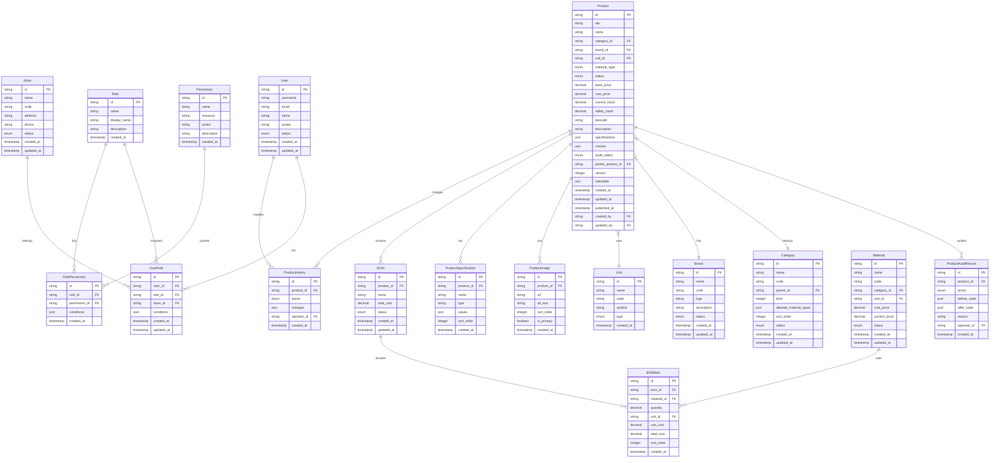

# 商品工作台数据模型设计

**版本**: 1.0
**日期**: 2025-12-10
**分支**: 1-product-workspace

## 实体关系图



## 核心实体定义

### 1. 用户与权限实体

#### User (用户)
```typescript
interface User {
  id: string                    // 用户唯一标识
  username: string              // 用户名
  email: string                 // 邮箱
  name: string                  // 真实姓名
  avatar?: string               // 头像URL
  phone?: string                // 手机号
  status: 'active' | 'inactive' | 'locked'  // 用户状态
  createdAt: Date               // 创建时间
  updatedAt: Date               // 更新时间
  lastLoginAt?: Date            // 最后登录时间
}
```

#### Role (角色)
```typescript
interface Role {
  id: string                    // 角色唯一标识
  name: string                  // 角色标识符
  displayName: string           // 角色显示名称
  description?: string          // 角色描述
  isSystem: boolean             // 是否系统角色
  createdAt: Date               // 创建时间
  updatedAt: Date               // 更新时间
}
```

#### Permission (权限)
```typescript
interface Permission {
  id: string                    // 权限唯一标识
  name: string                  // 权限名称
  resource: string              // 资源类型
  action: string                // 操作类型
  description?: string          // 权限描述
  createdAt: Date               // 创建时间
}
```

#### UserRole (用户角色关联)
```typescript
interface UserRole {
  id: string                    // 关联ID
  userId: string                // 用户ID
  roleId: string                // 角色ID
  storeId?: string              // 门店ID (店长角色需要)
  conditions?: {                // 额外条件限制
    scope?: string[]            // 数据范围
    limits?: Record<string, any> // 权限限制
  }
  createdAt: Date               // 创建时间
  updatedAt: Date               // 更新时间
}
```

### 2. 基础数据实体

#### Store (门店)
```typescript
interface Store {
  id: string                    // 门店唯一标识
  name: string                  // 门店名称
  code: string                  // 门店编码
  address?: string              // 地址
  phone?: string                // 联系电话
  status: 'active' | 'inactive' | 'closed'  // 门店状态
  createdAt: Date               // 创建时间
  updatedAt: Date               // 更新时间
}
```

#### Category (商品类目)
```typescript
interface Category {
  id: string                    // 类目唯一标识
  name: string                  // 类目名称
  code: string                  // 类目编码
  parentId?: string             // 父类目ID
  level: number                 // 类目层级
  allowedMaterialTypes: MaterialType[]  // 允许的物料类型
  sortOrder: number             // 排序顺序
  status: 'active' | 'inactive'  // 类目状态
  createdAt: Date               // 创建时间
  updatedAt: Date               // 更新时间
  children?: Category[]         // 子类目
}
```

#### Brand (品牌)
```typescript
interface Brand {
  id: string                    // 品牌唯一标识
  name: string                  // 品牌名称
  code: string                  // 品牌编码
  logo?: string                 // 品牌Logo
  description?: string          // 品牌描述
  status: 'active' | 'inactive'  // 品牌状态
  createdAt: Date               // 创建时间
  updatedAt: Date               // 更新时间
}
```

#### Unit (单位)
```typescript
interface Unit {
  id: string                    // 单位唯一标识
  name: string                  // 单位名称
  code: string                  // 单位编码
  symbol: string                // 单位符号
  type: 'weight' | 'volume' | 'count' | 'length' | 'area' | 'time'  // 单位类型
  createdAt: Date               // 创建时间
}
```

### 3. 商品核心实体

#### Product (商品)
```typescript
interface Product {
  id: string                    // 商品唯一标识
  sku: string                   // 商品SKU
  name: string                  // 商品名称
  categoryId: string            // 类目ID
  brandId?: string              // 品牌ID
  unitId: string                // 单位ID
  materialType: MaterialType    // 物料类型
  status: ProductStatus         // 商品状态
  basePrice: number             // 基础价格
  costPrice?: number            // 成本价格
  currentStock: number          // 当前库存
  safetyStock?: number          // 安全库存
  barcode?: string              // 条码
  description?: string          // 商品描述
  specifications?: ProductSpecification[]  // 规格属性
  content?: ProductContent      // 内容信息
  auditStatus: AuditStatus      // 审核状态
  parentProductId?: string      // 父商品ID (草稿版本关联)
  version: number               // 版本号
  metadata?: {                  // 元数据
    tags?: string[]
    attributes?: Record<string, any>
  }
  createdAt: Date               // 创建时间
  updatedAt: Date               // 更新时间
  publishedAt?: Date            // 发布时间
  createdBy: string             // 创建人ID
  updatedBy: string             // 更新人ID
}

enum MaterialType {
  FINISHED_GOOD = 'finished_good',    // 成品
  RAW_MATERIAL = 'raw_material',      // 原材料
  CONSUMABLE = 'consumable'           // 耗材
}

enum ProductStatus {
  DRAFT = 'draft',              // 草稿
  PENDING_REVIEW = 'pending_review', // 待审核
  PUBLISHED = 'published',      // 已发布
  REJECTED = 'rejected',        // 驳回
  ABNORMAL = 'abnormal',        // 异常
  OFFLINE = 'offline'           // 下架
}

enum AuditStatus {
  NONE = 'none',                // 无需审核
  PENDING = 'pending',          // 待审核
  APPROVED = 'approved',        // 已通过
  REJECTED = 'rejected'         // 已驳回
}
```

#### ProductContent (商品内容)
```typescript
interface ProductContent {
  images: ProductImage[]        // 商品图片
  videos?: ProductVideo[]       // 商品视频
  richText?: string             // 富文本描述
  shortDescription?: string     // 短描述
  specifications?: Spec[]       // 规格矩阵
}
```

#### ProductImage (商品图片)
```typescript
interface ProductImage {
  id: string                    // 图片唯一标识
  productId: string             // 商品ID
  url: string                   // 图片URL
  altText?: string              // 图片描述
  sortOrder: number             // 排序顺序
  isPrimary: boolean            // 是否主图
  createdAt: Date               // 创建时间
}
```

#### ProductSpecification (商品规格)
```typescript
interface ProductSpecification {
  id: string                    // 规格唯一标识
  productId: string             // 商品ID
  name: string                  // 规格名称
  type: 'text' | 'number' | 'select' | 'multiselect' | 'boolean'  // 规格类型
  values: any                   // 规格值
  sortOrder: number             // 排序顺序
  createdAt: Date               // 创建时间
}
```

### 4. BOM与材料实体

#### Material (物料)
```typescript
interface Material {
  id: string                    // 物料唯一标识
  name: string                  // 物料名称
  code: string                  // 物料编码
  categoryId: string            // 类目ID
  unitId: string                // 单位ID
  costPrice: number             // 成本价格
  currentStock: number          // 当前库存
  minStock?: number             // 最小库存
  maxStock?: number             // 最大库存
  supplierId?: string           // 供应商ID
  status: 'active' | 'inactive'  // 物料状态
  createdAt: Date               // 创建时间
  updatedAt: Date               // 更新时间
}
```

#### BOM (物料清单)
```typescript
interface BOM {
  id: string                    // BOM唯一标识
  productId: string             // 成品商品ID
  name: string                  // BOM名称
  totalCost: number             // 总成本
  status: 'active' | 'inactive' | 'draft'  // BOM状态
  createdAt: Date               // 创建时间
  updatedAt: Date               // 更新时间
}
```

#### BOMItem (BOM明细)
```typescript
interface BOMItem {
  id: string                    // BOM明细唯一标识
  bomId: string                 // BOM ID
  materialId: string            // 物料ID
  quantity: number              // 用量
  unitId: string                // 单位ID
  unitCost: number              // 单位成本
  totalCost: number             // 总成本
  sortOrder: number             // 排序顺序
  createdAt: Date               // 创建时间
}
```

### 5. 审计与历史实体

#### ProductAuditRecord (商品审核记录)
```typescript
interface ProductAuditRecord {
  id: string                    // 审核记录唯一标识
  productId: string             // 商品ID
  action: 'CREATE' | 'UPDATE' | 'DELETE' | 'STATUS_CHANGE' | 'PUBLISH'  // 操作类型
  beforeState?: Partial<Product> // 变更前状态
  afterState?: Partial<Product>  // 变更后状态
  reason?: string               // 操作原因
  operatorId: string            // 操作人ID
  createdAt: Date               // 操作时间
}
```

#### ProductHistory (商品历史记录)
```typescript
interface ProductHistory {
  id: string                    // 历史记录唯一标识
  productId: string             // 商品ID
  action: 'CREATE' | 'UPDATE' | 'DELETE' | 'STATUS_CHANGE'  // 操作类型
  changes: Record<string, {     // 变更详情
    old: any
    new: any
  }>
  operatorId: string            // 操作人ID
  createdAt: Date               // 操作时间
}
```

## 数据验证规则

### 商品实体验证
```typescript
const productValidation = {
  sku: {
    required: true,
    pattern: /^[A-Z0-9]{6,20}$/,
    unique: true
  },
  name: {
    required: true,
    minLength: 2,
    maxLength: 200
  },
  categoryId: {
    required: true,
    existsIn: 'Category'
  },
  basePrice: {
    required: true,
    min: 0,
    max: 999999.99,
    precision: 2
  },
  currentStock: {
    required: true,
    min: 0,
    precision: 3
  },
  barcode: {
    pattern: /^[0-9]{8,14}$/,
    unique: true
  }
}
```

### 状态转换验证
```typescript
const statusTransitions: Record<ProductStatus, ProductStatus[]> = {
  [ProductStatus.DRAFT]: [
    ProductStatus.PENDING_REVIEW,
    ProductStatus.OFFLINE
  ],
  [ProductStatus.PENDING_REVIEW]: [
    ProductStatus.PUBLISHED,
    ProductStatus.REJECTED,
    ProductStatus.DRAFT
  ],
  [ProductStatus.PUBLISHED]: [
    ProductStatus.OFFLINE,
    ProductStatus.ABNORMAL
  ],
  [ProductStatus.REJECTED]: [
    ProductStatus.DRAFT,
    ProductStatus.PENDING_REVIEW
  ],
  [ProductStatus.ABNORMAL]: [
    ProductStatus.PUBLISHED,
    ProductStatus.OFFLINE
  ],
  [ProductStatus.OFFLINE]: [
    ProductStatus.PUBLISHED,
    ProductStatus.DRAFT
  ]
}
```

## 索引设计

### 主要索引
```sql
-- 商品表索引
CREATE INDEX idx_product_sku ON products(sku);
CREATE INDEX idx_product_status ON products(status);
CREATE INDEX idx_product_category ON products(category_id);
CREATE INDEX idx_product_brand ON products(brand_id);
CREATE INDEX idx_product_created_at ON products(created_at);
CREATE INDEX idx_product_updated_at ON products(updated_at);

-- 复合索引
CREATE INDEX idx_product_status_category ON products(status, category_id);
CREATE INDEX idx_product_name_search ON products(name) USING gin(to_tsvector('chinese', name));

-- 用户角色索引
CREATE INDEX idx_user_role_user ON user_roles(user_id);
CREATE INDEX idx_user_role_role ON user_roles(role_id);
CREATE INDEX idx_user_role_store ON user_roles(store_id);

-- 审计记录索引
CREATE INDEX idx_audit_product ON product_audit_records(product_id);
CREATE INDEX idx_audit_operator ON product_audit_records(operator_id);
CREATE INDEX idx_audit_created_at ON product_audit_records(created_at);
```

## 性能考虑

### 1. 分表策略
- 商品表按状态分表：products_draft, products_published, products_archive
- 审计记录按月分表：product_audit_records_YYYYMM
- 历史记录按月分表：product_history_YYYYMM

### 2. 缓存策略
- 商品基础信息缓存（Redis，TTL: 1小时）
- 类目树结构缓存（Redis，TTL: 24小时）
- 用户权限缓存（Redis，TTL: 30分钟）

### 3. 分页查询优化
- 使用游标分页替代偏移分页
- 索引覆盖查询优化
- 查询结果预编译

## 数据完整性保证

### 1. 外键约束
```sql
-- 商品表外键
ALTER TABLE products ADD CONSTRAINT fk_product_category
  FOREIGN KEY (category_id) REFERENCES categories(id);
ALTER TABLE products ADD CONSTRAINT fk_product_brand
  FOREIGN KEY (brand_id) REFERENCES brands(id);
ALTER TABLE products ADD CONSTRAINT fk_product_unit
  FOREIGN KEY (unit_id) REFERENCES units(id);
ALTER TABLE products ADD CONSTRAINT fk_product_creator
  FOREIGN KEY (created_by) REFERENCES users(id);
```

### 2. 检查约束
```sql
-- 商品状态检查
ALTER TABLE products ADD CONSTRAINT chk_product_status
  CHECK (status IN ('draft', 'pending_review', 'published', 'rejected', 'abnormal', 'offline'));

-- 价格检查
ALTER TABLE products ADD CONSTRAINT chk_product_price
  CHECK (base_price >= 0 AND cost_price >= 0);

-- 库存检查
ALTER TABLE products ADD CONSTRAINT chk_product_stock
  CHECK (current_stock >= 0);
```

### 3. 触发器
```sql
-- 审计记录触发器
CREATE TRIGGER product_audit_trigger
  AFTER INSERT OR UPDATE OR DELETE ON products
  FOR EACH ROW EXECUTE FUNCTION create_product_audit_record();

-- 历史记录触发器
CREATE TRIGGER product_history_trigger
  AFTER UPDATE ON products
  FOR EACH ROW EXECUTE FUNCTION create_product_history_record();
```

---

**文档版本**: 1.0
**最后更新**: 2025-12-10
**下一步**: 生成API合同文档