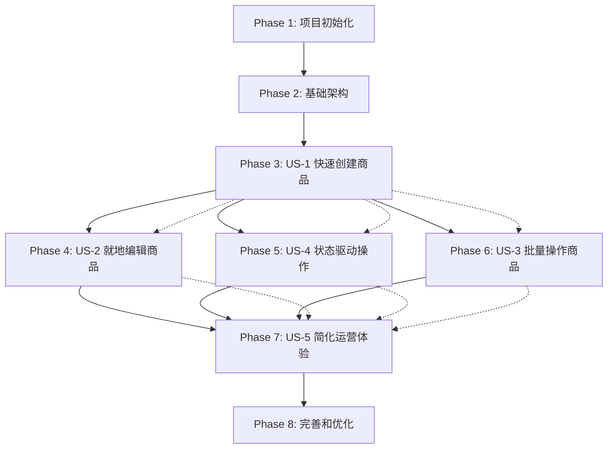

# 商品工作台实施任务清单

**功能**: 商品工作台（列表 + 创建/编辑合并）
**分支**: 1-product-workspace
**技术栈**: React 18 + TypeScript 5.0 + Ant Design 6.x + Tailwind CSS 4
**数据库**: PostgreSQL + Redis
**架构**: 前后端分离

---

## 实施策略

### MVP范围 (最小可行产品)
- **Phase 1-3**: 完成基础设施和用户故事1（快速创建商品）
- **目标**: 30秒内完成商品草稿创建，基本的单页双区布局

### 增量交付顺序
1. **Phase 1**: 项目初始化和基础设施
2. **Phase 2**: 基础架构和认证系统
3. **Phase 3**: US-1 快速创建商品 (P1)
4. **Phase 4**: US-2 就地编辑商品 (P1)
5. **Phase 5**: US-4 状态驱动操作 (P1)
6. **Phase 6**: US-3 批量操作商品 (P2)
7. **Phase 7**: US-5 简化运营体验 (P3)
8. **Phase 8**: 完善和优化

### 并行执行机会
- 前端组件开发可并行进行（无数据依赖）
- 基础数据模型创建可并行进行
- UI样式和布局可独立开发

---

## Phase 1: 项目初始化

**目标**: 建立完整的前后端项目结构和开发环境

- [ ] T001 初始化前端项目结构 per implementation plan
- [ ] T002 创建 backend 目录结构 per implementation plan
- [ ] T003 配置前端 TypeScript 和 Vite 开发环境 in frontend/
- [ ] T004 配置后端 TypeScript 和 Express 开发环境 in backend/
- [ ] T005 配置 Tailwind CSS 4 在 frontend/ 中
- [ ] T006 配置 ESLint 和 Prettier 在 frontend/ 和 backend/
- [ ] T007 创建环境配置文件 (.env, .env.example) 在项目根目录
- [ ] T008 配置数据库连接和基础设置 in backend/src/config/

---

## Phase 2: 基础架构和认证系统

**目标**: 建立数据库模型、认证系统和核心中间件

### 数据模型层
- [ ] T009 [P] 创建 User 实体模型 in backend/src/models/User.ts
- [ ] T010 [P] 创建 Role 实体模型 in backend/src/models/Role.ts
- [ ] T011 [P] 创建 Permission 实体模型 in backend/src/models/Permission.ts
- [ ] T012 [P] 创建 UserRole 关联模型 in backend/src/models/UserRole.ts
- [ ] T013 [P] 创建 RolePermission 关联模型 in backend/src/models/RolePermission.ts
- [ ] T014 [P] 创建 Category 实体模型 in backend/src/models/Category.ts
- [ ] T015 [P] 创建 Product 实体模型 in backend/src/models/Product.ts
- [ ] T016 [P] 创建 ProductAuditRecord 实体模型 in backend/src/models/ProductAuditRecord.ts

### 认证和权限系统
- [ ] T017 实现 JWT 认证中间件 in backend/src/middleware/auth.ts
- [ ] T018 实现 Casbin 权限验证中间件 in backend/src/middleware/permission.ts
- [ ] T019 创建认证服务层 in backend/src/services/authService.ts
- [ ] T020 创建权限服务层 in backend/src/services/permissionService.ts

### API 路由基础
- [ ] T021 [P] 创建认证 API 路由 in backend/src/api/auth/index.ts
- [ ] T022 [P] 实现 /auth/login 端点 in backend/src/api/auth/login.ts
- [ ] T023 [P] 实现 /auth/refresh 端点 in backend/src/api/auth/refresh.ts
- [ ] T024 创建通用错误处理中间件 in backend/src/middleware/errorHandler.ts
- [ ] T025 创建请求验证中间件 in backend/src/middleware/validation.ts

---

## Phase 3: US-1 快速创建商品 (P1)

**目标**: 实现30秒内完成商品草稿创建的核心功能

**独立测试标准**:
- 用户能在30秒内完成商品基本信息录入
- 商品草稿成功保存到数据库
- 新建商品出现在列表中并高亮显示
- 右侧面板自动打开编辑模式

### 基础数据服务
- [ ] T026 [US1] 创建商品服务层 in backend/src/services/productService.ts
- [ ] T027 [US1] 创建类目服务层 in backend/src/services/categoryService.ts
- [ ] T028 [US1] 创建品牌服务层 in backend/src/services/brandService.ts
- [ ] T029 [US1] 创建单位服务层 in backend/src/services/unitService.ts

### 商品 CRUD API
- [ ] T030 [P] [US1] 创建商品 API 路由 in backend/src/api/products/index.ts
- [ ] T031 [P] [US1] 实现 GET /products 端点（商品列表） in backend/src/api/products/list.ts
- [ ] T032 [P] [US1] 实现 POST /products 端点（创建商品） in backend/src/api/products/create.ts
- [ ] T033 [P] [US1] 实现 GET /products/{id} 端点（商品详情） in backend/src/api/products/detail.ts
- [ ] T034 [P] [US1] 实现 PUT /products/{id} 端点（更新商品） in backend/src/api/products/update.ts

### 基础数据 API
- [ ] T035 [P] [US1] 创建基础数据 API 路由 in backend/src/api/baseData/index.ts
- [ ] T036 [P] [US1] 实现 GET /categories 端点 in backend/src/api/baseData/categories.ts
- [ ] T037 [P] [US1] 实现 GET /brands 端点 in backend/src/api/baseData/brands.ts
- [ ] T038 [P] [US1] 实现 GET /units 端点 in backend/src/api/baseData/units.ts

### 前端状态管理
- [ ] T039 [US1] 创建认证状态管理 in frontend/src/stores/authStore.ts
- [ ] T040 [US1] 创建商品状态管理 in frontend/src/stores/productStore.ts
- [ ] T041 [US1] 创建权限状态管理 in frontend/src/stores/permissionStore.ts

### 前端服务层
- [ ] T042 [P] [US1] 创建 API 客户端 in frontend/src/services/apiClient.ts
- [ ] T043 [P] [US1] 创建认证服务 in frontend/src/services/authService.ts
- [ ] T044 [P] [US1] 创建商品服务 in frontend/src/services/productService.ts
- [ ] T045 [P] [US1] 创建基础数据服务 in frontend/src/services/baseDataService.ts

### 核心组件开发
- [ ] T046 [P] [US1] 创建权限控制组件 in frontend/src/components/common/AccessControl.tsx
- [ ] T047 [P] [US1] 创建加载状态组件 in frontend/src/components/common/LoadingSpinner.tsx
- [ ] T048 [P] [US1] 创建错误边界组件 in frontend/src/components/common/ErrorBoundary.tsx

### 页面布局组件
- [ ] T049 [US1] 创建商品工作台主布局 in frontend/src/pages/Products/ProductsWorkspace.tsx
- [ ] T050 [US1] 创建顶部工具栏组件 in frontend/src/components/layout/TopToolbar.tsx
- [ ] T051 [US1] 创建左侧筛选区域 in frontend/src/components/product/ProductFilter.tsx
- [ ] T052 [US1] 创建右侧编辑面板 in frontend/src/components/product/ProductPanel.tsx

### 商品核心组件
- [ ] T053 [P] [US1] 创建商品表格组件 in frontend/src/components/product/ProductTable.tsx
- [ ] T054 [P] [US1] 创建商品表单组件 in frontend/src/components/product/ProductForm.tsx
- [ ] T055 [US1] 创建类目选择器组件 in frontend/src/components/product/CategorySelector.tsx
- [ ] T056 [P] [US1] 创建商品操作按钮组件 in frontend/src/components/product/ProductActions.tsx

### 自定义 Hooks
- [ ] T057 [P] [US1] 创建权限检查 Hook in frontend/src/hooks/usePermissions.ts
- [ ] T058 [P] [US1] 创建商品数据 Hook in frontend/src/hooks/useProducts.ts
- [ ] T059 [P] [US1] 创建认证 Hook in frontend/src/hooks/useAuth.ts

### TypeScript 类型定义
- [ ] T060 [P] [US1] 创建商品相关类型定义 in frontend/src/types/product.ts
- [ ] T061 [P] [US1] 创建用户和权限类型定义 in frontend/src/types/auth.ts
- [ ] T062 [P] [US1] 创建 API 响应类型定义 in frontend/src/types/api.ts

### 路由和导航
- [ ] T063 [US1] 配置前端路由 in frontend/src/router/index.ts
- [ ] T064 [US1] 创建登录页面 in frontend/src/pages/Login/LoginPage.tsx
- [ ] T065 [US1] 创建商品工作台页面路由配置

### 表单验证
- [ ] T066 [US1] 创建商品表单验证规则 using Zod in frontend/src/validation/productSchema.ts
- [ ] T067 [US1] 实现实时 SKU 重复检查 in frontend/src/services/skuValidation.ts

---

## Phase 4: US-2 就地编辑商品 (P1)

**目标**: 在查看商品列表的同时编辑商品信息，避免页面跳转

**独立测试标准**:
- 点击商品行能打开右侧编辑面板
- 根据权限和状态显示编辑/只读模式
- 修改后能保存草稿或提交审核
- 列表数据实时更新

### 后端增强
- [ ] T068 [US2] 实现 POST /products/{id}/submit-review 端点 in backend/src/api/products/submitReview.ts
- [ ] T069 [US2] 增强 ProductService 的状态验证逻辑 in backend/src/services/productService.ts
- [ ] T070 [US2] 实现商品变更历史记录 in backend/src/services/productHistoryService.ts

### 前端增强
- [ ] T071 [P] [US2] 增强商品面板的状态模式切换 in frontend/src/components/product/ProductPanel.tsx
- [ ] T072 [P] [US2] 实现商品面板的查看模式 in frontend/src/components/product/ProductViewMode.tsx
- [T073] [P] [US2] 实现商品面板的编辑模式 in frontend/src/components/product/ProductEditMode.tsx
- [ ] T074 [P] [US2] 创建草稿保存和审核提交功能 in frontend/src/components/product/ProductActions.tsx

### UI 交互优化
- [ ] T075 [US2] 实现行点击打开面板的交互 in frontend/src/components/product/ProductTable.tsx
- [ ] T076 [US2] 实现面板状态保持（关闭后保留编辑状态） in frontend/src/hooks/useProductPanel.ts
- [ ] T077 [US2] 添加未保存离开的确认对话框 in frontend/src/components/common/UnsavedChangesDialog.tsx

---

## Phase 5: US-4 状态驱动操作 (P1)

**目标**: 根据商品状态智能显示相关操作按钮

**独立测试标准**:
- 不同商品状态显示对应的操作按钮
- 按钮状态根据权限实时更新
- 避免用户执行无效操作

### 后端权限增强
- [ ] T078 [US4] 实现基于状态的权限验证 in backend/src/middleware/permission.ts
- [ ] T079 [US4] 创建商品操作权限检查服务 in backend/src/services/productPermissionService.ts

### 前端状态管理
- [ ] T080 [P] [US4] 增强权限 Hook 支持状态检查 in frontend/src/hooks/usePermissions.ts
- [ ] T081 [P] [US4] 创建商品状态操作配置 in frontend/src/config/productActions.ts
- [ ] T082 [P] [US4] 实现动态操作按钮组件 in frontend/src/components/product/StatusActions.tsx

### UI 状态显示
- [ ] T083 [US4] 创建商品状态标签组件 in frontend/src/components/product/StatusTag.tsx
- [ ] T084 [US4] 实现行内状态指示器（角标、徽章） in frontend/src/components/product/StatusIndicators.tsx
- [ ] T085 [US4] 优化表格行的状态显示 in frontend/src/components/product/ProductTable.tsx

---

## Phase 6: US-3 批量操作商品 (P2)

**目标**: 批量处理多个商品，提高工作效率

**独立测试标准**:
- 支持选择多个商品（≤50个）
- 实现批量提交审核功能
- 支持批量导出功能
- 显示批量操作结果

### 后端批量操作 API
- [ ] T086 [US3] 创建批量操作服务 in backend/src/services/batchOperationService.ts
- [ ] T087 [P] [US3] 实现 POST /products/batch 端点 in backend/src/api/products/batch.ts
- [ ] T088 [US3] 实现批量操作的权限验证 in backend/src/services/batchPermissionService.ts

### 前端批量操作
- [ ] T089 [P] [US3] 实现表格行选择功能 in frontend/src/components/product/ProductTable.tsx
- [ ] T090 [P] [US3] 创建批量操作工具条 in frontend/src/components/product/BatchActions.tsx
- [ ] T091 [P] [US3] 实现批量操作确认对话框 in frontend/src/components/product/BatchConfirmDialog.tsx
- [ ] T092 [US3] 创建批量操作结果显示组件 in frontend/src/components/product/BatchResult.tsx

### 批量操作 UI 优化
- [ ] T093 [US3] 实现全选/反选功能 in frontend/src/hooks/useBatchSelection.ts
- [ ] T094 [US3] 添加批量操作的数量限制检查 in frontend/src/utils/batchValidation.ts
- [ ] T095 [US3] 优化批量操作的性能显示（进度条） in frontend/src/components/common/ProgressBar.tsx

---

## Phase 7: US-5 简化运营体验 (P3)

**目标**: 系统界面简洁高效，只显示核心功能

**独立测试标准**:
- 界面布局清晰简洁
- 信息层次分明
- 操作流程直观
- 避免信息过载

### UI 简化优化
- [ ] T096 [P] [US5] 优化响应式布局设计 in frontend/src/components/layout/ResponsiveLayout.tsx
- [ ] T097 [P] [US5] 简化筛选区域的 UI 设计 in frontend/src/components/product/ProductFilter.tsx
- [ ] T098 [P] [US5] 优化表格列的显示优先级 in frontend/src/components/product/ProductTable.tsx
- [ ] T099 [P] [US5] 实现界面主题切换（明/暗模式） in frontend/src/components/theme/ThemeProvider.tsx

### 用户体验优化
- [ ] T100 [US5] 添加操作成功/失败的 Toast 提示 in frontend/src/components/common/Toast.tsx
- [ ] T101 [US5] 实现搜索防抖优化 in frontend/src/hooks/useDebounceSearch.ts
- [ ] T102 [US5] 添加键盘快捷键支持 in frontend/src/hooks/useKeyboardShortcuts.ts
- [ ] T103 [US5] 优化移动端显示效果 in frontend/src/components/layout/MobileLayout.tsx

---

## Phase 8: 完善和优化

**目标**: 性能优化、测试完善、文档补充

### 性能优化
- [ ] T104 [P] 实现虚拟滚动优化大列表性能 in frontend/src/components/common/VirtualTable.tsx
- [ ] T105 实现API响应缓存策略 in backend/src/middleware/cache.ts
- [ ] T106 优化数据库查询性能（索引优化） in backend/src/config/database.ts

### 错误处理和日志
- [ ] T107 完善前端错误边界处理 in frontend/src/components/common/ErrorBoundary.tsx
- [ ] T108 实现后端结构化日志记录 in backend/src/utils/logger.ts
- [ ] T109 添加 API 请求重试机制 in frontend/src/services/apiClient.ts

### 测试覆盖
- [ ] T110 [P] 创建前端组件单元测试 in frontend/tests/components/
- [ ] T111 [P] 创建前端 E2E 测试 using Playwright in frontend/tests/e2e/
- [ ] T112 [P] 创建后端 API 集成测试 in backend/tests/integration/

### 文档和部署
- [ ] T113 完善 API 文档（Swagger） in backend/docs/
- [ ] T114 创建用户操作手册 in docs/user-guide.md
- [ ] T115 创建开发者文档 in docs/developer-guide.md

---

## 任务依赖关系



### 关键依赖说明
- **Phase 1-2** 必须顺序完成，为后续功能提供基础设施
- **Phase 3-6** 可以部分并行开发，但核心功能依赖 Phase 3 的基础
- **Phase 8** 可以在前面阶段进行中提前启动

---

## 并行执行策略

### Phase 1 内并行组
```bash
# 组1: 前端基础设置
T003 + T005 + T006

# 组2: 后端基础设置
T004 + T006

# 组3: 项目结构
T001 + T002
```

### Phase 2 内并行组
```bash
# 组1: 数据模型层（可完全并行）
T009 + T010 + T011 + T012 + T013 + T014 + T015 + T016

# 组2: 认证系统
T017 + T019 + T020

# 组3: API 路由
T021 + T022 + T023 + T024 + T025
```

### Phase 3 内并行组
```bash
# 组1: 后端服务层
T026 + T027 + T028 + T029

# 组2: 后端 API 层
T030 + T031 + T032 + T033 + T034 + T035 + T036 + T037 + T038

# 组3: 前端状态管理
T039 + T040 + T041

# 组4: 前端服务层
T042 + T043 + T044 + T045

# 组5: 前端组件
T046 + T047 + T048 + T053 + T054 + T055 + T056
```

---

## 风险控制和质量保证

### 关键检查点
1. **Phase 2 完成**: 认证和权限系统必须完全工作
2. **Phase 3 完成**: MVP核心功能必须可演示
3. **每个用户故事完成**: 必须达到独立测试标准

### 质量标准
- 所有代码必须通过 ESLint 检查
- 所有 API 必须有错误处理
- 所有用户操作必须有反馈
- 关键功能必须有测试覆盖

### 回退计划
- 每个阶段完成后创建 Git 标签
- 保留每个 MVP 版本的完整备份
- 关键功能模块可以独立降级

---

## 任务统计

- **总任务数**: 115
- **Phase 1**: 8 个任务
- **Phase 2**: 18 个任务
- **Phase 3 (US-1)**: 37 个任务
- **Phase 4 (US-2)**: 8 个任务
- **Phase 5 (US-4)**: 8 个任务
- **Phase 6 (US-3)**: 10 个任务
- **Phase 7 (US-5)**: 8 个任务
- **Phase 8**: 18 个任务

**可并行任务数**: 67 个 (58%)
**必须顺序执行任务数**: 48 个 (42%)

---

**最后更新**: 2025-12-10
**生成者**: speckit.tasks 命令
**版本**: 1.0