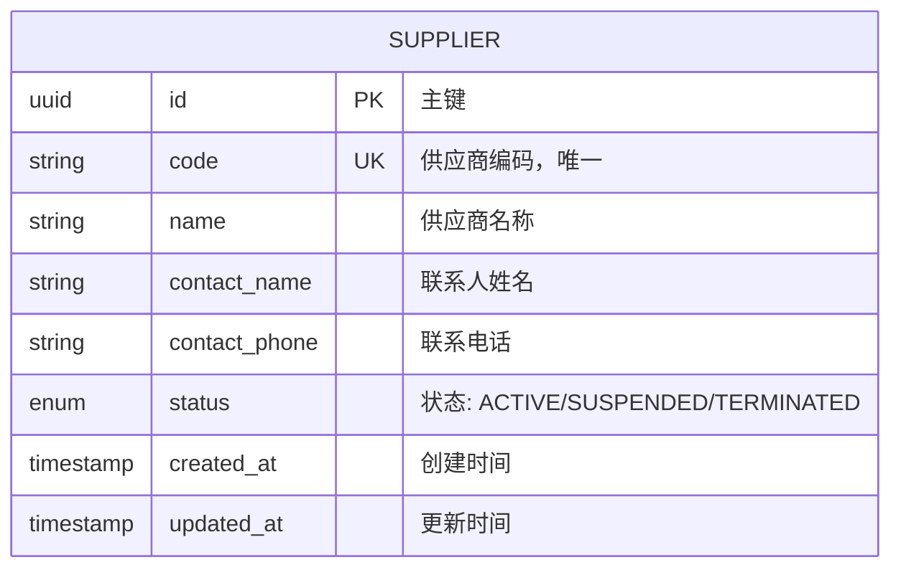

# Data Model: 供应商编辑功能

**@spec N003-supplier-edit**
**Date**: 2026-01-11

## 实体关系图



## 数据表结构

### suppliers 表

| 字段 | 类型 | 约束 | 说明 |
|------|------|------|------|
| id | UUID | PK, NOT NULL | 主键，自动生成 |
| code | VARCHAR(50) | UNIQUE, NOT NULL | 供应商编码 |
| name | VARCHAR(200) | NOT NULL | 供应商名称 |
| contact_name | VARCHAR(100) | NULL | 联系人姓名 |
| contact_phone | VARCHAR(20) | NULL | 联系电话 |
| status | VARCHAR(20) | DEFAULT 'ACTIVE' | 状态枚举 |
| created_at | TIMESTAMP | NOT NULL | 创建时间 |
| updated_at | TIMESTAMP | NOT NULL | 更新时间 |

**索引**:
- `idx_suppliers_code` - code 字段唯一索引
- `idx_suppliers_status` - status 字段索引

## 枚举定义

### SupplierStatus

| 值 | 说明 | 前端显示 |
|----|------|---------|
| ACTIVE | 启用 | 启用 (绿色) |
| SUSPENDED | 暂停 | 暂停 (黄色) |
| TERMINATED | 终止 | 终止 (红色) |

## DTO 定义

### SupplierCreateRequest（创建请求）

```java
public class SupplierCreateRequest {
    @NotBlank(message = "供应商编码不能为空")
    @Size(max = 50, message = "供应商编码最大长度为50")
    private String code;

    @NotBlank(message = "供应商名称不能为空")
    @Size(max = 200, message = "供应商名称最大长度为200")
    private String name;

    @Size(max = 100, message = "联系人姓名最大长度为100")
    private String contactName;

    @Pattern(regexp = "^1[3-9]\\d{9}$", message = "请输入正确的手机号")
    private String contactPhone;

    @NotNull(message = "状态不能为空")
    private SupplierStatus status;
}
```

### SupplierUpdateRequest（更新请求）

```java
public class SupplierUpdateRequest {
    // 注意：不包含 code 字段，编码创建后不可修改

    @NotBlank(message = "供应商名称不能为空")
    @Size(max = 200, message = "供应商名称最大长度为200")
    private String name;

    @Size(max = 100, message = "联系人姓名最大长度为100")
    private String contactName;

    @Pattern(regexp = "^1[3-9]\\d{9}$", message = "请输入正确的手机号")
    private String contactPhone;

    @NotNull(message = "状态不能为空")
    private SupplierStatus status;
}
```

## 前后端字段映射

| 前端字段 | 前端类型 | 后端 DTO 字段 | 后端类型 | 数据库字段 |
|---------|---------|--------------|---------|-----------|
| code | string | code | String | code |
| name | string | name | String | name |
| contactPerson | string | contactName | String | contact_name |
| contactPhone | string | contactPhone | String | contact_phone |
| status | SupplierStatus | status | SupplierStatus | status |

**注意**: 前端使用 `contactPerson`，后端使用 `contactName`，需要在 API 层进行映射。

## 验证规则

### 创建时验证

| 字段 | 规则 | 错误消息 |
|------|------|---------|
| code | 非空，最大50字符，唯一 | 供应商编码不能为空 / 编码已存在 |
| name | 非空，最大200字符 | 供应商名称不能为空 |
| contactPhone | 可选，符合手机号格式 | 请输入正确的手机号 |
| status | 非空，有效枚举值 | 状态不能为空 |

### 更新时验证

| 字段 | 规则 | 错误消息 |
|------|------|---------|
| id | 必须存在对应记录 | 供应商不存在 |
| name | 非空，最大200字符 | 供应商名称不能为空 |
| contactPhone | 可选，符合手机号格式 | 请输入正确的手机号 |
| status | 非空，有效枚举值 | 状态不能为空 |
